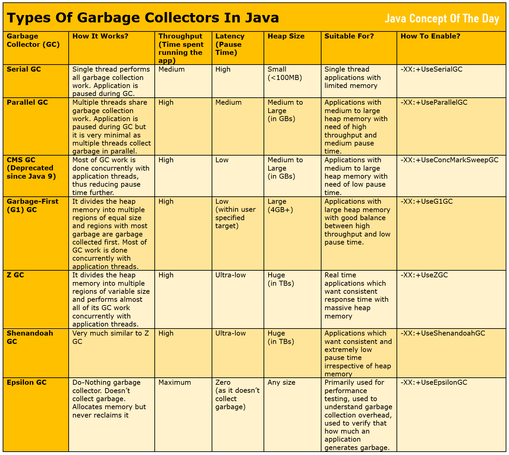

# Types Of Garbage Collectors In Java
Robust garbage collection mechanism is a must for the success of any programming language. Removing unwanted objects from the heap memory so that new objects can occupy that memory is called garbage collection. Garbage collection in Java is fully automated. Java developers need not to worry about memory management in Java. JVM does this for you. Java has different types of garbage collectors designed for different requirements and conditions. In this post, we will see different types of garbage collectors in Java.

## Types Of Garbage Collectors In Java :
There are total 7 types of garbage collectors available in Java.

1. Serial Garbage Collector

2. Parallel Garbage Collector

3. Concurrent Mark-Sweep (CMS) Garbage Collector

4. Garbage-First (G1) Garbage Collector

5. Z Garbage Collector

6. Shenandoah Garbage Collector

7. Epsilon Garbage Collector

Let’s see these garbage collectors one by one.

## 1) Serial Garbage Collector
- Simple and oldest garbage collector in Java.
- Single thread performs all garbage collection work.
- As all of garbage collection work is done by a single thread, there will be no communication overhead between the threads.
- It follows “Stop-The-World” approach i.e application is paused during garbage collection.
- Best suited for single thread applications or small scale applications with limited heap memory say below 100MB.
- How to enable? : -XX:+UseSerialGC

## 2) Parallel Garbage Collector
- Multiple threads share the garbage collection work.
- It divides the heap memory into smaller regions and uses multiple threads to collect the garbage from those regions. - All threads execute their work parallelly. Hence the name parallel garbage collector.
- It also uses “Stop-the-world” approach. But, pause time is reduced as multiple threads are used for garbage collection.
- It is designed to maximize the throughput (time spent running the  app) and minimize the latency (time spent doing GC).
- Best suited for applications with medium to large heap memory with need of high throughput and occasional medium pause time.
- How to enable? : -XX:+UseParallelGC

## 2) Parallel Garbage Collector
- Multiple threads share the garbage collection work.
- It divides the heap memory into smaller regions and uses multiple threads to collect the garbage from those regions. - - All threads execute their work parallelly. Hence the name parallel garbage collector.
- It also uses “Stop-the-world” approach. But, pause time is reduced as multiple threads are used for garbage collection.
- It is designed to maximize the throughput (time spent running the  app) and minimize the latency (time spent doing GC).
- Best suited for applications with medium to large heap memory with need of high throughput and occasional medium pause time.
- How to enable? : -XX:+UseParallelGC

## 3) Concurrent Mark-Sweep (CMS) Garbage Collector
- It is deprecated from Java 9. It is removed in Java 14.
- It performs most of the garbage collection work concurrently with application threads. Thus reducing the pause time.
- It can cause fragmentation issues for larger heaps.
Have higher CPU usage.
- Doesn’t perform as expected for applications with large heap memory.
- How to enable? : -XX:+UseConcMarkSweepGC

## 4) Garbage-First (G1) Garbage Collector
- Default garbage collector since Java 9.
- It divides the heap memory into multiple regions of equal size and regions with most garbage are garbage collected first. Hence the name Garbage-First.
- Most of the garbage collection work is performed concurrently with application threads.
- It tries to keep pause time within user specified target.
- Most suitable for applications with large heap memory say 4GB or more and with good balance between high throughput and low pause time.
- How to enable? : -XX:+UseG1GC

## 5) Z Garbage Collector (ZGC)

- It is introduced as a preview feature in Java 11 and made production ready from Java 15.
- It divides the heap memory into multiple regions of variable size.
- It performs almost all of its GC work concurrently with application threads.
- It is designed for those applications which need ultra-low pause time (say less than 10ms) even with large heap memory (say in TBs).
- Most suitable for real time applications like real time trading applications which want consistent response time with massive heap memory.
- How to enable : -XX:+UseZGC

## 6) Shenandoah Garbage Collector
- It is very much similar to Z garbage collector.
- It is also designed for those applications where ultra low pause time is required even with larger heap memory.
- It promises to give consistent and extremely low pause time irrespective of how big is the heap memory.
- Good alternative to Z garbage collector.
- How to enable? : -XX:+UseShenandoahGC

## 7) Epsilon Garbage Collector
- Do-Nothing garbage collector.
- Allocates memory but never reclaims it.
- Primarily used for performance testing, used to understand garbage collection overhead, used to verify that how much an application generates garbage.
- It causes OutOfMemoryError if heap becomes full.
- How to enable? : -XX:+UseEpsilonGC

## Throughput Vs Latency Of Garbage Collectors :

Throughput and latency are two parameters used to determine the performance of garbage collectors in Java.

**Throughput :**

It is the percentage of total time spent running the actual application than the time spent collecting the garbage.

For example, if an application runs for 90 seconds and collects garbage for 10 seconds, then throughput = 90%.

Higher the throughput, garbage collector is said to be good.

**Latency :**

It is the time an application is paused for collecting the garbage. Lower the latency, garbage collector is said to be good.

For example, if an application pauses for 10ms for every GC event, then latency is 10ms per GC event.

Below table summarizes all garbage collectors in Java with their internal working, throughput, latency, heap size and use cases.

