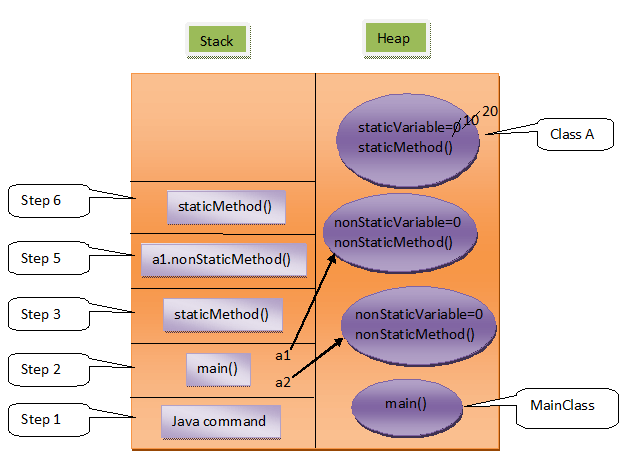

# Non-Static Members And Their Memory Management In Java

Yesterday. we have discussed about static components of a class. Today we will see non-static components of a class.

Let’s start with simple definitions of class and object.

Class : Class is the model/template/blueprint for the objects to be created of its type.

Object : It is an instance of a class. It is the real-time copy of class.

If you don’t understand with the definitions, read out this example. A class is like a blue print of a house. With this blueprint, you can build any number of houses. Each house build with this blueprint is an object or an instance of that blue print.

Non-Static variables and Non-Static methods are non-satic components of a class. These are also called instance components of a class. Non-static components are stored inside the object memory. Each object will have their own copy of non-static components. But, satic components are common to all objects of that class.

Let's have look at this example.


```java
class A
{
     int nonStaticVariable;
     static int staticVariable;
 
     static void staticMethod()
     {
          System.out.println(staticVariable);
     //   System.out.println(nonStaticVariable);
     }
 
     void nonStaticMethod()
     {
          System.out.println(staticVariable);
          System.out.println(nonStaticVariable);
     }
}
 
class MainClass
{
     public static void main(String[] args)
     {
          A.staticVariable = 10;
     //   A.nonStaticVariable = 10;
          A.staticMethod();
    //    A.nonStaticMethod();
 
          A a1 = new A();
          A a2 = new A();
 
          System.out.println(a1.nonStaticVariable);
          System.out.println(a1.staticVariable);
          a1.nonStaticMethod();
          a1.staticMethod();
 
          System.out.println(a2.staticVariable);
          a1.staticVariable = 20;
          System.out.println(a2.staticVariable);
     }
}
```

Let’s discuss memory allocation of above example step by step.

**Step 1 :**

When you trigger >java MainClass, java command divides allocated memory into two parts – stack and heap. First java command enters stack for execution. First it loads class MainClass into heap memory. Randomly some memory is allocated to MainClass. All static members are loaded into this class memory. There is only one static member in MainClass i.e main() method. It is loaded into class memory. After loading static members, SIBs are executed. But there is no SIBs in MainClass. So, directly java command calls main() method for execution.

**Step 2 :**

main() method enters stack for execution. First statement (Line 23) refers to class A. First it checks whether class A is loaded into heap memory or not. If it is not loaded, it loads class A into heap memory. Randomly some memory is allocated to class A. All static members of class A , ‘staticVariable’ and ‘staticMethod()’ , are loaded into this memory. ‘staticVariable’ is first initialized with default value 0. No SIBs in Class A. So, after loading static members, main() method assigns value 10 to ‘staticVariable’ of class A.

Second statement (Line 24) of main() method is commented. Because, you can’t refer a non-static members through a class name. Because, non-static members are stored inside the object memory. You have to refer them through objects only.

**Step 3 :**

In Line 25, it calls staticMethod() of class A. staticMethod() comes to stack for execution. First statement(Line 8) prints value of ‘staticVariable’ i. e 10 on the console.

Second statement(Line 9) is commented. Because, directly you can’t use non-static member inside a static method. Because, non-static members are stored inside the object memory. You have to create objects to use them. You have to refer them through objects only.

No statements left in staticMethod(). So, it leaves the stack memory.

**Step 4 :**

Control comes back to main() method. The next statement (Line 26) is also commented. Because, You can’t refer non-static member through a class name. In the next statement (Line 28), an object of class A type is created. Randomly, some memory is allocated to object. All non-static members, ‘nonStaticVariable’ and ‘nonStaticMethod()’,  of class A are loaded into this object memory. ‘nonStaticVariable’ is a global variable, so it is first initialized with default value 0. A reference variable of type class A  ‘a1’  is created in main() method. It points to this newly created object.

In the same manner, object ‘a2’ is also created (Line 29). In the next statement (Line 31), value of ‘nonStaticVariable’ of ‘a1’ i.e 0 is printed. In the next statement (Line 32), value of ‘staticVariable’ of class A i.e 10 is printed.

You can refer a static member of a class through object of that class like in Line 32. Whenever you refer a static member through a object, compiller replaces object name with its class name like a1.staticVariable is treated as A.staticVariable by the compiler.

In the next statement (Line 33), it calls ‘nonStaticMethod()’ of a1.

**Step 5 :**

‘nonStaticMethod()’ of a1 comes to the stack for execution. First statement (Line 14) prints value of  ‘staticVariable’ of class A i.e 10 on the console. Second statement (Line 15) prints the value of ‘nonStaticVariable’ of a1 i.e 0. There are no other statements left in ‘nonStaticMethod()’ , so it leaves the stack.

**Step 6 :**

Control comes back to Line 34 of main() method. It calls staticMethod() of class A. ‘staticMethod()’ enters the stack for execution. First statment (Line 8) prints value of  ‘staticVariable’  i.e 10 on the console. It leaves the memory after executing this statement.

**Step 7 :**

Control comes back to the main() method. Line 36 prints value of ‘staticVariable’ i.e 10 on the console through object a2. In the next statement it changes value of ‘staticVariable’ to 20 through a1. In the next statement, again it prints the value of ‘staticVariable’ through a2. This time 20 is printed on the console.

This means changes made to static components through one object is reflected in another object also. Because, the same copy of static components is available to all the objects of that class.

As all statements are executed, first main() method then java command leaves the stack memory.

Diagramatic representation of memory allocation of above program looks like this,



```java
Output :

10
0
10
10
0
10
10
20
```