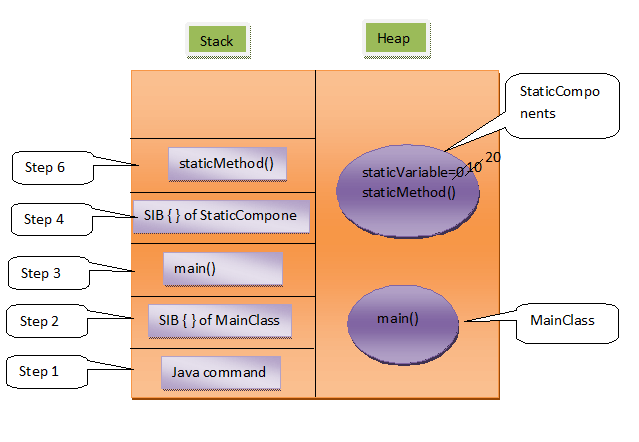

# SIB – Static Initialization Block, Static Variables And Static Methods

Static variables, Static Initialization Block and Static Methods – these all are static components or static members of a class. These static members are stored inside the Class Memory. To access static members, you need not to create objects. Directly you can access them with class name.

Static Initialization Block is used to initialize only static variables. It is a block without a name. It contains set of statements enclosed within { }. The syntax of SIB looks like this,

```java
static
{
     //Set Of Statements
}
```

Consider the following program.

```java
class StaticComponents
{
     static int staticVariable;
 
     static
     {
          System.out.println("StaticComponents SIB");
          staticVariable = 10;
     }
 
     static void staticMethod()
     {
          System.out.println("From StaticMethod");
          System.out.println(staticVariable);
     }
}
 
public class MainClass
{
     static
     {
          System.out.println("MainClass SIB");
     }
 
     public static void main(String[] args)
     {
         //Static Members directly accessed with Class Name
          StaticComponents.staticVariable = 20;
          StaticComponents.staticMethod();
     }
}
```

Let us discuss execution of above program step by step.

**Step 1:**

When you trigger >java MainClass, java command divides allocated memory into two parts – Stack and Heap. First, java command enters stack memory for execution. First, it checks whether MainClass is loaded into heap memory or not. If it is not loaded, loading operation of MainClass starts. Randomly some memory space is allocated to MainClass. It is called Class memory. All static members are loaded into this class memory. There is only one satic member in MainClass – main() method. It is loaded into class memory of MainClass.

**Step 2:**

After loading all static members, SIB – Static initialization Blocks are executed. Remember, SIBs are not stored in the heap memory. They just come to stack, execute their tasks and leaves the memory. So, after loading main() method, SIB of MainClass enters stack for execution. There is only one statement (Line 22) in SIB. it is executed. It prints “MainClass SIB” on console. After executing this statement, SIB leaves the stack memory.

**Step 3:**

Now, java command calls main() method for execution. main() method enters the stack. First statement (Line 28) is executed first. First, It checks whether class StaticComponents is loaded into memory. If it is not loaded, loading operation of StaticComponents takes place. Randomly, some memory is allocated to Class StaticComponents, then all static members of StaticComponents – ‘staticVariable’ and ‘staticMethod()’ are loaded into that class memory. ‘staticVariable’ is a global variable. So, first it is initialized with default value i.e 0.

**Step 4 :**

After loading all static members of StaticComponents, SIB blocks are executed. So, SIB of class StaticComponents enters the stack for execution. First Statement (Line 7) is executed. It prints “StaticComponents SIB” on the console. In the second statement, value 10 is assigned to ‘staticVariable’. There are no other statements left for execution, so it leaves stack memory.

**Step 5 :**

Now control comes back to main() method. The remaining part of first statement i.e value 20 is assigned to ‘staticVariable’ of class StaticComponents, is executed. In the second statement (Line 29), it calls staticMethod() of class StaticComponents for execution.


**Step 6:**

staticMethod() of StaticComponents enters stack for execution.  First statement (Line 13) is executed first. It prints “From staticMethod” on the console. In the second statement (Line 14), it prints the value of staticVariable i.e 20 on the console. There are no statements left. so, it leaves the stack.

**Step 7:**

Again, control comes back to main() method. There are no other statements left in main() method. so, it also leaves stack. java command also leaves the stack.

Diagramatic representation of memory allocation of above program looks like this.



```java
Output :

Main Class SIB
StaticComponents SIB
From StaticMethod
20
```