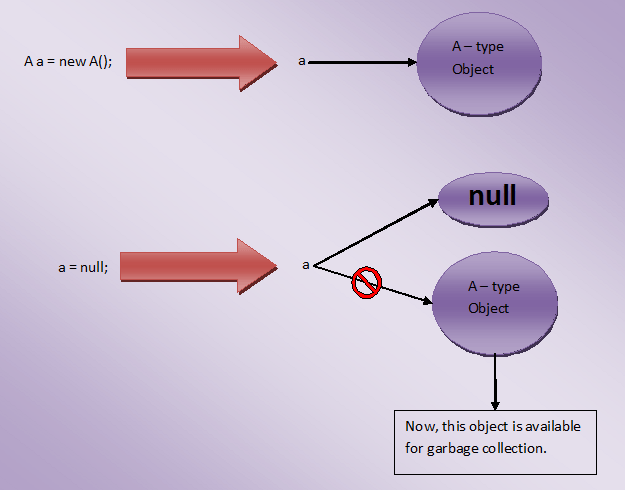
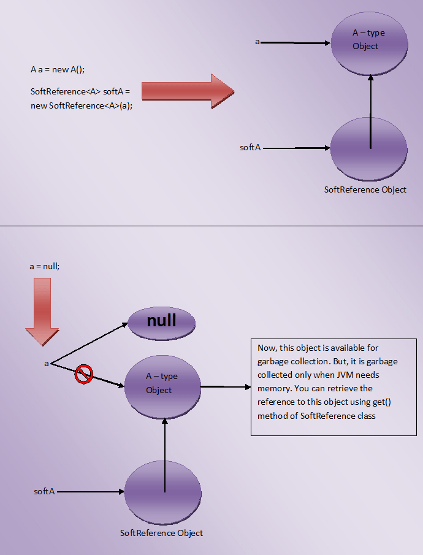

# Types Of References In Java : Strong, Soft, Weak And Phantom

One of the beauty of the Java language is that it doesn’t put burden of memory management on the programmers. Java automatically manages the memory on the behalf of the programmers. Java programmers need not to worry about freeing the memory after the objects are no more required. Garbage Collector Thread does this for you. This thread is responsible for sweeping out unwanted objects from the memory. But, you have no control over garbage collector thread. You can’t make it to run whenever you want. It is up to JVM which decides when to run garbage collector thread. But, with the introduction of java.lang.ref classes, you can have little control over when your objects will be garbage collected.

Depending upon how objects are garbage collected, references to those objects in java are grouped into 4 types. They are,

1) Strong References

2) Soft References

3) Weak References


4) Phantom References

Let’s discuss these reference types in detail.

1) Strong References
These type of references we use daily while writing the code. Any object in the memory which has active strong reference is not eligible for garbage collection. For example, in the below program, reference variable ‘a’ is a strong reference which is pointing to class A-type object. At this point of time, this object can’t be garbage collected as it has strong reference.

```java
class A
{
    //Class A
}
 
public class MainClass
{
    public static void main(String[] args)
    {
        A a = new A();      //Strong Reference
 
        a = null;    //Now, object to which 'a' is pointing earlier is eligible for garbage collection.
    }
}
```

If you make reference ‘a’ to point to null like in Line 12, then, object to which ‘a’ is pointing earlier will become eligible for garbage collection. Because, it will have no active references pointing to it. This object is most likely to be garbage collected when garbage collector decides to run.

Look at the below picture for more precise understanding.



## 2) Soft References
The objects which are softly referenced will not be garbage collected (even though they are available for garbage collection) until JVM badly needs memory. These objects will be cleared from the memory only if JVM runs out of memory. You can create a soft reference to an existing object by using  java.lang.ref.SoftReference class. Below is the code example on how to create a soft reference.

```java
class A
{
    //A Class
}
 
public class MainClass
{
    public static void main(String[] args)
    {
        A a = new A();      //Strong Reference
 
        //Creating Soft Reference to A-type object to which 'a' is also pointing
 
        SoftReference<A> softA = new SoftReference<A>(a);
 
        a = null;    //Now, A-type object to which 'a' is pointing earlier is eligible for garbage collection. But, it will be garbage collected only when JVM needs memory.
 
        a = softA.get();    //You can retrieve back the object which has been softly referenced
    }
}
```

In the above example, you create two strong references – ‘a‘ and ‘softA‘. ‘a’ is pointing to A-type object and ‘softA’ is pointing to SoftReference type object. This SoftReference type object is internally referring to A-type object to which ‘a’ is also pointing. When ‘a’ is made to point to null, object to which ‘a’ is pointing earlier becomes eligible for garbage collection. But, it will be garbage collected only when JVM needs memory. Because, it is softly referenced by ‘softA’ object.

Look at the below picture for more clarity.



One more use of SoftReference class is that you can retrieve back the object which has been softly referenced. It will be done by using get() method. This method returns reference to the object if object is not cleared from the memory. If object is cleared from the memory, it will return null.

## 3) Weak References
JVM ignores the weak references. That means objects which has only week references are eligible for garbage collection. They are likely to be garbage collected when JVM runs garbage collector thread. JVM doesn’t show any regard for weak references.

Below is the code which shows how to create weak references.

```java
class A
{
    //A Class
}
 
public class MainClass
{
    public static void main(String[] args)
    {
        A a = new A();      //Strong Reference
 
        //Creating Weak Reference to A-type object to which 'a' is also pointing.
 
        WeakReference<A> weakA = new WeakReference<A>(a);
 
        a = null;    //Now, A-type object to which 'a' is pointing earlier is available for garbage collection.
 
        a = weakA.get();    //You can retrieve back the object which has been weakly referenced.
    }
}
```

Look at the below picture for more clear understanding.


You may think that what is the use of creating weak references if they are ignored by the JVM, Use of weak reference is that you can retrieve back the weakly referenced object if it is not yet removed from the memory. This is done using get() method of WeakReference class. It will return reference to the object if object is not yet removed from the memory.

## 4) Phantom References
The objects which are being referenced by phantom references are eligible for garbage collection. But, before removing them from the memory, JVM puts them in a queue called ‘reference queue’ . They are put in a reference queue after calling finalize() method on them. You can’t retrieve back the objects which are being phantom referenced. That means calling get() method on phantom reference always returns null.

Below example shows how to create Phantom References.

```java
class A
{
    //A Class
}
 
public class MainClass
{
    public static void main(String[] args)
    {
        A a = new A();      //Strong Reference
 
        //Creating ReferenceQueue
 
        ReferenceQueue<A> refQueue = new ReferenceQueue<A>();
 
        //Creating Phantom Reference to A-type object to which 'a' is also pointing
 
        PhantomReference<A> phantomA = new PhantomReference<A>(a, refQueue);
 
        a = null;    //Now, A-type object to which 'a' is pointing earlier is available for garbage collection. But, this object is kept in 'refQueue' before removing it from the memory.
 
        a = phantomA.get();    //it always returns null
    }
}
```

## What is the purpose of WeakReference . If i gave an option to choose either “StrongReference” or “WeakReference”, then i will always choose “StrongReference” because the object is still be available unless it is essentially needed to be garbage collected. we hardly use the above features , but even though if we use the feature to retrieve the object which has de-referenced, then it would be preferred to make use of Strong Reference. What is the usage of “Weak Reference” . Can you help me understand with some real time example . Also, what is the purpose of using Phantom Reference if we cant retrieve the object back again.

What is the purpose of WeakReference . If i gave an option to choose either “StrongReference” or “WeakReference”, then i will always choose “StrongReference” because the object is still be available unless it is essentially needed to be garbage collected.

we hardly use the above features , but even though if we use the feature to retrieve the object which has de-referenced, then it would be preferred to make use of Strong Reference. What is the usage of “Weak Reference” . Can you help me understand with some real time example .

Also, what is the purpose of using Phantom Reference if we cant retrieve the object back again.

**Note:-** Some extra info:

1). Order of Strength –> Strong Ref > Soft Ref > Weak Ref > Phantom Ref.

2). Strong Ref == Object Ref. If the object gets abandoned from a Strong Ref, it could become a Soft, Weak or Phantom & depending on that its GC approach will vary. I do feel though that since most of us don’t specify these reference types, if a Strong Ref (OR Object) gets abandoned, it by default is collected in the next cycle of GC (as determined by the JVM), which makes it a Weak Ref.

3). Soft Ref will only be collected when there is memory pressure (as mentioned in this section).

4). Weak Ref will be collected immediately (i.e. on the next cycle of GC as determined by the JVM).

5). As for the Phantom Ref, the only extra info I have about it is that it is the weakest of all references & may or may not be collected by the GC Thread. It depends on your approach.

## How could you confirm when the soft or weak references will be garbage collected if they dont be referenced ? In case of JVM running out of memory, is ther any way to know the scenario ?