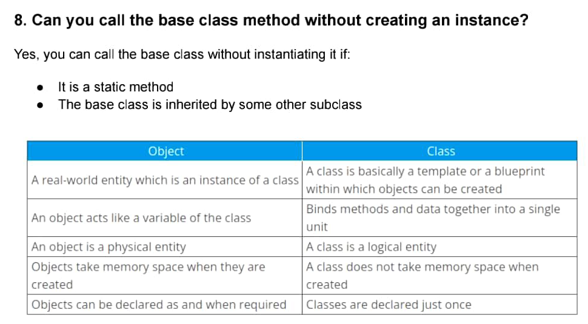

# Has a Relationship and dependency injection


# Advance Java Interview Questions


# Array Handwritten Notes


# Arrays in Java

An array is a collection of variables of the same type. When you need to store a list of values, such as numbers, you can store them in an array, instead of declaring separate variables for each number. To declare an array, you need to define the type of the elements with square brackets. For example, to declare an array of integers:

```java
int[ ] arr;
```

The name of the array is arr. The type of elements it will hold is int. Now, you need to define the array's capacity, or the number of elements it will hold. To accomplish this, use the keyword new

```java
int[ ] arr = new int[5];
```

The code above declares an array of 5 integers. In an array, the elements are ordered and each has a specific and constant position, which is called an index. 

To reference elements in an array, type the name of the array followed by the index position within a pair of square brackets. 

Example:

```java
arr[2] = 42;
```

This assigns a value of 42 to the element with 2 as its index.
Note that elements in the array are identified with zero-based index numbers, meaning that the first element's index is 0 rather than one. So, the maximum index of the array int[5] is 4.

Note that elements in the array are identified with zero-based index numbers, meaning that the first element's index is 0 rather than one. So, the maximum index of the array int[5] is 4.

## Initializing Arrays

Java provides a shortcut for instantiating arrays of primitive types and strings. If you already know what values to insert into the array, you can use an array literal. 

Example of an array literal:

```java
public class Program {
public static void main(String[] args) {
String[ ] myNames = { "A", "B", "C", "D"};
System.out.println(myNames[2]);
}
}

output:

C
```

Place the values in a comma-separated list, enclosed in curly braces. 

The code above automatically initializes an array containing 4 elements, and stores the provided values.
Sometimes you might see the square brackets placed after the array name, which also works, but the preferred way is to place the brackets after the array's data type.

### Problem

Your calendar program should output all the days of week, but it has errors. Change the code so that the program prints the days.

Notice that we use an array literal because we already know all the elements of the array we are going to create.

```java
public class Main
{
public static void main(String args[])
{
String[] days = {"Monday", "Tuesday", "Wednesday", "Thursday", "Friday", "Saturday", "Sunday"};
for (int i = 0; i < 7; i++)
{
System.out.println(days[i]);
}
}
}
```

```java
Output:

Monday
Tuesday
Wednesday
Thursday
Friday
Saturday
Sunday
```

### Array Length

You can access the length of an array (the number of elements it stores) via its length property. 

Example:

```java
public class Program {
public static void main(String[] args) {
int[ ] intArr = new int[5];
System.out.println(intArr.length);
}
}

Output:

5
```

Don't forget that in arrays, indexes start from 0. So, in the example above, the last index is 4.

Now that we know how to set and get array elements, we can calculate the sum of all elements in an array by using loops. The for loop is the most used loop when working with arrays, as we can use the length of the array to determine how many times to run the loop.

```java
public class Program {
public static void main(String[] args) {
int [ ] myArr = {6, 42, 3, 7};
int sum=0;
for(int x=0; x<myArr.length; x++) {
sum += myArr[x];
}
System.out.println(sum);
}
}

Output:

58
```

In the code above, we declared a variable sum to store the result and assigned it 0. Then we used a for loop to iterate through the array, and added each element's value to the variable.

The condition of the for loop is x<myArr.length, as the last element's index is myArr.length-1.

### Problem 

#### Summing Elements in Arrays

You are given a program that takes the length of the array as the first input, creates it, and then takes the next inputs as elements of the array. 

The program to go through the array and calculate the sum of the numbers that are multiples of 4. 

Sample Input 5 4 9 16 2 7 

Sample Output 20

To check if a number is a multiple of 4, use the modulo operator % to divide it by 4 and check the remainder.

```java
import java.util.Scanner;
public class Main {
public static void main(String[] args) {
Scanner scanner = new Scanner(System.in);
int length = scanner.nextInt();
int[] array = new int[length];
for (int i = 0; i < length; i++) {
array[i] = scanner.nextInt();
}
int sum = 0;
for (int x = 0; x<array.length; x++){
if (array[x]%4==0) {
sum += array[x];
}
}
System.out.println(sum);
}
}

```

```java
Input

5
4
9
16
2
7

Output

20
```

## Enhanced for Loop

The enhanced for loop (sometimes called a "for each" loop) is used to traverse elements in arrays. The advantages are that it eliminates the possibility of bugs and makes the code easier to read. 

Example:

Try it Yourself

```java
public class Program {
public static void main(String[] args) {
int[ ] primes = {2, 3, 5, 7};
for (int t: primes) {
System.out.println(t);
}
}
}


2
3
5
7
```

The enhanced for loop declares a variable of a type compatible with the elements of the array being accessed. The variable will be available within the for block, and its value will be the same as the current array element. 

So, on each iteration of the loop, the variable t will be equal to the corresponding element in the array.

Notice the colon after the variable in the syntax.

### Problem 

Your company is writing a program for a geometry course. The program takes the number of squares as the first input, creates an array, and then takes the sides of squares as its elements.

Write a program that receives a list of square sides and prints the area of those squares for the user.

Sample Input 2 3 4 

Output 9 16

Explanation In this example we have 2 squares (the first input) and their sides accordingly - 3 and 4 (the second and the third inputs). The area of the first square is 9 (3*3), the second one 16 (4*4).

The area of a square is a square of its edges.

```java
import java.util.Scanner;
public class Main {
public static void main(String[] args) {
Scanner scanner = new Scanner(System.in);
int length = scanner.nextInt();
int[] sides = new int[length];
for (int i = 0; i < length; i++) {
sides[i] = scanner.nextInt();
}
for (int t: sides){
int area = t * t;
System.out.println(area);
}
}
}

Input

3
2
3
5

Output

4
9
2
5
```

## Multidimensional Arrays

Multidimensional arrays are array that contain other arrays. The two-dimensional array is the most basic multidimensional array. To create multidimensional arrays, place each array within its own set of curly brackets. Example of a two-dimensional array:

```java
int[ ][ ] sample = { {1, 2, 3}, {4, 5, 6} };
```

This declares an array with two arrays as its elements. To access an element in the two-dimensional array, provide two indexes, one for the array, and another for the element inside that array. The following example accesses the first element in the second array of sample.

Try it Yourself

```java
public class Program {
public static void main(String[] args) {
int[ ][ ] sample = { {1, 2, 3}, {4, 5, 6} };
int x = sample[1][0];
System.out.println(x);
}
}

Output
4
```

The array's two indexes are called row index and column index.


You can get and set a multidimensional array's elements using the same pair of square brackets. 

Example:

Try it Yourself

```java
public class Program {
public static void main(String[] args) {
int[ ][ ] myArr = { {1, 2, 3}, {4}, {5, 6, 7} };
myArr[0][2] = 42;
int x = myArr[1][0];
System.out.println(x);
}
}

Output
4
```

The above two-dimensional array contains three arrays. The first array has three elements, the second has a single element and the last of these has three elements.

In Java, you're not limited to just two-dimensional arrays. Arrays can be nested within arrays to as many levels as your program needs. All you need to declare an array with more than two dimensions, is to add as many sets of empty brackets as you need. However, these are harder to maintain.
Remember, that all array members must be of the same type.

### Problem

#### Multidimensional Arrays

You are given a 3x3 matrix with numbers:

```java
int[][] matrix = { {8, 1, 6}, {3, 5, 7}, {4, 9, 0}, }
```

Output the numbers of the array, each on a new line.

Hint: You need to use two nested for loops to iterate over the array.

```java
public class Main {
public static void main(String[] args) {
//matrix
int[][] matrix = {
{8, 1, 6},
{3, 5, 7},
{4, 9, 0},
};
//task: display numbers in one column
for (int i=0; i<matrix.length; i++) {
for (int j=0; j<matrix.length; j++) {
System.out.println(matrix[i][j]);
}
}
}
}

result:
8
1
6
3
5
7
4
9
0
```

### Problem

#### Reverse a String

Write a program to take a string as input and output its reverse. The given code takes a string as input and converts it into a char array, which contains letters of the string as its elements. Sample 

Input: hello there Sample 

Output: ereht olleh

You can loop through the char array, starting from the end, using arr.length to get the size of the array.

```java
import java.util.*;
public class Program
{
public static void main(String[] args)
{
int vCount=0;//Vowel Couter variable
Scanner st= new Scanner(System.in);
String name = st.nextLine();
for(int x=name.length()-1;x>=0;x--)
{
System.out.print(name.charAt(x));
}
}
}

Input
this is some text

Output
txet emos si siht
```

# Binary Search in Java with code and implementation

```java
public class BinarySearch { 
    public static void main(String[] args) { 
        int[] array = {2, 4, 6, 8, 10, 12, 14, 16, 18, 20}; int target = 4; 
        int left = 0; 
        int right = array.length - 1; 
        int mid = 0; 
        boolean found = false; 
        while (left <= right) { 
            mid = (left + right) / 2; 
            if (array[mid] == target) { 
                found = true; 
                break; 
            } else if (array[mid] < target) {
                 left = mid + 1; 
            } else { 
                right = mid - 1; 
            } 
        } 
        
        if (found) { 
            System.out.println("Element found at index " + mid); 
        } else { 
            System.out.println("Element not found in the array."); 
        } 
    } 
}
```

## Explanation 

1. We define a class named BinarySearchExample. 

2. In the main() method, we declare and initialize an array called array with sorted values. 

3. We set the target variable to the element we want to find. 

4. We initialize the left variable to 0, representing the leftmost index of the search range. 

5. We initialize the right variable to array.length - 1, representing the rightmost index of the search range. 

6. We declare a mid variable to store the index of the middle element.

7. We initialize the found variable to false to keep track of whether the target element is found. 

8. We enter a while loop that continues as long as the left index is less than or equal to the right index. 

9. Inside the loop, we calculate the mid index as the average of the left and right indices. 

10. We compare the element at the mid index with the target element. If they are equal, we set found to true and break out of the loop. 

11. If the element at the mid index is less than the target, we update the left index to mid + 1 to search the right half of the array. 

12. If the element at the mid index is greater than the target, we update the right index to mid - 1 to search the left half of the array. 

13. After exiting the loop, we check the value of found. If it is true, we display a message indicating that the element was found at index mid. Otherwise, we display a message indicating that the element was not found in the array. 

In this example, the binary search algorithm efficiently searches for the target element by repeatedly dividing the search range in half until the element is found or the range becomes empty.

# Concurrency vs Parallelism

## Concurrency

Concurrency means more than onetask can appear to make progress over a unit of time. 

The key term over here is "APPEAR". 

Concurrency gives the illusion that the tasks are running at the sametime. In reality, the processor is switching between different tasks.


## Parallelism

Parallelism is when two or moretasks actually make progress at thesame time.

The key word is "ACTUALLY"

For parallelism, you need to havemore than one processor or a multi-core processor.

Multiple tasks can make progress atthe same exact time


## Combinations

In reality, tasks can beexecuted in several ways:

* Sequential

* Concurrent

* Parallel

* Parallel and Concurrent

## Scenario

Assume that you run a burgerjoint.

And John is the Chef.

Now, consider that you needJohn to prepare 10 burgers.

Think of them as 10 tasks

## Sequential

John prepares 1 burger at atime.

He starts with one burger,completes it and then startswith the next.

This is the Sequential approach

## Concurrently

Let's say preparing a burger is a multi-stepprocess.

Warm the bread, melt the cheese, cut theveggies, and assemble.

Also, assume there is a wait time while the breadis in the oven or the cheese is melting

John can start with 1st burger, then move to the2nd while the 1st is in waiting, and so on.

This is the concurrent approach.

## Parallel Execution

Let's say John is overwhelmed.

And therefore, you decide to bring in anotherchef, Mac.

Now John prepares 5 burgers one by one.

Mac also prepares 5 burgers one by one.

This is the parallel execution approach.

But notice John & Mac are not preparing burgers concurrently.

## Parallelism with Concurrency

As John & Mac prepare 5 burgers each...

...they realize they can prepare their set of burgers concurrently.

For example, when there is a wait time for one burger, they can work on the next one and so on.

Now, they are preparing burgers in a parallel manner as well as concurrently.

## Concurrency vs Parallelism

* Concurrency is about dealing with lotsof things at once.

* Parallelism is actually doing lots ofthings at once

* Application can be concurrent but notparallel.

* Application can also be parallel but notconcurrent

* All parallel executions need not beconcurrent

# Core Java Interview Question

## 7. What is a Class in Java? 

Class is defined as a template or a blueprint that is used to create objects and also to define objects and methods.

## 8. Define Object in Java? 

The instance of a class is called an object. Every object in Java has both state and behavior. The state of the object is stored in fields and the behavior of the objects is defined by methods.

## 11. Name the memory areas that are allocated by JVM and explain the class loader in JVM? 

There are totally five memory areas that are allocated by the JVM, and they are: 

• Class Area 

• Heap 

• Stack 

• Native Method Stack 

• PC Register

**ClassLoader**: class loader is a subschema of JVM which is used to load class files. Whenever we run Java programs, the data will be first loaded from the classloader. There are mainly three in-built classloaders in JVM, they are: 

• Application Classloader 

• Bootstrap Classloader 

• Extension Classloader

## 10. Define JVM? 

JVM is the abbreviation for Java Virtual Machine. It is a virtual machine that provides a runtime environment to write code. JVM is a part of JRE (Java Runtime Environment) and is used to convert the bytecode into machine-level language. This machine is responsible for allocating memory.

## 12. What is JDK? 

Java Development Kit is one of the three prominent technology packages used in Java programming. JDK is used as a standalone component to run the Java programs by JVM and JRE. This kit is used to implement Java platform specifications, including class libraries and compiler.

## 13. What do you mean by JRE? 

Java Runtime Environment (JRE) is a collection of software tools that are designed for the development of Java applications. This is a part of JDK, but it can be downloaded separately. JRE is mainly responsible for orchestrating the component activities.

## 14. What is the significant difference between JVM, JRE, and JDK? 

We can understand the difference between JVM, JDK, and JRE by the following diagram: 

• JVM: Java Virtual Machine is the main part of Java programming, which provides platform independence. JRE and JDK both contain JVM in order to run our Java programs. 

• JDK: This development kit is mainly used for developing programs. 

• JRE: Java Runtime Environment is mainly used for running Java programs.

## 15. Define the JIT compiler in Java? 

Just In Time Compiler is the component of JRE, which is used to compile the bytecodes of the particular method into the native machine code. This compiled code of the method is directly called by JVM without interpreting it

## 16. Define variables in Java and explain with example? 

Variables in Java can be defined as a basic storage unit of a program. It is a storage unit that holds the value during the program execution. Always the variable is assigned with a datatype.

## 17. What are the different types of variables in Java? 

There are mainly three different types of variables available in Java, and they are: 

• Static Variables

• Local Variables 
 
• Instance Variables 

**Static Variables**: A variable that is declared with the static keyword is called a static variable. A static variable cannot be a local variable, and the memory is allocated only once for these variables. 

**Local Variables**: A variable that is declared inside the body of the method within the class is called a local variable. A local variable cannot be declared using the static keyword. 

**Instance Variables**: The variable declared inside the class but outside the body of the method is called the instance variable. This variable cannot be declared as static and its value is instance-specific and cannot be shared among others.

## 18. What is Typecasting? 

Typecasting in Java is done explicitly by the programmer; this is done to convert one data type into another data type. 

Widening (automatically) - conversion of a smaller data type to a larger data type size. 

byte -> short -> char -> int -> long -> float -> double 

Narrowing (manually) - converting a larger type to a smaller size type 

double -> float -> long -> int -> char -> short -> byte

## 19. What is Type Conversion? 

Type conversion can be defined as converting one data type to another data type automatically by the compiler. 

There are two types of type conversions, and they are: 

• Implicit type conversion 

• Explicit type conversion.

## 20. What are the data types in Java? 

Datatypes in Java specify the values and sizes that can be stored in the variables. There are mainly two types of data types; they are: 

• Primitive Data Types 

• Non-primitive Data Types

## 21. What are primitive data types? 

Primitive data types in Java are the major constituents of data manipulation. These are the most basic data types that are available in Java. The primitive data types include int, char, byte, float, double, long, short, and boolean.

## 23. What are non-primitive data types? 

The non-primitive data types are something that is different from primitive data types, and these non-primitive data types include String, arrays, and structures.

## 24. Why char uses 2 bytes in Java and what is this ‘u0000’ notation called? 

This is only due to the reason that Java uses the Unicode system. The notation ‘u0000’ is the lowest range of the Unicode system, and it is the default value of the char data type.

## 26. What is the Unicode system? 

Unicode is a Universal International Standard Character Encoding which is an adequate resource for representing most of the languages written worldwide.

## 27. Why Java uses Unicode System? 

To overcome the problems present in the previous language standards, the Unicode system has been introduced. Java uses the Unicode system because the character default size provided by Unicode is 2 bytes and Java also needs only 2 bytes for the character.

## 28. What makes Java ‘Run Anywhere’ in nature?

It is because the Java compiler converts the code into byte code which is the main transitional language between machine code and source code. This byte code is not platform-dependent so that it can be compiled and executed on any platform.

## 30. What if we write public static void as static public void? 

Both the compilation and execution of the programs are done correctly because in Java specifiers order doesn’t matter.

## 31. Is there any default value for local variables? 

No, local variables are not initialized by any default values.

## 52. Describe in brief OOPs concepts? 

OOPs is an abbreviation for Object-Oriented Programming Language which entirely deals with an object. The main aim of OOPs is to implement real-world entities such as objects, classes, inheritance, polymorphism, and so on. Simula is considered the first object-oriented programming language. The most popular programming languages are Java, Python, PHP, C++, and many others. 

The following are the OOPs concepts that are included in Java: 

• Class 

• Object 

• Abstraction 

• Encapsulation 

• Inheritance 

• Polymorphism

## 53. What is Abstraction? 

In simple words, abstraction can be defined as hiding unnecessary data and showing or executing necessary data. In technical terms, abstraction can be defined as hiding internal processes and showing only the functionality.

## 54. Define encapsulation? 

Binding data and code together into a single unit are called encapsulation. The capsule is the best example of encapsulation.

## 55. What is Inheritance in Java?

When an object of child class has the ability to acquire the properties of a parent class then it is called inheritance. It is mainly used to acquire runtime polymorphism and also it provides code reusability.

## 56. What is Polymorphism in Java? 

Polymorphism in Java provides a way to perform one task in different possible ways. To achieve polymorphism in Java we use method overloading and method overriding. For example, the shape is the task and various possible ways in shapes are triangles, rectangle, circle, and so on.

## 57. What are the advantages of OOPs? 

The following are the advantages of OOPs, and they are: 

• OOPs provides data hiding 

• OOPs makes development and maintenance easier when compared to a procedural programming language. 

• OOPs has the ability to stimulate real-world entities more effectively.

## 59. What will be an initial value for an object reference that is defined as an instance variable?

All the object references in Java are initialized to null.

## 63. Define Constructor in Java? 

A constructor is a special type of method with a block of code to initialize the state of an object. A constructor is called only when the instance of the object is created. Every time in Java object is

## 64. What all the rules must be followed while creating a constructor in Java? 

The rules we need to follow while creating a constructor are:

• The constructor should have the same name as its class name. 

• There is no explicit return type for a constructor. 

• In Java, a constructor cannot be synchronized, abstract, final, and static.

## 65. What are the different types of constructors available in Java? 

There are two constructors in Java, and they are: 

• Default constructor 

• Parameterized constructor 

**Default constructor**: It is also called a no-argument constructor and it is mainly used to initialize the instance variable with the default value. Moreover, it is also used to perform some useful tasks on object creation. This default constructor is implicitly invoked by the compiler if there is no constructor for a particular class.

**Parameterized constructor**: A parameterized constructor is one type of constructor which is mainly used to initialize the instance variables with the given values. In simple words, the constructor that accepts arguments is called a parameterized constructor.

## 67. Does the constructor return any value? 

Yes, the constructor will return the current or present instance of the class.

## 68. Can the constructor be inherited? 

No, the constructor cannot be inherited.

## 69. Can the constructor be overloaded? 

Yes, It is possible to overload a constructor by changing the number of arguments for each constructor in a particular program or it is possible to overload a constructor by changing the parameter data types.

## 70. Can we declare a constructor as final? 

No, We can not declare the constructor as final, if we declare it as final compiler throws a “modified final not allowed” error.

## 71. Is there any Constructor class available in Java and what is its purpose of it? 

Yes, there is a class called Constructor class available in Java. The purpose of the Constructor class is to get the internal information of the constructor in the class. It is present in java.lang.reflect package.

## 72. What is the use of a copy constructor in Java? 

There is no copy constructor in Java, we can copy the values from one object to another same as that of a copy constructor in C++. In Java, there are many ways to copy the values of one object to another and they are: 

• By using Clone() of object class 

• By using constructor 

• By assigning the value of one object to another

## 73. Define the method in Java? 

In Java method is defined as a set of code that is represented by a name and can be invoked at any point in a program with the help of the method name. Each and every method in the program has its own name which is not the same as that of a class name.

## 75. What is the method signature in Java? 

In Java method signature is given the specified format followed by the method name, type, and order of its parameters. Exceptions are not considered as a part of the method signature.

## 76. What is the role of static keywords in Java? 

Keyword static in Java is mainly used for memory management and we can declare block, variable, method, and nested class as static.

## 78. What happens if we declare a method as static? 

If we declare a method as static, the following operations take place, and they are: 

• A static method can be invoked without creating an instance of the class. 

• Only a static method can access static data members and can change the value of a particular data member. 

• In most of the cases static method belongs to the class rather than the object of the class.

## 79. What are the cons observed if we declare a method as static in Java? 

The restrictions that we face if we declare a method as static are: 

• A static method cannot access non-static members and also cannot call the non-static method directly. 

• This and super keywords cannot be used in the context of the static method as they are non-static.

## 80. Why is the main method in Java is static? 

The main reason is that the object is not required to call for a static method so, if we declare the main method as non-static we need to create an object first and then call the main() method. In order to save memory, we declare the main method as static in Java.

## 81. Can we override the static method in Java? 

No, we can’t override the static method in Java.

## 82. What is a static block in Java? 

Static block in Java is mainly used to initialize the static data members. The specialty of the static block is that it is executed before the main method at the time of class loading.

## 83. Can we execute a program in Java without the main() method? 

Yes, we can execute the program in Java without the main method using a static block. It was possible only till JDK 1.6 and from JDK 1.7 it is not possible to execute the program without the main method in Java.

## 84. What happens if we remove the static modifier from the signature of the main() method?

The program will be compiled, but at runtime, it throws NoSuchMethodError error.

## 85. Can we declare a constructor using static? 

As we know that the static context is suitable for only class, variable, and method, not for the object. So the constructors are invoked only when an object is created, so there is no possibility to declare the constructor as static in Java.

## 86. Can we make abstract methods static in Java? 

No, if we declare abstract methods as static it becomes a part of the class, and we can directly call it which is not required. Calling an undefined method is unnecessary. Therefore declaring an abstract method as static is not allowed.

## 87. Can we declare static methods and variables in the abstract class? 

Yes, as we know that there is no need for an object to access the static block, therefore we can access static methods and variables declared inside the abstract class by using the abstract class name. Consider the following example.

## 88. Define this keyword in Java? 

The main use of this keyword is to refer to the current object in Java programming.

## 89. What is the usage of this keyword in Java? 

The following are the usage provided by this keyword in Java, and they are: 

• It is used to refer to the current class instance variable. 

• This is also used to invoke the current class constructor 

• It is used to invoke the current class method 

• It can be passed as an argument in the method call and in the constructor call

## 90. Can this keyword be used to refer to the current class instance variable?

Yes, this keyword is used to refer to the current class instance variable and it is also used to initiate or invoke the current class constructor.

## 91. Which class is the superclass for all the classes in Java? 

An object class is a superclass for all the classes in Java.

## 92. What is a singleton class in Java? 

Singleton class can be defined as the class that consists of only one single instance. In this class, all the methods and variables belong to only one instance. Singleton class is mainly used in a situation where we need to limit the objects for a class.

## 93. Why we use inheritance in Java? 

In Java, we use inheritance mainly for two uses, and they are: 

• For code reusability 

• For method overriding

## 96. Can the main() method in Java return any data? 

The main() method in Java doesn’t return any data because it is declared with a void return type.

## 99. Can we declare the main() method of our class as private? 

In Java, main() method must be always public static to run any application or program correctly. Suppose, if the main method is declared as private there will be no complications but it will give a runtime error.

## 100. Can a class in Java have multiple constructors? 

Yes, the classes present in Java can have multiple constructors with different parameters.

## 101. What is the method overloading in Java? 

If a class in Java has multiple numbers methods with the same name and different parameters, then it is called as method overloading. The main advantage of method overloading is that it increases the readability score of a program.

## 102. What are the different ways to overload a method? 

There are two different ways to overload a method, and they are: 

• By changing the data type 

• By changing the number of arguments

## 105. Why method overloading is not possible only by changing the return type of method only? 

Ambiguity is the main reason why method overloading is not possible by changing the return type of method only.

## 106. Can we overload main() method in Java? 

Yes, we can overload the main() method in Java by using method overloading but, JVM only calls the main() method that receives string array as arguments only.

## 107. What is method overriding in Java? 

If the subclass in the program has the same method as declared in superclass then it is known as method overriding.

## 108. What is the usage of method overriding in Java? 

Method overriding is used to achieve run-time polymorphism and also it is used to provide a specific implementation for a method that is already given by its subclass.

## 109. What are the rules we need to follow during method overriding? 

The rules are as follows: 

• The method must have the same parameters as present in the parent class. 

• There must be an IS-A relationship which is called inheritance. 

• The method should have the name same as that of the class name.

## 111. Can we override a static method? 

No, a static method cannot be overridden, it is because a static method is bounded with a class and an instance method is bounded with an object. So, the static belongs to the class area whereas, the instance method belongs to the heap area.

## 112. Can we override a main() method in Java? 

No, because the main() method is static.

## 113. What is the difference between aggregation and composition? 

Aggregation is built to represent the weak relationship whereas, the composition is built to represent the strong relationship.

## 114. Why does Java not support pointers? 

Pointer is a variable that mainly refers to the memory address. Java doesn’t support pointers because they are complex to understand and unsecured.

## 115. What is the super keyword in Java? 

Super keyword in Java is used to conjure immediate prompt parent class object. It is also called a reference variable.

## 116. What is the usage of super keywords in Java? 

The uses of the super keyword in Java are as follows: 

• Super can be used to conjure an immediate parent class method. 

• It is also used to indicate the immediate superclass instance variable.

• Super can be used to conjure an immediate parent class constructor. 

## 117. Can we have virtual functions in Java? 

Yes, all the functions in Java are virtual by default.

# Fail Fast and Fail safe iterator

## What are fail-fast and fail-safe iterators?


# Interview Question with Answers




