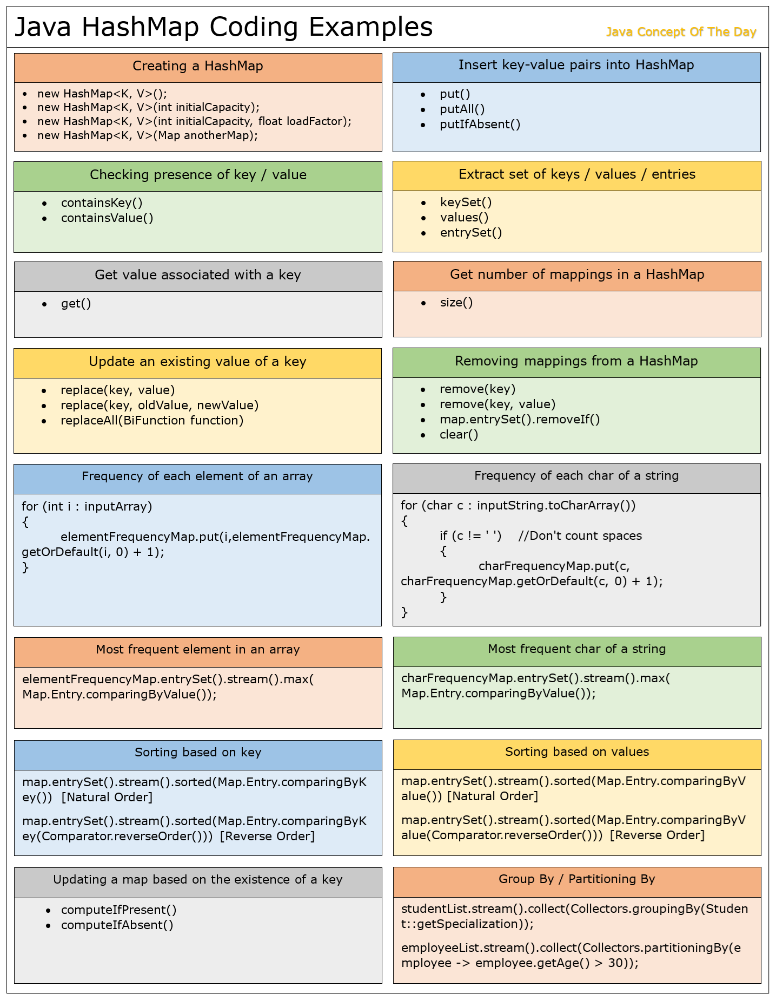

# Java HashMap Programs And Coding Examples
HashMap is the most asked topic in any Java interview. There will be some questions on HashMap internal structure with special focus on Java 8 and some coding questions on Java HashMap. In this post, we will see some Java HashMap programs and coding examples.



## Java HashMap Programs And Coding Examples :

### 1) What are the different ways of creating a HashMap in Java?
Below coding example shows 4 different ways of creating a HashMap in Java.

```java
import java.util.HashMap;
   
public class JavaHashMapProgram 
{    
    public static void main(String[] args) 
    {
        //1. Creating an empty HashMap with default initial capacity and load factor
          
        HashMap<String, Integer> map1 = new HashMap<String, Integer>();
          
        //2. Creating an empty HashMap with default load factor and 30 as initial capacity
          
        HashMap<String, Integer> map2 = new HashMap<String, Integer>(30);
          
        //3. Creating an empty HashMap with 30 as initial capacity and 0.5 as load factor
          
        HashMap<String, Integer> map3 = new HashMap<String, Integer>(30, 0.5f);
          
        //4. Creating HashMap by copying all mappings from another Map
          
        HashMap<String, Integer> map4 = new HashMap<String, Integer>(map1);
    }   
}
```

### 2) What are the different methods to insert key-value pairs into a HashMap?

There are 3 different methods you can use to insert key-value pairs into a HashMap.

put() : Adds single key-value pair into a HashMap
putAll() : Copies all key-value pairs of a specified map into current map.
putIfAbsent() : Inserts given key-value pair into a HashMap if it is not present or given key is mapping to null.

```java
import java.util.HashMap;
 
public class JavaHashMapProgram 
{
    public static void main(String[] args) 
    {
        //Creating an empty HashMap with default initial capacity and load factor
         
        HashMap<Integer, String> studentIdNameMap = new HashMap<Integer, String>();
          
        //Inserting key-value (Id-Name) pairs to studentIdNameMap using put() method
          
        studentIdNameMap.put(111, "Joshua Helfhanaus");
        studentIdNameMap.put(222, "Vedant Joshi");
        studentIdNameMap.put(333, "Ben Mitchael");
        studentIdNameMap.put(444, "Poorvi Shah");
        studentIdNameMap.put(555, "Wnag Chama");
          
        //Printing key-value pairs of studentIdNameMap
         
        System.out.println("-------------------------");
        System.out.println("Student_ID_Name_Map");
        System.out.println("-------------------------");
          
        studentIdNameMap.forEach((key, value) -> System.out.println(key+" : "+value));
          
        //Creating another HashMap
          
        HashMap<Integer, String> anotherStudentIdNameMap = new HashMap<Integer, String>();
          
        //Inserting key-value (Id-Name) pairs to anotherStudentIdNameMap using put() method
          
        anotherStudentIdNameMap.put(666, null);
        anotherStudentIdNameMap.put(777, "Pranav Daghe");
          
        //Inserting all mappings of studentIdNameMap into anotherStudentIdNameMap using putAll() method
          
        anotherStudentIdNameMap.putAll(studentIdNameMap);
         
        //Inserting key-value pair into anotherStudentIdNameMap using putIfAbsent() method
         
        anotherStudentIdNameMap.putIfAbsent(333, "Shabnam Quadri");
        anotherStudentIdNameMap.putIfAbsent(666, "Nilesh R M");
        anotherStudentIdNameMap.putIfAbsent(888, "Jason Olivia");
          
        //Printing key-value pairs of anotherStudentIdNameMap
         
        System.out.println("-------------------------");
        System.out.println("Another_Student_ID_Name_Map");
        System.out.println("-------------------------");
          
        anotherStudentIdNameMap.forEach((key, value) -> System.out.println(key+" : "+value));
    }
}

Output :

-------------------------
Student_ID_Name_Map
-------------------------
555 : Wnag Chama
444 : Poorvi Shah
333 : Ben Mitchael
222 : Vedant Joshi
111 : Joshua Helfhanaus
-------------------------
Another_Student_ID_Name_Map
-------------------------
888 : Jason Olivia
777 : Pranav Daghe
666 : Nilesh R M
555 : Wnag Chama
444 : Poorvi Shah
333 : Ben Mitchael
222 : Vedant Joshi
111 : Joshua Helfhanaus
```

### 3) How do you check whether given key or value exist in a HashMap?

containsKey() method is used to check whether given key exist in a HashMap and containsValue() method is used to check presence of given value in a HashMap.

```java
import java.util.HashMap;
 
public class JavaHashMapProgram 
{
    public static void main(String[] args) 
    {
        //Creating an empty studentIdNameMap with default initial capacity and load factor
         
        HashMap<Integer, String> studentIdNameMap = new HashMap<Integer, String>();
          
        //Inserting key-value (Id-Name) pairs to studentIdNameMap using put() method
          
        studentIdNameMap.put(111, "Joshua Helfhanaus");
        studentIdNameMap.put(222, "Vedant Joshi");
        studentIdNameMap.put(333, "Ben Mitchael");
        studentIdNameMap.put(444, "Poorvi Shah");
        studentIdNameMap.put(555, "Wnag Chama");
         
        //checking presence of keys
         
        System.out.println(studentIdNameMap.containsKey(777));          //Output : false
        System.out.println(studentIdNameMap.containsKey(333));          //Output : true
         
        //Checking presence of values
         
        System.out.println(studentIdNameMap.containsValue("Poorvi Shah"));           //Output : true
        System.out.println(studentIdNameMap.containsValue("Shabnam Quadri"));        //Output : false   
    }
}
```

### 4) How do you extract a list of only keys or a list of only values or a list of all entries from a given HashMap?

The following 3 methods are used to retrieve a list of keys or list of values or list of entries from the given HashMap.

* keySet() : Returns set of keys.
* values() : Returns collection of values.
* entrySet() : Returns set of all entries.

```java
import java.util.HashMap;
import java.util.List;
import java.util.Map.Entry;
import java.util.stream.Collectors;
 
public class JavaHashMapProgram 
{
    public static void main(String[] args) 
    {
        //Creating an empty studentIdNameMap with default initial capacity and load factor
         
        HashMap<Integer, String> studentIdNameMap = new HashMap<Integer, String>();
          
        //Inserting key-value (Id-Name) pairs to studentIdNameMap using put() method
          
        studentIdNameMap.put(111, "Joshua Helfhanaus");
        studentIdNameMap.put(222, "Vedant Joshi");
        studentIdNameMap.put(333, "Ben Mitchael");
        studentIdNameMap.put(444, "Poorvi Shah");
        studentIdNameMap.put(555, "Wnag Chama");
         
        //Extracting a list of keys
         
        List<Integer> keyList = studentIdNameMap.keySet().stream().collect(Collectors.toList());
        System.out.println("Keys : "+keyList);
         
        //Extracting a list of values
         
        List<String> valueList = studentIdNameMap.values().stream().collect(Collectors.toList());
        System.out.println("Values : "+valueList);
         
        //Extracting a list of entries
         
        List<Entry<Integer, String>> entryList = studentIdNameMap.entrySet().stream().collect(Collectors.toList());
        System.out.println("Entries : "+entryList);
    }
}

Output :

Keys : [555, 444, 333, 222, 111]
Values : [Wnag Chama, Poorvi Shah, Ben Mitchael, Vedant Joshi, Joshua Helfhanaus]
Entries : [555=Wnag Chama, 444=Poorvi Shah, 333=Ben Mitchael, 222=Vedant Joshi, 111=Joshua Helfhanaus]
```

### 5) How do you extract a value associated with a given key from a HashMap?

get() method is used to extract a value associated with a given key from a HashMap.

```java
import java.util.HashMap;
 
public class JavaHashMapProgram 
{
    public static void main(String[] args) 
    {
        //Creating an empty studentIdNameMap with default initial capacity and load factor
         
        HashMap<Integer, String> studentIdNameMap = new HashMap<Integer, String>();
          
        //Inserting key-value (Id-Name) pairs to studentIdNameMap using put() method
          
        studentIdNameMap.put(111, "Joshua Helfhanaus");
        studentIdNameMap.put(222, "Vedant Joshi");
        studentIdNameMap.put(333, "Ben Mitchael");
        studentIdNameMap.put(444, "Poorvi Shah");
        studentIdNameMap.put(555, "Wnag Chama");
         
        //Extracting a value associated with a key using get() method
         
        System.out.println(studentIdNameMap.get(555));         //Output : Wnag Chama
        System.out.println(studentIdNameMap.get(777));         //Output : null
    }
}
```

### 6) How do you find out the number of key-value mappings present in a HashMap?

Using size() method.

```java
import java.util.HashMap;
 
public class JavaHashMapProgram 
{
    public static void main(String[] args) 
    {
        //Creating an empty HashMap with default initial capacity and default load factor 
         
        HashMap<Integer, Double> map = new HashMap<Integer, Double>();
          
        //Adding key-value pairs to map using put() method
          
        map.put(111, 111.111);
        map.put(222, 222.222);
        map.put(333, 333.333);
        map.put(444, 444.444);
        map.put(555, 555.555);
        map.put(666, 666.666);
        map.put(777, 777.777);
          
        //Retrieving the number of key-value mappings present in map
          
        System.out.println(map.size());      //Output : 7
    }
}
```

### 7) How do you update an existing value of a key with a new value in a HashMap?

You can update an existing value of a key with a new value using replace() method. It has two forms.

* replace(key, value) : It updates an existing value of a key if a key is currently mapped to any value.
* replace(key, oldValue, newValue) : It updates an existing value of a key if and only if a key is currently mapped to given value.

```java
import java.util.HashMap;
 
public class JavaHashMapProgram 
{
    public static void main(String[] args) 
    {
        //Creating an empty HashMap with default initial capacity and default load factor 
         
        HashMap<Integer, String> map = new HashMap<Integer, String>();
          
        //Adding key-value pairs to map using put() method
          
        map.put(111, "AAA");
        map.put(222, "BBB");
        map.put(333, "CCC");
        map.put(444, "DDD");
        map.put(555, "EEE");
        map.put(666, null);
          
        //Updating value of key 444 with "FOUR"
         
        map.replace(444, "FOUR");
         
        //Updating value of key 555 with "FIVE" if and only if it is currently mapped to "eee"
         
        map.replace(555, "eee", "FIVE");
         
        //Updating value of key 666 with "SIX" if and only if it is currently mapped to null
         
        map.replace(666, null, "SIX");
         
        map.forEach((key, value) -> System.out.println(key+" : "+value));
    }
}

Output :

666 : SIX
555 : EEE
444 : FOUR
333 : CCC
222 : BBB
111 : AAA
```

### 8) Given a studentNameMarksMap having name of students as keys and their marks in mathematics as values, give required grace marks and pass those students who have scored above 30. Passing marks is 35?

For this type of problems where bulk entries are to be updated, we use replaceAll() method.

```java
import java.util.HashMap;
 
public class JavaHashMapProgram 
{
    public static void main(String[] args) 
    {
        //Creating an empty HashMap with default initial capacity and default load factor 
         
        HashMap<String, Integer> studentNameMarksMap = new HashMap<String, Integer>();
         
        //Inserting entries into studentNameMarksMap
         
        studentNameMarksMap.put("Aditya Sen", 57);
        studentNameMarksMap.put("Harris Brar", 34);
        studentNameMarksMap.put("Sarah Amin", 61);
        studentNameMarksMap.put("Rishika Gowda", 75);
        studentNameMarksMap.put("Rohit Gupta", 68);
        studentNameMarksMap.put("Andriel Hope", 31);
        studentNameMarksMap.put("Deepti Sharma", 81);
        studentNameMarksMap.put("Irfan Ali", 33);
        studentNameMarksMap.put("Ruth Prabhu", 66);
        studentNameMarksMap.put("Arun Trivedi", 29);
         
        System.out.println("=================");
        System.out.println("Before Update");
        System.out.println("=================");
         
        studentNameMarksMap.forEach((key, value) -> System.out.println(key+" : "+value));
         
        studentNameMarksMap.replaceAll((key, value) -> {
                                            if (value < 35 & value >= 30) 
                                            { 
                                                value = value + (35 - value); 
                                                return value;
                                            } 
                                            return value;
                                            });
         
        System.out.println("=================");
        System.out.println("After Update");
        System.out.println("=================");
         
        studentNameMarksMap.forEach((key, value) -> System.out.println(key+" : "+value));
    }
}

Output :

=================
Before Update
=================
Irfan Ali : 33
Aditya Sen : 57
Ruth Prabhu : 66
Rishika Gowda : 75
Deepti Sharma : 81
Rohit Gupta : 68
Arun Trivedi : 29
Sarah Amin : 61
Harris Brar : 34
Andriel Hope : 31
=================
After Update
=================
Irfan Ali : 35
Aditya Sen : 57
Ruth Prabhu : 66
Rishika Gowda : 75
Deepti Sharma : 81
Rohit Gupta : 68
Arun Trivedi : 29
Sarah Amin : 61
Harris Brar : 35
Andriel Hope : 35
```

## 9) How do you remove all the entries from a HashMap at a time?

clear() method removes all the entries of a HashMap in one go. This method is often used to clear the HashMap for reuse.

```java
import java.util.HashMap;
 
public class JavaHashMapProgram 
{
    public static void main(String[] args) 
    {
        //Creating an empty HashMap
         
        HashMap<Integer, String> map = new HashMap<Integer, String>();
          
        //Adding key-value pairs to HashMap
          
        map.put(1, "1"); 
        map.put(2, "22");
        map.put(3, "333");
        map.put(4, "4444");
        map.put(5, "55555");
          
        //Retrieving the number of key-value pairs
          
        System.out.println(map.size());      //Output : 5
          
        //Clearing the map
          
        map.clear();
          
        //Checking number of key-value pairs after clearing the map
          
        System.out.println(map.size());      //Output : 0
    }
}
```

### 10) Given medicinesExpDateMap having name of medicines as keys and their expiry date as values, how do you remove all the medicines from medicinesExpDateMap if they have gone past their expiry date?

To solve such problems where you have to remove some entries of a HashMap based on some condition, we chain together two methods – entrySet() and removeIf() – as follows.

```java
import java.time.LocalDate;
import java.util.HashMap;
 
public class JavaHashMapProgram 
{
    public static void main(String[] args) 
    {
        //Creating an empty medicinesExpDateMap
         
        HashMap<String, LocalDate> medicinesExpDateMap = new HashMap<String, LocalDate>();
         
        //Inserting medicines with their exp date as values into medicinesExpDateMap
         
        medicinesExpDateMap.put("Amoxicillin Tabs", LocalDate.of(2024, 8, 27));
        medicinesExpDateMap.put("Paracetamol Tabs", LocalDate.of(2025, 1, 23));
        medicinesExpDateMap.put("Vitamin D Capsules", LocalDate.of(2026, 12, 06));
        medicinesExpDateMap.put("Accelofenac Tabs", LocalDate.of(2025, 6, 10));
        medicinesExpDateMap.put("Azithromycin Tabs", LocalDate.of(2027, 1, 30));
        medicinesExpDateMap.put("Citirizine Tabs", LocalDate.of(2023, 9, 21));
        medicinesExpDateMap.put("Folic Acid Tabs", LocalDate.of(2028, 11, 17));
         
        System.out.println("==================");
        System.out.println("Before Remove");
        System.out.println("==================");
         
        medicinesExpDateMap.forEach((key, value) -> System.out.println(key+" : "+value));
         
        //Removing medicines those have gone past their expiry date
         
        medicinesExpDateMap.entrySet().removeIf(entry -> entry.getValue().isBefore(LocalDate.now()));
         
        System.out.println("==================");
        System.out.println("After Remove");
        System.out.println("==================");
         
        medicinesExpDateMap.forEach((key, value) -> System.out.println(key+" : "+value));    
    }
}

Output :

==================
Before Remove
==================
Folic Acid Tabs : 2028-11-17
Azithromycin Tabs : 2027-01-30
Accelofenac Tabs : 2025-06-10
Vitamin D Capsules : 2026-12-06
Citirizine Tabs : 2023-09-21
Amoxicillin Tabs : 2024-08-27
Paracetamol Tabs : 2025-01-23
==================
After Remove
==================
Folic Acid Tabs : 2028-11-17
Azithromycin Tabs : 2027-01-30
Accelofenac Tabs : 2025-06-10
Vitamin D Capsules : 2026-12-06
```

### 11) Find the frequency of each element of an array using HashMap?

OR

### Find the frequency of each character of a string using HashMap?

Here, we use the same logic to solve both problems. We create a HashMap with each element of an array (or each character of a string) as keys and their frequency of occurrences as values.

**Element Frequency Program :**
```java
import java.util.Arrays;
import java.util.HashMap;
 
public class JavaHashMapProgram 
{
    public static void main(String[] args) 
    {
            int[] inputArray = {4, 7, 2, 9, 1, 7, 1, 4, 7, 8};
             
            //Creating an empty elementFrequencyMap with elements as keys and their frequency as values
             
            HashMap<Integer, Integer> elementFrequencyMap = new HashMap<Integer, Integer>();
             
            //Iterating each element of inputArray
             
            for (int i : inputArray) 
            {
                //Inserting each element of inputArray into elementFrequencyMap
                //If element is already present, incrementing its count by 1
                 
                elementFrequencyMap.put(i, elementFrequencyMap.getOrDefault(i, 0) + 1);
            }
             
            //Printing inputArray
             
            System.out.println("Input Array : "+Arrays.toString(inputArray));
             
            System.out.println("===================");
            System.out.println("Element : Frequency");
            System.out.println("===================");
             
            //Printing elementFrequencyMap
             
            elementFrequencyMap.forEach((key, value) -> System.out.println(key+" : "+value));
    }
}

Output :

Input Array : [4, 7, 2, 9, 1, 7, 1, 4, 7, 8]
===================
Element : Frequency
===================
1 : 2
2 : 1
4 : 2
7 : 3
8 : 1
9 : 1
```

**Character Frequency Program :**

```java
import java.util.HashMap;
 
public class JavaHashMapProgram 
{
    public static void main(String[] args) 
    {
            String inputString = "Java Concept Of The Day";
             
            //Creating an empty charFrequencyMap with chars as keys and their frequency as values
             
            HashMap<Character, Integer> charFrequencyMap = new HashMap<Character, Integer>();
             
            //Iterating each char of inputString
             
            for (char c : inputString.toCharArray()) 
            {
                //Inserting each char of inputString into charFrequencyMap
                //If char is already present, incrementing its count by 1
                 
                if (c != ' ')    //Don't count spaces
                {
                    charFrequencyMap.put(c, charFrequencyMap.getOrDefault(c, 0) + 1);
                }
            }
             
            //Printing inputString
             
            System.out.println("Input String : "+inputString);
             
            System.out.println("===================");
            System.out.println("Char : Frequency");
            System.out.println("===================");
             
            //Printing charFrequencyMap
             
            charFrequencyMap.forEach((key, value) -> System.out.println(key+" : "+value));
    }
}

Output :

Input String : Java Concept Of The Day
===================
Char : Frequency
===================
a : 3
C : 1
c : 1
D : 1
e : 2
f : 1
h : 1
J : 1
n : 1
o : 1
O : 1
p : 1
t : 1
T : 1
v : 1
y : 1
```

### 12) How do you find the most frequent element or second most frequent element or top 3 most frequent elements in an array using HashMap?

OR

### How do you find the most frequent character or second most frequent character or top 3 most frequent characters in a string using HashMap?

These programs are just extension of previous programs. In the previous programs, we have already created a HashMap with elements (or chars) as keys and their frequency of occurrences as values. In these programs, we use that same HashMap to find the most frequent element or second most frequent element or top 3 most frequent elements in an array or most frequent character or second most frequent character or top 3 most frequent characters in a string.

**Array Program :**
```java
import java.util.Arrays;
import java.util.Comparator;
import java.util.HashMap;
import java.util.Map;
import java.util.Optional;
 
public class JavaHashMapProgram 
{
    public static void main(String[] args) 
    {
            int[] inputArray = {4, 7, 2, 9, 1, 7, 1, 4, 7, 8};
         
            //Creating an empty elementFrequencyMap with elements as keys and their frequency as values
         
            HashMap<Integer, Integer> elementFrequencyMap = new HashMap<Integer, Integer>();
         
            //Iterating each element of inputArray
         
            for (int i : inputArray) 
            {
                //Inserting each element of inputArray into elementFrequencyMap
                //If element is already present, incrementing its count by 1
             
                elementFrequencyMap.put(i, elementFrequencyMap.getOrDefault(i, 0) + 1);
            }
         
            //Printing inputArray
         
            System.out.println("Input Array : "+Arrays.toString(inputArray));
            System.out.println("================================");
             
            //Most frequent element of inputArray
             
            Optional<Map.Entry<Integer, Integer>> mostFrequentElement = elementFrequencyMap.entrySet().stream().max(Map.Entry.comparingByValue());
            System.out.println("Most Frequent Element");
            System.out.println(mostFrequentElement.get().getKey()+" : "+mostFrequentElement.get().getValue());
             
            //Second most frequent element of inputArray
             
            System.out.println("Second Most Frequent Element");
             
            elementFrequencyMap.entrySet().stream()
                                         .sorted(Map.Entry.comparingByValue(Comparator.reverseOrder()))
                                        .limit(2)
                                        .skip(1)
                                        .forEach(entry -> System.out.println(entry.getKey()+" : "+entry.getValue()));
             
            //Top 3 most frequent elements of inputArray
             
            System.out.println("Top 3 Most Frequent Elements");
             
            elementFrequencyMap.entrySet().stream()
                                        .sorted(Map.Entry.comparingByValue(Comparator.reverseOrder()))
                                        .limit(3)
                                        .forEach(entry -> System.out.println(entry.getKey()+" : "+entry.getValue()));
    }
}

Output :

Input Array : [4, 7, 2, 9, 1, 7, 1, 4, 7, 8]
================================
Most Frequent Element
7 : 3
Second Most Frequent Element
1 : 2
Top 3 Most Frequent Elements
7 : 3
1 : 2
4 : 2

```

**String Program :**

```java
import java.util.Comparator;
import java.util.HashMap;
import java.util.Map;
import java.util.Optional;
 
public class JavaHashMapProgram 
{
    public static void main(String[] args) 
    {
            String inputString = "Java Concept Of The Day";
             
            //Creating an empty charFrequencyMap with chars as keys and their frequency as values
             
            HashMap<Character, Integer> charFrequencyMap = new HashMap<Character, Integer>();
             
            //Iterating each char of inputString
             
            for (char c : inputString.toCharArray()) 
            {
                //Inserting each char of inputString into charFrequencyMap
                //If char is already present, incrementing its count by 1
                 
                if (c != ' ')    //Don't count spaces
                {
                    charFrequencyMap.put(c, charFrequencyMap.getOrDefault(c, 0) + 1);
                }
            }
             
            //Printing inputString
             
            System.out.println("Input String : "+inputString);
            System.out.println("=======================");
             
            //Most frequent char of inputString
             
            Optional<Map.Entry<Character, Integer>> mostFrequentChar = charFrequencyMap.entrySet().stream().max(Map.Entry.comparingByValue());
            System.out.println("Most Frequent Character");
            System.out.println(mostFrequentChar.get().getKey()+" : "+mostFrequentChar.get().getValue());
             
            //Second most frequent char of inputString
             
            System.out.println("Second Most Frequent Character");
             
            charFrequencyMap.entrySet().stream()
                                        .sorted(Map.Entry.comparingByValue(Comparator.reverseOrder()))
                                        .limit(2)
                                        .skip(1)
                                        .forEach(entry -> System.out.println(entry.getKey()+" : "+entry.getValue()));
             
            //Top 3 most frequent chars of inputString
             
            System.out.println("Top 3 Most Frequent Characters");
             
            charFrequencyMap.entrySet().stream()
                                        .sorted(Map.Entry.comparingByValue(Comparator.reverseOrder()))
                                        .limit(3)
                                        .forEach(entry -> System.out.println(entry.getKey()+" : "+entry.getValue()));
    }
}

Output :

Input String : Java Concept Of The Day
=======================
Most Frequent Character
a : 3
Second Most Frequent Character
e : 2
Top 3 Most Frequent Characters
a : 3
e : 2
C : 1
```

### 13) How do you remove a key-value pair from the HashMap?

remove() method is used to remove a key-value pair from the HashMap. There are two forms of remove() available in HashMap.

* remove(Object key) : It removes mapping for the specified key if it is present and mapped to any value.
* remove(Object key, Object value) : It removes mapping for the specified key if and only if it is currently mapped to given value.

```java
import java.util.HashMap;
 
public class JavaHashMapProgram 
{
    public static void main(String[] args) 
    {
        //Creating an empty HashMap 
         
        HashMap<String, String> map = new HashMap<String, String>();
          
        //Adding key-value pairs to HashMap
          
        map.put("ONE", "AAA");
        map.put("TWO", "BBB");
        map.put("THREE", "CCC");
        map.put("FOUR", "DDD");
        map.put("FIVE", "EEE");
         
        //Printing map before remove
         
        System.out.println("=======================");
        System.out.println("Before Remove");
        System.out.println("=======================");
         
        map.forEach((key, value) -> System.out.println(key+" : "+value));
         
        //removing a mapping for the key "TWO"
         
        map.remove("TWO");
         
        //removing a mapping for the key "FIVE" if and only if it is currently mapped to "555"
         
        map.remove("FIVE", "555");
         
        //removing a mapping for the key "THREE" if and only if it is currently mapped to "CCC"
         
        map.remove("THREE", "CCC");
         
        //Printing map after remove
         
        System.out.println("=======================");
        System.out.println("After Remove");
        System.out.println("=======================");
         
        map.forEach((key, value) -> System.out.println(key+" : "+value));
    }
}

Output :

=======================
Before Remove
=======================
FIVE : EEE
ONE : AAA
FOUR : DDD
TWO : BBB
THREE : CCC
=======================
After Remove
=======================
FIVE : EEE
ONE : AAA
FOUR : DDD
```

### 14) How do you sort a given HashMap based on keys or based on values (in natural order and in reverse order)?

After Java 8, it has been very easy to sort a HashMap based on keys or based on values in either way – in natural order or in reverse order.

```java
import java.util.Comparator;
import java.util.HashMap;
import java.util.Map;
 
public class JavaHashMapProgram 
{
    public static void main(String[] args) 
    {
        //Creating an empty HashMap 
         
        HashMap<Integer, String> map = new HashMap<Integer, String>();
          
        //Adding key-value pairs to HashMap
          
        map.put(1, "ONE");
        map.put(2, "TWO");
        map.put(3, "THREE");
        map.put(4, "FOUR");
        map.put(5, "FIVE");
         
        //Sorting map based on keys (Natural Order)
         
        System.out.println("=======================");
        System.out.println("Sorting Based On Keys (Natural Order)");
        System.out.println("=======================");
         
        map.entrySet().stream()
                        .sorted(Map.Entry.comparingByKey())
                        .forEach(entry -> System.out.println(entry.getKey()+" : "+entry.getValue()));
         
        //Sorting map based on keys (Reverse Order)
         
        System.out.println("=======================");
        System.out.println("Sorting Based On Keys (Reverse Order)");
        System.out.println("=======================");
         
        map.entrySet().stream()
                        .sorted(Map.Entry.comparingByKey(Comparator.reverseOrder()))
                        .forEach(entry -> System.out.println(entry.getKey()+" : "+entry.getValue()));
         
        //Sorting map based on values (Natural Order)
         
        System.out.println("=======================");
        System.out.println("Sorting Based On Values (Natural Order)");
        System.out.println("=======================");
         
        map.entrySet().stream()
                        .sorted(Map.Entry.comparingByValue())
                        .forEach(entry -> System.out.println(entry.getKey()+" : "+entry.getValue()));
         
        //Sorting map based on values (Reverse Order)
         
        System.out.println("=======================");
        System.out.println("Sorting Based On Values (Reverse Order)");
        System.out.println("=======================");
         
        map.entrySet().stream()
                        .sorted(Map.Entry.comparingByValue(Comparator.reverseOrder()))
                        .forEach(entry -> System.out.println(entry.getKey()+" : "+entry.getValue()));   
    }
}

Output :

=======================
Sorting Based On Keys (Natural Order)
=======================
1 : ONE
2 : TWO
3 : THREE
4 : FOUR
5 : FIVE
=======================
Sorting Based On Keys (Reverse Order)
=======================
5 : FIVE
4 : FOUR
3 : THREE
2 : TWO
1 : ONE
=======================
Sorting Based On Values (Natural Order)
=======================
5 : FIVE
4 : FOUR
1 : ONE
3 : THREE
2 : TWO
=======================
Sorting Based On Values (Reverse Order)
=======================
2 : TWO
3 : THREE
1 : ONE
4 : FOUR
5 : FIVE
```

### 15) Given an array of strings, group anagrams together in a HashMap?

When the anagrams are sorted, they will return same string. We use this sorted string as key of a HashMap and a list containing anagrams of that string as value.

```java
import java.util.ArrayList;
import java.util.Arrays;
import java.util.HashMap;
import java.util.List;
 
public class JavaHashMapProgram 
{
    public static void main(String[] args) 
    {
        String[] strArray = {"Bat", "Silent", "Tea", "Race", "Tab", "Acre", "Eat", "Care", "Listen", "Earth", "Ate", "Enlist", "Heart",};
         
        //Creating an empty anagramMap with sorted string as key and list of anagrams as value
         
        HashMap<String, List<String>> anagramMap = new HashMap<String, List<String>>();
         
        //Iterating the strArray
         
        for (String string : strArray) 
        {
            //Sorting the string
             
            char[] chars = string.toLowerCase().toCharArray();
            Arrays.sort(chars);
            String sortedString = new String(chars);
             
            //If sortedString is not present in anagramMap, 
            //creating a new entry with sortedString as key and new ArrayList as value
             
            anagramMap.putIfAbsent(sortedString, new ArrayList<String>());
             
            //adding string into list mapped by sortedString
             
            anagramMap.get(sortedString).add(string);
             
        }
         
        //Printing strArray
         
        System.out.println("Input String Array :");
        System.out.println(Arrays.toString(strArray));
         
        //Printing anagramMap
         
        System.out.println("=========================");
        System.out.println("Anagram Map");
        System.out.println("=========================");
         
        anagramMap.forEach((key, value) -> System.out.println(key+" : "+value));
    }
}

Output :

Input String Array :
[Bat, Silent, Tea, Race, Tab, Acre, Eat, Care, Listen, Earth, Ate, Enlist, Heart]
=========================
Anagram Map
=========================
aehrt : [Earth, Heart]
aet : [Tea, Eat, Ate]
abt : [Bat, Tab]
acer : [Race, Acre, Care]
eilnst : [Silent, Listen, Enlist]

```

### 16) Given a sentence, create wordCountMap having words of that sentence as keys and their number of occurrences as value? And also find out the most frequent word in the given sentence?

```java
import java.util.Arrays;
import java.util.Map;
import java.util.Optional;
import java.util.function.Function;
import java.util.stream.Collectors;
 
public class JavaHashMapProgram 
{
    public static void main(String[] args) 
    {
        String sentence = "Java Python JavaScript HTML Java CSS Hibernate Python Java";
         
        String[] words = sentence.toLowerCase().split("\\s+");
         
        //Creating wordCountMap with Java 8 functionalities
     
        Map<String, Long> wordCountMap = Arrays.stream(words).collect(Collectors.groupingBy(Function.identity(), Collectors.counting()));
     
        //Printing Sentence
     
        System.out.println("Input Sentence : "+sentence);
        System.out.println("================================");
         
        //Printing wordCountMap
         
        System.out.println("Word : Count");
        System.out.println("================================");
        wordCountMap.forEach((key, value) -> System.out.println(key+" : "+value));
        System.out.println("================================");
         
        //Most frequent word
         
        Optional<Map.Entry<String, Long>> mostFrequentWord = wordCountMap.entrySet().stream().max(Map.Entry.comparingByValue());
        System.out.println("Most Frequent Word :");
        System.out.println(mostFrequentWord.get().getKey()+" : "+mostFrequentWord.get().getValue());
    }
}

Output :

Input Sentence : Java Python JavaScript HTML Java CSS Hibernate Python Java
================================
Word : Count
================================
css : 1
python : 2
java : 3
html : 1
hibernate : 1
javascript : 1
================================
Most Frequent Word :
java : 3
```

### 17) Given two subjectStudentMaps having subject names as keys and number of students studying that subject as values, merge them into single subjectStudentMap. If the keys are same, sum the values?

merge() function is used to merge two maps. If particular key is found in both the maps, given remapping function is applied. In this case, values are added.

```java
import java.util.HashMap;
 
public class JavaHashMapProgram 
{
    public static void main(String[] args) 
    {
        //subjectStudentMapOne
         
        HashMap<String, Integer> subjectStudentMapOne = new HashMap<String, Integer>();
         
        subjectStudentMapOne.put("Mathematics", 47);
        subjectStudentMapOne.put("Physics", 52);
        subjectStudentMapOne.put("History", 37);
        subjectStudentMapOne.put("Economics", 61);
         
        //subjectStudentMapTwo
         
        HashMap<String, Integer> subjectStudentMapTwo = new HashMap<String, Integer>();
                 
        subjectStudentMapTwo.put("Mathematics", 41);
        subjectStudentMapTwo.put("Chemistry", 59);
        subjectStudentMapTwo.put("Biology", 44);
        subjectStudentMapTwo.put("History", 46);
         
        //Merging subjectStudentMapOne and subjectStudentMapTwo into subjectStudentMapThree
         
        HashMap<String, Integer> subjectStudentMapThree = new HashMap<String, Integer>(subjectStudentMapOne);
         
        subjectStudentMapTwo.forEach((key, value) -> subjectStudentMapThree.merge(key, value, (v1, v2) -> v1+v2));
         
        //Printing 
         
        System.out.println("======================");
        System.out.println("Subject_Students_Map_1");
        System.out.println("======================");
        subjectStudentMapOne.forEach((key, value) -> System.out.println(key+" : "+value));
         
        System.out.println("======================");
        System.out.println("Subject_Students_Map_2");
        System.out.println("======================");
        subjectStudentMapTwo.forEach((key, value) -> System.out.println(key+" : "+value));
         
        System.out.println("======================");
        System.out.println("Merged_Subject_Students_Map");
        System.out.println("======================");
        subjectStudentMapThree.forEach((key, value) -> System.out.println(key+" : "+value));
    }
}

Output :

======================
Subject_Students_Map_1
======================
Economics : 61
Mathematics : 47
History : 37
Physics : 52
======================
Subject_Students_Map_2
======================
Chemistry : 59
Mathematics : 41
Biology : 44
History : 46
======================
Merged_Subject_Students_Map
======================
Economics : 61
Biology : 44
Chemistry : 59
Mathematics : 88
History : 83
Physics : 52
```

### 18) Create a shoppingCartMap having items as keys and their quantity as values. While adding items into shoppingCartMap, if item is already present, increase the quantity. If item is absent, create a new entry for that item with its initial quantity?

computeIfPresent() and computeIfAbsent() methods are used in such scenarios where map is to be updated depending upon the existence of a key.

```java
import java.util.HashMap;
import java.util.Map;
 
public class JavaHashMapProgram 
{
    public static void main(String[] args) 
    {
        //Creating an empty shoppingCartMap
         
        HashMap<String, Integer> shoppingCartMap = new HashMap<String, Integer>();
         
        //Adding items into shoppingCartMap
         
        addToCart(shoppingCartMap, "Pen", 5);;
        addToCart(shoppingCartMap, "Pencil", 10);
        addToCart(shoppingCartMap, "Eraser", 7);
        addToCart(shoppingCartMap, "Pen", 3);
        addToCart(shoppingCartMap, "Sharpener", 6);
        addToCart(shoppingCartMap, "Pen", 4);
        addToCart(shoppingCartMap, "Note Book", 5);
        addToCart(shoppingCartMap, "Pencil", 8);
         
        //Printing shoppingCartMap
         
        shoppingCartMap.forEach((key, value) -> System.out.println(key+" : "+value));
    }
     
    public static void addToCart(Map<String, Integer> shoppingCartMap, String item, Integer qty)
    {
        //If item is already present, increase the qty
        shoppingCartMap.computeIfPresent(item, (key, value) -> value + qty);
         
        //If item is not present, add it with initial qty
        shoppingCartMap.computeIfAbsent(item, value -> qty);
    }
}

Output :

Sharpener : 6
Pen : 12
Pencil : 18
Note Book : 5
Eraser : 7
```

### 19) Given a list of students, group them according to their subject specialization using HashMap? Your HashMap should contain subject as key and students studying that subject as its values?

```java
import java.util.ArrayList;
import java.util.List;
import java.util.Map;
import java.util.stream.Collectors;
 
class Student
{
    String name;
    String specialization;
     
    public Student(String name, String specialization) 
    {
        this.name = name;
        this.specialization = specialization;
    }
 
    public String getName() 
    {
        return name;
    }
 
    public String getSpecialization() 
    {
        return specialization;
    }
     
    @Override
    public String toString() 
    {
        return name;
    }
}
 
public class MainClass 
{
    public static void main(String[] args) 
    {
        //Creating a list of students
         
        List<Student> studentList = new ArrayList<Student>();
         
        //Adding students to studentList
         
        studentList.add(new Student("Palz Miomi", "Accounting"));
        studentList.add(new Student("Vrisha Naik", "Computer Science"));
        studentList.add(new Student("Henry James", "History"));
        studentList.add(new Student("Naz Aksa", "Computer Science"));
        studentList.add(new Student("Sarang Dage", "Accounting"));
        studentList.add(new Student("Arvin Goyal", "Philosophy"));
        studentList.add(new Student("Prakash Gowda", "History"));
        studentList.add(new Student("Imraan Shami", "Accounting"));
        studentList.add(new Student("Andy Stokes", "Computer Science"));
        studentList.add(new Student("Sakshi Shetty", "Philosophy"));
         
        //Grouping students by specialization
         
        Map<String, List<Student>> subjectToStudentMap = studentList.stream().collect(Collectors.groupingBy(Student::getSpecialization));
         
        //Printing
         
        System.out.println("=======================");
        System.out.println("Subject_To_Student_Map");
        System.out.println("=======================");
         
        subjectToStudentMap.forEach((key, value) -> System.out.println(key+" : "+value));
    }
}

Output :

=======================
Subject_To_Student_Map
=======================
Accounting : [Palz Miomi, Sarang Dage, Imraan Shami]
Computer Science : [Vrisha Naik, Naz Aksa, Andy Stokes]
History : [Henry James, Prakash Gowda]
Philosophy : [Arvin Goyal, Sakshi Shetty]
```

### 20) Given a list of employees, partition them with age > 30 from those with age <= 30?

```java
import java.util.ArrayList;
import java.util.List;
import java.util.Map;
import java.util.stream.Collectors;
 
class Employee
{
    String name;
    int age;
     
    public Employee(String name, int age) 
    {
        this.name = name;
        this.age = age;
    }
 
    public String getName() 
    {
        return name;
    }
 
    public int getAge() 
    {
        return age;
    }
     
    @Override
    public String toString() 
    {
        return name;
    }
}
 
public class MainClass 
{
    public static void main(String[] args) 
    {
        //Creating a list of employees
         
        List<Employee> employeeList = new ArrayList<Employee>();
         
        //Adding employees to employeeList
         
        employeeList.add(new Employee("Paul Strong", 41));
        employeeList.add(new Employee("Vijay Reddy", 27));
        employeeList.add(new Employee("Ali Baig", 23));
        employeeList.add(new Employee("Sid Ram", 34));
        employeeList.add(new Employee("Nicolus Den", 38));
        employeeList.add(new Employee("Prateeksha Yalkote", 25));
        employeeList.add(new Employee("Sanvi Roy", 30));
        employeeList.add(new Employee("Neha Pandey", 28));
        employeeList.add(new Employee("Arnav Joshi", 49));
        employeeList.add(new Employee("Darren Li", 36));
         
        //Partitioning employees by age
         
        Map<Boolean, List<Employee>> AgeToEmployeeMap = employeeList.stream().collect(Collectors.partitioningBy(employee -> employee.getAge() > 30));
         
        //Printing
         
        System.out.println("==============================================");
        System.out.println("Employee Partition By Age > 30 from Age <= 30");
        System.out.println("==============================================");
         
        AgeToEmployeeMap.forEach((key, value) -> {
                                                if(key)
                                                    System.out.println("Age > 30 : "+value);
                                                else
                                                    System.out.println("Age <= 30 :"+value);
                                                });
    }
}

Output :

==============================================
Employee Partition By Age > 30 from Age <= 30
==============================================
Age <= 30 :[Vijay Reddy, Ali Baig, Prateeksha Yalkote, Sanvi Roy, Neha Pandey]
Age > 30 : [Paul Strong, Sid Ram, Nicolus Den, Arnav Joshi, Darren Li]
```

### 21) How do you get synchronized HashMap in Java?

As HashMap is not synchronized, Collections.synchronizedMap() method is used to synchronize a HashMap externally.

```java
import java.util.Collections;
import java.util.HashMap;
import java.util.Map;
   
public class JavaHashMapProgram 
{    
    public static void main(String[] args) 
    {
        //Creating the HashMap 
          
        HashMap<String, Integer> map = new HashMap<String, Integer>();
          
        //Getting synchronized Map
          
        Map<String, Integer> syncMap = Collections.synchronizedMap(map);
    }   
}
```

### 22) How do you create immutable HashMap in Java?

There are 4 methods which can be used to create immutable HashMap in Java.

* Map.of()
* Map.entries()
* Map.copyOf()
* Collections.unModifiableMap()

```java
import java.util.Collections;
import java.util.HashMap;
import java.util.Map;
 
public class JavaHashMapProgram 
{
    public static void main(String[] args) 
    {
        //Creating immutable Map using Map.of()
         
        Map<Integer, String> immutableMap1 = Map.of(
                        111, "AAA", 
                        222, "BBB", 
                        333, "CCC",
                        444, "DDD",
                        555, "EEE"
                );
         
        //Creating immutable Map using Map.ofEntries()
         
        Map<String, Double> immutableMap2 = Map.ofEntries(
                        Map.entry("One", 1.1),
                        Map.entry("Two", 2.2),
                        Map.entry("Three", 3.3),
                        Map.entry("Four", 4.4),
                        Map.entry("Five", 5.5)
                );
         
        //Creating mutable map
         
        HashMap<Character, Integer> mutableMap = new HashMap<Character, Integer>();
         
        mutableMap.put('A', 1);
        mutableMap.put('B', 2);
        mutableMap.put('C', 3);
        mutableMap.put('D', 4);
        mutableMap.put('E', 5);
         
        //Creating immutable Map using Map.copyOf()
         
        Map<Character, Integer> immutableMap3 = Map.copyOf(mutableMap);
         
        //Creating immutable Map using Collections.unmodifiableMap()
         
        Map<Character, Integer> immutableMap4 = Collections.unmodifiableMap(mutableMap);
    }
}
```