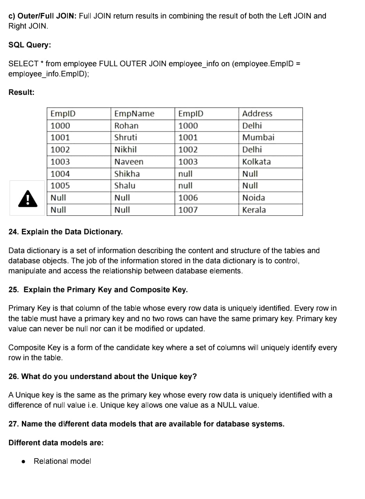
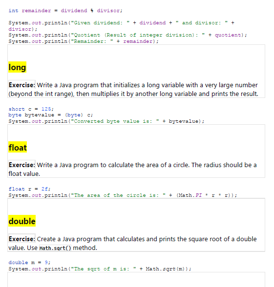
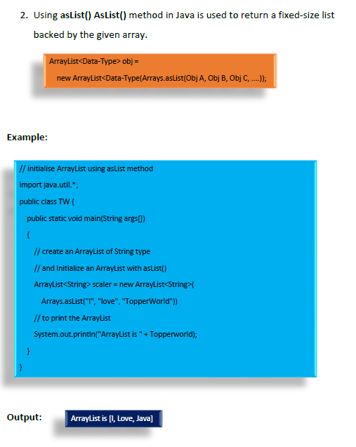
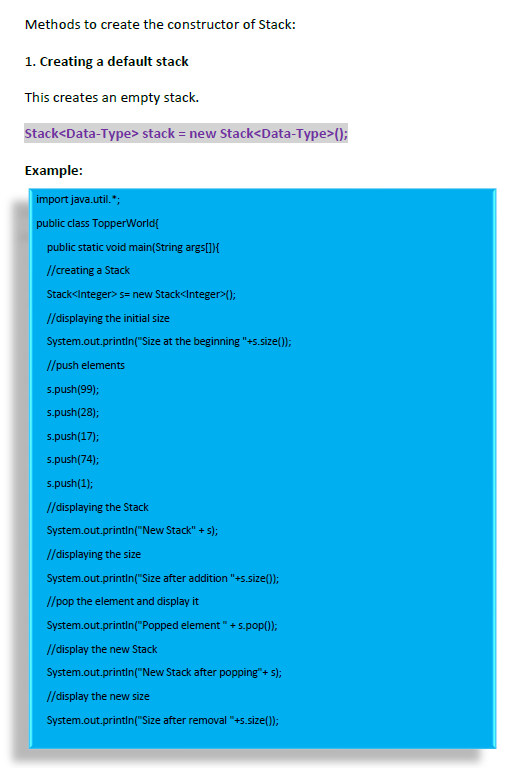
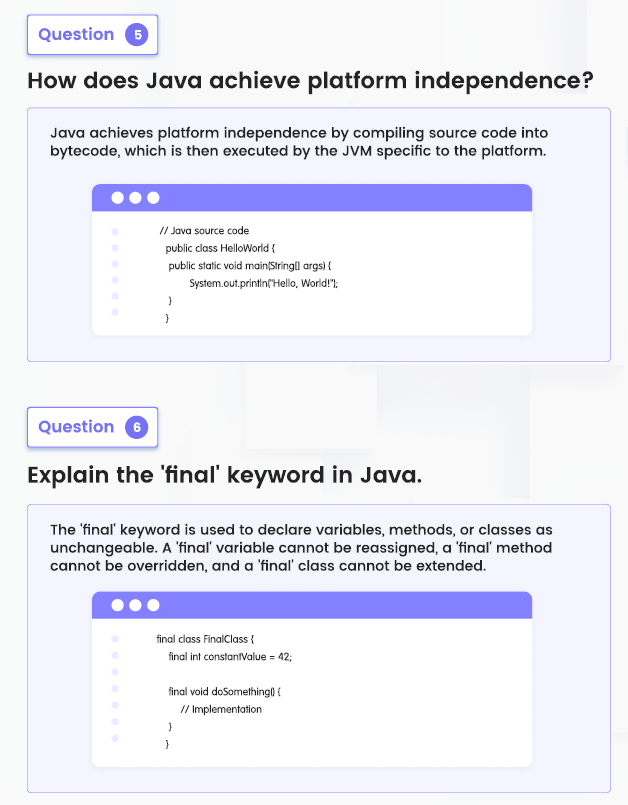
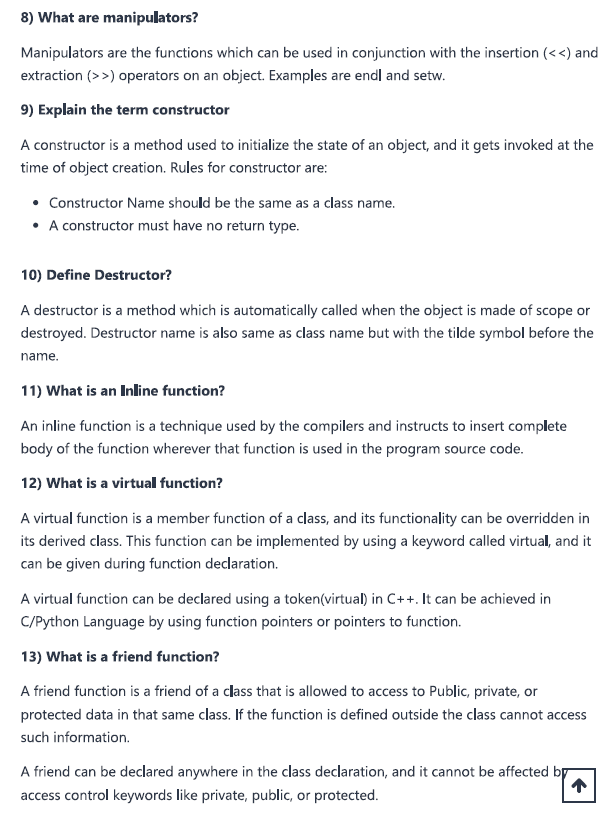
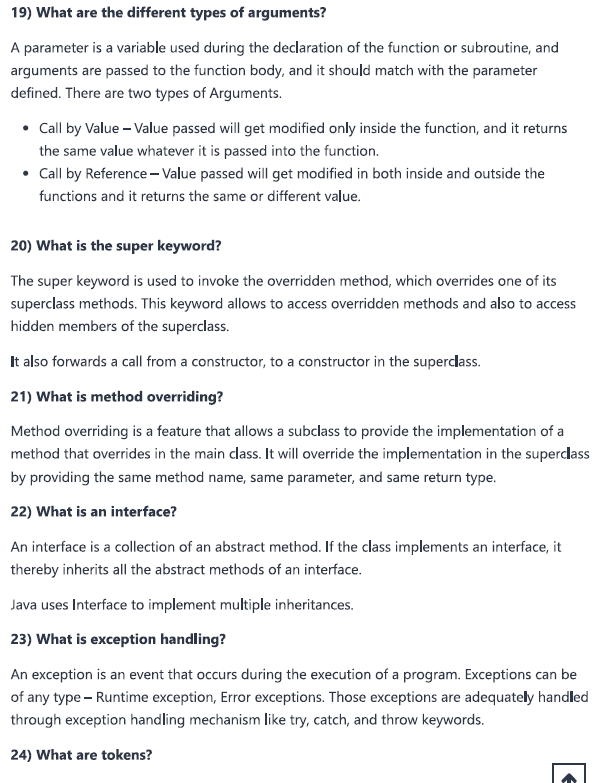
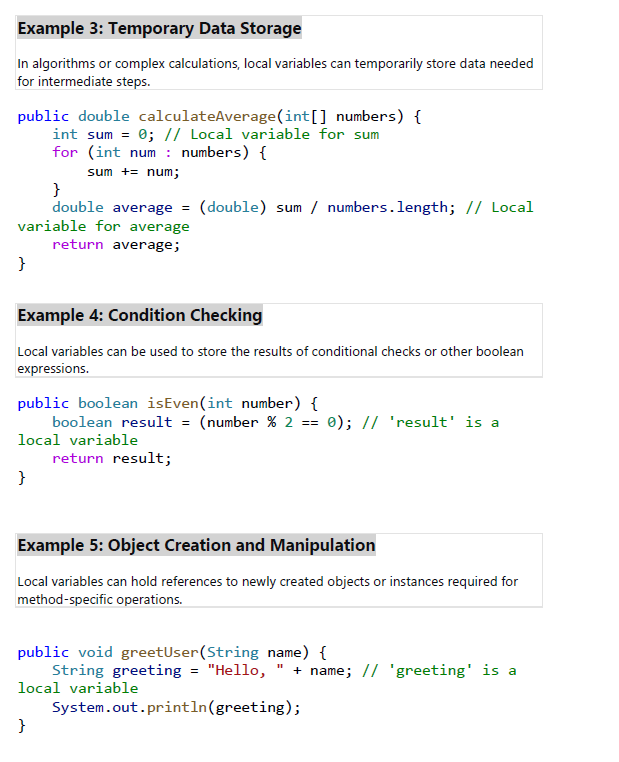

# Static-NON ACCESS MODIFIERS

Static in Java is a non-access modifier used for methods, variables, blocks, and nested classes. It is primarily associated with the class rather than instances of the class, meaning that the static keyword creates a class-level member. This allows static members to be accessed directly by the class name without needing to instantiate the class.

## 1. Static Variables: 

**Class Variables**: Static variables are also known as class variables because they are associated with the class and common to all its instances. They are declared by using the keyword static. 

**Initialization**: They are initialized only once, at the start of the execution. The static variable will get memory only once, in the class area at the time of class loading. 

**Example Usage**: They can be used to refer to the common property of all objects (which is not unique for each object), e.g., the company name of employees, college name of students, etc. 

**Memory Efficiency**: Using static variables makes your program more memory efficient (it saves memory). Static variables are stored in the static memory, and they are part of the class and are created when the class is loaded by the JVM (Java Virtual Machine).

### Key Characteristics of Static Variables:

• **Shared Among Instances**: All instances of the class share the same static variable. If changes are made to the static variable by one instance, all other instances will see the effect of the change.

• **Memory Efficient**: Static variables are allocated memory only once in the class area at the time of class loading, which makes the program more memory efficient.

• **Class Level Access**: Static variables can be accessed directly by the class name, without needing to instantiate an object of the class.

Example 1 Static Variable:

Lets Consider a simple example where we have a class Employee with a static variable companyName. Since the company name is common to all employees, it makes sense to make it a static variable. So let’s start. 

```java
public class Employee { 
    // Static variable 
    public static String companyName = "LinkedinCommunity"; 
    
    // Instance variables 
    private String name; 
    private int id; 
    
    // Constructor 
    public Employee(String name, int id) { 
        this.name = name; 
        this.id = id; 
    } 
    // Method to display employee details 
    public void displayDetails() { 
        System.out.println("ID: " + id + ", Name: " + name + ", Company: " + companyName); 
    } 
    
    // Main method 
    public static void main(String[] args) { 
        Employee emp1 = new Employee("Alice", 1); 
        Employee emp2 = new Employee("Bob", 2); 
        // Displaying details of employees 
        emp1.displayDetails(); 
        emp2.displayDetails(); 
        // Changing the company name 
        Employee.companyName = "LinkedinCommunity Learning"; 
        
        // Displaying details again to see the effect of change 
        emp1.displayDetails(); 
        emp2.displayDetails(); 
    } 
}
```

In this example:

• companyName is a static variable associated with the class Employee and shared by all its instances.

• Each Employee object has its own name and id (instance variables) but shares a single copy of the static variable companyName.

• When we change the companyName to " LinkedinCommunity Learning ", this change is reflected for both emp1 and emp2, as they share the same companyName.

• The displayDetails method shows how to access the static variable. It can be accessed directly inside the class without using the class name, but from outside the class, you should use ClassName.variableName, e.g., Employee.companyName.

### Usage Considerations:

• Use static variables for properties that are common to all instances of a class, such as company names, counter variables to keep track of the number of objects created, or constants.

• Remember that since static variables are shared among all instances of a class, changes made by one instance will affect all other instances.

• Access static variables using the class name from outside the class to highlight that they belong to the class level, not to any particular instance.

Another Example 2 for Static Variable: 

```java
public class MyClass { 
    // Static variable 
    static int staticCounter = 0; 

    // Instance variable 
    int instanceCounter = 0; 
    
    public MyClass() { 
        staticCounter++;  // Increment the static counter 
        instanceCounter++;  // Increment the instance counter 
    } 
    
    public static void main(String[] args) {
         
         MyClass obj1 = new MyClass(); 
         MyClass obj2 = new MyClass(); 
         MyClass obj3 = new MyClass(); 
         
         // Accessing the static variable through the class name 
         System.out.println("Static Counter: " + MyClass.staticCounter);  // Output: 3 
         
         // Instance variables are accessed through the instances, as before 
         
         System.out.println("Instance Counter for obj1: " + obj1.instanceCounter); // Output: 1 
         System.out.println("Instance Counter for obj2: " + obj2.instanceCounter); // Output: 1 
         System.out.println("Instance Counter for obj3: " + obj3.instanceCounter); // Output: 1 
    } 
}
```

This approach clarifies the nature of staticCounter as a class variable, not an instance variable, and aligns with Java best practices for accessing static members. In contrast, the instanceCounter variable is unique to each instance and is independent of the static variable's state.

### POINTS TO REMEMBER

#### 1. Single Copy: 

Static variables are stored in the static memory, and there is only a single copy of each static variable, regardless of how many instances of the class exist. This means all instances of the class share the same static variable. 

#### 2. Class Level Scope: 

Since static variables are associated with a class rather than any individual instance, they can be accessed directly by the class name and don't require an object to be accessed (though they can be accessed via objects, this is not recommended due to readability concerns). 

#### 3. Initialization: 

Static variables are initialized when the class is loaded by the Java Virtual Machine (JVM). They can be initialized during declaration or within a static block in the class. Static blocks are executed when the class is first loaded, making them ideal for complex initialization sequences. 

#### 4. Default Values: 

If a static variable is not explicitly initialized, it will be given a default value based on its data type (null for objects, 0 for numeric types, false for boolean, etc.), similar to instance variables. 

#### 5. Memory Efficiency: 

Using static variables can make your program more memory-efficient since they do not belong to any instance; each class only has one copy, regardless of the number of instances. 

#### 6. **Lifetime**:

The lifetime of static variables spans the entire execution of the program. They are created when the class is loaded and destroyed when the program terminates or the class is unloaded. 

## 2. Static Methods: 

Static methods in Java, also known as class methods, are defined using the static modifier. These methods belong to the class rather than any particular instance of the class. This means they can be called without creating an object of the class. Here's a detailed look at static methods:

### Key Characteristics of Static Methods:

1. **Class Level**: 

Static methods are associated with the class itself, not with any specific object created from the class. As a result, they can be invoked directly using the class name. 

2. **Access to Static Members Only**:

 Within static methods, you can only directly access other static methods and static variables. They cannot access instance methods and instance variables directly because they do not operate on instances of the class. 
 
3. **No this or super**: 
 
 Since static methods do not belong to a specific instance, they cannot use this or super keywords, as those are related to instance-level context.

4. **Usage**: 

Static methods are commonly used for utility or helper functions that don't require any object state. Since they don't require an instance to be invoked, they're also used in scenarios where methods need to be accessed without creating an object, like in the main method which serves as the entry point for Java applications.

### When to Use Static Methods:

• **Utility Functions**: When a function performs a general-purpose task that doesn't depend on instance variables, it should be declared static. For example, a method to calculate the square of a number could be static since it doesn't rely on any object state.

• **Factory Methods**: Static methods are often used for factory method patterns, where a method is responsible for creating instances of a class.

• **Main Method**: The main method in Java is static, allowing the JVM to invoke it without creating an instance of the class.

Example Code Static Method: 

Consider a class Calculator with a static method that calculates the sum of two numbers:

```java
public class Calculator { 

    // Static method to add two numbers 
    public static int add(int num1, int num2) { 
        return num1 + num2; 
    } 
    
    // Instance method 
    public int multiply(int num1, int num2) { 
        return num1 * num2; 
    } 
    
    public static void main(String[] args) { 
        // Calling the static method without creating an instance 
        int sum = Calculator.add(5, 3); 
        System.out.println("Sum: " + sum); 
        
        // Static methods can also be called using an object, but it's not recommended 
        Calculator calc = new Calculator(); 
        sum = calc.add(10, 20);  // Not recommended 
        System.out.println("Sum: " + sum); 
        
        // Calling an instance method requires an instance of the class 
        int product = calc.multiply(5, 4); 
        System.out.println("Product: " + product); 
    } 
}
```

In this example, the add method is static and can be called without creating an instance of the Calculator class. The multiply method, however, is an instance method and requires an object to be called.

### Best Practices: 

1. Use Static Methods When the Method Does Not Depend on Instance Variables. 

```java
public class Utility { 

    // Static method that calculates the square of a number 
    public static int square(int number) { 
        return number * number; 
    } 
    
    public static void main(String[] args) { 
        // Call the static method without an object 
        int result = Utility.square(5); 
        System.out.println("Square: " + result); 
    } 
}
```

2. Avoid Using Static Methods to Access or Modify the State of an Object

Avoid using static methods to access or modify the state of an object; they should be used for operations that are independent of object state.

```java
public class Counter { 
    private int count = 0;  // Instance variable 
    
    // Non-static method to increment the counter 
    public void increment() { 
        count++; 
    } 
    
    public int getCount() { 
        return count; 
    } 
    
    public static void main(String[] args) {
        Counter counter = new Counter(); 
        counter.increment(); // Correct way to modify instance state 
        System.out.println("Count: " + counter.getCount()); 
    }
}
```

In this example, the increment method is not static because it modifies the count instance variable. Making increment a static method would be incorrect as static methods should not access or modify the instance state.

## Instance Members:

• Instance Variables: These are specific to each instance of a class. Each object has its own copy of an instance variable.

• Instance Methods: These operate on the instance variables of the object that invokes the method. They require an instance of the class to be called because they can access and modify the instance variables that belong to that specific object. 

## Static Members:

• Static Variables: These are class-level variables. There is only one copy of a static variable, and it is shared among all instances of the class.

• Static Methods: These belong to the class rather than any particular instance. They can be called without creating an instance of the class. Because they don't operate on an instance, they cannot directly access or modify instance variables.

## Why Making increment method Static Would Be Incorrect:

1. Access to Instance Variables: The increment method modifies count, which is an instance variable. A static method cannot directly access instance variables because it does not have access to an instance of the class (i.e., there's no this context). Instance variables are tied to specific objects, but a static method is not tied to any object.

2. Object State Modification: The purpose of the increment method is to modify the state (count) of a specific Counter object. Making this method static would remove its ability to operate on an object's state, contradicting the method's intended functionality.

3. Conceptual Mismatch: Static methods are meant for operations that are independent of the state of specific instances of a class. The operation performed by increment is inherently tied to the state of a particular Counter object, making it conceptually inappropriate to be static.

Example of Incorrect Static increment Method:

```java
public class Counter { 
    private int count = 0;    // Instance variable 
    
    // Incorrect use of static with an instance variable 
    public static void increment() { 
        count++;  // Compilation error: Cannot make a static reference to the non-static field count 
    } 
}
```

If we tried to make increment static and access the count variable, we'd encounter a compilation error because static methods can't access instance variables like count

3. Be Cautious with Static Methods in Subclasses

• Be cautious with static methods in subclasses: they don't override methods from the superclass since static methods are not part of the instance of a class. This can lead to unexpected behavior if you're not clear about which method is being called.

Example 1: 

```java
class Parent { 
    // Static method in the base class 
    static void display() { 
        System.out.println("Display in Parent"); 
    } 
} 

class Child extends Parent { 
    // This does not override the display in Parent, it's a separate method 
    static void display() { 
        System.out.println("Display in Child"); 
    } 
}

public class TestStaticMethods { 
    
    public static void main(String[] args) { 
        Parent parent = new Parent(); 
        Parent childAsParent = new Child(); 
        parent.display();  // Calls Parent's display 
        childAsParent.display(); // Also calls Parent's display because the method is static 
        
        // To call Child's display, we need a reference of type 
        Child Child child = new Child(); 
        child.display(); // Calls Child's display 
    } 
}
```

In this example, both the Parent and Child classes have a static method named display. Even though Child extends Parent, Child's display method does not override Parent's display method because static methods are associated with the class, not instances. When you call display on a Parent reference pointing to a Child object, it calls the Parent's display method, illustrating the need for caution with static methods in subclasses.

## Why the Above Example 1 Might Be Confusing:

• The example shows accessing static methods through instances (parent.display() and child.display()) to illustrate how static methods are associated with the class type of the reference, not the class type of the object. This can be confusing because it suggests that creating instances is necessary to access static methods, which is not the case.

• The example intends to demonstrate that even when you have a reference of type Parent pointing to an object of type Child (Parent childAsParent = new Child();), calling a static method (childAsParent.display();) invokes the method defined in the reference's compile-time type (Parent), not the actual object's runtime type (Child). This is a unique behavior of static methods and differs from how instance methods behave with polymorphism.

**Clarified Example 1**: 

To avoid confusion, it's better to access static methods using the class name, as shown below:

```java
public class TestStaticMethods { 
    
    public static void main(String[] args) { 
        // Correct way to call static methods 
        
        Parent.display(); // Calls Parent's 
        display Child.display(); // Calls Child's display 
        
        // Although possible, it's discouraged to call static methods through instances 
        // Parent parent = new Parent(); 
        // parent.display(); // Not recommended 
        // Child child = new Child(); 
        // child.display(); // Not recommended 
    } 
}
```

In this revised example, static methods are accessed in the recommended way, using the class names directly. This approach clearly communicates that the methods are static and avoids the potential confusion associated with accessing static methods through instances.

**Example 2:**

```java
class Parent { 
    // Static method in the parent class 
    static void display() { 
        System.out.println("Display in Parent"); 
        } 
} 

class Child extends Parent { 
    // Child class can access the parent's static method 
    static void callParentDisplay() { 
        // Calling the static method of the parent class 
        Parent.display(); 
    } 
} 

public class TestStaticMethodCall { 
    public static void main(String[] args) { 
        // Calling the parent's static method from the child class without creating an instance 
        Child.callParentDisplay(); // This will output "Display in Parent" 
    } 
}
```

In this example, the Child class has a static method callParentDisplay that calls the Parent class's static method display using Parent.display(). When Child.callParentDisplay() is called in the main method, it internally calls Parent.display(), demonstrating that the child class can access static methods of its parent class directly through the class name, without the need for creating an instance.

**Example 3.**

```java
class Device { 
    static void control() { 
        System.out.println("Controlling Device"); 
    } 
} 

class TV extends Device { 
    static void control() { 
        System.out.println("Controlling TV"); 
    } 
} 

class DVDPlayer extends Device { 
    static void control() { 
        System.out.println("Controlling DVD Player"); 
    } 
} 

public class UniversalRemote { 
    public static void main(String[] args) { 
        Device myRemote = new TV(); // Compile-time: Remote is set to control TV 
        myRemote.control(); // Output: "Controlling Device" 
        myRemote = new DVDPlayer(); // Compile-time: Remote is set to control DVD Player 
        myRemote.control(); // Output: "Controlling Device" 
    } 
}
```

**Above Code Explanation:**

This code demonstrates how static methods behave in an inheritance hierarchy in Java, particularly focusing on method hiding and static method binding at compile time. Let's break down the key concepts and components of the code to understand it better:

### Classes and Static Methods

1. Device Class: This is the base class with a static method control() that prints "Controlling Device".

2. TV Class: This is a subclass of Device that hides the control() method of Device with its own static method that prints "Controlling TV". It doesn't override it because static methods cannot be overridden; they can only be hidden in subclasses.

3. DVDPlayer Class: Another subclass of Device, similar to TV, it hides the control() method with its version, printing "Controlling DVD Player".

**Main Method and Static Method Behavior**

In the main method of the UniversalRemote class, the code demonstrates how static methods are invoked based on the reference type, not the object type.

**First Part:** 

```java
Device myRemote = new TV(); 
myRemote.control(); // Output: "Controlling Device" 
```

Here, myRemote is a reference variable of type Device, but it points to an object of type TV. When myRemote.control() is called, it invokes the control method of the Device class, not TV, despite myRemote pointing to a TV object. This is because static method calls are resolved at compile time based on the reference type (Device in this case), not the runtime type of the object (TV).

**Second Part**: 

```java
myRemote = new DVDPlayer(); 
myRemote.control(); // Output: "Controlling Device" 
```

Now, the myRemote reference is reassigned to point to a DVDPlayer object. However, when myRemote.control() is called, it still invokes the control method of the Device class. Again, this is because myRemote is a Device type reference, and static methods are bound based on the reference type at compile time, not the runtime type.

**Key Take aways For Static Methods**:

• **Static Method Binding**: Static methods are bound at compile time based on the reference type. Even if the reference points to a subclass object at runtime, the static method of the reference type (declared type) is called.

• **Method Hiding**: When a subclass defines a static method with the same signature as a static method in the superclass, the subclass's method hides the superclass's method. This is not the same as overriding, where a subclass's instance method can override a superclass's instance method.

• **Best Practices**: Accessing static methods using a reference variable, as shown in this example, can be confusing and is generally discouraged. It's clearer and more conventional to call static methods using the class they belong to, like Device.control() or TV.control(), to avoid ambiguity.

This example is illustrative of some of the subtleties of Java's handling of static methods in an inheritance context, highlighting the importance of understanding how static methods are resolved and the difference between method hiding and overriding.

### CONCEPT OF REFERENCE 

Imagine you have a remote control for a drone. The remote control itself doesn't fly, but it controls the drone that does. In this analogy:

• The drone is like an object in Java, which is an instance of a class.

• The remote control is like a reference in Java, which points to or refers to an object.

When you create an object in Java using the new keyword, you are essentially creating a new "drone" (object). To control or access this drone, you need a remote control (reference). Here's how it looks in code:

```java
Drone myDrone = new Drone();
```

• Drone is the class, like the model or type of drone you have.

• myDrone is the reference, like your remote control. It's the name you use to access the object.

• new Drone() is the actual object, like the physical drone being created and ready to fly.

So, the reference (myDrone) points to an actual object in memory (an instance of the Drone class). When you want the drone to fly, you use the remote control (myDrone.fly()). Similarly, in Java, when you want to call a method on an object, you use the reference.

### Key Points:

• A reference is a variable that holds the memory address of an object. It points to the actual object in the computer's memory.

• You use this reference to access the object's methods and attributes.

• A reference can be reassigned to point to another object, or it can be set to null, meaning it points to no object.

A "reference" is similar to a pointer in other programming languages, but with a higher level of abstraction. It's a variable that holds the memory address of an object, not the object itself. When you create an object in Java, you're creating it in the heap memory, and the variable you assign it to is a reference to that object.

```java
ClassName objectReference = new ClassName();
```

• ClassName is the type of the object you're creating, and it determines what kind of data (object) the reference will point to.

• objectReference is the reference variable. It stores the memory address where the actual ClassName object is located in the heap. You use this reference to interact with the object.

• new ClassName() is the part of the code that actually creates the object in memory (heap), and the memory address of this new object is assigned to objectReference.

The reference variable (objectReference) acts like a remote control for the object it points to, allowing you to access and manipulate the object's fields and methods.

## 3. Static Classes:

• **Nested Classes Only**: In Java, only nested classes can be static. A static nested class is behaviorally a top-level class that has been nested in another class for packaging convenience.

• **Access**: Static nested classes can access all static members of its enclosing class, including private ones, but it cannot access non-static members.

### Key Characteristics of Static Nested Classes:

1. **Nested Classes Only**: Static classes can only be nested within other classes. They cannot be top-level classes.

2. **Behavior**: They behave like top-level classes but are packaged within another class for logical grouping or to encapsulate them within the outer class for better organization. 

3. **Access to Enclosing Class Members**: Static nested classes can access the static members of the enclosing class, including private static members. However, they cannot access the instance variables or instance methods of the enclosing class directly, since they do not belong to an instance of the enclosing class.

**Example of Static Nested Class**: 

Consider a scenario where we have an OuterClass that represents a type of computer, and within it, we have a static nested class CPU that represents a component of the computer.

```java
public class OuterClass { 
    private static String computerType = "Gaming Computer"; private int id; 
    
    // Static nested class 
    public static class CPU { 
        public void displayType() { 
            // Can access the static variable of the outer class 
            System.out.println("The computer type is: " + computerType); 
            
            // Cannot access the instance variable 'id' of the outer class directly 
            // System.out.println("Outer class ID: " + id); // This would be an error 
        } 
    } 
    
    public void setId(int id) { 
        this.id = id; 
    } 
    
    public static void main(String[] args) { 
        OuterClass outer = new OuterClass(); outer.setId(101); 
        // Creating an instance of the static nested class 
        OuterClass.CPU cpu = new OuterClass.CPU(); cpu.displayType(); 
    } 
}
```

**In the Above example**:

• OuterClass represents the outer class that has a static variable computerType and an instance variable id.

• CPU is a static nested class defined within OuterClass. It has a method displayType that can access the static variable computerType of OuterClass but cannot access the instance variable id directly because CPU does not have a reference to an instance of OuterClass.

• In the main method, an instance of CPU is created without needing an instance of OuterClass. The displayType method is then called to demonstrate access to the outer class's static variable.

**Example 2**: 

```java
public class OuterClass { 
    // Static variable of the outer class 
    private static String staticVariable = "Outer Static Variable"; 
    
    // Static nested class 
    public static class NestedClass { 
        public void display() { 
            // Can access the static variable of the outer class 
            System.out.println("Message from the nested class: " + staticVariable); 
        } 
    } 
    
    public static void main(String[] args) { 
        
        // Creating an instance of the static nested class 
        OuterClass.NestedClass nestedObject = new OuterClass.NestedClass(); 
        
        // Calling a method of the nested class 
        nestedObject.display(); // Outputs: Message from the nested class: Outer Static Variable 
    } 
}
```

**Key Points of the above Example 2:**

• Nested Class Declaration: NestedClass is declared static and is nested within OuterClass. It behaves like any other top-level class but is packaged within OuterClass for better organization. 

• Access to Static Members: NestedClass has access to the static members of OuterClass (like staticVariable), even if they are private. This is shown in the display method, where NestedClass accesses and prints OuterClass's staticVariable.

• Instantiation: An instance of a static nested class is created without needing an instance of the outer class. In the main method, new OuterClass.NestedClass() creates an instance of NestedClass.

• Method Call: The display method of NestedClass is called on its instance, showing how a static nested class can be used similarly to a top-level class.


NOTE: This documentation has focused exclusively on the nuances of the "static" non-access modifier in Java. There are other significant non-access modifiers, such as "final," "abstract," "synchronized," and "volatile," which also play crucial roles in Java programming. Each of these keywords encompasses a breadth of functionality and intricacies, similar to "static." We plan to explore each of these modifiers in detail in our upcoming discussions, delving into their unique attributes and applications within Java.

# Arrays properties and methods

Let's explore the key features as well as concepts of an array:

* JavaScript is known as a dynamically typed language because of the array's ability to store many types of data.


Let's examine each array method and function individually for a better understanding.

1. .length

* The.length property in JavaScript provides the number of items that are kept inside an array. Regard it as the counter that counts the items within your array "box."


2. .toString()

* Although arrays can hold multiple things, there may be situations in which you need to combine them into a single string. The.toString() technique is useful in this situation. It takes your array and converts its elements into a string representation separated by commas.


3. .join()

* The **.join()** method joins the components of an array into a single string, much like.toString() does. It does, however, give you more options for how you wish to join .

* **Iterates**: The array's elements are iterated over by the.join() function.

* **Applies Separator**: It places a designated separator such as a space or comma between every element.

* **Returns String**: Lastly, the merged string with the separators is returned.


4. .pop()

* In JavaScript arrays, the.pop() method functions as a convenient "pop-off" method for removing the last remaining element. Let's put it simply as follows:

What Functions It Has: 

Removes : .pop() removes the final element of an array. 

Returns : The deleted element is also returned as a value.


5. .push()

* In JavaScript arrays, the.push() method functions as a simple "pusher" that appends additional members to the last element in the array.

* Adds: An array's end can get one or more elements by using the.push() function.

* Returns: After the elements are added, it returns the array's new length.


6  .shift()

* In JavaScript arrays, the.shift() method functions as a kind of magical "shifter," rearranging the remaining elements and eliminating the initial one.

* Removes: .shift() takes out the array's initial element and returns a value for it.

* Shifts: To fill the space left by the removal, it moves every other element one position to the left.


7  .unshift()

* JavaScript arrays provide a useful "unshifting" utility in the form of the .unshift() method, which adds elements to the beginning and shifts the current elements.

* Adds: The function .unshift() appends one or more elements to an array's beginning.

* Shifts: To make room for the new additions, it moves every element that is already there one position to the right.

* Returns: After the elements are added, it returns the array's new length.


8.  .reverse()
 
* JavaScript arrays can be mirrored by using the .reverse() method to change the element order.

* Reverses Order: The array's elements are arranged in reverse order when using the

* .reverse() method. Accordingly, the first element becomes the final one, the second, the next-to-last, and so forth.

* Returns: The array itself has been altered, and the elements are now returned in the opposite order.


09. .slice()

* In JavaScript arrays, the .slice() method functions as a "slicer," enabling you to take a certain section of the array and create a new array.

* Take Outs Portion : The function .slice() creates a new array by extracting a portion of the original array's members.

* Agrees Setting parameters The startIndex and endIndex parameters are optional. Setting parameters

* startIndex (Optional): Indicates the index of the element to be included at that index as the first entry in the new array (defaults to 0).

* endIndex (Optional): Indicates the element's index following the final element to include; this is not the element's index; the value of endIndex defaults to the end of the array.


10. .splice()

* JavaScript arrays'.splice() method is a flexible tool that lets you add, remove, and replace components in an array all at once.

* Modifies in Place: There are three primary ways that .splice() directly modifies the original array:

* Eliminates: It begins at a given index and eliminates a predetermined amount of entries.

* Adds (Optional): After removal, you can optionally supply replacement items to be placed at the designated index.

* Setting parameters

* startIndex (Required): Indicates the inclusive index at which the removal and insertion should begin.

* deleteCount (Optional): Indicates how many elements to remove; if left blank, one element will be removed. Defaults to 1. element1, element2,... (Optional): After removing elements (if specified), zero or more elements are to be put at the startIndex.


The Arrya contains search and sorting capabilities. We'll talk about how to discover and arrange elements using methods like indexOf(), lastIndexOf(), sort().

01. .indexOf()

* indexOf(value, fromIndex): Returns the index of the first instance of a given value in the array, or -1 if it cannot be found.

02. .lastIndexOf()

* lastIndexOf(value, fromIndex): This function locates the value's last occurrence and is similar to indexOf.


03. .sort()

* =>sort (compareFunction): Using a supplied comparison function, sorts the array in place in either ascending or custom order.

By default, items are arranged either numerically or alphabetically (string). Special request: Define a function that takes two elements (a, b) and returns: 0 if elements are deemed equal; a < b for sorting a before b (descending); a > b for sorting an after b (descending).


Applying higher order functions and iterations in arrays such as for, for...of, for...in, forEach(), map(), reduce(), and filter().

01. for

* For loops: Offer an effective way of iterating a predetermined number of times in response to a counter variable.

02.  for…of

* for...of loops: Iterate directly over the values of an iterable object (like arrays, strings).

03.  for…in

* loops: Iterate over the enumerable properties (keys) of an object.

04. forEach()

* forEach(callback): Executes a provided callback function for each element in an array.


05. .map()

* JavaScript's .map() function is an effective tool for converting arrays by applying functions to each element and generating a new array with the result data.

* Functionality:

* array.map(callbackFunction) iterates over the original array (array), calling the provided callbackFunction once for each element.

* The callbackFunction receives three arguments:

o currentValue: The current element being processed in the iteration.

o index (optional): The index of the current element in the original array.

o array (optional): The original array being iterated over.

* The callbackFunction should return a new value for each element.


06. .reduce()

* The .reduce() method in JavaScript is a versatile tool used to combine all elements of an array into a single value

* Functionality:

* array.reduce(callbackFunction, initialValue) iterates over the original array (array), calling the provided callbackFunction once for each element and an accumulator value.

* The callbackFunction receives four arguments:
accumulator: The value accumulated so far (initialized with initialValue or the first element if omitted).

1. currentValue: The current element being processed in the iteration.

2. currentIndex (optional): The index of the current element in the original array.

3. array (optional): The original array being iterated over.

*  The callbackFunction should return a new value for the accumulator, which will be used in the next iteration.

* The final accumulated value after processing all elements is returned by the .reduce() method.


07. .filter()

* array.filter(callbackFunction) iterates over the original array (array), calling the provided callbackFunction once for each element.

* The callbackFunction receives three arguments:

1.  **currentValue**: The current element being processed in the iteration.

2.  **index (optional)**: The index of the current element in the original array.

3.  **array (optional)**: The original array being iterated over.

* The callbackFunction should return a boolean value (true or false).

* The .filter() method creates a new array containing only the elements from the original array where the callbackFunction returned true.


## 1) what are static blocks and static initializers in Java ?

Static blocks or static initializers are used to initialize static fields in java. we declare static blocks when we
want to intialize static fields in our class. Static blocks gets executed exactly once when the class is loaded. Static blocks are executed even before the constructors are executed.

## 2) How to call one constructor from the other constructor ?

With in the same class if we want to call one constructor from other we use this() method. Based on the number of parameters we pass appropriate this() method is called.

Restrictions for using this method :

1) this must be the first statement in the constructor

2) we cannot use two this() methods in the constructor

## 3) What is method overriding in java ?

If we have methods with same signature (same name, same signature, same return type) in super class and subclass then we say subclass method is overridden by superclass.

**When to use overriding in java**

If we want same method with different behaviour in superclass and subclass then we go for overriding. When we call overridden method with subclass reference subclass method is called hiding the superclass method.

## 4) What is super keyword in java ?

Variables and methods of super class can be overridden in subclass . In case of overriding , a subclass object call its own variables and methods. Subclass cannot access the variables and methods of superclass because the overridden variables or methods hides the methods and variables of super class. But still java provides a way to access super class members even if its members are overridden. Super is
used to access superclass variables, methods, constructors.

Super can be used in two forms :

1) First form is for calling super class constructor.

2) Second one is to call super class variables,methods. Super if present must be the first statement.

## 5) Difference between method overloading and method overriding in java ?

# Top 100 Java Interview Questions & Answers

## 1. What is a JVM?

Answer: JVM is Java Virtual Machine which is a run time environment for the compiled java class files.

## 2. What is the right data type to represent a price in Java?

Answer: BigDecimal, if memory is not a concern and Performance, is not critical, otherwise double with
predefined precision.

## 3. Does Java support multiple inheritances?

Answer: Java doesn’t support multiple inheritances.

## 4. What are the supported platforms by Java Programming Language?

Answer: Java runs on a variety of platforms, such as Windows, Mac OS, and the various versions of
UNIX/Linux like HP-Unix, Sun Solaris, Red hat Linux, Ubuntu, Cent OS, etc.

## 5. List any five features of Java?

Answer: Some features include Object Oriented 

Platform Independent

Robust

Interpreted

Multi-threaded

## 6. Explain method overloading?

Answer: When a Java program contains more than one methods with the same name but different
properties, then it is called method overloading.

## 7. What restrictions are placed on the location of a package statement within a source code file?

Answer: A package statement must appear as the first line in a source code file (eliminating blank lines
and comments).

## 8. What method is used to specify a container’s layout?

Answer: The setLayout() method is used to specify a container’s layout.

## 9. What is the immediate superclass of the Applet class?

Answer: The Panel class is the immediate superclass of the Applet class.

## 10. What are the access modifiers in Java?

Answer: There are 3 access modifiers. Public, protected and private, and the default one if no identifier is
specified is called friendly, but programmer cannot specify the friendly identifier explicitly.

## 11. What is are packages?

Answer: A package is a collection of related classes and interfaces providing access protection and
namespace management.

## 12. What is meant by Inheritance and What are its advantages?

Answer: Inheritance is the process of inheriting all the features from a class. The advantages of
inheritance are reusability of code and accessibility of variables and methods of the super class by
subclasses.

## 13. Can we rethrow the same exception from catch handler?

Answer: Yes, we can rethrow the same exception from our catch handler. If we want to rethrow checked
exception from a catch block we need to declare that exception.

## 14. what value is a variable of the String type automatically initialized? 

Answer: The default value of a String type is null.

## 15. When a thread blocks on I/O, what state does it enter?

Answer: When it blocks on I/O, A thread enters the waiting state.

## 16. Which containers use a Flow Layout as their default layout?

Answer: The Panel and Applet classes use the Flow Layout as their default layout.

## 17. Explain Java Coding Standards for Constants ? 

Answer: Constants in java are created using static and final keywords.

1) Constants contain only uppercase letters.

2) If the constant name is a combination of two words it should be separated by an underscore.

3) Constant names are usually nouns.
Ex:MAX_VALUE, MIN_VALUE, MAX_PRIORITY, MIN_PRIORITY

## 19. What is synchronization and why is it important?

Answer: The term synchronization is the ability to control the access of multiple threads to shared
resources. And it is important because, without it, it is not possible for one thread to modify a shared

object while another thread is in the process of using or updating that object’s value. This often leads to
major errors.

## 20. Explain Java Coding Standards for variables? Answer:

1) Variable names should start with small letters.

2) Variable names should be nouns

3) Short meaningful names are recommended.

4) If there are multiple words every inner world should start with Uppercase character.
Ex : string,value,empName,MEP salary

## 21. What is an abstract class?

Answer: An abstract class is a class designed with implementation gaps for subclasses to fill in and is
deliberately incomplete.

## 22. Name three Component subclasses that support painting?

Answer: The Canvas, Frame, Panel, and Applet classes support painting.

## 23. What is the difference between JDK and JVM?

Answer: Full-Form: Java Development Kit Full Form: Java Virtual Machine For Development Purpose To execute the java programs

It provides all the tools, executables and binaries required to compile, debug and execute a Java
Program

The execution part is handled by JVM to provide machine independence.

## 24. Why Java doesn’t support multiple inheritances?

Answer: Because of “Diamond Problem”, Java doesn’t support multiple inheritances in classes.

## 25. What modifiers may be used with an inner class that is a member of an outer class?

Answer: A (non-local) inner class may be declared as public, protected, private, static, final, or abstract.

## 26. Which java. util classes and interfaces support event handling?

Answer: The Event Object class and the Event Listener interface support event processing.

## 27. What is a transient variable?

Answer: A transient variable is a variable that may not be serialized.

## 28. Is null a keyword?

Answer: No, the null is not a keyword.

## 29. What is an applet?

Answer: Applet is a dynamic and interactive program that runs inside a web page displayed by a java
capablebrowser

## 30. What is the lifecycle of an applet?

Answer:
init() method – Can be called when an applet is first loaded start() method –
Can be called each time an applet is started. paint() method – Can be called
when the applet is minimized or maximized. stop() method – Can be used
when the browser moves off the applet’s page. destroy() method – Can be
called when the browser is finished with the applet.

## 31. What’s new with the stop(), suspend() and resume() methods in JDK 1.2 ?

Answer:
These methods have been deprecated in JDK 1.2.

## 32. What is the Vector class?

Answer: The term Vector class provides the ability to implement a growable array of objects.

## 33. What is the difference between the >> and >>> operators?

Answer: The >> operator carries the sign bit when shifting right while the >>> zero-fills bits that have
been shifted out.

## 34. What is the difference between this() and super()?

Answer: this() can be used to invoke a constructor of the same class whereas super() can be used to
invoke a super class constructor.

## 35. What is a native method?

Answer: A native method is a method that is applied in a language other than Java.

## 36. What value does read Line() return when it has reached the end of a file?

Answer:The readLine() method returns null when it has reached the end of a file.

## 37. What is the Java API?

Answer: The Java API is a large collection of ready-made software components that provide many
usefulcapabilities, such as graphical user interface (GUI) widgets.

## 38. Why there are no global variables in Java?

Answer: Global variables are globally accessible. Java does not support globally accessible variables due
to following reasons:
The global variables breaks the referential transparency Global variables creates collisions in namespace.

## 39. What are different types of access modifiers?

Answer: public: Any thing declared as public can be accessed from anywhere. private: Any thing declared
asprivate can’t be seen outside of its class. protected: Any thing declared as protected can be accessedby
classes in the same package and subclasses in the other packages. default modifier : Can beaccessed
only to classes in the same package.

## 40. What is Constructor?

Answer: A constructor is a special method whose task is to initialize the object of its class.
It is special because its name is the same as the class name.
They do not have return types, not even void and therefore they cannot return values.
They cannot be inherited, though a derived class can call the base class constructor. Constructor
is invoked whenever an object of its associated class is created.

## 41. What is an Iterator ?

Answer: The Iterator interface is used to step through the elements of a Collection.
Iterators let you process each element of a Collection.
Iterators are a generic way to go through all the elements of a Collection no matter Define How it is
organized.
Iterator is an Interface implemented a different way for every Collection.

## 42. What is the difference between Reader/Writer and InputStream/Output Stream?

Answer: The Reader/Writer class is character-oriented and the InputStream/OutputStream class is
byteoriented.

## 43. What is servlet?

Answer: Servlets are modules that extend request/response-oriented servers, such as java-enabled
webservers. For example, a servlet might be responsible for taking data in an HTML order-entry form and
applying the business logic used to update a company’s order database.

## 44. What is clipping?

Answer: Clipping is the process of confining paint operations to a limited area or shape.

## 45. What is memory leak?

A memory leak is where an unreferenced object that will never be used again still hangs around in
memory and doesnt get garbage collected.

## 46. Can a for statement loop indefinitely?

Answer: Yes, a for statement can loop indefinitely. For example, consider the following: for(;;)

## 47. Explain Java Coding standards for Methods? 
Answer:

1) Method names should start with small letters.

2) Method names are usually verbs

3) If a method contains multiple words, every inner word should start with an uppercase letter.
Ex : toString()

4) Method name must be combination of verb and noun Ex : getCarName(),getCarNumber()

## 48. Why Java is not a pure Object Oriented language?

Answer: Java supports primitive types such as int, byte, short, long, etc that why it is not said to be a
pure object-oriented language.

## 49. What are the access modifiers?

Answer: Java provides three access controls such as public, private and protected access modifier. When
none of these are used, it’s called default access modifier.

## 50. Can we overload the main method?

Answer: Yes, we can overload the main method with syntax as public static void main(String args[]).

## 51. What is the method in java?

Answer: It contains the executable body that can be applied to the specific object of the class.
The method includes method name, parameters or arguments and return type and a body of executable
code.
Syntax : type methodName(Argument List){
ex: public float add(int a, int b, int c) methods can have multiple arguments. Separate with
commas when we have multiple arguments. thrown in the method are instances of their subclass.

## 52. Explain about Automatic type conversion in java?

Answer:
Java automatic type conversion is done if the following conditions are met:

1) When two types are compatible
Ex: int, float int can be assigned directly to
float variable.

2) Destination type is larger than source type. Ex: int, long.
Int can be assigned directly to long .Automatic type conversion takes place if int is assigned to long
because long is larger datatype than int.
Widening Conversion comes under Automatic type conversion.

## 53. What is the difference between the prefix and postfix forms of the ++ operator?

Answer: The prefix form performs the increment operation and returns the value of the increment
operation. The postfix form returns the current value all of the expression and then performs the
increment operation on that value.

## 54. In how many ways we can do exception handling in java? Answer:

We can handle exceptions in either of the two ways :
1) By specifying a try-catch block where we can catch the exception.
2) Declaring a method with throws clause.

## 55. What does null mean in java?

Answer:
When a reference variable doesn’t point to any value it is assigned null.
Example: Employee employee;
In the above example employee object is not instantiate so it is pointed nowhere.

## 56. Can we define a package statement after the import statement in java?
Answer: We can’t define a package statement after the import statement in java. a package statement
must be the first statement in the source file. We can have commented before the package statement.

## 57. Define How many objects are created in the following piece of code? MyClass c1, c2, c3; c1 = new MyClass (); c3 = new MyClass ();

Answer: Only 2 objects are created, c1 and c3. The reference c2 is only declared and not initialized.

## 58. What is JSP?

Answer: JSP is a technology that returns dynamic content to the Web client using HTML, XML and
JAVAelements. JSP page looks like a HTML page but is a servlet. It contains Presentation logic
andbusiness logic of a web application.

## 59. What is the purpose of apache tomcat?

Answer: Apache server is a standalone server that is used to test servlets and create JSP pages. It is free
and open source that is integrated in the Apache web server. It is fast, reliable server to configure the
applications but it is hard to install. It is a servlet container that includes tools to configure and manage
the server to run the applications. It can also be configured by editing XML configuration files.

## 60. Explain where variables are created in memory?

Answer: When we declare variables are created in the stack. So when the variable is out of scope those
variables get garbage collected.

## 61. Can we use catch statement for checked exceptions?

Answer: If there is no chance of raising an exception in our code then we can’t declare catch block for
handling checked exceptions. This raises a compile-time error if we try to handle checked exceptions
when there is no possibility of causing an exception.

## 62. Explain a situation where finally block will not be executed?

Answer: Finally, the block will not be executed whenever JVM shutdowns. If we use system.exit(0) in try
statement finally block if present will not be executed.

## 63.What is UNICODE?

Answer: Unicode is used for internal representation of characters and strings and it uses 16 bits to
represent each other.

## 64. Explain about the main() method in java?

Answer: The main () method is the starting point of execution for all java applications. public
static void main(String[] args) {}
String args[] are an array of string objects we need to pass from command line arguments. Every
Java application must have at least one main method.

## 65. Define How destructors are defined in Java?

Answer: In Java, there are no destructors defined in the class as there is no need to do so. Java has its
owngarbage collection mechanism which does the job automatically by destroying the objects when no
longer referenced

## 66. What will be the output of Round(3.7) and Ceil(3.7)?

Answer: Round(3.7) returns 4 and Ceil(3.7) returns 4.

## 67. What is constructor in java?

Answer: A constructor is a special method used to initialize objects in the java.
we use constructors to initialize all variables in the class when an object is created. As and when an
object is created it is initialized automatically with the help of constructor in java.
We have two types of constructors
Default Constructor
Parameterized Constructor

## 68. How can we find the actual size of an object on the heap?

Answer: In Java, there is no way to find out the actual size of an object on the heap.

## 69. Can a variable be local and static at the same time?

Answer: No a variable can’t be static as well as local at the same time. Defining a local variable as static
gives compilation error.

## 70. Can we have static methods in an Interface?

Answer: Static methods can’t be overridden in any class while any methods in an interface are by default
abstract and are supposed to be implemented in the classes being implementing the interface. So it
makes no sense to have static methods in an interface in Java.

## 71. In how many ways we can do synchronization in java? 

Answer:

There are two ways to do synchronization in java:

1) Synchronized methods

2) Synchronized blocks

To do synchronization we use the synchronized keyword.

## 72. When do we use synchronized blocks and advantages of using synchronized blocks?

Answer: If very few lines of code require synchronization then it is recommended to use synchronized
blocks. The main advantage of synchronized blocks over synchronized methods is it reduces the waiting
time of threads and improves performance of the system.

## 73. What is the difference between access specifiers and access modifiers in java?

Answer: In C++ we have access specifiers as public, private, protected and default and access modifiers
as static, final. But there is no such division of access specifiers and access modifiers in java. In Java, we
have access to modifiers and nonaccess modifiers. Access Modifiers: public, private, protected, default
Non Access Modifiers: abstract, final, strip.

## 74. Define How objects are stored in Java?

Answer: In java, each object when created gets a memory space from a heap. When an object is
destroyed by a garbage collector, the space allocated to it from the heap is re-allocated to the heap and
becomes available for any new objects.

## 75. What access modifiers can be used for class?

Answer: We can use only two access modifiers for class public and default.

public: A class with a public modifier can be visible

1) In the same class

2) In the same package subclass

3) In the same package nonsubclass 

4) In the different package subclass 

5) In the different package nonsubclass. 

default: A class with default modifier can be accessed

1) In the same class

2) In the same package subclass

3) In the same package nonsubclass

4) In the different package subclass

5) In the different package nonsubclass. ( )

## 76. Explain about abstract classes in java?

Answer: Sometimes we may come across a situation where we cannot provide implementation to all the methods in a class. We want to leave the implementation to a class that extends it. In such a case, we declare a class as abstract. To make a class abstract we use keyword abstract. Any class that contains one or more abstract methods is declared as abstract. If we don’t declare a class as abstract which contains abstract methods we get a compile-time error. We get the following error. “The type must be an abstract class to define abstract methods.” Signature; abstract class.

For example, if we take a vehicle class we cannot provide implementation to it because there may be two-wheelers, four-wheelers, etc. At that moment we make vehicle class abstract. All the common features of vehicles are declared as abstract methods in vehicle class. Any class which extends the vehicle will provide its method implementation. It’s the responsibility of subclass to provide the
implementation.

The important features of abstract classes are:

1) Abstract classes cannot be instantiated.

2) An abstract class contains abstract methods, concrete methods or both.

3) Any class which extends abstract class must override all methods of an abstract class. 

4) An abstract class can contain either 0 or more abstract methods.

Though we cannot instantiate abstract classes we can create object references. Through superclass references, we can point to subclass.

## 77. Can we create a constructor in abstract class?

Answer: We can create a constructor in the abstract class, it doesn’t give any compilation error. But when we cannot instantiate class there is no use in creating a constructor for abstract class.

## 78. String and StringBuffer both represent String objects. Can we compare String andStringBuffer in Java?

Answer: Although String and StringBuffer both represent String objects, we can’t compare them with
each other and if we try to compare them, we get an error.

## 79. In how many ways we can create threads in java? Answer:

We can create threads in java by any of the two ways :

1) By extending Thread class

2) By implementing the Runnable interface.

## 80. Explain creating threads by implementing Runnable class?

Answer: This is the first and foremost way to create threads. By implementing the runnable interface and implementing the run() method we can create a new thread.
Method signature : 

```java
public void run()
```
Run is the starting point for execution for another thread within our program.

Example : 

```java
public class MyClass implements Runnable {
@Override
public void run()
```

## 81. When do we use synchronized methods in java?

Answer: If multiple threads try to access a method where the method can manipulate the state of the
object, in such a scenario we can declare a method as synchronized.

## 82. Can we cast any other type to Boolean Type with type casting?

Answer: No, we can neither cast any other primitive type to Boolean data type nor can cast Boolean data
typeto any other primitive data type.

## 83. What are synchronized methods and synchronized statements?

Answer: Synchronized methods are methods that are used to control access to an object. A synchronized
statement can only be executed after a thread has acquired the lock for the object or class referenced in
the synchronized statement.

## 84. Explain the importance of finally block in java?

Answer: Finally block is used for cleaning up of resources such as closing connections, sockets, etc. if try
block executes with no exceptions then finally is called after try block without executing catch block. If
there is an exception thrown in try block finally block executes immediately after the catch block. If an
exception is thrown, finally block will be executed even if the no catch block handles the exception.

## 85. Can we catch more than one exception in a single catch block?

Answer: From Java 7, we can catch more than one exception with a single catch block. This type of
handling reduces the code duplication.
Note: When we catch more than one exception in a single catch block, catch parameter is implicitly final.
We cannot assign any value to catch parameter.
Ex : catch(ArrayIndexOutOfBoundsException || ArithmeticException e)
In the above example, e is final we cannot assign any value or modify e in the catch statement.

## 86. What are abstract methods in java?

Answer: An abstract method is a method which doesn’t have anybody. An abstract method is declared
with keyword abstract and semicolon in place of the method body.
Signature : public abstract void ();
Ex : public abstract void get details();
It is the responsibility of subclass to provide implementation to an abstract method defined in the
abstract class.

## 87. State some situations where exceptions may arise in java? 

Answer:

1) Accessing an element that does not exist in the array.

2) Invalid conversion of number to string and string to a number. (NumberFormatException)

3) The invalid casting of class (Class cast Exception)

4) Trying to create an object for interface or abstract class
(Instantiation Exception)

## 88. What is an exception in java?

Answer:
In java, an exception is an object. Exceptions are created when abnormal situations arise in our program.
Exceptions can be created by JVM or by our application code. All Exception classes are defined in
java.lang. In other words, we can say Exception as a run time error.

## 89. What is an error in Java?

Answer: Error is the subclass of Throwable class in java. When errors are caused by our program we call
that as Exception, but some times exceptions are caused due to some environmental issues such as
running out of memory. In such cases, we can’t handle the exceptions. Exceptions which cannot be
recovered are called as errors in java. Ex: Out of memory issues.

## 90. What are the advantages of Exception handling in java?

Answer:

1) Separating normal code from exception handling code to avoid abnormal termination of the program.

2) Categorizing into different types of Exceptions so that rather than handling all exceptions with
Exception root class we can handle with specific exceptions. It is recommended to handle exceptions
with specific Exception instead of handling with Exception root class.

3) Call stack mechanism: If a method throws an exception and it is not handled immediately, then that
exception is propagated or thrown to the caller of that method. This propagation continues till it finds
an appropriate exception handler, if it finds handler it would be handled otherwise program
terminates Abruptly.

## 91. What’s the difference between constructors and other methods?

Answer: Constructors must have the same name as the class and can not return a value. They are only
called once while regular methods could be called many times.

## 92. Is there any limitation of using Inheritance?

Answer: Yes, since inheritance inherits everything from the super class and interface, it may make the
subclass too clustering and sometimes error-prone when dynamic overriding or dynamic overloading in
some situation.

## 93. Where and how can you use a private constructor?

Answer: Private constructor is used if you do not want other classes to instantiate the object and to
prevent subclassing.

## 94. What is type casting?

Answer: Type casting means treating a variable of one type as though it is another type.

## 95. What is the difference between the >> and >>> operators?

Answer: The >> operator carries the sign bit when shifting right. The >>> zero-fills bits that have been
shifted out.

## 96. What is the difference between inner class and nested class?

Answer: When a class is defined within a scope of another class, then it becomes inner class. If the
access modifier of the inner class is static, then it becomes nested class.

## 97. Can you call one constructor from another if a class has multiple constructors?

Answer: Yes, use this() syntax.

## 98. Why do we need wrapper classes?

Answer: We can pass them around as method parameters where a method expects an object. It also
provides utility methods.

## 99. Does Java allow Default Arguments?

Answer: No, Java does not allow Default Arguments.

## 100. Which number is denoted by leading zero in java?

Answer: Octal Numbers are denoted by leading zero in java, example: 06

# Top 50 Java Interview Question

## 1. Is Java Platform Independent if then how?

Ans: Yes, Java is a Platform Independent language. Unlike many programming languages javac compiler compiles the program to form a bytecode or .class file. This file is independent of the software or hardware running but needs a JVM(Java Virtual Machine) file preinstalled in the operating system for further execution of the bytecode. Although JVM is platform dependent, the bytecode can be created on any System and can be executed in any other system despite hardware or software being used which makes Java platform independent.

## Q 2. What are the top Java Features?

Ans: Java is one the most famous and most used language in the real world, there are many features in Java that makes it better than any other language some of them are mentioned below..

## Q 3. What is JVM?

Ans: JVM stands for Java Virtual Machine it is a Java interpreter. It is responsible for loading, verifying, and executing the bytecode created in Java.

Although it is platform dependent which means the software of JVM is different for different Operating Systems it plays a vital role in making Java platform Independent.

## Q 4. What is JIT?

Ans: JIT stands for (Just-in-Time) compiler is a part of JRE(Java Runtime Environment), it is used for better performance of the Java applications during run-time. The use of JIT is mentioned in step by step process mentioned below:

1) Source code is compiled with javac compiler to form bytecode

2) Bytecode is further passed on to JVM

3) JIT is a part of JVM, JIT is responsible for compiling bytecode into native machine code at run time.

4) The JIT compiler is enabled throughout, while it gets activated when a method is invoked. For a compiled method, the JVM directly calls the compiled code, instead of interpreting it.

5) As JVM calls the compiled code that increases the performance and speed of the execution.

## Q 5. What are Memory storages available with JVM?

Ans :


JVM consists of a few memory storages as mentioned below:

• Class(Method) Area: stores class-level data of every class such as the runtime constant pool, field, and method data, and the code for methods.

• Heap: Objects are created or objects are stored. It is used to allocate memory to objects during run time.

• Stack: stores data and partial results which will be needed while returning value for method and performing dynamic linking

• Program Counter Register: stores the address of the Java virtual machine instruction currently being executed.

• Native Method Stack: stores all the native methods used in the application.

## Q 6.Difference between JVM, JRE, and JDK.

Ans: 

JVM: JVM also known as Java Virtual Machine is a part of JRE. JVM is a type of interpreter responsible for converting bytecode into machinereadable code. JVM itself is platform dependent but it interprets the bytecode which is the platform-independent reason why Java is platformindependent.

JRE: JRE stands for Java Runtime Environment, it is an installation package that provides an environment to run the Java program or application on any machine.

JDK: JDK stands for Java Development Kit which provides the environment to develop and execute Java programs. JDK is a package that includes two things Development Tools to provide an environment to develop your Java programs and, JRE to execute Java programs or applications.

## Q 7.What is a classloader?

Ans : Classloader is the part of JRE(Java Runtime Environment), during the execution of the bytecode or created . class file classloader is responsible for dynamically loading the java classes and interfaces to JVM(Java Virtual Machine). Because of classloaders Java run time system does not need to know about files and file systems.

## Q 9. What is Java String Pool?

Ans : A Java String Pool is a place in heap memory where all the strings defined in the program are stored. A separate place in a stack is there where the variable storing the string is stored. Whenever we create a new string object, JVM checks for the presence of the object in the String pool, If String is available in the pool, the same object reference is shared with the variable, else a new object is created.

## Q 10. What will happen if we declare don’t declare the main as static?

Ans: We can declare the main method without using static and without getting any errors. But, the main method will not be treated as the entry point to the application or the program.

## Q 11. Explain public static void main(String args[]) in Java.

Ans : Unlike any other programming language like C, C++, etc. In Java, we declared the main function as a public static void main (String args[]). The meanings of the terms are mentioned below:

1) public: the public is the access modifier responsible for mentioning who can access the element or the method and what is the limit. It is responsible for making the main function globally available. It is made public so that JVM can invoke it from outside the class as it is not present in the current class.

2) static: static is a keyword used so that we can use the element without initiating the class so to avoid the unnecessary allocation of the memory.

3) void: void is a keyword and is used to specify that a method doesn’t return anything. As the main function doesn’t return anything we use void.

4) main: main represents that the function declared is the main function. It helps JVM to identify that the declared function is the main function.

5) String args[]: It stores Java command-line arguments and is an array of type java.lang.String class.

## 12. What are the advantages of Packages in Java?

Ans : There are various advantages of defining packages in Java.

➢ Packages avoid name clashes.

➢ The Package provides easier access control.

➢ We can also have the hidden classes that are not visible outside and are used by the package.

➢ It is easier to locate the related classes.

## Q 13. Explain different data types in Java.

## Q 14. When a byte datatype is used?

Ans : A byte is an 8-bit signed two-complement integer. The minimum value supported by bytes is -128 and 127 is the maximum value. It is used in conditions where we need to save memory and the limit of numbers needed is between -128 to 127.

## Q 15. What is the Wrapper class in Java?

Ans: Wrapper, in general, is referred to a larger entity that encapsulates a smaller entity. Here in Java, the wrapper class is an object class that encapsulates the primitive data types. The primitive data types are the ones from which further data types could be created. For example, integers can further lead to the construction of long, byte, short, etc. On the other hand, the string cannot, hence it is not primitive. Getting back to the wrapper class, Java contains 8 wrapper classes. They are Boolean, Byte, Short, Integer, Character, Long, Float, and Double. Further,
custom wrapper classes can also be created in Java which is similar to the concept of Structure in the C programming language. We create our own wrapper class with the required data types.

## Q 16. Differentiate between instance and local variables.

## Q 17. What are the default values assigned to variables and instances in Java?

Ans : In Java When we haven’t initialized the instance variables then the compiler initializes them with default values. The default values for instances and variables depend on their data types. 

Some common types of default data types are:

➢ The default value for numeric types (byte, short, int, long, float, and double) is 0.

➢ The default value for the boolean type is false.

➢ The default value for object types (classes, interfaces, and arrays) is null.

## Q 18. Why do we need wrapper classes?

Ans : The wrapper class is an object class that encapsulates the primitive data types, and we need them for the following reasons:

1. Wrapper classes are final and immutable

2. Provides methods like valueOf(), parseInt(), etc.

3. It provides the feature of autoboxing and unboxing.


## Q 19. What is a Class Variable?

Ans :
In Java, a class variable (also known as a static variable) is a variable that is declared within a class but outside of any method, constructor, or block. Class variables are declared with the static keyword, and they are shared by all instances (objects) of the class as well as by the class itself. No matter how many objects are derived from a class, each class variable would only exist once.

## Q 20. What is the default value stored in Local Variables?

Ans : There is no default value stored with local variables. Also, primitive variables and objects don’t have any default values.

## Q 21. Explain the difference between instance variable and a class variable.

Ans:

➢ **Instance Variable** :

A class variable without a static modifier known as an instance variable is typically shared by all instances of the class. These variables can have distinct values among several objects. The contents of an instance variable are completely independent of one object instance from another because they are related to a specific object instance of the class.

➢ **Class Variable**:

Class Variable variable can be declared anywhere at the class level using the keyword static. These variables can only have one value when applied to various objects. These variables can be shared by all class members since they are not connected to any specific object of the class.

## Q 22. What is a static variable?

Ans : The static keyword is used to share the same variable or method of a given class. Static variables are the variables that once declared then a single copy of the variable is created and shared among all objects at the class level.

## Q 23. What are the super most classes for all the streams?

Ans : All the stream classes can be divided into two types of classes that are ByteStream classes and CharacterStream Classes. The ByteStream classes are further divided into InputStream classes and OutputStream classes. CharacterStream classes are also divided into Reader classes and Writer classes. The SuperMost classes for all the InputStream classes is java.io.InputStream and for all the output stream classes is java.io OutPutStream. Similarly, for all the reader classes, the super-most class is java.io.Reader, and for all the writer classes, it is java.io.Writer.

## Q 24. What is the purpose of using BufferedInputStream and BufferedOutputStream classes?

Ans : When we are working with the files or stream then to increase the Input/Output performance of the program we need to use the BufferedInputStream and BufferedOutputStream classes. These both classes provide the capability of buffering which means that the data will be stored in a buffer before writing to a file or reading it from a stream. It also reduces the number of times our OS needs to interact with the network or the disk. Buffering allows programs to write a big amount of data instead of writing it in small chunks. This also reduces the overhead of accessing the network or the disk.

## Q 25. What are FilterStreams?

Ans : Stream filter or Filter Streams returns a stream consisting of the elements of this stream that match the given predicate.

While working filter() it doesn’t actually perform filtering but instead creates a new stream that, when traversed, contains the elements of initial streams that match the given predicate.

## Q 26. What is covariant return type?

Ans : The covariant return type specifies that the return type may vary in the same direction as the subclass. It is possible to have different return types for an overriding method in the child class, but the child’s return type should be a subtype of the parent’s return type and because of that overriding method becomes variant with respect to the return type.

We use covariant return type because of the following reasons:

➢ Avoids confusing type casts present in the class hierarchy and makes the code readable, usable, and maintainable.

➢ Gives liberty to have more specific return types when overriding methods.

➢ Help in preventing run-time ClassCastExceptions on returns.

## Q 27. What’s the difference between the methods sleep() and wait()?

## Q 28. What are the differences between String and StringBuffer?

## Q 29. What are the differences between StringBuffer and StringBuilder?

## Q 31. On which memory arrays are created in Java?

Ans : Arrays in Java are created in heap memory. When an array is created with the help of a new keyword, memory is allocated in the heap to store the elements of the array. In Java, the heap memory is managed by the Java Virtual Machine(JVM) and it is also shared between all threads of the Java Program. The memory which is no longer in use by the program, JVM uses a garbage collector to reclaim the memory.
Arrays in Java are created dynamically which means the size of the array is determined during the runtime of the program.
The size of the array is specified during the declaration of the array and it cannot be changed once the array is created.

## Q 32. How to copy an array in Java?

Ans : In Java there are multiple ways to copy an Array based on the requirements.

⚫ clone() method in Java: This method in Java is used to create a shallow copy of the given array which means that the new array will share the same memory as the original array.

```java
int[] Arr = { 1, 2, 3, 5, 0};
int[] tempArr = Arr.clone();
```

⚫ arraycopy() method: To create a deep copy of the array we can use this method which creates a new array with the same values as the original array.

```java
int[] Arr = {1, 2, 7, 9, 8};
int[] tempArr = new int[Arr.length];
System.arraycopy(Arr, 0, tempArr, 0, Arr.length);
```

⚫ copyOf() method: This method is used to create a new array with a specific length and copies the contents of the original array to the new array.

```java
int[] Arr = {1, 2, 4, 8};

int[] tempArr = Arrays.copyOf(Arr, Arr.length);
```

⚫ copyOfRange() method: This method is very similar to the copyOf() method in Java, but this method also allows us to specify the range of the elements to copy from the original array.

```java
int[] Arr = {1, 2, 4, 8};
int[] temArr = Arrays.copyOfRange(Arr, 0, Arr.length);
```

## Q 33. Is it possible to make an array volatile?

Ans : In Java, it is not possible to make a volatile.
Volatile keywords in Java can only be applied to individual variables but not to arrays or collections. The value of the Variable is always read from and written to the main memory when it is defined as volatile rather than being cached in a thread’s local memory. This makes it easier to make sure that all threads that access the variable can see changes made to it.

## Q 34. What are the advantages and disadvantages of an array?

Ans : The advantages of Arrays are:

➢ Direct and effective access to any element in the collection is made possible by arrays. An array’s elements can be accessed using an O(1) operation, which means that the amount of time needed to do so is constant and independent of the array’s size.

➢ Data can be stored effectively in memory using arrays. The size of an array is known at compile time since its elements are stored in contiguous memory regions.

➢ Due to the fact that the data is stored in contiguous memory areas, arrays provide quick data retrieval.

➢ Arrays are easy to implement and understand, making them an ideal choice for beginners learning computer programming.

➢ Arrays are created with a predetermined size that is chosen at that moment. This means that if the array’s size needs to be extended, a new array will need to be made, and the data will need to be copied from the old array to the new array, which can take a lot of time and memory.

➢ There may be unused memory space in an array’s memory space if the array is not completely occupied. If you have poor recall, this can be a problem.

➢ Compared to other data structures like linked lists and trees, arrays might be rigid due to their fixed size and limited support for sophisticated data types.

➢ Because an array’s elements must all be of the same data type, it does not support complex data types like objects and structures.

## Q 35. What is an object-oriented paradigm?

Ans : Paradigm literally means a pattern or a method. Programming paradigms are the methods to solve a program that is of four types namely, Imperative, logical, functional, and object-oriented. When objects are used as base entities upon which the methods are applied, encapsulation or inheritance functionalities are performed, it is known as an object-oriented paradigm.

## Q 36.What is the difference between an object-oriented programming language and an object-based programming language?

## Q 37. What are Classes in Java?

Ans : In Java, Classes are the collection of objects sharing similar characteristics and attributes. Classes represent the blueprint or template from which objects are created.
Classes are not real-world entities but help us to create objects which are real-world entities.

## Q 38. What is the difference between static (class) method and instance method?

## Q 39. What is an object?

Ans : The object is a real-life entity that has certain properties and methods associated with it. The object is also defined as the instance of a class. An object can be declared using a new keyword.

## Q 40. What are the different ways to create objects in Java?

Ans : Methods to create objects in Java are mentioned below:

1. Using new keyword

2. Using new instance

3. Using clone() method

4. Using deserialization

5. Using the newInstance() method of the Constructor class

## Q 41. What are the advantages and disadvantages of object cloning?

Ans : There are many advantages and disadvantages of using object cloning as mentioned below: 

**Advantages**:

➢ In Java, the ‘=’ assignment operator cannot be used for cloning as it simply creates a copy of reference variables. To overcome such discrepancy the clone() method of Object class can be used over the assignment operator.

➢ The clone() method is a protected method of class Object which means that only the Employee class can clone Employee objects. This means no class other than Employee can clone Employee objects since it does not know the Employee class’ attributes.

➢ Code size decreases as repetition decreases.

**Disadvantages**:

➢ As the Object.clone() method is protected, so need to provide our own clone() and indirectly call Object.clone() from it.

➢ If we don’t have any methods then we need to provide a Cloneable interface as we need to provide JVM information so that we can perform a clone() on our object.

## Q 42. What are the advantages of passing this into a method instead of the current class object itself?

Ans : There are a few advantages of passing this into a method instead of the current class object itself these are:

⚫ this is the final variable because of which this cannot be assigned to any new value whereas the current class object might not be final and can be changed.

⚫ this can be used in the synchronized block.

## Q 43. What do you understand by copy constructor in Java?

Ans : The copy constructor is the type of constructor in which we pass another object as a parameter because which properties of both objects seem the same, that is why it seems as if constructors create a copy of an object.

## Q 44. What are the differences between the constructors and methods?

Ans : Java constructors are used for initializing objects. During creation, constructors are called to set attributes for objects apart from this few basic differences between them are:

1) Constructors are only called when the object is created but other methods can be called multiple times during the life of an object.

2) Constructors do return anything whereas other methods can return anything.

3) Constructors are used to setting up the initial state but methods are used to perform specific actions.

## Q 44. Give some features of the Interface.

Ans :An Interface in Java programming language is defined as an abstract type used to specify the behavior of a class. An interface in Java is a blueprint of a behavior. A Java interface contains static constants and abstract methods.

Features of the Interface are mentioned below:

◼ The interface can help to achieve total abstraction.

◼ Allows us to use multiple inheritances in Java.

◼ Any class can implement multiple interfaces even when one class can extend only one class.

◼ It is also used to achieve loose coupling.

## Q 45. Difference between an Error and an Exception.

## Q 46. Explain Runtime Exceptions.

Ans : Runtime Exceptions are exceptions that occur during the execution of a code, as opposed to compile-time exceptions that occur during compilation. Runtime exceptions are unchecked exceptions, as they aren’t accounted for by the JVM.

Examples of runtime exceptions in Java include:

⚫ **NullPointerException**: This occurs when an application attempts to use a null object reference.

⚫ **ArrayIndexOutOfBoundsException**: This occurs when an application attempts to access an array index that is out of bounds.

⚫ **ArithmeticException**: This occurs when an application attempts to divide by zero.

⚫ **IllegalArgumentException**: This occurs when a method is passed on an illegal or inappropriate argument. Unlike checked exceptions, runtime exceptions do not require a declaration in the throws clause or capture in a try-catch block. 

However, handling runtime exceptions is advisable in order to provide meaningful error messages and prevent a system crash. Because runtime exceptions provide more specific information about the problem than checked exceptions, they enable developers to detect and correct programming errors more easily and quickly.

## Q 47. What is the difference between Checked Exception and Unchecked Exception?

Ans :

**Checked Exception**: Checked Exceptions are the exceptions that are checked during compile time of a program. In a program, if some code within a method throws a checked exception, then the method must either handle the exception or must specify the exception using the throws keyword.

Checked exceptions are of two types:

1) Fully checked exceptions: all its child classes are also checked, like IOException, and InterruptedException.

2) Partially checked exceptions: some of its child classes are unchecked, like an Exception.

**Unchecked Exception**: Unchecked are the exceptions that are not checked at compile time of a program. Exceptions under Error and RuntimeException classes are unchecked exceptions, everything else under throwable is checked.

## Q 48. What will happen if you put System.exit(0) on the try or catch block? Will finally block execute?

Ans : System.exit(int) has the capability to throw SecurityException. So, if in case of security, the exception is thrown then finally block will be executed otherwise JVM will be closed while calling System.exit(0) because of which finally block will not be executed.

## Q 49. What do you understand by Object Cloning and how do you achieve it in Java?

Ans : It is the process of creating an exact copy of any object. In order to support this, a java class has to implement the Cloneable interface of java.lang package and override the clone() method provided by the Object
class the syntax of which is:

Protected Object clone() throws CloneNotSupportedException{ return (Object)super.clone();}In case the Cloneable interface is not implemented and just the method is overridden, it results in CloneNotSupportedException
in Java.

## Q 50. What are the advantages of multithreading?

Ans : There are multiple advantages of using multithreading which are as follows:

➢ Responsiveness: User Responsiveness increases because multithreading interactive application allows running code even when the section is blocked or executes a lengthy process.

➢ Resource Sharing: The process can perform message passing and shared memory because of multithreading.

➢ Economy: We are able to share memory because of which the processes are economical.

➢ Scalability: Multithreading on multiple CPU machines increases parallelism.

➢ Better Communication: Thread synchronization functions improves interprocess communication.

➢ Utilization of multiprocessor architecture

➢ Minimized system resource use

# Object Oriented Programming In Java Questions And Answers

## 1. What is OOPs?

OOPs stands for Object-Oriented Programming system. It is a
programming paradigm in which software design involves
around data, or objects, rather than functions and logic. In OOPs, objects are data fields that have unique attributes and properties.

OOPs focuses on the objects that developers want to manipulate
rather than the logic required to manipulate them. That's why large, complex and actively updated or maintained program is well suited for OOPs paradigm of programming.

## 2. What are the basic features of OOPs?

Following are the basic features of OOPs -

• Abstraction

• Encapsulation

• Inheritance

• Polymorphism

## 3. Why use OOPs?

OOPs provide the following advantages, that's why it is used.

• Code maintenance

• Reusability

• Security

• Better productivity

• Polymorphism flexibility

• Problem solving

• Easy troubleshooting

• Design benefits

• Data redundancy

## 4.What are the difference between OOP and SOP?

## 5. What is a class?

A class is a collection of objects. Classes don’t consume
any space in the memory.

It is a user defined data type that act as a template for
creating objects of the identical type.

Once a class has been defined. A large number of objects
can be created using the same class. Therefore, Class is
considered as the blueprint for the object.

For eg. Fruit is a class and its objects are mango, apple
etc. Furniture is a class and its objects are table, chair,
desk etc.

Syntax :

```java
class classname [extends inheritance]
{
    [field declararion]
    [method declaration]
}
```

## 6.What is an object?

An object is a real world entity which have properties and
functionalities.

Object is also called an instance of class. Objects take
some space in memory.

For eg. car, table, chair etc. are the example of objects.

Syntax of creation of object :

```java
classname obj_reference = new classname();
OR
Step I - classname obj_reference; // object declararion
Step II - obj_reference = new classname(); //object
initialization
```

## 7. What is the difference between a class and an object?

| class | Object |
|-------|--------|
| 1. It is a collection of objects. | It is an instance of a 
class. |
| 2. It doesn't take up space in memory. | It takes space in memory. |
| 3. Class does not exist physically | Object exist physically. |
| 4. Classes are declared just once | Objects can be declared as and when required |
| 5. Eg. - Fruit, Vehicle, Laptop | Eg. - Mango, Car, HP Laptop |
 
## 8.What is the difference between a class and a structure?

| Class | Structure |
|-------|-----------|
| 1. Class is a collection of objects. | Structure is a collection of variables of different data types under a single unit |
| 2. Class is used to combine data and methods together. | Structure is used to grouping data. |
| 3. Class's objects are created on the heap memory. | Structure's objects are created on the stack memory. |
| 4. A class can inherit another class. | A structure can't inherit another structure. |
| 5. A class has all members private by default | A structure has all members public by default |
| 6. Classes are ideal for larger or complex objects | Structures are ideal for small and isolated model objects |

## 9. What is encapsulation?

Encapsulation is an striking feature of OOPs that provides
data security. It is a mechanism of binding member data
and member function together into a single place i.e. class.
The main advantage of encapsulation is that data is hidden
and protected from access by outside non-member
methods of a class. In other words, only member
functions defined in a class will have access to the data.
In encapsulation, data(variables) are declared as private
and methods are declared as public.

## 10. What are access specifiers?

Access specifiers are the most important part of object
oriented programming paradigm. It allows us to restrict
the scope or visibility of a package, class, constructor,
methods, variables, or other data members.
By using access specifiers, we define how the members
(attributes and methods) of a class can be accessed.
There are three types of most common access specifiers,
which are following.

• Private

• Public

• Protected

## 11. What is the difference between public, private and protected access modifiers?

**Public Modifiers** - When we declare any class, variable or
method with public modifiers that means that class,
variable or method is accessible throughout from within or
outside the class, within or outside the package, etc.
It provides highest level of accessibility.

**Private Modifiers** - When we declare any class, variable
or method with private modifiers that means that class,
variable or method is not accessible from within or outside
the class, within or outside the package, etc.
Private field or method can't be inherited to sub class. This
provides lowest level of accessibility.

**Protected Modifiers** - When we declare any class,
variable or method with protected modifiers that means
that class, variable or method is accessible from classes in
the same package, sub-classes in the same package, subclasses
in other packages but not accessible from classes
in other packages.

We can summarize rules of public, private and protected
access modifiers in following ways.

## 12. What is data abstraction?

Data abstraction is an important feature of OOPs that
allows to hide unnecessary data from the user. This
reduces program complexity efforts.

This means that it displays only the necessary information
to the user and hides all the internal background details.
For example, when we order anything in a restaurant, we
get our orders but we don't know all the background work
that has been taken to process this order.

If we talk about data abstraction in programming
language, the code implementation is hidden from the user

and only the necessary functionality is shown or provided
to the user.

## 13. How to achieve data abstraction?
We can achieve data abstraction by using -

1. Abstract class

2. Interface

## 14. What is an abstract class?

Abstract class is that class which contains abstract
method. Abstract methods are those methods which have
only declaration not the implementation.
An abstract class is declared with abstract keyword. An
abstract class can also contain non-abstract methods.

## 15. What is an interface?

An interface is a collection of abstract method(methods
without definition). We can't instantiate an interface.

Interface only contains the final fields and abstract
methods not the regular methods. Interface also don't
contain constructor.

The member of the class may or may not be private but
the members of the interface can never be private.

The abstract method of the interface must be overridden in
its child classes and the interface supports the concept of
multiple inheritance which was not supported using the
classes.

An interface can't be extended by class, it can only be
implemented by class.

Syntax :

```java
interface interfacename
{
[final field declaration]
[abstract method declaration]
}
```

## 16. Differentiate between data abstraction and encapsulation.

| Data Abstraction | Encapsulation |
|------------------|---------------|
| 1. In data abstraction, we hide
unnecessary information from
the user and only show the
necessary information. | In encapsulation, we combine
data and functions together at
a single unit i.e. class. |
| 2. Abstraction is implemented using abstract class and interfaces. | Encapsulation is implemented
using access modifiers such as private, public and protected. |
| 3. Data abstraction is implemented at the design or interface level | Encapsulation is implemented at the implementation level. |

## 17. Can we create an instance of an abstract class?

No, instance of an abstract class can't be created.

## 18. What is inheritance?

Inheritance is a very powerful feature of OOPs. It is a
mechanism of acquiring properties or behaviors of existing
class to a new class. In other words, A class inherits data
fields or methods from another class.
For eg. Animal is a class and other classes like Dog, cat
etc. can inherit the common properties of animal class.
This helps to write redundant free code and also reduces
code length.

## 19. Why we use inheritance?

Inheritance provides following benefits -

• Code reusability

• Less development and maintenance costs

• Reduces code redundancy and supports code extensibility

• Save time and effort to write codes

## 20. What is superclass?

Super class is that class which is inherited by other class.
In other words, super class is a class from which sub class
inherits the properties and behaviors. It is also called base
class or parent class.

## 21. What is a subclass?

Sub class is that class which inherits other class. In other
words, sub class is a class which inherits the properties
and behaviors of super class. It is also called child class or
derived class.

## 20. What are the types of inheritance?

Inheritance have following types -

• Single inheritance

• Multiple inheritance

• Multilevel inheritance

• Hierarchical inheritance

• Hybrid inheritance

## 21. What is single inheritance?

When a class inherits properties and behavior of only one
class then this type of inheritance is called single
inheritance.

In other words, in single inheritance there is only one base
class and only one sub class.

## 22. What is multilevel inheritance?

When a class inherits other class and then that inherited class further inherited by other class, this type of inheritance is called multilevel inheritance.

In multilevel inheritance, sub class contains the properties of the base class as well as properties of base class of its own base class.

## 23. What is multiple inheritance?

When a class inherits the properties and behaviors of more than one class then this type of inheritance is called multiple inheritance.

In multiple inheritance, there is only one sub class but more than one super class.

Java doesn't support multiple inheritance.

## 24. What is hierarchical inheritance?

When more than one class inherits the properties or behvior of only one class then this type of inheritance is called hierarchical inheritance.

In hierarchical inheritance, there are only one parent class but many child class.

## 25. What is hybrid inheritance?

Hybrid inheritance is a combination of more than one type of inheritance

## 26. Why Java doesn't support multiple inheritance?

Java doesn't support multiple inheritance because of
following reasons -

Ambiguity Around The Diamond Problem

Multiple inheritance does complicate the design and
creates problem during casting, constructor chaining etc.

So to simplify the language and reduce code complexity,
Java doesn't support multiple inheritance.

## 27. What is the difference between multiple and multilevel inheritance?

| Multiple Inheritance | Multilevel Inheritance |
|----------------------|------------------------|
| 1. In multiple inheritance, one sub class inherits the properties and behaviors of more than one super class. | In multilevel inheritance, a class inherits other class and
then that inherited class further inherited by other class. |
| 2. It has two class levels namely, base class and derived class | It has three class levels namely, base class, intermediate class. and derived class. |
| 3. It inherits from the base class. | It inherits from the derived class. |

## 28. What are the limitations of inheritance?

• **Decreases Execution Speed** - Inheritance execution
takes time and effort so it decreases the execution
speed of code.

• **No Independence** - Inheritance increases the
coupling between base class and derived class. A
change in base class will affect all the child classes.

• **Uncertainty of results** - Improper use of inheritance
may lead to wrong solutions.

• **Memory wastage** - Often, data members in the base
class are left unused which may lead to memory
wastage

## 29. What is polymorphism?

polymorphism is one of the major pillars of OOPs. It is a
multiple form of a single entity.

It is process of performing a single task in different ways.
In polymorphism, one method have multiple forms based on the type of parameters, order of parameters, and number of parameters.

In simple words, Polymorphism is the ability of an object
to take many forms.

## 30. What are the types of polymorphism?

There are two types of polymorphism -

• Compile time polymorphism

• Run time polymorphism

## 31. What is compile time polymorphism?

The polymorphism that takes place during compile time is
called compile time polymorphism. It is also called static
polymorphism or early binding.

In this type of polymorphism, a class contain multiple
methods having same name but different signatures.

**Example of CTP** - Method Overloading, Operator
Overloading.

## 32. What is runtime polymorphism?

The polymorphism that takes place during run time is
called compile time polymorphism. It is also called
dynamic polymorphism or late binding.

Runtime polymorphism refers to the process when a call to
an overridden process is resolved at the run time.

In this type of polymorphism, the sub class and base class
both contain methods having same name which can have
different functionalities.

## 33. What is method overloading?

When a class contains multiple methods having same
name but different signature, this is called method
overloading.

In method overloading, multiple methods of same names
performs different tasks within the same class.

It depends upon the number and type of argument in the
argument list and doesn't depend upon the return type of
the method.

This is an example of compile time polymorphism.

## 34. What is method overriding?

When base class contain a method and sub class also contain same name method of its parent class, this is called method overriding.

In other words, base class and subclass both have same name methods as well as signatures too.

Method overriding is an example of run time polymorphism.

Method overriding is used to provide the specific implementation of a method which is already provided by
its superclass.

## 35. What is operator overloading?

Operator overloading is a mechanism in which the operator is overloaded to provide the special meaning to the userdefined data type.

It is an example of compile time polymorphism.

## 36. What is static function?

Static functions are those functions that can be called without creating an object of the class. That means, Static
methods do not use any instance variables of any object of the class they are defined in.

Static methods can not be overridden. They are stored in heap space of the memory.

## 37. What are virtual functions?

Virtual function is a function or method used to override the behavior of the function in an inherited class with the same signature to achieve the polymorphism. Virtual function defined in the base class and overridden in the
inherited class.

The Virtual function cannot be private, as the private functions cannot be overridden. It is used to achieve runtime polymorphism.

## 38. What are pure virtual functions?

A pure virtual function is that function which have no definition. That means a virtual function that doesn't need implementation is called pure virtual function.

A pure virtual function have not definitions but we must override that function in the derived class, otherwise the derived class will also become abstract class.

## 39. What is Constructor?

Constructor is a special type of member function which is used to initialize an object. It is similar as functions but it's name should be same as its class name and must have no
explicit return type.

It is called when an object of the class is created. At the time of calling constructor, memory for the object is allocated in the memory.

We use constructor to assign values to the class variables
at the time of object creation.

## 40. What are the types of Constructor?

Constructor have following types -

• Default constructor

• Parameterized constructor

• Copy constructor

• Static constructor

• Private constructor

## 41. What is default constructor?

A constructor with 0 parameters is known as default
constructor.

## 42. What is parameterized constructor?

The constructor method having the argument list or parameter list is called as parameterized constructor as it initializes the fields with the values of the parameters.

## 43. What is copy constructor?

A copy constructor is that constructor which use existing object to create a new object. It copy variables from another object of the same class to create a new object.

## 44. What is static constructor?

A static constructor is automatically called when the first instance is generated, or any static member is referenced. The static constructor is explicitly declared by using a static keyword. However, the static constructor is not supported in Java.

## 45. What is private constructor?

Java enables us to declare a constructor as private. We
can declare a constructor private by using the private access specifier. Note that if a constructor is declared private, we cannot create an object of the class.

Instead, we can use this private constructor in Singleton Design Pattern.

## 46. What is destructor?

Destructor is a type of member function which is used to destroy an object. It is called automatically when the object goes out of scope or is explicitly destroyed by a call to delete.

It destroy the objects when they are no longer in use. A destructor has the same name as the class, preceded by a tilde (~).

## 47. What is Constructor Overloading?

The constructor method of the class may or may not have the argument list, and it has no return type specified and we also know that method overloading depends only on the argument list and not on the return type. Thus, we can say that the constructor method can be overloaded.

# Top 100 Java Interview Questions & Answers

## 1. What is a class in Java? 

Answer: Java encapsulates the codes in various classes which define new data types. These new data types are used to create objects.

## 2. What is a JVM? 

Answer: JVM is Java Virtual Machine which is a run time environment for the compiled java class files.

## 3. What is the right data type to represent a price in Java? 

Answer: BigDecimal, if memory is not a concern and Performance, is not critical, otherwise double with predefined precision.

## 4. Does Java support multiple inheritances? 

Answer: Java doesn’t support multiple inheritances.

## 5. What are the supported platforms by Java Programming Language?

Answer: Java runs on a variety of platforms, such as Windows, Mac OS, and the various versions of UNIX/Linux like HP-Unix, Sun Solaris, Red hat Linux, Ubuntu, Cent OS, etc.

## 6. List any five features of Java?

Answer: Some features include Object Oriented
Platform Independent
Robust
Interpreted
Multi-threaded

## 7. Explain method overloading? 

Answer: When a Java program contains more than one methods with the same name but different properties, then it is called method overloading.

## 8. What restrictions are placed on the location of a package statement within a source code file? 

Answer: A package statement must appear as the first line in a source code file (eliminating blank lines and comments).

## 9. What method is used to specify a container’s layout? 

Answer: The setLayout() method is used to specify a container’s layout.

## 10. What is the immediate superclass of the Applet class? 

Answer: The Panel class is the immediate superclass of the Applet class.

## 11. What are the access modifiers in Java?

Answer: There are 3 access modifiers. Public, protected and private, and the default one if no identifier is specified is called friendly, but programmer cannot specify the friendly identifier explicitly.

## 12. What is are packages?

Answer: A package is a collection of related classes and interfaces providing access protection and namespace management.

## 13. What is meant by Inheritance and What are its advantages?

Answer: Inheritance is the process of inheriting all the features from a class. The advantages of inheritance are reusability of code and accessibility of variables and methods of the super class by subclasses.

## 14. Can we rethrow the same exception from catch handler? 

Answer: Yes, we can rethrow the same exception from our catch handler. If we want to rethrow checked exception from a catch block we need to declare that exception.

## 15. what value is a variable of the String type automatically initialized? 

Answer: The default value of a String type is null.

## 16. When a thread blocks on I/O, what state does it enter? 

Answer: When it blocks on I/O, A thread enters the waiting state.

## 17. Which containers use a Flow Layout as their default layout? 

Answer: The Panel and Applet classes use the Flow Layout as their default layout.

## 18. Explain Java Coding Standards for Constants ? 

Answer: Constants in java are created using static and final keywords.

1) Constants contain only uppercase letters. 

2) If the constant name is a combination of two words it should be separated by an underscore.

3) Constant names are usually nouns. Ex:MAX_VALUE, MIN_VALUE, MAX_PRIORITY, MIN_PRIORITY

## 19. What is synchronization and why is it important? 

Answer: The term synchronization is the ability to control the access of multiple threads to shared resources. And it is important because, without it, it is not possible for one thread to modify a shared object while another thread is in the process of using or updating that object’s value. This often leads to major errors.

## 20. Explain Java Coding Standards for variables? 

Answer: 

1) Variable names should start with small letters. 

2) Variable names should be nouns 

3) Short meaningful names are recommended. 

4) If there are multiple words every inner world should start with Uppercase character. 

Ex : string,value,empName,MEP salary

## 21. What is an abstract class?

Answer: An abstract class is a class designed with implementation gaps for subclasses to fill in and is deliberately incomplete.

## 22. Name three Component subclasses that support painting? 

Answer: The Canvas, Frame, Panel, and Applet classes support painting.

## 23. What is the difference between JDK and JVM? 

Answer: 

Full-Form: Java Development Kit 

Full Form: Java Virtual Machine For Development Purpose

To execute the java programs It provides all the tools, executables and binaries required to compile, debug and execute a Java Program The execution part is handled by JVM to provide machine independence.

## 24. Why Java doesn’t support multiple inheritances? 

Answer: Because of “Diamond Problem”, Java doesn’t support multiple inheritances in classes.

## 25. What modifiers may be used with an inner class that is a member of an outer class? 

Answer: A (non-local) inner class may be declared as public, protected, private, static, final, or abstract.

## 26. Which java. util classes and interfaces support event handling? 

Answer: The Event Object class and the Event Listener interface support event processing.

## 27. What is a transient variable? 

Answer: A transient variable is a variable that may not be serialized.

## 28. Is null a keyword? 

Answer: No, the null is not a keyword.

## 29. What is an applet?

Answer: Applet is a dynamic and interactive program that runs inside a web page displayed by a java capablebrowser

## 30. What is the lifecycle of an applet?

Answer:

init() method – Can be called when an applet is first loaded

start() method – Can be called each time an applet is started.

paint() method – Can be called when the applet is minimized or maximized.

stop() method – Can be used when the browser moves off the applet’s page.

destroy() method – Can be called when the browser is finished with the applet.

## 31. What’s new with the stop(), suspend() and resume() methods in JDK 1.2 ? 

Answer: These methods have been deprecated in JDK 1.2.

## 32. What is the Vector class? 

Answer: The term Vector class provides the ability to implement a growable array of objects.

## 33. What is the difference between the >> and >>> operators? 

Answer: The >> operator carries the sign bit when shifting right while the >>> zero-fills bits that have been shifted out.

## 34. What is the difference between this() and super()?
Answer: this() can be used to invoke a constructor of the same class whereas super() can be used to invoke a super class constructor.

## 35. What is a native method? 

Answer: A native method is a method that is applied in a language other than Java.

## 36. What value does read Line() return when it has reached the end of a file? 

Answer:The readLine() method returns null when it has reached the end of a file.

## 37. What is the Java API?

Answer: The Java API is a large collection of ready-made software components that provide many usefulcapabilities, such as graphical user interface (GUI) widgets.

## 38. Why there are no global variables in Java?

Answer: Global variables are globally accessible. Java does not support globally accessible variables due to following reasons:

The global variables breaks the referential transparency
Global variables creates collisions in namespace.

## 39. What are different types of access modifiers?

Answer: 

public: Any thing declared as public can be accessed from anywhere. 

private: Any thing declared asprivate can’t be seen outside of its class. 

protected: Any thing declared as protected can be accessedby classes in the same package and subclasses in the other packages. 

default modifier : Can beaccessed only to classes in the same package.

## 40. What is Constructor?

Answer: A constructor is a special method whose task is to initialize the object of its class.

It is special because its name is the same as the class name.

They do not have return types, not even void and therefore they cannot return values.

They cannot be inherited, though a derived class can call the base class constructor.

Constructor is invoked whenever an object of its associated class is created.

## 41. What is an Iterator ?

Answer: The Iterator interface is used to step through the elements of a Collection.

Iterators let you process each element of a Collection.

Iterators are a generic way to go through all the elements of a Collection no matter Define How it is organized.

Iterator is an Interface implemented a different way for every Collection.

## 42. What is the difference between Reader/Writer and InputStream/Output Stream?

Answer: The Reader/Writer class is character-oriented and the InputStream/OutputStream class is byte-oriented.

## 43. What is servlet?

Answer: Servlets are modules that extend request/response-oriented servers, such as java-enabled webservers. For example, a servlet might be responsible for taking data in an HTML order-entry form and applying the business logic used to update a company’s order database.

## 44. What is clipping? 

Answer: Clipping is the process of confining paint operations to a limited area or shape.

## 45. What is memory leak?

A memory leak is where an unreferenced object that will never be used again still hangs around in memory and doesnt get garbage collected.

## 46. Can a for statement loop indefinitely? 

Answer: Yes, a for statement can loop indefinitely. For example, consider the following: for(;;)

## 47. Explain Java Coding standards for Methods? 

Answer:

1) Method names should start with small letters. 

2) Method names are usually verbs 

3) If a method contains multiple words, every inner word should start with an uppercase letter. Ex : toString() 

4) Method name must be combination of verb and noun Ex : getCarName(),getCarNumber()

## 48. Why Java is not a pure Object Oriented language? 

Answer: Java supports primitive types such as int, byte, short, long, etc that why it is not said to be a pure object-oriented language.

## 49. What are the access modifiers? 

Answer: Java provides three access controls such as public, private and protected access modifier. When none of these are used, it’s called default access modifier.

## 50. Can we overload the main method? 

Answer: Yes, we can overload the main method with syntax as public static void main(String args[]).

## 51. What is the method in java? 

Answer: It contains the executable body that can be applied to the specific object of the class. The method includes method name, parameters or arguments and return type and a body of executable code. 

```java
Syntax : type methodName(Argument List){

ex: public float add(int a, int b, int c) 
```

methods can have multiple arguments. Separate with commas when we have multiple arguments. thrown in the method are instances of their subclass.

## 52. Explain about Automatic type conversion in java? 

Answer: Java automatic type conversion is done if the following conditions are met: 

1) When two types are compatible 

Ex: int, float 

int can be assigned directly to float variable. 

2) Destination type is larger than source type. 

Ex: int, long.

Int can be assigned directly to long .Automatic type conversion takes place if int is assigned to long because long is larger datatype than int. 

Widening Conversion comes under Automatic type conversion.

## 53. What is the difference between the prefix and postfix forms of the ++ operator?

Answer: The prefix form performs the increment operation and returns the value of the increment operation. The postfix form returns the current value all of the expression and then performs the increment operation on that value.

## 54. In how many ways we can do exception handling in java? 

Answer: We can handle exceptions in either of the two ways : 

1) By specifying a try-catch block where we can catch the exception. 

2) Declaring a method with throws clause.

## 55. What does null mean in java? 

Answer: When a reference variable doesn’t point to any value it is assigned null. 

Example: 

Employee employee; 

In the above example employee object is not instantiate so it is pointed nowhere.

## 56. Can we define a package statement after the import statement in java? 

Answer: We can’t define a package statement after the import statement in java. a package statement must be the first statement in the source file. We can have commented before the package statement.

## 57. Define How many objects are created in the following piece of code?

```java
MyClass c1, c2, c3;
c1 = new MyClass ();
c3 = new MyClass ();
```

Answer: Only 2 objects are created, c1 and c3. The reference c2 is only declared and not initialized.

## 58. What is JSP?

Answer: JSP is a technology that returns dynamic content to the Web client using HTML, XML and JAVAelements. JSP page looks like a HTML page but is a servlet. It contains Presentation logic andbusiness logic of a web application.

## 59. What is the purpose of apache tomcat?

Answer: Apache server is a standalone server that is used to test servlets and create JSP pages. It is free and open source that is integrated in the Apache web server. It is fast, reliable server to configure the applications but it is hard to install. It is a servlet container that includes tools to configure and manage the server to run the applications. It can also be configured by editing XML configuration files.

## 60. Explain where variables are created in memory? 

Answer: When we declare variables are created in the stack. So when the variable is out of scope those variables get garbage collected.

## 61. Can we use catch statement for checked exceptions? 

Answer: If there is no chance of raising an exception in our code then we can’t declare catch block for handling checked exceptions. This raises a compile-time error if we try to handle checked exceptions when there is no possibility of causing an exception.

## 62. Explain a situation where finally block will not be executed? 

Answer: Finally, the block will not be executed whenever JVM shutdowns. If we use system.exit(0) in try statement finally block if present will not be executed.

## 63.What is UNICODE?

Answer: Unicode is used for internal representation of characters and strings and it uses 16 bits to represent each other.

## 64. Explain about the main() method in java? 

Answer: The main () method is the starting point of execution for all java applications. public static void main(String[] args) {} String args[] are an array of string objects we need to pass from command line arguments. Every Java application must have at least one main method.

## 65. Define How destructors are defined in Java?

Answer: In Java, there are no destructors defined in the class as there is no need to do so. Java has its owngarbage collection mechanism which does the job automatically by destroying the objects when no longer referenced

## 66. What will be the output of Round(3.7) and Ceil(3.7)?

Answer: Round(3.7) returns 4 and Ceil(3.7) returns 4.

## 67. What is constructor in java?  

Answer: A constructor is a special method used to initialize objects in the java. we use constructors to initialize all variables in the class when an object is created. As and when an object is created it is initialized automatically with the help of constructor in java. We have two types of constructors 

Default Constructor 

Parameterized Constructor

## 68. How can we find the actual size of an object on the heap? 

Answer: In Java, there is no way to find out the actual size of an object on the heap.

## 69. Can a variable be local and static at the same time?

Answer: No a variable can’t be static as well as local at the same time. Defining a local variable as static gives compilation error.

## 70. Can we have static methods in an Interface?

Answer: Static methods can’t be overridden in any class while any methods in an interface are by default abstract and are supposed to be implemented in the classes being implementing the interface. So it makes no sense to have static methods in an interface in Java.

## 71. In how many ways we can do synchronization in java? 

Answer: There are two ways to do synchronization in java: 1) Synchronized methods 2) Synchronized blocks To do synchronization we use the synchronized keyword.

## 72. When do we use synchronized blocks and advantages of using synchronized blocks? 

Answer: If very few lines of code require synchronization then it is recommended to use synchronized blocks. The main advantage of synchronized blocks over synchronized methods is it reduces the waiting time of threads and improves performance of the system.

## 73. What is the difference between access specifiers and access modifiers in java? 

Answer: In C++ we have access specifiers as public, private, protected and default and access modifiers as static, final. But there is no such division of access specifiers and access modifiers in java. In Java, we have access to modifiers and nonaccess modifiers. Access Modifiers: public, private, protected, default Non Access Modifiers: abstract, final, strip.

## 74. Define How objects are stored in Java?

Answer: In java, each object when created gets a memory space from a heap. When an object is destroyed by a garbage collector, the space allocated to it from the heap is re-allocated to the heap and becomes available for any new objects.

## 75. What access modifiers can be used for class? 

Answer: We can use only two access modifiers for class public and default. 

public: A class with a public modifier can be visible

1) In the same class 

2) In the same package subclass 

3) In the same package nonsubclass 

4) In the different package subclass 

5) In the different package nonsubclass.

default: A class with default modifier can be accessed

1) In the same class 

2) In the same package subclass 

3) In the same package nonsubclass 

4) In the different package subclass 

5) In the different package nonsubclass. ( )

## 76. Explain about abstract classes in java? 

Answer: Sometimes we may come across a situation where we cannot provide implementation to all the methods in a class. We want to leave the implementation to a class that extends it. In such a case, we declare a class as abstract. To make a class abstract we use keyword abstract. Any class that contains one or more abstract methods is declared as abstract. If we don’t declare a class as abstract which contains abstract methods we get a compile-time error. We get the following error. “The type must be an abstract class to define abstract methods.” Signature; abstract class.

For example, if we take a vehicle class we cannot provide implementation to it because there may be two-wheelers, four-wheelers, etc. At that moment we make vehicle class abstract. All the common features of vehicles are declared as abstract methods in vehicle class. Any class which extends the vehicle will provide its method implementation. It’s the responsibility of subclass to provide the implementation.

**The important features of abstract classes are:**

1) Abstract classes cannot be instantiated. 

2) An abstract class contains abstract methods, concrete methods or both. 

3) Any class which extends abstract class must override all methods of an abstract class. 

4) An abstract class can contain either 0 or more abstract methods.

Though we cannot instantiate abstract classes we can create object references. Through superclass references, we can point to subclass.

## 77. Can we create a constructor in abstract class?

Answer: We can create a constructor in the abstract class, it doesn’t give any compilation error. But when we cannot instantiate class there is no use in creating a constructor for abstract class.

## 78. String and StringBuffer both represent String objects. Can we compare String andStringBuffer in Java?

Answer: Although String and StringBuffer both represent String objects, we can’t compare them with each other and if we try to compare them, we get an error.

## 79. In how many ways we can create threads in java? 

Answer: We can create threads in java by any of the two ways:

1) By extending Thread class 

2) By implementing the Runnable interface.

## 80. Explain creating threads by implementing Runnable class? 

Answer: This is the first and foremost way to create threads. By implementing the runnable interface and implementing the run() method we can create a new thread. Method signature : public void run() Run is the starting point for execution for another thread within our program. 

Example : 

```java
public class MyClass implements Runnable { 
    @Override 
    public void run()
```

## 81. When do we use synchronized methods in java? 

Answer: If multiple threads try to access a method where the method can manipulate the state of the object, in such a scenario we can declare a method as synchronized.

## 82. Can we cast any other type to Boolean Type with type casting?

Answer: No, we can neither cast any other primitive type to Boolean data type nor can cast Boolean data typeto any other primitive data type.

## 83. What are synchronized methods and synchronized statements?

Answer: Synchronized methods are methods that are used to control access to an object. A synchronized statement can only be executed after a thread has acquired the lock for the object or class referenced in the synchronized statement.

## 84. Explain the importance of finally block in java? 

Answer: Finally block is used for cleaning up of resources such as closing connections, sockets, etc. if try block executes with no exceptions then finally is called after try block without executing catch block. If there is an exception thrown in try block finally block executes immediately after the catch block. If an exception is thrown, finally block will be executed even if the no catch block handles the exception.

## 85. Can we catch more than one exception in a single catch block? 

Answer: From Java 7, we can catch more than one exception with a single catch block. This type of handling reduces the code duplication. Note: When we catch more than one exception in a single catch block, catch parameter is implicitly final. We cannot assign any value to catch parameter. 

Ex : 

```java
catch(ArrayIndexOutOfBoundsException || ArithmeticException e)
```
In the above example, e is final we cannot assign any value or modify e in the catch statement.

## 86. What are abstract methods in java? 

Answer: An abstract method is a method which doesn’t have anybody. An abstract method is declared with keyword abstract and semicolon in place of the method body. Signature : public abstract void (); 

Ex : 

```java
public abstract void get details();
```
It is the responsibility of subclass to provide implementation to an abstract method defined in the abstract class.

## 87. State some situations where exceptions may arise in java?  

Answer: 

1) Accessing an element that does not exist in the array. 

2) Invalid conversion of number to string and string to a number. (NumberFormatException) 

3) The invalid casting of class (Class cast Exception) 

4) Trying to create an object for interface or abstract class (Instantiation Exception)

## 88. What is an exception in java? 

Answer: In java, an exception is an object. Exceptions are created when abnormal situations arise in our program. Exceptions can be created by JVM or by our application code. All Exception classes are defined in java.lang. In other words, we can say Exception as a run time error.

## 89. What is an error in Java? 

Answer: Error is the subclass of Throwable class in java. When errors are caused by our program we call that as Exception, but some times exceptions are caused due to some environmental issues such as running out of memory. In such cases, we can’t handle the exceptions. Exceptions which cannot be recovered are called as errors in java. Ex: Out of memory issues.

## 90. What are the advantages of Exception handling in java? 

Answer: 

1) Separating normal code from exception handling code to avoid abnormal termination of the program. 

2) Categorizing into different types of Exceptions so that rather than handling all exceptions with Exception root class we can handle with specific exceptions. It is recommended to handle exceptions with specific Exception instead of handling with Exception root class. 

3) Call stack mechanism: If a method throws an exception and it is not handled immediately, then that exception is propagated or thrown to the caller of that method. This propagation continues till it finds an appropriate exception handler, if it finds handler it would be handled otherwise program terminates Abruptly.

## 91. What’s the difference between constructors and other methods?

Answer: Constructors must have the same name as the class and can not return a value. They are only called once while regular methods could be called many times.

## 92. Is there any limitation of using Inheritance?

Answer: Yes, since inheritance inherits everything from the super class and interface, it may make the subclass too clustering and sometimes error-prone when dynamic overriding or dynamic overloading in some situation.

## 93. Where and how can you use a private constructor?

Answer: Private constructor is used if you do not want other classes to instantiate the object and to prevent subclassing.

## 94. What is type casting?

Answer: Type casting means treating a variable of one type as though it is another type.

## 95. What is the difference between the >> and >>> operators?

Answer: The >> operator carries the sign bit when shifting right. The >>> zero-fills bits that have been shifted out.

## 96. What is the difference between inner class and nested class?

Answer: When a class is defined within a scope of another class, then it becomes inner class. If the access modifier of the inner class is static, then it becomes nested class.

## 97. Can you call one constructor from another if a class has multiple constructors?

Answer: Yes, use this() syntax.

## 98. Why do we need wrapper classes?

Answer: We can pass them around as method parameters where a method expects an object. It also provides utility methods.

## 99. Does Java allow Default Arguments?

Answer: No, Java does not allow Default Arguments.

## 100. Which number is denoted by leading zero in java?

Answer: Octal Numbers are denoted by leading zero in java, example: 06

# Fundamental Questions of Java

## Q 5. How can you create custom exceptions in Java?

To create a custom exception in Java, you need to create a classthat extends the Exception class. The custom exception class canhave its own constructors, methods, and fields.


## Q 4. What is the difference between the throw and throwskeywords in Java?

* The throw keyword is used to explicitly throw an exception.

* The throws keyword is used to declare that a method can throw an exception.

## Q 3. Describe the try-catch-finally block and its purpose inexception handling.

The try-catch-finally block is a Java syntax that allows you tohandle exceptions gracefully. It consists of three parts:

*  The try block

* The catch block

* The finally block

Here are some of the benefits of using try-catch-finally blocks:

* Prevents program crashes

* Allows you to recover from errors

* Provides information about the error

* Makes your code more robust

* Makes your code easier to read and understand

## Q 2. How does Java handle exceptions.

Java handles exceptions by using a mechanism called exception
propagation. When an exception is thrown, it is propagated up
the call stack until it is caught. If the exception is not caught, the program will crash.


## 1. What is an exception in Java, and why is exception handling important?

In Java, an exception is an event that occurs during the execution of a program that disrupts the normal flow of instructions. It is an object which is thrown at runtime.

Here are some of the benefits of exception handling:

* Prevents program crashes

* Allows you to recover from errors

* Provides information about the error

* Makes your code more robust

* Makes your code easier to read and understand

## Q 8. Explain the difference between preemptive schedulingand time-slicing in the context of thread scheduling.

Preemptive scheduling is when the operating system can forciblyremove a thread from the CPU and give it to another thread.Time-slicing is when each thread is given a certain amount of timeto run on the CPU.

The main difference is that in preemptive scheduling, theoperating system can interrupt a thread at any time, while intime-slicing, the thread is only interrupted when it has used up itsallotted time.

## Q 7. What is the purpose of the volatile keyword in Java?

The volatile keyword is used to ensure that all threads see thesame value of a variable, even if the value is changed by anotherthread.

## The key differences between the Thread class and the Runnableinterface:

| Feature | Thread class | Runnable interface|
|---------|--------------|-------------------|
| Type | Concrete class | Abstract interface |
| Inheritance | Can be extended | Cannot be extended |
| Implementation | Must override the run() method | Must implement the run() method |
| Memory usage | More memory is required | Less memory is required |
| Flexibility | Less flexible | More flexible |

## Q 5. What is a deadlock, and how can it be avoided?

A deadlock is a situation where two or more threads are waitingfor each other to finish. This can happen when two threads areeach trying to acquire a lock on the same resource.

To avoid deadlocks, we can do this:

* Avoid using locks unnecessarily.
* Use locks in a consistent order.
* Use deadlock detection and prevention tools.

## Q 4. How does synchronization work in Java? Explain theconcepts of synchronized methods and blocks.


Synchronization in Java is a mechanism that allows multiplethreads to access shared resources safely. When a thread issynchronized on a resource, it is the only thread that can access that resource.

This prevents race conditions, which are situations where two ormore threads are trying to access the same resource at the same time.
There are two ways to synchronize in Java:

* Using synchronized methods
* Using synchronized blocks

**Synchronized methods**

A synchronized method is a method that can only be executed byone thread at a time. To declare a method as synchronized, youneed to use the synchronized keyword.

**Synchronized blocks**

A synchronized block is a block of code that can only be executedby one thread at a time. To declare a block of code assynchronized, you need to use the synchronized keyword andspecify the object that the block is synchronized on.

## What is the difference between a process and a thread?

A process is a program in execution. It has its own memory space, its own stack, and its own set of resources.

A thread is a lightweight process that shares the same memory
space and resources as other threads in the same process.

*Some of the key differences between processes and threads:*

* Processes are independent of each other

* Processes are heavier than threads.

* Processes are more difficult to create and manage than
threads.

## Q 1. What is multithreading, and why is it important in Java?

Multithreading is a programming concept that allows multiple
tasks to be executed concurrently. In Java, multithreading is
implemented using the Thread class. A Thread object represents
a single thread of execution.

There are many reasons why multithreading is important in Java.

Some of the most important reasons include:

* Increased performance:

* Improved responsiveness:

* Reduced resource usage:

## Q 8. What is the time complexity of various operations in ahash table?

The time complexity of various operations in a hash table depends on the hash function used and the number of elements in the hash table. In general, the time complexity of the following operations is:

* **Insertion**: O(1) on average, O(n) in the worst case

* **Search**: O(1) on average, O(n) in the worst case

* **Deletion**: O(1) on average, O(n) in the worst case

## Q 7. How does a HashSet work internally in Java?
A HashSet internally uses a HashMap to store its elements. Whenyou add an element to a HashSet, it is first hashed using thehashCode() method.

The hash code is then used to find the corresponding bucket inthe HashMap. If the bucket is empty, the element is added to thebucket. If the bucket is not empty, the element is compared tothe other elements in the bucket using the equals() method. If theelement is equal to any of the other elements in the bucket, it isnot added to the HashSet.

## Q 6.Explain the concept of dynamic programming andprovide an example problem where it can be applied.

Dynamic programming is a problem-solving technique thatinvolves breaking down complex problems into smaller,overlapping subproblems and solving them in a bottom-upmanner.

Example:

knapsack problem, In the knapsack problem, you aregiven a set of items, each with a weight and a value, and aknapsack with a limited capacity. The goal is to find the subset ofitems that has the maximum value and that fits in the knapsack.

## Q 5. Explain the concept of a priority queue and provide anexample of its application.

A priority queue is a data structure that stores elements alongwith their associated priorities. It allows efficient retrieval of theelement with the highest (or lowest) priority. The prioritydetermines the order in which elements are processed oraccessed.

**For example**, a priority queue can be used to schedule tasks in atime-critical application. Each task is assigned a priority, and thetasks are scheduled in order of decreasing priority. This ensuresthat the most important tasks are always scheduled first.

## Q 4. Describe the difference between breadth-first search(BFS) and depth-first search (DFS) algorithms.

Here is a table that summarizes the key differences between BFSand DFS:

| Feature | BFS | DFS |
|---------|-----|-----|
| Explores | All nodes at the current levelbefore moving on to the next level | As far as possible down one pathbefore backtracking |
| Timecomplexity | O(V+E) | V |
| Spacecomplexity | O(v) | V |
| Use cases | Finding the shortest path, findingall of the nodes in a graph that arereachable from a given node | Finding all of the nodes in a graph,finding all of the paths betweentwo nodes |

## Q 3. What is the time complexity of various operations in abinary search tree (BST)?

The time complexity of various operations in a binary search tree(BST) depends on the height of the tree. The height of a BST is thenumber of nodes on the longest path from the root node to a leafnode.

The following table shows the time complexity of variousoperations in a BST:

| Operation | Time complexity |
|-----------|-----------------|
| Search | O(log n) |
| Insert | O(log n) |
| Delete | O(log n) |
| Inorder traversal | O(n) |
| Preorder traversal | O(n) |
| Postorder traversal | O(n) |

## Q 2. Explain the concept of a hash table.

A hash table is a data structure that maps keys to values. It is a very efficient data structure for storing and retrieving data, as it can access data in constant time.

**put(key, value)**: This method stores the key-value pair in the hash table.

**get(key)**: This method returns the value associated with the key.

**remove(key)**: This method removes the key-value pair from
the hash table.

## Q 1. What is the difference between an array and a linked list?
In general, arrays are a good choice for data structures where the data is accessed frequently and the order of the data is important.

Linked lists are a good choice for data structures where the data is inserted or deleted frequently and the order of the data is not important.

| Feature | Array | Linked List |
|---------|-------|-------------|
| Data storage | Contiguous memory | Non-contiguous memory |
| Access efficiency | High | Low | 
| Insertion/deletion efficiency | Low | High |
| Order of data | Important | Not important |

## Q 8. What are the challenges of using OOP in Java?

There are some challenges associated with using OOP in Java.These challenges include:

* **Complexity**: OOP can make code more complex, especiallywhen dealing with large and complex systems.

* **Overhead**: OOP can add some overhead to code, as objectsneed to be created and managed.

* **Testing**: OOP can make code more difficult to test, as objectsneed to be tested in isolation and in combination.

* **Performance**: OOP can impact performance, as objects canadd some overhead.

## Q 7. When do you use interface and abstract class inJava?

Abstract classes and interfaces are both used to achieveabstraction in object-oriented programming.

* Abstract classes are similar to normal classes, with thedifference that they can include abstract methods, which aremethods without a body. Abstract classes cannot beinstantiated. 

* Interfaces are a kind of code contract, which must beimplemented by a concrete class. Interfaces cannot havestate, whereas the abstract class can have state with instancevariables.

## Q 6. Why Java doesn't support Multiple Inheritance?
Java doesn't support multiple inheritance because it can lead toa number of problems, including:

* Ambiguity
* Circular dependencies
* Complexity

## Q 5. What is the difference between Abstract class andInterface?

Here is a table that summarizes the key differences betweenabstract classes and interfaces:

| Feature | Abstract Class | Interface |
|---------|----------------|-----------|
| Can be instantiated | No | No |
| Can have abstract methods | Yes | Yes |
| Can have non-abstract methods | Yes | No |
| Can have state | Yes | No |
| Can be extended by other classes | Yes| No |
| Can be implemented by other classes | Yes | Yes |

## Q 4. What is the difference between static and dynamicbinding?

Static binding and dynamic binding are two different ways ofresolving function calls in object-oriented programming (OOP).

* **Static binding** 

occurs when the compiler determines themethod to be called at compile time. This is the most commontype of binding in OOP, and it is used for both static and non-virtual methods.

* **Dynamic binding**

occurs when the method to be called is notdetermined until runtime. This is used for virtual methods,which allow for polymorphism.


| Feature | Static Binding | Dynamic Binding |
|---------|----------------|-----------------|
| When does binding occur? | Compile time | Runtime |
| Performance | Faster | Slower |
| Flexibility | Less flexible | More flexible |
| Error handling | More error-prone | Less error-prone |

## Q 3. What is the difference between Overloading andOverriding?

Overloading refers to the ability to have multiple methods withthe same name, but different parameters.

Overriding refers to the ability to have a method in a subclassthat has the same signature as a method in a superclass.

## Q 2. What are the core concepts of OOP?

The core concepts Ans: of OOP are:

* **Abstraction**: Abstraction is the process of hiding the
implementation details of an object from the user. This allows
the user to focus on the object's functionality without having
to worry about how it works.

* **Encapsulation**: Encapsulation is the bundling of data and
codes into a single unit. This makes it easier to maintain and
update the code, and it also makes it more difficult for users
to accidentally modify the data.

* **Inheritance**: Inheritance is the ability of an object to inherit the properties and methods of another object. This allows developers to reuse code and create more complex objects with fewer lines of code.

* **Polymorphism**: Polymorphism is the ability of an object tobehave differently depending on its context. This allows
developers to write code that is more flexible and easier to
maintain.

## Q 1. What is the difference between Procedural programming and OOP?

Procedural programming is a top-down approach to programming, where the program is divided into a series of functions that each perform a specific task.

OOP, on the other hand, is a bottom-up approach to programming, where the program is divided into objects that
each represent a real-world entity.

## Q 10. What are the different types of Java networking?

There are two main types of Java networking:

* **Client-server networking** is a type of networking where thereis a client application that requests a service from a serverapplication. The server application then provides the serviceto the client application.

* **Peer-to-peer networking** is a type of networking where two ormore applications communicate directly with each otherwithout the need for a server.

## Q 9. What are the different types of Java threads?

There are two types of threads in Java: user threads and daemonthreads.

* **User threads** are the threads that are created by the user orapplication. They are high-priority threads and the JVM willwait for any user thread to finish its task before terminating it.

* **Daemon threads** are the threads that are created to provideservices to user threads. They are low-priority threads and areonly needed while user threads are running. Once all userthreads have finished their execution, the JVM will terminateeven if there are daemon threads still running.

## Q 8. What are the different types of Java libraries & Javaframeworks?

A Java library is a collection of reusable Java classes andinterfaces. 

* Apache Commons
* Google Guava
* Joda-Time
* JUnit
* Mockito

A Java framework is a collection of reusable Java classes,interfaces, and code that provides specific functionality.

**some examples of Java libraries:**
* Spring
* Hibernate
* JSF
* Grails
* Struts

## Q 7. What are the different types of Java classes & Javainterfaces?

There are two main types of Java classes:

* **Normal classes** are the most common type of class in Java.They can have fields, methods, and constructors.

* **Abstract classes** are classes that cannot be instantiated. Theycan only be used as a base class for other classes.

There are also two main types of Java interfaces:

* **Normal interfaces** are a collection of abstract methods. Aclass can implement an interface, thereby inheriting theabstract methods of the interface.

* **Marker interfaces** are interfaces that do not contain anymethods. They are used to indicate that a class has a certainproperty or behavior.

## Q 6. What are the different types of Java exceptions?

There are two types of exceptions in Java: checked exceptionsand unchecked exceptions.

**Checked exceptions** are exceptions that must be declared inthe method signature. If a checked exception is thrown in amethod, the method must either handle the exception ordeclare it to be thrown. If the method does not handle theexception, the compiler will generate an error.


**Unchecked exceptions** are exceptions that do not need tobe declared in the method signature. Unchecked exceptionscan be thrown by any method, and the compiler will notgenerate an error if they are not handled.


## Q 5. What are the different types of Java control statements?

There are three types of control statements in Java:

* Decision-making statements (if, if else & switch)
* Looping statements (while, do while & for)
* Jump statements (continue & return)

## What are the different types of Java data types?

There are two types of data types in Java: primitive data typesand non-primitive data types.

**Primitive data types**

* boolean
* byte
* short
* int
* long
* float
* decimal places
* double
* char

**Non-primitive data types**

* String
* Array
* Class
* Interface
* Enum

## Q 3. What are the different components of the Java platform?

The Java platform is a software environment that provides astandard way for developing and running Java applications. Itconsists of the following components:

* Java Virtual Machine (JVM)
* Java Runtime Environment (JRE)
* Java Development Kit (JDK)

# Multi threading interview question

## 28. What is the volatile keyword in java?

## 31.Differentiate between the Thread class and Runnable interface for creating a Thread?

| Key | Basic | Methods |
|-----|-------|---------|
| Basic | Thread is a class. It is used to create a thread | Runnable is a functional interface which is used to create a thread |
| Methods | It has multiple methods including start() and run() | It has only abstract method run() |
| Memory | Each thread creates a unique object and gets associated with it. More memory required | Multiple threads share the same objects.Less memory required. |
| Limitation | Multiple Inheritance is not allowed in java hence after a class extends Thread class, it can not extend any other class | If a class is implementing the runnable interface then your class can extend another class. |

## 30.What is the purpose of the finalize() method?

* Finalize() method is basically a method of Object class specially used to perform cleanup operations on unmanaged resources just before garbage collection.

* It is not at all intended to be called a normal method. After the complete execution of finalize() method, the object gets destroyed automatically

## 29.What do you mean by garbage collection?

* Garbage collection is basically a process of managing memory
automatically.

* A garbage collector finds objects that are no longer required by the program and then delete or remove these unused objects to free up the memory space.

## 28. What is the volatile keyword in java?

Volatile keyword is used in multithreaded programming to achieve the thread safety, as a change in one volatile variable is visible to all other threads so one variable can be used by one thread at a time.

## 27. What is Thread Scheduler in java?

The thread scheduler is responsible for deciding which thread shouldbe executed. The thread scheduler is also used to select the priority ofthe thread, to determine the waiting time for a thread, and checks theNature of the thread.

## 26.How to detect a deadlock condition? How can it be avoided?

We can detect the deadlock condition by running the code on cmdand collecting the Thread Dump, and if any deadlock is present in thecode, then a message will appear on cmd.

**Ways to avoid the deadlock condition in Java:**

* **Avoid Nested lock**: Nested lock is the common reason for
deadlock as deadlock occurs when we provide locks inside the
lock to various threads. so we should give one lock to only one thread at some particular time.

* **Avoid unnecessary locks**:
we must avoid the locks which are not required.

* **Using thread join**: Thread join helps to wait for a thread until
another thread doesn't finish its execution so we can avoid
deadlock by maximum use of join method.

## 27. What is the deadlock?

Deadlock is a situation in which every thread is waiting for a resourcethat is held by some other waiting thread. In this situation, Neither of thethread executes nor gets the chance to be executed. Instead, there existsa universal waiting state among all the threads. Deadlock is a verycomplicated situation that can break our code at runtime.

## 20.Can we make the user thread a daemon thread if the thread is started?

No, if the thread has been started then we cannot make it daemon. If you do so, it will throw IllegalThreadStateException. Therefore, wecan only create a daemon thread before starting the thread.

## 19. How can we create daemon threads?

We can create daemon threads using the thread class
setDaemon(). Itis used to mark the current thread as daemon thread or user thread.

## 18. What about the daemon threads?

The daemon threads are the low-priority threads that provide the background support and services to the user threads. The daemonthread gets automatically terminated by the JVM if the program remains with the daemon thread only, and all other user threads are ended/died.

## Is it possible to call the run() method directly to start a new thread?

No, it's not possible at all. You need to call the start method to createa new thread otherwise run method won't create a new thread.Instead, it will execute in the current thread.

## 16.Can we call the run() method instead of start()?

Yes, calling run() method directly is valid, but it will not work as a thread, instead, it will work as a normal object. There will not be context-switching between the threads. When we call the start() method, it internally calls the run() method, which creates a new stack for a thread while directly
calling the run() will not create a new stack.

## 24.What is the Synchronized block?

Synchronized block is used to lock an object for specific shared resource. Suppose we have 50 lines of code in our method, but we want to synchronize only 5 lines, in such cases, we can use a synchronized block.

* The scope of the synchronized block is limited to the blockon which, it is applied.

* Its scope is smaller than a method.

* synchronized block is more efficient than Java synchronizedmethod.

## 23.What is the Synchronized method?

* if you declare any method as synchronized, it is known as the synchronized method.
* Synchronized method is used to lock an object for any shared resource.
* When a thread invokes a synchronized method, it automatically acquires the lock for that object and releases it when the thread completes its task.

## 22.What is synchronization?

* Synchronization is the capability to control the access of multiple threads to any shared resource.

* When the multiple threads try to do the same task, there is a possibility of an erroneous result, hence, to remove this issue, Java uses the process of synchronization which allows only one thread to be executed at a time.

* Synchronization can be achieved in three ways:

    o by the synchronized method

    o by synchronized block

    o by static synchronization

## 21.What's the difference between the User thread and the Daemon thread?

## 9.What does the wait() method do in Java?

The wait() method is used for inter-thread communication. The wait()is used to pause the current thread, and wait until another thread doesnot call the notify() or notifyAll() method.

## What does the join() method do java?

The join() method waits for a thread to die. It causes the currently running threads to stop executing until the thread it is going to join with completes its task.

## 11.What is the difference between notify() and notifyAll()?

The notify() is used to unblock one waiting thread whereas
notifyAll() method is used to unblock all the threads in the waiting state.

## 12.Describe the purpose and working of sleep() method.

The sleep() method in java is used to block a thread for a particular time, which means it pause the execution of a thread for a specific time.

**Working of sleep() method**

When we call the sleep() method, it pauses the execution of the current thread for the given time and gives priority to another thread(if available). Moreover, when the waiting time is completed then again previous thread changes its state from waiting to runnable and comes in running state, and the whole process works so on till the execution doesn't complete.

## 13.What is the difference between wait() and sleep() method?

1) The wait() method is defined in Object class. The sleep() method is defined in Thread class.

2) The wait() method releases the lock. The sleep() method doesn't release the lock.

## 14. Is it possible to start a thread twice?

No, it's not at all possible to restart a thread once a thread gets started and completes its execution, and goes to dead state. Thread only runs once and if you try to run it for a second time, then it will throw a runtime exception i.e., java.lang.IllegalThreadStateException.

## 15.What is the start() and run() method of Thread class?

**start()**: The start() method is used to start or begin the execution of a newly created thread. When the start() method is called, a new thread is created and this newly created thread executes the task that is kept in therun() method. One can call the start() method only once. 

**run()**: The run() method is used to start or begin the execution of the same thread. When the run() method is called, no new thread is created as in the case of the start() method. This method is executed by the current thread. One can call the run() method multiple times.

## 8.What are the states in the lifecycle of a Thread?
A thread can have one of the following states during its lifetime:

1. New:
In this state, a Thread class object is created using a new
operator, but the thread is not alive. Thread doesn't start until we call the start() method.

2. Runnable:
In this state, the thread is ready to run after calling the
start() method. However, the thread is not yet selected by the
thread scheduler.

3. Running:
In this state, the thread scheduler picks the thread from
the ready state, and the thread is running.

4. Waiting/Blocked/Sleeping:
In this state, a thread is not running but still alive, or it is waiting for the other thread to finish.

5. Dead/Terminated:
A thread is in terminated or dead state when the run() method exits.


## 7.What do you understand by thread pool?

* Java Thread pool represents a group of worker threads, which are waiting for the task to be allocated.

* Threads in the thread pool are supervised by the service provider which pulls one thread from the pool and assigns a job to it.

* After completion of the given task, the thread again came to the thread pool.

* The size of the thread pool depends on the total number of threads kept at reserve for execution.

* The advantages of the thread pool are :

    1. Using a thread pool, performance can be enhanced.
    2. Using a thread pool, better system stability can occur.

## 6.What do you understand by inter-thread communication?

* The process of communication between synchronized threads is
termed inter-thread communication.

* Inter-thread communication is used to avoid thread polling in Java.

* The thread is paused running in its critical section, and another thread is allowed to enter (or lock) in the same critical section to be executed.

## 5.What's the difference between thread and process?

**Thread**: It simply refers to the smallest units of the process. It can execute different parts of the program at the same time.

**Process**: It refers to a program that is in execution i.e., an active program. A process can be handled using PCB (Process Control Block).

## 3.What is the thread?

* Threads are basically the lightweight and smallest unit of processing that can be managed independently by a scheduler.

* A process may contain multiple threads.

* Threads are referred to as part of a process that simply lets a program execute efficiently with other parts or threads of the process at the same time.

* Using threads, one can perform complicated tasks in the easiest way.

## 2.What are the benefits/ advantages of using Multithreading?

There are various benefits of multithreading as given below:

* Allow the program to run continuously even if a part of it is blocked.

* Improve performance as compared to traditional parallel programs that use multiple processes.

* Multithreading allows the faster execution of tasks, as threads execute independently.

* Allows writing effective programs that utilize maximum CPU time

* Improves the responsiveness of complex applications or programs.

* Increase use of CPU resources and reduce costs of maintenance.

* If an exception occurs in a single thread, it will not affect other threads as threads are independent.

## 1.What is multithreading?

Multithreading is a process of executing multiple threads simultaneously.Multithreading is used to obtain multitasking. It consumes less memory andgives fast and efficient performance. Its main advantages are:
    
    o Threads share the same address space.
    
    o The thread is lightweight.
    
    o The cost of communication between the processes is low.

# OOPS SET 1- EASY

## 1. What is the OOPs concept in java? (Important)

For any programming language to follow OOP they need to follow 5 principles:

1. Classes and Object

2. Encapsulation

3. Inheritance

4. Polymorphism

5. Abstraction

## 2. What is encapsulation?

• In any class the instance variable plays an very important role. Hence they should not be accessed out the class to avoid illegal assignment.

• Hence we wrap the instance variable with special methods called getters and setters which can be used for assigning and retrieval of the value.

• Getters and setters will be public functions and can be accessed outside the class by object creation.

• Inside the Getter and Setters we can add special validation code to ensure that the value which we try to assign are valid values or not!

## 3. What is Polymorphism? (Important)

• Polymorphism means the entities are going to have same name but will take different form or body.

• In OOPS Polymorphism are of 2 Types

    i. Compile Time (Static Polymorphism)

    1. Method Overloading

    ii. Run Time (Dynamic Polymorphism)

    1. Method Overriding

• Benefit of Polymorphism:

    i. In order to make the learning curve easy we need to ensure that we use less function names and use the same functions names to perform different task. (Overloading)

    ii. This way getting comfortable with the framework functionalities will be quick and people (non technical team members) will adapt to our framework or code faster!

## 4. Difference Between Classes and Objects?

• Classes are the rules which are imposed on the objects

• Objects are real world entities and rules created in Classes (Variables and functions) are imposed on these objects.

## 5. What is collection in Java? (Important)

• One of the most used data structures in Java is Array.

• But Array has One major problem

    i. Size of the Array is fixed! Meaning we cannot increase the size of the array when dynamically.

• So either we will over utilize the array and get the Array Index out of Exception

• Or do under utilization of the array and have memory wastage

• To over come the drawback the Array. Collections was introduced!

• Collection is a set of 5 classes which are present in java.lang package. [Remember the package name]

    o ArrayList

    o LinkedList

    o Vector

    o HashSet

    o TreeSet

• Collection is used to store large set of data:

| Collection | Non-Idempotent/Idempotent | Key Feature |
|------------|---------------------------|-------------|
| ArrayList | Non-Idempotent | Fast Retrieval |
| LinkedList | Non-Idempotent | Fast Storage |
| Vector | Non-Idempotent | Capacity increases by 2X |
| HashSet | Idempotent | Stores unique value using Hash Code for faster retrieval |
| TreeSet | Idempotent | Retrieves the value in Alphabetical or Ascending order |

## 6. What is out in System.out.println?

In Java System.out.println(): The statement can be broken into 3 parts which can be understood separately as:

• System: It is a final class defined in the java.lang package

• .out: This is an instance of PrintStream type, which is a public and static member field of the System class

• .println(): As all instances of PrintStream class have a public method println(), hence we can invoke the same on out as well

## 7. In How many ways we can create an object? (Very Important)

* Class.newInstance()

* Object.clone()

## 8. Why Java is not 100% Object-oriented?

• No Java is not 100% programming language.

• Why?

    o Java still supports Primitive datatypes even though Wrapper classes.

        ▪ Which breaks the rule of reference variable and encapsulation

    o Java also uses static keywords which enables to access the variables and functions without creating the project.

        ▪ Which breaks the rule that object needs to be created for accessing variables and function.

## 9. What is Object Oriented Programming?

• Object oriented Programming is a style of developing real world application.

• It ensures that the code that we write are scalable/maintainable and easy to refactor!

• Principles of OOPS:

    i. Classes and Object

    ii. Encapsulation

    iii. Inheritance

    iv. Polymorphism

    v. Abstraction

## 10. What is Java Package and which package is imported by default? (Important)

• Java Packages are used to store/hold Java related files like Classes, Interfaces, Enums and records for better management

• The default package used in java is java.lang

## 11. Have you used OOPs concept in your Framework ? Where and How? (very Important)

1. Classes and Objects:

    i. Page Object Classes were created for each unique ui component.

2. Encapsulations:

    i. As Instance variables are the most important variable in your entire app code. We ensure that instance variables are private and are only accessed via getters and setters.

        1. Example POJO Classes.

3. Inheritance:

    i. In order to make code reusable we implement Child and Parent Class relationship.

    ii. Test Base class is parent class for test classes

    iii. IJson Is an interface implement by all api pojo which helped in achieving loose coupling

4. Abstraction:

    i. We have hidden the complexity of selenium, rest assured and Appium by creating browser utility classes/android utility and api helper classes

    ii. These classes have wrapped the complex selenium/restassured and appium code so that people who are writing test need not need to learn or deal with any of these libraries. Hence in this way abstraction was achieved.

5. Polymorphism:

    i. We have ensured that function names are reusable because it helps in remembering less names and functionalities.

    ii. So, for that we did method overloading. That’s the compile time polymorphism

6. PRO Tip
In order to use OOPs effectively we have ensured to use Design Patterns for our classes.

| Design Pattern | Comment |
|----------------|---------|
| Singleton Design pattern | For DB Connectivity and Logger |
| Transfer Object Design Pattern | POJO classes, DAO classes |
| Fluent Design Pattern | For making scripts more human readable |
| Factory Design Pattern | For producing certain data or specify objects for our classes |

## 12. What Upcasting and down casting in Java? (Important)
•
Converting lower-level data type to higher level data type is called as Upcasting or Widening
o
Parent p = new Child(); //child class is a lower DT and is converted to Parent or higher datatype;
o
double d = 10;
• Whereas converting higher level data to lower data type is called as down casting
o
Child c =(Child) p // Parent ref is casted to Child Class
o
int x = (int) 10.5;

## 13. What are object classes and name some object class methods? (Important)

• Object class is parent class or super class for the all Classes in Java.

• Some popular functions that are present in Object class:

    i. toString(): returns the string representation of this object.

    ii. hashCode():returns the hashcode number for this object.

    iii. equals(Object obj): compares the given object to this object.

    iv. finalize(): is invoked by the garbage collector before object is being garbage collected.

## 14. Which class is the superclass of all classes? (GK)

• All classes have an inherit parent classes and that class is Object Class.

• Object class belongs to java.lang

## 15. What is difference between Heap and Stack Memory? (Important)

| Heap | Stack |
|------|-------|
| It is created when the JVM starts up and used by the application as long as the application runs | The stack memory is a physical space (in RAM) allocated to each program or thread at run time |
| Objects/arrays/Instance variables will be created in HEAP memory | Local variables – variables created inside a method will be created in STACK |
| Any variables created in HEAP is initialized with default value | Any variable created inside the stack is a never initialized with default value |
| It’s a slower compared to HEAP | FASTEST memory in your computer because it deals with execution. |

## 16. What is the difference between equals() and == in Java (Important)

| == | equals() |
|----|----------|
| == is considered an operator in Java. | equals() is considered as a method in Java. |
| It is majorly used to compare the reference values and objects. | It is used to compare the actual content of the object. |

## 17. Differentiate between the constructors and methods in Java?

• Constructor
    i. A constructor is a special function in Java which has the same name as that of the class

    ii. A constructor is invoked automatically when the object of the class is instantiated.

    iii. The job of the constructor is to initialize the instance variable of the class

    iv. A constructor does not return any value.

    v. A constructor cannot be static

• Method:

    i. A method can be static or non static

    ii. A method needs to explicitly called using either using object reference (in case of non static) or class Name(in case of static)

    iii. A method may or may not return any value.

• Both in methods and Constructor - overloading is possible

• Constructor Overriding is never possible in Java – Remember

## 18. Can we override static method?

• For Method Overriding Object creation is required

• When we have static method we use ClassName to access the method

• We can declare static methods with the same signature in the subclass, but it is not considered overriding as there won't be any run-time polymorphism.

• Hence the answer is 'No'

## 18. Why Method Overloading is not possible by changing the return type of method only?

• In order to do method overloading the java focuses on the name of the method and it’s parameter.

• Method overloading is decided on:

    i. Parameter Counts

    ii. Sequence of the datatypes for those parameters

• Method overloading is not decided by

    i. Visibility label (public/private/protected/default

    ii. Its not decided by the return type of the function.

• Remember Method overloading is an example of Compile Time Polymorphism

• Compile time Polymorphism is also called as static polymorphism. (The word static has nothing to do with Static keyword in Java)

## 19. Difference between Compile time polymorphism and run time polymorphism?

• Compile Time Polymorphism happens before the execution of the program

    o Method Overloading is an example of Compile Time Polymorphism

    o Method Overloading will involve only one class.

    o Compile Time Polymorphism is also called as Static Polymorphism

• Runtime Polymorphism happens during the execution of program.

    o Method Overriding is an example of Run Time Polymorphism.

    o Method Overriding involves 2 classes and these classes needs to have child parent relationship.

    o Runtime Polymorphism is also called as Dynamic Polymorphism.

## 20. Why cannot we override static methods in Java? (IMPORTANT)

• For Method Overriding three things are mandatory:

    i. 2 Classes and inheritance relationship between them.

    ii. Both the classes should have same method name/parameters and visibility label and return type

    iii. Reference should be created of Parent and Object should be created of child!

• Method overriding is an example of Run time Polymorphism means object creation is mandatory

• When use static keyword we try to use the class name instead of object for accessing variables and functions.

• Hence, we are breaking the rules of Method Overriding.

• In Java static methods cannot be Overridden.

## 21. What are four types of Java access modifiers? (Important)

| Access Modifier | Comment |
|-----------------|---------|
| Private | Private methods and variables are accessible only within the same class |
| Public | Public methods and variables are accessible anywhere in the project |
| Protected | Protected methods and variables are accessible only within the child classses |
| Default | 1. Default methods and variables act as PUBLIC within in the same package and will act PRIVATE outside the package. <br><br> 2. Default visibility label should be avoided |

## 22. What is a constructor? why is it used? where u cannot use the constructor?

• A constructor is a method in Java which has the name as that of the class

• The job of the constructor is to initialize the instance variable of the class.

• A constructor is called automatically during the object creation.

• A constructor cannot be called explicitly.

• A constructor cannot be referred with ClassName.

    i. Hence a constructor cannot be static.

## 23. What is default constructor?

• When we don’t create a constructor for the class, then java will create a default constructor the class.

• A default constructor is just an empty constructor

i. Example 
```java
classame(){
}
```

## 24. Is there Constructor class in Java? (Important)

• Constructor class is used to manage the constructor metadata like the name of the constructors, parameter types of constructors, and access modifiers of the constructors.

• This class is present in package java.lang.reflect

## 25. Does constructor return any value?

• No a constructor cannot return any value.

• The job of the Constructor is to construct i.e to initialize the instance variable of the class!

## 26. Can we create a constructor as private? (Important)

• Yes we can have a constructor that can be private.

• This can only happen in a scenario when we use Singleton Design Pattern

## 27. Can we create a constructor of abstract class? (Important)

• Yes you can have the constructor of the abstract class.

• Abstract class constructor will be called by the Child class constructor using the super keyword.

## 28. Can we make a constructor as Static? (Important)

• Nope!

• A constructor belongs to the instance of the class.

• Static variables and functions belongs to class

• Hence We cannot make the constructor as static

## 29. Can constructor be overridden? (Important)

• No constructor cannot be overridden.

• Constructor can be overloaded.

## 30. What is constructor chaining in Java? (Important)

• When a constructor call another constructor then its called as constructor chaining

• Constructor chaining can be done using 2 keywords

    i. this: this keyword is used to call the another constructor within the same class.

    ii. Super: super keyword is used to call the parent constructor (abstract class constructor) from the child class constructor

        1. Super keyword should be the first statement inside the child class constructor

## 31. What is Serialization and Deserialization?

• When we convert a java object to a JSON object it is called as Serialization

• The reverse (When we convert a JSON object to Java Object its called as De- serialization)

• There are 2 popular 3rd party libraries that can help us in achieving this

i. JACKSON

ii. GSON

32. What is the purpose of Jackson library

• The purpose of Jackson library is to achieve serialization and deserialization in our API Testing

• We can convert a POJO object to JSON object and vice versa using JACKSON library

33. How to convert Java Object to JSON Object? (Important)

• Snippet:

• Create an object of Gson Class

Gson g = new Gson();

• Pass the object reference of the class that we want to convert into JSON object to the toJson method.

```java
Customer c = new Customer();//Java object String data =g.toJson(c);
``` 

• The Gson will return the JSON representation of the Java object in string format

## 34. How to you convert the API JSON Response to Java Object for validation?? (Important)

• This is the purpose of Deserialization. We need to deserialize the JSON repose to Java Object and then we can do the field validation using getters or equals() functions.

```java
Gson g = new Gson();
Customer customerReference = g.fromJson(json, Customer.class);
```

## How to convert a Java Object to JSON object using Jackson? (Important)

• Note: Although we have used gson library for the Serialization and Deserialization. The same result can be achieved with JACKSON library too.

• You need to add the dependency in the pom.xml

```java
<dependency>
<groupId>org.codehaus.jackson</groupId>
<artifactId>jackson-mapper-asl</artifactId>
<version>1.9.13</version>
</dependency>
```

```java
ObjectMapper mapper = new ObjectMapper(); Customer customer = new Customer();
//Object to JSON in String
String jsonInString = mapper.writeValueAsString(customer);
```

## 31. How to convert a JSON object to java object using Jackson? (Important)

```java
ObjectMapper mapper = new ObjectMapper(); String response = "{'name' : abc}";
//JSON from String to Object
User user = mapper.readValue(jsonInString, User.class);
```

## 37. What is static and final? (Important)

• Static Keyword

    i. Static keyword deals with memory.

    ii. When a variable is static it means it will only one memory allocated throughout the entire application

    iii. We may be able to update the value of static variable but there will only going to 1 memory allocation

    iv. Static keyword is applicable at 5 places:

        1. Classes: Inner classes in Java can be static variable.

        2. Variables: Pure Class variables.

        3. Functions: functions can be static.

        4. Blocks: Static code block.

        5. Static Import: import all static variables and functions from other class without taking Classname.

    v. Constructor cannot be static

    vi. Static variables and Static functions can be accessed without object creation!

    vii. You should use static keyword as minimum as you can as it breaks OOPs Fundamentals

• Final Keyword

    i. Final Keyword is applicable at 3 places

        1. Variables: Final Variables are constant

            a. All Final variables will be marked as static keyword.

            b. But All static variables may not be final!

        2. Function: Final functions cannot be overridden.

            a. This means only functions from Parent class be final

        3. Classes:

            a. Classes made final cannot be extended

            b. This means that Final Classes cannot be Parent Classes

            c. Note : Parent Classes are always abstract Class

## 38. What is abstraction?

• Abstraction is an OOPs concept which means that all complex implemation of the code should be hidden or wrapped over simple methods and classes for better understanding and maintenance of the project.

• Example (Benefit of Abstraction):

    i. We should never use Selenium WebDriver or Appium Scripts directly into our Test Scripts

    ii. They are always wrapped over our special util classes so that people who are writing testscript need not worry of Selenium Scripts.

    iii. They can contribute in writing tests with just knowledge of Java.

    iv. This reduces the learning curve of our framework.

## 39. What is a Super keyword ?

• Super Keyword is used to refer Parent Class variables/functions from child class when they have same name.

• Super Keyword is also used to call the parent class constructor from the child class constructor.

• Note only Child constructor can only Parent Class constructor.

## 40. What is this keyword?

• This keyword is used to differ instance variable and local when they have same name.

• This keyword is also used for refer to the current object

• This keyword is also used to do constructor chaining within the same class.

## 41. What is differences between Abstraction Class and Interfaces?

• Abstract Class and Interfaces are both used to make system code Loosely Coupled.

• We need to achieve Loose Coupling in our code so that is easy to refactor and make changes quickly.

• Abstract Class

    i. All parent classes are abstract in nature.

    ii. Abstract Class may or may not have abstract function.

    iii. Abstract functions are functions with out any body and their implementation is taken care by Child Classes

    iv. Abstract Class can also have a constructor/ and proper functions

• Interface:

    i. All functions in Interface are Abstract in nature

    ii. All variables are static final i.e they are constant

    iii. Interface is also used to achieve Multiple Inheritance in Java

## 42. What is the abstract method? can we write static methods in abstract class?

• Abstract Methods are methods without any body.

• All Parent classes are abstract class and they may or may not contain abstract method

• We may have static methods in abstract for sure!

• But abstract methods can never be static!

• Abstract methods can never be private!

## 42. How do you convert integer to string?

a. To convert integer/float/double/Boolean/char/short/byte/long into String all you need to do is add an empty String to it

i. Example

```java
int x = 10; String d = x+ “”;
```
## 43. Advantages of ENUMS over Strings?

a. Enums are constant in JAVA.

b. They were created so that developers can pass contant string value in a more disciplined way.

c. All the values in Enums are static final.

d. Enums are used to hold configurational constant values like

    i. Roles

    ii. LOCAL or REMOTE

## 44. How do you convert string to integer?

a. To convert String to Primitive Data Type we use Wrapper Classes

b. To Convert String to Integer

i.

```java
String x =”100”;
```

ii.

```java
int x = Integer.parseInt(x);
```

c. To Convert String to Long

i.

```java
String x =”100”;
```
    
ii.

```java
long x = Long.parseLong(x);
```

d. To Convert String to Double

i.

```java
String x =”100.5”;
```

ii.

```java
double x = Double.parseDouble(x);
```

## 45. Is String class final?

a. Yes String is final class.

b. It cannot be extended

## 46. Whats the difference between String and String Buffer?

a. The String class is immutable.

b. The StringBuffer class is mutable.

c. String class is slower while performing concatenation operation.

d. StringBuffer class is faster while performing concatenation operation.

e. String class uses String constant pool.

f. StringBuffer uses Heap memory

## 47. Difference between String, String Builder, and String Buffer?

| String | String Builder | String Buffer |
|--------|----------------|---------------|
| String is immutable in Java. | String Builder is mutable classes and added in Java 1.5 | String buffer is a class for String manipulation and was created in Java 1.4 and they are mutable class |
| String overrides equals() and hashCode() methods. (Non
Syncronized) | String builder is not syncronized | All methods are syncronized |
| String is a final class | String builder is a final class | StringBuffer is a final class |
| Low Performance as Thread Safe | High Performance | Low Perfomace as Thread Safe |

## 48. What are other immutable classes in Java apart from String?’

a. The immutable objects are objects whose value can not be changed after initialization.

b. immutable means unmodified or unchangeable.

c. Rules for creating an immutable class:

    i. Final class, which is declared as final so that it can't be extended.

    ii. All fields should be private so that direct access to the fields is blocked.

    iii. No Setters

    iv. All mutable fields should be as final so that they can not be iterated once initialized.

d. Examples of Immutable Classes

    i. String

    ii. Wrapper Classes

    iii. File Class

    iv. Enums are Immutable

    v. URL and URI Classes are Immutable

## 49. String is immutable or mutable?

a. String is Immutable Class

## 49. What is Inheritance?

a. Inheritance is one of the fundamentals of the Object-Oriented Concept

b. In Inheritance one class can access the Non private properties of another class without creating the object

c. There is a child parent relationship that gets created between the 2 classes

d. Child Class extends Parent Class

e. Inheritance is used

    i. to reduce code duplicacy.

    ii. Make the code maintainable.

    iii. Achieve Loose Coupling in our application.

f. Child Class is called as sub classes

g. Parent class is a called as super class.

## 50. What is inheritance? Can we use inheritance in Interface?

a. Explain Question 49 and add the below points

b. Can we use Interface in Inheritance ? -Yes

c. Interface is used to achieve Multiple Inheritance in Java

d. Interface is used to achieve Loose Coupling in your source code

## 51. What are multiple inheritances?

a. When a child class tries to access the properties of 2 parent simultaneous it called as Multiple Inheritance

b. Multiple Inheritance is not directly supported in Java

c. To achieve multiple inheritance, we need to use Interface

d. A class can only extend one class at a time

e. A class can implement N numbers of interfaces

## 52. Where you used Inheritance in your framework?

a. Yes we have used Inheritance in APITestBase Class

b. We used inheritance in BrowserUtils for WebDriver where all UIPage classes extends BrowserUtils

c. We used inheritance in AndroidUtils for Appium where all Android Page classes extends Android

## 53. Can we achive Multiple Inheritance in Java?

a. Multiple Inheritance is achieved with the help of Interface in Java

## 54. What is the differences between multilevel and multiple Inheritance?

a. Multi level inheritance is consist of more than one single inheritance

b. Example GrandParent – Parent – Child

    i. GrandParent- Parent is Single Inheritance

    ii. Parent- Child is single Inheritance

c. When a child class tries to access the properties of 2 parent simultaneous it called as Multiple Inheritance

d. Multiple Inheritance is not directly supported in Java

e. To achieve multiple inheritance, we need to use Interface

f. A class can only extend one class at a time

g. A class can implement N numbers of interfaces

## 55. What is runtime polymorphism or dynamic method dispatch?

a. Dynamic method dispatch is the mechanism by which a call to an overridden method is resolved at run time, rather than compile time

## 56. Explain Singleton Design Pattern (Important)

a. Singleton Design Pattern is a way of creating only one instance of a class.

b. In Singleton design Pattern the constructor will be private.

c. There will static reference variable of the same class.

d. We use Singleton Design Pattern for DB connectivity and Logger Creation for the our framework

## 57. Explain POJO ? (Important)

a. POJO stands for plain old java object

b. In POJO the instance variables of the class will be private

c. There will one or more parameterized constructor

d. There will be getters and setters for the setting and retrieving the values of the instance variables

e. There will be a toString() to get the entire state of Object. (what are the current values of the instance variables)

## 58. Explain Page Design Pattern?

a. Page Object Design Pattern is a very commonly used Design Patter for the maintaining the UI Page Components .

b. In Page Object Design Pattern Class

    i. Variables are private static final and of By DataType

    ii. Functions or Methods will perform the Test Steps for our Test Scripts

    iii. Every Page Function should return some data or page objects

## 59. Explain Transfer Object Design Pattern? (Important)

a. POJO is called the Transfer Object Design Pattern.

b. We call POJO Transfer Object Design Pattern because we can covert POJO to different forms like JSON or XML or try to retrieve the values from database and store into POJO.

c. So POJO takes the data from one for and converts to another form.

## 60. What is comparable and comparator?(Important)

a. Comparable and Comparator in Java are very useful for sorting the collection of objects.

b. The Comparable interface has compareTo(T obj) method which is used by sorting methods.

c. Comparator interface compare(Object o1, Object o2) method need to be implemented that takes two Object argument.

d. Comparable interface is in java.lang package whereas Comparator interface is present in java.util package.

e. We don’t need to make any code changes at client side for using Comparable, Arrays.sort() or Collection.sort() methods automatically uses the compareTo() method of the class. For Comparator, client needs to provide the Comparator class to use in compare() method.

## 61. What is interface? (Important)

• Interface is Java Entity In which variables are public static final and functions are public abstract

• You cannot have private function in an interface

• As the functions are abstract in interface you cannot create the object of interface.

• Interface is used to achieve loose coupling in our system.

• It ensures methods are overriding by the classes which implements the Interface

• A class can implement n number of interfaces.

• We can achieve multiple inheritance only with help of Interfaces

## 62. Can we write non-abstract methods in Interface? (Important)

• Prior to Java 8, it wasn't possible to add non-abstract methods in Java but now we can add non-abstract static, default, and private methods in the Java interface.

• The static and default methods were supported as part of interface in Java 8 and you can even add private methods on an interface from Java 9 onwards.

## 63. What is an interface and how have you used it in your framework

• We have used different Interfaces:

    i. ITestListeners in TestNG

    ii. IJsonBody

    iii. IRetryAnalyzer in TestNG

    iv. RequestSpecification in Rest Assured

    v. Response in RestAssured

## 64. Difference between interface and abstract class? (Important)

• Both Abstract and Interface act as a parent entity for a child class

• They both used to achieve inheritance in your system

• In Abstract Class we can concrete or full methods but in Interface we cannot have concrete methods (prior to Java 8 only) from Java 8 you can have concrete functions

• We can have instance variable in Abstract Class.

• We don’t have instance variables in Interface

• Abstract Class can have constructor

• Interface don’t have constructor

## 65. There is a variable declared inside the Interface. Can we change the value of the variable?

• No you cannot because variables in interface are public static final.

• Which means they are constant and only meant to be read and not to be updated

## 66. What is the Functional Interface? (Very Important)

• A functional interface is an interface that contains only one abstract method.

• A functional interface can have any number of default methods.

• Functional Interface is also known as Single Abstract Method Interfaces or SAM Interfaces.

• Runnable, ActionListener, Comparable are some of the examples of functional interfaces.

• We use the annotation @FunctionalInterface for marking the interface as functional interface.

• A functional interface can extend another interface only when it does not have any abstract method.

Examples of Functional Interface in Java:

    1. Predicate<T>

    2. Consumer<T>

    3. Function<T,R>

## 67. What is the diff between array and Array List?

a. ArrayList is an extension of an Array

b. The drawback of an Array that the once the array is declared with a particular size we cannot change the size of the array.

c. So if we are creating a real world application we cannot know before hand, the exact size of the array

d. Hence we are either going to under utilize the array or over utilize the array and reach ArrayIndexOutOfBoundException

e. To over the draw back of Array came ArrayList. ArrayList is an resizable Array in which the size of array are dynamically increased or decreased.

f. ArrayList is part of Collection Series (and belongs to java.util package.

i. Note Collections is a Class and support a different purpose

ii. ArrayList/LinkedList/Vector/HashSet/TreeSet Belong to COLLECTION and COLLECTIONS

g. Both Array and ArrayList will store the continuous memory block

h. Both have the concept of Indexing

i. Both are created in the HEAP Memory

j. Array List has a special concept called Capacity and the default capacity of the ArrayList is 10

## 68. How to convert array to Array List?

```java
public static void main(String[] args) {
ArrayList<String> al = new ArrayList<String>(); al.add("Raj");
al.add("Prerna");
al.add("Ankit");
Object[] d = al.toArray(); //Convert ArrayList to Object[]
System.out.println(Arrays.toString(d));
}
```

## 69. What is linked list and array list?

| LinkedList | ArrayList |
|------------|-----------|
| Different memory locations or nodes are connected in the via links | All the data is stored in continuous memory |
|LinkedList uses the concept of node. A node basically consist of 3 things:
NODE= <br> Address to previous memory location <br> Value <br>Address to next memory location | ArrayList Uses a concept of Capacity. <br> The capacity is a limited memory space given to Arraylist during its instantiation. <br> <br> ArrayList<String> al = new ArrayList<String>(); <br> ArrayList with capacity 10 is created! |
| Data is scattered across different memory location in HEAP and then connected via links | Data is stored in a continuous memory location. The data is well organized and stored in the HEAP memory |
| Faster add() and remove() opertation | Faster get() opertation. |

## 70. how to traverse array list?

a. ForLoop

```java
for(int index =0; index<al.size();index++) { 
    System.out.println(al.get(index));
}
```

b. ForEach:

```java
for (String data: al) { 
    System.out.println(data);
}
```

c. Iterator:

```java
Iterator<String> alIterator=al.iterator(); 
while (alIterator.hasNext()) {
    String data = (String) alIterator.next(); 
    System.out.println(data);
}
```

## 71. Explain Collections Class?

a. It is a utility class.

b. It defines several utility methods that are used to operate on collection.

c. It contains only static methods.

## 72. What is the diff between List and Set?

a. Both List and Set are part of the Collection Series

b. Both of List and Set are Interface and extends the Super Interface Collection

c. List Interface is implemented by 3 classes

    i. ArrayList :

        1. It’s a resizable array.

        2. Stores the elements in continuous memory

        3. Uses the concept of capacity to increase and decrease the size of the arraylist.

        4. ArrayList is non-syncronized

        5. Hence ArrayList is Fast in a MultiThreaded Program

    ii. LinkedList:

        1. Linked List is another which implements List Interface

        2. Linked List also implements Queue Interface

        3. Linked List stores the data in a concept of node

        4. A node consist of 3 things

            a. Address of previous node

            b. Data

            c. Address to next node

        5. Every node is connected with other node and the data can be stored in different memory address.

    iii. Vector:

        1. Vector is an extension of Array List

        2. Array List increases the capacity with 50% of size

        3. Vector increases the capacity with 2x of size

        4. Vectors are synchronized.

        5. Hence Vector is slow in a MultiThreaded Program

Thread safety is a computer programming concept applicable to multi-threaded code. Thread-safe code only manipulates shared data structures in a manner that ensures that all threads behave properly and fulfill their design specifications without unintended interaction.

• All the 3 classes are Non Idempotent in Nature.

• Which means they can store duplicated values in them!

d. Set:

    i. Set is a data structure which does not store duplicate values in them

        1. Set Interface is implemented by 2 classes

            a. HashSet

                i. HashSet is a class which will store the data based on the HashCode of the elements

                ii. These HashCode helps in faster retrieval of values

                iii. Duplicate Values cannot be stored inside the HashSet
            b. TreeSet:
                
                i. TreeSet is a class which also implements Set Interface
                
                ii. TreeSet retrives the value either in
                    
                    1. Alphabetical or Ascending order of the value of elements


✓ ArrayList, LinkedList, HashSet,LinkedHashset and TreeSet in Collection Interface and HashMap,LinkedHashMap and Treemap are all non-synchronized.

✓ Vector in Collection Interface is Synchronized

## 73. What is exception? And what’s the usage of it?

a. Java execute that code at runtime but For reasons if Java fails to execute that statement or block of code or method then Java gives an exception.

b. Exception must be handled properly. If it is not handled, program will be terminated abruptly.

## 74. What are different types of exception?

a. In Java there are 2 types of Exceptions in Java

    i. Compile Time also called as Checked Exception

        1. Exception that are shown by Java before the execution of the code is called as Compile Time Exception

        2. Example: SQL Exception, IOException

    ii. Run Time also called as Unchecked Exception

        1. Exception that are shown by Java during the execution of the code is called as Run Time Exception

        2. Example: Null Pointer Exception, ArrayIndexOutBoundException

## 75. What does Throw do?

a. throw is a keyword in java which is used to throw an exception manually


76. Architecture of Exceptions in Java?


## 77. What is the difference between throw and throws?

a. There are 2 ways using which exceptions can be handled

    i. Throws

    ii. Try catch

b. throw is a keyword in java which is used to throw an exception manually

Most Preferred approach of Handling Exception is always via Try Catch.

NEVER USE throws for handling exception

## 78. What is checked and unchecked exceptions?

a. Compile Time Exceptions are called as Checked Exceptions

b. Run Time Exceptions are called as Unchecked Exceptions.

## 79. Can try with multiple catches possible?

a. Yes ,we can a single try block with multiple catch block.

## 80. Can multiple try with a single catch be possible?

a. No, we cannot have multiple try block with a single catch block

## 81. Can we rethrow an exception?

a. An exception can be rethrown in a catch block

# Experienced Java Developer real interview experience

## 1. OOPs concept with short example related to current work.

• **Abstraction** is the process of hiding the implementation details and showing only the essential features of an object. It allows focusing on what an object does rather than how it does it. Abstraction can be achieved through abstract classes and interfaces.

**Example**: In Spring Boot development, abstraction can be seen in service interfaces. For example, consider a UserService interface defining methods like createUser(), getUserById(), and updateUser(). The interface hides the implementation details of these methods, allowing different service implementations (e.g., UserServiceImpl) to provide specific logic while adhering to the contract defined by the interface. Other parts of the application interact with the UserService interface without needing to know the specific implementation details, promoting loose coupling and flexibility.

• **Encapsulation** is the bundling of data (attributes) and methods (functions) that operate on the data into a single unit, called a class. It hides the internal state of an object and only exposes necessary functionalities through methods.

**Example**: In Spring Boot development, encapsulation can be seen in repository classes, which encapsulate database access logic. For example, a UserRepository class encapsulates methods for CRUD operations on user entities, abstracting away the underlying database implementation details.

• **Inheritance** is a mechanism where a new class (subclass/child class) is derived from an existing class (superclass/parent class), inheriting attributes and methods. It promotes code reuse and establishes a hierarchical relationship between classes.

**Example**: In Spring Boot, inheritance is used in controller classes. A BaseController class may contain common functionalities such as exception handling or logging. Subclasses like UserController and ProductController inherit from BaseController to reuse these common functionalities while adding specific features.

• **Polymorphism** means the ability of objects to take on multiple forms. In OOP, it allows objects of different classes to be treated as objects of a common superclass. Polymorphism can be achieved through method overriding.

**Example**: Polymorphism is present in Spring Boot through method overriding in service interfaces. For instance, a PaymentService interface can have multiple implementations (e.g., CreditCardPaymentService, PayPalPaymentService), each providing its specific logic for processing payments. Despite different implementations, the application can treat all payment services uniformly, promoting flexibility and maintainability.

5. Can we create multiple service implementation class of service interface? If yes then how we will differentiate that in controller which service implementation we want to use.
Yes, you can create multiple implementations of a service interface in Spring. To differentiate between these implementations in your controller, you can use the @Qualifier annotation along with constructor injection.
Here's how you can do it:

a. Define multiple implementations of the service interface:


b. Inject the desired implementation into your controller using constructor injection along with @Qualifier annotation:


## 6.How to handle different API call scenarios like successful, user not authorized and any failure like DB failure etc?

To handle the scenarios of successful API calls, unauthorized access, and failures like database errors, you can implement appropriate error handling mechanisms in your application. Here's how you can handle each scenario:

**Successful API Call**:

• In the case of a successful API call, your application should process the response data and perform any required actions.

• Typically, you would return the successful response data to the client along with an appropriate HTTP status code (e.g., 200 OK).

**Unauthorized Access**:

• When a user is not authorized to access a resource or perform an action, your application should return an error response indicating the unauthorized access.

• You can use HTTP status code 401 (Unauthorized) to indicate that authentication is required and has failed, or 403 (Forbidden) to indicate that the server understood the request but refuses to authorize it.

**Failure (e.g., Database Error)**:

• In case of failures such as database errors or other unexpected exceptions, your application should handle the error gracefully and provide a meaningful error response to the client.

• You can return an appropriate HTTP status code (e.g., 500 Internal Server Error) along with an error message describing the nature of the failure.

Another approach to handle API responses in a more structured and standardized manner is by using exception handling and global error handling mechanisms provided by Spring Boot.

**Exception Handling**:

• Define custom exception classes to represent different types of errors in your application, such as UnauthorizedAccessException or DatabaseException.

• Throw these custom exceptions from your service layer when specific error conditions occur.

**Global Error Handling**:

• Use Spring's @ControllerAdvice annotation to define a global exception handler class.

• Implement methods in this class to handle specific types of exceptions and return appropriate error responses.

## 7. Basic difference between String, StringBuffer & StringBuilder and when to use what?

The basic difference between String, StringBuffer, and StringBuilder lies in their mutability, synchronization, and performance characteristics:

**I. String**:

• Immutable: Once created, a string object cannot be modified.

• Thread-safe: Strings are inherently thread-safe because they cannot be changed.

• Use cases: Use String when you need an immutable sequence of characters, such as storing constants, representing fixed values, or passing data between methods without risk of modification.

**II. StringBuffer**:

• Mutable: StringBuffer objects can be modified after creation.

• Thread-safe: StringBuffer is synchronized, making it safe for use in multi-threaded environments.

• Slightly slower performance compared to StringBuilder.

• Use cases: StringBuffer is suitable for scenarios where thread safety is required, such as when performing string manipulation in a multi-threaded environment.

**III. StringBuilder**:

• Mutable: StringBuilder objects can be modified after creation.

• Not thread-safe: StringBuilder is not synchronized, so it's not suitable for use in multi-threaded environments without external synchronization.

• Better performance compared to StringBuffer due to lack of synchronization.

• **Use cases**: StringBuilder is ideal for single-threaded scenarios where high-performance string manipulation is required. It's commonly used in situations where thread safety is not a concern.

**When to use what**:

• Use String when you need an immutable sequence of characters, and you don't require modifications.

• Use StringBuffer when you need a mutable sequence of characters and thread safety is a concern (e.g., in multi-threaded applications).

• Use StringBuilder when you need a mutable sequence of characters in a single-threaded environment, and performance is critical.

In summary, choose String for immutability, StringBuffer for thread safety, and StringBuilder for performance in single-threaded scenarios. Selecting the appropriate class ensures efficient and safe string manipulation based on the requirements of your application.

## 8. How Garbage Collection works?

Garbage collection is an automatic memory management feature in Java that automatically reclaims memory occupied by objects that are no longer in use, allowing it to be reused by the program. Here's how it works:

I. **Identification**: The garbage collector identifies objects in memory that are no longer reachable or accessible by the program. An object is considered unreachable if there are no references to it from any active part of the program.

II. **Marking**: The garbage collector traverses the object graph starting from a set of known root objects (such as local variables, static variables, and active threads) and marks all reachable objects as live.

III. **Sweeping**: After marking all live objects, the garbage collector sweeps through the heap and deallocates memory for objects that are not marked as live. This memory is then made available for future allocations.

Java's garbage collector runs automatically in the background, periodically checking for objects that are no longer needed and reclaiming their memory. The exact algorithm and timing of garbage collection can vary depending on the JVM implementation and configuration settings.
Garbage collection helps developers focus on writing code without worrying too much about memory management and resource cleanup. However, it's essential to understand its behaviour and implications to design efficient and scalable Java applications.

In Java, you can request the garbage collector to run manually, but it's generally not recommended to do so under normal circumstances.

The Java Virtual Machine (JVM) manages the garbage collection process automatically, and it's usually efficient at reclaiming memory when needed. However, there might be some scenarios where you want to suggest the JVM to perform garbage collection, such as before taking memory-intensive operations or when you suspect a memory leak.

To manually suggest garbage collection, you can call the System.gc() method. However, it's important to note that calling System.gc() is just a suggestion to the JVM, and there is no guarantee that garbage collection will occur immediately. The JVM may choose to ignore the request or postpone garbage collection based on its internal algorithms and heuristics.

Again, it's crucial to understand that manually invoking garbage collection should be done sparingly and only in specific cases where you have a valid reason to do so, such as performance optimization or debugging memory-related issues. In most cases, trusting the JVM's automatic garbage collection mechanism is the preferred approach.

## 9. What are the different generation during Garbage collection how the cleaning is done?

Garbage collection in Java typically occurs in multiple generations, primarily to optimize performance and minimize pause times. The main generations involved in garbage collection are:

I. **Young Generation**: Newly created objects are allocated in the young generation. Garbage collection in this generation is typically fast and aims to reclaim short-lived objects. It usually involves the following steps:

• **Minor GC (Minor Garbage Collection)**: This is triggered when the young generation becomes full. During a minor GC, live objects are moved to the old generation, and unreachable objects are reclaimed. The surviving objects are promoted to the old generation.

II. **Old Generation (Tenured Generation)**: Objects that survive multiple minor GC cycles are promoted to the old generation. Garbage collection in this generation is less frequent but involves larger pauses. It usually includes:

• **Major GC (Full Garbage Collection)**: Also known as a full GC, this is triggered when the old generation becomes full. During a major GC, the entire heap, including both the young and old generations, is collected. This process can result in longer pauses compared to minor GC.

III. **Permanent Generation (Java 8 and earlier)**: This generation is used to store metadata related to classes, methods, and other internal JVM structures. In Java 8 and earlier versions, it's collected as part of the full GC.

Starting from Java 9, the Permanent Generation was replaced by the Metaspace, which is an area of native memory outside the Java heap. Metaspace stores metadata related to classes and is managed dynamically by the JVM.

The cleaning process during garbage collection involves identifying live objects (objects still in use) and reclaiming memory occupied by unreachable objects (objects no longer referenced). The JVM uses various garbage collection algorithms and strategies to optimize memory usage, minimize pause times, and ensure efficient application performance.

Overall, garbage collection is a complex process managed by the JVM, and the specific algorithms and behaviours may vary depending on the JVM implementation, configuration settings, and garbage collection strategy (e.g., serial, parallel, G1, ZGC, Shenandoah).

## 10. When and when not to use Microservices?

Microservices architecture has become increasingly popular for building scalable, resilient, and maintainable software systems. However, it's important to understand when it's appropriate to use microservices and when it might not be the best choice. Here are some factors to consider:

**When to Use Microservices**:

a. **Complexity**: Use microservices when you have a large, complex application that can be divided into multiple smaller, loosely coupled services. Microservices can help manage the complexity of such applications by breaking them down into smaller, more manageable parts.

b. **Scalability**: Microservices are well-suited for applications that need to scale horizontally. Each microservice can be independently scaled based on its specific resource requirements, allowing for better resource utilization and scalability.

c. **Technology Diversity**: Microservices allow you to use different technologies, frameworks, and programming languages for different parts of your application. This flexibility can be beneficial when certain technologies are better suited for specific tasks or when you want to leverage the strengths of different technologies.

d. **Team Autonomy**: Microservices enable teams to work independently on different services, allowing for faster development cycles and greater agility. Each team can choose its own technology stack, development process, and deployment strategy, leading to increased autonomy and innovation.

e. **Fault Isolation**: Microservices promote fault isolation, meaning that failures in one service do not necessarily affect the entire application. This can improve overall system resilience and reliability.

## When Not to Use Microservices:

a. Simple Applications: For small, simple applications with limited functionality, the overhead of managing multiple microservices may outweigh the benefits. In such cases, a monolithic architecture might be more suitable and easier to manage.

b. Resource Constraints: Microservices introduce additional complexity and overhead in terms of deployment, monitoring, and management. If you have limited resources or expertise to manage a distributed system, it may be better to start with a monolithic architecture and refactor into microservices as needed.

c. Performance Overhead: Communication between microservices typically involves network calls, which can introduce latency and performance overhead compared to in-process communication in a monolithic application. If performance is a critical concern, carefully consider the impact of microservices on latency and throughput.

d. Data Sharing and Transactions: Microservices work best when each service has its own independent data store and can operate autonomously. If your application requires complex data sharing or transactions across multiple services, managing data consistency and ensuring transactional integrity can become challenging in a microservices architecture.

e. Organizational Readiness: Adopting microservices requires changes not only in technology but also in organizational structure, processes, and culture. If your organization is not ready to embrace DevOps practices, continuous delivery, and cross-functional teams, the transition to microservices may be difficult.

In summary, while microservices offer many benefits in terms of scalability, agility, and fault tolerance, they are not a one-size-fits-all solution. It's essential to carefully evaluate your application requirements, team capabilities, and organizational readiness before deciding whether to adopt a microservices architecture.

# Interview Question with Answers





# Data Types





# Collection Framework








# Details on Access Modifier


# Top 50 Java Interview Question





# 240 CORE JAVA INTERVIEW QUESTIONS AND ANSWERS

## 1) what are static blocks and static initalizers in Java ?

Static blocks or static initializers are used to initalize static fields in java. we declare static blocks when we
want to intialize static fields in our class. Static blocks gets executed exactly once when the class is loaded
. Static blocks are executed even before the constructors are executed.

## 2) How to call one constructor from the other constructor ?

With in the same class if we want to call one constructor from other we use this() method. Based on the
number of parameters we pass appropriate this() method is called.
Restrictions for using this method :

1) this must be the first statement in the constructor

2) we cannot use two this() methods in the constructor

## 3) What is method overriding in java ?

If we have methods with same signature (same name, same signature, same return type) in super class
and subclass then we say
subclass method is overridden by superclass.

When to use overriding in java

If we want same method with different behaviour in superclass and subclass then we go for overriding.
When we call overridden method with subclass reference subclass method is called hiding the superclass
method.

## 4) What is super keyword in java ?

Variables and methods of super class can be overridden in subclass . In case of overriding , a subclass
object call its own variables and methods. Subclass cannot access the variables and methods of
superclass because the overridden variables or methods hides the methods and variables of super class.
But still java provides a way to access super class members even if its members are overridden. Super is
used to access superclass variables, methods, constructors.

Super can be used in two forms :

1) First form is for calling super class constructor.

2) Second one is to call super class variables,methods.
Super if present must be the first statement.

## 5) Difference between method overloading and method overriding in java ?

| Method Overloading | Method Overriding |
|--------------------|-------------------|
| Method Overloading occurs with in the same class | Method Overriding occurs between two classes superclass and subclass |
|Since it involves with only one class inheritance is not involved. | Since method overriding occurs between superclass and subclass inheritance is involved.|
| In overloading return type need not be the same | In overriding return type must be same. |
| Parameters must be different when we do overloading | Parameters must be same. |
| Static polymorphism can be acheived using method overloading | Dynamic polymorphism can be acheived using method overriding. |
| In overloading one method can’t hide the another | In overriding subclass method hides that of the superclass method.|

## 6) Difference between abstract class and interface ?

| Interface | Abstract Class |
|-----------|----------------|
| Interface contains only abstract methods | Abstract class can contain abstract methods, concrete methods or both |
| Access Specifiers for methods in interface must be public | Except private we can have any access specifier for methods in abstract class. |
| Variables defined must be public , static , final |  Except private variables can have any access specifiers | 
| Multiple Inheritance in java is implemented using interface | We cannot achieve multiple inheritance using abstract class. |
| To implement an interface we use implements keyword | To implement an interface we use implements keyword |

## 7) Why java is platform independent?

The most unique feature of java is platform independent. In any programming language soruce code is compiled in to executable code . This cannot be run across all platforms. When javac compiles a java program it generates an executable file called .class file.

class file contains byte codes. Byte codes are interpreted only by JVM’s . Since these JVM’s are made available across all platforms by Sun Microsystems, we can execute this byte code in any platform. Byte code generated in windows environment can also be executed in linux environment. This makes java platform independent.

## 8) What is method overloading in java ?

A class having two or more methods with same name but with different arguments then we say that those methods are overloaded. Static polymorphism is achieved in java using method overloading.

Method overloading is used when we want the methods to perform similar tasks but with different inputs or values. 

When an overloaded method is invoked java first checks the method name, and the number of arguments ,type of arguments; based on this compiler executes this method.

Compiler decides which method to call at compile time. By using overloading static polymorphism or static binding can be achieved in java.

Note : Return type is not part of method signature. we may have methods with different return types but return type alone is not sufficient to call a method in java.

## 9) What is difference between c++ and Java ? 

| Java | C++ |
|------|-----|
| Java is platform independent | C++ is platform dependent. |
| There are no pointers in java | There are pointers in C++. |
| There is no operator overloading in java | C ++ has operator overloading. |
| There is garbage collection in java | There is no garbage collection |
| Supports multithreading | Does’nt support multithreading |
| There are no templates in java | There are templates in C++ |
| There are no global variables in java | There are global variables in c++ |

## 10) What is JIT compiler ?

JIT compiler stands for Just in time compiler. JIT compiler compiles byte code in to executable code .

JIT a part of JVM .JIT cannot convert complete java program in to executable code it converts as and when it is needed during execution.

## 11) What is bytecode in java ?

When a javac compiler compiler compiles a class it generates .class file. This .class file contains set of instructions called byte code. Byte code is a machine independent language and contains set of instructions which are to be executed only by JVM. JVM can understand this byte codes.

## 12) Difference between this() and super() in java ?

this() is used to access one constructor from another with in the same class while super() is used to access superclass constructor. Either this() or super() exists it must be the first statement in the constructor.

## 13) What is a class ?

Classes are fundamental or basic unit in Object Oriented Programming .A class is kind of blueprint or template for objects. Class defines variables, methods. A class tells what type of objects we are creating.

For example take Department class tells us we can create department type objects. We can create any number of department objects.

All programming constructs in java reside in class. When JVM starts running it first looks for the class when we compile. Every Java application must have atleast one class and one main method.

Class starts with class keyword. A class definition must be saved in class file that has same as class name. File name must end with .java extension.

```java
public class FirstClass
{public static void main(String[] args)
{System.out.println(“My First class”);
}
}
```
If we see the above class when we compile JVM loads the FirstClass and generates a .class file(FirstClass.class). When we run the program we are running the class and then executes the main method.

## 14) What is an object ?
An Object is instance of class. A class defines type of object. Each object belongs to some class.Every object contains state and behavior. State is determined by value of attributes and behavior is called method. Objects are alos called as an instance.

To instantiate the class we declare with the class type.

```java
public classFirstClass {public static voidmain(String[] args)
{
FirstClass f=new FirstClass();
System.out.println(“My First class”);
}
}
```

To instantiate the FirstClass we use this statement

```java
FirstClass f=new FirstClass();
```
f is used to refer FirstClass object.

## 15)What is method in java ?

It contains the executable body that can be applied to the specific object of the class.

Method includes method name, parameters or arguments and return type and a body of executable code.

Syntax : 

```java
type methodName(Argument List){

}

ex : public float add(int a, int b, int c)
```

methods can have multiple arguments. Separate with commas when we have multiple arguments.

## 16) What is encapsulation ?

```
The process of wrapping or putting up of data in to a single unit class and keeps data safe from misuse is called encapsulation .
```

Through encapsulation we can hide and protect the data stored in java objects.Java supports encapsulation through access control. There are four access control modifiers in java public , private ,protected and default level.

For example take a car class , In car we have many parts which is not required for driver to know what all it consists inside. He is required to know only about how to start and stop the car. So we can expose what all are required and hide the rest by using encapsulation.

## 17) Why main() method is public, static and void in java ?

public : “public” is an access specifier which can be used outside the class. When main method is declared public it means it can be used outside class.

static : To call a method we require object. Sometimes it may be required to call a method without the help of object. Then we declare that method as static. JVM calls the main() method without creating object by declaring keyword static.

void : void return type is used when a method does’nt return any value . main() method does’nt return any value, so main() is declared as void.

Signature : 

```java 
public static void main(String[] args) {
```

## 18) Explain about main() method in java ?

Main() method is starting point of execution for all java applications.

```java
public static void main(String[] args) {}
```

String args[] are array of string objects we need to pass from command line arguments. Every Java application must have atleast one main method.

## 19)What is constructor in java ?

```A constructor is a special method used to initialize objects in java.```

we use constructors to initialize all variables in the class when an object is created. As and when an object is created it is initialized automatically with the help of constructor in java.

We have two types of constructors

Default Constructor

Parameterized Constructor

```java
Signature : public classname()
{
}
```

```java
Signature : public classname(parameters list)
{
}
```

## 20) What is difference between length and length() method in java ?

length() : In String class we have length() method which is used to return the number of characters in
string.

```java
Ex : String str = “Hello World”;
System.out.println(str.length());
Str.length() 
```
will return 11 characters including space.

length : we have length instance variable in arrays which will return the number of values or objects in array.

For example :

```java
String days[]={” Sun”,”Mon”,”wed”,”thu”,”fri”,”sat”};
```
Will return 6 since the number of values in days array is 6.

## 21) What is ASCII Code?

ASCII stands for American Standard code for Information Interchange. ASCII character range is 0 to 255.
We can’t add more characters to the ASCII Character set. ASCII character set supports only English. That is the reason, if we see C language we can write c language only in English we can’t write in other languages because it uses ASCII code.

## 22) What is Unicode ?

Unicode is a character set developed by Unicode Consortium. To support all languages in the world Java supports Unicode values. Unicode characters were represented by 16 bits and its character range is 0-65,535.

Java uses ASCII code for all input elements except for Strings,identifiers, and comments. If we want to use telugu we can use telugu characters for identifiers.We can enter comments in telugu.

## 23) Difference between Character Constant and String Constant in java ?

Character constant is enclosed in single quotes. String constants are enclosed in double quotes. Character constants are single digit or character. String Constants are collection of characters.

```java
Ex :’2’, ‘A’
Ex : “Hello World”
```

## 24) What are constants and how to create constants in java?

Constants are fixed values whose values cannot be changed during the execution of program. We create constants in java using final keyword.

```java
Ex : final int number =10;
final String str=”java-interview –questions”
```

## 25) Difference between ‘>>’ and ‘>>>’ operators in java?

>> is a right shift operator shifts all of the bits in a value to the right to a specified number of times.

```java
int a =15;
a= a >> 3;
```
The above line of code moves 15 three characters right.

>>> is an unsigned shift operator used to shift right. The places which were vacated by shift are filled with zeroes. Core java Interview questions on Coding Standards

## 26) Explain Java Coding Standards for classes or Java coding conventions for classes?

Sun has created Java Coding standards or Java Coding Conventions . It is recommended highly to follow java coding standards.

Classnames should start with uppercase letter. Classnames names should be nouns. If Class name is of multiple words then the first letter of inner word must be capital letter.

```java
Ex : Employee, EmployeeDetails, ArrayList, TreeSet, HashSet
```

## 27) Explain Java Coding standards for interfaces?

1) Interface should start with uppercase letters

2) Interfaces names should be adjectives

```
Example : Runnable, Serializable, Marker, Cloneable
```

## 28) Explain Java Coding standards for Methods?

1) Method names should start with small letters.

2) Method names are usually verbs

3) If method contains multiple words, every inner word should start with uppercase letter.

```
Ex : toString()
```

4) Method name must be combination of verb and noun

```
Ex : getCarName(),getCarNumber()
```

## 29) Explain Java Coding Standards for variables ?

1) Variable names should start with small letters.

2) Variable names should be nouns

3) Short meaningful names are recommended.

4) If there are multiple words every innerword should start with Uppecase character.

```
Ex : string,value,empName,empSalary
```

## 30) Explain Java Coding Standards for Constants?

Constants in java are created using static and final keywords.

1) Constants contains only uppercase letters.

2) If constant name is combination of two words it should be separated by underscore.

3) Constant names are usually nouns.

```
Ex:MAX_VALUE, MIN_VALUE, MAX_PRIORITY, MIN_PRIORITY
```
31) Difference between overriding and overloading in java?

| Overriding | Overloading |
|------------|-------------|
| In overriding method names must be same | In overloading method names must be same |
| Argument List must be same | Argument list must be different atleast order of arguments. |
| Return type can be same or we can return covariant type. From 1.5 covariant types are allowed | Return type can be different in overloading. |
| We cant increase the level of checked exceptions. No restrictions for unchecked exceptions | In overloading different exceptions can be thrown. |
| A method can only be overridden in subclass | A method can be overloaded in same class or subclass |
| Private,static and final variables cannot be overridden. | Private , static and final variables can be overloaded. |
| In overriding which method is called is decided at runtime based on the type of object referenced at run time | In overloading which method to call is decided at compile time based on reference type. |
| Overriding is also known as Runtime polymorphism, dynamic polymorphism or late binding | Overloading is also known as Compile time polymorphism, static polymorphism or early binding.|

## 32) What is ‘IS-A ‘ relationship in java?

‘is a’ relationship is also known as inheritance. We can implement ‘is a’ relationship or inheritance in java using extends keyword. The advantage or inheritance or is a relationship is reusability of code instead of duplicating the code.

Ex : Motor cycle is a vehicle
Car is a vehicle 

Both car and motorcycle extends vehicle.

## 33) What is ‘HAS A’’ relationship in java?

‘Has a ‘ relationship is also known as “composition or Aggregation”. As in inheritance we have ‘extends’ keyword we don’t have any keyword to implement ‘Has a’ relationship in java. The main advantage of ‘Has-A‘ relationship in java code reusability.

## 34) Difference between ‘IS-A’ and ‘HAS-A’ relationship in java?

| IS-A relationship | HAS- A RELATIONSHIP |
|-------------------|---------------------|
| Is a relationship also known as inheritance | Has a relationship also known as composition or
aggregation. |
| For IS-A relationship we uses extends keyword | For Has a relationship we use new keyword |
| Ex : Car is a vehicle. | Ex : Car has an engine. We cannot say Car is an engine |
| The main advantage of inheritance is reusability of code | The main advantage of has a relationship is reusability of code. |

## 35) Explain about instanceof operator in java?

Instanceof operator is used to test the object is of which type.

Syntax : 

```
<reference expression> instanceof <destination type>
```

Instanceof returns true if reference expression is subtype of destination type.

Instanceof returns false if reference expression is null.

Example : 

```java
public classInstanceOfExample {
    public static voidmain(String[] args) {
        Integer a = newInteger(5);
        if (a instanceof java.lang.Integer) {
            System.out.println(true);
        } else {
            System.out.println(false);
        }
    }
}
```

Since a is integer object it returns true.

There will be a compile time check whether reference expression is subtype of destination type. If it is not a subtype then compile time error will be shown as Incompatible types

## 36) What does null mean in java?

When a reference variable doesn’t point to any value it is assigned null.

Example : 

```java
Employee employee;
```

In the above example employee object is not instantiate so it is pointed no where

## 37) Can we have multiple classes in single file ?

Yes we can have multiple classes in single file but it people rarely do that and not recommended. We can have multiple classes in File but only one class can be made public. If we try to make two classes in File public we get following compilation error.

```
“The public type must be defined in its own file”.
```

## 38) What all access modifiers are allowed for top class ?

For top level class only two access modifiers are allowed. public and default. If a class is declared as public it is visible everywhere.

If a class is declared default it is visible only in same package.

If we try to give private and protected as access modifier to class we get the below compilation error. 

```
Illegal Modifier for the class only public,abstract and final are permitted.
```

## 39 ) What are packages in java?
Package is a mechanism to group related classes ,interfaces and enums in to a single module. Package can be declared using the following statement :

Syntax : 

```
package <package-name>
```

Coding Convention : package name should be declared in small letters. package statement defines the namespace.

The main use of package is

1) To resolve naming conflicts

2) For visibility control : We can define classes and interfaces that are not accessible outside the class.

## 40) Can we have more than one package statement in source file ?

We can’t have more than one package statement in source file. In any java program there can be atmost only 1 package statement. We will get compilation error if we have more than one package statement in source file.

## 41) Can we define package statement after import statement in java?

We can’t define package statement after import statement in java. package statement must be the first statement in source file. We can have comments before the package statement.

## 42) What are identifiers in java?

Identifiers are names in java program. Identifiers can be class name, method name or variable name. Rules for defining identifiers in java:

1) Identifiers must start with letter,Underscore or dollar($) sign.

2) Identifiers can’t start with numbers .

3) There is no limit on number of characters in identifier but not recommended to have more than 15 characters

4) Java identifiers are case sensitive.

5) First letter can be alphabet ,or underscore and dollar sign. From second letter we can have numbers.

6) We should’nt use reserve words for identifiers in java.

## 43) What are access modifiers in java?

The important feature of encapsulation is access control. By preventing access control we can misuse of class, methods and members.

A class, method or variable can be accessed is determined by the access modifier. There are three types of access modifiers in java. public,private,protected. If no access modifier is specified then it has a default access.

## 44) What is the difference between access specifiers and access modifiers in java?

In C++ we have access specifiers as public,private,protected and default and access modifiers as static, final. But there is no such divison of access specifiers and access modifiers in java. In Java we have access modifiers and non access modifiers.

**Access Modifiers**  : public, private, protected, default

**Non Access Modifiers**  : abstract, final, stricfp.

## 45) What access modifiers can be used for class ?

We can use only two access modifiers for class public and default.

**public**: A class with public modifier can be visible

1) In the same class

2) In the same package subclass

3) In the same package nonsubclass

4) In the different package subclass

5) In the different package non subclass.

**default** : A class with default modifier can be accesed

1) In the same class

2) In the same package subclass

3) In the same package nonsubclass

4) In the different package subclass

5) In the different package non subclass.

## 46) Explain what access modifiers can be used for methods?

We can use all access modifiers public, private,protected and default for methods.

**public** : When a method is declared as public it can be accessed

6) In the same class

7) In the same package subclass

8) In the same package nonsubclass

9) In the different package subclass

10) In the different package non subclass.

**default** : When a method is declared as default, we can access that method in

1) In the same class

2) In the same package subclass

3) In the same package non subclass

We cannot access default access method in

1) Different package subclass

2) Different package non subclass.

**protected** : When a method is declared as protected it can be accessed

1) With in the same class

2) With in the same package subclass

3) With in the same package non subclass

4) With in different package subclass

It cannot be accessed non subclass in different package.

**private** : When a method is declared as private it can be accessed only in that class.

It cannot be accessed in

1) Same package subclass

2) Same package non subclass

3) Different package subclass

4) Different package non subclass.

## 47) Explain what access modifiers can be used for variables?

We can use all access modifiers public, private,protected and default for variables.

**public** : When a variables is declared as public it can be accessed

1) In the same class

2) In the same package subclass

3) In the same package nonsubclass

4) In the different package subclass

5) In the different package non subclass.

**default** : When a variables is declared as default, we can access that method in

1) In the same class

2) In the same package subclass

3) In the same package non subclass

We cannot access default access variables in

4) Different package subclass

5) Different package non subclass.

**protected** : When a variables is declared as protected it can be accessed

1) With in the same class

2) With in the same package subclass

3) With in the same package non subclass

4) With in different package subclass

It cannot be accessed non subclass in different package.

**private** : When a variables is declared as private it can be accessed only in that class.

It cannot be accessed in

1) Same package subclass

2) Same package non subclass

3) Different package subclass

4) Different package non subclass.

## 48) What is final access modifier in java?

final access modifier can be used for class, method and variables. The main advantage of final access modifier is security no one can modify our classes, variables and methods. The main disadvantage of final access modifier is we cannot implement oops concepts in java. 

Ex : Inheritance, polymorphism.

**final class** : A final class cannot be extended or subclassed. We ar e preventing inheritance by marking a class as final. But we can still access the methods of this class by composition. 

Ex: String class

**final methods**: Method overriding is one of the important features in java. But there are situations where we may not want to use this feature. Then we declared method as final which will print overriding. To allow a method from being overridden we use final access modifier for methods.

**final variables** : If a variable is declared as final ,it behaves like a constant . We cannot modify the value of final variable. Any attempt to modify the final variable results in compilation error. The error is as follows

```
“final variable cannot be assigned.”
```

## 49) Explain about abstract classes in java?

Sometimes we may come across a situation where we cannot provide implementation to all the methods in a class. We want to leave the implementation to a class that extends it. In such case we declare a class as abstract.To make a class abstract we use key word abstract. Any class that contains one or more abstract methods is declared as abstract. If we don’t declare class as abstract which contains abstract
methods we get compile time error. We get the following error.

```
“The type <class-name> must be an abstract class to define abstract methods.”
```
```java
Signature ; abstract class <class-name>
{
}
```

For example if we take a vehicle class we cannot provide implementation to it because there may be two wheelers , four wheelers etc. At that moment we make vehicle class abstract. All the common features of vehicles are declared as abstract methods in vehicle class. Any class which extends vehicle will provide its method implementation. It’s the responsibility of subclass to provide implementation.

The important features of abstract classes are :

1) Abstract classes cannot be instantiated.

2) An abstract classes contains abstract methods, concrete methods or both.

3) Any class which extends abstract class must override all methods of abstract class.

4) An abstract class can contain either 0 or more abstract methods.

Though we cannot instantiate abstract classes we can create object references . Through superclass references we can point to subclass.

## 50) Can we create constructor in abstract class ?

We can create constructor in abstract class , it does’nt give any compilation error. But when we cannot instantiate class there is no use in creating a constructor for abstract class.

## 51) What are abstract methods in java?

An abstract method is the method which does’nt have any body. Abstract method is declared with keyword abstract and semicolon in place of method body.

Signature : public abstract void <method name>();

Ex : public abstract void getDetails();

It is the responsibility of subclass to provide implementation to abstract method defined in abstract class. Java Exception Handling Interview questions

## 52) What is an exception in java?

In java exception is an object. Exceptions are created when an abnormal situations are arised in our program. Exceptions can be created by JVM or by our application code. All Exception classes are defined in java.lang. In otherwords we can say Exception as run time error.

## 53) State some situations where exceptions may arise in java?

1) Accesing an element that does not exist in array.

2) Invalid conversion of number to string and string to number. (NumberFormatException)

3) Invalid casting of class (Class cast Exception)

4) Trying to create object for interface or abstract class
(Instantiation Exception)

## 54) What is Exception handling in java?

Exception handling is a mechanism what to do when some abnormal situation arises in program. When an exception is raised in program it leads to termination of program when it is not handled properly. The significance of exception handling comes here in order not to terminate a program abruptly and to continue with the rest of program normally. This can be done with help of Exception handling.

## 55) What is an eror in Java?

Error is the subclass of Throwable class in java. When errors are caused by our program we call that as Exception, but some times exceptions are caused due to some environment issues such as running out of memory. In such cases we can’t handle the exceptions. Exceptions which cannot be recovered are called as errors in java.

Ex : Out of memory issues.

## 56) What are advantages of Exception handling in java?

1) Separating normal code from exception handling code to avoid abnormal termination of program.

2) Categorizing in to different types of Exceptions so that rather than handling all exceptions with Exception root class we can handle with specific exceptions. It is recommended to handle exceptions with specific Exception instead of handling with Exception root class.

3) Call stack mechanism : If a method throws an exception and it is not handled immediately, then that exception is propagated or thrown to the caller of that method. This propogation continues till it finds an appropriate exception handler ,if it finds handler it would be handled otherwise program terminates abruptly.

## 57) In how many ways we can do exception handling in java?

We can handle exceptions in either of the two ways :

1) By specifying try catch block where we can catch the exception.
2) Declaring a method with throws clause .

## 58) List out five keywords related to Exception handling ?

1) Try
2) Catch
3) throw
4) throws
5) finally

## 59) Explain try and catch keywords in java?

In try block we define all exception causing code. In java try and catch forms a unit. A catch block catches the exception thrown by preceding try block. Catch block cannot catch an exception thrown by another try block. If there is no exception causing code in our program or exception is not raised in our code jvm ignores the try catch block.

```java
Syntax :
try
{
}
Catch(Exception e)
{
}
```

## 60) Can we have try block without catch block?

Each try block requires atleast one catch block or finally block. A try block without catch or finally will result in compiler error. We can skip either of catch or finally block but not both.

## 61) Can we have multiple catch block for a try block?

In some cases our code may throw more than one exception. In such case we can specify two or more catch clauses, each catch handling different type of exception. When an exception is thrown jvm checks each catch statement in order and the first one which matches the type of exception is execution and
remaining catch blocks are skipped.

Try with multiple catch blocks is highly recommended in java.
If try with multiple catch blocks are present the order of catch blocks is very important and the order should be from child to parent.

## 62) Explain importance of finally block in java?

Finally block is used for cleaning up of resources such as closing connections, sockets etc. if try block executes with no exceptions then finally is called after try block without executing catch block. If there is exception thrown in try block finally block executes immediately after catch block.

If an exception is thrown,finally block will be executed even if the no catch block handles the exception.

## 63) Can we have any code between try and catch blocks?

We shouldn’t declare any code between try and catch block. Catch block should immediately start after try block.

```java
try{
//code
}
System.out.println(“one line of code”); // illegal
catch(Exception e){
//
}
```

## 64) Can we have any code between try and finally blocks?

We shouldn’t declare any code between try and finally block. finally block should immediately start after catch block.If there is no catch block it should immediately start after try block.

```java
try{
//code
}
System.out.println(“one line of code”); // illegal
finally{
//
}
```

## 65) Can we catch more than one exception in single catch block?

From Java 7, we can catch more than one exception with single catch block. This type of handling reduces the code duplication.

Note : When we catch more than one exception in single catch block , catch parameter is implicity final. We cannot assign any value to catch parameter.

Ex : 

```java
catch(ArrayIndexOutOfBoundsException || ArithmeticException e)
{

}
```
In the above example e is final we cannot assign any value or modify e in catch statement.

## 66) What are checked Exceptions?

1) All the subclasses of Throwable class except error,Runtime Exception and its subclasses are checked exceptions.

2) Checked exception should be thrown with keyword throws or should be provided try catch block, else the program would not compile. We do get compilation error.

Examples :
1) IOException,
2) SQlException,
3) FileNotFoundException,
4) InvocationTargetException,
5) CloneNotSupportedException
6) ClassNotFoundException
7) InstantiationException

## 67) What are unchecked exceptions in java?

All subclasses of RuntimeException are called unchecked exceptions. These are unchecked exceptions because compiler does not checks if a method handles or throws exceptions.
Program compiles even if we do not catch the exception or throws the exception.

If an exception occurs in the program,program terminates . It is difficult to handle these exceptions because there may be many places causing exceptions.

Example : 

1) Arithmetic Exception
3) ArrayIndexOutOfBoundsException
4) ClassCastException
5) IndexOutOfBoundException
6) NullPointerException
7) NumberFormatException
8) StringIndexOutOfBounds
9) UnsupportedOperationException

## 68) Explain differences between checked and Unchecked exceptions in java?

| Unchecked Exception | Checked Exception |
|---------------------|-------------------|
| All the subclasses of RuntimeException are called unchecked exception. | All subclasses of Throwable class except RuntimeException are called as checked exceptions |
| Unchecked exceptions need not be handled at compile time | Checked Exceptions need to be handled at compile time. |
| These exceptions arise mostly due to coding mistakes in our program. | | 
| ArrayIndexOutOfBoundsException, ClassCastException, IndexOutOfBoundException | SqlException, FileNotFoundException,ClassNotFoundException |

## 69) What is default Exception handling in java?

When JVM detects exception causing code, it constructs a new exception handling object by including the following information.

1) Name of Exception

2) Description about the Exception

3) Location of Exception.

After creation of object by JVM it checks whether there is exception handling code or not. If there is exception handling code then exception handles and continues the program. If there is no exception handling code JVM give the responsibility of exception handling to default handler and terminates abruptly.

Default Exception handler displays description of exception,prints the stacktrace and location of exception and terminates the program.

Note : The main disadvantage of this default exception handling is program terminates abruptly.

## 70) Explain throw keyword in java?

Generally JVM throws the exception and we handle the exceptions by using try catch block. But there are situations where we have to throw userdefined exceptions or runtime exceptions. In such case we use throw keyword to throw exception explicitly.

```java
Syntax : throw throwableInstance;
```
Throwable instance must be of type throwable or any of its subclasses.

After the throw statement execution stops and subsequent statements are not executed. Once exception object is thrown JVM checks is there any catch block to handle the exception. 

If not then the next catch statement till it finds the appropriate handler. If appropriate handler is not found ,then default exception handler halts the program and prints the description and location of exception.

In general we use throw keyword for throwing userdefined or customized exception.

## 71) Can we write any code after throw statement?

After throw statement jvm stop execution and subsequent statements are not executed. If we try to write any statement after throw we do get compile time error saying unreachable code.

## 72) Explain importance of throws keyword in java?

Throws statement is used at the end of method signature to indicate that an exception of a given type may be thrown from the method.

The main purpose of throws keyword is to delegate responsibility of exception handling to the caller methods, in the case of checked exception.

In the case of unchecked exceptions, it is not required to use throws keyword.

We can use throws keyword only for throwable types otherwise compile time error saying incompatible types.

An error is unchecked , it is not required to handle by try catch or by throws.

Syntax : 

```java
Class Test{
    Public static void main(String args[]) throws IE {

    }
}
```

Note : The method should throw only checked exceptions and subclasses of checked exceptions.
It is not recommended to specify exception superclasses in the throws class when the actual exceptions
thrown in the method are instances of their subclass.

## 73) Explain the importance of finally over return statement?

finally block is more important than return statement when both are present in a program. For example if there is any return statement present inside try or catch block , and finally block is also present first finally statement will be executed and then return statement will be considered.

## 74) Explain a situation where finally block will not be executed?

Finally block will not be executed whenever jvm shutdowns. If we use system.exit(0) in try statement finally block if present will not be executed.

## 75) Can we use catch statement for checked exceptions?

If there is no chance of raising an exception in our code then we can’t declare catch block for handling checked exceptions .This raises compile time error if we try to handle checked exceptions when there is no possibility of causing exception.

## 76) What are user defined exceptions?

To create customized error messages we use userdefined exceptions. We can create user defined exceptions as checked or unchecked exceptions.

We can create user defined exceptions that extend Exception class or subclasses of checked exceptions so that userdefined exception becomes checked.

Userdefined exceptions can extend RuntimeException to create userdefined unchecked exceptions.

Note : It is recommended to keep our customized exception class as unchecked,i.e we need to extend Runtime Exception class but not Excpetion class.

## 77) Can we rethrow the same exception from catch handler?

Yes we can rethrow the same exception from our catch handler. If we want to rethrow checked exception from a catch block we need to declare that exception.

## 78) Can we nested try statements in java?

Yes try statements can be nested. We can declare try statements inside the block of another try statement.

## 79) Explain the importance of throwable class and its methods?

Throwable class is the root class for Exceptions. All exceptions are derived from this throwable class. The two main subclasses of Throwable are Exception and Error. The three methods defined in throwable class are :


1) void printStackTrace() : This prints the exception information in the following format: Name of the exception, description followed by stack trace.

2) getMessage(): This method prints only the description of Exception.

3) toString(): It prints the name and description of Exception.

## 80) Explain when ClassNotFoundException will be raised ?

When JVM tries to load a class by its string name, and couldn’t able to find the class classNotFoundException will be thrown. An example for this exception is when class name is misspelled and when we try to load the class by string name hence class cannot be found which raises ClassNotFoundException.

## 81) Explain when NoClassDefFoundError will be raised ?

This error is thrown when JVM tries to load the class but no definition for that class is found NoClassDefFoundError will occur. The class may exist at compile time but unable to find at runtime. This might be due to misspelled classname at command line, or classpath is not specified properly , or the
class file with byte code is no longer available. 

## 83) What is process ?

A process is a program in execution. Every process have their own memory space.Process are heavy weight and requires their own address space. One or more threads make a process.

## 84) What is thread in java?

Thread is separate path of execution in program.

Threads are

1) Light weight

2) They share the same address space.

3) creating thread is simple when compared to process because creating thread requires less resources when compared to process

4) Threads exists in process. A process have atleast one thread.

## 85) Difference between process and thread?

| Process | Thread |
|---------|--------|
| Program in execution. Separate path of execution in program. | One or more threads is called as process. |
| Processes are heavy weight | Threads are light weight. |
| Processes require separate address space. | Threads share same address space. |
| Interprocess communication is expensive. | Interthread communication is less expensive compared to processes. |
| Context switching from one process to another is costly. | Context switching between threads is low cost. |

## 86) What is multitasking ?

Multitasking means performing more than one activity at a time on the computer. Example Using spreadsheet and using calculator at same time.

## 87) What are different types of multitasking?

There are two different types of multitasking :

1) Process based multitasking

2) Thread based multitasking

**Process based multitasking** : It allows to run two or more programs concurrently. In process based multitasking a process is the smallest part of code .

Example : Running Ms word and Ms powerpoint at a time.

**Thread based multitasking** : It allows to run parts of a program to run concurrently.

Example : Formatting the text and printing word document at same time .

Java supports thread based multitasking and provides built in support for multithreading.

## 88) What are the benefits of multithreaded programming?

Multithreading enables to use idle time of cpu to another thread which results in faster execution of program. In single threaded environment each task has to be completed before proceeding to next task making cpu idle.

## 89) Explain thread in java?

1) Thread is independent path of execution with in a program.

2) A thread consists of three parts Virtual Cpu, Code and data.

3) At run time threads share code and data i.e they use same address space.

4) Every thread in java is an object of java.lang.Thread class.

## 90) List Java API that supports threads?

**java.lang.Thread** : This is one of the way to create a thread. By extending Thread class and overriding run() we can create thread in java.

**java.lang.Runnable** : Runnable is an interface in java. By implementing runnable interface and overriding run() we can create thread in java.

**java.lang.Object** : Object class is the super class for all the classes in java. In object class we have three
methods wait(), notify(), notifyAll() that supports threads.

**java.util.concurrent** : This package has classes and interfaces that supports concurrent programming.

```
Ex : Executor interface, Future task class etc.
```

## 91) Explain about main thread in java?

Main thread is the first thread that starts immediately after a program is started.

Main thread is important because :

1) All the child threads spawn from main thread.

2) Main method is the last thread to finish execution.

When JVM calls main method() it starts a new thread. Main() method is temporarily stopped while the new thread starts running.

## 92) In how many ways we can create threads in java?

We can create threads in java by any of the two ways :

1) By extending Thread class

2) By Implementing Runnable interface.

## 93) Explain creating threads by implementing Runnable class?

This is first and foremost way to create threads . By implementing runnable interface and implementing run() method we can create new thread.

Method signature : 

```
public void run()
```

Run is the starting point for execution for another thread within our program.

Example :

```java
public class MyClass implements Runnable {
@Override
public void run() {
// T
}
}
```

## 94) Explain creating threads by extending Thread class ?

We can create a thread by extending Thread class. The class which extends Thread class must override
the run() method.

Example :

```java
public class MyClass extends Thread {
@Override
public void run() {
    // Starting point of Execution
}
}
```

## 95) Which is the best approach for creating thread ?

The best way for creating threads is to implement runnable interface.

When we extend Thread class we can’t extend any other class.

When we create thread by implementing runnable interface we can implement Runnable interface. 

In both ways we have to implement run() method.

## 96) Explain the importance of thread scheduler in java?

Thread scheduler is part of JVM use to determine which thread to run at this moment when there are multiple threads. Only threads in runnable state are choosen by scheduler.

Thread scheduler first allocates the processor time to the higher priority threads. To allocate microprocessor time in between the threads of the same priority, thread scheduler follows round robin fasion.

## 97) Explain the life cycle of thread?

A thread can be in any of the five states :

1) **New** : When the instance of thread is created it will be in New state.

Ex : Thread t= new Thread();

In the above example t is in new state. The thread is created but not in active state to make it active we need to call start() method on it.

2) **Runnable state** : A thread can be in the runnable state in either of the following two ways :

a) When the start method is invoked or

b) A thread can also be in runnable state after coming back from blocked or sleeping or waiting state.

3) **Running state** : If thread scheduler allocates cpu time, then the thread will be in running state.

4) **Waited /Blocking/Sleeping state**: In this state the thread can be made temporarily inactive for a short period of time. A thread can be in the above state in any of the following ways:

1) The thread waits to acquire lock of an object.

2) The thread waits for another thread to complete.

3) The thread waits for notification of other thread.

5) **Dead State** : A thread is in dead state when thread’s run method execution is complete. It dies automatically when thread’s run method execution is completed and the thread object will be garbage collected.

## 98) Can we restart a dead thread in java?

If we try to restart a dead thread by using start method we will get run time exception since the thread is not alive.

## 99) Can one thread block the other thread?

No one thread cannot block the other thread in java. It can block the current thread that is running.

## 100) Can we restart a thread already started in java?

A thread can be started in java using start() method in java. If we call start method second time once it is started it will cause RunTimeException(IllegalThreadStateException). A runnable thread cannot be restarted.

## 101) What happens if we don’t override run method ?

If we don’t override run method .Then default implementation of Thread class run() method will be executed and hence the thread will never be in runnable state.

## 102) Can we overload run() method in java?

We can overload run method but Thread class start method will always cal run method with no arguments. But the overloaded method will not be called by start method we have to explicitly call this start() method.

## 105) What is a lock or purpose of locks in java?

Lock also called monitor is used to prevent access to a shared resource by multiple threads.

A lock is associated to shared resource. Whenever a thread wants to access a shared resource if must first acquire a lock . If already a lock has been acquired by other it can’t access that shared resource. At this moment the thread has to wait until another thread releases the lock on shared resource. To lock an object we use synchronization in java.
A lock protects section of code allowing only one thread to execute at at a time.

## 106) In how many ways we can do synchronization in java?

There are two ways to do synchronization in java:

1) Synchronized methods

2) Synchronized blocks

To do synchronization we use synchronize keyword.

## 107) What are synchronized methods ?

If we want a method of object to be accessed by single thread at a time we declare that method with synchronized keyword.

Signature :

```java
public synchronized void methodName(){}
```
To execute synchronized method first lock has to be acquired on that object. Once synchronized method is called lock will be automatically acquired on that method when no other thread has lock on that method. once lock has been acquired then synchronized method gets executed. Once synchronized
method execution completes automatically lock will be released. The prerequisite to execute a synchronized method is to acquire lock before method execution. If there is a lock already acquired by any other thread it waits till the other thread completes.

## 108) When do we use synchronized methods in java?

If multiple threads tries to access a method where method can manipulate the state of object , in such scenario we can declare a method as synchronized.

## 109) When a thread is executing synchronized methods , then is it possible to execute other synchronized methods simultaneously by other threads?

No it is not possible to execute synchronized methods by other threads when a thread is inside a synchronized method.

## 110) When a thread is executing a synchronized method , then is it possible for the same thread to access other synchronized methods of an object ?

Yes it is possible for thread executing a synchronized method to execute another synchronized method of an object.

```java
public synchronized void methodName()
{
}
```

To execute synchronized method first lock has to be acquired on that object. Once synchronized method is called lock will be automatically acquired on that method when no other thread has lock on that method. once lock has been acquired then synchronized method gets executed. Once synchronized
method execution completes automatically lock will be released. The prerequisite to execute a synchronized method is to acquire lock before method execution. If there is a lock already acquired by any other thread it waits till the other thread completes.

## 111) What are synchronized blocks in java?

Synchronizing few lines of code rather than complete method with the help of synchronized keyword are called synchronized blocks.

Signature :

```
Synchronized (object reference){// code}
```

## 112) When do we use synchronized blocks and advantages of using synchronized blocks?

If very few lines of code requires synchronization then it is recommended to use synchronized blocks. The main advantage of synchronized blocks over synchronized methods is it reduces the waiting time of threads and improves performance of the system.

## 113) What is class level lock ?

Acquiring lock on the class instance rather than object of the class is called class level lock. The difference between class level lock and object level lock is in class level lock lock is acquired on class .class instance and in object level lock ,lock is acquired on object of class.

## 114) Can we synchronize static methods in java?

Every class in java has a unique lock associated with it. If a thread wants to execute static synchronize method it need to acquire first class level lock. When a thread was executing static synchronized method no other thread can execute static synchronized method of class since lock is acquired on class.

But it can execute the following methods simultaneously :

1) Normal static methods

2) Normal instance methods

3) synchronize instance methods

Signature :

```
synchronized(Classname.class){}
```

## 115) Can we use synchronized block for primitives?

Synchronized blocks are applicable only for objects if we try to use synchronized blocks for primitives we get compile time error.

## 116) What are thread priorities and importance of thread priorities in java?

When there are several threads in waiting, thread priorities determine which thread to run. In java programming language every thread has a priority. A thread inherits priority of its parent thread. By default thread has normal priority of 5. Thread scheduler uses thread priorities to decide when each
thread is allowed to run. Thread scheduler runs higher priority threads first.

## 117) Explain different types of thread priorities ?

Every thread in java has priorities in between 1 to 10. By default priority is 5 (Thread.NORM_PRIORITY). The maximum priority would be 10 and minimum would be 1.Thread class
defines the following constants(static final variables) to define properties.

Thread. MIN_PRIORITY = 1;

Thread.NORM_PRIORITY=5;

Thread. MAX_PRIORITY=10;

## 118) How to change the priority of thread or how to set priority of thread?

Thread class has a set method to set the priority of thread and get method to get the priority of the thread.

```
Signature : final void setPriority(int value);
```

The setPriority() method is a request to jvm to set the priority. JVM may or may not oblige the request. We can get the priority of current thread by using getPriority() method of Thread class.

```java
final int getPriority()
{
}
```

## 119) If two threads have same priority which thread will be executed first ?

We are not guaranteed which thread will be executed first when there are threads with equal priorities in
the pool. It depends on thread scheduler to which thread to execute. The scheduler can do any of the following things :

1) It can pick any thread from the pool and run it till it completes.

2) It can give equal opportunity for all the threads by time slicing.

## 120) What all methods are used to prevent thread execution ?

There are three methods in Thread class which prevents execution of thread.

1) yield()

2) join()

3) sleep()

## 121) Explain yield() method in thread class ?

Yield() method makes the current running thread to move in to runnable state from running state giving chance to remaining threads of equal priority which are in waiting state. yield() makes current thread to sleep for a specified amount of time.There is no guarantee that moving a current running thread from runnable to running state. It all depends on thread scheduler it doesn’t gurantee anything.

Calling yield() method on thread does not have any affect if object has a lock. The thread does’nt lose any lock if it has acquired a lock earlier.

Signature :

```java
public static native void yield()
{
}
```

## 122) Is it possible for yielded thread to get chance for its execution again ?

Yield() causes current thread to sleep for specified amount of time giving opportunity for other threads of equal priority to execute. Thread scheduler decides whether it get chance for execution again or not. It all depends on mercy of thread scheduler.

## 123) Explain the importance of join() method in thread class?

A thread can invoke the join() method on other thread to wait for other thread to complete its execution. Assume we have two threads, t1 and t2 threads . A running thread t1 invokes join() on thread t2 then t1 thread will wait in to waiting state until t2 completes. Once t2 completes the execution,
t1 will continue.

join() method throws Interrupted Exception so when ever we use join() method we should handle Interrrupted Exception by throws or by using try catch block.

Signature :

```java
public final void join() throws InterruptedException
{
}
```

```java
public final synchronized void join(long millis) throws InterruptedException
{
}
```

```java
public final synchronized void join(long millis, int nanos) throws InterruptedException
{
}
```

## 124) Explain purpose of sleep() method in java?

sleep() method causes current running thread to sleep for specified amount of time . sleep() method is the minimum amount of the time the current thread sleeps but not the exact amount of time.

Signature :

```java
public static native void sleep(long millis) throws InterruptedException
{
}
```

```java
public static void sleep(long millis, int nanos) throws InterruptedException {
}
```

## 125) Assume a thread has lock on it, calling sleep() method on that thread will release the lock?

Calling sleep() method on thread which has lock does’nt affect. Lock will not be released though the thread sleeps for a specified amount of time.

## 126) Can sleep() method causes another thread to sleep?

No sleep() method causes current thread to sleep not any other thread.

## 127) Explain about interrupt() method of thread class ?

Thread class interrupt() method is used to interrupt current thread or another thread. It doesnot mean the current thread to stop immediately, it is polite way of telling or requesting to continue your present work. That is the reason we may not see the impact of interrupt call immediately.
Initially thread has a boolean property(interrupted status) false. So when we call interrupt() method status would set to true. This causes the current thread to continue its work and does not have impact immediately.

If a thread is in sleeping or waiting status (i.e thread has executed wait () or sleep() method) thread gets interrupted it stops what it is doing and throws an interrupted exception. This is reason we need to handle interrupted exception with throws or try/ catch block.

## 128) Explain about interthread communication and how it takes place in java?

Usually threads are created to perform different unrelated tasks but there may be situations where they may perform related tasks. Interthread communication in java is done with the help of following three methods :

1) wait()

2) notify()

3) notifyAll()

## 129) Explain wait(), notify() and notifyAll() methods of object class ?

**wait()** : wait() method() makes the thread current thread sleeps and releases the lock until some other
thread acquires the lock and calls notify().

**notify()**: notify() method wakes up the thread that called wait on the same object.

**notfiyAll()**: notifyAll() method wakes up all the threads that are called wait() on the same object. The highest priority threads will run first.

All the above three methods are in object class and are called only in synchronized context. All the above three methods must handle InterruptedException by using throws clause or by using try catch clause.

## 130) Explain why wait() , notify() and notifyAll() methods are in Object class rather than in thread class?

First to know why they are in object class we should know what wait(), notify(), notifyAll() methods do. wait() , notify(), notifyAll() methods are object level methods they are called on same object.wait(), notify(), notifyAll() are called on an shared object so to they are kept in object class rather than thread class.

## 131) Explain IllegalMonitorStateException and when it will be thrown?

IllegalMonitorStateException is thrown when wait(), notify() and notifyAll() are called in non synchronized context. Wait(), notify(),notifyAll() must always be called in synchronized context other wise we get this run time exception.

## 132) when wait(), notify(), notifyAll() methods are called does it releases the lock or holds the acquired lock?

wait(), notify(), notifyAll() methods are always called in synchronized context. When these methods are called in synchronized context. So when they enter first in synchronized context thread acquires the lock on current object. When wait(), notify(), notifyAll() methods are called lock is released on that object.

## 133) Explain which of the following methods releases the lock when yield(), join(),sleep(),wait(),notify(), notifyAll() methods are executed?

| Method | Releases lock (Yes or No) |
|--------|---------------------------|
| yield() | No |
| sleep()  | No |
| join() | No |
| wait() | Yes |
| Notify() | Yes |
|notifyAll() | Yes |

## 134) What are thread groups?

Thread Groups are group of threads and other thread groups. It is a way of grouping threads so that actions can be performed on set of threads for easy maintenance and security purposes.

For example we can start and stop all thread groups. We rarely use thread group class. By default all the threads that are created belong to default thread group of the main thread. Every thread belongs to a thread group. Threads that belong to a particular thread group cannot modify threads belonging to another thread group.

## 135) What are thread local variables ?

Thread local variables are variables associated to a particular thread rather than object. We declare ThreadLocal object as private static variable in a class. Everytime a new thread accesses object by using getter or setter we are accesing copy of object. Whenever a thread calls get or set method of ThreadLocal instance a new copy is associated with particular object.

## 136) What are daemon threads in java?

Daemon threads are threads which run in background. These are service threads and works for the benefit of other threads. Garbage collector is one of the good example for daemon threads. By default all threads are non daemon. Daemon nature of a thread can be inherited. If parent thread is daemon , child thread also inherits daemon nature of thread.

## 137) How to make a non daemon thread as daemon?

By default all threads are non daemon. We can make non daemon nature of thread to daemon by using setDaemon() method. The important point to note here we can call setDaemon() only before start() method is called on it. If we call setDaemon() after start() method an IllegalThreadStateException will be
thrown.

## 138) Can we make main() thread as daemon?

Main thread is always non daemon. We cannot change the non daemon nature of main thread to daemon.
Interview questions on Nested classses and inner classes

## 139) What are nested classes in java?

Class declared with in another class is defined as nested class.

There are two types of nested classes in java.

1) Static nested class

2) Non static nested class

A static nested class has static keyword declared before class definition.

## 140) What are inner classes or non static nested classes in java?

Nested classes without any static keyword declaration in class definition are defined as non static nested classes. Generally non static nested classes are referred as inner classes.

There are three types of inner classes in java :

1) Local inner class

2) Member inner class

3) Anonymous inner class

## 141) Why to use nested classes in java? <br> (or) <br> What is the purpose of nested class in java?

1) **Grouping of related classes**: Classes which are not reusable can be defined as inner class instead of creating inner class.

For example : We have a submit button upon click of submit button we need to execute some code. This code is related only to that class and cannot be reused for other class . Instead of creating a new class we can create inner class

2) **To increase encapsulation** : Inner class can access private members of outer class.so by creating getter and setter methods for private variables , outside world can access these variables. But by creating inner class private variables can be accesed only by inner class.

3) **Code readable and maintainable** : Rather than creating a new class we can create inner class so that it is easy to maintain.

4) **Hiding implementation** : Inner class helps us to hide implementation of class.

## 142) Explain about static nested classes in java?

When a static class is defined inside a enclosing class we define that as nested class. Static nested classes are not inner classes. Static nested classes can be instantiated without instance of outer class.

A static nested doesnot have access to instance variables and non static methods of outer class.

## 143) How to instantiate static nested classes in java?

We can access static members and static methods of outer class without creating any instance of outer
class.

**Syntax for instantiating Static nested class** :

```java
OuterclassName.StaticNestedClassName ref=new OuterclassName.StaticNestedClassName();
```

## 144) Explain about method local inner classes or local inner classes in java?

Nested classes defined inside a method are local inner classes. We can create objects of local inner class only inside method where class is defined. A local inner classes exist only when method is invoked and goes out of scope when method returns.

## 145) Explain about features of local inner class?

1) Local inner class does not have any access specifier.

2) We cannot use access modifiers static for local inner class. But we can use abstract and final for local inner class.

3) We cannot declare static members inside local inner classes.

4) We can create objects of local inner class only inside method where class is defined.

5) Method local inner classes can only access final variables declared inside a method.

6) Method local inner classes can be defined inside loops(for,while) and blocks such as if etc.

## 146) Explain about anonymous inner classes in java?

Inner class defined without any class name is called anonymous inner class. Inner class is declared and instantiated using new keyword.The main purpose of anonymous inner classes in java are to provide interface implementation. We use anonymous classes when we need only one instance for a class. We can use all members of enclosing class and final local variables.

When we compile anonymous inner classes compiler creates two files

1) EnclosingName.class

2) EnclsoingName$1.class

## 147) Explain restrictions for using anonymous inner classes?

1) An anonymous inner class cannot have any constructor because there is no name for class.

2) An anonymous inner class cannot define static methods, fields or classes.

3) We cannot define an interface anonymously.

4) Anonymous inner class can be instantiated only once.

## 148) Is this valid in java ? can we instantiate interface in java?

```java
Runnable r = new Runnable() {
@Override
public void run() {
}
};
```
Runnable is an interface.If we see the above code it looks like we are instantiating Runnable interface. But we are not instantiating interface we are instantiating anonymous inner class which is implementation of Runnable interface.

## 149) Explain about member inner classes?

Non static class defined with in enclosing class are called member inner class. A member inner class is defined at member level of class. A member inner class can access the members of outer class including private members. 

Features of member inner classes :

1) A member inner class can be declared abstract or final.

2) A member inner class can extend class or implement interface.

3) An inner class cannot declare static fields or methods.

4) A member inner class can be declared with public, private, protected or default access.

## 150) How to instantiate member inner class?

```java
OuterClassName.InnerclassName inner=new OuterClassReference.new InnerClassName();
```
We cannot instantiate inner class without outer class reference

## 151) How to do encapsulation in Java?

Make instance variables private. Define getter and setter methods to access instance variables .

## 152) What are reference variables in java?

Variables which are used to access objects in java are called reference variables.

```
Ex : Employee emp=new Employee();
```
In the above example emp is reference variable.

Reference variable can be of only one type.

A reference variable can point to any number of objects. But if a reference variable is declared final it can’t point to other objects.

A reference variable can be declared either to a class type or interface type. If a reference variable is declared with interface type it points to the class that implements the interface.

## 153) Will the compiler creates a default constructor if I have a parameterized constructor in the class?

No compiler won’t create default constructor if there is parameterized constructor in the class. For example if I have a class with no constructors, then compiler will create default constructor.

For Example :

```java
public classCar {

}
```
In the above Car class there are no constructors so compiler creates a default constructor.

```java
public classCar {
    Car(String name) {

    }
}
```

In this example compiler won’t create any default constructor because already there is one constructor in
the Car class.

## 154) Can we have a method name same as class name in java?

Yes we can have method name same as class name it won’t throw any compilation error but it shows a warning message that method name is same as class name.

## 155) Can we override constructors in java?

Only methods can be overridden in java. Constructors can’t be inherited in java. So there is no point of verriding constructors in java.

## 156) Can Static methods access instance variables in java?

No.Instance variables can’t be accessed in static methods. When we try to access instance variable in static method we get compilation error. 

**The error is as follows**: Cannot make a static reference to the non static field name

## 157) How do we access static members in java?

Instance variables and instance methods can be accessed using reference variable . But to access static variables or static methods we use Class name in java.

## 158) Can we override static methods in java?

Static methods can’t be overridden. If we have a static method in superclass and subclass with same signature then we don’t say that as overriding. We call that as

## 159) Difference between object and reference?

Reference and object are both different. Objects are instances of class that resides in heap memory.

Objects does’nt have any name so to access objects we use references. There is no alternative way to access objects except through references.

Object cannot be assigned to other object and object cannot be passed as an argument to a method. Reference is a variable which is used to access contents of an object. A reference can be assigned to other reference ,passed to a method.

## 160 ) Objects or references which of them gets garbage collected?

Objects get garbage collected not its references.

## 161) How many times finalize method will be invoked ? who invokes finalize() method in java?

Finalize () method will be called only once on object. Before the object gets garbage collected garbage collector will call finalize() method to free the resources. Finalize() method will be called only when object is eligible for garbage collection.

## 162) Can we able to pass objects as an arguments in java?

Only references can be passed to a method not an object. We cannot pass the objects to a method. The largest amount of data that can passed as parameters are long or double.

## 163) Explain wrapper classes in java?

Converting primitives to objects can be done with the help of wrapper classes. Prior to java 1.5 we use Wrapper classes to convert primitives to objects. From java 1.5 we have a new feature autoboxing which is used to convert automatically primitives to objects but in wrapper classes programmer has to take care of converting primitives to objects. Wrapper classes are immutable in java. Once a value is assigned to it we cannot change the value.

## 164) Explain different types of wrapper classes in java?

For every primitive in java we have corresponding wrapper class. Here are list of wrapper classes available in java.

| Primtive | Wrapper Class |
|----------|---------------|
| boolean | Boolean |
| int | Integer |
| float | Float |
| char | Character |
| byte | Byte |
| long | Long |
| short | Short |

## 165) Explain about transient variables in java?

To save the state of an object to persistent state we use serialization. If we want a field or variable in the object not to be saved, then we declare that variable or field as transient.


Example : 

```java
public Class Car implements serializable
{
    transient int carnumber;
}
```

## 166) Can we serialize static variables in java?

Static variables cannot be serialized in java.

## 167) What is type conversion in java?

Assigning a value of one type to variable of other type is called type conversion.

Example : 

```java
int a =10;
long b=a;
```
There are two types of conversion in java:

1) Widening conversion

2) Narrowing conversion

## 168) Explain about Automatic type conversion in java?

Java automatic type conversion is done if the following conditions are met :

1) When two types are compatible

    ```Ex : int, float ```

int can be assigned directly to float variable.

2) Destination type is larger than source type.

    ```Ex : int, long```

Int can be assigned directly to long .Automatic type conversion takes place if int is assigned to long because long is larger datatype than int.

Widening Conversion comes under Automatic type conversion.

## 169) Explain about narrowing conversion in java?

When destination type is smaller than source type we use narrowing conversion mechanism in java.

Narrowing conversion has to be done manually if destination type is smaller than source type. To do narrowing conversion we use cast. Cast is nothing but explicit type conversion.

Example : 

```java
long a;
byte b;
b=(byte)a;
```

Note : casting to be done only on valid types otherwise classcastexception will be thrown.

## 170) Explain the importance of import keyword in java?

Import keyword is used to import single class or package in to our source file.import statement is declared after package decalaration. We use wild character (*) to import package.

**Note** : After compilation the compiled code does not contain import statement it will be replaced with fully
qualified class names

## 171) Explain naming conventions for packages ?

Sun defined standard naming conventions for packages.

1) Package names should be in small letters.

2) Package name starts with reverse company domain name (excluding www) followed by department and project name and then the name of package.

Example : com.google.sales.employees

## 172) What is classpath ?

The path where our .class files are saved is referred as classpath.JVM searches for .class files by using the class path specified. Class path is specified by using CLASSPATH environment variable. CLASSPATH environment variable can contain more than one value. CLASSPATH variable containing more than one value is separated by semicolon.

**Example to set class path from command prompt** :

set CLASSPATH= C:Program FilesJavajdk1.6.0_25bin;.; only parent directories need to be added to classpath.Java compiler will look for appropriate packages and classes.

## 173) What is jar ?

Jar stands for java archive file. Jars are created by using Jar.exe tool. Jar files contains .class files, other resources used in our application and manifest file.Manifest file contains class name with main method.jar contains compressed .class files. Jvm finds these .class files without uncompressing this jar.

## 174) What is the scope or life time of instance variables ?

When object is instantiated using new operator variables get allocated in the memory.instance variables remain in memory till the instance gets garbage collected

## 175) Explain the scope or life time of class variables or static variables?

Static variables do not belong to instances of the class. We can access static fields even before instantiating the class. Static variable remain in memory till the life time of application.

## 176) Explain scope or life time of local variables in java?

Local variables are variables which are defined inside a method. When the method is created local variables gets created in stack memory and this variable gets deleted from memory once the method execution is done.

## 177) Explain about static imports in java?

From Java 5.0 we can import static variables in to source file. Importing static member to source file is referred as static import. The advantage of static import is we can access static variables without class or interface name.

Syntax :  ```import static packagename.classname.staticvariablename;```

Ex : 

```java
import static com.abc.Employee.eno;
```

To import all static variables from a class in to our source file we use *.

```java
import static com.abc.Employee.*
```

## 178) Can we define static methods inside interface?

We can’t declare static methods inside interface. Only instance methods are permitted in interfaces.only public and abstract modifiers are permitted for interface methods. If we try to declare static methods inside interface we get compilation error saying

```
“Illegal modifier for the interface method Classname.methodName(); only public & abstract are
permitted”.
```

## 179) Define interface in java?

Interface is collection of abstract methods and constants. An interface is also defined as pure or 100 percent abstract class.Interfaces are implicitly abstract whether we define abstract access modifier or not.

A class implementing interface overrides all the abstract methods defined in interface. Implements keyword is used to implement interface.

## 180) What is the purpose of interface?

Interface is a contract . Interface acts like a communication between two objects. When we are defining interface we are defining a contract what our class should do but not how it does. An interface does’nt define what a method does. The power of interface lies when different classes that are unrelated can implement interface. Interfaces are designed to support dynamic method resolution at run time.

## 181) Explain features of interfaces in java?

1) All the methods defined in interfaces are implicitly abstract even though abstract modifier is not declared.

2) All the methods in interface are public whether they are declared as public or not.

3) variables declared inside interface are by default public, static and final.

4) Interfaces cannot be instantiated.

5) we cannot declare static methods inside interface.

6) ‘ implements’ keyword is used to implement interface.

7) Unlike class, interface can extend any number of interfaces.

8) We can define a class inside interface and the class acts like inner class to interface.

9) An interface can extend a class and implement an interface

10) Multiple inheritance in java is achieved through interfaces.

## 182) Explain enumeration in java?

Enumeration is a new feature from Java 5.0. Enumeration is set of named constants . We use enum keyword to declare enumeration. The values defined in enumeration are enum constants.Each enum constant declared inside a enum class is by default public , static and final.

Example :

```java
package javaexamples;
public enum Days {
    SUN,MON,TUE,WED,THU,FRI,SAT;
}
```

SUN,MON,TUE,WED,THU,FRI,SAT are enum constants.

## 183) Explain restrictions on using enum?

1) Enums cannot extend any other class or enum.

2) We cannot instantiate an enum.

3) We can declare fields and methods in enum class. But these fields and methods should follow the enum constants otherwise we get compilation error.

## 184) Explain about field hiding in java?

If superclass and subclass have same fields subclass cannot override superclass fields. In this case subclass fields hides the super class fields. If we want to use super class variables in subclass we use super keyword to access super class variables.

## 185) Explain about Varargs in java?

Beginning with Java 5 has a new feature Varargs which allows methods to have variable number of arguments. It simplifies creation of methods when there are more number of arguments. Earlier to java 5 Varargs are handled by creating method with array of arguments.

Ex : 
```java
public static void main(String[] args)
```

A variable length argument is specified using ellispses with type in signature. main method with var args is written as follows:

```java
public static void main(String … args)
```

If no arguments are passes we get array with size 0.There is no need for null check if no arguments are passed.

## 186) Explain where variables are created in memory?

When we declare variables variables are created in stack. So when the variable is out of scope those
variables get garbage collected.

## 187) Can we use Switch statement with Strings?

Prior to Java 7 we can use only int values and enum constants in Switch .Starting with Java 7 we can use strings in Switch statement. If we use strings in switch statement prior to Java 7 we will get compile time error 

```
“only int and enum constants are permitted”.
```

## 188) In java how do we copy objects?

In Java we cannot copy two objects but by assigning one reference to other we can copy objects. For example if we have a reference r1 that point to object .so when we declare r2=r1, we are assigning reference r1 to r2 so now r2 points to the same object where r1 points. Any changes done by one
reference on an object will reflect to other.

## 189) Explain about procedural programming language or structured programming language and its features?

In traditional programming language to solve a problem we use set of procedures. Once the procedures or functions are determined next they concentrate on storing data.
Features :

1) In this top down approach is followed. First procedures were determined and then concentrate on minute details.

2) Concentrate more on functions and procedure rather than data.

3) In traditional programming language procedures manipulate global data without knowing to other procedures.

4) Very little concentration on minute details

The main drawback of traditional programming languages works well only for small problems. But not suitable for larger problems.

Ex : C language, Pascal

## 190) Explain about object oriented programming and its features?

Java replaced traditional programming language developed in 1970’s. In Object oriented programming everything is made up of object. In this language bottom up approach is followed. Each object communicates with other as opposed to traditional view.

Features :

1) In this bottom approach is followed. First concentrates on minute details like creating objects then concentrates on implementation or solving the problem.

2) Concentrate more on data and give less importance for implementation.

3) Objects communicate with each other

The main advantage of object oriented programming language is works well for larger problems.

## 191) List out benefits of object oriented programming language?

1) Easy maintenance

2) Code reusability

3) Code extendability

4) Reliable

## 192) Differences between traditional programming language and object oriented programming language?

| Traditional Programming language | Object Oriented Programming Language |
|---------------------------------|-----------------|
| A program is divided in to modules and procedures. |A program is divided in to number of objects. |
|Implementation is done through procedures. | Implementation is done through interfaces. |
| In traditional programming there is no encapsulation all procedures access data. | In oops encapsulation is done by tightly coupling data and behaviour together in class. |
| Suitable for small programs or problems | Suitable for large programs and complex problems. |

## 193) Explain oops concepts in detail?

Object oriented programming should support these three features :

1) Inheritance

2) Encapsulation

3) Polymorphism

## 194) Explain what is encapsulation?

Encapsulation is the process of wrapping of code and behaviour in a single unit called class and preventing from misuse is called encapsulation. Encapsulation exposes only part of object which are safe to exposed and remaining part of object is kept secured.

Encapsulation is supported through access control in java. There are four types of access control specifiers(public,private, protected, default) in java which supports encapsulation.

For example tv manufacturers exposes only buttons not all the thousands of electronic components which it is made up of.

## 195) What is inheritance ?

Inheritance is one of the important feature of object oriented language. Inheriting is the process of acquiring features of others. 

For example a child acquires the features of their parents.

In java inheritance is the process of inheriting member of existing classes by extending their functionality.

The original class is called base class, parent class or super class. The new class derived from parent is called child class, sub class, and derived class.

We use extends keyword in java to extend a class in java. All java classes extend java.lang.Object since object class is the super class for all classes in java.

When we create a new class by using inheritance ‘is-a’ relationship is formed.

## 196) Explain importance of inheritance in java?

Reusability :The major advantage of inheritance is code reuse. We can avoid duplicating code by using inheritance. We can place all common state and behaviour in that class , by extending that class we can Extendability : We can add new functionality to our application without touching the existing code. 

For example if we take Ms word we came across number of versions of msword such as word 2003,2007.

Everytime they won’t write new code they reuse the existing code and some more features.

## 197) What is polymorphism in java?

Polymorphism is combination of two greek words which mean many forms. In polymorphism actual type of object involved in method call determines which method to call rather type of reference variable. 

####  59) What is covariant return ?

In java 1.4 and earlier one method can override super class method if both methods have same signature and return types.

From Java 1.5 , a method can override other method if argument types match exactly though return types are different.(Return type must be subtype of other method).

Example : 

```java
Class A
{
A doSomeThing()
{
return new A();
}
}
Example : Class B
{
B doSomeThing()
{
return new B();
}
}
```

From java 1.5 return type for doSomeThing() in Class B is valid . We get compile time error in 1.4 and earlier.

## 198) What is collections framework ?

A framework is set of classes and interfaces to build a functionality. Java collections framework provides set of interfaces and classes for storing and manipulating collections. Collection framework contains classes and interfaces in java.util package and java.util.concurrent packages.

Advantages or benefits of Collections framework :

1) High performance

2) Using this framework we can create different types of collections

3) We can create our own collection and we can extend a collection.

4) Reduces programming effort.

5) Increases speed and quality : Collections framework provides high performance, implementations of useful data structures and algorithms.

## 199) What is collection ?

A collection is a container which holds group of objects. Collection provides a way to manage objects easily. Collections manages group of objects as single unit.

Examples include list of strings, integers etc.

Here are few basic operations we do on collections :

1) Adding objects to collection.

2) Removing or deleting objects from collection.

3) Retrieving object from collection.

4) Iterating collection.

## 200) Difference between collection, Collection and Collections in java?

**collection** : represent group of objects where objects are stored.

**Collection** : This is one of the core interface which provides basic functionality for collection.

**Collections** : Collections contains some utility static methods that operate on collections.

## 201) Explain about Collection interface in java ?

Collection is the fundamental and root interface in Collections framework. Collection extends Iterable interface and inherits iterator method which returns Iterator object.

Signature :

```java
public interface Collection<E> extends Iterable<E> {
}
```

**Methods in Collection interface** :

| methods | Use |
|-------|----------|
| boolean add(E e); | Adds an element to the collection. Returns true if element is added. |
| boolean remove(Object o); | Removes an object from collection if that object is present in collection. Return true if matching object is removed from collection. |
| boolean addAll(Collection<? extends E> c); |Adds all the elements specified in the collection to this collection.Returns true if all elements are added. |
| boolean removeAll(Collection<?> c); | Removes all the elements from this collection that are specified in other collection.Returns true if all the elements are removed. |
| int size(); | Returns number of elements in collection. |
| boolean isEmpty(); | Checks whether collection contains elements or not. If no elements are present it returns false. |
| boolean contains(Object o); | Checks whether specified object is in collection or not. Return true if object is in collection. |
| Iterator<E> iterator(); | Used to iterator over collection. No guarantee on order of elements iterated. |
| boolean retainAll(Collection<?> c); | Removes all the elements which are not in specified collection. Returns only elements specified in collection removing other elements. |
| Object[] toArray(); | Returns an array of elements in collection. |

## 202) List the interfaces which extends collection interface ?

1) List

2) Set

3) Queue

4) Deque ( From Java 6)

## 203) Explain List interface ?

List interface extends collection interface used to store sequence of elements in collection.

We can even store duplicate elements in list.

We can insert or access elements in list by using index as we do in arrays.

List is an ordered collection.

The main difference between List and non list interface are methods based on position.

**Some of the operations we can perform on List** :

1) Adding an element at specified index.

2) Removing an element at specified index.

3) To get the index of element

List contains some specific methods apart from Collection interface methods.

## 204) Explain methods specific to List interface ?


## 205) List implementations of List Interface ?

1) ArrayList

2) Vector

3) LinkedList

## 206) Explain about ArrayList ?

ArrayList is an ordered collection which extends AbstractList and implements List interface. We use ArrayList mainly when we need faster access and fast iteration of elements in list.

We can insert nulls in to arraylist. Arraylist is nothing but a growable array.

```java
public class ArrayList<E> extends AbstractList<E> implements List<E>, RandomAccess, Cloneable, java.io.Serializable{}
```
From java 1.4 ArrayList implements RandomAccess interface which is a marker interface which supports fast and random access.

Advantages :

1) Faster and easier access.

2) Used for Random access of elements.

Drawbacks :

1) We cannot insert or delete elements from middle of list.

## 207) Difference between Array and ArrayList ?

Arrays are used to store primitives or objects of same type or variables that are subclasses of same type.

**ArrayList** : It is an ordered collection which grows dynamically. In list we can insert nulls values and list allows duplicate elements.

| ARRAY | ARRAY LIST |
|-------|------------|
| While creating array we have to know the size. | But it is not required to know size while creating ArrayList, because arraylist grows dynamically. |
| To put an element in to array we use the following syntax: <br><br> ```String array[] = newString[5];``` <br> ```array[1] = “java”;``` <br><br> We must know specific location to insert an element in to array. If we try to put element in index which is out of range we get ArrayIndexOutOfBounds Exception | We can add element to arraylist with following syntax : <br><br> ```List<String> stringList = new ArrayList<String>();``` <br> ```stringList.add(“java”);``` |
| Arrays are static | ArrayList is dynamic |
| We can store objects and primitives | We can store only primitives prior to 1.5 . From 1.5 we can store even objects also. |
| We have to manually write logic for inserting and removing elements. | Just a method call would add or remove elements from list. |
| Arrays are faster | Arraylist is slower. Arraylist is implemented using arrays. |

## 208) What is vector?

Vector is similar to arraylist used for random access. 

Vector is a dynamic array like arraylist. vector size increases or decreases when elements are added and removed .

Vector is synchronized .

vector and Hashtable are the only collections since 1.0.

Rest of the collections are added from 2.0.

```java
public class Vector<E> extends AbstractList<E> implements List<E>, RandomAccess, Cloneable, java.io.Serializable
```

## 209) Difference between arraylist and vector ?

Both ArrayList and vector grows dynamically. The differences between arraylist and vector are :

1) Arraylist is not synchronized and vector is synchronized.

2) Vector is legacy collection introduced in 1.0 and Arraylist introduced in java 2.0.

Performance wise it is recommended to use arraylist rather than vector because by default vector is synchronized which reduces performance if only one thread accesses it.

## 210) Define Linked List and its features with signature ?

Linked list is used for storing a collection of objects that allows efficient addition and removal of elements in the middle of the collection.

The main drawback with arrays is if we want to insert an element in the middle of the list we need to move each element to next position and insert the element. Similarly with remove if we want to remove an element we need to remove the element and move the list of elements. But with linked list we can insert and delete in the middle of the list efficiently by just updating the neighbouring node reference.

Linked list class is in java.util package.

Linked List class extends class extends AbstractSequentialList and I mplements List, Deque, Cloneable
and Serializable.

Signature :

```java
public class LinkedList<E> extends AbstractSequentialList<E> implements List<E>, Deque<E>, Cloneable, java.io.Serializable
{
}
```

**Important methods specific to LinkedList class** :

1) public E getFirst() : getFirst() will returns the first element in the list.

2) public E getLast() : getLast() returns the last element in the list.

3) public E removeFirst() : removeFirst() method removes the first element in the list.

4) public E removeLast() : removeLast() method removes the last element in the list.

5) public void addFirst(E e): Inserts the element at beginning of the list.

6) public void addLast(E e) : Inserts the element at end of the list.

## 211) Define Iterator and methods in Iterator?

If we want to iterate through all the elements in collection we use Iterator. Iterator is a standard way to access elements one by one in collection. Iterator is an object associated with collection used to loop through the collection.

Steps for accessing elements in Iterator :

1) Obtain Iterator object by calling iterator() method on collection.

Ex : 

```java
ArrayList <String> al=new ArrayList<String>();
Iterator itr=al.iterator();
```

2) Call hasNext() method on iterator object in loop as long as hasNext() returns true.

Ex : 

```java
while(itr.hasNext()) {
}
```

3) Get each element by calling next() inside the loop.

```java
while(itr.hasNext()) {
 String str=itr.next();
}
```

**Methods in iterator** :

| Method | Description |
|--------|-------------|
| boolean hasNext(); | This method returns true if there is next element.hasNext() points to position before first lement.If there are any elements if will return true. |
| E next(); | Returns the next element in the iteration. . If there are no elements in the Iteration NoSuchElementException is thrown. next() will move the pointer to next position and returns the element. |
| void remove(); | Removes the element. |

**Note** : If we call next() on last element it will throw java.util.NoSuchElementException. So before calling next() first we should call hasNext() whether it has elements or not. If there is next element we can call next() so that we can avoid exception.


## 212) In which order the Iterator iterates over collection?

The order in which Iterator will iterate the collection depends on the traversal order of collection.

For example : for list traversal order will be sequential, and for set the order cannot be determined, and for sorted sorted set will sort the elements in sorted order.

So it all depends on the collection in which order iterator iterates.

## 212) Explain ListIterator and methods in ListIterator?

List Iterator is similar to Iterator but ListIterator is bidirectional.

We can traverse through the collection in either forward or backward direction.

List Iterator extends Iterator and all the methods in Iterator will be there in ListIterator too with some additional methods .

List Iterator doesn’t have current element .Position of List Iterator lies between two elements i.e previous element and next element.

Features of ListIterator :

1) Traversal of List in either direction.

2) Modification of its elements.

3) Access to elements position.

Signature :

```java
public interface ListIterator<E> extends Iterator<E> {
}
```

**ListIterator methods** :

| Method | Description |
|--------|-------------|
| Void add(E obj) | Inserts element in to the list infront of the element returned by call to next() and after the element returned by call to next(). |
| boolean hasNext(); |Returns true if there are more elements in the list instead of throwing exception if there are no elements. |
| E next(); | Returns the next element . NoSuchElementException is thrown if there is no next element. |
| boolean hasPrevious(); | Returns true if there are elements when iterating list in reverse direction. |
| E previous(); | Returns the previous element in the list. |
| int nextIndex(); | Returns the index of the element returned by next() method. If there are no elements it returns the size of the list. |
| int previousIndex(); | Returns the index of the element returned by previous() method. If there are no elements it returns the size of the list. Returns -1 if the iterator is at beginning of list. |
| void remove(); | Removes the element that was returned by calling next() or previous(). An Illegalstate Exception will be thrown if remove() is called before next() or previous(). |
| void set(E e); | This method replaces an element in the list with the specified element. |

## 213) Explain about Sets ?

A set is a collection which does not allow duplicates. Set internally implements equals() method which doesn’t allow duplicates.Adding an duplicate element to a set would be ignored .Set interface is implemented in java.util.set package.Set interface does not have any additional methods . It has only collection methods. A set can contain atmost one null value.

ArrayList is an ordered collection.In arraylists order remains same in which they are inserted. But coming to set it is an unordered collection.

```java
public interface Set<E> extends Collection<E> {
}
```

**Important operations that can be performed on set** :

1) Adding an element to set.

2) Removing an element from set.

3) Check if an element exist in set.

4) Iterating through set.

## 214) Implementations of Set interface ?

1) HashSet

2) Linked HashSet

3) TreeSet

## 215) Explain HashSet and its features ?

Hashset implements set interface and extends AbstractSet. Features of Hashset are :

1) It does not allow duplicates.

2) It does not gurantee ordering of elements.

3) It is unsorted and unordered set.

4) Performance wise it is recommended to use hashset when compared to other sets because it internally uses hashing mechanism.

5) Allows insertion of nulls.

**Note** : For efficiency whenever objects are added to HashSet it need to implement the hashCode() method.

```java
public class HashSet<E> extends AbstractSet<E>
implements Set<E>, Cloneable, java.io.Serializable
{
}
```

## 216) Explain Tree Set and its features?

TreeSet implements navigableSet interface and extends Abstract set.It creates collection that uses tree for storage.

Features of Treeset are :

1) It does not allow duplicates.

2) When we retrieve the elements in treeset we will get elements in sorted order.

public class TreeSet<E> extends AbstractSet<E>
implements NavigableSet<E>, Cloneable, java.io.Serializable
{

## 217) When do we use HashSet over TreeSet?

If we want to search for an element in collection and does not want any sorting order we go for HashSet.

#### 82) When do we use TreeSet over HashSet?

TreeSet is preferred

1) if elements are to be maintained in sorting order.

2) Fast insertion and retrieval of elements.

## 218) What is Linked HashSet and its features?

LinkedHashSet extends HashSet and implements Set interface.

```java
public class LinkedHashSet<E> extends HashSet<E> implements Set<E>, Cloneable, java.io.Serializable {
}
```

Linked HashSet is similar to HashSet but in linked HashSet we maintain order but in HashSet we don’t maintain order. Maintaining order means elements will be retrieved in order which they are inserted.

## 219) Explain about Map interface in java?

A map is an association of key-value pairs. Both keys and values in map are objects.

Features of map :

1) Maps cannot have duplicate keys but can have duplicate value objects.

## 220) What is linked hashmap and its features?

LinkedHashMap extends HashMap and implements Map.lLinked hashmap gurantees order of elements . Elements are retrieved in same order they are inserted.Linked HashMap uses internally double linked lists to keep insertion order.

The differences between Hashmap and linked hashmap is

1) LinkedHashMap maintains the insertion order while HashMap doesnot maintain order.

2) HashMap if faster for insertion and deletion of elements when compared to linked hashmap. Linked hashmap is preferred only for faster iteration of elements.

```java
public class LinkedHashMap<K,V> extends HashMap<K,V> implements Map<K,V>
{
}
```

## 221) What is SortedMap interface?

SortedMap extends Map interface.Sorted Map maintains sorted order of keys in a map. By default sorted map maintains natural ordering if we want custom order we can specify using
comparator.

```java
public interface SortedMap<K,V> extends Map<K,V> {
}
```

## 222) What is Hashtable and explain features of Hashtable?

Hashtable was available before collection framework. When collection framework was started Hashtable extends Dictionary class and Map interface.

Hashtable offers a convenient way of storing key/ value pairs.

Hashtable does not allow nulls either keys or values.

Hashtable is synchronized.

## 223) Difference between HashMap and Hashtable?

| Difference | HashMap | Hashtable |
|------------|---------|-----------|
| Synronization | HashMap is not synchronized. | Hashtable is synchronized. |
| Nulls | HashMap allows atmost one null key and any number of null values. | Hashtable does not allow null values. |
| Performance | Since HashMap is not synchronized its performance is faster than Hashtable. | Performance is slower when compared to HashMap. |
| Introduction | HashMap introduced starting from collection framework. | Hashtable is even before collection framework. |

## 224) Difference between arraylist and linkedlist?

| Difference | Arraylist | LinkedList |
|------------|-----------|------------|
| Access | Implements RandomAccess interface we can search randomly all the elements in the list. | It extends Abstract sequential List interface which provides sequential access to elements. |
| Searching and retrieval of elements | Searching and retrieval of elements is fast since arraylist provides random access. | Searching and retrieval of elements is slow because of sequential access to elements. |
| Addition and removal of elements | Adding and removal of elements in random positions is slow. For example if we want to add element to middle of the list we have to move the elements in the list and then we need to insert the element. Similarly for removing the element we need to follow the same thing. | Adding and removal of elements in random positions is fast because there is no need of resizing the array just by updating the node structures with new addresses. |

## 225) Difference between Comparator and Comparable in java?

| Comparator | Comparable |
|------------|------------|
| Defined in java.util package | Defined in java.lang package. |
| Comparator interface is used when we want to compare two different instances | Comparable is used to compare itself with other instance. |
| Comparator is used when we want custom sorting. Ex : If we take employee class sorting by employeeId is natural sorting. | Comparable is used for natural sorting of objects.Ex : If we take employee class sorting by ename and age we can say as custom sorting. |
| Should override <br> int compare(T o1, T o2) <br> method which takes two instances. | Should override <br> public int compareTo(T o) <br> method which takes one instance. |
| For sorting objects we use <br> collections.sort(list,new Comparator); |  For sorting objects we use <br> collections.sort(list); |

## 226) What is concurrent hashmap and its features ?

Concurrent HashMap is implemented in java.util.concurrent package.

Concurrent HashMap extends Abstract Map and implements concurrent Map.

Concurrent HashMap is used in multi threaded environment.

It is similar to Hashtable and synchronized version of hashmap but with minor differences. 

Concurrent HashMap does not allow null keys and values.

## 227) Difference between Concurrent HashMap and Hashtable and collections.synchronizedHashMap?

**Locking Mechansim** :ConcurrentHashMap uses completely different hashing mechanism called lock striping which offers better concurrency and scalability. The main advantage of this mechanism is better concurrency instead of synchronizing every method by using common lock which allows only one thread to access at a time, it allows better concurrency by
allowing multiple threads to access. 

**ConcurrentModificationException** :ConcurrentHashMap provides iterators which doesnot throw concurrent modification exception which allows only one thread to access iterator, while synchronized map may throw concurrent modification exception.

## 228) Explain copyOnWriteArrayList and when do we use copyOnWriteArrayList?

copyOnWriteArrayList is used in multithreaded environment. If we want to iterate over arraylist ,but the arraylist is updated by other threads to prevent concurrent modification exception we have two solutions :

1) First one is we need to synchronize the list manually by using collections.synchronized(list) and iterate over the list in synchronized block to avoid concurrent modification exception.

2) The second one is to use copyOnWriteArrayList which takes care of concurrency.

The advantage of using copyOnWriteArrayList is no need to synchronize list explicitly. So when we use copyOnWriteArrayList when a thread modifies the list while the other thread was iterating it does not modify original list but creates a copy of list with modified contents so that the iterator won’t know the modifications made to original list.

## 229) Explain about fail fast iterators in java?

When iterator iterates over collection, collection should not be modified except by that iterator.

Modification means collection cannot be modified by thread when other thread is iterating, if such modification happens a concurrent modification exception will be thrown.Such kind of iterators are fail fast iterators.

Ex : ArrayList,HashSet,HashMap. Almost all the iterators implemented in collections framework are fail fast.

## 230) Explain about fail safe iterators in java?

Fail safe iterators are iterators which does not throw concurrent modification exception, when one thread
modifies collection and other thread in the process of iterating the collection. It does not throw concurrent modification exception because when other thread was iterating it does not modify original list but creates a copy of list with modified contents so that the iterator won’t know the modifications made to original list.

Ex : copyOnWriteArrayList

## 231) What is serialization in java?

Serialization is the process of converting an object in to bytes, so that it can be transmitted over the network,or stored in a flat file and can be recreated later. Serialized object is an object represented as sequence of bytes that includes objects data, object type, and the types of data stored in the object.

## 232) What is the main purpose of serialization in java?

The main uses of serialization are :

1) Persistence: We can write data to a file or database and can be used later by deserializing it.

2) Communication : To pass an object over network by making remote procedure call.

3) Copying : We can create duplicates of original object by using byte array.

4) To distribute objects across different JVMs.

## 233) What are alternatives to java serialization?

XML based data transfer

JSON based data transfer.

**XML based data transfer** : We can use JIBX or JAXB where we can marshall our object’s data to xml and transfer data and then unmarshall and convert to object.

**JSON based transfer** : We can use json to transfer data.

## 234) Explain about serializable interface in java?

To implement serialization in java there is an interface defined in java.io package called serializable interface. Java.io.Serializable interface is an marker interface which doesnot contain any any methods. 

A class implements Serializable lets the JVM know that the instances of the class can be serialized.

Syntax:

```java
public interface Serializable {
}
```

## 235) How to make object serializable in java?

1) Our class must implement serializable interface.If our object contains other objects those class must also implement serializable interface.

2) We use ObjectOutputStream which extends OutputStream used to write objects to a stream.

3) We use ObjectInputStream which extends InputStream used to read objects from stream

## 236) What is serial version UID and its importance in java?

Serial version unique identifier is a 64 bit long value .This 64 bit long value is a hash code of the class name,super interfaces and member. Suid is a unique id no two classes will have same suid. Whenever an object is serialized suid value will also serialize with it. When an object is read using ObjectInputStream, the suid is also read. If the loaded class suid does not match with suid read from object stream, readObject throws an InvalidClassException.

## 237) What happens if we don’t define serial version UID ?

If we don’t define serial version UID JVM will create one suid for us. But it is recommended to have suid rather than JVM creating because at run time JVM has to compute the hashcode of all the properties of class. This process makes serialization low. We can’t serialize static fields one exception to this is suid where suid gets serialized along with the object.

Ex :private static final long serialVersionUID = -5885568094444284875L;

## 238) Can we serialize static variables in java?

We can’t serialize static variables in java. The reason being static variable are class variables that belongs to a class not to object, but serialization mechanism saves only the object state not the class state.

## 239) When we serialize an object does the serialization mechanism saves its references too?

When we serialize an object even the object it refers must implement serializable then the reference objects also get serialized. If we don’t make reference objects serializable then we get NotSerializableException.

## 240) If we don’t want some of the fields not to serialize How to do that?

If we don’t want to serialize some fields during serialization we declare those variables as transient. During deserialization transient variables are initialized with default values for primitives and null for object references.

## Time Complexisty


# Top 50 OOPs Interview Questions & Answer








# TOP USE CASE OF LAMBDA EXPRESSION


# Variables





# Java Interview Questions Part 1


# Java Backend Devloper Road Map


# What is JVM, JRE and JDK?

