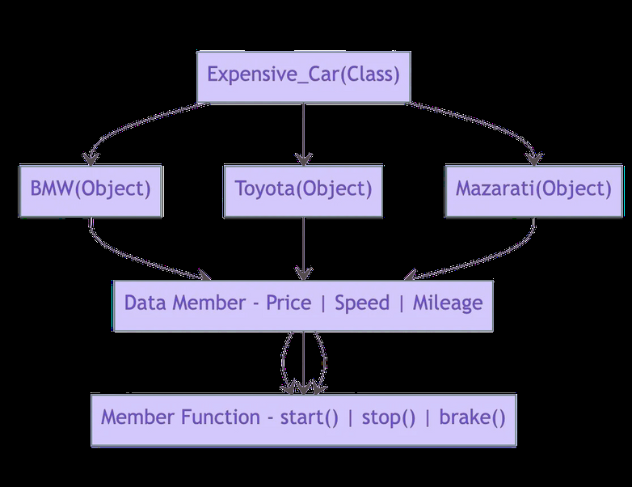
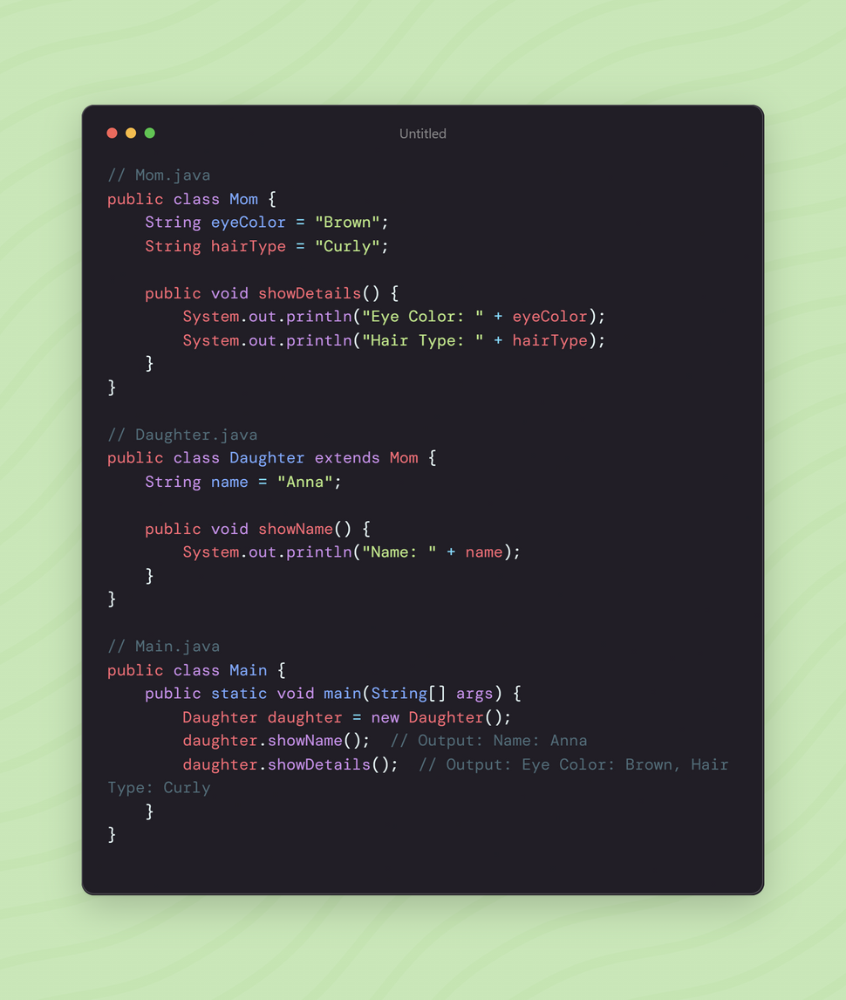
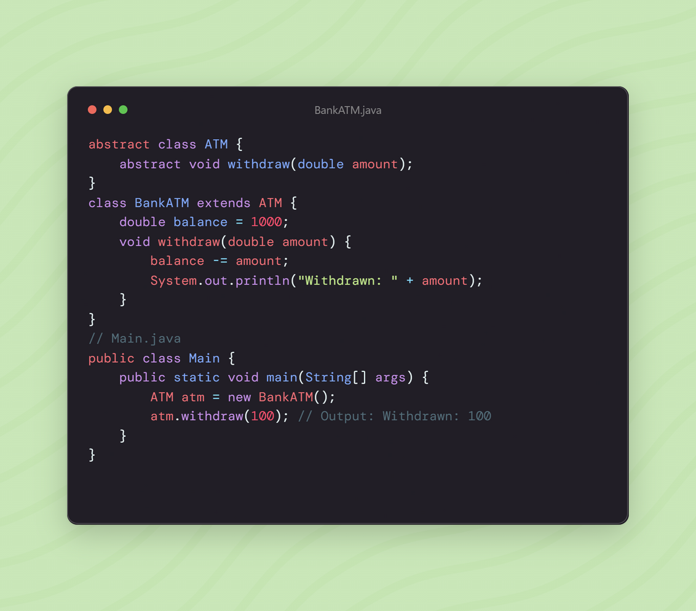
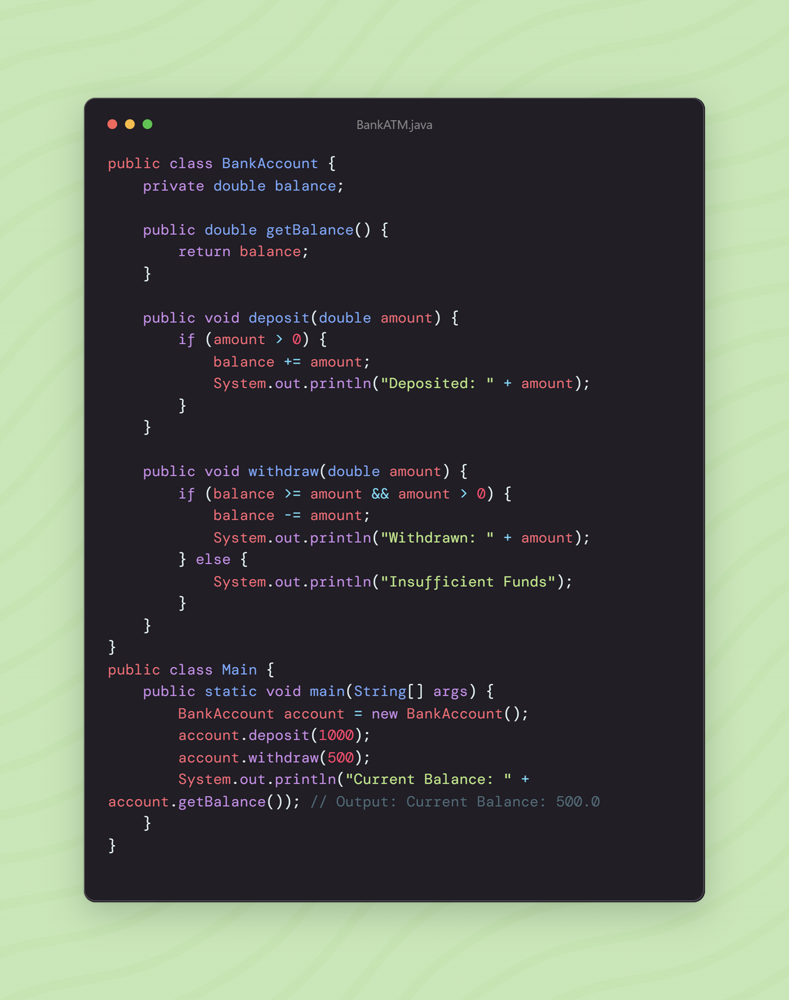

# OOPS Concept in real life

## Object - Oriented Programing

Object-Oriented Programming (OOP) is aparadigm based on the concept of "objects" which can contain data and methods. It's allabout organizing code for better reusabilityand scalability.

- **Class**: A blueprint for creating objects.

- **Object**: An instance of a class. It's created from aclass and represents a real-world entity.

- **Encapsulation** is the practice of wrapping data (variables) and methods (functions) into a single unit called a class.

- **Inheritance** allows one class to inherit fields and methods from another class.

- **Ploymorphism** allows methods to do different things based on the object they act upon.

- **Abstaction** involves hiding complex implementation details and showing only the necessary features of an object.

## Class & Objects

BMW

Expensive Cars
(class)

## Inheritance

**Mom and Daughter**

- Mom class has attributes like eyecolor and hairType.

- Daughter class inherits these attributes from the Mom class.

## Abstraction

Users interact with the machine to perform operations like withdrawing money without knowing the internal mechanics.

## Polymorphism

- In school behave like a student

- In bus like a passenger

- In home behave like a son

- In shopping mall behave like a customer

A person can be a student, an employee, or a parent depending on the context.

**Types of Polymorphism**

Compile-time Polymorphism: Achieved through method overloading.

Runtime Polymorphism: Achieved through method overriding.

## Encapsulation

**Private Balance**: balance is a private variable, not directly accessible outside the BankAccount class.

**Public Methods**: getBalance, deposit, and withdraw we public methods to access and modify the balance securely.

## What is OOPS?

Object-Oriented Programming (OOP) is a programming model that uses classes and objects. It’s utilized to break down a software program into reusable code blueprints (called classes) that you may use to build specific instances of things. Object-oriented programming languages include JavaScript, C++, Java, and Python, to name a few. 

Individual objects are created using class templates as a blueprint. For example, MyCar and goldenRetriever are two particular instances of the abstract class. The attributes specified in the class may have unique values for each object.

A class is a generic template that you may use to create more specialized, concrete things. Classes are commonly used to indicate large groupings with similar characteristics. Classes may also have functions known as methods that are exclusively accessible to objects of that kind. These functions are specified inside the class and execute an action beneficial to that particular object type.

Top Features of OOPS

Here are the top features of OOPS

### 1. Inheritance 

In layman’s terms, the attributes that you inherit from your parents are a simple illustration of inheritance. Classes may inherit characteristics from other classes thanks to inheritance. Parent classes, in other words, extend properties and behaviors to child classes. Reusability is aided via inheritance. Prototyping is another name for inheritance in JavaScript. A prototype object serves as a base from which another object may derive its features and actions. Thus, you may use multiple

prototype object templates to form a prototype chain. Inheritance is passed down from one generation to the next.

Consider the application Polygon, which represents several Shapes. We’re expected to make two distinct sorts of polygons: a Rectangle and a Triangle.

### 2. Encapsulation 

Encapsulation is the process of enclosing all critical information inside an object and only revealing a subset of it to the outside world. For example, code inside the class template defines attributes and behaviors.

The data and methods are then enclosed in the object when it is created from the class. Inside a class, encapsulation conceals the underlying software code implementation and the internal data of the objects. Encapsulation necessitates designating certain fields as private while others are made public.

- Methods and attributes only available from other methods in the same class make up the private/internal interface.

- Methods and attributes that are available from outside the class are known as the public / external interface.

**A Real-Life Example of Abstraction** 

Abstraction reveals just the most significant facts to the user while hiding the underlying intricacies. For example, when we ride a bike, we only know how to ride it but not how it works. We also have no idea how a bike works on the inside. 

**Advantages of Abstraction**

- It simplifies the process of seeing things in their entirety.

- Code duplication is avoided, and reusability is increased.

- Because just the most necessary information is shown to the user, it helps to enhance the security of an application or software.

### 4. Polymorphism 

Polymorphism refers to the creation of items that have similar behavior. For example, objects may override common parent behaviors with particular child behaviors through inheritance. Method overriding and method overloading are two ways that polymorphism enables the same method to perform various actions. 

Examine how Polymorphism and the actual world are interconnected with examples.

Take, for example, your mobile phone. It has the capability of storing your Contacts. Consider the following scenario: you wish to store two numbers for one individual. You may do this by storing the second number under the same name as the first. 

Consider the following scenario: you wish to store two numbers for the same individual in an object-oriented language such as Java. Create a function that will accept as arguments two integers and the name of the individual to some function void createContact that will be defined later (String name, int number1, int number2).

### 5. Method Overriding 

Method overriding is used in runtime polymorphism. When a child class overrides a parent class’s method, the child class might offer an alternative implementation. 

Consider a family of three, consisting of the father, mother, and son. The father makes the decision to teach his kid to shoot. As a result, he brings him to the range with his favorite rifle and teaches him how to aim and fire at targets. The father, on the other hand, is right-handed, while the kid is left-handed. So they each have their own way of handling the pistol! Because of their differing orientations, the father was concerned that he may not be able to teach his son how to shoot. 

The son, on the other hand, was astute and chose to flip his father’s hands, putting his dominant hand on the trigger rather than the father’s. Specifically, the right hand. By significantly changing the learning process, the son was able to grasp the skill of shooting! 

Method overriding is the term used in programming to describe this idea.

### 6. Method Overloading 

Method overloading is used in Compile Time Polymorphism. Although two methods or functions may have the same name, the number of arguments given into the method call may vary. Therefore, depending on the number of parameters entered, you may obtain different results. 

With the help of a simple example, it may be comprehended in simple words. A class addition contains two add() methods, one with arguments int a and int b and the other with three integer parameters, int a, int b, and int c. As a result, the add() function is considered overloaded.

The amount of arguments given in the method calling statement determines which method is performed. For example, add(20,30) calls the two-parameter add() function, whereas add(10,20,30) calls the three-parameter add method

### 7. Objects 

An object is a self-contained segment with the attributes and processes needed to make data usable in programming terms. From an object-oriented perspective, objects are the main building pieces of programs. In each application you create, you may employ a variety of objects of various sorts. Each kind of object is derived from a specific class of that type. Consider an object to be a sculpt of the real-world perceptions, processes, or objects that are important to the application you’re designing.

A variable, function, or data structure may all be considered an object. The term “object” in object-oriented programming refers to a specific instance of a class. Objects are used in software development to combine data components with methods that alter them, allowing for the usage of abstract data structures. Objects in object-oriented programming are answers to the idea of inheritance, resulting in improved program dependability, simpler software maintenance, library administration, and task division in programmer teams. Of basic terms, “Objects” are the fundamental data types in object-oriented programming languages and are used to build object-oriented programming.

### 8. Classes 

In the oops concept, a class is a construct that is used to describe an individual type. The class is instantiated into instances of itself – referred to as class instances or simply objects. A class defines ingredient members that allow its instances to have position and behavior. Member variables or instance variables facilitate a class instance to maintain its position. On the other hand, other kinds of members, especially methods, allow the behavior of class instances. Simply classes consequently define the type of their instances. A class usually represents a person, place or thing, or something.

For example, a “Bird” class would symbolize the properties and functionality of birds. A single, particular bird would be an instance of the “Bird” class, an object of the type “Bird”. There is a set of access specifiers in classes. private (or class-private) specifiers restrict the entrance to the class itself. Only the methods that are elements of a similar class only can access private members. protected (or class-protected) specifies enables the class itself and all classes under it (sub-classes) to access the member and public means that member can be accessed by its name using any code.

### 9. Constructors and Destructors 

Constructors in most object-oriented languages have the same name as the class and are public. Constructors may be overloaded, which means that multiple argument lists can be used with the same name. The function Object() { [native code] } in PHP 5.0 is the function _construct (). Normally, attribute values would be initialised in a function Object() { [native code] }. The _destruct() method is optional, although it might be used to implement code that cleans up once an object is destroyed, such as shutting files or database connections.

## OOP Advantages

- Complex things are modeled as repeatable, basic structures in OOP.

- Thus, OOP objects are reusable and may be utilized in several applications.

- Modularity for easier troubleshooting.

- Classes are easier to debug since they generally include all relevant information.

- Reuse of code through inheritance.

## Conclusion 

Object-oriented programming necessitates planning and thinking about the program’s structure before starting to code and examining how to decompose the requirements into basic, reusable classes that you may utilize to create object instances. Overall, using OOP provides for more reusable data structures and saves time in the long run.

## Q1: Which are the best features of OOPs, and why explain?

Encapsulation, inheritance, and polymorphism are three fundamental elements of object-oriented programming that distinguish it from non-OOP languages. **Encapsulation** is the process of creating self-contained modules that connect processing processes to data. Classes are organized into hierarchies, and **inheritance** enables one class’s structure and functions to be transferred down the hierarchy. Finally, object-oriented programming enables the creation of procedures regarding objects whose precise type is unknown until runtime is known as **polymorphism**.

## Q2: What is an object in OOPs? 

A class instance is referred to as an object. A real-world object is something like a pen, a laptop, a phone, a bed, a keyboard, a mouse, or a chair. A physical entity is referred to as an object. In Java, there are many methods for creating objects, including the new keyword, the newInstance() method, the clone() method, the factory method, and deserialization. Here is a real-life example of an object in OOPS is:

- Class: Human, Object: Man, Woman

- Class: Fruit, Object: Apple, Banana, Mango, Guava, etc.

## Q3: What are the basic principles of OOPs?

Abstraction, Encapsulation, Inheritance, and Polymorphism are the four core ideas of OOP. There are also classes and objects.

# Commonly Asked OOP Interview Questions

## What is Object Oriented Programming?

Object Oriented Programming (OOP) is a programming paradigm where the complete software operates as a bunch of objects talking to each other. An object is a collection of data and methods that operate on its data.

## Why OOP?

The main advantage of OOP is better manageable code that covers following.

1) The overall understanding of the software is increased as the distance between the language spoken by developers and that spoken by users.

2) Object orientation eases maintenance by the use of encapsulation. One can easily change the underlying representation by keeping the methods same.

OOP paradigm is mainly useful for relatively big software. See this for a complete example that shows advantages of OOP over procedural programing.

## What are main features of OOP?

Encapsulation 

Polymorphism 

Inheritance

## What is encapsulation?

Encapsulation is referred to one of the following two notions.

1) Data hiding: A language feature to restrict access to members of an object. For example, private and protected members in C++.

2) Bundling of data and methods together: Data and methods that operate on that data are bundled together.

## What is Polymorphism? How is it supported by C++?

Polymorphism means that some code or operations or objects behave differently in different contexts. In C++, following features support polymorphism.

**Compile Time Polymorphism**: Compile time polymorphism means compiler knows which function should be called when a polymorphic call is made. C++ supports compiler time polymorphism by supporting features like templates, function overloading and default arguments.

**Run Time Polymorphism**: Run time polymorphism is supported by virtual functions. The idea is, virtual functions are called according to the type of object pointed or referred, not according to the type of pointer or reference. In other words, virtual functions are resolved late, at runtime.

## What is Inheritance? What is the purpose?

The idea of inheritance is simple, a class is based on another class and uses data and implementation of the other class.
The purpose of inheritance is Code Reuse.

## What is Abstraction?

The first thing with which one is confronted when writing programs is the problem. Typically we are confronted with “real-life” problems and we want to make life easier by providing a program for the problem. However, real-life problems are nebulous and the first thing we have to do is to try to understand the problem to separate necessary from unnecessary details: We try to obtain our own abstract view, or model, of the problem. This process of modeling is called abstraction.

## What is OOPS?

Object Oriented Programming System is the programming technique to write programs based on the real world objects. The states and behaviors of an object are represented as the member variables and methods. In OOPS programming programs are organized around objects and data rather than actions and logic.

## What are the advantages of OOPS concepts?

Major advantages of OOPS programming are;

**Simplicity**: OOPS programming objects model real world objects, so the complexity is reduced and the program structure is clear.

**Modularity**: Each object forms a separate entity whose internal workings are decoupled from other parts of the system.

**Modifiability**: It is easy to make minor changes in the data representation or the procedures in an OO program. Changes inside a class do not affect any other part of a program, since the only public interface that the external world has to a class is through the use of methods.

**Extensibility**: Adding new features or responding to changing operating environments can be solved by introducing a few new objects and modifying some existing ones.

**Maintainability**: Objects can be maintained separately, making locating and fixing problems easier.

**Reusability**: Objects can be reused in different programs.

## What is the difference between Procedural programming and OOPS?

Procedural language is based on functions but object oriented language is based on real world objects.

Procedural language gives importance on the sequence of function execution but object oriented language gives importance on states and behaviors of the objects.

Procedural language exposes the data to the entire program but object oriented language encapsulates the data.

Procedural language follows top down programming paradigm but object oriented language follows bottom up programming paradigm.

Procedural language is complex in nature so it is difficult to modify, extend and maintain but object oriented language is less complex in nature so it is easier to modify, extend and maintain.

Procedural language provides less scope of code reuse but object oriented language provides more scope of code reuse.

## What are the core concepts of OOPS?

OOPS core concepts are; 

Abstraction 

Encapsulation

Polymorphism 

Inheritance 

Composition 

Association 

Aggregation

## What is Abstraction?

Abstraction is an OOPS concept to construct the structure of the real world objects. During this construction only the general states and behaviors are taken and more specific states and behaviors are left aside for the implementers.

## What is Encapsulation?

Encapsulation is an OOPS concept to create and define the permissions and restrictions of an object and its member variables and methods. A very simple example to explain the concept is to make the member variables of a class private and providing public getter and setter methods.
Java provides four types of access level modifiers: public, protected, no modifier and private.

## What is the difference between Abstraction and Encapsulation?

“Program to interfaces, not implementations” is the principle for Abstraction and “Encapsulate what varies” is the OO principle for Encapsulation.

Abstraction provides a general structure of a class and leaves the details for the implementers. Encapsulation is to create and define the permissions and restrictions of an object and its member variables and methods.

Abstraction is implemented in Java using interface and abstract class while Encapsulation is implemented using four types of access level modifiers: public, protected, no modifier and private.

## What is Polymorphism?

Polymorphism is the occurrence of something in various forms. Java supports various forms of polymorphism like polymorphic reference variables, polymorphic method, polymorphic return types and polymorphic argument types.

## What is Inheritance?

A subclass can inherit the states and behaviors of it’s super class is known as inheritance.

## What is multiple inheritance?

A child class inheriting states and behaviors from multiple parent classes is known as multiple inheritance.

## What is the diamond problem in inheritance?

In case of multiple inheritance, suppose class A has two subclasses B and C, and a class D has two super classes B and C.If a method present in A is overridden by both B and C but not by D then from which class D will inherit that method B or C? This problem is known as diamond problem.

## Why Java does not support multiple inheritance?

Java was designed to be a simple language and multiple inheritance introduces complexities like diamond problem. Inheriting states or behaviors from two different type of classes is a case which in reality very rare and it can be achieved easily through an object association.

## What is Static Binding and Dynamic Binding?

Static or early binding is resolved at compile time. Method overloading is an example of static binding.

Dynamic or late or virtual binding is resolved at run time. Method overriding is an example of dynamic binding.

## What is the meaning of “IS-A” and “HAS-A” relationship?

“IS-A” relationship implies inheritance. A sub class object is said to have “IS-A” relationship with the super class or interface. If class A extends B then A “IS-A” B. It is transitive, that is, if class A extends B and class B extends C then A “IS-A” C. The “instanceof” operator in java determines the “IS-A” relationship.

When a class A has a member reference variable of type B then A “HAS-A” B. It is also known as Aggregation.

## What is Association?

Association is a relationship between two objects with multiplicity.

## What is Aggregation?

Aggregation is also known as “HAS-A” relationship. When class Car has a member reference variable of type Wheel then the relationship between the classes Car and Wheel is known as Aggregation. Aggregation can be understood as “whole to its parts” relationship.

Car is the whole and Wheel is part. Wheel can exist without the Car. Aggregation is a weak association.

## What is Composition?

Composition is a special form of Aggregation where the part cannot exist without the whole. Composition is a strong Association. Composition relationship is represented like aggregation with one difference that the diamond shape is filled.

## What is Dependency?

When one class depends on another because it uses that at some point in time then this relationship is known as Dependency. One class depends on another if the independent class is a parameter variable or local variable of a method of the dependent class. A Dependency is drawn as a dotted line from the dependent class to the independent class with an open arrowhead pointing to the independent class.

## What is the difference between Association and Dependency?

The main difference between Association and Dependency is in case of Association one class has an attribute or member variable of the other class type but in case of Dependency a method takes an argument of the other class type or a method has a local variable of the other class type.

## What is a Class?

A class is the specification or template of an object.

## What is an Object?

Object is instance of class.

## Define a constructor?

Constructor is a method used to initialize the state of an object, and it gets invoked at the time of object creation. Rules forconstructor are:

Constructor Name should be same asclass name. 

Constructor must have no return type.

## Define Destructor?

Destructor is a method which is automatically called when the object ismade ofscope or destroyed. Destructor name is also same asclass name but with the tilde symbol before the name.

## What is Inline function?

Inline function is a technique used by the compilers and instructs to insert complete body of the function wherever that function is used in the program source code.

## What is operator overloading?

Operator overloading is a function where different operators are applied and depends on the arguments. Operator,-,* can be used to pass through the function , and it has their own precedence to execute.

## What is an abstract class?

An abstract class is a class which cannot be instantiated. Creation of an object is not possible with abstract class , but it can be inherited. An abstract class can contain only Abstract method. Java allows only abstract method in abstract class while for other language it allows non-abstract method as well.

## What is an interface?

An interface is a collection of abstract method. If the class implements an inheritance, and then thereby inherits all the abstract methods of an interface.

## What is exception handling?

Exception is an event that occurs during the execution of a program. Exceptions can be of any type — Run time exception, Error exceptions. Those exceptions are handled properly through exception handling mechanism like try, catch and throw keywords.

## What is dynamic or run time polymorphism?

Dynamic or Run time polymorphism is also known as method overriding in which call to an overridden function is resolved during run time, not at the compile time. It means having two or more methods with the same name,same signature but with different implementation.

## What is static and dynamic binding?

Binding is nothing but the association of a name with the class. Static binding is a binding in which name can be associated with the class during compilation time , and it is also called as early Binding.

Dynamic binding is a binding in which name can be associated with the class during execution time , and it is also called as Late Binding.

## What is a copy constructor?

This is a special constructor for creating a new object as a copy of an existing object. There will be always only on copy constructor that can be either defined by the user or the system.

## Difference between class and an object?

An object is an instance of a class. Objects hold any information , but classes don’t have any information. Definition of properties and functions can be done at class and can be used by the object.

Class can have sub-classes, and an object doesn’t have sub-objects.

## What is the difference between structure and a class?

Structure default access type is public , but class access type is private. A structure is used for grouping data whereas class can be used for grouping data and methods. Structures are exclusively used for data and it doesn’t require strict validation , but classes are used to encapsulates and inherit data which requires strict validation.

# Java Backend Devloper Road Map

