# Collection v/s Collections v/s Collectors

## Collection

- Collection is an interface present in the java.util package.

- It represents a group of individual objects as a single unit.

- It serves as the root interface of the collection framework.

- The main sub-interfaces of Collection are List, Set & Queue.

- It provides essential methods like add(), remove(), clear(), size(), contains(), etc.

**Declaration:**

```java
public interface Collection<E> extends Iterable<E>{

}

Where, <E> - the type of elements in this collection
```

```java
Collection<String> arrlist=new ArrayList<>();
arrlist.add("hello");
int a=arrlist.size();
```

## Collections

- Collections is a utility class present in the java.util package.

- It defines several static methods that operate on collections.

- These utility methods provide convenience for working with the Collection Framework.

- Examples of methods in Collections include sort(), min(), max() etc.

**Declaration:**

```java
public class Collections{

}
```

```java
List<Integer> numbers=Arrays.asList(5,2,8,1,7);
Collections.sort(numbers);
int min=Collections.min(numbers);
int max=Collections.max(numbers);
```

## Collectors

- Collectors is a final class introduced in Java 8 as part of the Stream API present in the java.util.stream package.

- It provides various collectors for aggregating elements from a stream into a collection or other data structures.

- Common collectors include toList(), toSet(), and toMap().

**Declaration:**

```java
public final class Collectors{

}
```

```java
List<String> fruits=Arrays.asList("Apple", "Banana", "Orange", "Grapes");

List<String> collectedFruits=fruits.stream().filter(fruit->fruit.lenght()>5)).collect(Collectors.toList());
```

# Introduction to HashMap

- HashMap is a class belongs to map interface in util package of java. It allows the programmers to store the information in key and value pair.

- We need to specify the data type for both keys and values.

- We can store the keys and values using put method .

- Let's take the example to store Employee id and Name in a hashnap .

- We can access any value in hashmap by using the get method and passing key as a parameter in the same.
Values can be NULL .

- Duplicate values can be added to hashmap .

- Key must be unique.

**Create an object for HashMap :**

```java
HashMap <Integer , String> emp = new Hashmap<Integer,String>( );
```

**Store the elements :**

```java
hashmapobject.put(key,value);
// put is having two parameters key and value
emp.put(1140,"EmployeeOne");
emp.put(1141,"EmployeeTwo");
```

**Access values :**

```java
// Access the value in hashmap using get.
String name=emp.get(1141);
```

Note : get returns NULL if the key does not have any value

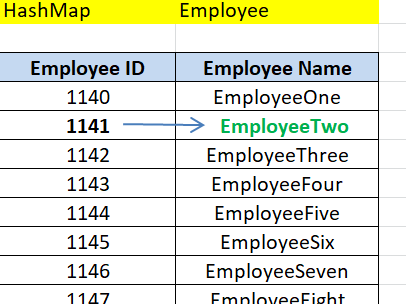

# Identification, Authorization, Authentication

| Identification    | Authorization |  Authentication  |
| ------------- |-------------|--------------|
|**Definition:** Process of providing a unique identifier, often a username or ID, to a system or service.|**Definition:** Process of verifying the claimed identity of a user, device, or process.|**Definition:** Process of determining what action or resources a user, device, or process is permitted to access.|
|**Purpose:** Establishes who the user claims to be.|**Purpose:** Verifies if the claimed identity is valid and matches the provided credentials.|**Purpose:** Determines what action or resources the authenticated user or entity can access.|
|**Example:** Entering a username or email address.|**Example:** Providing a password, PIN, biometric data, or security token.|**Example:** Being granted specific privileges or permissions after successful authentication.|
|**Dependency:** Can precede authentication.|**Dependency:** Follows identification and precedes authorization.|**Dependency:** Follows identification and authentication.|
|**Process:** Does not involve verification.|**Process:** Involves verification against stored credentials or identity provider.|**Process:** Involves checking against predefined access control policies or rules.|
|**Key Concerns:** Does not validate the truthfulness of the identity claim.|**Key Concerns:** Ensures the validity of the identity claim to prevent impersonation.|**Key Concerns:** Ensures that only authorized entities access specific resources or perform certain actions.|
|**Common Methods:** Providing username, email, or ID|**Common Methods:** Passwords, biometics (fingerprint, face recognition), security tokens, certificates.|**Common Methods:** Role-based access control (RBAC), attribute-based access control (ABAC), discretionary access control (DAC).|
|**Verification:** No verification required.|**Verification:** Verification against stored credentials or authentication server.|**Verification:** Verification against access control policies or rules.|
|**Security Risks:** Minimal security risks as it is not verifying identity claims.|**Security Risks:** Risks include password cracking, brute force attacks, phishing.|**Security Risks:** Risks include privilege escalation, unauthorized access, data breaches.|

# SOME OF THE MOST IMPORTANT FEATURES OF JAVA 11

## 1. New String Methods

Added new utility methods to the String class for common
string operations, like isBlank(), lines(), strip(), repeat(int count):


```java

After Java 11

String text = " Sanjay Yadav;
String trimmed = text.strip(); // Removes leading/trailing whitespace
String lines = text.lines().collect(Collectors.toList()); // Splits into lines
boolean isBlank = text.isBlank(); // Checks for empty or whitespace-only string
"Hello".repeat(3) // "HelloHelloHello"
```

## 2. Running Java File with a single command

- In Java 11+, running a Java file is simplified with a single command, eliminating the need for separate compilation and execution

- we don‘t need to write javac every time from java 11 onwards

**Prior to Java 11**

```java
Step:1 Compilation

javac HelloWorld.java

Step:2. Execution:

java HelloWorld
```

**After Java 11**

```java
1. Direct Execution:

java HelloWorld.java
```

## 3.Local-Variable Syntax for Lambda

- This feature allows you to use the var keyword to infer the type of lambda parameters, making code more concise and readable.

- This was possible in Java 8 too but got removed in Java 10. Now it’s back in Java 11 to keep things simple.

**Prior to Java 11**

```java
List<String> names = Arrays.asList("Sanjay","Ram", "Lalit");
names.forEach((String name) ->System.out.println(name));
```

**After Java 11**

```java
List<String> names =Arrays.asList("Sanjay", "Ram", "Lalit");
names.forEach((var name) ->System.out.println(name));
```

## 4. Reading/Writing Strings to and from the Files

- We can use the new readString and writeString static methods from the Files class:

- In Java 11 introduced the following methods for reading and writing to/from the files: 

```java
readString(),writeString()
```

**After Java 11**

```java
ReadString():

Path path = Paths.get("my_file.txt");
String content = Files.readString(path);
System.out.println("File content: " + content)
```

```java
WriteString():

Path path = Paths.get("my_file.txt");
String content = “This Is demo file”
Files.writeString(path,content)
```

# DeveloperSOME OF THE MOST IMPORTANT FEATURES OF Optional Class

## 1. Eliminates NullPointerExceptions

The main purpose of Optional is to prevent NullPointerExceptions by explicitly specifying whether a value is present or absent.

**Prior to Java 11**

```java
String name = getUser().getName(); // This can throw NullPointerException if getUser() returns null
```

**After Java 11**

```java
String safeName =
getUser().map(User::getName).orElse("Unknown"); // Uses Optional to avoid exception
```

## 2. Improves Code Readability

- Optionals enhance code clarity by explicitly indicating when a value might be absent

- This eliminates the need for scattered null checks, making your code's intent

**Prior to Java 11**

```java

if (optionalValue != null) {
// Do something with the value
}else {
// Handle the case where the value is null
}
```

**After Java 11**

```java

optionalValue.ifPresent(value -> {
// Do something with the value (more readable) 
});
```

## 3. Use Of Functional Programming

- Optional provides a set of functional-style operations to work with optional values, such as map, flatMap, and filter.

```java

List<String> upperCaseNames = users.stream()
.map(User::getName) // Apply getName to each User
.map(String::toUpperCase) // Convert name to uppercase
.collect(toList());
```

```java

List<String> upperCaseNamesWithOptional = users.stream()
.map(User::getName) // Wrap name in Optional
.flatMap(Optional::map(String::toUpperCase)) // Apply map to
extract value or create empty Optional
.collect(toList()); // Collect non-empty values
```

## 4.Set of Utility Methods:

- Optional provides a set of functional-style operations to work with optional values, such as map, flatMap, and filter.


**1.ofNullable()**: Creates an Optional containing the specified value if it's non-null; otherwise, returns an empty Optional.

**2. is present()**: Returns true if the Optional contains a non-null value; otherwise, returns false

**3.get()**: Returns the value if present; otherwise, throws a3. NoSuchElementException.

**4. is present()**: Returns true if the Optional contains a non-null value; otherwise, returns false

**5.orElse()**: Returns the value if present; otherwise, returns the specified default value.

**6. orElseGet()**: Returns the value if present; otherwise, invokes the specified supplier and returns its result.

## 5. Stream Integration:

- In Java 9, the Optional class gained additional methods to support integration with the Stream API. These methods enable you to perform stream operations directly on an optional value.

**stream()**: This method returns a stream containing either a single element, if the optional contains a value, or an empty stream if the optional is empty.

```java
Optional<String> optionalString = Optional.of("Hello");
optionalString.stream().forEach(System.out::println);
```

**ifPresentOrElse()**: This method accepts two parameters: a consumer for the value if present and a runnable if the optional is empty.

```java
Optional<String> optionalString = Optional.of("Hello");
optionalString.ifPresentOrElse(System.out::println, () ->
System.out.println("Value is absent"));
```

# java arrays: Multidimensional Arrays

## Multidimensional Arrays

Multidimensional arrays are arrays of arrays,
allowing you to create a matrix-like data
structure. They can have multiple dimensions,
with the most common being 2D arrays.

```java
Sabeeh Arif
int [] [] matrix = new int[3] [3];
Syntax:
```

## Declaring Md Arrays

Multidimensional arrays are declared by
specifying the type of elements and the
number of dimensions. Here’s how to declare a
2D array."

```java
Syntax:

int[][] matrix;
```

## Initializing MD Arrays

You can initialize a 2D array by specifying the
size of each dimension or by directly assigning
values.

```java
Example:

int[][] matrix = {
{1, 2, 3},
{4, 5, 6},
{7, 8, 9}
};
```

## Accessing Elements in Multidimensional Arrays

Elements in a multidimensional array are
accessed using multiple indexes. For a 2D
array, you specify the row and column indexes.

```java
Example:

int element = matrix[1][2];
```

## Traversing Multidimensional Arrays

To traverse a 2D array, use nested loops. The
outer loop iterates over rows, and the inner
loop iterates over columns.

```java
Example:

int element = matrix[1][2];
```

## key point recap

- **Traverse arrays using loops**: Utilize
traditional for loops or enhanced for loops
for iteration.

- **Perform common operations**: Find the
length, copy, and fill arrays efficiently.

- **Arrays can store objects**: Declare and use
arrays of objects for more complex data
storage.

# Java Concurrency 101

## Concurrency

“**Concurrency** is the ability of different parts or
units of a program, algorithm, or problem to be
executed out-of-order or in partial order, without
affecting the outcome. This allows for parallel
execution of the concurrent units, which can
significantly improve overall speed of the execution
in multi-processor and multi-core systems”.

## Processes and Threads

**Processes** are self-contained execution
environments with their own memory space and
resources.

**Threads**, often called lightweight processes, are units
of execution within a process. Unlike processes,
threads share resources such as memory and files,
enabling efficient, but sometimes problematic,
communication.

Java leverages multithreaded execution, where each
application typically starts with a main thread.
Additional threads can be created to perform
asynchronous tasks using the **Thread** class.

## Creating and Managing Threads

There are two main approaches to using Thread
objects in Java:

- **Direct Approach**

Create a new Thread instance whenever you
need to start an asynchronous task. This gives
you direct control over thread creation and
management.

- **Executor Approach**

Instead of managing threads directly, pass
your tasks to an executor. The executor
handles thread management separately from
your main application logic.

In the next slides, we’ll talk about creating and
managing thread directly, while **Executors** will be
discussed later

## Creating a thread by extending the Thread class

```java
public class Main {
    public static void main(String[] args) {
        MyThread myThread = new MyThread();
        myThread.start();
    }
}

class MyThread extends Thread {
    @Override
    public void run() {
        System.out.println("Thread is running ...");
    }
}
```

## Creating a thread by implementing the Runnable interface

```java
public class Main {
    public static void main(String[] args) {
        Thread thread = new Thread(
        new MyRunnable());
        thread.start();
    }
}

class MyRunnable implements Runnable {
    @Override
    public void run() {
        System.out.println("Runnable is running ...");
    }
}
```

## Creating a thread by utilizing lambda expressions with Runnable

```java
public class Main {
    public static void main(String[] args) {
        Thread thread = new Thread(() -> {
            System.out.println("Thread with lambda is running ...");
        });
        thread.start();
    }
}
```

## Guarded Blocks

**Guarded blocks** serve as a synchronization mechanism in
concurrent programming, allowing threads to coordinate
their execution based on specific conditions or predicates.

Alongside the **Object.wait()**, **Object.notify()**, and
**Object.notifyAll()** methods, they facilitate
synchronization by enabling threads to wait within the
blocks until the conditions are met.

Here's an overview of their functionality:

1. Threads enter guarded blocks, often within a
synchronized context;

2. Within the block, threads check a condition;

3. If the condition isn't met, threads invoke wait() and
relinquish the monitor;

4. When the condition changes, another thread calls
notify() or notifyAll() to wake up waiting threads;

5. The awakened threads reacquire the monitor and
recheck the condition before proceeding.

## Thread States
- **NEW**

A thread that has been created but not yet
started;

- **RUNNABLE**

A thread executing in the Java virtual machine;

- **BLOCKED**

A thread that is blocked waiting for a monitor lock;

- **WAITING**

A thread that is waiting indefinitely for another
thread to perform a particular action;

- **TIMED_WAITING**

A thread that is waiting for another thread to
perform an action for up to a specified waiting
time;

- **TERMINATED**

A thread that has finished execution.

## Thread Methods
- **start()**

It starts a Thread;

- **sleep()**

It allows a thread to pause its execution for a
specified period of time;

- **interrupt()**

It interrupts a thread's execution by setting its
interrupt status flag;

- **join()**

It allows one thread to wait for the completion of
another thread before proceeding.

## Multi-threading Challenges

**Race Conditions**: Occur when multiple threads access shared resources without proper synchronization, leading to unpredictable behavior or data corruption.

**Deadlocks**: Threads are blocked indefinitely, waiting for each other to release resources, often caused by acquiring multiple locks in different orders.

**Starvation**: Threads are perpetually denied access to resources due to others monopolizing them, commonly seen with higher-priority threads.

**Livelocks**: Threads are actively resolving resource conflicts but unable to make progress, resembling deadlocks but with continuous activity.

**Thread Interference**: Multiple threads accessing shared mutable state without synchronization, resulting in unexpected behavior or lost updates.

**Memory Consistency Errors**: Different threads have inconsistent views of shared memory due to lack of synchronization, leading to unexpected results.

**Performance Overhead**: Context switching, synchronization, and thread coordination introduce overhead, and improper use can degrade performance.

## Volatile Keyword

The **volatile** keyword ensures that any thread accessing
a volatile variable reads its most recent write value.
Unlike regular variables, whose values may be cached by
each thread, volatile variables are always read directly
from the main memory.

```java
public class Counter {
    private volatile boolean flag;
    public void enableFlag() { flag = true; }
    public void disableFlag() { flag = false; }
    public boolean getFlag() { return flag; }
}
```
The volatile keyword does not ensure atomicity.
Therefore, it should be used judiciously and alongside
other synchronization mechanisms as needed.

## Synchronization

**Synchronization** is a technique used to control
access to shared resources in a multithreaded
environment. When multiple threads access shared
data concurrently, synchronization ensures that
only one thread can execute a synchronized block of
code or method at a time.

## Synchronization using Synchronized Methods

One way to synchronize code in Java involves marking the entire method with the **synchronized** keyword.

```java
public class Counter {

    private int count;
    public synchronized void inc() {
        // more code
        count++;
    }

    public int getCount() { 
        return count; 
    }
}
```

## Synchronization using Synchronized Blocks

Using synchronized blocks is preferred over synchronized methods because it applies synchronization only to the critical section of the code.

```java
public class Counter {

    private int count;

    public void inc() {
        // more code
        synchronized(this) {
            count++;
        }
    }

    public int getCount() {
         return count; 
    }
}
```

## Synchronization using Lock Objects

Using explicit lock objects provide more control and flexibility compared to synchronized blocks.

```java
public class Counter {

    private int count;
    private Lock lock = new ReentrantLock();
    
    public void inc() {
        // more code
        lock.lock();
        try {
             count++; 
        }
        finally { 
            lock.unlock(); 
        }
    }
    public int getCount() { return count; }
}
```

## Synchronization: Using Atomic Variables

Using atomic variables ensures atomicity without the need for explicit synchronization, simplifying the code.

```java
public class Counter {

    private AtomicInteger count = new AtomicInteger(0);
    
    public void inc() {
        // more code
        count.incrementAndGet();
    }

    public int getCount() { 
        return count.get(); 
    }
}
```

## High-Level Concurrency

**High-level concurrency** encompasses advanced
concurrency utilities and abstractions provided by
the Java Concurrency API.

These constructs encapsulate common concurrency patterns and offer expressive and efficient ways to manage threads, coordinate tasks, and access shared resources.

We will talk about:

- Executors and Thread Pools

- Concurrent Collections

- Fork/Join

- Concurrent Random Numbers

## Executors and Thread Pools

Executors and thread pools provide a convenient and efficient way to manage the execution of multiple tasks concurrently.

Executors are higher-level abstractions that decouple task submission from execution, while thread pools consist of a collection of pre-allocated threads ready to execute tasks.

```java
public class Main {

    public static void main(String[] args) throws Exception {
        ExecutorService executor = Executors.newFixedThreadPool(3);
        executor.submit(new Task());
        executor.shutdown();
    }
}
    
class Task implements Runnable {

    @Override
    public void run() { 
        /* code */ 
    }
}
```

## Concurrent Collections

**Concurrent collections** offer thread-safe alternatives to standard collections, enabling secure access and modification by multiple threads simultaneously.

These collections employ efficient synchronization mechanisms to ensure thread safety without compromising performance.

They are grouped according to the collection interfaces they provide, including **BlockingQueue**, **ConcurrentMap**, and **ConcurrentNavigableMap**.

## Fork/Join

The Fork/Join framework is a high-level concurrency mechanism for parallelizing recursive, divide-and-conquer algorithms.

It enables efficient parallel processing of tasks by recursively splitting them into smaller subtasks and executing them concurrently on multiple threads.

The Fork/Join framework is particularly useful for exploiting multi-core processors and achieving performance gains in compute-intensive applications.

## Concurrent Random Numbers

The **ThreadLocalRandom** is ideal for generating
random numbers across multiple threads or
ForkJoinTasks. Simply call ThreadLocalRandom.current() followed by the desired method.

```java
public class Main {
    public static void main(String[] args) {

        ThreadLocalRandom tlr = ThreadLocalRandom.current();

        System.out.println(tlr.nextInt(-10, 10));
        System.out.println(tlr.nextBoolean());
        System.out.println(tlr.nextDouble(0, 1));
    }
}
```

## Callable Interface

The Callable interface provides a means to perform a task
concurrently that returns a result and may throw an exception.

```java

public class Main {
    public static void main(String[] args) throws Exception {
        
        ExecutorService executor = Executors.newSingleThreadExecutor();
        
        Future<Integer> future = executor.submit(new MyCallable());
        
        System.out.println(future.get());
        executor.shutdown();
    }
}

class MyCallable implements Callable<Integer> {
    
    @Override
    public Integer call() throws Exception { 
        return 10; 
    }
}
```

## CompletableFuture
Like Callable, CompletableFuture represents a single task with a result. However, CompletableFuture offers extensive methods for chaining, combining, and handling asynchronous tasks in a non-blocking manner.

```java
public class Main {
    public static void main(String[] args) throws Exception {
    
        CompletableFuture.supplyAsync(new MySupplier()).thenAccept(result -> System.out.println(result));
    }
}

class MySupplier implements Supplier<Integer> {

    @Override
    public Integer get() { 
        return 10; 
    }
}
```

## Immutable Objects

An **immutable object** is an object whose state cannot be modified after it is created. It ensures thread safety and simplifies concurrent programming by eliminating the need for
synchronization.

To create immutable objects:

- Declare the class as **final**;

- Declare all fields as **private** and **final**;

- Do not provide setter methods;

- Ensure that any mutable objects referenced by the immutable object are defensively copied or made immutable themselves.

# Q 1. What is the difference between JDK and JRE?

The JDK (Java Development Kit) is used by developers for
creating Java applications and includes the necessary tools,
libraries, and compilers.

The JRE (Java Runtime Environment) is used by end-users to run
Java applications and provides the runtime environment and
essential class libraries, but does not include development tools.

# Q 2. What are the benefits of using Java?

These are the benefits of using Java:

- **Portability**: Java code can be run on any platform that has a Java Virtual Machine (JVM).

- **Security**: Java has a built-in security model that helps to protect users from malicious code.

- **Object-oriented**: Java is an object-oriented programming
language, which makes it easy to create modular and reusable
code.

- **Robust**: Java is a robust language that is designed to be
reliable and efficient.

- **Widely used**: Java is a widely used language that has a large community of developers and support resources.

# Q 3. What are the different components of the Java platform?

The Java platform is a software environment that provides a
standard way for developing and running Java applications. It
consists of the following components:

- Java Virtual Machine (JVM)

- Java Runtime Environment (JRE)

- Java Development Kit (JDK)

# Q 4. What are the different types of Java data types?

There are two types of data types in Java: primitive data types and non-primitive data types.

**Primitive data types**

- boolean

- byte

- short

- int

- long

- float

- decimal places

- double

- char

**Non-primitive data types**

- String

- Array

- Class

- Interface

- Enum

# Q 5. What are the different types of Java control statements?

There are three types of control statements in Java:

- Decision-making statements (if, if else & switch)

- Looping statements (while, do while & for)

- Jump statements (continue & return)

# Q 6. What are the different types of Java exceptions?

There are two types of exceptions in Java: checked exceptions
and unchecked exceptions.

- **Checked exceptions** are exceptions that must be declared in the method signature. If a checked exception is thrown in a
method, the method must either handle the exception or declare it to be thrown. If the method does not handle the
exception, the compiler will generate an error.

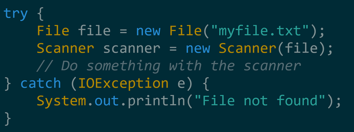

- **Unchecked exceptions** are exceptions that do not need to
be declared in the method signature. Unchecked exceptions
can be thrown by any method, and the compiler will not
generate an error if they are not handled.

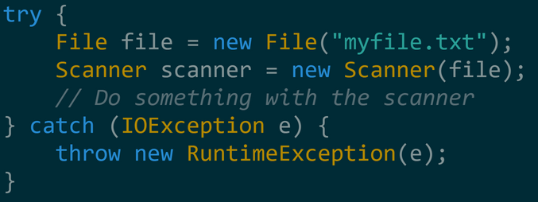

# Q 7. What are the different types of Java classes & Java interfaces?

There are two main types of Java classes:

- **Normal classes** are the most common type of class in Java. They can have fields, methods, and constructors.

- **Abstract classes** are classes that cannot be instantiated. They can only be used as a base class for other classes.

There are also two main types of Java interfaces:

- **Normal interfaces** are a collection of abstract methods. A class can implement an interface, thereby inheriting the
abstract methods of the interface.

- **Marker interfaces** are interfaces that do not contain any
methods. They are used to indicate that a class has a certain
property or behavior.

# Q 8. What are the different types of Java libraries & Java frameworks?

A Java library is a collection of reusable Java classes and
interfaces.

**some examples of Java libraries**:

- Apache Commons

- Google Guava

- Joda-Time

- JUnit

- Mockito

A Java framework is a collection of reusable Java classes,
interfaces, and code that provides specific functionality.

**some examples of Java libraries**:

- Spring

- Hibernate

- JSF

- Grails

- Struts

# 9. What are the different types of Java tools?

There are two types of threads in Java: user threads and daemon threads.

- **User threads** are the threads that are created by the user or application. They are high-priority threads and the JVM will wait for any user thread to finish its task before terminating it.

- **Daemon threads** are the threads that are created to provide services to user threads. They are low-priority threads and are only needed while user threads are running. Once all user threads have finished their execution, the JVM will terminate even if there are daemon threads still running.

# Q 10. What are the different types of Java networking?

There are two main types of Java networking:

- **Client-server networking** is a type of networking where there is a client application that requests a service from a server application. The server application then provides the service to the client application.

- **Peer-to-peer networking** is a type of networking where two or more applications communicate directly with each other
without the need for a server.

# Q 1. What is the difference between Procedural programming and OOP?

Procedural programming is a top-down approach to programming, where the program is divided into a series of functions that each perform a specific task.

OOP, on the other hand, is a bottom-up approach to programming, where the program is divided into objects that each represent a real-world entity.

# Q 2. What are the core concepts of OOP?

The core concepts of OOP are:

- **Abstraction**: Abstraction is the process of hiding the
implementation details of an object from the user. This allows the user to focus on the object's functionality without having to worry about how it works.

- **Encapsulation**: Encapsulation is the bundling of data and codes into a single unit. This makes it easier to maintain and update the code, and it also makes it more difficult for users to accidentally modify the data.

- **Inheritance**: Inheritance is the ability of an object to inherit the properties and methods of another object. This allows developers to reuse code and create more complex objects with fewer lines of code.

- **Polymorphism**: Polymorphism is the ability of an object to behave differently depending on its context. This allows
developers to write code that is more flexible and easier to
maintain.

# Q 3. What is the difference between Overloading and Overriding?

Overloading refers to the ability to have multiple methods with the same name, but different parameters.

Overriding refers to the ability to have a method in a subclass that has the same signature as a method in a superclass.

# Q 4. What is the difference between static and dynamic binding?

- **Static binding** and dynamic binding are two different ways of resolving function calls in object-oriented programming (OOP). Static binding occurs when the compiler determines the method to be called at compile time. This is the most common type of binding in OOP, and it is used for both static and non-virtual methods.

- **Dynamic binding** occurs when the method to be called is not determined until runtime. This is used for virtual methods, which allow for polymorphism.

|Feature |Static Binding |Dynamic Binding|
| ------------- |-------------|--------------|
|When does binding occur? |Compile time |Runtime |
|Performance |Faster |Slower |
|Flexibility |Less flexible |More flexible |
|Error handling |More error-prone |Less error-prone |

# Q 5. What is the difference between Abstract class and Interface?

Here is a table that summarizes the key differences between
abstract classes and interfaces:

|Feature |Abstract Class |Interface |
|--------|---------------|----------|
|Can be instantiated |No |No |
|Can have abstract methods |Yes |Yes |
|Can have non-abstract methods |Yes |No |
|Can have state |Yes |No |
|Can be extended by other classes |Yes |No |
|Can be implemented by other classes |Yes |Yes |

# Q 6. Why Java doesn't support Multiple Inheritance?

Java doesn't support multiple inheritance because it can lead to a number of problems, including:

- Ambiguity

- Circular dependencies

- Complexity

# Q 7. When do you use interface and abstract class in Java?

Abstract classes and interfaces are both used to achieve
abstraction in object-oriented programming.

- Abstract classes are similar to normal classes, with the
difference that they can include abstract methods, which are
methods without a body. Abstract classes cannot be
instantiated.

- Interfaces are a kind of code contract, which must be implemented by a concrete class. Interfaces cannot have state, whereas the abstract class can have state with instance variables.

# Q 8. What are the challenges of using OOP in Java?

There are some challenges associated with using OOP in Java.
These challenges include:

- **Complexity**: OOP can make code more complex, especially
when dealing with large and complex systems.

- **Overhead**: OOP can add some overhead to code, as objects
need to be created and managed.

- **Testing**: OOP can make code more difficult to test, as objects need to be tested in isolation and in combination.

- **Performance**: OOP can impact performance, as objects can
add some overhead.

# Q 1. What is the difference between an array and a linked list?

In general, arrays are a good choice for data structures where the data is accessed frequently and the order of the data is important.

Linked lists are a good choice for data structures where the data is inserted or deleted frequently and the order of the data is not important.

|Feature |Array |Linked List |
|--------|------|------------|
|Data storage |Contiguous memory |Non-contiguous memory |
|Access efficiency |High |Low |
|Insertion/deletion efficiency |Low |High |
|Order of data |Important |Not important |

# Q 2. Explain the concept of a hash table.

A hash table is a data structure that maps keys to values. It is a very efficient data structure for storing and retrieving data, as it can access data in constant time.

- **put(key, value)**: This method stores the key-value pair in the hash table.

- **get(key)**: This method returns the value associated with the key.

- **remove(key)**: This method removes the key-value pair from the hash table.

# Q 3. What is the time complexity of various operations in a binary search tree (BST)?

The time complexity of various operations in a binary search tree (BST) depends on the height of the tree. The height of a BST is the number of nodes on the longest path from the root node to a leaf node.

The following table shows the time complexity of various
operations in a BST:

|Operation |Time complexity |
|----------|----------------|
|Search |O(log n) |
|Insert |O(log n) |
|Delete |O(log n) |
|Inorder traversal |O(n) |
|Preorder traversal |O(n) |
|Postorder traversal |O(n) |

# Q 4. Describe the difference between breadth-first search (BFS) and depth-first search (DFS) algorithms.

Here is a table that summarizes the key differences between BFS and DFS:

|Feature |BFS |DFS |
|--------|----|----|
|Explores |All nodes at the current level before moving on to the next level |As far as possible down one path before backtracking |
|Time complexity |O(V+E) |V |
|Space complexity |O(v) |V |
|Use cases |Finding the shortest path, finding all of the nodes in a graph that are reachable from a given node |Finding all of the nodes in a graph, finding all of the paths between two nodes|

# Q 5. Explain the concept of a priority queue and provide an example of its application.

A priority queue is a data structure that stores elements along with their associated priorities. It allows efficient retrieval of the element with the highest (or lowest) priority. The priority determines the order in which elements are processed or accessed.

**For example**, a priority queue can be used to schedule tasks in a time-critical application. Each task is assigned a priority, and the tasks are scheduled in order of decreasing priority. This ensures that the most important tasks are always scheduled first.

# Q 6. Explain the concept of dynamic programming and provide an example problem where it can be applied.

Dynamic programming is a problem-solving technique that
involves breaking down complex problems into smaller,
overlapping subproblems and solving them in a bottom-up
manner.

**Example**: knapsack problem, In the knapsack problem, you are given a set of items, each with a weight and a value, and a knapsack with a limited capacity. The goal is to find the subset of items that has the maximum value and that fits in the knapsack.

# Q 7. How does a HashSet work internally in Java?

A HashSet internally uses a HashMap to store its elements. When you add an element to a HashSet, it is first hashed using the hashCode() method.

The hash code is then used to find the corresponding bucket in the HashMap. If the bucket is empty, the element is added to the bucket. If the bucket is not empty, the element is compared to the other elements in the bucket using the equals() method. If the element is equal to any of the other elements in the bucket, it is not added to the HashSet.

# Q 8. What is the time complexity of various operations in a hash table?

The time complexity of various operations in a hash table
depends on the hash function used and the number of elements
in the hash table. In general, the time complexity of the following operations is:

- **Insertion**: O(1) on average, O(n) in the worst case

- **Search**: O(1) on average, O(n) in the worst case

- **Deletion**: O(1) on average, O(n) in the worst case

# Q 1. What is multithreading, and why is it important in Java?

Multithreading is a programming concept that allows multiple
tasks to be executed concurrently. In Java, multithreading is
implemented using the Thread class. A Thread object represents a single thread of execution.

There are many reasons why multithreading is important in Java. Some of the most important reasons include:

- Increased performance:

- Improved responsiveness:

- Reduced resource usage:

# Q 2. How can you create a thread in Java?

There are two ways to create a thread in Java:

- By extending the Thread class

- By implementing the Runnable interface

# Q 3. What is the difference between a process and a thread?

A process is a program in execution. It has its own memory space, its own stack, and its own set of resources.

A thread is a lightweight process that shares the same memory
space and resources as other threads in the same process.

**Some of the key differences between processes and threads**:

- Processes are independent of each other

- Processes are heavier than threads.

- Processes are more difficult to create and manage than
threads.

# Q 4. How does synchronization work in Java? Explain the concepts of synchronized methods and blocks.

Synchronization in Java is a mechanism that allows multiple
threads to access shared resources safely. When a thread is
synchronized on a resource, it is the only thread that can access that resource.

This prevents race conditions, which are situations where two or more threads are trying to access the same resource at the same time.

There are two ways to synchronize in Java:

- Using synchronized methods

- Using synchronized blocks

**Synchronized methods**

A synchronized method is a method that can only be executed by one thread at a time. To declare a method as synchronized, you need to use the synchronized keyword.

**Synchronized blocks**

A synchronized block is a block of code that can only be executed by one thread at a time. To declare a block of code as synchronized, you need to use the synchronized keyword and
specify the object that the block is synchronized on.

# Q 5. What is a deadlock, and how can it be avoided?

A deadlock is a situation where two or more threads are waiting for each other to finish. This can happen when two threads are each trying to acquire a lock on the same resource.

To avoid deadlocks, we can do this:

- Avoid using locks unnecessarily.

- Use locks in a consistent order.

- Use deadlock detection and prevention tools.

# Q 6. What are the differences between the Thread class and the Runnable interface in Java?

The Thread class is a concrete class. while the Runnable interface is an abstract interface. This means that you can create a new thread by extending the Thread class, or you can create a new thread by implementing the Runnable interface.

**The key differences between the Thread class and the Runnable interface**:

|Feature |Thread class |Runnable interface |
|--------|-------------|-------------------|
|Type |Concrete class |Abstract interface |
|Inheritance |Can be extended |Cannot be extended |
|Implementation |Must override the run() method |Must implement the run() method |
|Memory usage |More memory is required |Less memory is required |
|Flexibility |Less flexible |More flexible |

# Q 7. What is the purpose of the volatile keyword in Java?

The volatile keyword is used to ensure that all threads see the same value of a variable, even if the value is changed by another thread.

# Q 8. Explain the difference between preemptive scheduling and time-slicing in the context of thread scheduling.

Preemptive scheduling is when the operating system can forcibly remove a thread from the CPU and give it to another thread.

Time-slicing is when each thread is given a certain amount of time to run on the CPU.

The main difference is that in preemptive scheduling, the
operating system can interrupt a thread at any time, while in
time-slicing, the thread is only interrupted when it has used up its allotted time.

# Q 1. What is an exception in Java, and why is exception handling important?

In Java, an exception is an event that occurs during the execution of a program that disrupts the normal flow of instructions. It is an object which is thrown at runtime.

Here are some of the benefits of exception handling:

- Prevents program crashes

- Allows you to recover from errors

- Provides information about the error

- Makes your code more robust

- Makes your code easier to read and understand

## Q 2. How does Java handle exceptions.

Java handles exceptions by using a mechanism called exception
propagation. When an exception is thrown, it is propagated up
the call stack until it is caught. If the exception is not caught, the program will crash.

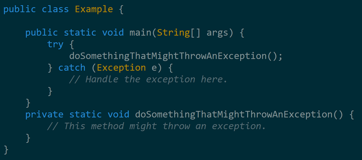

# Q 3. Describe the try-catch-finally block and its purpose in exception handling.

The try-catch-finally block is a Java syntax that allows you to handle exceptions gracefully. It consists of three parts:

- The try block

- The catch block

- The finally block

Here are some of the benefits of using try-catch-finally blocks:

- Prevents program crashes

- Allows you to recover from errors

- Provides information about the error

- Makes your code more robust

- Makes your code easier to read and understand

# Q 4. What is the difference between the throw and throws keywords in Java?

The throw and throws keywords in Java are used to handle
exceptions.

- The **throw keyword** is used to explicitly throw an exception

- The **throws keyword** is used to declare that a method can
throw an exception.

# Q 5. How can you create custom exceptions in Java?

To create a custom exception in Java, you need to create a class that extends the Exception class. The custom exception class can have its own constructors, methods, and fields.

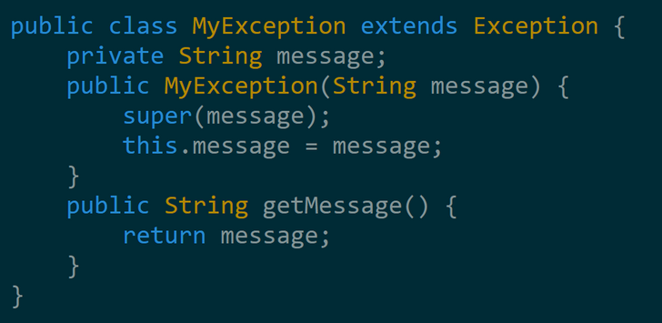

# JVM

When you write Java code, it's first compiled into bytecode by the Java compiler.

Bytecode is a platform-independent representation of your code.

There is a JVM implementation specific to each platform (Windows, Mac, Linux...)

The JVM knows nothing about the Java programming language, but only of a particular binary format, the class file format.

The JVM loads classes from the bytecode as needed.

Then the Execution engine of JVM converts the bytecode to native machine instructions and executes the program.

Main components of JVM : 

## Class Loader Subsystem

The class loader has three components.

1. Bootstrap Class Loader

2. Extension Class Loader

3. Application Class Loader

## Bootstrap Class Loader

Loads core Java classes like java.lang.Object and other runtime classes essential for JVM operation.

## Extension Class Loader

Loads classes from the Java extension directory (usually $JAVA_HOME/lib/ext).

eg: classes from javax libraries such as javax.xml.*

## Application Class Loader

Loads classes from the application classpath specified by the CLASSPATH environment variable or the -cp option.

## Runtime Data Areas

**Method Area (Class Area)**

Stores class metadata, static fields, and method information. Each loaded class has its own method area.

**Heap**

Stores objects and their instance variables. It's shared among all threads and is where garbage collection occurs.

**Stack**

Stores local variables, method call information, and partial results.

Each thread has its own stack, created along with the thread. It includes the method call stack (frames) and local variables.

**PC (Program Counter) Register**

Holds the address of the JVM instruction being executed.

**Native Method Stack**

Stores native method information.

## Execution Engine

Execution engine consists of **Interpreter** and **Just-In-Time (JIT)** Compiler.

## Interpreter

Reads and interprets bytecode line by line and executes the corresponding native instructions. Slower compared to the JIT compiler but platformindependent.

## Just-In-Time (JIT) Compiler

Translates bytecode into native machine code specific to the underlying hardware, optimizing performance. The compiled code is cached for future use.

## Garbage Collector (GC)

Manages memory by reclaiming memory that is no longer in use (garbage collection).

## Native Interface

JNI (Java Native Interface) allows Java code to call and be called by native applications or libraries written in languages like C or C++.

## Native Method Libraries

Libraries of native methods that provide implementations for native (platform-dependent) methods.

These components work together to load classes, manage memory, execute bytecode, and interface with native code, enabling Java applications to run in a platform-independent manner.

The JVM provides a consistent runtime environment across various operating systems and hardware architectures, allowing Java applications to run reliably and efficiently.

# Java Interview Question

## A. Core Java

### 1. What are the important features of Java 8 release?

Java 8 has been released in March 2014, so it’s one of the hot topic in java interview questions. If you answer this question clearly, it will show that you like to keep yourself up-to-date with the latest technologies.

Java 8 has been one of the biggest release after Java 5 annotations and generics. Some of the important features of Java 8 are:

1. Interface changes with default and static methods

2. Functional interfaces and Lambda Expressions

3. Java Stream API for collection classes

4. Java Date Time API

### 2. What do you mean by platform independence of Java?

Platform independence means that you can run the same Java Program in any Operating System. For example, you can write java program in Windows and run it in Mac OS.

### 3. What is JVM and is it platform independent?

Java Virtual Machine (JVM) is the heart of java programming language. JVM is responsible for converting byte code into machine readable code. JVM is not platform independent, thats why you have different JVM for different operating systems. We can customize JVM with Java Options, such as allocating minimum and maximum memory to JVM. It’s called virtual because it provides an interface that doesn’t depend on the underlying OS.

### 4. What is the difference between JDK and JVM?

Java Development Kit (JDK) is for development purpose and JVM is a part of it to execute the java programs.

JDK provides all the tools, executables and binaries required to compile, debug and execute a Java Program. The execution part is handled by JVM to provide machine independence.

### 5. What is the difference between JVM and JRE?

Java Runtime Environment (JRE) is the implementation of JVM. JRE consists of JVM and java binaries and other classes to execute any program successfully. JRE doesn’t contain any development tools like java compiler, debugger etc. If you want to execute any java program, you should have JRE installed.

### 6. Which class is the superclass of all classes?

java.lang.Object is the root class for all the java classes and we don’t need to extend it.

### 7. Why Java doesn’t support multiple inheritance?

Java doesn’t support multiple inheritance in classes because of “Diamond Problem”. To know more about diamond problem with example, read Multiple Inheritance in Java.

However multiple inheritance is supported in interfaces. An interface can extend multiple interfaces because they just declare the methods and implementation will be present in the implementing class. So there is no issue of diamond problem with interfaces.

### 8. Why Java is not pure Object Oriented language?

Java is not said to be pure object oriented because it support primitive types such as int, byte, short, long etc. I believe it brings simplicity to the language while writing our code. Obviously java could have wrapper objects for the primitive types but just for the representation, they would not have provided any benefit.

As we know, for all the primitive types we have wrapper classes such as Integer, Long etc that provides some additional methods.

### 9. What is difference between path and classpath variables?

PATH is an environment variable used by operating system to locate the executables. That’s why when we install Java or want any executable to be found by OS, we need to add the directory location in the PATH variable.

Classpath is specific to java and used by java executables to locate class files. We can provide the classpath location while running java application and it can be a directory, ZIP files, JAR files etc.

### 10. What is the importance of main method in Java?

main() method is the entry point of any standalone java application. The syntax of main method is public static void main(String args[]).

main method is public and static so that java can access it without initializing the class. The input parameter is an array of String through which we can pass runtime arguments to the java program. 

### 11. What is overloading and overriding in java?

When we have more than one method with same name in a single class but the arguments are different, then it is called as method overloading.

Overriding concept comes in picture with inheritance when we have two methods with same signature, one in parent class and another in child class. We can use @Override annotation in the child class overridden method to make sure if parent class method is changed, so as child class.

### 12. Can we overload main method?

Yes, we can have multiple methods with name “main” in a single class. However if we run the class, java runtime environment will look for main method with syntax as public static void main(String args[]).

### 13. Can we have multiple public classes in a java source file?

We can’t have more than one public class in a single java source file. A single source file can have multiple classes that are not public.

### 14. What is Java Package and which package is imported by default?

Java package is the mechanism to organize the java classes by grouping them. The grouping logic can be based on functionality or modules based. A java class fully classified name contains package and class name. For example, java.lang.Object is the fully classified name of Object class that is part of java.lang package.

java.lang package is imported by default and we don’t need to import any class from this package explicitly.

```java

[sociallocker id=”2713″]
```

### 15. What are access modifiers?

Java provides access control through public, private and protected access modifier keywords. When none of these are used, it’s called default access modifier. A java class can only have public or default access modifier. Read Java Access Modifiers to learn more about these in detail.

### 16. What is final keyword?

final keyword is used with Class to make sure no other class can extend it, for example String class is final and we can’t extend it.

We can use final keyword with methods to make sure child classes can’t override it.

final keyword can be used with variables to make sure that it can be assigned only once. However the state of the variable can be changed, for example we can assign a final variable to an object only once but the object variables can change later on.

Java interface variables are by default final and static.

### 17. What is static keyword?

static keyword can be used with class level variables to make it global i.e all the objects will share the same variable.

static keyword can be used with methods also. A static method can access only static variables of class and invoke only static methods of the class.

### 18. What is finally and finalize in java?

finally block is used with try-catch to put the code that you want to get executed always, even if any exception is thrown by the try-catch block. finally block is mostly used to release resources created in the try block.

finalize() is a special method in Object class that we can override in our classes. This method get’s called by garbage collector when the object is getting garbage collected. This method is usually overridden to release system resources when object is garbage collected.

### 19. Can we declare a class as static?

We can’t declare a top-level class as static however an inner class can be declared as static. If inner class is declared as static, it’s called static nested class. Static nested class is same as any other top-level class and is nested for only packaging convenience.

### 20. What is static import?

If we have to use any static variable or method from other class, usually we import the class and then use the method/variable with class name.

```java
import java.lang.Math;
//inside class
double test = Math.PI * 5;
```

We can do the same thing by importing the static method or variable only and then use it in the class as if it belongs to it.

```java
import static java.lang.Math.PI;
//no need to refer class now
double test = PI * 5;
```

Use of static import can cause confusion, so it’s better to avoid it. Overuse of static import can make your program unreadable and unmaintainable.

### 21. What is try-with-resources in java?

One of the Java 7 features is try-with-resources statement for automatic resource management. Before Java 7, there was no auto resource management and we should explicitly close the resource. Usually, it was done in the finally block of a try-catch statement. This approach used to cause memory leaks when we forgot to close the resource.

From Java 7, we can create resources inside try block and use it. Java takes care of closing it as soon as try-catch block gets finished. 

### 22. What is multi-catch block in java?

Java 7 one of the improvement was multi-catch block where we can catch multiple exceptions in a single catch block. This makes are code shorter and cleaner when every catch block has similar code.

If a catch block handles multiple exception, you can separate them using a pipe (|) and in this case exception parameter (ex) is final,

### 23. What is static block?

Java static block is the group of statements that gets executed when the class is loaded into memory by Java ClassLoader. It is used to initialize static variables of the class. Mostly it’s used to create static resources when class is loaded.

### 24. What is an interface?

Interfaces are core part of java programming language and used a lot not only in JDK but also java design patterns, most of the frameworks and tools. Interfaces provide a way to achieve abstraction in java and used to define the contract for the subclasses to implement.

Interfaces are good for starting point to define Type and create top level hierarchy in our code. Since a java class can implements multiple interfaces, it’s better to use interfaces as super class in most of the cases. 

### 25. What is an abstract class?

Abstract classes are used in java to create a class with some default method implementation for subclasses. An abstract class can have abstract method without body and it can have methods with implementation also.

abstract keyword is used to create an abstract class. Abstract classes can’t be instantiated and mostly used to provide base for sub-classes to extend and implement the abstract methods and override or use the implemented methods in abstract class. 

### 26. What is the difference between abstract class and interface?

abstract keyword is used to create abstract class whereas interface is the keyword for interfaces.

Abstract classes can have method implementations whereas interfaces can’t.

A class can extend only one abstract class but it can implement multiple interfaces.

We can run abstract class if it has main() method whereas we can’t run an interface.

Some more differences in detail are at Difference between Abstract Class and Interface.

### 27. Can an interface implement or extend another interface?

Interfaces don’t implement another interface, they extend it. Since interfaces can’t have method implementations, there is no issue of diamond problem. That’s why we have multiple inheritance in interfaces i.e an interface can extend multiple interfaces.

### 28. What is Marker interface?

A marker interface is an empty interface without any method but used to force some functionality in implementing classes by Java. Some of the well known marker interfaces are Serializable and Cloneable.

### 29. What are Wrapper classes?

Java wrapper classes are the Object representation of eight primitive types in java. All the wrapper classes in java are immutable and final. Java 5 autoboxing and unboxing allows easy conversion between primitive types and their corresponding wrapper classes.

### 30. What is Enum in Java?

Enum was introduced in Java 1.5 as a new type whose fields consists of fixed set of constants. For example, in Java we can create Direction as enum with fixed fields as EAST, WEST, NORTH, SOUTH.

enum is the keyword to create an enum type and similar to class. Enum constants are implicitly static and final.

### 31. What is Java Annotations?

Java Annotations provide information about the code and they have no direct effect on the code they annotate. Annotations are introduced in Java 5. Annotation is metadata about the program embedded in the program itself. It can be parsed by the annotation parsing tool or by compiler. We can also specify annotation availability to either compile time only or till runtime also. Java Built-in annotations are @Override, @Deprecated and @SuppressWarnings. 

### 32. What is Java Reflection API? Why it’s so important to have?

Java Reflection API provides ability to inspect and modify the runtime behavior of java application. We can inspect a java class, interface, enum and get their methods and field details. Reflection API is an advanced topic and we should avoid it in normal programming. Reflection API usage can break the design pattern such as Singleton pattern by invoking the private constructor i.e violating the rules of access modifiers.

Even though we don’t use Reflection API in normal programming, it’s very important to have. We can’t have any frameworks such as Spring, Hibernate or servers such as Tomcat, JBoss without Reflection API. They invoke the appropriate methods and instantiate classes through reflection API and use it a lot for other processing.

### 33. What is composition in java?

Composition is the design technique to implement has-a relationship in classes. We can use Object composition for code reuse.

Java composition is achieved by using instance variables that refers to other objects. Benefit of using composition is that we can control the visibility of other object to client classes and reuse only what we need. 

### 34. What is the benefit of Composition over Inheritance?

One of the best practices of java programming is to “favor composition over inheritance”. Some of the possible reasons are:

- Any change in the superclass might affect subclass even though we might not be using the superclass methods. For example, if we have a method test() in subclass and suddenly somebody introduces a method test() in superclass, we will get compilation errors in subclass. Composition will never face this issue because we are using only what methods we need.

- Inheritance exposes all the super class methods and variables to client and if we have no control in designing superclass, it can lead to security holes. Composition allows us to provide restricted access to the methods and hence more secure.

- We can get runtime binding in composition where inheritance binds the classes at compile time. So composition provides flexibility in invocation of methods.


### 35. How to sort a collection of custom Objects in Java?

We need to implement Comparable interface to support sorting of custom objects in a collection. Comparable interface has compareTo(T obj) method which is used by sorting methods and by providing this method implementation, we can provide default way to sort custom objects collection.

However, if you want to sort based on different criteria, such as sorting an Employees collection based on salary or age, then we can create Comparator instances and pass it as sorting methodology. 

### 36. What is inner class in java?

We can define a class inside a class and they are called nested classes. Any non-static nested class is known as inner class. Inner classes are associated with the object of the class and they can access all the variables and methods of the outer class. Since inner classes are associated with instance, we can’t have any static variables in them.

We can have local inner class or anonymous inner class inside a class.

### 37. What is anonymous inner class?

A local inner class without name is known as anonymous inner class. An anonymous class is defined and instantiated in a single statement. Anonymous inner class always extend a class or implement an interface.

Since an anonymous class has no name, it is not possible to define a constructor for an anonymous class. Anonymous inner classes are accessible only at the point where it is defined.

### 38. What is Classloader in Java?

Java Classloader is the program that loads byte code program into memory when we want to access any class. We can create our own classloader by extending ClassLoader class and overriding loadClass(String name) method. Learn more at java classloader.

### 39. What are different types of classloaders?

There are three types of built-in Class Loaders in Java:

1. Bootstrap Class Loader – It loads JDK internal classes, typically loads rt.jar and other core classes.

2. Extensions Class Loader – It loads classes from the JDK extensions directory, usually $JAVA_HOME/lib/ext directory.

3. System Class Loader – It loads classes from the current classpath that can be set while invoking a program using -cp or -classpath command line options.

### 40. What is ternary operator in java?

Java ternary operator is the only conditional operator that takes three operands. It’s a one liner replacement for if-then-else statement and used a lot in java programming. We can use ternary operator if-else conditions or even switch conditions using nested ternary operators. 

### 41. What does super keyword do?

super keyword can be used to access super class method when you have overridden the method in the child class.

We can use super keyword to invoke super class constructor in child class constructor but in this case it should be the first statement in the constructor method.

```java
package com.journaldev.access;
public class SuperClass {
public SuperClass(){
}
public SuperClass(int i){}
public void test(){ System.out.println("super class test method");
}
}
```


Use of super keyword can be seen in below child class implementation.

```java
package com.journaldev.access;
public class ChildClass extends SuperClass {
public ChildClass(String str){
//access super class constructor with super keyword
super();
//access child class method
test();
//use super to access super class method
super.test();
}
@Override
public void test(){ System.out.println("child class test method");
}
}
```

### 42. What is break and continue statement?

We can use break statement to terminate for, while, or do-while loop. We can use break statement in switch statement to exit the switch case. We can use break with label to terminate the nested loops.

The continue statement skips the current iteration of a for, while or do-while loop. We can use continue statement with label to skip the current iteration of outermost loop.

### 43. What is this keyword?

this keyword provides reference to the current object and it’s mostly used to make sure that object variables are used, not the local variables having same name.

```java
//constructor
public Point(int x, int y) {
this.x = x;
this.y = y;
}
```

We can also use this keyword to invoke other constructors from a constructor.

```java
public Rectangle() {
this(0, 0, 0, 0);
}
public Rectangle(int width, int height) {
this(0, 0, width, height);
}
public Rectangle(int x, int y, int width, int height) {
this.x = x;
this.y = y;
this.width = width;
this.height = height;
}
```

### 44. What is default constructor?

No argument constructor of a class is known as default constructor. When we don’t define any constructor for the class, java compiler automatically creates the default no-args constructor for the class. If there are other constructors defined, then compiler won’t create default constructor for us.

### 45. Can we have try without catch block?

Yes, we can have try-finally statement and hence avoiding catch block.

### 46. What is Garbage Collection?

Garbage Collection is the process of looking at heap memory, identifying which objects are in use and which are not, and deleting the unused objects. In Java, process of deallocating memory is handled automatically by the garbage collector.

We can run the garbage collector with code Runtime.getRuntime().gc() or use utility method System.gc(). For a detailed analysis of Heap Memory and Garbage Collection.

### 47. What is Serialization and Deserialization?

We can convert a Java object to an Stream that is called Serialization. Once an object is converted to Stream, it can be saved to file or send over the network or used in socket connections.

The object should implement Serializable interface and we can use java.io.ObjectOutputStream to write object to file or to any OutputStream object.

The process of converting stream data created through serialization to Object is called deserialization. 

### 48. How to run a JAR file through command prompt?

We can run a jar file using java command but it requires Main-Class entry in jar manifest file. Main-Class is the entry point of the jar and used by java command to execute the class.

### 49. What is the use of System class?

Java System Class is one of the core classes. One of the easiest way to log information for debugging is System.out.print() method.

System class is final so that we can’t subclass and override it’s behavior through inheritance. System class doesn’t provide any public constructors, so we can’t instantiate this class and that’s why all of it’s methods are static.

Some of the utility methods of System class are for array copy, get current time, reading environment variables.

### 50. What is instanceof keyword?

We can use instanceof keyword to check if an object belongs to a class or not. We should avoid it’s usage as much as possible. Sample usage is:

```java
public static void main(String args[]){ Object str = new String("abc");
if(str instanceof String){ System.out.println("String value:"+str);
}
if(str instanceof Integer){ System.out.println("Integer value:"+str);
}
}
```

Since str is of type String at runtime, first if statement evaluates to true and second one to false.

### 51. Can we use String with switch case?

One of the Java 7 feature was improvement of switch case of allow Strings. So if you are using Java 7 or higher version, you can use String in switch-case statements.

### 52. Java is Pass by Value or Pass by Reference?

This is a very confusing question, we know that object variables contain reference to the Objects in heap space. When we invoke any method, a copy of these variables is passed and gets stored in the stack memory of the method. We can test any language whether it’s pass by reference or pass by value through a simple generic swap method.

### 53. What is difference between Heap and Stack Memory?

Major difference between Heap and Stack memory are as follows:
- Heap memory is used by all the parts of the application whereas stack memory is used only by one thread of execution.

- Whenever an object is created, it’s always stored in the Heap space and stack memory contains the reference to it. Stack memory only contains local primitive variables and reference variables to objects in heap space.

- Memory management in stack is done in LIFO manner whereas it’s more complex in Heap memory because it’s used globally.


### 54. Java Compiler is stored in JDK, JRE or JVM?

The task of java compiler is to convert java program into bytecode, we have javac executable for that. So it must be stored in JDK, we don’t need it in JRE and JVM is just the specs.

### 55. What will be the output of following programs?

**1. static method in class**

```java
package com.journaldev.util;
public class Test {
public static String toString(){ System.out.println("Test toString called"); return "";
}

public static void main(String args[]){
System.out.println(toString());
}
}
```

**Answer**: The code won’t compile because we can’t have an Object class method with static keyword. You will get compile time error as “This static method cannot hide the instance method from Object”. The reason is that static method belongs to class and since every class base is Object, we can’t have same method in instance as well as in class.

**2. static method invocation**

```java
package com.journaldev.util;
public class Test {
public static String foo(){ System.out.println("Test foo called"); return "";
}
public static void main(String args[]){
Test obj = null;
System.out.println(obj.foo());
}
}
```

**Answer**: Well this is a strange situation. We all have seen NullPointerException when we invoke a method on object that is NULL. The compiler will give warning as “The static method foo() from the type Test should be accessed in a static way” but when executing it will work and prints “Test foo called”.

Ideally Java API should have given error when a static method is called from an object rather than giving warning, but I think it’s too late now to impose this. And most strange of all is that even though obj is null here, when invoking static method it works fine. I think it’s working fine because Java runtime figures out that foo() is a static method and calls it on the class loaded into the memory and doesn’t use the object at all, so no NullPointerException.

## B. String Interview Questions

### 1. What is String in Java? String is a data type?

String is a Class in java and defined in java.lang package. It’s not a primitive data type like int and long. String class represents character Strings. String is used in almost all the Java applications and there are some interesting facts we should know about String. String in immutable and final in Java and JVM uses String Pool to store all the String objects. Some other interesting things about String is the way we can instantiate a String object using double quotes and overloading of “+” operator for concatenation.

### 2. What are different ways to create String Object?

We can create String object using new operator like any normal java class or we can use double quotes to create a String object. There are several constructors available in String class to get String from char array, byte array, 

```java
StringBuffer and StringBuilder. String str = new String("abc"); String str1 = "abc";
```

When we create a String using double quotes, JVM looks in the String pool to find if any other String is stored with same value. If found, it just returns the reference to that String object else it creates a new String object with given value and stores it in the String pool. When we use new operator, JVM creates the String object but don’t store it into the String Pool. We can use intern() method to store the String object into String pool or return the reference if there is already a String with equal value present in the pool.

### 3. Write a method to check if input String is Palindrome?

A String is said to be Palindrome if its value is same when reversed. For example “aba” is a Palindrome String.

String class doesn’t provide any method to reverse the String but StringBuffer and StringBuilder class has reverse method that we can use to check if String is palindrome or not.

```java
private static boolean isPalindrome(String str) {
if (str == null)
return false;
StringBuilder strBuilder = new StringBuilder(str);
strBuilder.reverse();
return strBuilder.toString().equals(str);
}
```

Sometimes interviewer asks not to use any other class to check this, in that case we can compare characters in the String from both ends to find out if it’s palindrome or not.

```java
private static boolean isPalindrome(String str) {
if (str == null)
return false;
StringBuilder strBuilder = new StringBuilder(str);
strBuilder.reverse();
return strBuilder.toString().equals(str);
}
```

### 4. Write a method that will remove given character from the String?

We can use replaceAll method to replace all the occurance of a String with another String. The important point to note is that it accepts String as argument, so we will use Character class to create String and use it to replace all the characters with empty String.

```java
private static String removeChar(String str, char c) {
if (str == null)
return null; return str.replaceAll(Character.toString(c), "");
}
```

### 5. How can we make String upper case or lower case?

We can use String class toUpperCase and toLowerCase methods to get the String in all upper case or lower case. These methods have a variant that accepts Locale argument and use that locale rules to convert String to upper or lower case.

### 6. What is String subSequence method?

Java 1.4 introduced CharSequence interface and String implements this interface, this is the only reason for the implementation of subSequence method in String class. Internally it invokes the String substring method.

### 7. How to compare two Strings in java program?

Java String implements Comparable interface and it has two variants of compareTo() methods.

compareTo(String anotherString) method compares the String object with the String argument passed lexicographically. If String object precedes the argument passed, it returns negative integer and if String object follows the argument String passed, it returns positive integer. It returns zero when both the String have same value, in this case equals(String str) method will also return true.

compareToIgnoreCase(String str): This method is similar to the first one, except that it ignores the case. It uses String CASE_INSENSITIVE_ORDER Comparator for case insensitive comparison. If the value is zero then equalsIgnoreCase(String str) will also return true. Check this post for String compareTo example.

### 8. How to convert String to char and vice versa?

This is a tricky question because String is a sequence of characters, so we can’t convert it to a single character. We can use use charAt method to get the character at given index or we can use toCharArray() method to convert String to character array.

### 9. How to convert String to byte array and vice versa?

We can use String getBytes() method to convert String to byte array and we can use String constructor new String(byte[] arr) to convert byte array to String.

### 10. Can we use String in switch case?

This is a tricky question used to check your knowledge of current Java developments. Java 7 extended the capability of switch case to use Strings also, earlier java versions doesn’t support this.

If you are implementing conditional flow for Strings, you can use if-else conditions and you can use switch case if you are using Java 7 or higher versions.

### 11. Write a program to print all permutations of String?

This is a tricky question and we need to use recursion to find all the permutations of a String, for example “AAB” permutations will be “AAB”, “ABA” and “BAA”. We also need to use Set to make sure there are no duplicate values. 

### 12. Write a function to find out longest palindrome in a given string?

A String can contain palindrome strings in it and to find longest palindrome in given String is a programming question.

### 13. Difference between String, StringBuffer and StringBuilder?

String is immutable and final in java, so whenever we do String manipulation, it creates a new String. String manipulations are resource consuming, so java provides two utility classes for String manipulations – StringBuffer and StringBuilder. StringBuffer and StringBuilder are mutable classes. StringBuffer operations are thread-safe and synchronized where StringBuilder operations are not thread-safe. So when multiple threads are working on same String, we should use StringBuffer but in single threaded environment we should use StringBuilder. StringBuilder performance is fast than StringBuffer because of no overhead of synchronization.

### 14. Why String is immutable or final in Java
There are several benefits of String because it’s immutable and final.

- String Pool is possible because String is immutable in java.

- It increases security because any hacker can’t change its value and it’s used for storing sensitive information such as database username, password etc.

- Since String is immutable, it’s safe to use in multi-threading and we don’t need any synchronization.

- Strings are used in java classloader and immutability provides security that correct class is getting loaded by Classloader.

### 15. How to Split String in java?

We can use split(String regex) to split the String into String array based on the provided regular expression.

### 16. Why Char array is preferred over String for storing password?

String is immutable in java and stored in String pool. Once it’s created it stays in the pool until unless garbage collected, so even though we are done with password it’s available in memory for longer duration and there is no way to avoid it. It’s a security risk because anyone having access to memory dump can find the password as clear text. If we use char array to store password, we can set it to blank once we are done with it. So we can control for how long it’s available in memory that avoids the security threat with String.

### 17. How do you check if two Strings are equal in Java?

There are two ways to check if two Strings are equal or not – using “==” operator or using equals method. When we use “==” operator, it checks for value of String as well as reference but in our programming, most of the time we are checking equality of String for value only. So we should use equals method to check if two Strings are equal or not. 

There is another function equalsIgnoreCase that we can use to ignore case. 

```java
String s1 = "abc"; 
String s2 = "abc"; 
String s3= new String("abc"); 
System.out.println("s1 == s2 ? "+(s1==s2)); //true 
System.out.println("s1 == s3 ? "+(s1==s3)); //false 
System.out.println("s1 equals s3 ? "+(s1.equals(s3))); //true
```
### 18. What is String Pool?

As the name suggests, String Pool is a pool of Strings stored in Java heap memory. We know that String is special class in java and we can create String object using new operator as well as providing values in double quotes.

### 19. What does String intern() method do?

When the intern method is invoked, if the pool already contains a string equal to this String object as determined by the equals(Object) method, then the string from the pool is returned. Otherwise, this String object is added to the pool and a reference to this String object is returned.

This method always return a String that has the same contents as this string, but is guaranteed to be from a pool of unique strings.

### 20. Does String is thread-safe in Java?

Strings are immutable, so we can’t change its value in program. Hence it’s thread-safe and can be safely used in multi-threaded environment.

### 21. Why String is popular HashMap key in Java?

Since String is immutable, its hashcode is cached at the time of creation and it doesn’t need to be calculated again. This makes it a great candidate for key in a Map and its processing is fast than other HashMap key objects. This is why String is mostly used Object as HashMap keys.

## 1. String Programming Questions

### 1. What is the output of below program?

```java
package com.journaldev.strings;
public class StringTest {
public static void main(String[] args) { String s1 = new String("pankaj"); String s2 = new String("PANKAJ");
System.out.println(s1 = s2);
}
}
```

It’s a simple yet tricky program, it will print “PANKAJ” because we are assigning s2 String to s1. Don’t get confused with == comparison operator.

### 2. What is the output of below program?

```java
package com.journaldev.strings;
public class Test {
public void foo(String s) { System.out.println("String");
}
public void foo(StringBuffer sb){ System.out.println("StringBuffer");
}
public static void main(String[] args) {
new Test().foo(null);
}
}
```

The above program will not compile with error as “The method foo(String) is ambiguous for the type Test”.

### 3. What is the output of below code snippet? 

```java
String s1 = new String("abc"); 
String s2 = new String("abc");
System.out.println(s1 == s2);
```

It will print false because we are using new operator to create String, so it will be created in the heap memory and both s1, s2 will have different reference. If we create them using double quotes, then they will be part of string pool and it will print true.

### 4. What will be output of below code snippet? 

```java
String s1 = "abc";
StringBuffer s2 = new StringBuffer(s1);
System.out.println(s1.equals(s2));
```

It will print false because s2 is not of type String. If you will look at the equal’s method implementation in the String class, you will find a check using instanceof operator to check if the type of passed object is String? If not, then return false.

### 5. What will be output of below program? 

```java
String s1 = "abc";
String s2 = new String("abc");
s2.intern();
System.out.println(s1 ==s2);
```

It’s a tricky question and output will be false. We know that intern() method will return the String object reference from the string pool, but since we didn’t assigned it back to s2, there is no change in s2 and hence both s1 and s2 are having different reference. If we change the code in line 3 to s2 = s2.intern(); then output will be true.

### 6. How many String objects got created in below code snippet? 

```java
String s1 = new String("Hello"); 
String s2 = new String("Hello");
```
Answer is 3. 

First – line 1, “Hello” object in the string pool. 

Second – line 1, new String with value “Hello” in the heap memory. 

Third – line 2, new String with value “Hello” in the heap memory. Here “Hello” string from string pool is reused.

## C. Collections Interview Questions

### 1. What are Collection related features in Java 8?

Java 8 has brought major changes in the Collection API. Some of the changes are:

1. Java Stream API for collection classes for supporting sequential as well as parallel processing

2. Iterable interface is extended with forEach() default method that we can use to iterate over a collection. It is very helpful when used with lambda expressions because it’s argument Consumer is a function interface.

3. Miscellaneous Collection API improvements such as forEachRemaining(Consumer action) method in Iterator interface, Map replaceAll(), compute(), merge() methods.

### 2. What is Java Collections Framework? List out some benefits of Collections framework?

Collections are used in every programming language and initial java release contained few classes for collections: Vector, Stack, Hashtable, Array. But looking at the larger scope and usage, Java 1.2 came up with Collections Framework that group all the collections interfaces, implementations and algorithms. Java Collections have come through a long way with usage of Generics and Concurrent Collection classes for thread-safe operations. It also includes blocking interfaces and their implementations in java concurrent package. 

Some of the benefits of collections framework are;

- Reduced development effort by using core collection classes rather than implementing our own collection classes.

- Code quality is enhanced with the use of well tested collections framework classes.

- Reduced effort for code maintenance by using collection classes shipped with JDK.

- Reusability and Interoperability

### 3. What is the benefit of Generics in Collections Framework?

Java 1.5 came with Generics and all collection interfaces and implementations use it heavily. Generics allow us to provide the type of Object that a collection can contain, so if you try to add any element of other type it throws compile time error. This avoids ClassCastException at Runtime because you will get the error at compilation. Also Generics make code clean since we don’t need to use casting and instanceof operator.

### 4. What are the basic interfaces of Java Collections Framework?

**Collection** is the root of the collection hierarchy. A collection represents a group of objects known as its elements. The Java platform doesn’t provide any direct implementations of this interface.

**Set** is a collection that cannot contain duplicate elements. This interface models the mathematical set abstraction and is used to represent sets, such as the deck of cards.

**List** is an ordered collection and can contain duplicate elements. You can access any element from its index. List is more like array with dynamic length.

A **Map** is an object that maps keys to values. A map cannot contain duplicate keys: Each key can map to at most one value.

Some other interfaces are **Queue**, **Dequeue**, **Iterator**, **SortedSet**, **SortedMap** and **ListIterator**.

### 5. Why Collection doesn’t extend Cloneable and Serializable interfaces?

Collection interface specifies group of Objects known as elements. How the elements are maintained is left up to the concrete implementations of Collection. For example, some Collection implementations like List allow duplicate elements whereas other implementations like Set don’t.

A lot of the Collection implementations have a public clone method. However, it doesn’t really make sense to include it in all implementations of Collection. This is because Collection is an abstract representation. What matters is the implementation. The semantics and the implications of either cloning or serializing come into play when dealing with the actual implementation; so concrete implementation should decide how it should be cloned or serialized, or even if it can be cloned or serialized. So mandating cloning and serialization in all implementations is actually less flexible and more restrictive. The specific implementation should make the decision as to whether it can be cloned or serialized.

### 6. Why Map interface doesn’t extend Collection interface?

Although Map interface and its implementations are part of Collections Framework, Map are not collections and collections are not Map. Hence it doesn’t make sense for Map to extend Collection or vice versa.

If Map extends Collection interface, then where are the elements? Map contains key-value

pairs and it provides methods to retrieve list of Keys or values as Collection but it doesn’t fit into the “group of elements” paradigm.

### 7. What is an Iterator?

Iterator interface provides methods to iterate over any Collection. We can get iterator instance from a Collection using iterator() method. Iterator takes the place of Enumeration in the Java Collections Framework. Iterators allow the caller to remove elements from the underlying collection during the iteration. Java Collection iterator provides a generic way for traversal through the elements of a collection and implements Iterator Design Pattern.

### 8. What is difference between Enumeration and Iterator interface?

Enumeration is twice as fast as Iterator and uses very less memory. Enumeration is very basic and fits to basic needs. But Iterator is much safer as compared to Enumeration because it always denies other threads to modify the collection object which is being iterated by it.

Iterator takes the place of Enumeration in the Java Collections Framework. Iterators allow the caller to remove elements from the underlying collection that is not possible with Enumeration. Iterator method names have been improved to make its functionality clear.

### 9. Why there is not method like Iterator.add() to add elements to the collection?

The semantics are unclear, given that the contract for Iterator makes no guarantees about the order of iteration. Note, however, that ListIterator does provide an add operation, as it does guarantee the order of the iteration.

### 10. Why Iterator don’t have a method to get next element directly without moving the cursor?

It can be implemented on top of current Iterator interface but since its use will be rare, it doesn’t make sense to include it in the interface that everyone has to implement.

### 11. What is difference between Iterator and ListIterator?

- We can use Iterator to traverse Set and List collections whereas ListIterator can be used with Lists only.

- Iterator can traverse in forward direction only whereas ListIterator can be used to traverse in both the directions.

- ListIterator inherits from Iterator interface and comes with extra functionalities like adding an element, replacing an element, getting index position for previous and next elements.

### 12. What are different ways to iterate over a list?

We can iterate over a list in two different ways – using iterator and using for-each loop.

```java
List&lt;String&gt; strList = new ArrayList&lt;&gt;();
//using for-each loop
for(String obj : strList){
System.out.println(obj);
}
//using iterator
Iterator&lt;String&gt; it = strList.iterator();
while(it.hasNext()){
String obj = it.next();
System.out.println(obj);
}
```

Using iterator is more thread-safe because it makes sure that if underlying list elements are modified, it will throw ConcurrentModificationException.

### 13. What do you understand by iterator fail-fast property?

Iterator fail-fast property checks for any modification in the structure of the underlying collection everytime we try to get the next element. If there are any modifications found, it throws ConcurrentModificationException. All the implementations of Iterator in Collection classes are fail-fast by design except the concurrent collection classes like ConcurrentHashMap and CopyOnWriteArrayList.

### 14. What is difference between fail-fast and fail-safe?

Iterator fail-safe property work with the clone of underlying collection, hence it’s not affected by any modification in the collection. By design, all the collection classes in java.util package are fail-fast whereas collection classes in java.util.concurrent are fail-safe.

Fail-fast iterators throw ConcurrentModificationException whereas fail-safe iterator never throws ConcurrentModificationException.

### 15.How to avoid ConcurrentModificationException while iterating a collection?

We can use concurrent collection classes to avoid ConcurrentModificationException while iterating over a collection, for example CopyOnWriteArrayList instead of ArrayList.

### 16. Why there are no concrete implementations of Iterator interface?

Iterator interface declare methods for iterating a collection but its implementation is responsibility of the Collection implementation classes. Every collection class that returns an iterator for traversing has its own Iterator implementation nested class. This allows collection classes to choose whether iterator is fail-fast or fail-safe. For example ArrayList iterator is fail-fast whereas CopyOnWriteArrayList iterator is fail-safe.

### 17. What is UnsupportedOperationException?

UnsupportedOperationException is the exception used to indicate that the operation is not supported. It’s used extensively in JDK classes, in collections framework java.util.Collections.UnmodifiableCollection throws this exception for all add and remove operations.

### 18. How HashMap works in Java?
HashMap stores key-value pair in Map.Entry static nested class implementation. HashMap works on hashing algorithm and uses hashCode() and equals() method in put and get methods.

When we call put method by passing key-value pair, HashMap uses Key hashCode() with hashing to find out the index to store the key-value pair. The Entry is stored in the LinkedList, so if there are already existing entry, it uses equals() method to check if the passed key already exists, if yes it overwrites the value else it creates a new entry and store this key-value Entry.

When we call get method by passing Key, again it uses the hashCode() to find the index in the array and then use equals() method to find the correct Entry and return it’s value. Below image will explain these detail clearly.

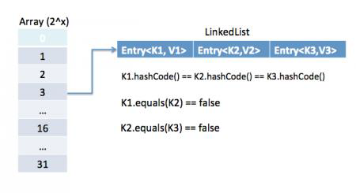

The other important things to know about HashMap are capacity, load factor, threshold resizing. HashMap initial default capacity is 16 and load factor is 0.75. Threshold is capacity multiplied by load factor and whenever we try to add an entry, if map size is greater than threshold, HashMap rehashes the contents of map into a new array with a larger capacity. The capacity is always power of 2, so if you know that you need to store a large number of key-value pairs, for example in caching data from database, it’s good idea to initialize the HashMap with correct capacity and load factor.

### 19. What is the importance of hashCode() and equals() methods?

HashMap uses Key object hashCode() and equals() method to determine the index to put the key-value pair. These methods are also used when we try to get value from HashMap. If these methods are not implemented correctly, two different Key’s might produce same hashCode() and equals() output and in that case rather than storing it at different location, HashMap will consider them same and overwrite them.

Similarly all the collection classes that doesn’t store duplicate data use hashCode() and equals() to find duplicates, so it’s very important to implement them correctly. The implementation of equals() and hashCode() should follow these rules.

```java
If o1.equals(o2), then o1.hashCode() == o2.hashCode()should always be true.

If o1.hashCode() == o2.hashCode is true, it does not mean that o1.equals(o2) will be true.
```

### 20. Can we use any class as Map key?

We can use any class as Map Key, however following points should be considered before using them.

- If the class overrides equals() method, it should also override hashCode() method.

- The class should follow the rules associated with equals() and hashCode() for all instances. Please refer earlier question for these rules.

- If a class field is not used in equals(), you should not use it in hashCode() method.

- Best practice for user defined key class is to make it immutable, so that hashCode() value can be cached for fast performance. Also immutable classes make sure that hashCode() and equals() will not change in future that will solve any issue with mutability. 

For example, let’s say I have a class MyKey that I am using for HashMap key.

```java
//MyKey name argument passed is used for equals() and hashCode() 
MyKey key = new MyKey("Pankaj"); //assume hashCode=1234 
myHashMap.put(key, "Value");
// Below code will change the key hashCode() and equals()
// but it's location is not changed. 
key.setName("Amit"); //assume new hashCode=7890
//below will return null, because HashMap will try to look for key
//in the same index as it was stored but since key is mutated,
//there will be no match and it will return null. 
myHashMap.get(new MyKey("Pankaj"));
```

This is the reason why String and Integer are mostly used as HashMap keys.

### 21. What are different Collection views provided by Map interface?

Map interface provides three collection views:

1. **Set keySet()**: Returns a Set view of the keys contained in this map. The set is backed by the map, so changes to the map are reflected in the set, and vice-versa. If the map is modified while an iteration over the set is in progress (except through the iterator’s own remove operation), the results of the iteration are undefined. The set supports element removal, which removes the corresponding mapping from the map, via the Iterator.remove, Set.remove, removeAll, retainAll, and clear operations. It does not support the add or addAll operations.

2. **Collection values()**: Returns a Collection view of the values contained in this map. The collection is backed by the map, so changes to the map are reflected in the collection, and vice-versa. If the map is modified while an iteration over the collection is in progress (except through the iterator’s own remove operation), the results of the iteration are undefined. The collection supports element removal, which removes the corresponding mapping from the map, via the Iterator.remove, Collection.remove, removeAll, retainAll and clear operations. It does not support the add or addAll operations.

3. **Set<Map.Entry<K, V>> entrySet()**: Returns a Set view of the mappings contained in this map. The set is backed by the map, so changes to the map are reflected in the set, and vice-versa. If the map is modified while an iteration over the set is in progress (except through the iterator’s own remove operation, or through the setValue operation on a map entry returned by the iterator) the results of the iteration are undefined. The set supports element removal, which removes the corresponding mapping from the map, via the Iterator.remove, Set.remove, removeAll, retainAll and clear operations. It does not support the add or addAll operations.

[sociallocker id=”2713″]

### 22. What is difference between HashMap and Hashtable?

HashMap and Hashtable both implements Map interface and looks similar, however there are following difference between HashMap and Hashtable.

1. HashMap allows null key and values whereas Hashtable doesn’t allow null key and values.

2. Hashtable is synchronized but HashMap is not synchronized. So HashMap is better for single threaded environment, Hashtable is suitable for multi-threaded environment.

3. LinkedHashMap was introduced in Java 1.4 as a subclass of HashMap, so incase you want iteration order, you can easily switch from HashMap to LinkedHashMap but that is not the case with Hashtable whose iteration order is unpredictable.

4. HashMap provides Set of keys to iterate and hence it’s fail-fast but Hashtable provides Enumeration of keys that doesn’t support this feature.

5. Hashtable is considered to be legacy class and if you are looking for modifications of Map while iterating, you should use ConcurrentHashMap.

### 23. How to decide between HashMap and TreeMap?

For inserting, deleting, and locating elements in a Map, the HashMap offers the best alternative. If, however, you need to traverse the keys in a sorted order, then TreeMap is your better alternative. Depending upon the size of your collection, it may be faster to add elements to a HashMap, then convert the map to a TreeMap for sorted key traversal.

### 24. What are similarities and difference between ArrayList and Vector?

ArrayList and Vector are similar classes in many ways.

1. Both are index based and backed up by an array internally.

2. Both maintains the order of insertion and we can get the elements in the order of insertion.

3. The iterator implementations of ArrayList and Vector both are fail-fast by design.

4. ArrayList and Vector both allows null values and random access to element using index number.

These are the differences between ArrayList and Vector.

1. Vector is synchronized whereas ArrayList is not synchronized. However if you are looking for modification of list while iterating, you should use CopyOnWriteArrayList.

2. ArrayList is faster than Vector because it doesn’t have any overhead because of synchronization.

3. ArrayList is more versatile because we can get synchronized list or read-only list from it easily using Collections utility class.

### 25. What is difference between Array and ArrayList? When will you use Array over ArrayList?

Arrays can contain primitive or Objects whereas ArrayList can contain only Objects. Arrays are fixed size whereas ArrayList size is dynamic. Arrays doesn’t provide a lot of features like ArrayList, such as addAll, removeAll, iterator etc.

Although ArrayList is the obvious choice when we work on list, there are few times when array are good to use.

- If the size of list is fixed and mostly used to store and traverse them.

- For list of primitive data types, although Collections use autoboxing to reduce the coding effort but still it makes them slow when working on fixed size primitive data types.

- If you are working on fixed multi-dimensional situation, using [][] is far more easier than List<List<>>

### 26. What is difference between ArrayList and LinkedList?

ArrayList and LinkedList both implement List interface but there are some differences between them.

1. ArrayList is an index based data structure backed by Array, so it provides random access to its elements with performance as O(1) but LinkedList stores data as list of nodes where every node is linked to its previous and next node. So even though there is a method to get the element using index, internally it traverse from start to reach at the index node and then return the element, so performance is O(n) that is slower than ArrayList.

2. Insertion, addition or removal of an element is faster in LinkedList compared to ArrayList because there is no concept of resizing array or updating index when element is added in middle.

3. LinkedList consumes more memory than ArrayList because every node in LinkedList stores reference of previous and next elements.

### 27. Which collection classes provide random access of its elements?

ArrayList, HashMap, TreeMap, Hashtable classes provide random access to its elements. 

### 28. What is EnumSet?

java.util.EnumSet is Set implementation to use with enum types. All of the elements in an enum set must come from a single enum type that is specified, explicitly or implicitly, when the set is created. EnumSet is not synchronized and null elements are not allowed. It also provides some useful methods like copyOf(Collection c), of(E first, E… rest) and complementOf(EnumSet s).
Check this post for java enum tutorial.

### 29. Which collection classes are thread-safe?

Vector, Hashtable, Properties and Stack are synchronized classes, so they are thread-safe and can be used in multi-threaded environment. Java 1.5 Concurrent API included some collection classes that allows modification of collection while iteration because they work on the clone of the collection, so they are safe to use in multi-threaded environment.

### 30. What are concurrent Collection Classes?

Java 1.5 Concurrent package (java.util.concurrent) contains thread-safe collection classes that allow collections to be modified while iterating. By design Iterator implementation in java.util packages are fail-fast and throws ConcurrentModificationException. But Iterator implementation in java.util.concurrent packages are fail-safe and we can modify the collection while iterating. Some of these classes are CopyOnWriteArrayList, ConcurrentHashMap, CopyOnWriteArraySet.

### 31. What is BlockingQueue?

java.util.concurrent.BlockingQueue is a Queue that supports operations that wait for the queue to become non-empty when retrieving and removing an element, and wait for space to become available in the queue when adding an element.
BlockingQueue interface is part of java collections framework and it’s primarily used for implementing producer consumer problem. We don’t need to worry about waiting for the space to be available for producer or object to be available for consumer in BlockingQueue as it’s handled by implementation classes of BlockingQueue.
Java provides several BlockingQueue implementations such as ArrayBlockingQueue, LinkedBlockingQueue, PriorityBlockingQueue, SynchronousQueue etc.

### 32. What is Queue and Stack, list their differences?

Both Queue and Stack are used to store data before processing them. java.util.Queue is an interface whose implementation classes are present in java concurrent package. Queue allows retrieval of element in First-In-First-Out (FIFO) order but it’s not always the case. There is also Deque interface that allows elements to be retrieved from both end of the queue. 

Stack is similar to queue except that it allows elements to be retrieved in Last-In-First-Out (LIFO) order.

Stack is a class that extends Vector whereas Queue is an interface.

### 33. What is Collections Class?

java.util.Collections is a utility class consists exclusively of static methods that operate on or return collections. It contains polymorphic algorithms that operate on collections, “wrappers”, which return a new collection backed by a specified collection, and a few other odds and ends.

This class contains methods for collection framework algorithms, such as binary search, sorting, shuffling, reverse etc.

### 34. What is Comparable and Comparator interface?

Java provides Comparable interface which should be implemented by any custom class if we want to use Arrays or Collections sorting methods. Comparable interface has compareTo(T obj) method which is used by sorting methods. We should override this method in such a way that it returns a negative integer, zero, or a positive integer if “this” object is less than, equal to, or greater than the object passed as argument.

But, in most real life scenarios, we want sorting based on different parameters. For example, as a CEO, I would like to sort the employees based on Salary, an HR would like to sort them based on the age. This is the situation where we need to use Comparator interface because Comparable.compareTo(Object o) method implementation can sort based on one field only and we can’t chose the field on which we want to sort the Object.

Comparator interface compare(Object o1, Object o2) method need to be implemented that takes two Object argument, it should be implemented in such a way that it returns negative int if first argument is less than the second one and returns zero if they are equal and positive int if first argument is greater than second one.

### 35. What is difference between Comparable and Comparator interface?

Comparable and Comparator interfaces are used to sort collection or array of objects.

Comparable interface is used to provide the natural sorting of objects and we can use it to provide sorting based on single logic.

Comparator interface is used to provide different algorithms for sorting and we can chose the comparator we want to use to sort the given collection of objects.

### 36. How can we sort a list of Objects?

If we need to sort an array of Objects, we can use Arrays.sort(). If we need to sort a list of objects, we can use Collections.sort(). Both these classes have overloaded sort() methods for natural sorting (using Comparable) or sorting based on criteria (using Comparator). Collections internally uses Arrays sorting method, so both of them have same performance except that Collections take sometime to convert list to array.

### 37. While passing a Collection as argument to a function, how can we make sure the function will not be able to modify it?

We can create a read-only collection using Collections.unmodifiableCollection(Collection c) method before passing it as argument, this will make sure that any operation to change the collection will throw UnsupportedOperationException.

### 38. How can we create a synchronized collection from given collection?

We can use Collections.synchronizedCollection(Collection c) to get a synchronized (thread-safe) collection backed by the specified collection.

### 39. What are common algorithms implemented in Collections Framework?

Java Collections Framework provides algorithm implementations that are commonly used such as sorting and searching. Collections class contain these method implementations. Most of these algorithms work on List but some of them are applicable for all kinds of collections. Some of them are sorting, searching, shuffling, min-max values.

### 40. What is Big-O notation? Give some examples?

The Big-O notation describes the performance of an algorithm in terms of number of elements in a data structure. Since Collection classes are actually data structures, we usually tend to use Big-O notation to choose the collection implementation to use based on time, memory and performance.

**Example 1**: ArrayList get(index i) is a constant-time operation and doesn’t depend on the number of elements in the list. So it’s performance in Big-O notation is O(1). 

**Example 2**: A linear search on array or list performance is O(n) because we need to search through entire list of elements to find the element.

### 41. What are best practices related to Java Collections Framework?

- Chosing the right type of collection based on the need, for example if size is fixed, we might want to use Array over ArrayList. If we have to iterate over the Map in order of insertion, we need to use TreeMap. If we don’t want duplicates, we should use Set.

- Some collection classes allows to specify the initial capacity, so if we have an estimate of number of elements we will store, we can use it to avoid rehashing or resizing.

- Write program in terms of interfaces not implementations, it allows us to change the implementation easily at later point of time.

- Always use Generics for type-safety and avoid ClassCastException at runtime.

- Use immutable classes provided by JDK as key in Map to avoid implementation of hashCode() and equals() for our custom class.

- Use Collections utility class as much as possible for algorithms or to get read-only, synchronized or empty collections rather than writing own implementation. It will enhance code-reuse with greater stability and low maintainability.

### 42. What is Java Priority Queue?

PriorityQueue is an unbounded queue based on a priority heap and the elements are ordered in their natural order or we can provide **Comparator** for ordering at the time of creation. PriorityQueue doesn’t allow null values and we can’t add any object that doesn’t provide natural ordering or we don’t have any comparator for them for ordering. Java PriorityQueue is not **thread-safe** and provided O(log(n)) time for enqueing and dequeing operations.

### 43. Why can’t we write code as List<Number> numbers = new ArrayList<Integer>();?

Generics doesn’t support sub-typing because it will cause issues in achieving type safety. That’s why List\<T\> is not considered as a subtype of List\<S\> where S is the super-type of T. To understanding why it’s not allowed, let’s see what could have happened if it has been supported.

```java
List<Long> listLong = new ArrayList<Long>();
listLong.add(Long.valueOf(10));
List<Number> listNumbers = listLong; // compiler error
listNumbers.add(Double.valueOf(1.23));
```

As you can see from above code that IF generics would have been supporting sub-typing, we could have easily add a Double to the list of Long that would have caused ClassCastException at runtime while traversing the list of Long.

### 44. Why can’t we create generic array? Or write code as List<Integer>[] array = new ArrayList<Integer>[10];

We are not allowed to create generic arrays because array carry type information of it’s elements at runtime. This information is used at runtime to throw ArrayStoreException if elements type doesn’t match to the defined type. Since generics type information gets erased at runtime by Type Erasure, the array store check would have been passed where it should have failed. Let’s understand this with a simple example code.

```java
List<Integer>[] intList = new List<Integer>[5]; // compile error
Object[] objArray = intList;
List<Double> doubleList = new ArrayList<Double>();
doubleList.add(Double.valueOf(1.23));
objArray[0] = doubleList; // this should fail but it would pass because at runtime intList and doubleList both are just List
```
Arrays are covariant by nature i.e S[] is a subtype of T[] whenever S is a subtype of T but generics doesn’t support covariance or sub-typing as we saw in last question. So if we would have been allowed to create generic arrays, because of type erasure we would not get array store exception even though both types are not related.

## D. Java Multi-Threading and Concurrency

### 1. What is the difference between Process and Thread?

A process is a self-contained execution environment and it can be seen as a program or application whereas Thread is a single task of execution within the process. Java runtime environment runs as a single process which contains different classes and programs as processes. Thread can be called lightweight process. Thread requires less resources to create and exists in the process, thread shares the process resources.

### 2. What are the benefits of multi-threaded programming?

In Multi-Threaded programming, multiple threads are executing concurrently that improves the performance because CPU is not idle in case some thread is waiting to get some resources. Multiple threads share the heap memory, so it’s good to create multiple threads to execute some task rather than creating multiple processes. For example, Servlets are better in performance than CGI because Servlet support multi-threading but CGI doesn’t.

### 3. What is difference between user Thread and daemon Thread?
When we create a Thread in java program, it’s known as user thread. A daemon thread runs in background and doesn’t prevent JVM from terminating. When there are no user threads running, JVM shutdown the program and quits. A child thread created from daemon thread is also a daemon thread.

### 4. How can we create a Thread in Java?

There are two ways to create Thread in Java – first by implementing Runnable interface and then creating a Thread object from it and second is to extend the Thread Class. 

### 5. What are different states in lifecycle of Thread?

When we create a Thread in java program, its state is New. Then we start the thread that change its state to Runnable. Thread Scheduler is responsible to allocate CPU to threads in Runnable thread pool and change their state to Running. Other Thread states are Waiting, Blocked and Dead.

### 6. Can we call run() method of a Thread class?

Yes, we can call run() method of a Thread class but then it will behave like a normal method. To actually execute it in a Thread, we need to start it using **Thread.start()** method.

### 7. How can we pause the execution of a Thread for specific time?

We can use Thread class sleep() method to pause the execution of Thread for certain time. Note that this will not stop the processing of thread for specific time, once the thread awake from sleep, its state gets changed to runnable and based on thread scheduling, and it gets executed.

### 8. What do you understand about Thread Priority?

Every thread has a priority, usually higher priority thread gets precedence in execution but it depends on Thread Scheduler implementation that is OS dependent. We can specify the priority of thread but it doesn’t guarantee that higher priority thread will get executed before lower priority thread. Thread priority is an int whose value varies from 1 to 10 where 1 is the lowest priority thread and 10 is the highest priority thread.

### 9. What is Thread Scheduler and Time Slicing?

Thread Scheduler is the Operating System service that allocates the CPU time to the available runnable threads. Once we create and start a thread, its execution depends on the implementation of Thread Scheduler. Time Slicing is the process to divide the available CPU time to the available runnable threads. Allocation of CPU time to threads can be based on thread priority or the thread waiting for longer time will get more priority in getting CPU time. Thread scheduling can’t be controlled by java, so it’s always better to control it from application itself.

### 10. What is context-switching in multi-threading?

Context Switching is the process of storing and restoring of CPU state so that Thread execution can be resumed from the same point at a later point of time. Context Switching is the essential feature for multitasking operating system and support for multi-threaded environment.

### 11. How can we make sure main() is the last thread to finish in Java Program?

We can use Thread join() method to make sure all the threads created by the program is dead before finishing the main function.

### 12. How does thread communicate with each other?

When threads share resources, communication between Threads is important to coordinate their efforts. Object class wait(), notify() and notifyAll() methods allows threads to communicate about the lock status of a resource.

### 13. Why thread communication methods wait(), notify() and notifyAll() are in Object class?

In Java every Object has a monitor and wait, notify methods are used to wait for the Object monitor or to notify other threads that Object monitor is free now. There is no monitor on threads in java and synchronization can be used with any Object, that’s why it’s part of Object class so that every class in java has these essential methods for inter thread communication.

### 14. Why wait(), notify() and notifyAll() methods have to be called from synchronized method or block?

When a Thread calls wait() on any Object, it must have the monitor on the Object that it will leave and goes in wait state until any other thread call notify() on this Object. Similarly when a thread calls notify() on any Object, it leaves the monitor on the Object and other waiting threads can get the monitor on the Object. Since all these methods require Thread to have the Object monitor, that can be achieved only by synchronization, they need to be called from synchronized method or block.

### 15. Why Thread sleep() and yield() methods are static?

Thread sleep() and yield() methods work on the currently executing thread. So there is no point in invoking these methods on some other threads that are in wait state. That’s why these methods are made static so that when this method is called statically, it works on the current executing thread and avoid confusion to the programmers who might think that they can invoke these methods on some non-running threads.

### 16. How can we achieve thread safety in Java?

There are several ways to achieve thread safety in java – synchronization, atomic concurrent classes, implementing concurrent Lock interface, using volatile keyword, using immutable classes and Thread safe classes.

### 17. What is volatile keyword in Java?

When we use volatile keyword with a variable, all the threads read its value directly from the memory and don’t cache it. This makes sure that the value read is the same as in the memory.

### 18. Which is more preferred – Synchronized method or synchronized block?

Synchronized block is more preferred way because it doesn’t lock the Object, synchronized methods lock the Object and if there are multiple synchronization blocks in the class, even though they are not related, it will stop them from execution and put them in wait state to get the lock on Object.

### 19. How to create daemon thread in Java?

Thread class setDaemon(true) can be used to create daemon thread in java. We need to call this method before calling start() method else it will throw IllegalThreadStateException.

### 20. What is ThreadLocal?

Java ThreadLocal is used to create thread-local variables. We know that all threads of an Object share it’s variables, so if the variable is not thread safe, we can use synchronization but if we want to avoid synchronization, we can use ThreadLocal variables.

Every thread has it’s own ThreadLocal variable and they can use it’s get() and set() methods to get the default value or change its value local to Thread. ThreadLocal instances are typically private static fields in classes that wish to associate state with a thread.

### 21. What is Thread Group? Why it’s advised not to use it?

ThreadGroup is a class which was intended to provide information about a thread group. ThreadGroup API is weak and it doesn’t have any functionality that is not provided by Thread. Two of the major feature it had are to get the list of active threads in a thread group and to set the uncaught exception handler for the thread. But Java 1.5 has added setUncaughtExceptionHandler(UncaughtExceptionHandler eh) method using which we can add uncaught exception handler to the thread. So ThreadGroup is obsolete and hence not advised to use anymore.

```java
t1.setUncaughtExceptionHandler(new UncaughtExceptionHandler(){
@Override
public void uncaughtException(Thread t, Throwable e) { System.out.println("exception occured:"+e.getMessage());
}
});
```

### 22. What is Java Thread Dump, How can we get Java Thread dump of a Program?

Thread dump is list of all the threads active in the JVM, thread dumps are very helpful in analyzing bottlenecks in the application and analyzing deadlock situations. There are many ways using which we can generate Thread dump – Using Profiler, Kill -3 command, jstack tool etc. I prefer jstack tool to generate thread dump of a program because it’s easy to use and comes with JDK installation. Since it’s a terminal based tool, we can create script to generate thread dump at regular intervals to analyze it later on.

### 23. What is Deadlock? How to analyze and avoid deadlock situation?

Deadlock is a programming situation where two or more threads are blocked forever, this situation arises with at least two threads and two or more resources.

To analyze a deadlock, we need to look at the java thread dump of the application, we need to look out for the threads with state as BLOCKED and then the resources it’s waiting to lock, every resource has a unique ID using which we can find which thread is already holding the lock on the object.

Avoid Nested Locks, Lock Only What is Required and Avoid waiting indefinitely are common ways to avoid deadlock situation

### 24. What is Java Timer Class? How to schedule a task to run after specific interval?

java.util.Timer is a utility class that can be used to schedule a thread to be executed at certain time in future. Java Timer class can be used to schedule a task to be run one-time or to be run at regular intervals.

java.util.TimerTask is an abstract class that implements Runnable interface and we need to extend this class to create our own TimerTask that can be scheduled using java Timer class.

### 25. What is Thread Pool? How can we create Thread Pool in Java?

A thread pool manages the pool of worker threads, it contains a queue that keeps tasks waiting to get executed.

A thread pool manages the collection of Runnable threads and worker threads execute Runnable from the queue.

java.util.concurrent.Executors provide implementation of java.util.concurrent.Executor interface to create the thread pool in java. Thread Pool Example program shows how to create and use Thread Pool in java. Or read ScheduledThreadPoolExecutor Example to know how to schedule tasks after certain delay.

### 26. What will happen if we don’t override Thread class run() method?

Thread class run() method code is as shown below.

```java
public void run() {
if (target != null) {
target.run();
}
}
```

Above target set in the init() method of Thread class and if we create an instance of Thread class as new TestThread(), it’s set to null. So nothing will happen if we don’t override the run() method. Below is a simple example demonstrating this.

```java
public class TestThread extends Thread {
//not overriding Thread.run() method
//main method, can be in other class too
public static void main(String args[]){
Thread t = new TestThread(); System.out.println("Before starting thread");
t.start(); System.out.println("After starting thread");
}
}
```

It will print only below output and terminate.

Before starting thread

After starting thread

## 1. Java Concurrency Interview

### 1. What is atomic operation? What are atomic classes in Java Concurrency API?

Atomic operations are performed in a single unit of task without interference from other operations. Atomic operations are necessity in multi-threaded environment to avoid data inconsistency.

int++ is not an atomic operation. So by the time one threads read its value and increment it by one, other thread has read the older value leading to wrong result.

To solve this issue, we will have to make sure that increment operation on count is atomic, we can do that using Synchronization but Java 5 java.util.concurrent.atomic provides wrapper classes for int and long that can be used to achieve this atomically without usage of Synchronization.

### 2. What is Lock interface in Java Concurrency API? What are it’s benefits over synchronization?

Lock interface provide more extensive locking operations than can be obtained using synchronized methods and statements. They allow more flexible structuring, may have quite different properties, and may support multiple associated Condition objects.

The advantages of a lock are

- it’s possible to make them fair

- It’s possible to make a thread responsive to interruption while waiting on a Lock object.

- it’s possible to try to acquire the lock, but return immediately or after a timeout if the lock can’t be acquired

- it’s possible to acquire and release locks in different scopes, and in different orders

### 3. What is Executors Framework?

In Java 5, Executor framework was introduced with the java.util.concurrent.Executor interface.

The Executor framework is a framework for standardizing invocation, scheduling, execution, and control of asynchronous tasks according to a set of execution policies.

Creating a lot many threads with no bounds to the maximum threshold can cause application to run out of heap memory. So, creating a ThreadPool is a better solution as a finite number of threads can be pooled and reused. Executors framework facilitate process of creating Thread pools in java.

### 4. What is BlockingQueue? How can we implement Producer-Consumer problem using Blocking Queue?

java.util.concurrent.BlockingQueue is a Queue that supports operations that wait for the queue to become non-empty when retrieving and removing an element, and wait for space to become available in the queue when adding an element.

BlockingQueue doesn’t accept null values and throw NullPointerException if you try to store null value in the queue.

BlockingQueue implementations are thread-safe. All queuing methods are atomic in nature and use internal locks or other forms of concurrency control.

BlockingQueue interface is part of java collections framework and it’s primarily used for implementing producer consumer problem.

### 5. What is Callable and Future?

Java 5 introduced java.util.concurrent.Callable interface in concurrency package that is similar to Runnable interface but it can return any Object and able to throw Exception.

Callable interface use Generic to define the return type of Object. Executors class provide useful methods to execute Callable in a thread pool. Since callable tasks run in parallel, we have to wait for the returned Object. Callable tasks return java.util.concurrent.Future object. Using Future we can find out the status of the Callable task and get the returned Object. It provides get() method that can wait for the Callable to finish and then return the result.

### 6. What is FutureTask Class?

FutureTask is the base implementation class of Future interface and we can use it with Executors for asynchronous processing. Most of the time we don’t need to use FutureTask class but it comes real handy if we want to override some of the methods of Future interface and want to keep most of the base implementation. We can just extend this class and override the methods according to our requirements. 

### 7. What are Concurrent Collection Classes?

Java Collection classes are fail-fast which means that if the Collection will be changed while some thread is traversing over it using iterator, the iterator.next() will throw ConcurrentModificationException.

Concurrent Collection classes support full concurrency of retrievals and adjustable expected concurrency for updates. Major classes are ConcurrentHashMap, CopyOnWriteArrayList and CopyOnWriteArraySet.

### 8. What is Executors Class?

Executors class provide utility methods for Executor, ExecutorService, ScheduledExecutorService, ThreadFactory, and Callable classes.

Executors class can be used to easily create Thread Pool in java, also this is the only class supporting execution of Callable implementations.

### 9. What are some of the improvements in Concurrency API in Java 8?

Some important concurrent API enhancements are:

- ConcurrentHashMap compute(), forEach(), forEachEntry(), forEachKey(), forEachValue(), merge(), reduce() and search() methods.

- CompletableFuture that may be explicitly completed (setting its value and status).

- Executors newWorkStealingPool() method to create a work-stealing thread pool using all available processors as its target parallelism level.

## E. Java Exception Handling

### 1. What is Exception in Java?

Exception is an error event that can happen during the execution of a program and disrupts its normal flow. Exception can arise from different kind of situations such as wrong data entered by user, hardware failure, network connection failure etc.

Whenever any error occurs while executing a java statement, an exception object is created and then JRE tries to find exception handler to handle the exception. If suitable exception handler is found then the exception object is passed to the handler code to process the exception, known as catching the exception. If no handler is found then application throws the exception to runtime environment and JRE terminates the program.

Java Exception handling framework is used to handle runtime errors only, compile time errors are not handled by exception handling framework.

### 2. What are the Exception Handling Keywords in Java?

There are four keywords used in java exception handling.

1. throw: Sometimes we explicitly want to create exception object and then throw it to halt the normal processing of the program. throw keyword is used to throw exception to the runtime to handle it.

2. throws: When we are throwing any checked exception in a method and not handling it, then we need to use throws keyword in method signature to let caller program know the exceptions that might be thrown by the method. The caller method might handle these exceptions or propagate it to its caller method using throws keyword. We can provide multiple exceptions in the throws clause and it can be used with main() method also.

3. try-catch: We use try-catch block for exception handling in our code. try is the start of the block and catch is at the end of try block to handle the exceptions. We can have multiple catch blocks with a try and try-catch block can be nested also. catch block requires a parameter that should be of type Exception.

4. finally: finally block is optional and can be used only with try-catch block. Since exception halts the process of execution, we might have some resources open that will not get closed, so we can use finally block. Finally block gets executed always, whether exception occurrs or not.

### 3. Explain Java Exception Hierarchy?

Java Exceptions are hierarchical and inheritance is used to categorize different types of exceptions. Throwable is the parent class of Java Exceptions Hierarchy and it has two child objects – Error and Exception. Exceptions are further divided into checked exceptions and runtime exception.

**Errors** are exceptional scenarios that are out of scope of application and it’s not possible to anticipate and recover from them, for example hardware failure, JVM crash or out of memory error.

**Checked Exceptions** are exceptional scenarios that we can anticipate in a program and try to recover from it, for example FileNotFoundException. We should catch this exception and provide useful message to user and log it properly for debugging purpose. Exception is the parent class of all Checked Exceptions.

**Runtime Exceptions** are caused by bad programming, for example trying to retrieve an element from the Array. We should check the length of array first before trying to retrieve the element otherwise it might throw ArrayIndexOutOfBoundException at runtime. RuntimeException is the parent class of all runtime exceptions.

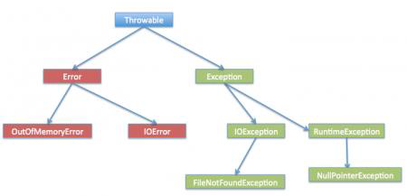

### 4. What are important methods of Java Exception Class?

Exception and all of its subclasses doesn’t provide any specific methods and all of the methods are defined in the base class Throwable.

1. String getMessage() – This method returns the message String of Throwable and the message can be provided while creating the exception through it’s constructor.

2. String getLocalizedMessage() – This method is provided so that subclasses can override it to provide locale specific message to the calling program. Throwable class implementation of this method simply use getMessage() method to return the exception message.

3. synchronized Throwable getCause() – This method returns the cause of the exception or null id the cause is unknown.

4. String toString() – This method returns the information about Throwable in String format, the returned String contains the name of Throwable class and localized message.

5. void printStackTrace() – This method prints the stack trace information to the standard error stream, this method is overloaded and we can pass PrintStream or PrintWriter as argument to write the stack trace information to the file or stream.

### 5. Explain Java 7 ARM Feature and multi-catch block?

If you are catching a lot of exceptions in a single try block, you will notice that catch block code looks very ugly and mostly consists of redundant code to log the error, keeping this in mind Java 7 one of the feature was multi-catch block where we can catch multiple exceptions in a single catch block. The catch block with this feature looks like below:

```java
catch(IOException | SQLException | Exception ex){
logger.error(ex);
throw new MyException(ex.getMessage());
}
```

Most of the time, we use finally block just to close the resources and sometimes we forget to close them and get runtime exceptions when the resources are exhausted. These exceptions are hard to debug and we might need to look into each place where we are using that type of resource to make sure we are closing it. So java 7 one of the improvement was **try-with-resources** where we can create a resource in the try statement itself and use it inside the try-catch block. When the execution comes out of try-catch block, runtime environment automatically close these resources. Sample of try-catch block with this improvement is:

```java
try (MyResource mr = new MyResource()) { System.out.println("MyResource created in try-with-resources");
} catch (Exception e) {
e.printStackTrace();
}
```

### 6. What is difference between Checked and Unchecked Exception in Java?

1. Checked Exceptions should be handled in the code using try-catch block or else main() method should use throws keyword to let JRE know about these exception that might be thrown from the program. Unchecked Exceptions are not required to be handled in the program or to mention them in throws clause.

2. Exception is the super class of all checked exceptions whereas RuntimeException is the super class of all unchecked exceptions.

3. Checked exceptions are error scenarios that are not caused by program, for example FileNotFoundException in reading a file that is not present, whereas Unchecked exceptions are mostly caused by poor programming, for example NullPointerException when invoking a method on an object reference without making sure that it’s not null.

### 7. What is difference between throw and throws keyword in Java?

throws keyword is used with method signature to declare the exceptions that the method might throw whereas throw keyword is used to disrupt the flow of program and handing over the exception object to runtime to handle it.

### 8. How to write custom exception in Java?

We can extend Exception class or any of its subclasses to create our custom exception class. The custom exception class can have its own variables and methods that we can use to pass error codes or other exception related information to the exception handler.

A simple example of custom exception is shown below.
package com.journaldev.exceptions;

```java
import java.io.IOException;
public class MyException extends IOException {
private static final long serialVersionUID = 4664456874499611218L;
private String errorCode="Unknown_Exception";
public MyException(String message, String errorCode){
super(message);
this.errorCode=errorCode;
}
public String getErrorCode(){
return this.errorCode;
}
}
```

### 9. What is OutOfMemoryError in Java?

OutOfMemoryError in Java is a subclass of java.lang.VirtualMachineError and it’s thrown by JVM when it ran out of heap memory. We can fix this error by providing more memory to run the java application through java options.
"$>java MyProgram -Xms1024m -Xmx1024m -XX:PermSize=64M -XX:MaxPermSize=256m"

### 10. What are different scenarios causing “Exception in thread main”?

Some of the common main thread exception scenarios are:

- **Exception in thread main java.lang.UnsupportedClassVersionError**: This exception comes when your java class is compiled from another JDK version and you are trying to run it from another java version.

- **Exception in thread main java.lang.NoClassDefFoundError**: There are two variants of this exception. The first one is where you provide the class full name with .class extension. The second scenario is when Class is not found.

- **Exception in thread main java.lang.NoSuchMethodError: main**: This exception comes when you are trying to run a class that doesn’t have main method.

- **Exception in thread “main” java.lang.ArithmeticException**: Whenever any exception is thrown from main method, it prints the exception is console. The first part explains that exception is thrown from main method, second part prints the exception class name and then after a colon, it prints the exception message.

### 11. What is difference between final, finally and finalize in Java?

final and finally are keywords in java whereas finalize is a method.

final keyword can be used with class variables so that they can’t be reassigned, with class to avoid extending by classes and with methods to avoid overriding by subclasses, finally keyword is used with try-catch block to provide statements that will always gets executed even if some exception arises, usually finally is used to close resources. finalize() method is executed by Garbage Collector before the object is destroyed, it’s great way to make sure all the global resources are closed.

Out of the three, only finally is related to java exception handling.

### 12. What happens when exception is thrown by main method?

When exception is thrown by main() method, Java Runtime terminates the program and print the exception message and stack trace in system console.

### 13. Can we have an empty catch block?

We can have an empty catch block but it’s the example of worst programming. We should never have empty catch block because if the exception is caught by that block, we will have no information about the exception and it wil be a nightmare to debug it. There should be at least a logging statement to log the exception details in console or log files.

### 14. Provide some Java Exception Handling Best Practices?

Some of the best practices related to Java Exception Handling are:

- Use Specific Exceptions for ease of debugging.

- Throw Exceptions Early (Fail-Fast) in the program.

- Catch Exceptions late in the program, let the caller handle the exception.

- Use Java 7 ARM feature to make sure resources are closed or use finally block to close them properly.

- Always log exception messages for debugging purposes.

- Use multi-catch block for cleaner close.

- Use custom exceptions to throw single type of exception from your application API.

- Follow naming convention, always end with Exception.

- Document the Exceptions Thrown by a method using @throws in javadoc.

- Exceptions are costly, so throw it only when it makes sense. Else you can catch them and provide null or empty response.

### 15. What is the problem with below programs and how do we fix it?

In this section, we will look into some programming questions related to java exceptions.

#### a. What is the problem with below program?

```java
package com.journaldev.exceptions;
import java.io.FileNotFoundException;
import java.io.IOException;
public class TestException {
public static void main(String[] args) {
try {
testExceptions();
} catch (FileNotFoundException | IOException e) {
e.printStackTrace();
}
}
public static void testExceptions() throws IOException, FileNotFoundException{
}
}
```

Above program won’t compile and you will get error message as “The exception FileNotFoundException is already caught by the alternative IOException”. This is because FileNotFoundException is subclass of IOException, there are two ways to solve this problem.

First way is to use single catch block for both the exceptions.

```java
try {
testExceptions();
}catch(FileNotFoundException e){
e.printStackTrace();
}catch (IOException e) {
e.printStackTrace();
}
```

Another way is to remove the FileNotFoundException from multi-catch block.

```java
try {
testExceptions();
}catch (IOException e) {
e.printStackTrace();
}
```

You can chose any of these approach based on your catch block code.

**1. What is the problem with below program?**

```java
package com.journaldev.exceptions;
import java.io.FileNotFoundException;
import java.io.IOException;
import javax.xml.bind.JAXBException;
public class TestException1 {
public static void main(String[] args) {
try {
go();
} catch (IOException e) {
e.printStackTrace();
} catch (FileNotFoundException e) {
e.printStackTrace();
} catch (JAXBException e) {
e.printStackTrace();
}
}
public static void go() throws IOException, JAXBException, FileNotFoundException{
}
}
The program won’t compile because FileNotFoundException is subclass of IOException, so the catch block of FileNotFoundException is unreachable and you will get error message as “Unreachable catch block for FileNotFoundException. It is already handled by the catch block for IOException”.
You need to fix the catch block order to solve this issue.
try {
go();
} catch (FileNotFoundException e) {
e.printStackTrace();
} catch (IOException e) {
e.printStackTrace();
} catch (JAXBException e) {
e.printStackTrace();
}
```

Notice that JAXBException is not related to IOException or FileNotFoundException and can be put anywhere in above catch block hierarchy.

**2. What is the problem with below program?**

```java
package com.journaldev.exceptions;
import java.io.IOException;
import javax.xml.bind.JAXBException;
public class TestException2 {
public static void main(String[] args) {
try {
foo();
} catch (IOException e) {
e.printStackTrace();
}catch(JAXBException e){
e.printStackTrace();
}catch(NullPointerException e){
e.printStackTrace();
}catch(Exception e){
e.printStackTrace();
}
}
public static void foo() throws IOException{
}
}
```

The program won’t compile because JAXBException is a checked exception and foo() method should throw this exception to catch in the calling method. You will get error message as “Unreachable catch block for JAXBException. This exception is never thrown from the try statement body”.

To solve this issue, you will have to remove the catch block of JAXBException.

Notice that catching NullPointerException is valid because it’s an unchecked exception.

**3. What is the problem with below program?**

```java
package com.journaldev.exceptions;
import java.io.IOException;
import javax.xml.bind.JAXBException;
public class TestException2 {
public static void main(String[] args) {
try {
foo();
} catch (IOException e) {
e.printStackTrace();
}catch(JAXBException e){
e.printStackTrace();
}catch(NullPointerException e){
e.printStackTrace();
}catch(Exception e){
e.printStackTrace();
}
}
public static void foo() throws IOException{
}
}
```

This is a trick question, there is no problem with the code and it will compile successfully. We can always catch Exception or any unchecked exception even if it’s not in the throws clause of the method.

Similarly if a method (foo) declares unchecked exception in throws clause, it is not mandatory to handle that in the program.

**4. What is the problem with below program?**

```java
package com.journaldev.exceptions;
public class TestException3 {
public static void main(String[] args) {
try{
bar();
}catch(NullPointerException e){
e.printStackTrace();
}catch(Exception e){
e.printStackTrace();
}
foo();
}
public static void bar(){
}
public static void foo() throws NullPointerException{
}
}
```

The above program won’t compile because start() method signature is not same in subclass. To fix this issue, we can either change the method signature in subclass to be exact same as superclass or we can remove throws clause from subclass method as shown below.

**5. What is the problem with below program?**

```java
package com.journaldev.exceptions;
import java.io.IOException;
public class TestException4 {
public void start() throws IOException{
}
public void foo() throws NullPointerException{
}
}
class TestException5 extends TestException4{
public void start() throws Exception{
}
public void foo() throws RuntimeException{
}
}
```

The above program won’t compile because exception object in multi-catch block is final and we can’t change its value. You will get compile time error as “The parameter e of a multi-catch block cannot be assigned”.

We have to remove the assignment of “e” to new exception object to solve this error.

## F. Java Programming Questions

### 1. What is the output of the below statements? 

```java

String s1 = "abc"; 
String s2 = "abc"; 
System.out.println("s1 == s2 is:" + s1 == s2);
```

### 2. What is the output of the below statements? 

```java
String s3 = "JournalDev";
int start = 1;
char end = 5;
System.out.println(start + end);
System.out.println(s3.substring(start, end));
```

### 3. What is the output of the below statements?

```java
HashSet shortSet = new HashSet();
for (short i = 0; i < 100; i++) {
shortSet.add(i);
shortSet.remove(i - 1);
}
System.out.println(shortSet.size());
```

### 4. What will be the boolean “flag” value to reach the finally block?

```java
try {
if (flag) {
while (true) {
}
} else {
System.exit(1);
}
} finally { System.out.println("In Finally");
}
```

### 5. What will be the output of the below statements?

```java
String str = null; 
String str1="abc"; 
System.out.println(str1.equals("abc") | str.equals(null));
```

**Java Programming Test Question 1 Answer and Explanation**

The given statements output will be “false” because in java + operator precedence is more than == operator. So the given expression will be evaluated to “s1 == s2 is:abc” == “abc” i.e. false.

**Java Programming Test Question 2 Answer and Explanation**

The given statements output will be “ourn”. First character will be automatically type caste to int. After that since in java first character index is 0, so it will start from ‘o’ and print till ‘n’. Note that in String substring function it leaves the end index.

**Java Programming Test Question 3 Answer and Explanation**

The size of the shortSet will be 100. Java Autoboxing feature has been introduced in JDK 5, so while adding the short to HashSet<Short> it will automatically convert it to Short object. Now “i-1” will be converted to int while evaluation and after that it will autoboxed to Integer object but there are no Integer object in the HashSet, so it will not remove anything from the HashSet and finally its size will be 100.

**Java Programming Test Question 4 Answer and Explanation**

The finally block will never be reached here. If flag will be TRUE, it will go into an infinite loop and if it’s false it’s exiting the JVM. So finally block will never be reached here.

**Java Programming Test Question 5 Answer and Explanation**

The given print statement will throw java.lang.NullPointerException because while evaluating the OR logical operator it will first evaluate both the literals and since str is null, .equals() method will throw exception. It’s always advisable to use short circuit logical operators i.e. “||” and “&&” which evaluates the literals values from left and since the first literal will return true, it will skip the second literal evaluation.

I hope that the above scenarios will help a bit in understanding some of the java concepts. Please try the questions before going to the solution and comment to let me know your score.

# A short into to Wrapper class in java with example :

Java Wrapper classes wrap the primitive data types, that is why it is known as wrapper classes.
Wrapper classes we commonly use :

- Integer

- Double

- Float

These classes are very much useful in converting data like converting string to any primitive data type int , double , float ect.

## How can we use wrapper class ?

String s = “49600.90”;

Let’s say we need to convert the string into decimal to perform further operations.

We can follow below steps.

1. Initialize the string or get the dynamically and store the same in string variable using getText() method.
String s1=”496000.90”

2. Declare the double variable.
double amount;

3. Convert the string to double:
amount = Double.ParseDouble(s1); // pass the string as parameter

4. Print the amount.
System.out.println(“The amount of the item is “ + amount);
Note : Please check the below sample code

# Topics Covered

- THREADING

- Collections

- EXCEPTION HANDLING

- GARBAGE COLLECTOR

- OOPS Concepts

- SERIALIZATION

- Immutable Class and String

- Basic Core Java

## THREADING

### What is a Thread?

In Java, "thread" means two different things:

- An instance of class java.lang.Thread.

- A thread of execution.

An instance of Thread is just an object. Like any other object in Java, it has variables and methods, and lives and dies on the heap. But a thread of execution is an individual process (a "lightweight" process) that has its own call stack. In Java, there is one thread per call stack—or, to think of it in reverse, one call stack per thread. Even if we don't create any new threads in our program, threads are running at back.

The main() method, that starts the whole ball rolling, runs in one thread, called the main thread. If we looked at the main call stack, we would see that main() is the first method on the stack— the method at the bottom. But as soon as you create a new thread, a new stack materializes and methods called from that thread run in a call stack that's separate from the main() call stack.

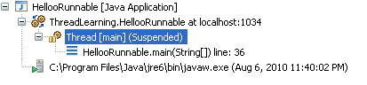

### What are the advantages or usage of threads? 

**Threads often result in simpler programs.**

• In sequential programming, updating multiple displays normally requires a big while-loop that performs small parts of each display update. Unfortunately, this loop basically simulates an operating system scheduler. In Java, each view can be assigned a thread to provide continuous updates.

• Programs that need to respond to user-initiated events can set up service routines to handle the events without having to insert code in the main routine to look for these events.

**Threads provide a high degree of control.**

• Imagine launching a complex computation that occasionally takes longer than is satisfactory. A "watchdog" thread can be activated that will "kill" the computation if it becomes costly, perhaps in favor of an alternate, approximate solution. Note that sequential programs must muddy the computation with termination code, whereas, a Java program can use thread control to non-intrusively supervise any operation.

**Threaded applications exploit parallelism.**

• A computer with multiple CPUs can literally execute multiple threads on different functional units without having to simulating multi-tasking ("time sharing").

• On some computers, one CPU handles the display while another handles computations or database accesses, thus, providing extremely fast user interface response times.

### What is difference between thread and process?

Differences between threads and processes are:-

1. Threads share the address space of the process that created it; processes have their own address.

2. Threads have direct access to the data segment of its process; processes have their own copy of the data segment of the parent process.

3. Threads can directly communicate with other threads of its process; processes must use inter-process communication to communicate with sibling processes.

4. Threads have almost no overhead; processes have considerable overhead.

5. New threads are easily created; new processes require duplication of the parent process.

6. Threads can exercise considerable control over threads of the same process; processes can only exercise control over child processes.

7. Changes to the main thread (cancellation, priority change, etc.) may affect the behavior of the other threads of the process; changes to the parent process do not affect child processes.

### What is the difference between preemptive scheduling and time slicing?

- Under preemptive scheduling, the highest priority task executes until it enters the waiting or dead states or a higher priority task comes into existence.

- Under time slicing, a task executes for a predefined slice of time and then reenters the pool of ready tasks. The scheduler then determines which task should execute next, based on priority and other factors.

### Does each thread have its own thread stack?

Yes each thread has its own call stack. For e.g. 

```java
Thread t1 = new Thread();
Thread t2 = new Thread();
Thread t3 = t1
```

In the above example t1 and t3 will have the same stack and t2 will have its own independent stack.

### What all constructors are present in the Thread class?

Thread() 
Thread(Runnable target)
Thread(Runnable target, String name) 
Thread(String name)

### Why threads block or enter into waiting state on I/O?

Threads block on I/O (i.e. enters the waiting state), so that other threads may execute while the I/O operation is performed.

### What is the initial state of a thread when it is created and started?

The thread is in ready state

### What are the different states of a thread's lifecycle?

1) **New** – When a thread is instantiated it is in **‘New state’** until the start() method is called on the thread instance. In this state the thread is not considered to be alive.

2) **Runnable** – The thread enters into this state after the start method is called in the thread instance. The thread may enter into the ‘Runnable state’ from ‘Running state’ also. In this state the thread is considered to be alive.

3) **Running** – When the thread scheduler picks up the thread from the Runnable thread’s pool, the thread starts running and the thread is said to be in ‘Running state’.

4) **Waiting/Blocked/Sleeping** – In these states the thread is said to be alive but not Runnable. The thread switches to this state because of reasons like **wait method** called or **sleep method** has been called on the running thread or thread might be **waiting for some I/O** resource so blocked.

5) **Dead** – When the thread finishes its execution i.e. the run() method execution completes, it is said to be in dead state. **A dead state can’t be started again**. If a start() method is invoked on a dead thread a runtime exception will occur.

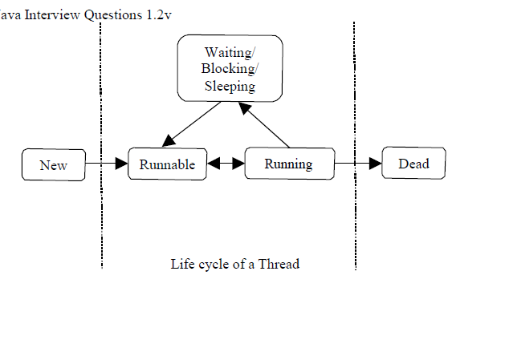

### What is synchronization?

Synchronization is a process of controlling the access of shared resources (like instance variables, static variables etc) by the multiple threads in such a manner that only one thread can access one resource at a time. In non synchronized multithreaded application, it is possible for one thread to modify a shared object while another thread is in the process of using or updating the object's value. Synchronization prevents such type of data corruption.

### Can the variables or classes be synchronized?

No. Only methods can be synchronized.

### Why would you use a synchronized block vs. synchronized method?

Synchronized blocks place locks for shorter periods (fine grained locking) than synchronized methods.

### What is the difference when the synchronized keyword is applied to a static method or to a non static method?

When a synch non static method is called a lock is obtained on the object. When a synch static method is called a lock is obtained on the class, not on the object. The lock on the object and the lock on the class don’t interfere with each other. It means, if a thread is accessing a synch non static method, then the other thread can access the synch static method but can’t access the synch non static method.

### Can a class have both synchronized and non-synchronized methods?

Yes a class can have both synchronized and non-synchronized methods.

### If a class has a synchronized method and non-synchronized method, can multiple threads execute the non-synchronized methods?

Yes, multiple threads can access the non-synchronized methods.

### Can a thread call multiple synchronized methods on the object of which it hold the lock?

Yes. Once a thread acquires a lock in some object, it may call any other synchronized method of that same object using the lock that it already holds.

### Can static methods be synchronized?

Yes. As static methods are class methods and have only one copy of static data for the class, only one lock for the entire class is required. Every class in java is represented by java.lang.Class instance. The lock on this instance is used to synchronize the static methods.

### Can two threads call two different static synchronized methods of the same class?

No. The static synchronized methods of the same class always block each other as only one lock per class exists. So no two static synchronized methods can execute at the same time.

### Does a static synchronized method block a non-static synchronized method?

No, as the thread executing the static synchronized method holds a lock on the class and the thread executing the non-static synchronized method holds the lock on the object on which the method has been called, these two locks are different and these threads do not block each other.

### What is the difference between yield() and sleep()?

- yield() allows the current the thread to release its lock from the object and scheduler gives the lock of the object to the other thread with same priority.

- sleep() allows the thread to go to sleep state for x milliseconds. When a thread goes into sleep state it **doesn’t release the lock**.

### What is the difference between wait() and sleep()?

- wait() allows thread to release the lock and goes to suspended state. The thread is only active when a notify() or notifAll() method is called for the same object. wait() is a method of Object class.

- sleep() allows the thread to go to sleep state for x milliseconds. When a thread goes into sleep state it doesn’t release the lock. sleep() is a method of Object class.

### What is difference between notify() and notfiyAll()?

- notify( ) wakes up the first thread that called wait( ) on the same object.

- notifyAll( ) wakes up all the threads that called wait( ) on the same object. The highest priority thread will run first.

### There are two classes: A and B. The class B need to inform a class A when some important event has happened. What Java technique would you use to implement it?

If these classes are threads we would consider notify() or notifyAll(). For regular classes we can use the Observer interface.

### What is the purpose of the wait(), notify(), and notifyAll() methods?

The wait(),notify(), and notifyAll() methods are used to provide an efficient way for threads to wait for a shared resource. When a thread executes an object's wait() method, it enters the waiting state. It only enters the ready state after another thread invokes the object's notify() or notifyAll() methods..

### What happens when you invoke a thread's interrupt method while it is sleeping or waiting?

When a task's interrupt() method is executed, the task enters the ready state. The next time the task enters the running state, an InterruptedException is thrown.

### What happens if a start method is not invoked and the run method is directly invoked?

If we do not call a start() method on the newly created thread instance, thread is not considered to be alive. If the start() method is not invoked and the run() method is directly called on the Thread instance, the code inside the run() method **will not run in a separate new thread** but it will start running in the existing thread.

### What is a volatile keyword?

In general each thread has its own copy of variable, such that one thread is not concerned with the value of same variable in the other thread. But sometime this may not be the case. Consider a scenario in which the count variable is holding the number of times a method is called for a given class irrespective of any thread calling, in this case irrespective of thread access the count has to be increased so the count variable is declared as volatile. The copy of volatile variable is stored in the main memory, so every time a thread access the variable even for reading purpose the local copy is updated each time from the main memory. The volatile variable also has performance issues.

### What happens when start() method is called?

A new thread of execution with a new call stack starts. The state of thread changes from new to ‘Runnable state’. When the thread gets chance to execute its target run() method starts to run.

### If code running is a thread creates a new thread what will be the initial priority of the newly created thread?

When a code running in a thread creates a new thread object, the priority of the new thread is set equal to the priority of the thread which has created it.

### Once a thread has been started can it be started again?

No. Only a thread can be started only once in its lifetime. If we try starting a thread which has been already started once, an ‘IllegalThreadStateException’ is thrown, which is a runtime exception. A thread in ‘Runnable state’ or ‘dead state’ thread can’t be restarted.

### Can the start() method of the Thread class be overridden? If yes should it be overridden?

Yes the start() method can be overridden. But it should not be overridden as its implementation in thread class has the code to create a new executable thread and is specialized.

### When JVM starts up, which thread will be started up first?

When JVM starts up the thread executing main method is started.

### What are the daemon threads?

Daemon threads are service provider threads running in the background, these not used to run the application code generally. When all user threads (non-daemon threads) complete their execution, JVM exit the application whatever may be the state of the daemon threads. JVM does not wait for the daemon threads to complete their execution if all user threads have completed their execution.

To create Daemon thread set the daemon value of Thread using setDaemon(boolean value) method. By default all the threads created by user are user thread. To check whether a thread is a Daemon thread or a user thread use isDaemon() method.

Example of the **Daemon thread is the Garbage Collector** run by JVM to reclaim the unused memory by the application. The Garbage collector code runs in a Daemon thread which terminates as all the user threads are done with their execution.

### What is an object's lock and which objects have locks?

An object's lock is a mechanism that is used by multiple threads to obtain synchronized access to the object. A thread may execute a synchronized method of an object only after it has acquired the object's lock. All objects and classes have locks. A class's lock is acquired on the class's Class object.

### How many locks does an object have?

Each object has only one lock.

### What happens when a thread cannot acquire a lock on an object?

If a thread attempts to execute a synchronized method or synchronized statement and is unable to acquire an object's lock, it enters the waiting state until the lock becomes available.

### If a thread goes to sleep does it hold the lock?

Yes, when a thread goes to sleep it does not release the lock.

### Can a thread hold multiple locks at the same time?

Yes. A thread can hold multiple locks at the same time. Once a thread acquires a lock and enters into the synchronized method/block, it may call another synchronized method and acquire a lock on another object.

### When does deadlock occur and how to avoid it?

When a locked object tries to access a locked object which is trying to access the first locked object. When the threads are waiting for each other to release the lock on a particular object, deadlock occurs.

### What is a better way of creating multithreaded application? Extending Thread class or implementing Runnable?

If a class is made to extend the thread class to have a multithreaded application then this subclass of Thread can’t extend any other class and the required application will have to be added to this class as it can not be inherited from any other class. If a class is made to implement Runnable interface, then the class can extend other class or implement other interface.

The first strategy, which employs a Runnable object, is more general, because the Runnable objects can subclass a class other than Thread. The second strategy is easier to use in simple applications, but is limited by the fact that your task class must be a descendant of Thread. The first approach is more flexible, which separates the Runnable task from the Thread object that executes the task. Not only is this approach more flexible, but it is applicable to the high-level thread management APIs.
Extending the Thread class is not a good OO practice, as we will not be able to extend other class. Hence we use this approach when we have a more specialized version of a Thread class.

### What is thread starvation?

In a multi-threaded environment thread starvation occurs if a low priority thread is not able to run or get a lock on the resource because of presence of many high priority threads. This is mainly possible by setting thread priorities inappropriately.

### What is threadLocal variable?

ThreadLocal is a class. If a variable is declared as threadLocal then each thread will have its own copy of variable and would not interfere with the other's thread copy. Typical scenario to use this would be giving JDBC connection to each thread so that there is no conflict.

**ThreadLocal class by JAVA API**

```java
public class ThreadLocal { 
    public Object get();
    public void set(Object newValue); public Object initialValue();
}
```

***Implementation of ThreadLocal**

```java
public class ConnectionDispenser {

    private static class ThreadLocalConnection extends ThreadLocal {

        public Object initialValue() {
        return DriverManager.getConnection(ConfigurationSingleton.getDbUrl());
        }
    }

    private static ThreadLocalConnection conn = new ThreadLocalConnection();

    public static Connection getConnection() {
        return (Connection) conn.get();
    }
}
```

### What is a task's priority and how is it used in scheduling?

A task's priority is an integer value that identifies the relative order in which it should be executed with respect to other tasks. The scheduler attempts to schedule higher priority tasks before lower priority tasks.

## Collections

### What is an Iterator?

- The Iterator interface is used to step through the elements of a Collection.

- Iterators let you process each element of a Collection.

- Iterators are a generic way to go through all the elements of a Collection no matter how it is organized.

- Iterator is an Interface implemented a different way for every Collection.

### How do you traverse through a collection using its Iterator?

To use an iterator to traverse through the contents of a collection, follow these steps:

- Obtain an iterator to the start of the collection by calling the collection’s iterator() method.

- Set up a loop that makes a call to hasNext(). Have the loop iterate as long as hasNext() returns
true.

- Within the loop, obtain each element by calling next().

### How do you remove elements during Iteration?

Iterator also has a method **remove()** when remove is called, the current element in the iteration is deleted.

### What is the difference between Enumeration and Iterator?

|Enumeration    |Iterator   |
|----------------|-----------|
|Enumeration doesn't have a remove() method |Iterator has a remove() method |
|Enumeration acts as Read-only interface, because it has the methods only to traverse and fetch the objects|    Can be abstract, final, native, static, or synchronized    |

**Note**: So Enumeration is used whenever we want to make Collection objects as Read-only.

### How is ListIterator?

**ListIterator** is just like Iterator, except it allows us to access the collection in either the forward or backward direction and lets us modify an element

### What is the List interface?

- The List interface provides support for ordered collections of objects.

- Lists may contain duplicate elements.

### What are the main implementations of the List interface ?

The main implementations of the List interface are as follows :

- **ArrayList** : Resizable-array implementation of the List interface. The best all-around implementation of the List interface.

- **Vector** : Synchronized resizable-array implementation of the List interface with additional "legacy methods."

- **LinkedList** : Doubly-linked list implementation of the List interface. May provide better performance than the ArrayList implementation if elements are frequently inserted or deleted within the list. Useful for queues and double-ended queues (deques).

### What are the advantages of ArrayList over arrays?

Some of the advantages ArrayList has over arrays are:

- It can grow dynamically

- It provides more powerful insertion and search mechanisms than arrays.

### Difference between ArrayList and Vector? 

|ArrayList  |Vector |
|-----------|-------|
|ArrayList is NOT synchronized by default.  |Vector List is synchronized by default.    |
|ArrayList can use only Iterator to access the Vector list can use Iterator and Enumeration elements.   |Interface to access the elements.|
|The ArrayList increases its array size by 50 percent if it runs out of room.   |A Vector defaults to doubling the size of its array if it runs out of room|
|ArrayList has no default size. |While vector has a default size of 10. |

### How to obtain Array from an ArrayList ?

Array can be obtained from an ArrayList using **toArray()** method on ArrayList.

```java
List arrayList = new ArrayList();
ObjectA a[] = arrayList.toArray();
```

### Why insertion and deletion in ArrayList is slow compared to LinkedList?

**ArrayList** internally uses and array to store the elements, when that array gets filled by inserting elements a new array of roughly 1.5 times the size of the original array is created and all the data of old array is copied to new array.

During deletion, all elements present in the array after the deleted elements have to be moved one step back to fill the space created by deletion. In linked list data is stored in nodes that have reference to the previous node and the next node so adding element is simple as creating the node an updating the next pointer on the last node and the previous pointer on the new node. Deletion in linked list is fast because it involves only updating the next pointer in the node before the deleted node and updating the previous pointer in the node after the deleted node.

### Why are Iterators returned by ArrayList called Fail Fast ?

Because, if list is structurally modified at any time after the iterator is created, in any way except through the iterator's own remove or add methods, the iterator will throw a ConcurrentModificationException. Thus, in the face of concurrent modification, the iterator fails quickly and cleanly, rather than risking arbitrary, non-deterministic behavior at an undetermined time in the future.

### How do you decide when to use ArrayList and When to use LinkedList?

If you need to support random access, without inserting or removing elements from any place other than the end, then ArrayList offers the optimal collection. If, however, you need to frequently add and remove elements from the middle of the list and only access the list elements sequentially, then LinkedList offers the better implementation.

### What is the Set interface?

- The Set interface provides methods for accessing the elements of a finite mathematical set

- Sets do not allow duplicate elements

- Contains no methods other than those inherited from Collection

- It adds the restriction that duplicate elements are prohibited

- Two Set objects are equal if they contain the same elements

### What are the main Implementations of the Set interface?

The main implementations of the List interface are as follows:

- HashSet

- TreeSet

- LinkedHashSet

- EnumSet

### What is a HashSet?

- A HashSet is an unsorted, unordered Set.

- It uses the hashcode of the object being inserted (so the more efficient your hashcode() implementation the better access performance you’ll get).

- Use this class when you want a collection with no duplicates and you don’t care about order when you iterate through it.

### What is a TreeSet?

TreeSet is a Set implementation that keeps the elements in sorted order. The elements are sorted according to the natural order of elements or by the comparator provided at creation time.

### What is an EnumSet?

An EnumSet is a specialized set for use with enum types, all of the elements in the EnumSet type that is specified, explicitly or implicitly, when the set is created.

### Difference between HashSet and TreeSet?

|HashSet    |TreeSet    |
|-----------|-----------|
|HashSet is under set interface i.e. it does not guarantee for either sorted order or sequence order.   |TreeSet is under set i.e. it provides elements in a sorted order (acceding order). |
|We can add any type of elements to hash set.   |We can add only similar types of elements to tree set. |

### What is a Map?

- A map is an object that stores associations between keys and values (key/value pairs).

- Given a key, you can find its value. Both keys and values are objects.

- The keys must be unique, but the values may be duplicated.

- Some maps can accept a null key and null values, others cannot.

### What are the main Implementations of the Map interface?

The main implementations of the List interface are as follows:

- HashMap

- HashTable

- TreeMap

- EnumMap

### What is a TreeMap?

TreeMap actually implements the SortedMap interface which extends the Map interface. In a TreeMap the data will be sorted in ascending order of keys according to the natural order for the key's class, or by the comparator provided at creation time. TreeMap is based on the Red-Black tree data structure.

### How do you decide when to use HashMap and when to use TreeMap?

For inserting, deleting, and locating elements in a Map, the HashMap offers the best alternative. If, however, you need to traverse the keys in a sorted order, then TreeMap is your better alternative. Depending upon the size of your collection, it may be faster to add elements to a HashMap, and then convert the map to a TreeMap for sorted key traversal.

### Difference between HashMap and Hashtable? HashMap Hashtable

|HashMap    |Hashtable  |
|-----------|-----------|
|HashMap lets you have null values as well as one null key. |HashTable does not allows null values as key and value.    |
|The iterator in the HashMap is fail-safe (If you change the map while iterating, you’ll know). |The enumerator for the Hashtable is not fail-safe. |
|HashMap is unsynchronized. |Hashtable is synchronized. |

**Note**: Only one NULL is allowed as a key in HashMap. HashMap does not allow multiple keys to be NULL. Nevertheless, it can have multiple NULL values.

### How does a Hashtable internally maintain the key-value pairs?

TreeMap actually implements the SortedMap interface which extends the Map interface. In a TreeMap the data will be sorted in ascending order of keys according to the natural order for the key's class, or by the comparator provided at creation time. TreeMap is based on the Red-Black tree data structure.

### What are the different Collection Views That Maps Provide?

Maps Provide Three Collection Views.

- **Key Set** - allow a map's contents to be viewed as a set of keys.

- **Values Collection** - allow a map's contents to be viewed as a set of values.

- **Entry Set** - allow a map's contents to be viewed as a set of key-value mappings.

## EXCEPTION HANDLING

### What is an Exception?

The exception is said to be thrown whenever an exceptional event occurs in java which signals that something is not correct with the code written and may give unexpected result. An exceptional event is an occurrence of condition which alters the normal program flow. Exceptional handler is the code that does something about the exception.

### What is error?

An Error indicates that a non-recoverable condition has occurred that should not be caught. Error, a subclass of Throwable, is intended for drastic problems, such as OutOfMemoryError, which would be reported by the JVM itself.

### What is StackOverflowError?

The StackOverFlowError is an ‘Error Object’ thrown by the Runtime System when it encounters that our application/code has ran out of the memory. It may occur in case of recursive methods or a large amount of data is fetched from the server and stored in some object. This error is generated by JVM.

### What is difference between Error and Exception?

An error is an irrecoverable condition occurring at runtime, such as “OutOfMemory” error. These are JVM errors and we can’t repair them at runtime. Though error can be caught in catch block but the execution of application will come to a halt and is not recoverable.
While exceptions are conditions that occur because of bad input etc. e.g. “FileNotFoundException” will be thrown if the specified file does not exist. Or a “NullPointerException” will take place if we try to use a null reference. In most of the cases it is possible to recover from an exception (probably by giving user a feedback for entering proper values etc.)

### Which is superclass of Exception?

"Throwable", the parent class of all exception related classes.

### What are the advantages of using exception handling?

Exception handling provides the following advantages over "traditional" error management techniques:

- Separating Error Handling Code from "Regular" Code.

- Propagating Errors up the Call Stack.

- Grouping Error Types and Error Differentiation.

### Exceptions are defined in which java package?

All the exceptions are subclasses of java.lang.Exception

### Explain the exception hierarchy in java.

Throwable is a parent class off all Exception classes. They are two types of Exceptions: Checked exceptions and Unchecked Exceptions. Both types of exceptions extends Exception class.

### How are the exceptions handled in java?

When an exception occur the execution of the program is transferred to an appropriate exception handler. The try-catch-finally block is used to handle the exception. The code in which the exception may occur is enclosed in a try block, also called as a guarded region. The catch clause matches a specific exception to a block of code which handles that exception. And the clean up code which needs to be executed no matter the exception occurs or not is put inside the finally block

### What are the types of Exceptions in Java

There are two types of exceptions in Java, unchecked exceptions and checked exceptions.

- **Checked exceptions**: A checked exception is some **subclass of Exception** (or Exception itself), excluding class RuntimeException and its subclasses. **Each method must either handle all checked exceptions by supplying a catch clause or list each unhandled checked exception as a thrown exception**.

- **Unchecked exceptions**: All Exceptions that **extend the RuntimeException** class are unchecked exceptions. **Class Error and its subclasses also are unchecked.**

### What is Runtime Exception or unchecked exception?

Runtime exceptions represent problems that are the result of a programming problem. Such problems include arithmetic exceptions, such as dividing by zero; pointer exceptions, such as trying to access an object through a null reference; and indexing exceptions, such as attempting to access an array element through an index that is too large or too small. Runtime exceptions need not be explicitly caught in try catch block as it can occur anywhere in a program, and in a typical one they can be very numerous.

Having to add runtime exceptions in every method declaration would reduce a program's clarity. Thus, the compiler does not require that you catch or specify runtime exceptions (although you can). The solution to rectify is to correct the programming logic where the exception has occurred or provide a check.

### What is checked exception?

Checked exception are the exceptions which forces the programmer to catch them explicitly in try- catch block. It is a subclass of Exception. Example: IOException.

### Why did the designers decide to force a method to specify all uncaught checked exceptions that can be thrown within its scope?

Any Exception that can be thrown by a method is part of the method's public programming interface. Those who call a method must know about the exceptions that a method can throw so that they can decide what to do about them. These exceptions are as much a part of that method's programming interface as its parameters and return value.

### Why Errors are not checked?

An unchecked exception classes which are the error classes (Error and its subclasses) are exempted from compile-time checking because they can occur at many points in the program and recovery from them is difficult or impossible. A program declaring such exceptions would be pointlessly.

### Why Runtime Exceptions are not checked?

The runtime exception classes (RuntimeException and its subclasses) are exempted from compile-time checking because, in the judgment of the designers of the Java programming language, having to declare such exceptions would not aid significantly in establishing the correctness of programs. Many of the operations and constructs of the Java programming language can result in runtime exceptions.
The information available to a compiler, and the level of analysis the compiler performs, are usually not sufficient to establish that such run-time exceptions cannot occur, even though this may be obvious to the programmer. Requiring such exception classes to be declared would simply be an irritation to programmers.

### Explain the significance of try-catch blocks?

Whenever the exception occurs in Java, we need a way to tell the JVM what code to execute. To do this, we use the try and catch keywords. The try is used to define a block of code in which exceptions may occur. One or more catch clauses match a specific exception to a block of code that handles it.

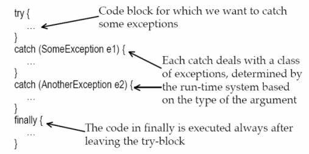

### What are the possible combinations to write try, catch finally block?

```java
OPTION1

try{
    //lines of code that may throw an exception

}catch(Exception e){
    //lines of code to handle the exception thrown in try block

}finally{
    //the clean code which is executed always no matter the exception occurs or not.
}
```

```java
OPTION2

try{
    // Any code
}finally{}
```

```java
OPTION3

try{

}catch(Exception e){
    //lines of code to handle the exception thrown in try block
}
```

The catch blocks must always follow the try block. If there are more than one catch blocks they all must follow each other without any block in between. The finally block must follow the catch block if one is present or if the catch block is absent the finally block must follow the try block.

### What is the use of finally block?

The finally block encloses code that is always executed at some point after the try block, whether an exception was thrown or not. This is right place to close files, release your network sockets, connections, and perform any other cleanup your code requires.

**Note**: If the try block executes with no exceptions, the finally block is executed immediately after the try block completes. It there was an exception thrown, the finally block executes immediately after the proper catch block completes

### What if there is a break or return statement in try block followed by finally block?

If there is a return statement in the try block, the finally block executes right after the return statement encountered, and before the return executes.

### Can we have the try block without catch block?

Yes, we can have the try block without catch block, but finally block should follow the try block.

**Note**: It is not valid to use a try clause without either a catch clause or a finally clause.

### Once the control switches to the catch block does it return back to the try block to execute the balance code?

No. Once the control jumps to the catch block it never returns to the try block but it goes to finally block (if present).

### Where is the clean up code like release of resources is put in try-catch-finally block and why? 

The code is put in a finally block because irrespective of try or catch block execution the control will flow to finally block. Typically finally block contains release of connections, closing of result set etc.

### Is it valid to have a try block without catch or finally?

NO. This will result in a compilation error. The try block must be followed by a catch or a finally block. It is legal to omit the either catch or the finally block but not both.
e.g. The following code is illegal. 

```java

try{
    int i =0;
}
int a = 2; 
System.out.println(“a = “+a);
```
### Is it valid to place some code in between try the catch/finally block that follows it?

No. There should not be any line of code present between the try and the catch/finally block. e.g. The following code is wrong.

```java
try{}
String str = “ABC”; 
System.out.println(“str = “+str); 
catch(Exception e){}
```

### What happens if the exception is never caught and throws down the method stack?

If the exception is not caught by any of the method in the method’s stack till you get to the main() method, the main method throws that exception and the JVM halts its execution.

### How do you get the descriptive information about the Exception occurred during the program execution?

All the exceptions inherit a method printStackTrace() from the Throwable class. This method prints the stack trace from where the exception occurred. It prints the most recently entered method first and continues down, printing the name of each method as it works its way down the call stack from the top.

### Can you catch more than one exception in a single catch block?

Yes. If the exception class specified in the catch clause has subclasses, any exception object that is a subclass of the specified Exception class will be caught by that single catch block.
E.g..

```java
try {
// Some code here that can throw an IOException
}
catch (IOException e) { e.printStackTrace();
}
```
The catch block above will catch IOException and all its subclasses e.g. FileNotFoundException etc.

### Why is not considered as a good practice to write a single catchall handler to catch all the exceptions?

We can write a single catch block to handle all the exceptions thrown during the program execution as follows :

```java
try {
// code that can throw exception of any possible type
}
catch (Exception e) { 
    e.printStackTrace();
}
```

If we use the Superclass Exception in the catch block then we will not get the valuable information about each of the exception thrown during the execution, though we can find out the class of the exception occurred. Also it will reduce the readability of the code as the programmer will not understand the exact reason for putting the try-catch block.

### What is exception matching?

Exception matching is the process by which the JVM finds out the matching catch block for the exception thrown from the list of catch blocks. When an exception is thrown, Java will try to find by looking at the available catch clauses in the top down manner. If it doesn't find one, it will search for a handler for a supertype of the exception. If it does not find a catch clause that matches a supertype for the exception, then the exception is propagated down the call stack. This process is called exception matching.

### What happens if the handlers for the most specific exceptions are placed below the more general exceptions handler?

Compilation fails. The catch block for handling the most specific exceptions must always be placed above the catch block written to handle the more general exceptions.
e.g. The code below will not compile.

```java
try {
    // code that can throw IOException or its subtypes
} catch (IOException e) {
    // handles IOExceptions and its subtypes
} catch (FileNotFoundException ex) {
    // handle FileNotFoundException only
}
```

The code below will compile successfully:- 

```java
try {
    // code that can throw IOException or its subtypes
} catch (FileNotFoundException ex) {
    // handles IOExceptions and its subtypes
} catch (IOException e){
    // handle FileNotFoundException only
}
```

### Does the order of the catch blocks matter if the Exceptions caught by them are not subtype or supertype of each other?

No. If the exceptions are siblings in the Exception class’s hierarchy i.e. if one Exception class is not a subtype or supertype of the other, then the order in which their handlers (catch clauses) are placed does not matter.

### What happens if a method does not throw a checked Exception directly but calls a method that does? What does 'Ducking' the exception mean?

If a method does not throw a checked Exception directly but calls a method that throws an exception then the calling method must handle the throw exception or declare the exception in its throws clause. If the calling method does not handle and declares the exception, the exception is passed to the next method in the method stack. This is called as ducking the exception down the method stack.

e.g. The code below will not compile as the getCar() method has not declared the CarNotFoundException which is thrown by the getColor () method.

```java
void getCar() { getColor();
}
void getColor () {
throw new CarNotFoundException();
}
```

Fix for the above code is

```java
void getCar() throws CarNotFoundException { getColor();
}
void getColor () {
throw new CarNotFoundException();
}
```

### Is an empty catch block legal?

Yes you can leave the catch block without writing any actual code to handle the exception caught.

### Can a catch block throw the exception caught by itself?

Yes. This is called rethrowing of the exception by catch block.

e.g. the catch block below catches the FileNotFound exception and rethrows it again.

```java
void checkEx() throws FileNotFoundException {
    try{
        //code that may throw the FileNotFoundException
    }catch(FileNotFound eFnf){ 
        throw FileNotFound();
    }
}
```

### What is throw keyword?

Throw keyword is used to throw the exception manually. It is mainly used when the program fails to satisfy the given condition and it wants to warn the application. The exception thrown should be subclass of Throwable.

```java
public void parent(){ 
    try{
        child();
    }catch(MyCustomException e){ 

    }
}

public void child{
    String iAmMandatory=null; 
    if(iAmMandatory == null){
        throw (new MyCustomException("Throwing exception using throw keyword");
    }
}
```

### What is use of throws keyword?

If the function is not capable of handling the exception then it can ask the calling method to handle it by simply putting the throws clause at the function declaration.

```java
public void parent(){ 
    try{
        child();
    }catch(MyCustomException e){ 

    }
}

public void child throws MyCustomException{
    //put some logic so that the exception occurs.
}
```

### What is the difference throw and throws?

**throws**: Used in a method's signature if a method is capable of causing an exception that it does not handle, so that callers of the method can guard themselves against that exception. If a method is declared as throwing a particular class of exceptions, then any other method that calls it must either have a try-catch clause to handle that exception or must be declared to throw that exception (or its superclass) itself.

A method that does not handle an exception it throws has to announce this:

```java
public void myfunc(int arg) throws MyException {
    …
}
```

**throw**: Used to trigger an exception. The exception will be caught by the nearest try-catch clause that can catch that type of exception. The flow of execution stops immediately after the throw statement; any subsequent statements are not executed.

To throw an user-defined exception within a block, we use the throw command:

```java
throw new MyException("I always wanted to throw an exception!");
```

### How to create custom exceptions?

A. By extending the Exception class or one of its subclasses.

**Example:**

```java
class MyException extends Exception {
    public MyException() {
         super(); 
    }

    public MyException(String s) {
         super(s); 
    }
}
```

As shown above in example we can easily create our own exception by extending the Exception class or any of its subclasses. Some other examples are:-

```java
1 class New1Exception extends Exception { } // this will create Checked Exception 

2 class NewException extends IOExcpetion { } // this will create Checked exception

3 class NewException extends NullPonterExcpetion { } // this will create UnChecked exception
```

### What are the different ways to handle exceptions?

There are two ways to handle exceptions:

- Wrapping the desired code in a try block followed by a catch block to catch the exceptions.

- List the desired exceptions in the throws clause of the method and let the caller of the method handle those exceptions.

### What is difference between ‘ClassNotFoundException’ and ‘NoClassDefFoundError’? 

ClassNotFoundException is thrown when the reported class is not found by the ClassLoader in the CLASSPATH. It could also mean that the class in question is trying to be loaded from another class which was loaded in a parent classloader and hence the class from the child classloader is not visible.

Consider if NoClassDefFoundError occurs for “src/com/TestClass” it does not mean that TestClass class is not in the CLASSPATH. It means that the class TestClass was found by the ClassLoader however when trying to load the class, it ran into an error reading the class definition. This typically happens when the class in question has static blocks or members which use a Class that's not found by the ClassLoader. So to find the culprit, view the source of the class in question (TestClass in this case) and look for code using static blocks or static members.

### Can static block throw exception?

Yes, static block can throw **only Runtime exception** or can use a try-catch block to catch checked exception.

Typically scenario will be if JDBC connection is created in static block and it fails then exception can be caught, logged and application can exit. If System.exit() is not done, then application may continue and next time if the class is referred JVM will throw NoClassDefFounderror since the class was not loaded by the Classloader.

## GARBAGE COLLECTOR

### Explain garbage collection?

Garbage collection is one of the most important feature of Java. Garbage collection is also called automatic memory management as JVM automatically removes the unused variables/objects (value is null) from the memory. User program can't directly free the object from memory; instead it is the job of the garbage collector to automatically free the objects that are no longer referenced by a program. Every class inherits **finalize()** method from **java.lang.Object**, the finalize() method is called by garbage collector when it determines no more references to the object exists. In Java, it is good idea to explicitly assign **null** into a variable when no more in use.

### What is the responsibility of Garbage Collector?

Garbage collector frees the memory occupied by the unreachable objects during the java program by deleting these unreachable objects. It ensures that the available memory will be used efficiently, but does not guarantee that there will be sufficient memory for the program to run.

### Describe, in general, how java's garbage collector works?

The Java runtime environment deletes objects when it determines that they are no longer being used. This process is known as garbage collection.

The Java runtime environment supports a garbage collector that periodically frees the memory used by objects that are no longer needed. The Java garbage collector is a **mark-sweep garbage collector** that scans Java's dynamic memory areas for objects, marking those that are referenced. After all possible paths to objects are investigated, those objects that are not marked (i.e. are not referenced) are known to be garbage and are collected.

### Does garbage collection guarantee that a program will not run out of memory?

Garbage collection does not guarantee that a program will not run out of memory. It is possible for programs to use up memory resources faster than they are garbage collected. It is also possible for programs to create objects that are not subject to garbage collection

### Is garbage collector a dameon thread?

Yes garbage collector is a dameon thread. A dameon thread runs behind the application. It is started by JVM. The thread stops when all non-dameon threads stop.

### Garbage Collector is controlled by whom?

The JVM controls the Garbage Collector; it decides when to run the Garbage Collector. JVM runs the Garbage Collector when it realizes that the memory is running low, but this behavior of JVM can’t be guaranteed.

One can request the Garbage Collection to happen from within the java program but there is no guarantee that this request will be taken care of by JVM.

### Which part of the memory is involved in Garbage Collection? Stack or Heap?

Heap

### When does an object become eligible for garbage collection?

An object becomes eligible for Garbage Collection when no live thread can access it. Or an object is subject to garbage collection when it becomes unreachable to the program in which it is used.

### Can an object be garbage collected while it is still reachable?

No. A reachable object cannot be garbage collected. Only unreachable objects may be garbage collected.

### If an object is garbage collected, can it become reachable again?

No. Once an object is garbage collected, it ceases to exist. It can no longer become reachable again.

### Can an unreachable object become reachable again?

An unreachable object may become reachable again. This can happen when the object's finalize() method is invoked and the object performs an operation which causes it to become accessible to reachable objects.

### What are the different ways to make an object eligible for Garbage Collection when it is no longer needed?

1. **Set all available object references to null** once the purpose of creating the object has been served:

```java
public class GarbageCollnTest1 { 

    public static void main (String [] args){
        String str = "Set the object ref to null";
        //String object referenced by variable str is not eligible for GC yet
        str = null;
        /*String object referenced by variable str becomes eligible for GC */
    }
}
```

2. **Make the reference variable to refer to another object** : Decouple the reference variable from the object and set it refer to another object, so the object which it was referring to before reassigning is eligible for Garbage Collection.

```java
publc class GarbageCollnTest2 { 
    public static void main(String [] args){
        String str1 = "Garbage collected after use"; String str2 = "Another String"; System.out.println(str1);
        //String object referred by str1 is not eligible for GC yet
        str1 = str2;
        /* Now the str1 variable referes to the String object "Another String" and the object "Garbage collected after use" is not referred by any variable and hence is eligible for GC */
    }
}
```

3) **Creating Islands of Isolation**: If you have two instance reference variables which are referring to the instances of the same class, and these two reference variables refer to each other and the objects referred by these reference variables do not have any other valid reference then these two objects are said to form an Island of Isolation and are eligible for Garbage Collection.

```java
public class GCTest3 { 
    
    GCTest3 g;
    
    public static void main(String [] str){ 
        GCTest3 gc1 = new GCTest3(); 
        GCTest3 gc2 = new GCTest3(); 
        gc1.g = gc2; //gc1 refers to gc2
        gc2.g = gc1; //gc2 refers to gc1 gc1 = null;
        gc2 = null;
        //gc1 and gc2 refer to each other and have no other valid //references
        
        //gc1 and gc2 form Island of Isolation
        
        //gc1 and gc2 are eligible for Garbage collection here
    }
}
```

### Can the Garbage Collection be forced by any means?

No. The Garbage Collection can not be forced, though there are few ways by which it can be requested there is no guarantee that these requests will be taken care of by JVM.

### How can the Garbage Collection be requested?
There are two ways in which we can request the JVM to execute the Garbage Collection.

- The methods to perform the garbage collections are present in the Runtime class provided by java. The Runtime class is a Singleton for each java main program. The method **getRuntime()** returns a singleton instance of the Runtime class. The method **gc()** can be invoked using this instance of Runtime to request the garbage collection.

- Call the System class **System.gc()** method which will request the JVM to perform garbage collection.

### What is the purpose of finalization?

The purpose of finalization is to give an unreachable object the opportunity to perform any cleanup processing before the object is garbage collected.

### Can an object's finalize() method be invoked while it is reachable?

An object's finalize() method cannot be invoked by the garbage collector while the object is still reachable. However, an object's finalize() method may be invoked by other objects.

### How many times may an object's finalize() method be invoked by the garbage collector?

An object's finalize() method may only be invoked once by the garbage collector.

### Under what conditions is an object's finalize() method invoked by the garbage collector?

The garbage collector invokes an object's finalize() method when it detects that the object has become unreachable.

### Does Java have destructors?

No garbage collector does this job working in the background.

### What is the difference between final, finally and finalize? What do you understand by the java final keyword?

**final** - declare constant

**finally** - handles exception

**finalize** - helps in garbage collection

Variables defined in an interface are implicitly final. A final class can’t be extended i.e., final class may not be sub-classed. This is done for security reasons with basic classes like String and Integer. It also allows the compiler to make some optimizations, and makes thread safety a little easier to achieve. A final method can’t be overridden when its class is inherited. We can’t change value of a final variable (is a constant).

finalize() method is used just before an object is destroyed and garbage collected.

finally, a key word used in exception handling and will be executed whether or not an exception is thrown. For example, closing of open connections is done in the finally method.

### What is the purpose of overriding finalize() method?

The finalize() method should be overridden for an object to include the clean up code or to dispose of the system resources that should to be done before the object is garbage collected.

### Can we call finalize() method

Yes. Nobody will stop us to call any method , if it is accessible in our class. But a garbage collector cannot call an object's finalize method if that object is reachable.

### If an object becomes eligible for Garbage Collection and its finalize() method has been called and inside this method the object becomes accessible by a live thread of execution and is not garbage collected. Later at some point the same object becomes eligible for Garbage collection, will the finalize() method be called again?

No

### How many times does the garbage collector calls the finalize() method for an object?

Only once.

### What happens if an uncaught exception is thrown from during the execution of the finalize() method of an object?

The exception will be ignored and the garbage collection (finalization) of that object terminates.

### How to enable/disable call of finalize() method of exit of the application

**Runtime.getRuntime().runFinalizersOnExit(boolean value)**. Passing the boolean value will either disable or enable the finalize() call.

### What are the different types of references in java?

Java has a more expressive system of reference than most other garbage-collected programming languages, which allows for special behavior for garbage collection. **A normal reference in Java is known as a strong reference**. The java.lang.ref package defines **three other types of references— soft, weak, and phantom** references. Each type of reference is designed for a specific use.

A **SoftReference** can be used to implement a **cache**. An object that is not reachable by a strong reference (that is, not strongly reachable), but is referenced by a soft reference is called softly reachable. A softly reachable object may be garbage collected at the discretion of the garbage collector. This generally means that softly reachable objects will only be garbage collected when free memory is low, but again, it is at the discretion of the garbage collector. Semantically, a soft reference means **"keep this object unless the memory is needed."**

A **WeakReference** is used to implement **weak maps**. An object that is not strongly or softly reachable, but is referenced by a weak reference is called weakly reachable. A weakly reachable object will be garbage collected during the next collection cycle. This behavior is used in the class **java.util.WeakHashMap**. A weak map allows the programmer to put key/value pairs in the map and not worry about the objects taking up memory when the key is no longer reachable anywhere else.
Another possible application of weak references is the string intern pool. Semantically, a weak reference means **"get rid of this object when nothing else references it."**

A **PhantomReference** is used to reference objects that have been marked for garbage collection and have been **finalized, but have not yet been reclaimed**. An object that is not strongly, softly or weakly reachable, but is referenced by a phantom reference is called phantom reachable. This allows for more flexible cleanup than is possible with the finalization mechanism alone. Semantically, a phantom reference means **"this object is no longer needed and has been finalized in preparation for being collected."**

### Does JVM maintain a cache by itself? Does the JVM allocate objects in heap? Is this the OS heap or the heap maintained by the JVM? Why

Yes, the JVM maintains a cache by itself. It creates the Objects on the HEAP, but references to those objects are on the STACK.

### What is phantom memory?

Phantom memory is false memory. Memory, that does not exist in reality.

### How to change the heap size of a JVM?

The old generation's default heap size can be overridden by using the -Xms and -Xmx switches to specify the initial and maximum sizes respectively:

```java
java -Xms \<initial size\> -Xmx <maximum size> program For 
```

example:

```java
java -Xms64m -Xmx128m program
```

### What is memory leak?

A memory leak is where an unreferenced object that will never be used again still hangs around in memory and doesn’t get garbage collected.

### How can you minimize the need of garbage collection and make the memory use more effective?

Use object pooling and weak object references.

## OOPS Concepts

### What are the principle concepts of OOPS?

There are four principle concepts upon which object oriented design and programming rest. They are:

- Abstraction

- Polymorphism

- Inheritance

- Encapsulation (i.e. easily remembered as A-PIE).

### What is Abstraction?

Abstraction refers to the act of representing essential features without including the background details or explanations.

### What is Encapsulation?

Encapsulation is a technique used for hiding the properties and behaviors of an object and allowing outside access only as appropriate. It prevents other objects from directly altering or accessing the properties or methods of the encapsulated object.

In other words we can, Encapsulation is a process of binding or wrapping the data and the codes that operates on the data into a single entity. This keeps the data safe from outside interface and misuse. One way to think about encapsulation is as a protective wrapper that prevents code and data from being arbitrarily accessed by other code defined outside the wrapper.

### What is data encapsulation?

Encapsulation may be used by creating ‘get’ and ’set’ methods in a class (JAVABEAN) which are used to access the fields of the object. Typically the fields are made private while the get and set methods are public. Encapsulation can be used to validate the data that is to be stored, to do calculations on data that is stored in a field or fields, or for use in introspection (often the case when using javabeans in Struts, for instance). **Wrapping of data and function into a single unit is called as data encapsulation**. Encapsulation is nothing but wrapping up the data and associated methods into a single unit in such a way that data can be accessed with the help of associated methods. Encapsulation provides data security. It is nothing but data hiding.

### What is the difference between abstraction and encapsulation?

***Abstraction** focuses on the outside view of an object (i.e. the interface) Encapsulation (information hiding) prevents clients from seeing it’s inside view, where the behavior of the abstraction is implemented.

**Abstraction** solves the problem in the design side, while **Encapsulation** is the Implementation. **Encapsulation** is the deliverables of Abstraction. Encapsulation barely talks about grouping up your abstraction to suit the developer needs.

### What is Inheritance?

Inheritance is the process by which objects of one class acquire the properties of objects of another class. A class that is inherited is called a superclass. The class that does the inheriting is called a subclass. Inheritance is done by using the keyword extends.

The two most common reasons to use inheritance are:
- To promote code reuse

- To use polymorphism

### What are some alternatives to inheritance?

Delegation is an alternative to inheritance. Delegation means that you include an instance of another class as an instance variable, and forward messages to the instance. It is often safer than inheritance because it forces you to think about each message you forward, because the instance is of a known class, rather than a new class, and because it doesn’t force you to accept all the methods of the super class: you can provide only the methods that really make sense. On the other hand, it makes you write more code, and it is harder to re-use (because it is not a subclass).

### What is Polymorphism?

Polymorphism is briefly described as "one interface, many implementations." The meaning of Polymorphism is something like one name many forms. Polymorphism is a characteristic of being able to assign a different meaning or usage to something in different contexts - specifically, to allow an entity such as a variable, a function, or an object to have more than one form.

### How does Java implement polymorphism?

(Inheritance, Overloading and Overriding are used to achieve Polymorphism in java). Polymorphism manifests itself in Java in the form of multiple methods having the same name.

In some cases, multiple methods have the same name, but different formal argument lists (overloaded methods).

In other cases, multiple methods have the same name, same return type, and same formal argument list (overridden methods).

### Explain the different forms of Polymorphism.

There are two types of polymorphism one is **Compile time polymorphism** and the other is run time polymorphism. Compile time polymorphism is method overloading. **Runtime time polymorphism** is done using inheritance and interface.

**Note**: From a practical programming viewpoint, polymorphism manifests itself in three distinct forms in Java:

- Method overloading

- Method overriding through inheritance

- Method overriding through the Java interface

### What is runtime polymorphism or dynamic method dispatch?

In Java, runtime polymorphism or dynamic method dispatch is a process in which a call to an overridden method is resolved at runtime rather than at compile-time. In this process, an overridden method is called through the reference variable of a superclass. The determination of the method to be called is based on the **object being referred** to by the reference

### What is Dynamic Binding?

Binding refers to the linking of a procedure call to the code to be executed in response to the call. Dynamic binding (also known as late binding) means that the code associated with a given procedure call is not known until the time of the call at run-time. It is associated with polymorphism and inheritance.

### What is method overloading?

Method Overloading means to have two or more methods with same name in the same class with different arguments. The benefit of method overloading is that it allows you to implement methods that support the same semantic operation but differ by argument number or type.

**Note:*

- Overloaded methods MUST change the argument list

- Overloaded methods CAN change the return type

- Overloaded methods CAN change the access modifier

- Overloaded methods CAN declare new or broader checked exceptions

- A method can be overloaded in the same class or in a subclass

### What is method overriding?

Method overriding occurs when sub class declares a method that has the same type arguments as a method declared by one of its superclass. The key benefit of overriding is the ability to define behavior that’s specific to a particular subclass type.

**Note**:

- The overriding method cannot have a more restrictive access modifier than the method being overridden (Ex: You can’t override a method marked public and make it protected).

- You cannot override a method marked final

- You cannot override a method marked static

### What are the differences between method overloading and method overriding?

|   |Overloaded Method  |Overridden Method  |
|---|-------------------|-------------------|
|Arguments  |Must change    |Must not change    |
|Return type    |Can change |Can’t change except for covariant returns  |
|Exceptions |Can change |Can reduce or eliminate. Must not throw new or broader checked exceptions  |
|Access |Can change |Must not make more restrictive (can be less restrictive)   |
|Invocation |   Reference type determines which overloaded version is selected. Happens at compile time.    |Object type determines which method is selected. Happens at runtime.   |

### Can overloaded methods be override too?

Yes, derived classes still can override the overloaded methods. Polymorphism can still happen. Compiler will not binding the method calls since it is overloaded, because it might be overridden now or in the future.

### Is it possible to override the main method?

NO, because main is a static method. A static method can't be overridden in Java.

### How to invoke a superclass version of an Overridden method?

To invoke a superclass method that has been overridden in a subclass, you must either call the method directly through a superclass instance, or use the super prefix in the subclass itself. From the point of the view of the subclass, the super prefix provides an explicit reference to the superclass' implementation of the method.

```java
// From subclass
super.overriddenMethod();
```

### What is super?

super is a keyword which is used to access the method or member variables from the superclass. If a method hides one of the member variables in its superclass, the method can refer to the hidden variable through the use of the super keyword. In the same way, if a method overrides one of the methods in its superclass, the method can invoke the overridden method through the use of the super keyword.

**Note**:

- You can only go back one level.

- In the constructor, if you use super(), it must be the very first code, and you cannot access any this.xxx variables or methods to compute its parameters.

### How do you prevent a method from being overridden?

To prevent a specific method from being overridden in a subclass, use the final modifier on the method declaration, which means "this is the final implementation of this method", the end of its inheritance hierarchy.

### What is an Interface?

An interface is a description of a set of methods that conforming implementing classes must have.

**Note**:
- You can’t mark an interface as final.

- Interface variables must be static.

- An Interface cannot extend anything but another interfaces.

### Can we instantiate an interface?

You can’t instantiate an interface directly, but you can instantiate a class that implements an interface.

### Can we create an object for an interface?

Yes, it is always necessary to create an object implementation for an interface. Interfaces cannot be instantiated in their own right, so you must write a class that implements the interface and fulfill all the methods defined in it.

### Do interfaces have member variables?

Interfaces may have member variables, but these are implicitly public, static, and final- in other words, interfaces can declare only constants, not instance variables that are available to all implementations and may be used as key references for method arguments for example.
What modifiers are allowed for methods in an Interface?
Only public and abstract modifiers are allowed for methods in interfaces.

### What is a marker interface?

Marker interfaces are those which do not declare any required methods, but signify their compatibility with certain operations. The java.io.Serializable interface and Cloneable are typical marker interfaces. These do not contain any methods, but classes must implement this interface in order to be serialized and de-serialized.

### What is an abstract class?

Abstract classes are classes that contain one or more abstract methods. An abstract method is a method that is declared, but contains no implementation.

**Note**:

- If even a single method is abstract, the whole class must be declared abstract.

- Abstract classes may not be instantiated, and require subclasses to provide implementations for the abstract methods.

- You can’t mark a class as both abstract and final.

### Can we instantiate an abstract class?

An abstract class can never be instantiated. Its sole purpose is to be extended (subclassed).

### What are the differences between Interface and Abstract class? 

|Abstract Class |Interfaces |
|---------------|-----------|
|An abstract class can provide complete, default code and/or just the details that have to be overridden.   |An interface cannot provide any code at all,just the signature.    |
|In case of abstract class, a class may extend only one abstract class. |A Class may implement several interfaces.  |
|An abstract class can have non-abstract methods.   |All methods of an Interface are abstract.  |
|An abstract class can have instance variables. |An Interface cannot have instance variables.   |
|An abstract class can have any visibility: public, private, protected. |An Interface visibility must be public (or) none.  |
|If we add a new method to an abstract class then we have the option of providing default implementation and therefore all the existing code might work properly. |If we add a new method to an Interface then we have to track down all the implementations of the interface and define implementation for the new method.    |
|An abstract class can contain constructors.   |An Interface cannot contain constructors.   |
|Abstract classes are fast. |   Interfaces are slow as it requires extra indirection to find corresponding method in the actual class.  |

### When should I use abstract classes and when should I use interfaces? 

Use Interfaces when…

- You see that something in your design will change frequently.

- If various implementations only share method signatures then it is better to use Interfaces.

- you need some classes to use some methods which you don't want to be included in the class, then you go for the interface, which makes it easy to just implement and make use of the methods defined in the interface.
Use Abstract Class when…

- If various implementations are of the same kind and use common behavior or status then abstract class is better to use.

- When you want to provide a generalized form of abstraction and leave the implementation task with the inheriting subclass.

- Abstract classes are an excellent way to create planned inheritance hierarchies. They're also a good choice for nonleaf classes in class hierarchies.

### When you declare a method as abstract, can other nonabstract methods access it?

Yes, other nonabstract methods can access a method that you declare as abstract.

### Can there be an abstract class with no abstract methods in it?

Yes, there can be an abstract class without abstract methods.

## SERIALIZATION

### What is Serialization?

Serialization is a mechanism by which we can save the state of an object by converting it to a byte stream. When an object has to be transferred over a network (typically through rmi or EJB) or persist the state of an object to a file, the object Class needs to implement Serializable interface. Implementing this interface will allow the object converted into bytestream and transfer over a network.

### What is the need of Serialization?

The serialization is used:-

- To send state of one or more object’s state over the network through a socket.

- To save the state of an object in a file.

- An object’s state needs to be manipulated as a stream of bytes

### How do I serialize an object to a file?

The class whose instances are to be serialized should implement an interface Serializable. Then we pass the instance to the ObjectOutputStream which is connected to a FileOutputStream. This will save the object to a file.

### Do we need to implement any method of Serializable interface to make an object Serializable?

No. Serializable is a Marker Interface. It does not have any methods.

### Other than Serialization what are the different approach to make object Serializable?

Besides the Serializable interface, at least three alternate approaches can serialize Java objects:

- For object serialization, instead of implementing the Serializable interface, a developer can implement the Externalizable interface, which extends Serializable. By implementing Externalizable, a developer is responsible for implementing the writeExternal() and readExternal() methods. As a result, a developer has sole control over reading and writing the serialized objects.

- XML serialization is an often-used approach for data interchange. This approach lags runtime performance when compared with Java serialization, both in terms of the size of the object and the processing time. With a speedier XML parser, the performance gap with respect to the processing time narrows. Nonetheless, XML serialization provides a more malleable solution when faced with changes in the serializable object.

- Finally, consider a "roll-your-own" serialization approach. We can write an object's content directly via either the ObjectOutputStream or the DataOutputStream. While this approach is more involved in its initial implementation, it offers the greatest flexibility and extensibility. In addition, this approach provides a performance advantage over Java serialization.

### When we serialize an object, what happens to the object references included in the object?

The serialization mechanism generates an **object graph for serialization**. Thus it determines whether the included object references are Serializable or not. This is a recursive process. Thus when an object is serialized, all the included objects are also serialized along with the original object.

### What happens if the object to be serialized includes the references to other Serializable objects? 

If the object to be serialized includes the references to other objects whose class implements Serializable then all those object’s state also will be saved as the part of the serialized state of the object in question. The whole object graph of the object to be serialized will be saved during serialization automatically provided all the objects included in the object’s graph are Serializable.

### What happens if an object is Serializable but it includes a reference to a non-Serializable object? 

If you try to serialize an object of a class which implements Serializable, but the object includes a reference to a non-Serializable class then a **‘NotSerializableException’** will be thrown at runtime.

```java
e.g.
public class NonSerial {
    //This is a non-serializable class
}
public class MyClass implements Serializable{

     private static final long serialVersionUID = 1L; private NonSerial nonSerial; MyClass(NonSerial nonSerial){

        this.nonSerial = nonSerial;
    }
    public static void main(String [] args) { 

        NonSerial nonSer = new NonSerial(); 
        MyClass c = new MyClass(nonSer); 
        try {
            FileOutputStream fs = new FileOutputStream("test1.ser"); 
            ObjectOutputStream os = new ObjectOutputStream(fs); 
            os.writeObject(c);
            os.close();
        } catch (Exception e) {
            e.printStackTrace(); 
        } 
        try {
            FileInputStream fis = new FileInputStream("test1.ser"); 
            ObjectInputStream ois = new ObjectInputStream(fis); 
            c = (MyClass) ois.readObject();
            ois.close();
        } catch (Exception e) {
             e.printStackTrace();
        }
    }
}
```

```java
On execution of above code following exception will be thrown – 
java.io.NotSerializableException: NonSerial
at java.io.ObjectOutputStream.writeObject0(ObjectOutputStream.java)
```

### What one should take care of while serializing the object?

One should make sure that all the included objects are also serializable. If any of the objects is not serializable then it throws a NotSerializableException.
Are the static variables saved as the part of serialization?
No. The static variables belong to the class and not to an object they are not the part of the state of the object so they are not saved as the part of serialized object.

### What is a transient variable?

These variables are not included in the process of serialization and are not the part of the object’s serialized state. Transient variable can't be serialize. For example if a variable is declared as transient in a Serializable class and the class is written to an ObjectStream, the value of the variable can't be written to the stream instead when the class is retrieved from the ObjectStream the value of the variable becomes null

### What will be the value of transient variable after de-serialization?

It’s default value.
e.g. if the transient variable in question is an int, it’s value after deserialization will be zero.

```java
public class TestTransientVal implements Serializable{

    private static final long serialVersionUID = -22L; 
    private String name;
    transient private int age; 
    TestTransientVal(int age, String name) {
        this.age = age; this.name = name;
    }
    public static void main(String [] args) {
        TestTransientVal c = new TestTransientVal(1,"ONE");
        System.out.println("Before serialization: - " + c.name + " "+ c.age); try {
        FileOutputStream fs = new FileOutputStream("testTransients.ser"); 
        ObjectOutputStream os = new ObjectOutputStream(fs); 
        os.writeObject(c);
        os.close();
    } catch (Exception e) {
        e.printStackTrace(); 
    }
    try {
        FileInputStream fis = new FileInputStream("testTransients.ser"); 
        ObjectInputStream ois = new ObjectInputStream(fis);
        c = (TestTransientVal) ois.readObject(); 
        ois.close();
    } catch (Exception e) {
        e.printStackTrace(); 
    }
    System.out.println("After de-serialization:- " + c.name + " "+ c.age);
    }
}
```

```java
Result of executing above piece of code –

Before serialization: - Value of non-transient variable ONE Value of transient variable 1 

After de-serialization:- Value of non-transient variable ONE Value of transient variable 0

Explanation –

The transient variable is not saved as the part of the state of the serailized variable, it’s value after de- serialization is it’s default value.
```

### Does the order in which the value of the transient variables and the state of the object using the defaultWriteObject() method are saved during serialization matter?

Yes. As while restoring the object’s state the transient variables and the serializable variables that are stored must be restored in the same order in which they were saved.

### How can one customize the Serialization process? Or What is the purpose of implementing the writeObject() and readObject() method?

When we want to store the transient variables state as a part of the serialized object at the time of serialization the class must implement the following methods –

```java
private void wrtiteObject(ObjectOutputStream outStream)
{
    //code to save the transient variables state as a part of serialized object
}
private void readObject(ObjectInputStream inStream)
{
    //code to read the transient variables state and assign it to the de-serialized object
}
```

e.g.

```java
public class TestCustomizedSerialization implements Serializable{
    private static final long serialVersionUID =-22L;
    private String noOfSerVar; 
    transient private int noOfTranVar;
    TestCustomizedSerialization(int noOfTranVar, String noOfSerVar) {   
        this.noOfTranVar = noOfTranVar;
        this.noOfSerVar = noOfSerVar;
    }
    private void writeObject(ObjectOutputStream os) { 
        try {
            os.defaultWriteObject(); 
            os.writeInt(noOfTranVar);
        } catch (Exception e) {
             e.printStackTrace(); 
        }
    }
    private void readObject(ObjectInputStream is) { 
        try {
            is.defaultReadObject();
            int noOfTransients = (is.readInt());
        } catch (Exception e) { 
            e.printStackTrace(); 
        }
    }
    public int getNoOfTranVar() { 
        return noOfTranVar;
    }
}
```

The value of transient variable ‘noOfTranVar’ is saved as part of the serialized object manually by implementing writeObject() and restored by implementing readObject().
The normal serializable variables are saved and restored by calling defaultWriteObject() and defaultReadObject()respectively. These methods perform the normal serialization and de-sirialization process for the object to be saved or restored respectively.

### If a class is Serializable but its superclass in not , what will be the state of the instance variables inherited from super class after deserialization?

The values of the instance variables inherited from superclass will be reset to the values they were given during the original construction of the object as the non-serializable super-class constructor will run.

E.g.

```java
public class ParentNonSerializable { 
    int noOfWheels;
    ParentNonSerializable(){
        this.noOfWheels = 4;
    }
}
```

```java
public class ChildSerializable extends ParentNonSerializable implements Serializable {
    private static final long serialVersionUID = 1L; 
    String color;
    ChildSerializable() {
         this.noOfWheels = 8; 
         this.color = "blue";
    }
}
```

```java
Krishna Agrawal
public class SubSerialSuperNotSerial { 
    public static void main(String [] args) {
        ChildSerializable c = new ChildSerializable(); System.out.println("Before : - " + c.noOfWheels + " "+ c.color); 
        try {
            FileOutputStream fs = new FileOutputStream("superNotSerail.ser"); 
            ObjectOutputStream os = new ObjectOutputStream(fs); 
            os.writeObject(c);
            os.close();
        } catch (Exception e) {
             e.printStackTrace(); 
        }
        try {
            FileInputStream fis = new FileInputStream("superNotSerail.ser"); 
            ObjectInputStream ois = new ObjectInputStream(fis);
            c = (ChildSerializable) ois.readObject(); 
            ois.close();
        } catch (Exception e) {
             e.printStackTrace(); 
        } 
        System.out.println("After :- " + c.noOfWheels + " "+ c.color);
    }
}

Result on executing above code – 

Before : - 8 blue

After :- 4 blue
```

The instance variable ‘noOfWheels’ is inherited from superclass which is not serializable. Therefore while restoring it the non-serializable superclass constructor runs and its value is set to 8 and is not same as the value saved during serialization which is 4

### To serialize an array or a collection all the members of it must be Serializable. True /False?

True

### What is Externalizable?

Externalizable is an Interface that extends Serializable Interface. And sends data into Streams in Compressed Format. It has two methods, writeExternal(ObjectOuput out) and readExternal(ObjectInput in)

### What is use of serialVersionUID?

During object serialization, the default Java serialization mechanism writes the metadata about the object, which includes the class name, field names and types, and superclass. This class definition is stored as a part of the serialized object. This stored metadata enables the deserialization process to reconstitute the objects and map the stream data into the class attributes with the appropriate type Everytime an object is serialized the java serialization mechanism automatically computes a hash value. ObjectStreamClass's computeSerialVersionUID() method passes the class name, sorted member names, modifiers, and interfaces to the secure hash algorithm (SHA), which returns a hash value.The serialVersionUID is also called suid.

So when the serilaize object is retrieved , the JVM first evaluates the suid of the serialized class and compares the suid value with the one of the object. If the suid values match then the object is said to be compatible with the class and hence it is de-serialized. If not InvalidClassException exception is thrown.

Changes to a serializable class can be compatible or incompatible. Following is the list of changes which are compatible:

- Add fields

- Change a field from static to non-static

- Change a field from transient to non-transient

- Add classes to the object tree 

List of incompatible changes:

- Delete fields

- Change class hierarchy

- Change non-static to static

- Change non-transient to transient

- Change type of a primitive field

So, if no suid is present , inspite of making compatible changes, jvm generates new suid thus resulting in an exception if prior release version object is used .

The only way to get rid of the exception is to recompile and deploy the application again.

If we explicitly metion the suid using the statement:

```java
private final static long serialVersionUID = <integer value>
```

then if any of the metioned compatible changes are made the class need not to be recompiled. But for incompatible changes there is no other way than to compile again.

## Immutable Class and String

### What is an immutable class?

Immutable class is a class which once created; its contents can not be changed. Immutable objects are the objects whose state can not be changed once constructed. e.g. String class

### How to create an immutable class?

To create an immutable class following steps should be followed:

1. Create a final class.

2. Set the values of properties using constructor only.

3. Make the properties of the class final and private.

4. Do not provide any setters for these properties.

5. If the instance fields include references to mutable objects, don't allow those objects to be changed:
    1. Don't provide methods that modify the mutable objects.
    
    2. Don't share references to the mutable objects. Never store references to external, mutable objects passed to the constructor; if necessary, create copies, and store references to the copies. Similarly, create copies of your internal mutable objects when necessary to avoid returning the originals in your methods.

Example:-
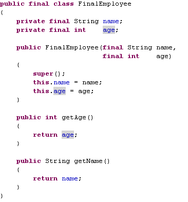

### Immutable objects are automatically thread-safe –true/false?

True. Since the state of the immutable objects can not be changed once they are created they are automatically synchronized/thread-safe.

### Which classes in java are immutable?

All wrapper classes in java.lang are immutable –
String, Integer, Boolean, Character, Byte, Short, Long, Float, Double, BigDecimal, BigInteger

### What are the advantages of immutability?

The advantages are:

1) Immutable objects are automatically thread-safe, the overhead caused due to use of synchronization is avoided.

2) Once created the state of the immutable object can not be changed so there is no possibility of them getting into an inconsistent state.

3) The references to the immutable objects can be easily shared or cached without having to copy or clone them as there state can not be changed ever after construction.

4) The best use of the immutable objects is as the keys of a map.

## STRING

### To what value is a variable of the String type automatically initialized?

The default value of an String type is null.

### How is it possible for two String objects with identical values not to be equal under the == operator?

The == operator compares two objects to determine if they are the same object in memory. It is possible for
two String objects to have the same value, but located indifferent areas of memory.

### What is the difference between StringBuffer and String class?

A string buffer implements a mutable sequence of characters. A string buffer is like a String, but can be modified. At any point in time it contains some particular sequence of characters, but the length and content of the sequence can be changed through certain method calls.
The String class represents character strings. All string literals in Java programs, such as "abc" are constant
and implemented as instances of this class; their values cannot be changed after they are created.

**General Question**

```java
public class EqualsTest {
    public static void main(String[] args) {
        String s1 = “abc”; 
        String s2 = s1; 
        String s5 = “abc”;
        String s3 = new String(”abc”); 
        String s4 = new String(”abc”);
        System.out.println(”== comparison : ” + (s1 == s5)); 
        System.out.println(”== comparison : ” + (s1 == s2)); 
        System.out.println(”Using equals method : ” + s1.equals(s2)); 
        System.out.println(”== comparison : ” + s3 == s4); 
        System.out.println(”Using equals method : ” + s3.equals(s4));
    }
}
```

```java

Output

== comparison : true
== comparison : true 
Using equals method : true 
false
Using equals method : true
```

### What is difference between String and StringTokenizer?

A StringTokenizer is utility class used to break up string.

Example:

```java
StringTokenizer st = new StringTokenizer(”Hello World”); while (st.hasMoreTokens()) { 
    System.out.println(st.nextToken());
}
```

```java
Output: 

Hello 
World
```

## Basic Core Java

### What is Byte Code? Or what do you mean by “write once and run anywhere”?

All Java programs are compiled into class files that contain bytecodes. These byte codes can be run in any platform and hence java is said to be platform independent

### In System.out.println(), what is System, out and println?

System is a predefined final class, out is a PrintStream object and println is a built-in overloaded method in the out object.

### What are Java Access Specifiers?
Access specifiers are keywords that determine the type of access to the member of a class. These keywords are for allowing privileges to parts of a program such as functions and variables. 

These are:

• **Public** : accessible to all classes

• **Protected** : accessible to the classes within the same package and any subclasses.

• **Private** : accessible only to the class to which they belong

• **Default** : accessible to the class to which they belong and to subclasses within the same package

### Name primitive Java types.

The 8 primitive types are byte, char, short, int, long, float, double, and boolean.

### What is the difference between the boolean & operator and the && operator?

If an expression involving the boolean & operator is evaluated, both operands are evaluated, whereas the && operator is a short cut operator. When an expression involving the && operator is evaluated, the first operand is evaluated. If the first operand returns a value of true then the second operand is evaluated. If the first operand evaluates to false, the evaluation of the second operand is skipped.

### What if I write static public void instead of public static void?

Program compiles and runs properly.

### What do you understand by numeric promotion?

The Numeric promotion is the conversion of a smaller numeric type to a larger numeric type, so that integral and floating-point operations may take place. In the numerical promotion process the byte, char, and short values are converted to int values. The int values are also converted to long values, if necessary. The long and float values are converted to double values, as required.

### How can I swap two variables without using a third variable?

Add two variables and assign the value into First variable. Subtract the Second value with the result Value and assign to Second variable. Subtract the Result of First Variable With Result of Second Variable and Assign to First Variable. 

Example:

```java
int a=5,b=10;a=a+b; b=a-b; a=a-b;
```

An other approach to the same question

You use an XOR swap.

### Why is main() method static?

To access the static method the object of the class is not needed. The method can be access directly with the help of ClassName. So when a program is started the JVM search for the class with main method and calls it without creating an object of the class.

### What is difference between instanceof and isInstance(Object obj)?

Differences are as follows:

1) instanceof is a reserved word of Java, but isInstance(Object obj) is a method of java.lang.Class.

2) instanceof method is used to check the type of an object which are known at compile time and isInstance() could only be called on class, San instance of java.lang.Class.

```java
if (obj instanceof MyType) {
...
}else if (MyType.class.isInstance(obj)) {
...
}
```
3) instanceof is used of identify whether the object is type of a particular class or its subclass but isInstance(obj) is used to identify object of a particular class.

### Java supports pass by value or pass by reference?

Java supports only pass by value. The arguments passed as a parameter to a method is mainly primitive data types or objects. For the data type the actual value is passed.
Java passes the references by value just like any other parameter. This means the references passed to the method are actually copies of the original references.Java copies and passes the reference by value, not the object. Thus, method manipulation will alter the objects, since the references point to the original objects.Consider the example:

```java
public void tricky(Point arg1, Point arg2)
{
    arg1.x = 100;
    arg1.y = 100; Point temp = arg1; arg1 = arg2;
    arg2 = temp;
}
public static void main(String [] args)
{
    Point pnt1 = new Point(0,0); Point pnt2 = new Point(0,0);
    System.out.println("X: " + pnt1.x + " Y: " +pnt1.y);
    System.out.println("X: " + pnt2.x + " Y: " +pnt2.y); System.out.println(" ");
    tricky(pnt1,pnt2);
    System.out.println("X: " + pnt1.x + " Y:" + pnt1.y); System.out.println("X: " + pnt2.x + " Y: " +pnt2.y);
}
```

```java
OutPut: 

X: 0 Y: 0
X: 0 Y: 0
X: 100 Y: 100
X: 0 Y: 0
```

The method successfully alters the value of pnt1, even though it is passed by value; however, a swap of pnt1 and pnt2 fails! This is the major source of confusion. In the main() method, pnt1 and pnt2 are nothing more than object references. When you pass pnt1 and pnt2 to the tricky() method, Java passes the references by value just like any other parameter. This means the references passed to the method are actually copies of the original references.

### How to make sure that Childclass method actually overrides the method of the superclass?

The @Override annotation can be added to the javadoc for the new method. If you accidently miss an argument or capitalize the method name wrong, the compiler will generate a compile-time error.

### How to find the size of an object?

The heap size of an object can be found using - 

```java
Runtime.totalMemory()-Runtime.freeMemory()
```

### What is Constructor?

- A constructor is a special method whose task is to initialize the object of its class.

- It is special because its name is the same as the class name.

- They do not have return types, not even void and therefore they cannot return values.

- They cannot be inherited, though a derived class can call the base class constructor.

- Constructor is invoked whenever an object of its associated class is created.

### How does the Java default constructor be provided?

If a class defined by the code does not have any constructor, compiler will automatically provide one no-parameter-constructor (default-constructor) for the class in the byte code. The access modifier (public/private/etc.) of the default constructor is the same as the class itself.

### Can constructor be inherited?

No, constructor cannot be inherited, though a derived class can call the base class constructor.

### What are the differences between Contructors and Methods?

|   |Constructors   |Methods    |
|---|---------------|-----------|
|Modifiers  |Cannot be abstract, final, native, static, or synchronized |Can be abstract, final, native, static, or synchronized    |
|Return Type    |No return type, not even void  |void or a valid return type    |
|Name   |Same name as the class (first letter is capitalized by convention) -- usually a noun   |Any name except the class. Method names begin with a lowercase letter by convention -- usually the name of an action   |
|this   |Refers to another constructor in the same class. If used, it must be the first line of the constructor |Refers to an instance of the owning class. Cannot be used by static methods.   |
|super  |Calls the constructor of the parent class. If used, must be the first line of the constructor  |Calls an overridden method in the parent class |
|Inheritance    |Constructors are not inherited |Methods are inherited  |

### How are this() and super() used with constructors?

- Constructors use this to refer to another constructor in the same class with a different parameter list.

- Constructors use super to invoke the superclass's constructor. If a constructor uses super, it must use it in the first line; otherwise, the compiler will complain.

### What are the differences between Class Methods and Instance Methods?

|Class Methods  |Instance Methods   |
|---------------|-------------------|
|Class methods are methods which are declared as static. The method can be called without creating an instance of the class |Instance methods on the other hand require an instance of the class to exist before they can be called, so an instance of a class needs to be created by using the new keyword. Instance methods operate on specific instances of classes. |
|Class methods can only operate on class members and not on instance members as class methods are unaware of instance members.  |Instance methods of the class can also not be called from within a class method unless they are being called on an instance of that class. |
|Class methods are methods which are declared as static. The method can be called without creating an instance of the class.    |Instance methods are not declared as static.   |

### How are this() and super() used with constructors?

- Constructors use this to refer to another constructor in the same class with a different parameter list.

- Constructors use super to invoke the superclass's constructor. If a constructor uses super, it must use it in the first line; otherwise, the compiler will complain.

### What are Access Specifiers?

One of the techniques in object-oriented programming is encapsulation. It concerns the hiding of data in a class and making this class available only through methods. Java allows you to control access to classes, methods, and fields via so-called access specifiers..

### What are Access Specifiers available in Java?

Java offers four access specifiers, listed below in decreasing accessibility:

- **Public**- public classes, methods, and fields can be accessed from everywhere.

- **Protected**- protected methods and fields can only be accessed within the same class to which the methods and fields belong, within its subclasses, and within classes of the same package.

- **Default(no specifier)**- If you do not set access to specific level, then such a class, method, or field will be accessible from inside the same package to which the class, method, or field belongs, but not from outside this package.

- **Private**- private methods and fields can only be accessed within the same class to which the methods and fields belong. private methods and fields are not visible within subclasses and are not inherited by subclasses.

|Situation  |public |Protected  |default    |private    |
|-----------|-------|-----------|-----------|-----------|
|Accessible to class from same package? |yes    |yes    |yes    |no |
|Accessible to class from different package?    |yes    |no, unless it is a subclass    |no |no |

### What is final modifier?

The final modifier keyword makes that the programmer cannot change the value anymore. The actual meaning depends on whether it is applied to a class, a variable, or a method.

- final Classes- A final class cannot have subclasses.

- final Variables- A final variable cannot be changed once it is initialized.

- final Methods- A final method cannot be overridden by subclasses.

### What are the uses of final method?

There are two reasons for marking a method as final:

- Disallowing subclasses to change the meaning of the method.

- Increasing efficiency by allowing the compiler to turn calls to the method into inline Java code.

### What is static block?

Static block which exactly executed exactly once when the class is first loaded into JVM. Before going to the main method the static block will execute.

### What are static variables?

Variables that have only one copy per class are known as static variables. They are not attached to a particular instance of a class but rather belong to a class as a whole. They are declared by using the static keyword as a modifier.

```java
static type varIdentifier;
```

where, the name of the variable is varIdentifier and its data type is specified by type.

**Note**: Static variables that are not explicitly initialized in the code are automatically initialized with a default value. The default value depends on the data type of the variables.

### What is the difference between static and non-static variables?

A static variable is associated with the class as a whole rather than with specific instances of a class. Non-static variables take on unique values with each object instance.

### What are static methods?

Methods declared with the keyword static as modifier are called static methods or class methods. They are so called because they affect a class as a whole, not a particular instance of the class. Static methods are always invoked without reference to a particular instance of a class.

**Note**:The use of a static method suffers from the following restrictions:

- A static method can only call other static methods.

- A static method must only access static data.

- A static method cannot reference to the current object using keywords super or this.

### How could Java classes direct program messages to the system console, but error messages, say to a file?

The class System has a variable out that represents the standard output, and the variable err that represents the standard error device. By default, they both point at the system console. This how the standard output could be re-directed:

```java
Stream st = new Stream(new FileOutputStream("output.txt")); System.setErr(st); System.setOut(st);
```

### How do you know if an explicit object casting is needed?

If you assign a superclass object to a variable of a subclass's data type, you need to do explicit casting. For example:
```java
Object a; Customer b; b = (Customer) a;
```

When you assign a subclass to a variable having a supeclass type, the casting is performed automatically.

### What's the difference between constructors and other methods?

Constructors must have the same name as the class and can not return a value. They are only called once while regular methods could be called many times.

### Can you call one constructor from another if a class has multiple constructors

Use this() syntax.

### Explain the usage of Java packages.

This is a way to organize files when a project consists of multiple modules. It also helps resolve naming conflicts when different packages have classes with the same names. Packages access level also allows you to protect data from being used by the non-authorized classes.

### If a class is located in a package, what do you need to change in the OS environment to be able to use it?

You need to add a directory or a jar file that contains the package directories to the CLASSPATH environment variable. Let's say a class Employee belongs to a package com.xyz.hr; and is located in the file c:\dev\com\xyz\hr\Employee.java. In this case, you'd need to add c:\dev to the variable CLASSPATH. If this class contains the method main(), you could test it from a command prompt window as follows:

```java
c:\>java com.xyz.hr.Employee
```

### Can an inner class declared inside of a method access local variables of this method?

It's possible if these variables are final.

### How can a subclass call a method or a constructor defined in a superclass?

Use the following syntax: super.myMethod(); To call a constructor of the superclass, just write super(); in the first line of the subclass's constructor.

### You can create an abstract class that contains only abstract methods. On the other hand, you can create an interface that declares the same methods. So can you use abstract classes instead of interfaces?

Sometimes, but your class may be a descendent of another class and in this case the interface is your only option.

### How would you make a copy of an entire Java object with its state?

Have this class implement Cloneable interface and call its method clone().

### What access level do you need to specify in the class declaration to ensure that only classes from the same directory can access it?

You do not need to specify any access level, and Java will use a default package access level.

### Can we declare an anonymous class as both extending a class and implementing an interface? 

No. An anonymous class can extend a class or implement an interface, but it cannot be declared to do both

### What is a native method? 

- A native method is a method that is implemented in a language other than Java.

### What are wrapped classes?

Wrapped classes are classes that allow primitive types to be accessed as objects.

### What restrictions are placed on the location of a package statement within a source code file? 

- A package statement must appear as the first line in a source code file (excluding blank lines and comments).

### How Observer and Observable are used?

Subclass of Observable class maintain a list of observers. Whenever an Observable object is updated, it invokes the update() method of each of its observers to notify the observers that it has a changed state. An observer is any object that implements the interface Observer

### What does it mean that a method or field is “static”? 

- Static variables and methods are instantiated only once per class. In other words they are class variables, not instance variables. If you change the value of a static variable in a particular object, the value of that variable changes for all instances of that class. Static methods can be referenced with the name of the class rather than the name of a particular object of the class (though that works too). That’s how library methods like System.out.println() work. out is a static field in the java.lang.System class.

### When is static variable loaded? Is it at compile time or runtime? When exactly a static block is loaded in Java?

Static variable are loaded when classloader brings the class to the JVM. It is not necessary that an object has to be created. Static variables will be allocated memory space when they have been loaded. The code in a static block is loaded/executed only once i.e. when the class is first initialized. A class can have any number of static blocks. Static block is not member of a class, they do not have a return statement and they cannot be called directly. Cannot contain this or super. They are primarily used to initialize static fields.

### What comes to mind when someone mentions a shallow copy in Java? 

**Object cloning.**

The **clone( )** method generates a duplicate copy of the object on which it is called. Only classes that implement the **Cloneable** interface can be cloned.

The **Cloneable** interface defines no members. It is used to indicate that a class allows a bitwise copy of an object (that is, a clone) to be made. If we try to call clone( ) on a class that does not implement **Cloneable**, a **CloneNotSupportedException** is thrown. When a clone is made, the constructor for the object being cloned is not called. A clone is simply an exact copy of the original.
Cloning is a potentially dangerous action, because it can cause unintended side effects. For example, if the object being cloned contains a reference variable called obRef, then when the clone is made, obRef in the clone will refer to the same object as does obRef in the original. If the clone makes a change to the contents of the object referred to by obRef, then it will be changed for the original object, too. Here is another example. If an object opens an I/O stream and is then cloned, two objects will be capable of operating on the same stream. Further, if one of these objects closes the stream, the other object might still attempt to write to it, causing an error.

Because cloning can cause problems, **clone( )** is declared as **protected** inside **Object**. This means that it must either be called from within a method defined by the class that implements **Cloneable**, or it must be explicitly overridden by that class so that it is public.

Implementing a deep copy of an object can be a learning experience -- you learn that you don't want to do it! If the object in question refers to other complex objects, which in turn refer to others, then this task can be daunting indeed. Traditionally, each class in the object must be individually inspected and edited to implement the Cloneable interface and override its clone() method in order to make a deep copy of itself as well as its contained objects. This article describes a simple technique to use in place of this time-consuming conventional deep copy.

**The concept of deep copy**

In order to understand what a deep copy is, let's first look at the concept of shallow copying. In a previous JavaWorld article, "How to avoid traps and correctly override methods from java.lang.Object," Mark Roulo explains how to clone objects as well as how to achieve shallow
copying instead of deep copying. To summarize briefly here, a shallow copy occurs when an object is copied without its contained objects. To illustrate, Figure 1 shows an object, obj1, that contains two objects, containedObj1 and containedObj2

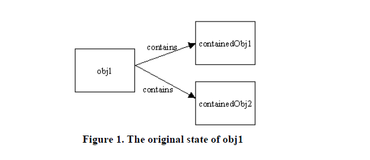

**An alternative to the deep copy technique**

**Use serialization to make deep copies and avoid extensive manual editing or extending of classes**.Implementing a deep copy of an object can be a learning experience -- you learn that you don't want to do it! If the object in question refers to other complex objects, which in turn refer to others, then this task can be daunting indeed. Traditionally, each class in the object must be individually inspected and edited to implement the Cloneable interface and override its clone() method in order to make a deep copy of itself as well as its contained objects. This article describes a simple technique to use in place of this time-consuming conventional deep copy.

**The concept of deep copy**

In order to understand what a deep copy is, let's first look at the concept of shallow copying. In a previous JavaWorld article, "How to avoid traps and correctly override methods from java.lang.Object," Mark Roulo explains how to clone objects as well as how to achieve shallow
copying instead of deep copying. To summarize briefly here, a shallow copy occurs when an object is copied without its contained objects. To illustrate, Figure 1 shows an object, obj1, that contains two objects, containedObj1 and containedObj2.

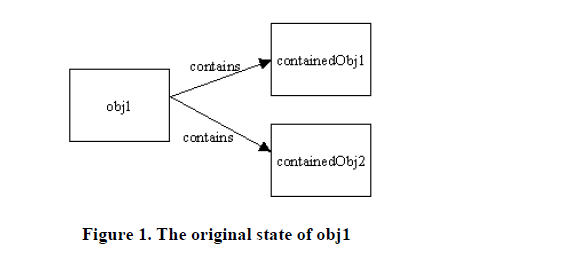

If a shallow copy is performed on obj1, then it is copied but its contained objects are not, as shown in Figure 2.

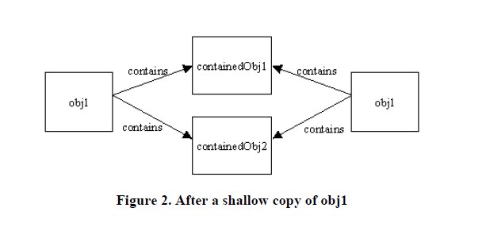

A deep copy occurs when an object is copied along with the objects to which it refers. Figure 3 shows obj1 after a deep copy has been performed on it. Not only has obj1 been copied, but the objects contained within it have been copied as well.

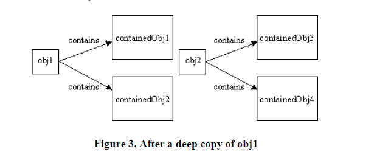

If either of these contained objects themselves contain objects, then, in a deep copy, those objects are copied as well, and so on until the entire graph is traversed and copied. Each object is responsible for cloning itself via its clone() method. The default clone() method, inherited from Object, makes a shallow copy of the object. To achieve a deep copy, extra logic must be added that explicitly calls all contained objects' clone() methods, which in turn call their contained objects' clone() methods, and so on. Getting this correct can be difficult and time consuming, and is rarely fun. To make things even more complicated, if an object can't be modified directly and its clone() method produces a shallow copy, then the class must be extended, the clone() method overridden, and this new class used in place of the old. (For example, Vector does not contain the logic necessary for a deep copy.) And if you want to write code that defers until runtime the question of whether to make a deep or shallow copy an object, you're in for an even more complicated situation. In this case, there must be two copy functions for each object: one for a deep copy and one for a shallow. Finally, even if the object being deep copied contains multiple references to another object, the latter object should still only be copied once. This prevents the proliferation of objects, and heads off the special situation in which a circular reference produces an infinite loop of copies

A common solution to the deep copy problem is to use Java Object Serialization (JOS). The idea is simple: Write the object to an array using JOS’s ObjectOutputStream and then use ObjectInputStream to reconsistute a copy of the object. The result will be a completely distinct object, with completely distinct referenced objects. JOS takes care of all of the details: superclass fields, following object graphs, and handling repeated references to the same object within the graph. Figure 3 shows a first draft of a utility class that uses JOS for making deep copies.

```java
import java.io.IOException;
import java.io.ByteArrayInputStream; 
import java.io.ByteArrayOutputStream; 
import java.io.ObjectOutputStream; 
import java.io.ObjectInputStream;
/**
* Utility for making deep copies (vs. clone()'s shallow copies) of
* objects. Objects are first serialized and then deserialized. Error
* checking is fairly minimal in this implementation. If an object is
* encountered that cannot be serialized (or that references an object
* that cannot be serialized) an error is printed to System.err and
* null is returned. Depending on your specific application, it might
* make more sense to have copy(...) re-throw the exception.
*
* A later version of this class includes some minor optimizations.
*/
public class UnoptimizedDeepCopy {
    /**
    * Returns a copy of the object, or null if the object cannot
    * be serialized.
    */
    public static Object copy(Object orig) { 
        Object obj = null;
        try {
            // Write the object out to a byte array
            ByteArrayOutputStream bos = new ByteArrayOutputStream(); ObjectOutputStream out = new ObjectOutputStream(bos); out.writeObject(orig);
            out.flush();
            out.close();
            // Make an input stream from the byte array and read
            // a copy of the object back in. ObjectInputStream in = new ObjectInputStream(
            new ByteArrayInputStream(bos.toByteArray())); obj = in.readObject();
        }
        catch(IOException e) {
            e.printStackTrace();
        }
        catch(ClassNotFoundException cnfe) { 
            cnfe.printStackTrace();
        }
        return obj;
    }
}
```

Unfortunately, this approach has some problems, too

1. It will only work when the object being copied, as well as all of the other objects references directly or indirectly by the object, are serializable. (In other words, they must implement java.io.Serializable.) Fortunately it is often sufficient to simply declare that a given class implements java.io.Serializable and let Java’s default serialization mechanisms do their thing.

2. Java Object Serialization is slow, and using it to make a deep copy requires both serializing and deserializing. There are ways to speed it up (e.g., by pre-computing serial version ids and defining custom readObject() and writeObject() methods), but this will usually be the primary bottleneck.

3. The byte array stream implementations included in the java.io package are designed to be general enough to perform reasonable well for data of different sizes and to be safe to use in a multi-threaded environment. These characteristics, however, slow down ByteArrayOutputStream and (to a lesser extent) ByteArrayInputStream.

# Basic Java Interview Question and Answer


## 1. What is the most important feature of Java?

Java is a platform independent language.

## 2. What do you mean by platform independent?

Platform independence means that we can write and compile the java code in one platform (eg: Windows) and can execute the class in any other supported platform eg: (Linux, Solaris, etc).

## 3. Are JVM's platform independent?

JVM's are not platform independent. JVM's are platform specific run time implementation provided by the vendor.

## 4. What is JVM?

JVM is java vertual machine which is a run time environment for the compiled java class files.


## 5. What is the difference between a JDK and a JVM?

JDK is Java Development Kit which is for development purpose and it inclues execution environment also. But JVM is purely a run time envrionment and hence you will not be able to compile your source files using a JVM.

## 6. What is a pointer and does java support pointers?

Pointer is a reference handle to a memory location Improper handling of pointers leads to memory leaks and reliability issues hence java doesn't support the usage of pointers.

## 7. What is the base class of all classes?

java.lang.Object

## 8. Does java support multiple inheritance?

Java doesn't support multiple inheritance.

## 9. Is java a pure object oriented language?

Java uses primitive data types and hence is not a pure object oriented language.

## 10. Are arrays primitive data types?

In java, Arrays are objects.

## 11. What is difference between path and classpath?

Path and Classpath are operating system level environment variables. Path is used define where the system can find the executables(.exe) files and classpath is used to specify the location .class files.

## 12. What are local variables?

Local variables are those which are declared within a block of code like methods. Local variables should be initialised before accessing them.

## 13. What are instance variables?

Instance variables are those which are defined at the class level. Instance variables need not be initialized before using them as they are automatically initialized to their default values.

## 14. How to define a constant variable in java?

The variable should be declared as static and final. So only one copy of the variables exists for all instances of the class and the value can't be changed also.

static final int PI=2.14; is an example of constant.

## 15. Should a main method be compulsorily declared in all java classes?

No not required. main method should be defined only if the source class is a java application.

## 16. What is the return type of the main method?

Main method doesn't return anything hence declared void.

## 17. Why is the main method declared static?

main method is called by the JVM even before the instantiation of the class hence it is declared as static.

## 18. What is the arguement of main method?

main method accepts an array of String object as argument.

## 19. Can a main method be overloaded?

Yes. You can have any number of main methods with different method signature and implementation in the class.

## 20. Can a main method be declared final?

Yes. Any inheriting class will not be able to have it's own default main method.

## 21. Does the order of public and static declaration matter in main method?

No it doesn't matter but void should always come before main().

## 22. Can a source file contain more than one class declartaion?

Yes a single source file can contain any number of Class declarations but only one of the class can be declared as public.

## 23. What is package?

Package is a collection of related classes and interfaces. package declaration should be first statement in a java class.

## 24. Which package is imported by default?

java.lang package is imported by default even without a package declaration.

## 25. Can a class declared as private be accessed outside it's package?

Not possible.

## 26. Can a class be declared as protected?

A class can't be declared as protected. Only methods can be declared as protected.

## 27. What is the access scope of a protected method?

A protected method can be accessed by the classes within the same package or by the subclasses of the class in any package.

## 28. What is the purpose of declaring a variables as final?

A final variable's value can't be changed. final variables should be initialized before using them.

## 29. What is the impact of declaring a method as final?

A method declared as final can't be overridden. A sub-class can't have the same method signature with a different implementation.

## 30. I don't want amy class to be inherited by any other class. What should i do?

You should declared your class as final. But you can't define your class as final, if it is an abstract class. A class declared as final can't be extended by any other class.

## 31. Can you give few examples of final classes defined in Java API?

java.lang.String, java.lang.Math are final classes.

## 32. How is final different from finally and finalize?

final is a modifier which can be applied to a class or a method or a variable. final class can't be inherited, final method can't be overridden and final variable can't be changed. 

finally is an exception handling code section which gets executed whether an exception is raised or not by the try block code segment.

finalize() is a method of Object class which will be executed by the JVM just before garbage collecting object to give a final change for resource releasing activity.

## 33. Can a class be declared as static?

No a class cannot be defined as static. Only a method, a variable or a block of code can be declared as static.

## 34. When will you define a method as static?

When a method needs to be accessed even before the creation of the object of the class then we should declare the method as static.

## 35. What are the restriction imposed on a static method or a static block of code?

A static method should not refer to instance variables without creating an instance and cannot use "this" operator to refer the instance.

## 36. I want to print "Hello" even before main is executed. How will you acheive that?

Print the statement inside a static block of code. Static blocks get executed when the class gets loaded into the memory and even before the creation of an object. Hence it will be executed before the main method. And it will be executed only once.

## 37. What is the importance of static variables?

static variables are class level varabiels where all objects of the class refer to the same variable. If one object changes the value then the change gets reflected in all the objects.

## 38. Can we declare a static variable inside a method?

Static variables are class level variables and the cann't be declared inside a method. If declared, the class will not compile.

## 39. What is an Abstract Class and what is it's purpose?

A class which doesn't provide complete implementation is defined as an abstract class. Abstract classes enforce abstraction.

## 40. Can a abstract class be declared final?

Not possible. An abstract class without being inherited is of no use and hence will result in compile time error.

## 41. What is use of a abstract variable?

Variables can't be declared as abastract. Only classes and methods can be declared as abastract.

## 42. Can you create an object of an abastract class?

Not possible. Abstract classes can't be instantiated.

## 43. Can a abstract class be defined without any abstract methods?

Yes it's possible. This is basically to avoid instance creation of the class.

## 44. Class C implements Interface I containing method m1 and m2 declarations. Class C has provided implementation for method m2. Can i create an object of Class C?

No not possible. Class C should privide implementation for all the methods in the interface.

# 50 Keywords of Java

Keywords are reserved words in Java that have specific meanings and cannot be used
for any other purpose, such as variable names or method names. Java has a total of 50
keywords, which are used to define the syntax and structure of Java programming
language.

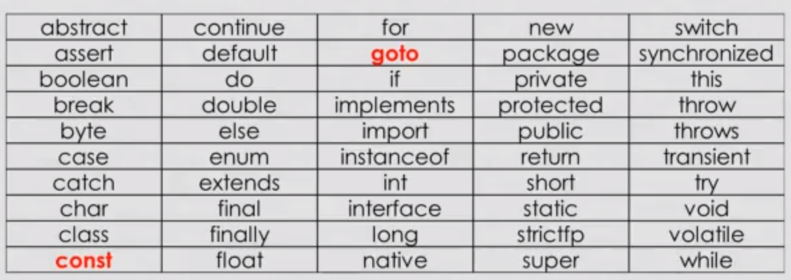

## Rules to follow for keywords:

Keywords cannot be used as an identifier for class, subclass, variables, and methods.
Keywords are case-sensitive.

## Some significant points about Java keywords:
const and goto are reserved words but not used.

True, false, and null are literals, not keywords.

All keywords are in lower-case.

## Here’s a list of Java keywords:

**abstract**: used to declare a class or method as abstract. An abstract class is a class that cannot be instantiated, and an abstract method is a method without a body that must be implemented in a subclass.

**assert**: used to perform assertion testing in Java. An assertion is a statement that should always be true, and if it is false, then an AssertionError is thrown.

**strictfp**: used to enforce strict floating-point precision in Java.

**byte**: used to declare a byte variable, which is a data type that can store values from -128 to 127.

**instanceof**: used to check if an object is an instance of a particular class or interface.

**enum**: used to declare an enumeration, which is a type that consists of a set of named constants.

**native**: used to declare a method as native, which means that its implementation is provided by the underlying platform, rather than in Java code.

**volatile**: The volatile keyword in Java is used to indicate that a variable's value may be modified by multiple threads simultaneously. It ensures that the variable is always read from and written to the main memory, rather than from thread-specific caches, ensuring visibility across threads.

**transient**: used to declare a variable as transient, which means that it will not be serialized when the object is written to a file or transmitted over a network.

**synchronized**: used to ensure that only one thread can access a block of code or object at a time in Java.

**final**: used to declare a variable or method as final, which means that its value or implementation cannot be changed.

**static**: used to declare a variable or method as static, which means that it belongs to the class rather than to individual objects of the class.

**super**: used to call a method or constructor in the superclass.

**this**: used to refer to the current object in Java

**class**: used to declare a class in Java.

**extends**: used to extend a class in Java.

**interface**: used to declare an interface in Java.

**implements**: used to implement an interface in Java.

**package**: used to define a package in Java.

**import**: used to import a package or class into a Java program.

**private**: used to declare a variable or method as private, which means that it can only be accessed within the same class.

**protected**: used to declare a variable or method as protected, which means that it can be accessed within the same class or any subclass.

**public**: used to declare a variable or method as public, which means that it can be accessed from anywhere in the Java program.

**break**: used to break out of a loop or switch statement.

**continue**: used to skip the current iteration of a loop and continue to the next iteration.

**switch**: used to start a switch statement in Java.

**case**: used in a switch statement to define a case label.

**default**: used in a switch statement to define a default case.

**try**: used to start a try-catch block in Java.

**catch**: used to catch and handle exceptions in Java.

**finally**: used in a try-catch block to define a block of code that will always be executed, regardless of whether an exception is thrown or not.

**throw**: used to throw an exception in Java.

**throws**: used to declare that a method may throw an exception in Java.

**new**: used to create a new object in Java.

**return**: used to return a value from a method or exit a method without returning a value.

## BIG DECIMAL

BigDecimal class is a useful tool for performing mathematical operations with a high degree of precision. Unlike the primitive double and float data types, BigDecimal can accurately represent decimal numbers and avoid common rounding errors.

```java
import java.math.BigDecimal;
public class Main{
    public static void main(String[] args) {
        double x = 1.05;
        double y = 2.55;
        System.out.println(x+y);//3.5999999999999996
        BigDecimal num1 = new BigDecimal("1.05");
        BigDecimal num2 = new BigDecimal("2.55");
        BigDecimal add = num1.add(num2);//3.60
        BigDecimal sub = num2.subtract(num1);//1.50
        BigDecimal devide = num2.divide(num1,2,BigDecimal.ROUND_HALF_UP);//2.43
        BigDecimal num3 = new BigDecimal("1.05");
        boolean result1 = num1.equals(num3);//true
        BigDecimal maxNum = num1.max(num2);//2.55
        BigDecimal minNum = num1.min(num2);//1.05
    }
}
```

**Note** : num2.divide(num1,2,BigDecimal.ROUND_HALF_UP);

• 2 is used as the scale to round the result to two decimal places

• BigDecimal.ROUND_HALF_UP is used as the rounding mode, which rounds towards the nearest neighbor and , in case of a tie, rounds away from zero.

• New BigDecimal(String argument here for accurate data);

## literals

Literals are nothing but the constant we assign to variable.

```java
public static void main(String[] args) {
    int a = 100000;//100000
    int b = 1_00_000;//100000
    int binary = 0b101;//5
    int hexa = 0x5E;//94
    int octal = 023;//19
    double d = 12e5;//
    char c = 'a';
    c++;
    System.out.println(c);//b
}
```

## Multithreading

A process of executing multiple threads simultaneously is known as Multithreading. However, we use multithreading rather than multiprocessing because threads use a shared memory area.

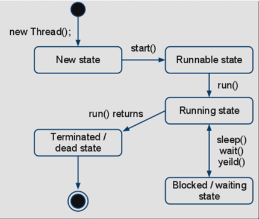

• **New**: when we create an instance of the Thread class, a thread is in a new state.

• **Runnable State**: Runnable status is a state where the thread is ready to run.

• **Running state**: A thread is executing where multi-threaded programming is derived by the hardware.

• **Blocked/ waiting state**: A Java thread can be blocked when a resource is expected.

• **Terminated/ dead state**: A thread can be terminated, which stops its execution immediately at any time. Once a thread is finished, it cannot be resumed.

**Creating thread by extending Thread class**

```java
class MyCounter extends Thread{
    
    private int threadNo;
    
    public MyCounter(int threadNo) {
        this.threadNo = threadNo;
    }
    
    @Override
    public void run() {
        countMe();
    }

    public void countMe(){

        for(int i=1; i<=9;i++){

            try {
                sleep(500);
            } catch (InterruptedException e) {
                e.printStackTrace();
            }
            System.out.println("The value if i is: "+i+" and the thread number is: "+threadNo);
        }
    }
}
public class App {

    public static void main(String[] args) throws InterruptedException {

        MyCounter counter1 = new MyCounter(1);
        MyCounter counter2 = new MyCounter(2);
        long startTime = System.currentTimeMillis();
        counter1.run(); //Run should be called by JVM
        System.out.println("**************************");
        counter2.start(); //so replace run by start
        long endTime = System.currentTimeMillis();
        System.out.println("Total time required to process: "+(endTimestartTime));
    }
}
```

**Creating Thread by implementing Runnable Interface**

```java
import java.util.Random;
class MyCounter implements Runnable{
    
    private int threadNo;
    
    public MyCounter(int threadNo) {
        
        this.threadNo = threadNo;
    }
    
    @Override
    public void run() {
    
        Random random = new Random();

        for(int i = 0;i<=9;i++){
            try {
                Thread.sleep(random.nextInt(500));
            } catch (InterruptedException e) {
                // TODO Auto-generated catch block
                e.printStackTrace();
            }
            System.out.println("The value if i is: "+i+" and the thread number is:"+threadNo);
        }
    }
}
public class App {
    public static void main(String[] args) throws InterruptedException {

        Thread thread1 = new Thread(new MyCounter(1));
        Thread thread2 = new Thread(new MyCounter(2));
        thread1.start();
        thread2.start();
    }
}
```

**In the following code, we create an anonymous object and start the thread immediately.**

```java
public class App {
    public static void main(String[] args) throws InterruptedException {
        new Thread(new Runnable() {
        
        @Override
        public void run() {

            for(int i=1;i<10;i++){
                try {
                    Thread.sleep(500);
                } catch (InterruptedException e) {
                    e.printStackTrace();
                };
                System.out.println(i);
            }
            }
        }).start();
        new Runnable(){}.start();//2nd thread and so on as required
    }
}
```

## Synchronization

Synchronization in Java is a technique used to control access to shared resources in a multi-threaded environment.

It ensures that only one thread can access a shared resource at a time, preventing data corruption and ensuring consistency.

There are two main mechanisms for synchronization:

I. `synchronized` methods or blocks,

II. and the `java.util.concurrent` package.

### 1. `synchronized` keyword:

**a. Synchronized Methods:**

You can use the `synchronized` keyword with a method to ensure that only one thread can execute the method at a time.

```java
public synchronized void synchronizedMethod() {
// Synchronized code
}
```

**b. Synchronized Blocks:**

You can use synchronized blocks to control access to a specific section of code. This allows for more fine-grained control compared to synchronized methods.

```java
public void someMethod() {
    
    // Non-critical section
    synchronized (lockObject) {
        // Critical section (synchronized code)
    } 
    // Non-critical section
}
```
It's common to use a dedicated object (e.g., `lockObject` in the example) as a lock to avoid potential deadlocks.

### 2. `java.util.concurrent` package:

Java provides more advanced synchronization utilities in the `java.util.concurrent` package, offering higher-level abstractions.

**a. `Lock` Interface:**

The `Lock` interface provides a more flexible alternative to the `synchronized` keyword, allowing for more sophisticated locking mechanisms.

```java
import java.util.concurrent.locks.Lock;
import java.util.concurrent.locks.ReentrantLock;
public class Example {
    private final Lock lock = new ReentrantLock();
    public void someMethod() {
        lock.lock();
        try {
            // Synchronized code
        } finally {
            lock.unlock();
        }
    }
}
```

**b. `Semaphore` and `CountDownLatch`:**

These classes are used for more complex synchronization scenarios. `Semaphore` can be used to control access to a resource, and `CountDownLatch` can be used to synchronize
multiple threads.

## Best Practices for Synchronization:

**1. Minimize Synchronized Code:**

Only synchronize the critical sections of your code to minimize the impact on
performance.

**2. Use `java.util.concurrent` Utilities:**

When applicable, prefer the higher-level abstractions provided by the `java.util.concurrent` package.

**3. Avoid Deadlocks:**

Be cautious about nested locks and ensure a consistent locking order to avoid potential deadlocks.

**4. Use `volatile` Modifier:**

The `volatile` modifier can be used to ensure visibility of changes across threads.

**5. Consider Thread Safety:**

Make sure that shared data structures are designed to be thread-safe, or use synchronization mechanisms to protect them.

## wait() and its overloads, notify(), notifyAll(), interupt()

```java

public class App {

    static public int balance = 0;

    public void withdraw(int amount) {
        
        synchronized (this) {
        
            if (balance <= 0) {
                try {
                    System.out.println("Waiting for balance updation");
                    wait();
                } catch (InterruptedException e) {
                    e.printStackTrace();
                }
            }
        }
        balance = balance - amount;
        
        System.out.println("Withdrawal successful and the current balance is: " +balance );
    }
    public void deposit(int amount) {
        System.out.println("We are depositing the amount");
        balance = balance + amount;
    }
    public static void main(String[] args) {
        
        App app = new App();
        
        Thread thread1 = new Thread(new Runnable() {
        
            @Override
            public void run() {
                app.withdraw(1000);
            }
        });
        thread1.setName("Thread1");
        thread1.start();
        Thread thread2 = new Thread(new Runnable() {
        
            @Override
            public void run() {
            try {
                Thread.sleep(5000);
            } catch (InterruptedException e) {
                e.printStackTrace();
            }
            app.deposit(2000);
            }
        });
        thread2.setName("Thread");
        thread2.start();
    }
}
```

When using `wait()`, `notify()`, and `notifyAll()`, it's crucial to follow best practices to avoid issues like missed signals and deadlocks. Always use these methods within a synchronized block and carefully design your synchronization logic to ensure correct behavior in a multi-threaded environment.

the `wait()`, `notify()`, and `notifyAll()` methods are used in conjunction with the `synchronized` keyword to implement inter-thread communication and synchronization.

These methods are part of the `Object` class and are commonly used in scenarios where one thread needs to wait for a certain condition to be met before proceeding, and
another thread needs to signal that the condition has been satisfied.

### 1. wait():

- The wait() method is used to make a thread wait until another thread invokes the notify() or notifyAll() method for the same object.

- It must be called from within a synchronized block.

- It releases the lock on the object, allowing other threads to enter the synchronized block.

```java
    synchronized (sharedObject) {

        while (conditionNotMet) {
            sharedObject.wait();
        }
        // Code to execute after condition is met
    }
```

### 2. notify():

- The notify() method is used to wake up one of the threads that are currently waiting on the same object.

- It must be called from within a synchronized block.

- It does not release the lock immediately; the thread calling notify() must exit the synchronized block to release the lock.

```java
synchronized (sharedObject) {
    // Code to change the condition
    sharedObject.notify();
}
```

### 3. notifyAll():

- The notifyAll() method is similar to notify() but wakes up all threads that are currently waiting on the same object.

- It must be called from within a synchronized block.

- It is often used to avoid the issue of missed signals when multiple threads are waiting. 

```java
synchronized (sharedObject) {
    // Code to change the condition
    sharedObject.notifyAll();
}
```

### 4. interrupt():

- The interrupt() method is not directly related to `wait()` and `notify()`, but it is used for interrupting a thread that is currently in a blocked state.

- If a thread is waiting, sleeping, or in some other blocking operation, calling `interrupt()` on that thread will cause it to throw an `InterruptedException`.

- Handling interruptions is the responsibility of the developer and can be used to gracefully terminate a thread or take other appropriate action.

### 5. join():

The joining method is an optimal solution to the problem of inconsistency that occurs due to threads not having a proper order. The join method is used to notify that the thread will wait until the execution of the given thread before execution.

```java
public class App {

    public int counter = 0;

    public static void main(String[] args) {
        
        App app = new App();
        Thread thread1 = new Thread(new Runnable() {
            @Override
            public void run() {
                for (int i = 0; i < 1000; i++) {
                    app.counter++;
                }
            }
        });
        
        Thread thread2 = new Thread(new Runnable() {
            @Override
            public void run() {
                try {
                    thread1.join(2000);
                } catch (InterruptedException e) {
                    e.printStackTrace();
                }
                for (int i = 0; i < 1000; i++) {
                    app.counter++;
                }
            }
        });

        thread1.start();
        thread2.start();
        
        try {
            thread2.join();
        } catch (InterruptedException e) {
            e.printStackTrace();
        }
        
        System.out.println("The value of counter: " + app.counter);
    }
}
```

## Concurrency Control

Concurrency control in Java involves managing the execution of multiple threads to ensure correctness, consistency, and avoid potential issues such as race conditions, deadlocks, and data corruption. Java provides several mechanisms for concurrency control:

### 1. Synchronization (using `synchronized` keyword):

As discussed earlier, synchronization is a fundamental mechanism in Java for controlling access to shared resources. It can be applied to methods or blocks of code
using the `synchronized` keyword. Synchronization ensures that only one thread can access the synchronized code at a time, preventing data corruption.

```java
public synchronized void synchronizedMethod() {
    // Synchronized code
}
```

### 2. Volatile Keyword:

The `volatile` keyword is used to indicate that a variable's value may be changed by multiple threads simultaneously. It ensures that reads and writes to the variable are atomic and that changes are visible to all threads.

```java
private volatile int sharedVariable;
```

### 3. Locks (using `Lock` interface):

The `Lock` interface provides a more flexible alternative to the `synchronized` keyword. It allows for explicit control over locks, enabling features like reentrant locking, timed
waiting, and interruption handling.

```java
import java.util.concurrent.locks.Lock;
import java.util.concurrent.locks.ReentrantLock;
public class Example {
    private final Lock lock = new ReentrantLock();
    public void someMethod() {
        lock.lock();
        try {
        // Synchronized code
        } finally {
        lock.unlock();
        }
    }
}
```

### 4. Atomic Classes (e.g., `AtomicInteger`, `AtomicReference`):
The `java.util.concurrent.atomic` package provides atomic classes that support atomic operations on single variables. These classes are useful for scenarios where simple operations need to be performed without explicit synchronization.

```java
import java.util.concurrent.atomic.AtomicInteger;
public class Example {
    private AtomicInteger atomicCounter = new AtomicInteger(0);
    public void incrementCounter() {
        atomicCounter.incrementAndGet();
    }
}
```

### 5. Thread Pools (using `ExecutorService`):

Java's `ExecutorService` and related interfaces provide a higher-level abstraction for managing and controlling thread execution. Thread pools can be used to limit the number
of concurrent threads, manage thread lifecycle, and improve performance.We need ExecutorService as there is some limit to hardware we cannot run lakhs of threads simultaneously , so this service will manage it well.

```java
class SomeThread extends Thread{
   
    private String name;
    
    public SomeThread(String name) {
        this.name = name;
    }
    
    @Override
    public void run() {
        System.out.println("Starting thread: "+name);
        try {
            Thread.sleep(3000);
        } catch (InterruptedException e) {
            // TODO Auto-generated catch block
            e.printStackTrace();
        }
        System.out.println("Thread ended: "+name);
    }
}
public class App {
    public static void main(String[] args) {
        ExecutorService executorService = Executors.newFixedThreadPool(4);
        //at max 4 threads will be running in parallel
        SomeThread thread1 = new SomeThread("Thread 1");
        SomeThread thread2 = new SomeThread("Thread 2");
        SomeThread thread3 = new SomeThread("Thread 3");
        SomeThread thread4 = new SomeThread("Thread 4");
        SomeThread thread5 = new SomeThread("Thread 5");
        SomeThread thread6 = new SomeThread("Thread 6");
        SomeThread thread7 = new SomeThread("Thread 7");
        SomeThread thread8 = new SomeThread("Thread 8");
        SomeThread thread9 = new SomeThread("Thread 9");
        SomeThread thread10 = new SomeThread("Thread 10");
        SomeThread thread11 = new SomeThread("Thread 11");
        SomeThread thread12 = new SomeThread("Thread 12");
        executorService.execute(thread1);
        executorService.execute(thread2);
        executorService.execute(thread3);
        executorService.execute(thread4);
        executorService.execute(thread5);
        executorService.execute(thread6);
        executorService.execute(thread7);
        executorService.execute(thread8);
        executorService.execute(thread9);
        executorService.execute(thread10);
        executorService.execute(thread11);
        executorService.execute(thread12);
        executorService.shutdown();//manual shutdown is required
    }
}
```

### 6. Read-Write Locks (using `ReentrantReadWriteLock`):

The `ReentrantReadWriteLock` provides a mechanism for controlling access to shared resources with multiple threads. It allows multiple threads to read a resource concurrently but ensures exclusive access for writing.

```JAVA
import java.util.concurrent.locks.ReadWriteLock;
import java.util.concurrent.locks.ReentrantReadWriteLock;
public class Example {

    private final ReadWriteLock readWriteLock = new ReentrantReadWriteLock();
    
    public void readData() {
        readWriteLock.readLock().lock();
        try {
            // Read data
        } finally {
            readWriteLock.readLock().unlock();
        }
    }

    public void writeData() {
        readWriteLock.writeLock().lock();
        try {
            // Write data
        } finally {
            readWriteLock.writeLock().unlock();
        }
    }
}
```

## DeadLock :

A deadlock is a situation in concurrent programming where two or more threads are blocked indefinitely, each waiting for the other to release a resource. Deadlocks occur when there is a circular wait among two or more threads, and each thread holds a resource that another thread needs.

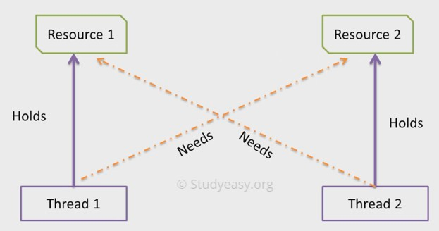

**Solution** : do not use nested locks , and rather than lock() or manual object lock use
reentrant tryLock() method.

**CountDownLatch** : The basic use of this is that we can place the thread that we want to execute after a certain number of threads. This can be done by setting the countdown
number to the number of threads after which we want the specific thread to be executed.

In other words , allows one or more threads to wait for a set of operations to be completed by other threads before proceeding.

```java

class SomeThread extends Thread{
    
    private CountDownLatch latch;
    
    public SomeThread(CountDownLatch latch) {
        this.latch = latch;
    }

    @Override
    public void run() {
        System.out.println("Thread running with thread name
        "+Thread.currentThread().getName());
        System.out.println("Thread execution completed");
        System.out.println("*************************");
        latch.countDown();//counting threads that are executed
    }
}
public class App {

    public static void main(String[] args) {
    
    CountDownLatch latch = new CountDownLatch(4);
    /*
    The argument specifies threads after latch.await() will be executed
    after atleast 4 threads.
    if we start
    * 3 threads -> program will never terminate
    * 4 and more threads -> program will terminate after all threads execution
    */
    SomeThread thread1 = new SomeThread(latch);
    SomeThread thread2 = new SomeThread(latch);
    SomeThread thread3 = new SomeThread(latch);
    SomeThread thread4 = new SomeThread(latch);
    thread1.start();
    thread2.start();
    thread3.start();
    thread4.start();
    try {
        latch.await();
    } catch (InterruptedException e) {
        // TODO Auto-generated catch block
        e.printStackTrace();
    }
    System.out.println("I am in main thread");
    }
}
```

**BlockingQueue :**

1. It is a queue that supports blocking operations when certain conditions are not met.

2. It is part of the `java.util.concurrent` package

3. It provides an efficient and thread-safe way for multiple threads to communicate and share data.

4. The primary use case for a `BlockingQueue` is to implement producer-consumer scenarios, where one or more threads produce items, and one or more threads consume them.

Some key methods and types associated with `BlockingQueue` include:

**1. `put(E element)` and `take()`:**

I. `put(E element)` is used to add an element to the queue. If the queue is full, it will block until space is available.

II. `take()` is used to retrieve and remove an element from the queue. If the queue is empty, it will block until an element is available.

```java
BlockingQueue<String> blockingQueue = new LinkedBlockingQueue<>();
// Producer thread
blockingQueue.put("Item 1");
// Consumer thread
String item = blockingQueue.take();
```

**2. `offer(E element, long timeout, TimeUnit unit)` and `poll(long timeout, TimeUnit unit)`:**

- `offer(E element, long timeout, TimeUnit unit)` adds an element to the queue if space is available, blocking for the specified time if the queue is full.

- `poll(long timeout, TimeUnit unit)` retrieves and removes an element from the queue, blocking for the specified time if the queue is empty.

```java
BlockingQueue<Integer> blockingQueue = new LinkedBlockingQueue<>(5);
// Producer thread
boolean added = blockingQueue.offer(42, 1, TimeUnit.SECONDS);
// Consumer thread
Integer item = blockingQueue.poll(1, TimeUnit.SECONDS);
```

**3. Types of `BlockingQueue`:**

- There are different implementations of `BlockingQueue`,  each with its characteristics.

**Common types include**

1. `LinkedBlockingQueue`,

2. `ArrayBlockingQueue`,

3. `PriorityBlockingQueue`,

4. `DelayQueue`.

```java
BlockingQueue<String> linkedQueue = new LinkedBlockingQueue<>();
BlockingQueue<Integer> arrayQueue = new ArrayBlockingQueue<>(10);
BlockingQueue<Runnable> priorityQueue = new PriorityBlockingQueue<>();
```

**4. `BlockingQueue` in the Executor Framework:**

- `BlockingQueue` is often used in conjunction with the Executor framework for managing a pool of worker threads. 

The `ThreadPoolExecutor` class, for example, uses a `BlockingQueue` to hold tasks.

```java
BlockingQueue<Runnable> taskQueue = new LinkedBlockingQueue<>();
Executor executor = new ThreadPoolExecutor(5, 10, 1, TimeUnit.MINUTES, taskQueue);
```

Using a `BlockingQueue` simplifies coordination between producer and consumer threads, providing a clean and efficient way to implement concurrent systems. It helps avoid issues such as busy-waiting and explicit locking, which can be error-prone and inefficient in a multi-threaded environment.

```java
class Producer implements Runnable{
    private ArrayBlockingQueue<Integer> queue;
    
    public Producer(ArrayBlockingQueue<Integer> queue) {
        this.queue = queue;
    }
    
    @Override
    public void run() {
        while(true){
            try {
                Thread.sleep(1000);
                queue.put(App.counter++);
                System.out.println("Value added in the queue: "+App.counter);
            } catch (InterruptedException e) {
                e.printStackTrace();
            }
        }
    }
}


class Consumer implements Runnable{
    
    private ArrayBlockingQueue<Integer> queue;
    
    public Consumer(ArrayBlockingQueue<Integer> queue) {
        this.queue = queue;
    }
    @Override
    public void run() {
        while(true){
            try {
                Thread.sleep(5000);
                queue.take();
                App.counter--;
                System.out.println("Value removed in the queue: "+App.counter);
            } catch (InterruptedException e) {
                e.printStackTrace();
            }
        }
    }
}

public class App {
    
    static int counter = 0;
    
    public static void main(String[] args) {
        ArrayBlockingQueue<Integer> queue = new ArrayBlockingQueue<>(10);
        Producer produce = new Producer(queue);
        Thread producerThread = new Thread(produce);
        producerThread.start();
        Consumer consume = new Consumer(queue);
        Thread consumerThread = new Thread(consume);
        consumerThread.start();
    }
}
```

## Semaphore :

1. it is a synchronization primitive in Java that controls access to a shared resource by maintaining a set number of permits.

2. Threads can acquire permits from the `Semaphore` before accessing the resource, and they must release the permits when done.

3. It is often used to control access to a resource that has a limited capacity.

4. The `Semaphore` class is part of the `java.util.concurrent` package and provides a flexible mechanism for managing concurrent access to resources.

```java
import java.util.concurrent.Semaphore;
public class SemaphoreExample {
    private static final int MAX_AVAILABLE_PERMITS = 3;
    
    private Semaphore semaphore = new Semaphore(MAX_AVAILABLE_PERMITS);
    
    public static void main(String[] args) {
        for (int i = 1; i <= 5; i++) {
            Thread thread = new Thread(new Worker(i));
            thread.start();
        }
    }
}

class Worker implements Runnable {
    private final int id;
    
    public Worker(int id) {
        this.id = id;
    }
    
    @Override
    public void run() {
        try {
            System.out.println("Thread " + id + " is trying to acquire a permit.");
            semaphore.acquire(); // Acquire a permit
            System.out.println("Thread " + id + " has acquired a permit and is performing some work.");
            // Simulate some work
            Thread.sleep(2000);
            System.out.println("Thread " + id + " is releasing the permit.");
        } catch (InterruptedException e) {
            e.printStackTrace();
        } finally {
            semaphore.release(); // Release the permit
        }
    }
}
```
`Semaphore` is useful in scenarios where you want to limit the number of concurrent threads accessing a particular resource or section of code. It provides more flexibility
than other synchronization constructs like `synchronized` blocks or methods.

Additionally, `Semaphore` supports the concept of fairness, where the first thread that requests a permit is the first one to acquire it. This behavior can be specified when
creating a `Semaphore` by passing `true` as the second argument to the constructor:

```java
Semaphore semaphore = new Semaphore(MAX_AVAILABLE_PERMITS, true);
```
This is useful in scenarios where fairness is desired in resource allocation.

# Java Object Oriented Programming Notes

Object means a real-world entity such as a pen, chair, table, computer, watch, etc.

Object-Oriented Programming is a methodology or paradigm to design a program using classes and objects. It simplifies software development and maintenance by providing some concepts:

o Object

o Class

o Inheritance

o Polymorphism

o Abstraction

o Encapsulation

Apart from these concepts, there are some other terms which are used in Object-Oriented design:

o Coupling

o Cohesion

o Association

o Aggregation

o Composition 

## Class

Collection of objects is called class. It is a logical entity.

A class can also be defined as a blueprint from which you can create an individual object. Class doesn't consume any space. 

## Object

Objects have states and behaviors. Example: A dog has states - color, name, breed as well as behaviors – wagging the tail, barking, eating. An object is an instance of a class.

Example:

```java
class Student { 
    
    String name; 
    int age;
    public void getInfo() {
        System.out.println("The name of this Student is " + this.name); 
        System.out.println("The age of this Student is " + this.age);
    }
}
public class OOPS {

    public static void main(String args[]) { 

        Student s1 = new Student();
        s1.name = "Aman"; 
        s1.age = 24; 
        s1.getInfo();
        Student s2 = new Student();
    }
}
```

## Inheritance

Inheritance can be defined as the process where one class acquires the properties (methods and fields) of another. With the use of inheritance, the information is made manageable in a hierarchical order.

The class which inherits the properties of other is known as subclass (derived class, child class) and the class whose properties are inherited is known as superclass (base class, parent class).

**extends Keyword**

**extends** is the keyword used to inherit the properties of a class. Following is the syntax of extends keyword.

Syntax

```java
class Super {
.....
.....
}
class Sub extends Super {
.....
.....
}
```

### Types of inheritance in Java

On the basis of class, there can be three types of inheritance in java: single, multilevel and hierarchical.

In java programming, multiple and hybrid inheritance is supported through interface only.

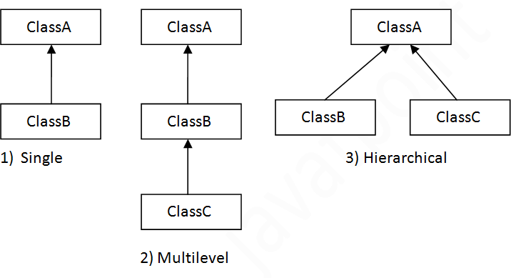

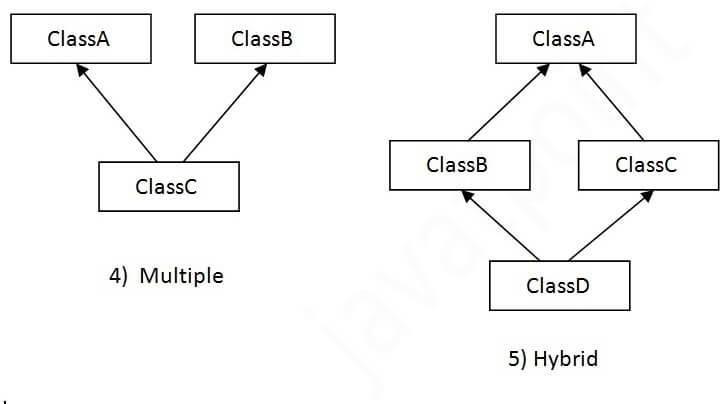

### Types of Inheritance explained:

**1. Single inheritance:** When one class inherits another class, it is known as single level inheritance

```java
class Shape {
    public void area() {
        System.out.println("Displays Area of Shape");
    }
}
class Triangle extends Shape { 

    public void area(int h, int b) {
        System.out.println((1/2)*b*h);
    }
}
```

**2. Hierarchical inheritance:** Hierarchical inheritance is defined as the process of deriving more than one class from a base class.

```java
class Shape {
    public void area() {
        System.out.println("Displays Area of Shape");
    }
}

class Triangle extends Shape { 

    public void area(int h, int b) {
        System.out.println((1/2)*b*h);
    }
}

class Circle extends Shape { 
    public void area(int r) {
        System.out.println((3.14)*r*r);
    }
}
```

**3. Multilevel inheritance:** Multilevel inheritance is a process of deriving a class from another derived class.

```java
class Shape {

    public void area() {
        System.out.println("Displays Area of Shape");
    }
}

class Triangle extends Shape { 
    public void area(int h, int b) {
        System.out.println((1/2)*b*h);
    }
}

class EquilateralTriangle extends Triangle { 
    int side;
}
```
**4. Hybrid inheritance:** Hybrid inheritance is a combination of simple, multiple inheritance and hierarchical inheritance.

## Polymorphism

Polymorphism is the ability to present the same interface for differing underlying forms (data types). With polymorphism, each of these classes will have different underlying data. Precisely, Poly means ‘many’ and morphism means ‘forms’.

### Types of Polymorphism IMP

1. Compile Time Polymorphism (Static)

2. Runtime Polymorphism (Dynamic)

**Compile Time Polymorphism**: The polymorphism which is implemented at the compile time is known as compile-time polymorphism. Example - Method Overloading

**Method Overloading**: Method overloading is a technique which allows you to have more than one function with the same function name but with different functionality. 

Method overloading can be possible on the following basis:

1. The return type of the overloaded function.

2. The type of the parameters passed to the function.

3. The number of parameters passed to the function.

**Code:**

```java
class Student { 

    String name; int age;
    
    public void displayInfo(String name) {
         System.out.println(name);
    }
    
    public void displayInfo(int age) {
         System.out.println(age);
    }
    public void displayInfo(String name, int age) {
         System.out.println(name); System.out.println(age);
    }
}
```

**Runtime Polymorphism:** Runtime polymorphism is also known as dynamic polymorphism. Function Overriding is an example of runtime polymorphism.

**Function Overriding** means when the child class contains the method which is already present in the parent class. Hence, **the child class overrides the method of the parent class.** In case of function overriding, parent and child classes both contain the same function with a different definition. The call to the function is determined at runtime is known as runtime polymorphism.

**Code:**

```java
class Shape {

    public void area() {
        System.out.println("Displays Area of Shape");
    }
}

class Triangle extends Shape { 
    
    public void area(int h, int b) {
        System.out.println((1/2)*b*h);
    }
}

class Circle extends Shape { 
    public void area(int r) {
        System.out.println((3.14)*r*r);
    }
} 
```

## Abstraction

Abstraction is a process of hiding the implementation details from the user, only the functionality will be provided to the user.

In other words, the user will have the information on what the object does instead of how it does it. In Java, abstraction is achieved using Abstract classes and interfaces.

### Abstraction is achieved in 2 ways:

- Abstract class

- Interfaces (Pure Abstraction)

**Abstract Class**

- An abstract class must be declared with an abstract keyword.

- It can have abstract and non-abstract methods.

- It cannot be instantiated.

- It can have constructors and static methods also.

- It can have final methods which will force the subclass not to change the body of the method.

**Code:**

```java
abstract class Animal { 

    abstract void walk(); 
    
    void breathe() {
        System.out.println("This animal breathes air");
    }

    Animal() {
        System.out.println("You are about to create an Animal.");
    }
}
class Horse extends Animal { 
    
    Horse() {
        System.out.println("Wow, you have created a Horse!");
    }
    
    void walk() {
        System.out.println("Horse walks on 4 legs");
    }
}
class Chicken extends Animal { 
    Chicken() {
        System.out.println("Wow, you have created a Chicken!");
    }
    void walk() {
        System.out.println("Chicken walks on 2 legs");
    }
}
public class OOPS {
    public static void main(String args[]) { 
        Horse horse = new Horse(); 
        horse.walk();
        horse.breathe();
    }
}
```

### Interfaces

- All the fields in interfaces are public, static and final by default.

- All methods are public & abstract by default.

- A class that implements an interface must implement all the methods declared in the interface.

- Interfaces support the functionality of multiple inheritance.

**Code:**

```java
interface Animal { 
    void walk();
}

class Horse implements Animal { 
    public void walk() {
        System.out.println("Horse walks on 4 legs");
    }
}

class Chicken implements Animal { 
    public void walk() {
        System.out.println("Chicken walks on 2 legs");
    }
}

public class OOPS {
    public static void main(String args[]) { 
        Horse horse = new Horse(); 
        horse.walk();
    }
}
```

## Encapsulation

Encapsulation is the process of combining data and functions into a single unit called class. In Encapsulation, the data is not accessed directly; it is accessed through the functions present inside the class. In simpler words, attributes of the class are kept private or public - getter and setter methods are provided to manipulate these attributes. Thus, encapsulation makes the concept of data hiding possible. (Data hiding: a language feature to restrict access to members of an object, reducing the negative effect due to dependencies. e.g., "protected", "private" feature in Java).

To achieve encapsulation in Java −

o Declare the variables of a class as private.

o Provide public setter and getter methods to modify and view the variables values.

**Code:**

```java
/* File name: EncapTest.java */
public class EncapTest { 
    
    private String name; 
    private String idNum; 
    private int age;

    public int getAge() { 
        return age;
    }
    public String getName() { 
        return name;
    }
    public String getIdNum() { 
        return idNum;
    }
    public void setAge( int newAge) { 
        age = newAge;
    }
    public void setName(String newName) { 
        name = newName;
    }
    public void setIdNum( String newId) { 
        idNum = newId;
    }
}
```

```java
/* The public setXXX() and getXXX() methods are the access points of the instance variables of the EncapTest class. Normally, these methods are referred as getters and setters. Therefore, any class that wants to access the variables should access them through these getters and setters. */
/* The variables of the EncapTest class can be accessed using the following program */
/* File name: RunEncap.java */

public class RunEncap {

    public static void main(String args[]) { 

        EncapTest encap = new EncapTest(); 
        encap.setName("James"); 
        encap.setAge(20); 
        encap.setIdNum("12343ms");
        System.out.print("Name: " + encap.getName() + " Age: " + encap.getAge());
    }
}
```

### Benefits of Encapsulation

o The fields of a class can be made read-only or write-only.

o A class can have total control over what is stored in its fields.

**Advantages of Encapsulation:**

- **Data Hiding**: The user will have no idea about the inner implementation of the class. It will not be visible to the user that how the class is storing values in the variables. He only knows that we are passing the values to a setter method and variables are getting initialized with that value.

- **Increased Flexibility**: We can make the variables of the class as read-only or write-only depending on our requirement. If we wish to make the variables as read-only then we have to omit the setter methods like setName(), setAge() etc. from the above program or if we wish to make the variables as write-only then we have to omit the get methods like getName(), getAge() etc. from the above program

- **Reusability**: Encapsulation also improves the re-usability and easy to change with new requirements.

- **Testing code is easy**: Encapsulated code is easy to test for unit testing.

## Java Package

A java package is a group of similar types of classes, interfaces and sub-packages. Package in java can be categorized in two form, built-in package and user-defined package.

There are many built-in packages such as java, lang, awt, javax, swing, net, io, util, sql etc.

Some of the existing packages in Java are −

These packages consist of a large number of classes which are a part of Java API.Some of the commonly used built-in packages are:

1. java.lang: Contains language support classes(e.g classed which defines primitive data types, math operations). This package is automatically imported.

2. java.io: Contains classed for supporting input / output operations.

3. java.util: Contains utility classes which implement data structures like Linked List, Dictionary and support; for Date / Time operations.

4. java.applet: Contains classes for creating Applets.

5. java.awt: Contain classes for implementing the components for graphical user interfaces (like button , ;menus etc).

6. java.net: Contain classes for supporting networking operations.

Here, we will have the detailed learning of creating and using user-defined packages. Programmers can define their own packages to bundle group of classes/interfaces, etc. It is a good practice to group related classes implemented by you so that a programmer can easily determine
that the classes, interfaces, enumerations, and annotations are related.

Since the package creates a new namespace there won't be any name conflicts with names in other packages. Using packages, it is easier to provide access control and it is also easier to locate the related classes.

Advantage of Java Package:

1. Java package is used to categorize the classes and interfaces so that they can be easily maintained.

2. Java package provides access protection.

3. Java package removes naming collision.

**Creating a Package**

While creating a package, you should choose a name for the package and include a package statement along with that name at the **top of every source file** that contains the classes, interfaces, enumerations, and annotation types that you want to include in the package.

The package statement should be the first line in the source file. There can be only **one package statement** in each source file, and it applies to all types in the file.

If a package statement is not used then the class, interfaces, enumerations, and annotation types will be placed in the current default package.

To compile the Java programs with package statements, you have to use **-d** option as shown below.

**Simple example of java package**

The package keyword is used to create a package in java.

```java
//save as Simple.java package mypack; 
public class Simple{
    public static void main(String args[]){ 
        System.out.println("Welcome to package");
    }
}
```
**How to compile java package**

You need to follow the syntax given below: 

```java
javac -d directory javafilename
```

**For example** 

```java
javac -d . Simple.java
```
The **-d** switch specifies the destination where to put the generated class file. You can use any directory name like /home (in case of Linux), d:/abc (in case of windows) etc. If you want to keep the package within the **same directory**, you **can use. (dot).**

**How to run java package program**

You need to use fully qualified name e.g., mypack.Simple etc to run the class.

**To Compile:** 

```java
javac -d . Simple.java
```

**To Run:** 

```java
java mypack.Simple
```

### How to access package from another package?
There are three ways to access the package from outside the package.

1. import package.*;

2. import package.classname;

3. fully qualified name.

- **Using packagename.***

If you use `package.*` then all the classes and interfaces of this package will be accessible but not subpackages.

The import keyword is used to make the classes and interface of another package accessible to the current package.
Example of package that import the packagename.*

**Example of package that import the `packagename.*`**

```java
//save by A.java 
package pack; 

public class A{
    public void msg(){
        System.out.println("Hello");
    }
}

//save by B.java 
package mypack; 
import pack.*;

class B{
    public static void main(String args[]){ 
        A obj = new A();
        obj.msg();
    }
}
```

- **Using packagename.classname**

If you import package.classname then only declared class of this package will be accessible.

**Example of package by import package.classname**

```java
//save by A.java
package pack; 
public class A{
    public void msg(){
        System.out.println("Hello");
    }
}

//save by B.java 
package mypack; 
import pack.A;
class B{
    public static void main(String args[]){
        A obj = new A();
        obj.msg();
    }
}
```

- **Using fully qualified name**

If you use fully qualified name then only declared class of this package will be accessible. Now there is no need to import. But you need to use fully qualified name every time when you are accessing the class or interface.

It is generally used when two packages have same class name e.g. java.util and java.sql packages contain Date class.

**Example of package by import fully qualified name**

```java
//save by A.java 
package pack; 
public class A{
    public void msg(){
        System.out.println("Hello");
    }
}

//save by B.java 
package mypack; 
class B{
    public static void main(String args[]){
        pack.A obj = new pack.A();//using fully qualified name 
        obj.msg();
    }
}
```

**Note**: If you import a package, subpackages will not be imported.

If you import a **package**, all the classes and interface of that package will be **imported excluding the classes and interfaces** of the subpackages. Hence, you need to import the subpackage as well. 

## Subpackage in java

Package inside the package is called the **subpackage**. It should be created **to categorize the package further**.

Let's take an example, Sun Microsystem has defined a package named java that contains many classes like System, String, Reader, Writer, Socket etc. These classes represent a particular group e.g., Reader and Writer classes are for Input/Output operation, Socket and ServerSocket classes are for networking etc and so on.

“So, Sun has subcategorized the java package into subpackages such as **lang, net, io** etc. and put the **Input/Output** related classes in **io** package, **Server** and **ServerSocket** classes in **net** packages and so on.”

The standard of defining package is domain.company.package e.g., com.javatpoint.bean or org.sssit.dao

## Access Modifiers in Java

There are two types of modifiers in Java: access modifiers and non-access modifiers.

The access modifiers in Java specifies the accessibility or scope of a field, method, constructor, or class. We can change the access level of fields, constructors, methods, and class by applying the access modifier on it.

There are four types of Java access modifiers:

1. Private: The access level of a private modifier is only within the class. It cannot be accessed from outside the class.

2. Default: The access level of a default modifier is only within the package. It cannot be accessed from outside the package. If you do not specify any access level, it will be the default.

3. Protected: The access level of a protected modifier is within the package and outside the package through child class. If you do not make the child class, it cannot be accessed from outside the package.

4. Public: The access level of a public modifier is everywhere. It can be accessed from within the class, outside the class, within the package and outside the package.

There are many non-access modifiers, such as static, abstract, synchronized, native, volatile, transient, etc.

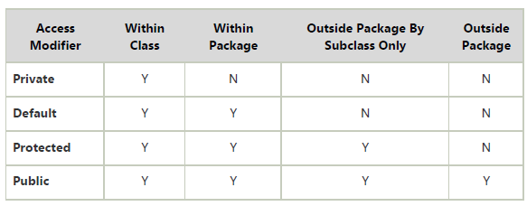

## Method in Java

In general, a method is a way to perform some task. Similarly, the method in Java is a collection of instructions that performs a specific task. It provides the reusability of code. We can also easily modify code using methods.

A method is a block of code or collection of statements or a set of code grouped together to perform a certain task or operation. It is used to achieve the reusability of code. We write a method once and use it many times. We do not require to write code again and again. It also provides the easy modification and readability of code, just by adding or removing a chunk of code. The method is executed only when we call or invoke it.

### Method Declaration

The method declaration provides information about method attributes, such as visibility, return- type, name, and arguments. It has six components that are known as method header, as we have shown in the following figure.

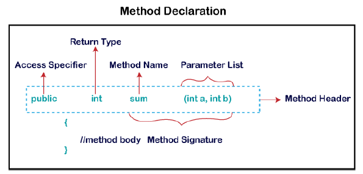

**Method Signature**: Every method has a method signature. It is a part of the method declaration. It includes the method name and parameter list.

**Access Specifier**: Access specifier or modifier is the access type of the method. It specifies the visibility of the method. Java provides four types of access specifier:

o Public: The method is accessible by all classes when we use public specifier in our application.

o Private: When we use a private access specifier, the method is accessible only in the classes in which it is defined.

o Protected: When we use protected access specifier, the method is accessible within the same package or subclasses in a different package.

o Default: When we do not use any access specifier in the method declaration, Java uses
default access specifier by default. It is visible only from the same package only.

**Return Type**: Return type is a data type that the method returns. It may have a primitive data type, object, collection, void, etc. If the method does not return anything, we use void keyword.

**Method Name**: It is a unique name that is used to define the name of a method. It must be corresponding to the functionality of the method. Suppose, if we are creating a method for subtraction of two numbers, the method name must be subtraction(). A method is invoked by its name.

**Parameter List**: It is the list of parameters separated by a comma and enclosed in the pair of parentheses. It contains the data type and variable name. If the method has no parameter, left the parentheses blank.

**Method Body**: It is a part of the method declaration. It contains all the actions to be performed. It is enclosed within the pair of curly braces.

**Naming a Method**

While defining a method, remember that the method name must be a verb and start with a lowercase letter. If the method name has more than two words, the first name must be a verb followed by adjective or noun. In the multi-word method name, the first letter of each word must be in uppercase except the first word. For example:

**Single-word method name**: sum(), area()

**Multi-word method name**: areaOfCircle(), stringComparision()

It is also possible that a method has the same name as another method name in the same class, it is known as method overloading.

## Types of Method

There are two types of methods in Java:

o Predefined Method

o User-defined Method 

### Predefined Method

In Java, predefined methods are the method that is already defined in the Java class libraries is known as predefined methods. It is also known as the standard library method or built-in method. We can directly use these methods just by calling them in the program at any point. Some pre-defined methods are length(), equals(), compareTo(), sqrt(), etc. When we call any of the predefined methods in our program, a series of codes related to the corresponding method runs in the background that is already stored in the library.

Each and every predefined method is defined inside a class. Such as print() method is defined in the java.io.PrintStream class. It prints the statement that we write inside the method. For example, print("Java"), it prints Java on the console.

### User-defined Method

The method written by the user or programmer is known as a user-defined method. These methods are modified according to the requirement.

**“How to Create a User-defined Method**

Let's create a user defined method that checks the number is even or odd. First, we will define the method.”

```java
//user defined method
public static void findEvenOdd(int num)
{
//method body
if(num%2==0) System.out.println(num+" is even"); else
System.out.println(num+" is odd");
}
```

**“How to Call or Invoke a User-defined Method**

Once we have defined a method, it should be called. The calling of a method in a program is simple. When we call or invoke a user-defined method, the program control transfer to the called method.”

```java
import java.util.Scanner;
public class EvenOdd
{
public static void main (String args[])
{
//creating Scanner class object Scanner scan=new Scanner(System.in); System.out.print("Enter the number: ");
//reading value from the user
int num=scan.nextInt();
//method calling findEvenOdd(num);
}
```

In the above code snippet, as soon as the compiler reaches at line findEvenOdd(num), the control transfer to the method and gives the output accordingly. 

## Static Method

A method that has static keyword is known as static method. In other words, a method that belongs to a class rather than an instance of a class is known as a static method. We can also create a static method by using the keyword static before the method name.

The main advantage of a static method is that we can call it without creating an object. It can access static data members and also change the value of it. It is used to create an instance method. It is invoked by using the class name. The best example of a static method is the main() method.

**Example of static method** 

**Display.java**

```java
public class Display
{
public static void main(String[] args)
{
show();
}
static void show()
{
System.out.println("It is an example of static method.");
}
}
```

## Instance Method

The method of the class is known as an instance method. It is a non-static method defined in the class. Before calling or invoking the instance method, it is necessary to create an object of its class. Let's see an example of an instance method.

**InstanceMethodExample.java**

```java
public class InstanceMethodExample
{
public static void main(String [] args)
{
//Creating an object of the class
InstanceMethodExample obj = new InstanceMethodExample();
//invoking instance method System.out.println("The sum is: "+obj.add(12, 13));
}
int s;
//user-defined method because we have not used static keyword public int add(int a, int b)
{
s = a+b;
//returning the sum return s;
}
}
```

**There are two types of instance method:**

o Accessor Method

o Mutator Method

**Accessor Method**: The method(s) that reads the instance variable(s) is known as the accessor method. We can easily identify it because the method is prefixed with the word get. It is also known as getters. It returns the value of the private field. It is used to get the value of the private field.

Example

```java
public int getId()
{
return Id;
}
```

**Mutator Method**: The method(s) read the instance variable(s) and also modify the values. We can
easily identify it because the method is prefixed with the word set. It is also known as setters or modifiers. It does not return anything. It accepts a parameter of the same data type that depends on the field. It is used to set the value of the private field.

Example

```java
public void setRoll(int roll)
{
this.roll = roll;
}
```

**Example of accessor and mutator method**

 Student.java

 ```java
 public class Student
{
private int roll; private String name;
public int getRoll() //accessor method
{
return roll;
}
public void setRoll(int roll) //mutator method
{
this.roll = roll;
}
public String getName()
{
return name;
}
public void setName(String name)
{
    this.name = name;
}
public void display()
{
System.out.println("Roll no.: "+roll); System.out.println("Student name: "+name);
}
}
 ```

 ## Abstract Method

The method that does not has method body is known as abstract method. In other words, without an implementation is known as abstract method. It always declares in the abstract class. It means the class itself must be abstract if it has abstract method. To create an abstract method, we use the keyword abstract.

Syntax
```java
abstract void method_name();
```

**Example of abstract method**

Demo.java
```java
abstract class Demo //abstract class
{
//abstract method declaration abstract void display();
}
public class MyClass extends Demo
{
//method impelmentation void display()
{
System.out.println("Abstract method?");
}
public static void main(String args[])
{
//creating object of abstract class Demo obj = new MyClass();
//invoking abstract method obj.display();
}
}
```

## Factory method

It is a method that returns an object to the class to which it belongs. All static methods are factory methods. 

For example, 
```java
NumberFormat obj = NumberFormat.getNumberInstance();
```

## Java main() method

The main() is the starting point for JVM to start execution of a Java program. Without the main() method, JVM will not execute the program. 

The syntax of the main() method is:

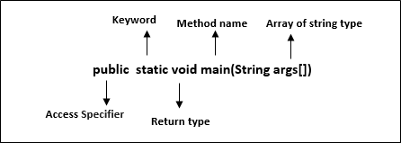

**public**: It is an access specifier. We should use a public keyword before the main() method so that JVM can identify the execution point of the program. If we use private, protected, and default before the main() method, it will not be visible to JVM.

**static**: You can make a method static by using the keyword static. We should call the main() method without creating an object. Static methods are the method which invokes without creating the objects, so we do not need any object to call the main() method.

**void**: In Java, every method has the return type. Void keyword acknowledges the compiler that main() method does not return any value.

**main()**: It is a default signature which is predefined in the JVM. It is called by JVM to execute a program line by line and end the execution after completion of this method. We can also overload the main() method.

**String args[]**: The main() method also accepts some data from the user. It accepts a group of strings, which is called a string array. It is used to hold the command line arguments in the form of string values.

```java
main(String args[])
```

Here, agrs[] is the array name, and it is of String type. It means that it can store a group of string. Remember, this array can also store a group of numbers but in the form of string only. Values passed to the main() method is called arguments. These arguments are stored into args[] array, so the name args[] is generally used for it.

**What happens if the main() method is written without String args[]?**

The program will compile, but not run, because JVM will not recognize the main() method. Remember JVM always looks for the main() method with a string type array as a parameter.

**Execution Process**

First, JVM executes the static block, then it executes static methods, and then it creates the object needed by the program. Finally, it executes the instance methods. JVM executes a static block on the highest priority basis. It means JVM first goes to static block even before it looks for the main() method in the program.

Example
```java
class
Demo
{
static      //static block
{
    System.out.println("Static block");
}
public static void main(String args[]) //static method
    {
    System.out.println("Static method");
    }
}
```

We observe that JVM first executes the static block, if it is present in the program. After that it searches for the main() method. If the main() method is not found, it gives error.

**Example**

A program that does not have the main() method gives an error at run time.

```java
class
Demo StaticBlock
{
Static
//static
block
{
System.out.println("Static
block");
}
}
```

Output:
```java
Error: Main method not found in the class Demo, please define the main method as:
public static void main(String[] args)
or a JavaFX application class must extend javafx.application.Application
```

**So the main() method should always be written as:**

```java
public static void main(String args[])
```

We can interchange public and static and write it as follows:
```java
static public void main(String args[])
```

We can also use the different name for the String type array and write it as:

```java
static public void main(String[] x)
```

Different ways of writing main() method are:
```java
static public void main(String []x) 
static public void main(String...args)
```

**String...args**: It allows the method to accept zero or multiple arguments. There should be exactly three dots between String and array; otherwise, it gives an error.

A program that has no main() method, but compile and runs successfully.

```java
abstract class DemoNoMain extends javafx.application.Application
{
static //static block
{
System.out.println("Java"); System.exit(0);
}
}
```

# Unicode System

Unicode is a universal international standard character encoding that is capable of representing most of the world's written languages.

## Why java uses Unicode System?

Before Unicode, there were many language standards:

o ASCII (American Standard Code for Information Interchange) for the United States.

o ISO 8859-1 for Western European Language.

o KOI-8 for Russian.

o GB18030 and BIG-5 for Chinese, and so on.

## Problem

This caused two problems:

1. A particular code value corresponds to different letters in the various language standards.

2. The encodings for languages with large character sets have variable length.

3. Some common characters are encoded as single bytes, other require two or more byte.

## Solution

To solve these problems, a new language standard was developed i.e. Unicode System.

In unicode, character holds 2 byte, so java also uses 2 byte for characters.

**lowest value**:\u0000

**highest value**:\uFFFF

# Private Constructor in Java

Java allows us to declare a constructor as private. We can declare a constructor private by using the private access specifier. Note that if a constructor is declared private, we are not able to create an object of the class. Instead, we can use this private constructor in Singleton Design Pattern.

## Rules for Private Constructor

The following rules keep in mind while dealing with private constructors.
o It does not allow a class to be sub-classed.

o It does not allow to create an object outside the class.

o If a class has a private constructor and when we try to extend the class, a compile-time error occurs.

o We cannot access a private constructor from any other class.

o If all the constant methods are there in our class, we can use a private constructor.

## Use Cases of Private Constructor

The main purpose of using a private constructor is to restrict object creation. We also use private constructors to implement the singleton design pattern. The use-cases of the private constructor are as follows:

o It can be used with static members-only classes.

o It can be used with static utility or constant classes.

o It can also be used to create singleton classes.

o It can be used to assign a name, for instance, creation by utilizing factory methods.

o It is also used to avoid sub-classing.

# Object Cloning in Java

The object cloning is a way to create exact copy of an object. The clone() method of Object class is used to clone an object.
The java.lang.Cloneable interface must be implemented by the class whose object clone we want to create. If we don't implement Cloneable interface, clone() method generates CloneNotSupportedException.

## Why use clone() method ?

The clone() method saves the extra processing task for creating the exact copy of an object. If we perform it by using the new keyword, it will take a lot of processing time to be performed that is why we use object cloning.

## Advantage of Object cloning
o You don't need to write lengthy and repetitive codes. Just use an abstract class with a 4- or 5-line long clone() method.

o It is the easiest and most efficient way for copying objects, especially if we are applying it to an already developed or an old project.

o Clone() is the fastest way to copy array.

## Disadvantage of Object cloning

o To use the Object.clone() method, we have to change a lot of syntaxes to our code, like implementing a Cloneable interface, defining the clone() method and handling CloneNotSupportedException, and finally, calling Object.clone() etc.

o We have to implement cloneable interface while it doesn't have any methods in it.

# Java Database Connectivity with 5 Steps

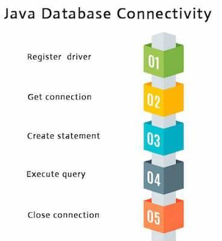

## 1) Register the driver class

The forName() method of Class class is used to register the driver class. This method is used to dynamically load the driver class.

**Syntax of forName() method**

```java
public static void forName(String className)throws ClassNotFound Exception
```
## 2) get connection object
The getConnection() method of DriverManager class is used to establish connection with the database.

**Syntax of getConnection() method**

```java
public static Connection getConnection(String url)throws SQLException

public static Connection getConnection(String url,String name,Stri ng password) throws SQLException
```

## 3) Create the Statement object

The createStatement() method of Connection interface is used to create statement. The object of statement is responsible to execute queries with the database.

**Syntax of createStatement() method**

```java
public Statement createStatement()throws SQLException
```

## 4) Execute the query

The executeQuery() method of Statement interface is used to execute queries to the database. This method returns the object of ResultSet that can be used to get all the records of a table.

**Syntax of executeQuery() method**

```java
public ResultSet executeQuery(String sql)throws SQLException
```

## 5) Close the connection object

By closing connection object statement and ResultSet will be closed automatically. The close() method of Connection interface is used to close the connection.

**Syntax of close() method**

```java
public void close()throws SQLException
```

# Java Backend Devloper Road Map

