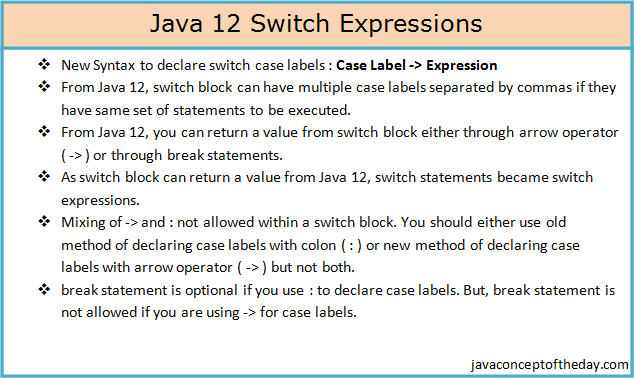

# Java 12 Switch Expressions

Switch statements in Java have been evolved over the different versions of Java. Till Java 7, only primitive types like int, byte, char… are allowed to use as case labels in switch statements. From Java 7 onward, strings, wrapper classes and enums are allowed to use in switch statements. Extended switch statements or switch expressions are introduced in Java 12. Later in Java 13, yield statements are added. Both Java 12 and Java 13 features have been introduced as preview features and from Java 14, they are made permanent. Pattern matching is the latest addition to switch statements from Java 17. In this post, we limit our discussion to Java 12 switch expressions. Remaining features will be covered in the subsequent posts.



## Before Java 12 : Switch Statements

Below is the enum Months which we will be using in the subsequent coding examples in this post.

```java
enum months 
{ 
    JANUARY, FEBRUARY, MARCH, 
    APRIL, MAY, JUNE, 
    JULY, AUGUST, SEPTEMBER, 
    OCTOBER, NOVEMBER, DECEMBER 
}
```

Below is the simple example which demonstrates how switch statements are used before Java 12. It takes enum type Months as parameter and prints First Quarter or Second Quarter or Third Quarter or Fourth Quarter depending upon the passed month.

```java
var month = months.APRIL;
         
switch (month) 
{
    case JANUARY : 
            System.out.println("First Quarter"); 
            break;
 
    case FEBRUARY : 
            System.out.println("First Quarter"); 
            break;
             
    case MARCH : 
            System.out.println("First Quarter"); 
            break;
                 
    case APRIL : 
            System.out.println("Second Quarter"); 
            break;
                 
    case MAY : 
            System.out.println("Second Quarter"); 
            break;
             
    case JUNE : 
            System.out.println("Second Quarter"); 
            break;
             
    case JULY : 
            System.out.println("Third Quarter"); 
            break;
                 
    case AUGUST : 
            System.out.println("Third Quarter"); 
            break;
                 
    case SEPTEMBER : 
            System.out.println("Third Quarter"); 
            break;
             
    case OCTOBER : 
            System.out.println("Fourth Quarter"); 
            break;
             
    case NOVEMBER : 
            System.out.println("Fourth Quarter"); 
            break;
             
    case DECEMBER : 
            System.out.println("Fourth Quarter"); 
            break;
                 
    default:
            System.out.println("Invalid Month");
            break;
}
```

Or you can also write like below.

```java
var month = months.APRIL;
         
String message = "";
         
switch (month) 
{
    case JANUARY : 
                         
    case FEBRUARY : 
                         
    case MARCH : message = "First Quarter"; 
                 break;
                         
    case APRIL : 
                         
    case MAY : 
                     
    case JUNE : message = "Second Quarter";
                break;
                     
    case JULY : 
                         
    case AUGUST : 
                         
    case SEPTEMBER : message = "Third Quarter";
                     break;
                     
    case OCTOBER : 
                         
    case NOVEMBER : 
                         
    case DECEMBER : message = "Fourth Quarter";
                    break;
                         
    default: message = "Invalid Month";
                       break;
}
         
System.out.println(message);
```

You can notice that break statements are used for every case label. This ensures that subsequent case clauses are not executed if the given value equals with the case label. What happens if you forgot to write break statements for one or two case clauses. The program will not show any error but you will not get desired output. This has been addressed in Java 12 thorough switch expressions.

## Java 12 Switch Expressions

### 1) Case Label -> Expression

From Java 12, new syntax has been introduced to declare switch case labels. This syntax resembles to Java 8 lambda expressions. Below is the syntax,

```java
Case Label -> Expression;
```

Using this syntax, break statements has been eliminated from switch blocks and hence there is no question of arising fall through issues.

Using Java 12 new case label syntax, above example can be written as follows,

```java
var month = months.APRIL;
         
switch (month) 
{
    case JANUARY -> System.out.println("First Quarter"); 
 
    case FEBRUARY -> System.out.println("First Quarter"); 
             
    case MARCH -> System.out.println("First Quarter"); 
                 
    case APRIL -> System.out.println("Second Quarter");
                 
    case MAY -> System.out.println("Second Quarter"); 
             
    case JUNE -> System.out.println("Second Quarter");
             
    case JULY -> System.out.println("Third Quarter");
                 
    case AUGUST -> System.out.println("Third Quarter");
                 
    case SEPTEMBER -> System.out.println("Third Quarter");
             
    case OCTOBER -> System.out.println("Fourth Quarter");
             
    case NOVEMBER -> System.out.println("Fourth Quarter");
             
    case DECEMBER -> System.out.println("Fourth Quarter");
                 
    default -> System.out.println("Invalid Month");
}
```

### 2) Multiple case labels

From Java 12, switch block can have multiple case labels separated by commas if they have same set of statements to be executed. For example, above code can be modified as below.

```java
var month = months.APRIL;
         
switch (month) 
{
    case JANUARY, FEBRUARY, MARCH -> System.out.println("First Quarter"); 
                                 
    case APRIL, MAY, JUNE -> System.out.println("Second Quarter"); 
                 
    case JULY, AUGUST, SEPTEMBER -> System.out.println("Third Quarter"); 
                 
    case OCTOBER, NOVEMBER, DECEMBER -> System.out.println("Fourth Quarter"); 
     
    default -> System.out.println("Invalid Month");
}
```

### 3) Returning value from switch block

From Java 12, you can return a value from switch block and hence, from Java 12, switch statements became switch expressions. You can return value either through arrow operator ( -> ) or through break statements. 

**Returning value through arrow operator ( -> ) :**

```java
var month = months.APRIL;
         
String message = switch (month) 
{
    case JANUARY, FEBRUARY, MARCH -> "First Quarter";
                                 
    case APRIL, MAY, JUNE -> "Second Quarter"; 
                 
    case JULY, AUGUST, SEPTEMBER -> "Third Quarter"; 
                 
    case OCTOBER, NOVEMBER, DECEMBER -> "Fourth Quarter"; 
     
    default -> "Invalid Month";
};
         
System.out.println(message);
```

**Returning value through break statements :**

```java
var month = months.APRIL;
         
String message = switch (month) 
{
    case JANUARY, FEBRUARY, MARCH : break "First Quarter";
                                 
    case APRIL, MAY, JUNE : break "Second Quarter"; 
                 
    case JULY, AUGUST, SEPTEMBER : break "Third Quarter"; 
                 
    case OCTOBER, NOVEMBER, DECEMBER : break "Fourth Quarter"; 
     
    default : break "Invalid Month";
};
         
System.out.println(message);
```

## Rules To Follow While Using Java 12 Switch Expressions :

1) Mixing of -> and : not allowed within a switch block. You should either use old method of declaring case labels with colon ( : ) or new method of declaring case labels with arrow operator ( -> ) but not both.

Declaring case labels with colon ( : )

```java
switch (month) 
{
    case JANUARY, FEBRUARY, MARCH : System.out.println("First Quarter"); break;
                                 
    case APRIL, MAY, JUNE : System.out.println("Second Quarter"); break;
                 
    case JULY, AUGUST, SEPTEMBER : System.out.println("Third Quarter"); break;
                 
    case OCTOBER, NOVEMBER, DECEMBER : System.out.println("Fourth Quarter"); break;
     
    default : System.out.println("Invalid Month"); break;
}
```

Declaring case labels with arrow operator ( -> )

```java
switch (month) 
{
    case JANUARY, FEBRUARY, MARCH -> System.out.println("First Quarter"); 
                                         
    case APRIL, MAY, JUNE -> System.out.println("Second Quarter"); 
                         
    case JULY, AUGUST, SEPTEMBER -> System.out.println("Third Quarter"); 
                         
    case OCTOBER, NOVEMBER, DECEMBER -> System.out.println("Fourth Quarter"); 
             
    default -> System.out.println("Invalid Month");
}
```

Above two examples works fine. But, below code shows error as : and -> can’t be mixed.

```java
//Compile Time Error : Mixing of different kinds of case statements '->' and ':' is not allowed within a switch
 
switch (month) 
{
    case JANUARY, FEBRUARY, MARCH -> System.out.println("First Quarter"); 
                                         
    case APRIL, MAY, JUNE -> System.out.println("Second Quarter"); 
                         
    case JULY, AUGUST, SEPTEMBER : System.out.println("Third Quarter"); 
                         
    case OCTOBER, NOVEMBER, DECEMBER -> System.out.println("Fourth Quarter"); 
             
    default : System.out.println("Invalid Month");
}
```

2) break statement is optional if you use : to declare case labels. But, break statement is not allowed if you are using -> for case labels.

```java
switch (month) 
{
    //Compile time error as break can't be used with ->
 
    case JANUARY, FEBRUARY, MARCH -> System.out.println("First Quarter"); break;  
         
    case APRIL, MAY, JUNE -> System.out.println("Second Quarter"); 
             
    case JULY, AUGUST, SEPTEMBER -> System.out.println("Third Quarter"); 
             
    case OCTOBER, NOVEMBER, DECEMBER -> System.out.println("Fourth Quarter"); 
 
    default -> System.out.println("Invalid Month");
}
```

## Java 12 New String Methods

Four more new methods are introduced in Java 12. They are – indent(), transform(), describeConstable() and resolveConstantDesc().

**indent() :**

This method applies indentation for each line of the given string according to supplied value.

```java
public class Java12StringMethods 
{
    public static void main(String[] args) 
    {
        System.out.println("123\nabc\nABC".indent(4));
    }
}

Output :

123
abc
ABC
```

**transform() :**

This method applies given Function to the string.

```java
public class Java12StringMethods 
{
    public static void main(String[] args) 
    {
        System.out.println("string".transform(String::toUpperCase));
         
        System.out.println("abc".transform(str -> str.concat("xyz"))
                                .transform(String::toUpperCase));
    }
}

Output :

STRING
ABCXYZ
```

From Java 12, String class implements two more interfaces – Constable and ConstantDesc. From these two interfaces, String class inherits two more methods – describeConstable() from Constable and resolveConstantDesc() from ConstantDesc.

**describeConstable() :**

This method returns an Optional containing nominal descriptor for the given string, which is the string itself.

```java
public class Java12StringMethods 
{
    public static void main(String[] args) 
    {
        System.out.println("123".describeConstable().get());
        System.out.println("abc".describeConstable().get());
        System.out.println("ABC".describeConstable().get());
    }
}

Output :

123
abc
ABC
```
**resolveConstantDesc() :**

This method resolves the given string as ConstantDesc and returns the string itself.

```java
import java.lang.invoke.MethodHandles;
 
public class Java12StringMethods 
{
    public static void main(String[] args) 
    {
        System.out.println("Java".resolveConstantDesc(MethodHandles.lookup()));
        System.out.println("Python".resolveConstantDesc(MethodHandles.lookup()));
        System.out.println("JavaScript".resolveConstantDesc(MethodHandles.lookup()));
    }
}

Output :

Java
Python
JavaScript
```

## Files.mismatch() Method

Added to compare two files.

```java
Path file1 = Path.of("a.txt");
Path file2 = Path.of("b.txt");

long pos = Files.mismatch(file1, file2);
```

Return value:

- -1 → files are identical

- otherwise → position where mismatch occurs

## JVM Constants API
New API in package:

```java
java.lang.invoke.constant
```

Used for representing class-file constants at runtime.

Example:

```java
ClassDesc
MethodTypeDesc
DynamicConstantDesc
```

Mainly used by framework developers and JVM tools.

## Shenandoah Garbage Collector (Experimental)

Java 12 added support for the Shenandoah Garbage Collector.

Purpose:

- Low pause time GC

- Designed for large heap applications.

## Default CDS Archives

Improvement in Class Data Sharing (CDS) for faster JVM startup.

Benefits:

- Reduced memory usage

- Faster application startup.

## Microbenchmark Suite

Java 12 introduced a microbenchmark suite for JVM performance testing.

This helps developers benchmark JVM features.