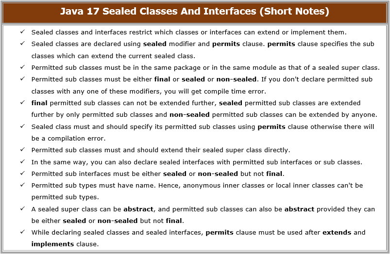

# Java 17 New Features

Java SE 17 was released in September 2021 and it is a Long-Term Support (LTS) version after Java SE 11.
Many companies use Java 17 in production because of its stability and modern features.

## Java 17 Sealed Classes And Interfaces – Short Notes

In Java 17, a new type of classes and interfaces are introduced to have a control over the inheritance. They are sealed classes and sealed interfaces. Using this feature you can control which class can extend or implement a particular class or an interface. These sealed classes and interfaces are implemented using sealed, non-sealed and permits keywords. These are the new keywords in Java introduced from Java 17. These sealed classes and interfaces are introduced in Java 15 itself but as a preview feature. From Java 17, they have made permanent. Let’s see Java 17 sealed classes and interfaces in detail.



## Java 17 Sealed Classes And Interfaces
Sealed classes and interfaces restrict which classes or interfaces can extend or implement them. It gives control to the author of a class or an interface to declare which classes or interfaces can extend or implement or modify or reuse their work. Sealed classes and interfaces can be extended or implemented by only permitted classes and interfaces. Let’s see one by one.

1) Sealed classes are declared using sealed modifier and permits clause. permits clause specifies the sub classes which can extend the current sealed class.

```java
package Java17Concepts;
 
sealed class SuperClass permits SubClassOne, SubClassTwo
{
    //Sealed Super Class
}
 
final class SubClassOne extends SuperClass
{
    //Final Sub Class
}
 
final class SubClassTwo extends SuperClass
{
    //Final Sub Class
}
```

2) Permitted sub classes must be in the same package or in the same module as that of a sealed super class.

3) Permitted sub classes must be either final or sealed or non-sealed. If you don’t declare permitted sub classes with any one of these modifiers, you will get compile time error.

```java
package Java17Concepts;
 
sealed class SuperClass permits SubClassOne, SubClassTwo, SubClassThree
{
    //Sealed Super Class
}
 
final class SubClassOne extends SuperClass
{
    //Final Sub Class
}
 
sealed class SubClassTwo extends SuperClass permits AnotherSubClass
{
    //Sealed Sub Class permitting another sub class to extend it further
}
 
non-sealed class SubClassThree extends SuperClass
{
    //non-sealed sub class
}
 
final class AnotherSubClass extends SubClassTwo
{
    //Final sub class of SubClassTwo
}
```

4) final permitted sub classes can not be extended further, sealed permitted sub classes are extended further by only permitted sub classes and non-sealed permitted sub classes can be extended by anyone.

5) Sealed class must and should specify its permitted sub classes using permits clause otherwise there will be a compilation error.

```java
sealed class AnyClass 
{
    //Compile Time Error : Sealed class must specify permitted sub classes
}
```

6) Permitted sub classes must and should extend their sealed super class directly.

```java
package Java17Concepts;
 
sealed class SuperClass permits SubClassOne, SubClassTwo
{
    //Sealed Super Class
}
 
final class SubClassOne 
{
    //Compile Time Error : It must extend SuperClass
}
 
non-sealed class SubClassTwo 
{
    //Compile Time Error : It must extend SuperClass
}
```

7) In the same way, you can also declare sealed interfaces with permitted sub interfaces or sub classes.

```java
package Java17Concepts;
 
sealed interface SealedInterface permits SubInterface, SubClass
{
    //Sealed Super Interface
}
 
non-sealed interface SubInterface extends SealedInterface
{
    //Non-sealed Sub Interface
}
 
non-sealed class SubClass implements SealedInterface
{
    //Non-sealed sub class
}
```

8) Permitted sub interfaces must be either sealed or non-sealed but not final.

```java
package Java17Concepts;
 
sealed interface SealedInterface permits SubInterfaceOne, SubInterfaceTwo, SubInterfaceThree
{
    //Sealed Super Interface
}
 
sealed interface SubInterfaceOne extends SealedInterface permits SubClass
{
    //Sealed Sub Interface
}
 
non-sealed class SubClass implements SubInterfaceOne
{
    //non-sealed sub class implementing SubInterfaceOne
}
 
non-sealed interface SubInterfaceTwo extends SealedInterface
{
    //Non-sealed Sub Interface
}
 
final interface SubInterfaceThree extends SealedInterface
{
    //Compile time Error : Permitted sub interface must not be final
}
```

9) Permitted sub types must have name. Hence, anonymous inner classes or local inner classes can’t be permitted sub types.

10) A sealed super class can be abstract, and permitted sub classes can also be abstract provided they can be either sealed or non-sealed but not final.

```java
package Java17Concepts;
 
abstract sealed class SuperClass permits SubClassOne, SubClassTwo, SubClassThree
{
    //Super class can be abstract and Sealed
}
 
abstract final class SubClassOne extends SuperClass
{
    //Compile Time Error : Sub class can't be final and abstract
}
 
abstract non-sealed class SubClassTwo extends SuperClass
{
    //Sub class can be abstract and Non-sealed
}
 
abstract sealed class SubClassThree extends SuperClass permits AnotherSubClass
{
    //Sub class can be abstract and Sealed
}
 
final class AnotherSubClass extends SubClassThree
{
    //Final sub class of SubClassThree
}
```

11) While declaring sealed classes and sealed interfaces, permits clause must be used after extends and implements clause.

12) With the introduction of sealed classes, two more methods are added to java.lang.Class (Reflection API). They are getPermittedSubclasses() and isSealed().

Benefits

✅ Better control over inheritance
✅ Improves security and design
✅ Works well with pattern matching

## Pattern Matching for switch (Preview)

Java 17 introduced pattern matching in switch statements.

Example

```java
static String test(Object obj) {
    return switch (obj) {
        case Integer i -> "Integer value: " + i;
        case String s -> "String value: " + s;
        default -> "Unknown type";
    };
}
```

Benefits:

- Cleaner type checking

- Less casting

- More readable code

## New macOS Rendering Pipeline

Java 17 introduced a new macOS rendering pipeline using Apple Metal API.

Benefits:

- Better graphics performance

- Replaces old OpenGL pipeline

## Strongly Encapsulated JDK Internals

Java 17 strongly restricts access to internal JDK APIs.

Example restricted packages:

```java
sun.*
jdk.*
```
Benefits:

- Better security

- Prevents misuse of internal APIs

## Enhanced Pseudo-Random Number Generators

Java 17 introduced a new random number generator interface.

Example:

```java
RandomGenerator generator = RandomGenerator.of("L64X128MixRandom");
int num = generator.nextInt();
```

Benefits:

- Better performance

- Better randomness algorithms

## Deprecate Security Manager

Java 17 deprecated the Security Manager.

Earlier used for:

- sandboxing

- controlling application permissions

Now modern security methods are preferred.

## Foreign Function & Memory API (Incubator)

Allows Java programs to interact with native code outside JVM.

Example use cases:

- calling C/C++ libraries

- high-performance computing

- replacing JNI.