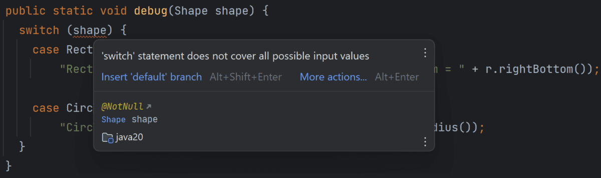

# Pattern Matching for switch (Fourth Preview) – JEP 433

Pattern Matching for switch (Fourth Preview) – JEP 433 (Java 20) is a major evolution of the switch statement. It allows you to match types + patterns, not just constant values.

Java 20 provides a refined version of pattern matching for switch expressions and statements, specifically about the grammar used in switch expressions. It was first delivered in Java 17 and allows us to write a switch statement like the following:

```java
Object obj = getObject();

switch (obj) {
  case String s when s.length() > 5 -> System.out.println(s.toUpperCase());
  case String s                     -> System.out.println(s.toLowerCase());
  case Integer i                    -> System.out.println(i * i);
  case Pos(int x, int y)            -> System.out.println(x + "/" + y);
  default                           -> {}
}
```

The main changes in this release include:

- Using a switch expression or a pattern over an enum class now throws a MatchException. Earlier, we used to get an IncompatibleClassChangeError if no switch label was applied at run time.

- There are improvements in the grammar for switch labels.

- They have added support for type-inference of arguments for generic record patterns in switch expressions and statements, along with the other constructs that support patterns.

## With JDK Enhancement Proposal 433, the following changes were made in Java 20:

### 1. Type Patterns in switch
Earlier, switch worked only with primitives, enums, and Strings.

Now you can switch on any object type.

✅ Example

```java
static String formatter(Object obj) {
    return switch (obj) {
        case Integer i -> "Integer: " + i;
        case String s -> "String: " + s;
        case Double d -> "Double: " + d;
        default -> "Unknown type";
    };
}
```

🔍 What’s happening?

- Integer i → type pattern (match + cast)

- No need for manual casting

### 2. Dominance (Important Rule)
Order matters. More specific cases must come first.

❌ Wrong

```java
case Object o -> "Any object";
case String s -> "String"; // ❌ unreachable
```

✅ Correct

```java
case String s -> "String";
case Object o -> "Any object";
```

### 3. null Handling in switch

Before: switch → NullPointerException

Now: You can explicitly handle null.

✅ Example

```java
static String check(Object obj) {
    return switch (obj) {
        case null -> "It's null";
        case String s -> "String: " + s;
        default -> "Other";
    };
}
```

### 4. Guarded Patterns (when clause)
You can add conditions to patterns.

✅ Example

```java
static String checkNumber(Object obj) {
    return switch (obj) {
        case Integer i when i > 0 -> "Positive integer";
        case Integer i when i < 0 -> "Negative integer";
        case Integer i -> "Zero";
        default -> "Not an integer";
    };
}
```

🔍 Key Point

- when acts like an inline if condition

- Improves readability vs nested if

### 5. Pattern Variable Scope

Pattern variables are only available in their case block.

✅ Example

```java
case String s -> {
    System.out.println(s.length()); // valid
}
```
But not outside the case.

### 6. Exhaustiveness (Very Important)
For switch expression, all cases must be covered.

✅ Example

```java
sealed interface Shape permits Circle, Rectangle {}

final class Circle implements Shape {}
final class Rectangle implements Shape {}

static int area(Shape shape) {
    return switch (shape) {
        case Circle c -> 1;
        case Rectangle r -> 2;
    };
}
```

🔍 Why no default?

Because compiler knows all possible subclasses → sealed classes

### 7. Sealed Classes + Switch (Power Combo)

This makes switch type-safe and exhaustive

✅ Example

```java
sealed interface Payment permits CreditCard, UPI {}

final class CreditCard implements Payment {}
final class UPI implements Payment {}

static String process(Payment p) {
    return switch (p) {
        case CreditCard c -> "Processing card";
        case UPI u -> "Processing UPI";
    };
}
```

### 8. default vs Total Patterns

If all types are covered → no default needed.

But if not:

```java
default -> "Fallback";
```

### 9. Fall-through is NOT allowed (Arrow syntax)

Pattern matching uses -> (no fall-through bugs)

✅ Example

```java
case Integer i -> ...
case String s -> ...
```

### 10. Record Patterns (Preview synergy)

Works well with records (though fully in later JEPs)

Example (conceptual)

```java
record Point(int x, int y) {}

static String check(Object obj) {
    return switch (obj) {
        case Point(int x, int y) -> "Point: " + x + "," + y;
        default -> "Other";
    };
}
```

### 11. Improved Readability vs Old Code

❌ Old Style

```java
if (obj instanceof String) {
    String s = (String) obj;
}
```

✅ New Style

```java
case String s -> ...
```

### Real-World Example (Best for Interview)

```java
static String process(Object input) {
    return switch (input) {
        case null -> "No input";
        case Integer i when i > 100 -> "Large number";
        case Integer i -> "Small number";
        case String s when s.isEmpty() -> "Empty string";
        case String s -> "Text: " + s;
        default -> "Unknown";
    };
}
```

## difference between instanceof vs pattern switch

switch with pattern matching is more declarative, safer, and compiler-checked compared to imperative instanceof chains.

✅ Old Way (instanceof)

```java
static String process(Object obj) {
    if (obj instanceof String s) {
        return "String: " + s;
    } else if (obj instanceof Integer i) {
        return "Integer: " + i;
    }
    return "Unknown";
}
```

✅ New Way (Pattern switch)

```java
static String process(Object obj) {
    return switch (obj) {
        case String s -> "String: " + s;
        case Integer i -> "Integer: " + i;
        default -> "Unknown";
    };
}
```


### MatchException for Exhausting Switch

An exhaustive switch (i.e., a switch that includes all possible values) throws a MatchException (rather than an IncompatibleClassChangeError) if it is determined at runtime that no switch label matches.

That can happen if we subsequently extend the code but only recompile the changed classes. The best way to show this is with an example:

Using the Position record from the “Record Patterns” chapter, we define a sealed interface Shape with the implementations Rectangle and Circle:

```java
public sealed interface Shape permits Rectangle, Circle {}

public record Rectangle(Position topLeft, Position bottomRight) implements Shape {}

public record Circle(Position center, int radius) implements Shape {}
```

In addition, we write a ShapeDebugger that prints different debug information depending on the Shape implementation:

```java
public class ShapeDebugger {
  public static void debug(Shape shape) {
    switch (shape) {
      case Rectangle r -> System.out.println(
        "Rectangle: top left = " + r.topLeft() + "; bottom right = " + r.bottomRight());

      case Circle c -> System.out.println(
        "Circle: center = " + c.center() + "; radius = " + c.radius());
    }
  }
}
```

Since the compiler knows all possible implementations of the sealed Shape interface, it can ensure that this switch expression is exhaustive.

We call the ShapeDebugger with the following program:

```java
public class Main {
  public static void main(String[] args) {
    var rectangle = new Rectangle(new Position(10, 10), new Position(50, 50));
    ShapeDebugger.debug(rectangle);

    var circle = new Circle(new Position(30, 30), 10);
    ShapeDebugger.debug(circle);
  }
}
```

We compile the code as follows and run the Main class:

```java
$ javac --enable-preview --source 20 *.java
$ java --enable-preview Main

Rectangle: top left = Position[x=10, y=10]; bottom right = Position[x=50, y=50]
Circle: center = Position[x=30, y=30]; radius = 10
```

Then we add another shape Oval, add it to the permits list of the Shape interface, and extend the main program:

```java
public sealed interface Shape permits Rectangle, Circle, Oval {}

public record Oval(Position center, int width, int height) implements Shape {}

public class Main {
  public static void main(String[] args) {
    var rectangle = new Rectangle(new Position(10, 10), new Position(50, 50));
    ShapeDebugger.debug(rectangle);

    var circle = new Circle(new Position(30, 30), 10);
    ShapeDebugger.debug(circle);

    var oval = new Oval(new Position(60, 60), 20, 10);
    ShapeDebugger.debug(oval);
  }
}
```

If we do this in an IDE, it will immediately tell us that the switch statement in the ShapeDebugger does not cover all possible values:



However, if we work without an IDE, recompile only the changed classes and then start the main program, the following happens:

$ javac --enable-preview --source 20 Shape.java Oval.java Main.java
$ java --enable-preview Main

```java
Rectangle: top left = Position[x=10, y=10]; bottom right = Position[x=50, y=50]
Circle: center = Position[x=30, y=30]; radius = 10
Exception in thread "main" java.lang.MatchException
        at ShapeDebugger.debug(ShapeDebugger.java:3)
        at Main.main(Main.java:10)
```

The Java Runtime Environment throws a MatchException because the switch statement in the ShapeDebugger has no label for the Oval class.

The same can happen with an exhaustive switch expression over the values of an enum if we subsequently extend the enum.

### Inference of Type Arguments for Generic Record Patterns
As with the previously discussed record patterns with instanceof, the compiler can now also infer the type arguments of generic records in switch statements.

Previously, we had to write a switch statement (based on the example classes from the "Record Patterns" chapter) as follows:

```java
Multi<String> multi = ...

switch(multi) {
  case Tuple<String>(var s1, var s2) ->  System.out.println(
          "Tuple: " + s1 + ", " + s2);

  case Triple<String>(var s1, var s2, var s3) ->  System.out.println(
          "Triple: " + s1 + ", " + s2 + ", " + s3);

  ...
}
```

starting with Java 20, we can omit the <String> type arguments inside the switch statement:

```java
switch(multi) {
  case Tuple(var s1, var s2) ->  System.out.println(
          "Tuple: " + s1 + ", " + s2);

  case Triple(var s1, var s2, var s3) ->  System.out.println(
          "Triple: " + s1 + ", " + s2 + ", " + s3);

  ...
}
```