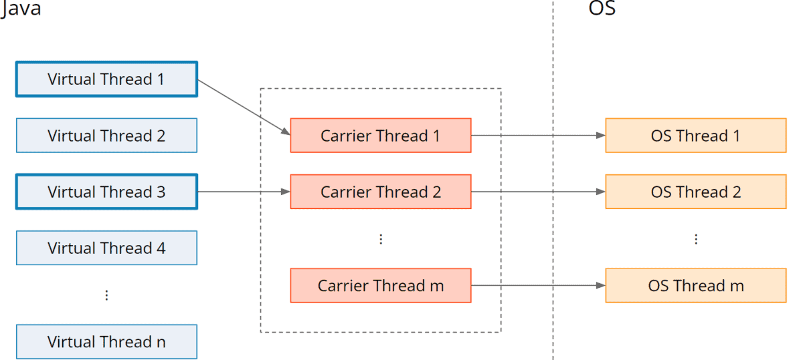
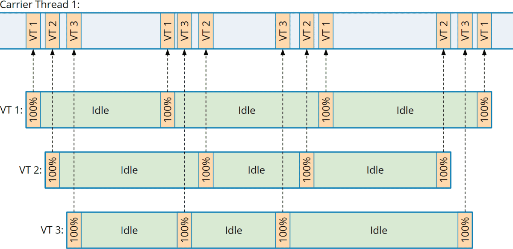

# Vertual Thread
Virtual threads are one of the most important innovations in Java for a long time. They were developed in Project Loom and have been included in the JDK since Java 19 as a preview feature and since Java 21 as a final version (JEP 444).

## Why Do We Need Virtual Threads?

Anyone who has ever maintained a backend application under heavy load knows that threads are often the bottleneck. For every incoming request, a thread is needed to process the request. One Java thread corresponds to one operating system thread, and those are resource-hungry:

An OS thread reserves 1 MB for the stack and commits 32 or 64 KB of it upfront, depending on the operating system.
It takes about 1ms to start an OS thread.
Context switches take place in kernel space and are quite CPU-intensive.
You should not start more than a few thousand; otherwise, you risk the stability of the entire system.

However, a few thousand are not always enough – especially if it takes longer to process a request because of the need to wait for blocking data structures, such as queues, locks, or external services like databases, microservices, or cloud APIs.

For example, if a request takes two seconds and we limit the thread pool to 1,000 threads, then a maximum of 500 requests per second could be answered. However, the CPU would be far from being utilized since it would spend most of its time waiting for responses from the external services, even if several threads are served per CPU core.

So far, we have only been able to overcome this problem with asynchronous programming – for example, with CompletableFuture or reactive frameworks like RxJava and Project Reactor.

However, anyone who has had to maintain code like the following knows that reactive code is many times more complex than sequential code – and absolutely no fun.

```java
public CompletionStage<Response> getProduct(String productId) {
  return productService
      .getProductAsync(productId)
      .thenCompose(
          product -> {
            if (product.isEmpty()) {
              return CompletableFuture.completedFuture(
                  Response.status(Status.NOT_FOUND).build());
            }

            return warehouseService
                .isAvailableAsync(productId)
                .thenCompose(
                    available ->
                        available
                            ? CompletableFuture.completedFuture(0)
                            : supplierService.getDeliveryTimeAsync(
                                product.get().supplier(), productId))
                .thenApply(
                    daysUntilShippable ->
                        Response.ok(
                                new ProductPageResponse(
                                    product.get(), daysUntilShippable))
                            .build());
          });
}
```

Not only is this code hard to read and maintain, but it is also extremely difficult to debug. For example, it would make no sense to set a breakpoint here because the code only defines the asynchronous flow but does not execute it. The business code will be executed in a separate thread pool at a later time.

In addition, the database drivers and drivers for other external services must also support the asynchronous, non-blocking model.

## What Are Virtual Threads?

Virtual threads solve the problem in a way that again allows us to write easily readable and maintainable code. Virtual threads feel like normal threads from a Java code perspective, but they are not mapped 1:1 to operating system threads.

Instead, there is a pool of so-called carrier threads onto which a virtual thread is temporarily mapped ("mounted"). As soon as the virtual thread encounters a blocking operation, the virtual thread is removed ("unmounted") from the carrier thread, and the carrier thread can execute another virtual thread (a new one or a previously blocked one).

The following figure depicts this M:N mapping from virtual threads to carrier threads and thus to operating system threads:

Mapping from virtual threads to carrier threads to operating system threads:


The carrier thread pool is a ForkJoinPool – that is, a pool where each thread has its own queue and “steals” tasks from other threads' queues should its own queue be empty. Its size is set by default to Runtime.getRuntime().availableProcessors() and can be adjusted with the VM option jdk.virtualThreadScheduler.parallelism.

Over the course of time, the CPU activity of three tasks, for example, each executing code four times and blocking three times for a relatively long period in between, could be mapped to a single carrier thread as follows:

Mapping three virtual threads to one carrier thread:


Blocking operations thus no longer block the executing carrier thread, and we can process a large number of requests concurrently using a small pool of carrier threads.

We could then implement the example use case from above quite simply like this:

```java
public ProductPageResponse getProduct(String productId) {
  Product product = productService.getProduct(productId)
      .orElseThrow(NotFoundException::new);

  boolean available = warehouseService.isAvailable(productId);

  int shipsInDays =
     available ? 0 : supplierService.getDeliveryTime(product.supplier(), productId);

  return new ProductPageResponse(product, shipsInDays);
}
```

This code is not only easier to write and read but also – like any sequential code – to debug by conventional means.

If your code already looks like this – i.e., you never switched to asynchronous programming, then I have good news: you can continue to use your code unchanged with virtual threads.

## Virtual Threads – Example
We can also demonstrate the power of virtual threads without a backend framework. To do this, we simulate a scenario similar to the one described above: we start 1,000 tasks, each of which waits one second (to simulate access to an external API) and then returns a result (a random number in the example).

First, we implement the task:

```java
public class Task implements Callable<Integer> {

  private final int number;

  public Task(int number) {
    this.number = number;
  }

  @Override
  public Integer call() {
    System.out.printf(
        "Thread %s - Task %d waiting...%n", Thread.currentThread().getName(), number);

    try {
      Thread.sleep(1000);
    } catch (InterruptedException e) {
      System.out.printf(
          "Thread %s - Task %d canceled.%n", Thread.currentThread().getName(), number);
      return -1;
    }

    System.out.printf(
        "Thread %s - Task %d finished.%n", Thread.currentThread().getName(), number);
    return ThreadLocalRandom.current().nextInt(100);
  }
}
```

Now we measure how long it takes a pool of 100 platform threads (which is how non-virtual threads are referred to) to process all 1,000 tasks:

```java
try (ExecutorService executor = Executors.newFixedThreadPool(100)) {
  List<Task> tasks = new ArrayList<>();
  for (int i = 0; i < 1_000; i++) {
    tasks.add(new Task(i));
  }

  long time = System.currentTimeMillis();

  List<Future<Integer>> futures = executor.invokeAll(tasks);

  long sum = 0;
  for (Future<Integer> future : futures) {
    sum += future.get();
  }

  time = System.currentTimeMillis() - time;

  System.out.println("sum = " + sum + "; time = " + time + " ms");
}
```

```java
ExecutorService is auto-closeable since Java 19, i.e. it can be surrounded with a try-with-resources block. At the end of the block, ExecutorService.close() is called, which in turn calls shutdown() and awaitTermination() – and possibly shutdownNow() should the thread be interrupted during awaitTermination().
```

The program runs for a little over 10 seconds. That was to be expected:

1,000 tasks divided by 100 threads = 10 tasks per thread

Each platform thread had to process ten tasks sequentially, each lasting about one second.

Next, we test the whole thing with virtual threads. Therefore, we only need to replace the statement

```java
Executors.newFixedThreadPool(100)
```
by:

```java
Executors.newVirtualThreadPerTaskExecutor()
```

This executor does not use a thread pool but creates a new virtual thread for each task.

After that, the program no longer needs 10 seconds but only just over one second. It can hardly be faster because every task waits one second.

Impressive: even 10,000 tasks can be processed by our little program in just over a second.

Only at 100,000 tasks does the throughput drop noticeably: my laptop needs about four seconds for this – which is still blazingly fast compared to the thread pool, which would need almost 17 minutes for this.

## How to Create Virtual Threads?
We have already learned about one way to create virtual threads: An executor service that we create with Executors.newVirtualThreadPerTaskExecutor() creates one new virtual thread per task.

Using Thread.startVirtualThread() or Thread.ofVirtual().start(), we can also explicitly start virtual threads:

```java
Thread.startVirtualThread(() -> {
  // code to run in thread
});

Thread.ofVirtual().start(() -> {
  // code to run in thread
});
```

In the second variant, Thread.ofVirtual() returns a VirtualThreadBuilder whose start() method starts a virtual thread. The alternative method Thread.ofPlatform() returns a PlatformThreadBuilder via which we can start a platform thread.

Both builders implement the Thread.Builder interface. This allows us to write flexible code that decides at runtime whether it should run in a virtual or in a platform thread:

```java
Thread.Builder threadBuilder = createThreadBuilder();
threadBuilder.start(() -> {
  // code to run in thread
});
```

By the way, you can find out if code is running in a virtual thread with Thread.currentThread().isVirtual().

## How Many Virtual Threads Can Be Started?

With the class HowManyVirtualThreadsDoingSomething you can test how many virtual threads you can run on your system. The application starts more and more threads and performs Thread.sleep() operations in these threads in an infinite loop to simulate waiting for a response from a database or an external API. Try to give the program as much heap memory as possible with the VM option -Xmx.

On my 64 GB machine, 20,000,000 virtual threads could be started without any problems – and with a little patience, even 30,000,000. From then on, the garbage collector tried to perform full GCs non-stop – because the stack of virtual threads is “parked” on the heap, in so-called StackChunk objects, as soon as a virtual thread blocks. Shortly after, the application terminated with an OutOfMemoryError.

With the class HowManyPlatformThreadsDoingSomething you can also test how many platform threads your system supports. But be warned: Most of the time the program ends with an OutOfMemoryError at some point (between 80,000 and 90,000 threads for me) – but it can also crash your computer.

```java
package eu.happycoders.virtualthreads.presentation;

import java.time.Duration;
import java.util.concurrent.atomic.AtomicLong;

public class HowManyVirtualThreadsDoingSomething {

  // Activate GC logging: -Xlog:gc*
  // jmap -histo <pid>

  private static final int NUMBER_OF_VIRTUAL_THREADS = 1_000_000_000;
  private static final int PRINT_STEP = Math.min(NUMBER_OF_VIRTUAL_THREADS / 10, 100_000);

  public static void main(String[] args) throws InterruptedException {
    AtomicLong runningThreadsCounter = new AtomicLong();

    long startTime = System.currentTimeMillis();

    for (int i = 1; i <= NUMBER_OF_VIRTUAL_THREADS; i++) {
      Thread.ofVirtual()
          .start(
              () -> {
                runningThreadsCounter.incrementAndGet();
                HowManyThreadsHelper.doSomething();
              });

      if (i % PRINT_STEP == 0) {
        long runningThreads = runningThreadsCounter.get();
        long time = System.currentTimeMillis() - startTime;
        System.out.printf(
            "%,d virtual threads started, %,d virtual threads running after %,d ms%n",
            i, runningThreads, time);

        if (i - runningThreads > 200_000) {
          HowManyThreadsHelper.waitForVirtualThreadsToCatchUp(i, runningThreadsCounter, startTime);
        }
      }
    }

    HowManyThreadsHelper.waitForVirtualThreadsToCatchUp(
        NUMBER_OF_VIRTUAL_THREADS, runningThreadsCounter, startTime);

    // Sleep, so we can look at the memory usage
    Thread.sleep(Duration.ofHours(1));
  }
}
```

## How to Use Virtual Threads With Jakarta EE?

The example method from the beginning of this article would look like the following as a Jakarta RESTful Webservices Controller – first without virtual threads:

```java
@GET
@Path("/product/{productId}")
public ProductPageResponse getProduct(@PathParam("productId") String productId) {
  Product product = productService.getProduct(productId)
      .orElseThrow(NotFoundException::new);

  boolean available = warehouseService.isAvailable(productId);

  int shipsInDays =
     available ? 0 : supplierService.getDeliveryTime(product.supplier(), productId);

  return new ProductPageResponse(product, shipsInDays);
}
```

Now, to run this controller on a virtual thread, we just need to add a single line, with the annotation @RunOnVirtualThread:

```java
@GET
@Path("/product/{productId}")
@RunOnVirtualThread
public ProductPageResponse getProduct(@PathParam("productId") String productId) {
  Product product = productService.getProduct(productId)
      .orElseThrow(NotFoundException::new);

  boolean available = warehouseService.isAvailable(productId);

  int shipsInDays =
     available ? 0 : supplierService.getDeliveryTime(product.supplier(), productId);

  return new ProductPageResponse(product, shipsInDays);
}
```

We did not have to change a single character in the method body.

## How to Use Virtual Threads With Quarkus?

Quarkus already supports the @RunOnVirtualThread annotation defined in Jakarta EE 11 since version 2.10 - i.e. since June 2022. So with a current Quarkus version, you can already use the code shown above.

a sample Quarkus application with the controller shown above – one with platform threads, one with virtual threads and also an asynchronous variant with CompletableFuture. The README explains how to start the application and how to invoke the three controllers.

## How to Use Virtual Threads With Spring?

In Spring, the controller would look like this:

```java
@GetMapping("/stage1-seq/product/{productId}")
public ProductPageResponse getProduct(@PathVariable("productId") String productId) {
  Product product =
      productService
          .getProduct(productId)
          .orElseThrow(() -> new ResponseStatusException(NOT_FOUND));

  boolean available = warehouseService.isAvailable(productId);

  int shipsInDays =
      available ? 0 : supplierService.getDeliveryTime(product.supplier(), productId);

  return new ProductPageResponse(product, shipsInDays);
}
```

However, to switch to virtual threads, you need to do things a little differently. According to the Spring documentation, you have to define the following two beans:

```java
@Bean(TaskExecutionAutoConfiguration.APPLICATION_TASK_EXECUTOR_BEAN_NAME)
public AsyncTaskExecutor asyncTaskExecutor() {
  return new TaskExecutorAdapter(Executors.newVirtualThreadPerTaskExecutor());
}

@Bean
public TomcatProtocolHandlerCustomizer<?> protocolHandlerVirtualThreadExecutorCustomizer() {
  return protocolHandler -> {
    protocolHandler.setExecutor(Executors.newVirtualThreadPerTaskExecutor());
  };
}
```

However, this results in all controllers running on virtual threads, which may be fine for most use cases, but not for CPU-heavy tasks – those should always run on platform threads.

## Advantages of Virtual Threads
Virtual threads offer impressive advantages:

First, they are inexpensive:

- They can be created much faster than platform threads: it takes about 1 ms to create a platform thread, and less than 1 µs to create a virtual thread.

- They require less memory: a platform thread reserves 1 MB for the stack and commits 32 to 64 KB up front, depending on the operating system. A virtual thread starts with about one KB. However, this is true only for flat call stacks. A call stack the size of a half megabyte requires that half megabyte in both thread variants.

- Blocking virtual threads is cheap because a blocked virtual thread does not block an OS thread. However, it's not free as its stack needs to be copied to the heap.

- Context switches are fast because they are performed in user space, not kernel space, and numerous optimizations have been made in the JVM to make them faster.

Second, we can use virtual threads in a familiar way:

- Only minimal changes have been made to the Thread and ExecutorService APIs.

- Instead of writing asynchronous code with callbacks, we can write code in the traditional blocking thread-per-request style.

- We can debug, observe, and profile virtual threads with existing tools.

## What Are Virtual Threads Not?

Virtual threads don't have only advantages, of course. Let's first look at what virtual threads are not, and what we cannot or should not do with them:

- Virtual threads are not faster threads – they cannot execute more CPU instructions than a platform thread in the same amount of time. If a task does not block, it will even – due to the overhead of mounting/unmounting – run slower on a virtual thread than on an existing platform thread from an ExecutorService.

- They are not preemptive: while a virtual thread is executing a CPU-intensive task, it is not unmounted from the carrier thread. So if you have 20 carrier threads and 20 virtual threads that occupy the CPU without blocking, no other virtual thread will be executed.

- They do not provide a higher level of abstraction than platform threads. You need to be aware of all the subtle things that you also need to be aware of when using regular threads. That is, if a virtual thread accesses shared data, you have to take care of visibility issues, you have to synchronize atomic operations, and so on.

## What Are the Limitations of Virtual Threads?
You should know about the following limitations. Many of them will be removed in future Java versions:

### 1. Unsupported Blocking Operations
Although the vast majority of blocking operations in the JDK have been rewritten to support virtual threads, there are still operations that do not unmount a virtual thread from the carrier thread:

- File I/O – this will also be adapted in the near future

- Object.wait()

In these two cases, a blocked virtual thread will also block the carrier thread. To compensate for this, both operations temporarily increase the number of carrier threads – up to a maximum of 256 threads, which can be changed via the VM option jdk.virtualThreadScheduler.maxPoolSize.

### 2. Pinning
Pinning means that a blocking operation that would normally unmount a virtual thread from its carrier thread does not do so because the virtual thread has been “pinned” to its carrier thread – meaning that it is not allowed to change the carrier thread. This happens in two cases:

- inside a synchronized block (solved in Java 24)

- if the call stack contains calls to native code

There are two primary reasons for pinning:

**Reason 1: Pointers to Memory Addresses on the Stack**

In both cases, there may be pointers to memory addresses on the stack. In the case of a synchronized block and when using “legacy stack locking” (the standard locking mechanism up to and including Java 21), the so-called “mark word” in the object header points to a separate lock data structure on the stack.

And we cannot control what happens within native code.

If the stack gets parked on the heap when unmounted and moved back onto the stack when mounted, it could end up at a different memory address. And that would invalidate those pointers.

Starting with Java 23, the new “lightweight locking” became the standard locking mechanism. This does not require pointers on the stack.

**Reason 2: Tracking of the Platform Thread**

In addition, the JVM tracks which platform thread currently holds which object monitor when using synchronized. If a virtual thread now enters a synchronized block, is blocked and unmounted from the carrier thread, and then another virtual thread is mounted on this carrier thread, then this other virtual thread could also enter the synchronized block.

This mechanism will be changed in Java 24.

** Detecting and Preventing Pinning**

Using the VM option **-Djdk.tracePinnedThread=full/short** you can get a full/short stack trace when a virtual thread blocks while pinned.

You can replace a synchronized block around blocking operation with a ReentrantLock.

### 3. No Locks in Thread Dumps

Thread dumps currently do not contain data about locks held by or blocking virtual threads. Accordingly, they do not show deadlocks between virtual threads or between a virtual thread and a platform thread.

## Thread Dumps With Virtual Threads
The conventional thread dumps printed via jcmd <pid> Thread.print do not contain virtual threads. The reason for that is that this command stops the VM to create a snapshot of the running threads. This is feasible for a few hundred or even a few thousand threads, but not for millions of them.

Therefore, a new variant of thread dump has been implemented that does not stop the VM (accordingly, the thread dump may not be consistent in itself) but which includes virtual threads in return. This new thread dump can be created with one of these two commands:

```java
jcmd <pid> Thread.dump_to_file -format=plain <file>
jcmd <pid> Thread.dump_to_file -format=json <file>
```

The first command generates a thread dump similar to the traditional one, with thread names, IDs and stack traces. The second command generates a file in JSON format that also contains information about thread containers, parent containers, and owner threads.

## When Should You Use Virtual Threads?

You should use virtual threads if you have many tasks to be processed concurrently, which primarily contain blocking operations.

This is true for most server applications. However, if your server application handles CPU-intensive tasks, you should use platform threads for them.

## What Else Is Important to Consider?
Here are a few tips on using and migrating to virtual threads:

- Virtual threads are new, and we don't have much experience with them yet, compared to asynchronous or reactive frameworks. So you should test applications with virtual threads intensively before deploying them in production.

- Even though many articles about virtual threads would have us believe this: they do not inherently use less memory than a platform thread. This is only the case if the call stack is shallow. With deep call stacks, both types of threads consume the same amount of memory. So the same applies here: test intensively!

- Virtual threads do not need to be pooled. A pool is used to share expensive resources. Virtual threads, on the other hand, are so cheap that it is better to create one when you need it and let it terminate when you no longer need it.

- If you need to limit access to a resource, such as how many threads can access a database or API at the same time, use a semaphore instead of a thread pool.

- Much of the virtual thread code is written in Java. Accordingly, you must warm up the JVM before running performance tests so that all bytecode is compiled and optimized before the measurement begins.

## Summary
Virtual threads deliver what they promise: they allow us to write readable and maintainable sequential code that does not block operating system threads when waiting for locks, blocking data structures, or responses from the file system or external services.

Virtual threads can be created in the order of millions.

Common backend frameworks such as Spring and Quarkus can already handle virtual threads. Nevertheless, you should test applications intensively when you flip the switch to virtual threads. Make sure that you do not, for example, execute CPU-intensive computing tasks on them, that they are not pooled by the framework, and that no ThreadLocals are stored in them