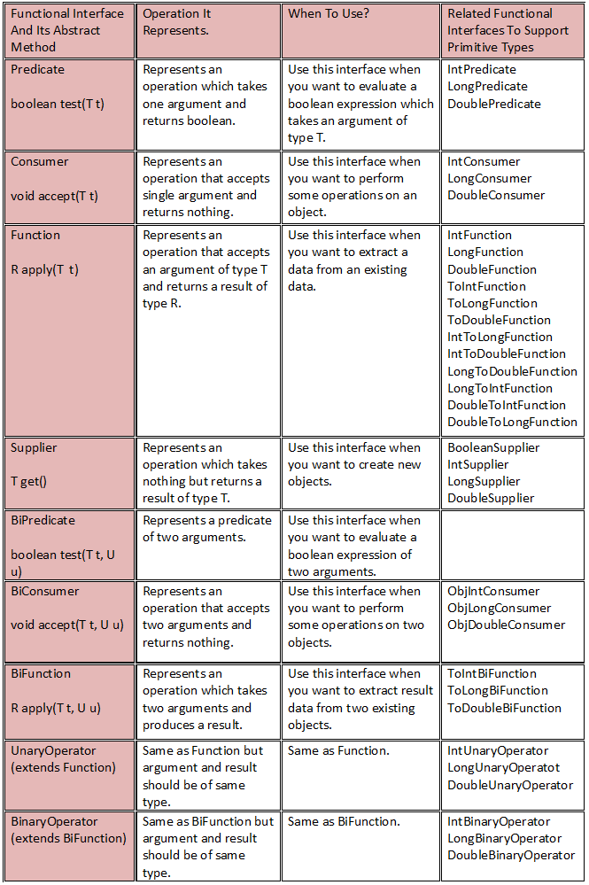

# Java 8 Interview Questions and Answers

## After Java 8, what do you think about Java? Is it still an object oriented language or it has turned into functional programming language?

Java is still an object oriented language where everything is done keeping objects (data) in mind. But, with the introduction of new features in Java 8, you can use Java as a functional programming language also. You can treat it as as an added advantage over the other languages which are either object oriented or functions oriented. From Java 8, you can use Java either in an object-oriented programming paradigm or in a functional programming paradigm. It supports both.

## What are the three main features of Java 8 which make Java as a functional programming language?

Lambda expressions, functional interfaces and Stream API are the three main features of Java 8 which enables developers to write functional style of programming in Java also.

## What are lambda expressions? How this feature has changed the way you write code in Java? Explain with some before Java 8 and after Java 8 examples?

Lambda Expressions can be defined as methods without names i.e anonymous functions. Like methods, they also have parameters, a body, a return type and possible list of exceptions that can be thrown. But unlike methods, neither they have names nor they are associated with any particular class.

Lambda expressions are used where an instance of functional interface is expected. Before Java 8, anonymous inner classes are used for this purpose. After Java 8, you can use lambda expressions to implement functional interfaces.

These lambda expressions have changed the style of programming in Java significantly. They have made the Java code more clear, concise and readable than before. For example,

Below code shows how Comparator interface is implemented using anonymous inner class before Java 8.

```java
Comparator<Student> idComparator = new Comparator<Student>() {
            @Override
            public int compare(Student s1, Student s2) {
                return s1.getID()-s2.getID();
            }
        };
```

and after Java 8, above code can be written in a single line using Java 8 lambda expressions as below.

```java
	
Comparator<Student> idComparator = (Student s1, Student s2) -> s1.getID()-s2.getID();

```

Another example,

Implementation of Runnable interface using anonymous inner class before Java 8 :

```java
Runnable r = new Runnable() {   
            @Override
            public void run() {
                System.out.println("Runnable Implementation Using Anonymous Inner Class");
            }
        };
```

Implementation of Runnable interface using lambda expressions after Java 8 :

```java
Runnable r = () -> System.out.println("Runnable Implementation Using Lambda Expressions");
```

## How the signature of lambda expressions are determined?

The signature of lambda expressions are derived from the signature of abstract method of functional interface. For example,
run() method of Runnable interface accepts nothing and returns nothing. Then signature of lambda expression implementing Runnable interface will be () -> void.

compare() method of Comparator interface takes two arguments of type Object and returns int. Then signature of lambda expression for implementing Comparator interface will be (Object, Object) -> int.

## 5) How the compiler determines the return type of a lambda expression?

Compiler uses target type to check the return type of a lambda expression.

For example,

```java
	
Runnable r = () -> System.out.println("Runnable Implementation Using Lambda Expressions");
```

In this example, target type of lambda expression is Runnable. Compiler uses run() method of Runnable interface to check the return type of lambda expression.

## Can we use non-final local variables inside a lambda expression?

No. Only final local variables are allowed to use inside a lambda expressions just like anonymous inner classes.

## 7) What are the advantages of lambda expressions?

Lambda expressions let you to write more clear, concise and readable code.

Lambda expressions removes verbosity and repetition of code.

## What are the functional interfaces? Do they exist before Java 8 or they are the whole new features introduced in Java 8?

Functional interfaces are the interfaces which has exactly one abstract method. Functional interfaces provide only one functionality to implement.

There were functional interfaces exist before Java 8. It is not like that they are the whole new concept introduced only in Java 8. Runnable, ActionListener, Callable and Comaprator are some old functional interfaces which exist even before Java 8.

The new set of functional interfaces are introduced in Java 8 for writing lambda expressions. Lambda expressions must implement any one of these new functional interfaces.

## What are the new functional interfaces introduced in Java 8? In which package they have kept in?

Below is the list of new functional interfaces introduced in Java 8. They have kept in java.util.function package.



## What is the difference between Predicate and BiPredicate?

Predicate is a functional interface which represents a boolean operation which takes one argument.

BiPredicate is also functional interface but it represents a boolean operation which takes two arguments.

## What is the difference between Function and BiFunction?

Function is a functional interface which represents an operation which takes one argument of type T and returns result of type R.

BiFunction is also functional interface which represents an operation which takes two arguments of type T and U and returns a result of type R.

## Which functional interface do you use if you want to perform some operations on an object and returns nothing?

Consumer

## Which functional interface is the best suitable for an operation which creates new objects?

Supplier

## When you use UnaryOperator and BinaryOperator interfaces?

UnaryOperator performs same operation as Function but it is used when type of the argument and result should be of same type.

BinaryOperator performs same operation as BiFunction but it is used when type of the arguments and result should be of same type.

## Along with functional interfaces which support object types, Java 8 has introduced functional interfaces which support primitive types. For example, Consumer for object types and intConsumer, LongConsumer, DoubleConsumer for primitive types. What do you think, is it necessary to introduce separate interfaces for primitive types and object types?

Yes. If an input or output to an functional interface is a primitive type then using functional interfaces which support primitive types improves performance rather than using functional interfaces which support object types. Because it removes unnecessary boxing and unboxing of data.

## How functional interfaces and lambda expressions are inter related?

Lambda expressions are introduced to implement functional interfaces in a simplest way and new functional interfaces are introduced to support lambda expressions in Java 8. Both together have given a new dimension to Java programming where you can write more complex data processing queries in a few lines of code.

## What are the method references? What is the use of them?

Java 8 method references can be defined as shortened versions of lambda expressions calling a specific method. Method references are the easiest way to refer a method than the lambdas calling a specific method. Method references will enhance the readability of your code.

## What are the different syntax of Java 8 method references?

|Method Type | Syntax|
|------------|-------|
|Static Method	| ClassName::MethodName|
|Instance method of an existing object	| ReferenceVariable::MethodName |
|Instance method of non-existing object	| ClassName::MethodName |
|Constructor Reference	| ClassName::new |

## What are the major changes made to interfaces from Java 8?
From Java 8, interfaces can also have concrete methods i.e methods with body along with abstract methods. This is the major change made to interfaces from Java 8 to help Java API developers to update and maintain the interfaces. The interfaces can have concrete methods either in the form of default methods or static methods.

## What are default methods of an interface? Why they are introduced?

Default methods of an interface are the concrete methods for which implementing classes need not to give implementation. They inherit default implementation.

Default methods are introduced to add extra features to current interfaces without disrupting their existing implementations. For example, stream() is a default method which is added to Collection interface in Java 8. If stream() would have been added as abstract method, then all classes implementing Collection interface must have implemented stream() method which may have irritated existing users. To overcome such issues, default methods are introduced to interfaces from Java 8.

## As interfaces can also have concrete methods from Java 8, how do you solve diamond problem i.e conflict of classes inhering multiple methods with same signature?

To solve the diamond problem, Java 8 proposes 3 rules to follow. They are,

Rule 1 : Select classes over interfaces

If your class inherit multiple methods with same signature then a method from super class is selected (Remember a class can inherit only one class).

Rule 2 : Select most specific interfaces than general interfaces.

If your class doesn’t extend any class and inherit multiple methods with same signature from multiple interfaces which belong to same hierarchy, then a method from most specific interface is selected.

Rule 3 : InterfaceName.super.methodName()

If your class doesn’t extend any class and inherit multiple methods with same signature from multiple interfaces which doesn’t belong to same hierarchy, then override that method and from within body explicitly call desired method as InterfaceName.super.methodName().

## Why static methods are introduced to interfaces from Java 8?

Java API developers have followed the pattern of supplying an utility class along with an interface to perform basic operations on such objects.

For example, Collection and Collections. Collection is an interface and Collections is an utility class containing only static methods which operate on Collection objects.

But from Java 8, they have break this pattern by introducing static methods to interfaces. With the introduction of static methods to interface, such utility classes will disappear gradually and methods to perform basic operations will be kept as static methods in interface itself.

## What are streams? Why they are introduced?

streams can be defined as operations on data. They are the sequence of elements from a source which support data processing operations. Using Java 8 Streams, you can write most complex data processing queries without much difficulties.

Almost every Java application use Collections API to store and process the data. Despite being the most used Java API, it is not easy to write the code for even some common data processing operations like filtering, finding, matching, sorting, mapping etc using Collections API . So, there needed Next-Gen API to process the data. So Java API designers have come with Java 8 Streams API to write more complex data processing operations with much of ease.

## Can we consider streams as another type of data structure in Java? Justify your answer?

You can’t consider streams as data structure. Because they don’t store the data. You can’t add or remove elements from the streams. They are the just operations on data. Stream consumes a data source, performs operations on it and produces the result. Source may be a collection or an array or an I/O resource. They don’t modify the source.

## What are intermediate and terminal operations?

The operations which return stream themselves are called intermediate operations. For example – filter(), distinct(), sorted() etc.

The operations which return other than stream are called terminal operations. count(). min(), max() are some terminal operations.

## What do you mean by pipeline of operations? What is the use of it?

A pipeline of operations consists of three things – a source, one or more intermediate operations and a terminal operation. Pipe-lining of operations let you to write database-like queries on a data source. Using this, you can write more complex data processing queries with much of ease.

## “Stream operations do the iteration implicitly” what does it mean?

Collections need to be iterated explicitly. i.e you have to write the code to iterate over collections. But, all stream operations do the iteration internally behind the scene for you. You need not to worry about iteration at all while writing the code using Java 8 Streams API.

## Which type of resource loading do Java 8 streams support? Lazy Loading OR Eager Loading?

Lazy Loading.

## What are short circuiting operations?

Short circuiting operations are the operations which don’t need the whole stream to be processed to produce a result. For example – findFirst(), findAny(), limit() etc.

## What are selection operations available in Java 8 Stream API?

| Operation | Description |
|-----------|-------------|
| filter()	|Selects the elements which satisfy the given predicate.|
| distinct()|Selects only unique elements|
| limit()	|Selects first n elements|
| skip()	|Selects the elements after skipping first n elements|

## What are sorting operations available in Java 8 streams?
There is only one sorting operation available in Java 8 streams which is sorted(). It has two versions. One which takes no argument sorts the elements in natural order and another one which takes Comparator as an argument sorts the elements according to supplied Comparator.

## What are reducing operations? Name the reducing operations available in Java 8 streams?

Reducing operations are the operations which combine all the elements of a stream repeatedly to produce a single value. For example, counting number of elements, calculating average of elements, finding maximum or minimum of elements etc.

Reducing operations available in Java 8 streams are,

|Operation	| Description|
|-----------|------------|
|min()	    |Returns minimum element|
|max()	    |Returns maximum element|
|count()	|Returns the number of elements|
|collect()	|Returns mutable result container|

## What are searching / finding operations available in Java 8 streams?

|Operation	| Description|
|-----------|------------|
|findFirst()	|Returns first element of a stream|
|findAny()	|Randomly returns any one element in a stream|

## Name the mapping operations available in Java 8 streams?

|Operation	| Description|
|-----------|------------|
|map()	    |Returns a stream consisting of results after applying given function to elements of the stream.|
|flatMap()	| |

## What is the difference between map() and flatMap()?

Java 8 map() and flatMap() are two important methods of java.util.stream.Stream interface used for transformation or mapping operations. Both are intermediate operations. The only difference is that map() takes Stream<T> as input and return Stream<R> where as flatMap() takes Stream<Stream<T> as input and return Stream<R> i.e flatmap() removes extra layer of nesting around input values.

## What is the difference between limit() and skip()?

limit() is an intermediate operation in Java 8 streams which returns a stream containing first n elements of the input stream.

skip() is also an intermediate operation in Java 8 streams which returns a stream containing the remaining elements of the input stream after skipping first n elements.

##  What is the difference between findFirst() and findAny()?

findFirst() is a terminal operation in Java 8 streams which returns first element of the input stream. The result of this operation is predictable.

findAny() is also terminal operation in Java 8 streams which randomly returns any one element of the input stream. The result of this operation is unpredictable. It may select any element in a stream.

## Do you know Stream.collect() method, Collector interface and Collectors class? What is the relation between them?

collect() method is a terminal operation in Stream interface. It is a special case of reduction operation which returns mutable result container such as List, Set or Map.

Collector is an interface in java.util.stream package.

Collectors class, also a member of java.util.stream package, is an utility class containing many static methods which perform some common reduction operations.

All the methods of Collectors class return Collector type which will be supplied to collect() method as an argument.

## Name any 5 methods of Collectors class and their usage?

|Method	| Description|
|-----------|------------|
|joining()	|Concatenates input elements separated by the specified delimiter.|
|counting()	|Counts number of input elements|
|groupingBy()	|Groups the input elements according supplied classifier and returns the results in a Map.|
|partitioningBy()	|Partitions the input elements according to supplied Predicate and returns a Map<Boolean, List<T>>|
|toList()	|Collects all input elements into a new List|

## What are the differences between collections and streams?

|Collections| Streams|
|-----------|--------|
|Collections are mainly used to store and group the data.	|Streams are mainly used to perform operations on data.|
|You can add or remove elements from collections.	| You can’t add or remove elements from streams.|
|Collections have to be iterated externally.	| Streams are internally iterated.|
|Collections can be traversed multiple times.	| Streams are traversable only once.|
|Collections are eagerly constructed.	| Streams are lazily constructed.|
|Ex : List, Set, Map…	| Ex : filtering, mapping, matching…|

## What is the purpose of Java 8 Optional class?
Java 8 Optional class is used represent an absence of a value i.e null. Before Java 8, if-constructs are used to check for null value. But, Optional class gives better mechanism to handle null vale or absence of a value.

## What is the difference between Java 8 Spliterator and the iterators available before Java 8?

| Iterator | Spliterator|
|----------|------------|
|It performs only iteration.	| It performs splitting as well as iteration.|
|Iterates elements one by one.	| Iterates elements one by one or in bulk.|
|Most suitable for serial processing.	| Most suitable for parallel processing.|
|Iterates only collection types.	| Iterates collections, arrays and streams.|
|Size is unknown.	| You can get exact size or estimate of the size.|
|Introduced in JDK 1.2.	| Introduced in JDK 1.8.|
|You can’t extract properties of the iterating elements.	|You can extract some properties of the iterating elements.|
|External iteration.	|Internal iteration.|

## What is the difference between Java 8 StringJoiner, String.join() and Collectors.joining()?

StringJoiner is a class in java.util package which internally uses StringBuilder class to join the strings. Using StringJoiner, you can join only the strings, but not the array of strings or list of strings.

String.join() method internally uses StringJoiner class. This method can be used to join strings or array of strings or list of strings, but only with delimiter not with prefix and suffix.

Collectors.joining() method can also be used to join strings or array of strings or list of strings with delimiter and it also supports prefix and suffix.

## Name three important classes of Java 8 Date and Time API?

java.time.LocalDate, java.time.LocalTime and java.time.LocalDateTime

## How do you get current date and time using Java 8 features?
	
LocalDateTime currentDateTime = LocalDateTime.now();

## Questions from 54 to 61 are on the following Employee class.

```java
class Employee
{
    int id;
      
    String name;
      
    int age;
      
    String gender;
      
    String department;
      
    int yearOfJoining;
      
    double salary;
      
    public Employee(int id, String name, int age, String gender, String department, int yearOfJoining, double salary) 
    {
        this.id = id;
        this.name = name;
        this.age = age;
        this.gender = gender;
        this.department = department;
        this.yearOfJoining = yearOfJoining;
        this.salary = salary;
    }
      
    public int getId() 
    {
        return id;
    }
      
    public String getName() 
    {
        return name;
    }
      
    public int getAge() 
    {
        return age;
    }
      
    public String getGender() 
    {
        return gender;
    }
      
    public String getDepartment() 
    {
        return department;
    }
      
    public int getYearOfJoining() 
    {
        return yearOfJoining;
    }
      
    public double getSalary() 
    {
        return salary;
    }
      
    @Override
    public String toString() 
    {
        return "Id : "+id
                +", Name : "+name
                +", age : "+age
                +", Gender : "+gender
                +", Department : "+department
                +", Year Of Joining : "+yearOfJoining
                +", Salary : "+salary;
    }
}
```

## 54) Given a list of employees, write a Java 8 code to count the number of employees in each department?

```java
Map<String, Long> employeeCountByDepartment = 
employeeList.stream().collect(Collectors.groupingBy(Employee::getDepartment, Collectors.counting()));

```

## 55) Given a list of employees, find out the average salary of male and female employees?

```java
Map<String, Double> avgSalaryOfMaleAndFemaleEmployees=
                employeeList.stream().collect(Collectors.groupingBy(Employee::getGender, Collectors.averagingDouble(Employee::getSalary)));

```

## 56) Write a Java 8 code to get the details of highest paid employee in the organization from the given list of employees?

```java
Optional<Employee> highestPaidEmployeeWrapper=
employeeList.stream().collect(Collectors.maxBy(Comparator.comparingDouble(Employee::getSalary)));
```

## 57) Write the Java 8 code to get the average age of each department in an organization?

```java
Map<String, Double> avgAgeOfEachDepartment =
                employeeList.stream().collect(Collectors.groupingBy(Employee::getDepartment, Collectors.averagingInt(Employee::getAge)));
```

## 58) Given a list of employees, how do you find out who is the senior most employee in the organization?

```java
Optional<Employee> seniorMostEmployeeWrapper=
employeeList.stream().sorted(Comparator.comparingInt(Employee::getYearOfJoining)).findFirst();
```

## 59) Given a list of employees, get the details of the most youngest employee in the organization?

```java
Optional<Employee> youngestEmployee =
                employeeList.stream().min(Comparator.comparingInt(Employee::getAge));

```

## 60) How do you get the number of employees in each department if you have given a list of employees?

```java
Map<String, Long> employeeCountByDepartment=
employeeList.stream().collect(Collectors.groupingBy(Employee::getDepartment, Collectors.counting()));

```

## 61) Given a list of employees, find out the number of male and female employees in the organization?

```java
Map<String, Long> noOfMaleAndFemaleEmployees=
employeeList.stream().collect(Collectors.groupingBy(Employee::getGender, Collectors.counting()));
```

## 62) What will be the output of the following statement?

```java
	
System.out.println(IntStream.range(0, 5).sum());
```