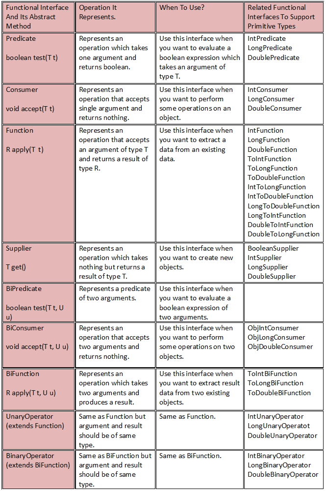
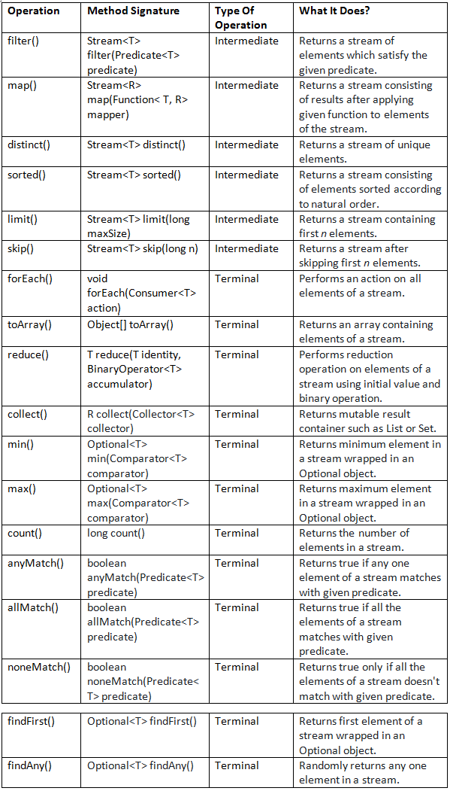
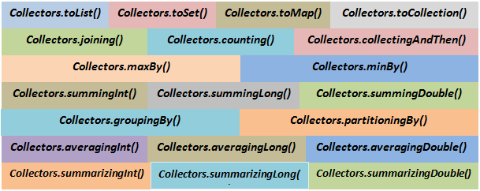
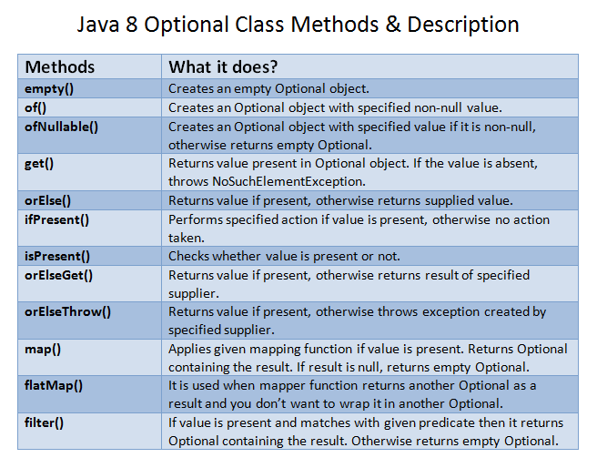
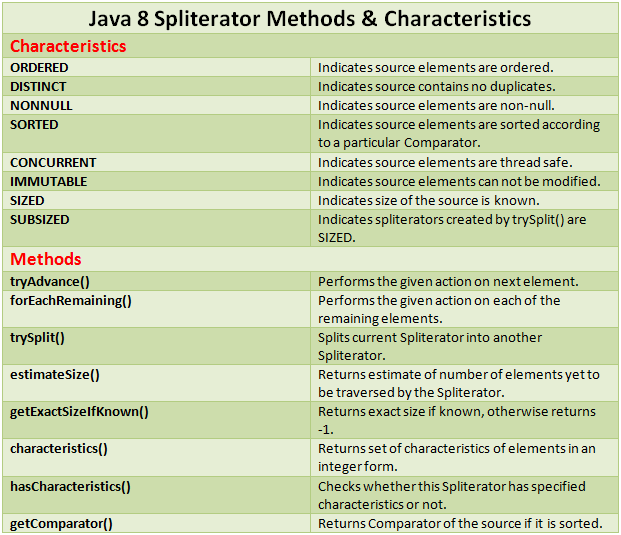
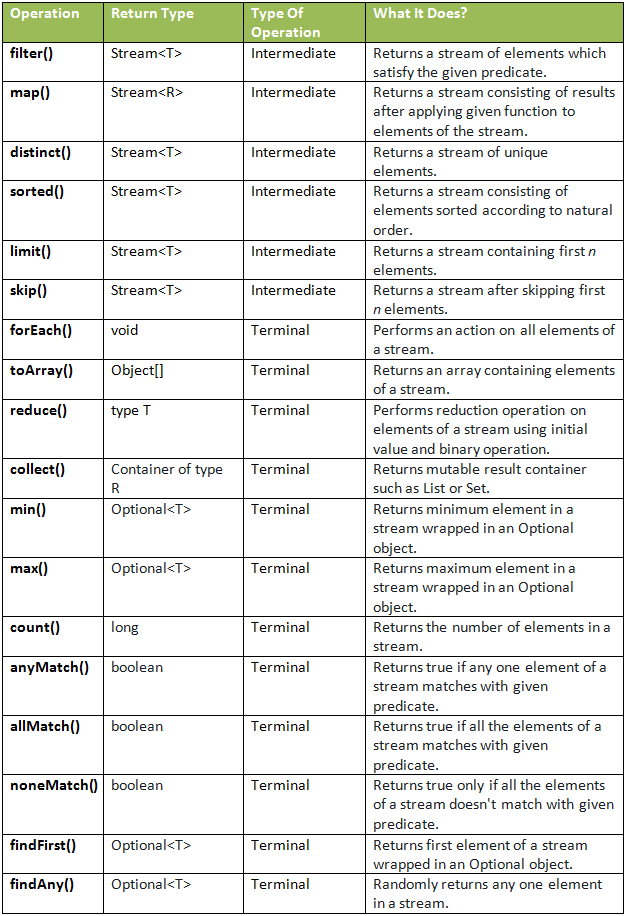
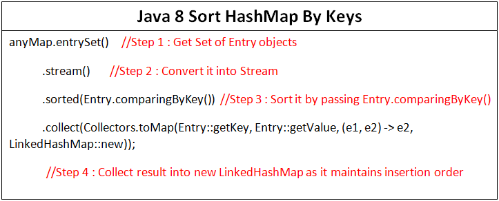
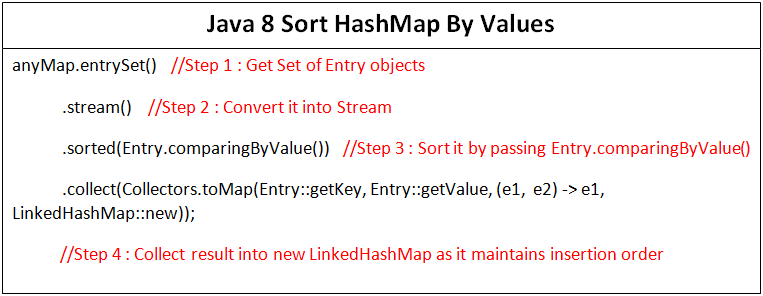
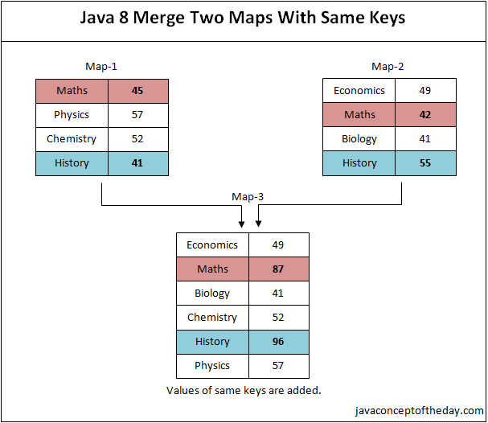

# Functional Interfaces

All Java 8 functional interfaces are organised in java.util.function package.



# Java 8 Streams

java.util.stream.Stream interface is the center of Java 8 Streams API. This interface contains all the stream operations. Below table shows frequently used Stream methods with description.



# Java 8 Stream Operations

## 5.1) Stream Creation Operations

### 5.1.1) empty() : Creates an empty stream

Method Signature : public static<T> Stream<T> empty()

Type Of Method : Static Method

What It Does? : Returns an empty stream of type T.

```java
Stream<Student> emptyStream = Stream.empty();
         
System.out.println(emptyStream.count());
         
//Output : 0
```

### 5.1.2) of(T t) : Creates a stream of single element of type T

Method Signature : public static<T> Stream<T> of(T t)

Type Of Method : Static Method

What It Does? : Returns a single element stream of type T.

```java
Stream<Student> singleElementStream = Stream.of(new Student());
         
System.out.println(singleElementStream.count());
         
//Output : 1
```

### 5.1.3) of(T… values) : Creates a stream from values

Method Signature : public static<T> Stream<T> of(T… values)

Type Of Method : Static Method

What It does? : Returns a stream consisting of supplied values as elements.

```java
Stream<Integer> streamOfNumbers = Stream.of(7, 2, 6, 9, 4, 3, 1);
         
System.out.println(streamOfNumbers.count());
                 
//Output : 7
```

### 5.1.4) Creating streams from collections

From Java 8, every collection type will have a method called stream() which returns the stream of respective collection type.

Example : Creating a stream from List

```java
List<String> listOfStrings = new ArrayList<>();
         
listOfStrings.add("One");
         
listOfStrings.add("Two");
         
listOfStrings.add("Three");
         
listOfStrings.stream().forEach(System.out::println);
         
//  Output :
         
//  One
//  Two
//  Three
```

## 5.2) Selection Operations

### 5.2.1) filter() : Selecting with a predicate

Method Signature : Stream<T> filter(Predicate<T> predicate)

Type Of Operation : Intermediate Operation

What it does? : Returns a stream of elements which satisfy the given predicate.

```java
List<String> names = new ArrayList<>();
         
names.add("David");
         
names.add("Johnson");
         
names.add("Samontika");
         
names.add("Brijesh");
         
names.add("John");
         
//Selecting names containing more than 5 characters
         
names.stream().filter((String name) -> name.length() > 5).forEach(System.out::println);
         
//  Output :
         
//  Johnson
//      Samontika
//  Brijesh
```

### 5.2.2) distinct() : Selects only unique elements

Method Signature : Stream<T> distinct()

Type Of Operation : Intermediate Operation

What It Does? : Returns a stream of unique elements.    

```java
List<String> names = new ArrayList<>();
         
names.add("David");
         
names.add("Johnson");
         
names.add("Samontika");
         
names.add("Brijesh");
         
names.add("John");
         
names.add("David");
         
names.add("Brijesh");
         
//Selecting only unique names
         
names.stream().distinct().forEach(System.out::println);
         
//  Output :
         
//  David
//  Johnson
//  Samontika
//  Brijesh
//  John
```

### 5.2.3) limit() : Selects first n elements

Method Signature : Stream<T> limit(long maxSize)

Type Of Operation : Intermediate Operation

What It Does? : Returns a stream containing first n elements.

```java
List<String> names = new ArrayList<>();
         
names.add("David");
         
names.add("Johnson");
         
names.add("Samontika");
         
names.add("Brijesh");
         
names.add("John");
         
names.add("David");
         
names.add("Brijesh");
         
//Selecting first 4 names
         
names.stream().limit(4).forEach(System.out::println);
         
//  Output :
         
//  David
//  Johnson
//  Samontika
//  Brijesh
```

### 5.2.4) skip() : Skips first n elements

Method Signature : Stream<T> skip(long n)

Type Of Operation : Intermediate Operation

What It Does? : Returns a stream after skipping first n elements.

```java
List<String> names = new ArrayList<>();
         
names.add("David");
         
names.add("Johnson");
         
names.add("Samontika");
         
names.add("Brijesh");
         
names.add("John");
         
names.add("David");
         
names.add("Brijesh");
         
//Skipping first 4 names
         
names.stream().skip(4).forEach(System.out::println);
         
//  Output :
         
//  John
//  David
//  Brijesh
```

## 5.3) Mapping Operations

### 5.3.1) map() : Applies a function

Method Signature : Stream<R> map(Function<T, R> mapper);

Type Of Operation : Intermediate Operation

What It Does? : Returns a stream consisting of results after applying given function to elements of the stream.

```java
List<String> names = new ArrayList<>();
         
names.add("David");
         
names.add("Johnson");
         
names.add("Samontika");
         
names.add("Brijesh");
         
names.add("John");
         
//Returns length of each name
                names.stream().map(String::length).forEach(System.out::println);
         
//  Output :
         
//  5
//  7
//  9
//  7
//  4
```
Other versions of map() method : mapToInt(), mapToLong() and mapToDouble().

## 5.4) Sorting Operations

### 5.4.1) sorted() : Sorting according to natural order

Method Signature : Stream<T> sorted()

Type Of Operation : Intermediate Operation

What It Does? : Returns a stream consisting of elements sorted according to natural order.

```java
List<String> names = new ArrayList<>();
         
names.add("David");
         
names.add("Johnson");
         
names.add("Samontika");
         
names.add("Brijesh");
         
names.add("John");
         
//Sorting the names according to natural order
         
names.stream().sorted().forEach(System.out::println);
         
//  Output :
         
//  Brijesh
//  David
//  John
//  Johnson
//  Samontika
```

### 5.4.2) sorted(Comparator) : Sorting according to supplied comparator

Method Signature : Stream<T> sorted(Comparator<T> comparator)

Type Of Operation : Intermediate Operation

What It Does? : Returns a stream consisting of elements sorted according to supplied Comparator.

```java
List<String> names = new ArrayList<>();
         
names.add("David");
         
names.add("Johnson");
         
names.add("Samontika");
         
names.add("Brijesh");
         
names.add("John");
         
//Sorting the names according to their length
         
names.stream().sorted((String name1, String name2) -> name1.length() - name2.length()).forEach(System.out::println);
         
//  Output :
         
//  John
//  David
//  Johnson
//  Brijesh
//  Samontika
```
## 5.5) Reducing Operations

Reducing operations are the operations which combine all the elements of a stream repeatedly to produce a single value. For example, counting number of elements, calculating average of elements, finding maximum or minimum of elements etc.

### 5.5.1) reduce() : Produces a single value

Method Signature : T reduce(T identity, BinaryOperator<T> accumulator);

Type Of Operation : Terminal Operation

What It Does? : This method performs reduction operation on elements of a stream using initial value and binary operation.

```java
int sum = Arrays.stream(new int[] {7, 5, 9, 2, 8, 1}).reduce(0, (a, b) -> a+b);
 
//Output : 32
```

There is another form of reduce() method which takes no initial value. But returns an Optional object.

```java
OptionalInt sum = Arrays.stream(new int[] {7, 5, 9, 2, 8, 1}).reduce((a, b) -> a+b);
         
//Output : OptionalInt[32]
```
Methods min(), max(), count() and collect() are special cases of reduction operation.

### 5.5.2) min() : Finding the minimum

Method Signature : Optional<T> min(Comparator<T> comparator)

Type Of Operation : Terminal Operation

What It Does? : It returns minimum element in a stream wrapped in an Optional object.

```java
OptionalInt min = Arrays.stream(new int[] {7, 5, 9, 2, 8, 1}).min();
         
//Output : OptionalInt[1]
 
//Here, min() of IntStream will be used as we are passing an array of ints
```

### 5.5.3) max() : Finding the maximum

Method Signature : Optional<T> max(Comparator<T> comparator)

Type Of Operation : Terminal Operation

What It Does? : It returns maximum element in a stream wrapped in an Optional object.

```java
OptionalInt max = Arrays.stream(new int[] {7, 5, 9, 2, 8, 1}).max();
         
//Output : OptionalInt[9]
 
//Here, max() of IntStream will be used as we are passing an array of ints
```

### 5.5.4) count() : Counting the elements

Method Signature : long count()

Type Of Operation : Terminal Operation

What It Does? : Returns the number of elements in a stream.

```java
List<String> names = new ArrayList<>();
         
names.add("David");
         
names.add("Johnson");
         
names.add("Samontika");
         
names.add("Brijesh");
         
names.add("John");
         
//Counting the names with length > 5
         
long noOfBigNames = names.stream().filter((String name) -> name.length() > 5).count();
         
System.out.println(noOfBigNames);
         
//  Output : 3
```

### 5.5.5) collect() : Returns mutable container

Method Signature : R collect(Collector<T> collector)

Type Of Operation : Terminal Operation

What It Does? : collect() method is a special case of reduction operation called mutable reduction operation because it returns mutable result container such as List or Set.

```java
List<String> names = new ArrayList<>();
         
names.add("David");
         
names.add("Johnson");
         
names.add("Samontika");
         
names.add("Brijesh");
         
names.add("John");
         
//Storing first 3 names in a mutable container 
         
List<String> first3Names = names.stream().limit(3).collect(Collectors.toList());
         
System.out.println(first3Names);
         
//  Output : [David, Johnson, Samontika]
```

## 5.6) Finding And Matching Operations

### 5.6.1) anyMatch() : Any one element matches

Method Signature : boolean anyMatch(Predicate<T> predicate)

Type Of Operation : Short-circuiting Terminal Operation

What It Does? : Returns true if any one element of a stream matches with given predicate. This method may not evaluate all the elements of a stream. Even if the first element matches with given predicate, it ends the operation.

```java
List<String> names = new ArrayList<>();
         
names.add("David");
         
names.add("Johnson");
         
names.add("Samontika");
         
names.add("Brijesh");
         
names.add("John");
         
if(names.stream().anyMatch((String name) -> name.length() == 5))
{
    System.out.println("Yes... There is a name exist with 5 letters");
}
```

### 5.6.2) allMatch() : All elements matches

Method Signature : boolean allMatch(Predicate<T> predicate)

Type Of Operation : Terminal Operation

What It Does? : This method returns true if all the elements of a stream matches with given predicate. Otherwise returns false.

```java
List<String> names = new ArrayList<>();
         
names.add("Sampada");
                 
names.add("Johnson");
                 
names.add("Samontika");
                 
names.add("Brijesh"); 
                 
if(names.stream().allMatch((String name) -> name.length() > 5))
{
    System.out.println("All are big names");
}
```

### 5.6.3) noneMatch() : No element matches

Method Signature : boolean noneMatch(Predicate<T> predicate)

Type Of Operation : Terminal Operation

What It Does? : Returns true only if all the elements of a stream doesn’t match with given predicate.

```java
List<String> names = new ArrayList<>();
         
names.add("David");
         
names.add("Johnson");
         
names.add("Samontika");
         
names.add("Brijesh");
         
names.add("John"); 
         
if(names.stream().noneMatch((String name) -> name.length() == 2))
{
    System.out.println("There is no two letter name");
}
```

### 5.6.4) findFirst() : Finding first element

Method Signature : Optional<T> findFirst()

Type Of Operation : Short-circuiting Terminal Operation

What It Does? : Returns first element of a stream wrapped in an Optional object.

```java
Optional<String> firstElement = Stream.of("First", "Second", "Third", "Fourth").findFirst();
         
//Output : Optional[First]
```

### 5.6.5) findAny() : Finding any element

Method Signature : Optional<T> findAny()

Type Of Operation : Short-circuiting Terminal operation

What It Does? : Randomly returns any one element in a stream. The result of this operation is unpredictable. It may select any element in a stream. Multiple invocations on the same source may not return same result.

```java
Optional<String> anyElement = Stream.of("First", "Second", "Third", "Fourth").findAny();
```

## 5.7) Other Operations

### 5.7.1) forEach() :

Method Signature : void forEach(Consumer<T> action)

Type Of Operation : Terminal Operation

What It Does? : Performs an action on all elements of a stream.

```java
Stream.of("First", "Second", "Second", "Third", "Fourth").limit(3).distinct().forEach(System.out::println);
         
//  Output
         
//  First
//  Second
```

### 5.7.2) toArray() : Stream to array

Method Signature : Object[] toArray()

Type Of Operation : Terminal Operation

What It Does? : Returns an array containing elements of a stream.

```java
List<String> names = new ArrayList<>();
         
names.add("David");
         
names.add("Johnson");
         
names.add("Samontika");
         
names.add("Brijesh");
         
names.add("John"); 
     
//Storing first 3 names in an array
     
Object[] streamArray = names.stream().limit(3).toArray();
         
System.out.println(Arrays.toString(streamArray));
         
//  Output
         
//  [David, Johnson, Samontika]
```

### 5.7.3) peek() :

Method Signature : Stream<T> peek(Consumer<T> action)

Type Of Operation : Intermediate Operation

What It Does? : Performs an additional action on each element of a stream. This method is only to support debugging where you want to see the elements as you pass in a pipeline.

```java
List<String> names = new ArrayList<>();
         
names.add("David");
         
names.add("Johnson");
         
names.add("Samontika");
         
names.add("Brijesh");
         
names.add("John"); 
         
names.add("David");
         
names.stream()
        .filter(name -> name.length() > 5)
        .peek(e -> System.out.println("Filtered Name :"+e))
        .map(String::toUpperCase)
        .peek(e -> System.out.println("Mapped Name :"+e))
        .toArray();
 
//Output :
 
//Filtered Name :Johnson
//Mapped Name :JOHNSON
//Filtered Name :Samontika
//Mapped Name :SAMONTIKA
//Filtered Name :Brijesh
//Mapped Name :BRIJESH
```

# java.util.stream.Collector Interface methods

java.util.stream.Collector interface contains four functions that work together to accumulate input elements into a mutable result container and optionally performs a final transformation on the result. Those four functions are,

## a) Supplier() :

A function that creates and returns a new mutable result container.

## b) accumulator() :

A function that accumulates a value into a mutable result container.

## c) combiner() :

A function that accepts two partial results and merges them.

## d) finisher() :

A function that performs final transformation from the intermediate accumulation type to the final result type.

### 📜 Collector Method Signatures

```java
Supplier<A> supplier();
BiConsumer<A, T> accumulator();
BinaryOperator<A> combiner();
Function<A, R> finisher();
Set<Characteristics> characteristics();
```

T = Stream element type

A = Accumulation type (intermediate type)

R = Result type (final result)

### Example: Custom Collector for joining Strings

Let's build a custom collector that concatenates names into a single string, separated by commas.

```java
import java.util.*;
import java.util.stream.*;
import java.util.function.*;

public class CustomCollectorExample {

    public static void main(String[] args) {

        List<String> names = Arrays.asList("Alice", "Bob", "Charlie");

        String result = names.stream().collect(new Collector<String, StringBuilder, String>() {

            @Override
            public Supplier<StringBuilder> supplier() {
                // Creates a new empty container
                return StringBuilder::new;
            }

            @Override
            public BiConsumer<StringBuilder, String> accumulator() {
                // Adds an element into the container
                return (sb, name) -> {
                    if (sb.length() != 0) {
                        sb.append(", ");
                    }
                    sb.append(name);
                };
            }

            @Override
            public BinaryOperator<StringBuilder> combiner() {
                // Combines two containers (useful for parallel)
                return (sb1, sb2) -> {
                    if (sb1.length() != 0 && sb2.length() != 0) {
                        sb1.append(", ");
                    }
                    sb1.append(sb2);
                    return sb1;
                };
            }

            @Override
            public Function<StringBuilder, String> finisher() {
                // Finishes and returns the final result
                return StringBuilder::toString;
            }

            @Override
            public Set<Characteristics> characteristics() {
                // Characteristics - optional
                return Collections.emptySet(); // No special characteristics
            }
        });

        System.out.println(result); // Output: Alice, Bob, Charlie
    }
}
```

## 🔍 Explanation

**Phase** - **What Happens**

supplier - Provides an empty StringBuilder

accumulator - Adds names into StringBuilder, separated by commas

combiner - Merges two StringBuilder instances

finisher - Converts StringBuilder into final String

characteristics - No optimization hints (can set IDENTITY_FINISH, UNORDERED, etc.)

## ⚡ Quick Diagram

```java
names = ["Alice", "Bob", "Charlie"]

supplier() --> new StringBuilder()

accumulator() --> Alice -> Alice, Bob -> Alice, Bob, Charlie

finisher() --> "Alice, Bob, Charlie"
```

### Some collector optimizations are based on characteristics:


**Characteristic    -   Meaning**

CONCURRENT	-   Can collect concurrently

UNORDERED	-   Order of stream elements is not important

IDENTITY_FINISH	-   Finisher is identity (no transformation needed)

Example: Collectors.toList() has IDENTITY_FINISH.

## 🚀 Final Notes

* Collectors.toList(), Collectors.toSet(), Collectors.joining(), etc., are predefined Collectors.

* You can always write your own custom collector if you need advanced behavior.

# Collector.of() Factory Method

Instead of implementing the full Collector interface manually, Java 8 provides:

```java
static <T, A, R> Collector<T, A, R> of(
    Supplier<A> supplier,
    BiConsumer<A, T> accumulator,
    BinaryOperator<A> combiner,
    Function<A, R> finisher
)
```
There’s also a 5-argument version that includes characteristics.

### 🔥 Example Using Collector.of()

Let’s redo the previous string-joining example using Collector.of():

```java
import java.util.*;
import java.util.stream.*;
import java.util.function.*;

public class CollectorOfExample {

    public static void main(String[] args) {
        List<String> names = Arrays.asList("Alice", "Bob", "Charlie");

        Collector<String, StringBuilder, String> joinCollector = Collector.of(
            StringBuilder::new,                               // Supplier
            (sb, name) -> {                                    // Accumulator
                if (sb.length() > 0) sb.append(", ");
                sb.append(name);
            },
            (sb1, sb2) -> {                                    // Combiner
                if (sb1.length() > 0 && sb2.length() > 0) sb1.append(", ");
                sb1.append(sb2);
                return sb1;
            },
            StringBuilder::toString                            // Finisher
        );

        String result = names.stream().collect(joinCollector);

        System.out.println(result);  // Output: Alice, Bob, Charlie
    }
}
```

### 🔧 Simpler Collector for Numbers (Sum Example)

```java
List<Integer> numbers = Arrays.asList(1, 2, 3, 4, 5);

int sum = numbers.stream().collect(Collector.of(
    () -> new int[1],              // mutable container
    (a, b) -> a[0] += b,           // accumulator
    (a1, a2) -> { a1[0] += a2[0]; return a1; },  // combiner
    a -> a[0]                      // finisher
));

System.out.println(sum);  // Output: 15
```

### 📚 Summary

**Approach	-   Best Use**

Full Collector interface	-   Advanced control & customization

Collector.of()	-   Quick and readable custom collectors

# 3) java.util.stream.Collectors Class methods

java.util.stream.Collectors class contains static factory methods which perform some common reduction operations such as accumulating elements into Collection, finding min, max, average, sum of elements etc. All the methods of Collectors class return Collector type which will be supplied to collect() method as an argument.



### 3.1) Collectors.toList() :

### 3.2) Collectors.toSet() :

### 3.3) Collectors.toMap() :

### 3.4) Collectors.toCollection() :

### 3.5) Collectors.joining() :

### 3.6) Collectors.counting() :

### 3.7) Collectors.maxBy() :

### 3.8) Collectors.minBy() :

### 3.9) summingInt(), summingLong(), summingDouble()

### 3.10) averagingInt(), averagingLong(), averagingDouble()

### 3.11) summarizingInt(), summarizingLong(), summarizingDouble()

### 3.12) Collectors.groupingBy() :

### 3.13) Collectors.partitioningBy() :

### 3.14) Collectors.collectingAndThen() :

## Great! Here's a **cheat sheet** of the most commonly used **built-in Collectors** from the `java.util.stream.Collectors` class, with syntax and examples. This will help you in interviews and real-world development.

---

## ✅ Java 8 Collectors Cheat Sheet

### 1. **`Collectors.toList()`**
Collects elements into a `List`.

```java
List<String> result = stream.collect(Collectors.toList());
```

---

### 2. **`Collectors.toSet()`**
Collects elements into a `Set`.

```java
Set<String> result = stream.collect(Collectors.toSet());
```

---

### 3. **`Collectors.toMap()`**
Collects elements into a `Map`.

```java
Map<Integer, String> result = list.stream()
    .collect(Collectors.toMap(
        String::length,   // keyMapper
        Function.identity() // valueMapper
    ));
```

**Handling duplicates:**
```java
Map<Character, String> map = names.stream().collect(Collectors.toMap(
    s -> s.charAt(0),
    s -> s,
    (s1, s2) -> s1 + "," + s2 // merge function for key collisions
));
```

---

### 4. **`Collectors.joining()`**
Joins strings with delimiter, prefix, and suffix.

```java
String joined = stream.collect(Collectors.joining(", ", "[", "]"));
```

---

### 5. **`Collectors.counting()`**
Counts the number of elements.

```java
long count = stream.collect(Collectors.counting());
```

---

### 6. **`Collectors.summingInt()` / `summingLong()` / `summingDouble()`**
Sums the numeric values.

```java
int sum = stream.collect(Collectors.summingInt(String::length));
```

---

### 7. **`Collectors.averagingInt()` / `averagingDouble()`**
Calculates the average.

```java
double avg = stream.collect(Collectors.averagingInt(String::length));
```

---

### 8. **`Collectors.maxBy()` / `minBy()`**
Finds the max/min using a comparator.

```java
Optional<String> longest = stream.collect(
    Collectors.maxBy(Comparator.comparing(String::length))
);
```

---

### 9. **`Collectors.groupingBy()`**
Groups elements by a classifier function.

```java
Map<Integer, List<String>> grouped = stream.collect(
    Collectors.groupingBy(String::length)
);
```

---

### 10. **`Collectors.partitioningBy()`**
Partitions elements into two groups by a predicate.

```java
Map<Boolean, List<String>> partitioned = stream.collect(
    Collectors.partitioningBy(s -> s.length() > 5)
);
```

---

### 11. **`Collectors.mapping()`**
Used inside `groupingBy()` or `collectingAndThen()` to transform values.

```java
Map<Integer, Set<Character>> mapped = stream.collect(
    Collectors.groupingBy(String::length,
        Collectors.mapping(s -> s.charAt(0), Collectors.toSet()))
);
```

---

### 12. **`Collectors.collectingAndThen()`**
Wraps another collector and applies a finisher function.

```java
List<String> unmodifiableList = stream.collect(
    Collectors.collectingAndThen(
        Collectors.toList(),
        Collections::unmodifiableList
    )
);
```

---

### 13. **`Collectors.reducing()`**
Performs a general reduction.

```java
int totalLength = stream.collect(
    Collectors.reducing(0, String::length, Integer::sum)
);
```

---

### 14. **`Collectors.toCollection()`**
Collects elements into a custom collection (e.g., LinkedList, TreeSet).

```java
LinkedList<String> linked = stream.collect(
    Collectors.toCollection(LinkedList::new)
);
```

---

### 💡 Summary Table

| Collector                   | Purpose                          |
|----------------------------|----------------------------------|
| `toList()` / `toSet()`     | Collect into List/Set            |
| `toMap()`                  | Collect into Map                 |
| `joining()`                | Join strings                     |
| `counting()`               | Count elements                   |
| `summingX()`               | Sum values                       |
| `averagingX()`             | Average values                   |
| `maxBy()` / `minBy()`      | Find max/min by comparator       |
| `groupingBy()`             | Group elements                   |
| `partitioningBy()`         | Partition into true/false groups |
| `mapping()`                | Transform values in grouping     |
| `collectingAndThen()`      | Final transformation             |
| `reducing()`               | Generalized reduction            |
| `toCollection()`           | Use specific collection class    |

---

# java.util.stream.Collector Interface methods

The `java.util.stream.Collector` interface in Java is a part of the **Stream API** and provides a way to define mutable reduction operations (like grouping, partitioning, summarizing, etc.) on stream elements. It is a **generic interface** used by the terminal operation `Stream.collect()`.

Here are the **core methods** defined in the `Collector` interface:

---

### **1. `Supplier<A> supplier()`**

* Provides a function that creates a new result container (an instance of a mutable accumulation type `A`).
* **Example:** `() -> new ArrayList<>()`

---

### **2. `BiConsumer<A, T> accumulator()`**

* Returns a function that folds a value into a mutable result container.
* Takes two arguments: the result container and the current stream element.
* **Example:** `(list, item) -> list.add(item)`

---

### **3. `BinaryOperator<A> combiner()`**

* Combines two result containers into one. Mainly used in parallel stream processing.
* **Example:** `(list1, list2) -> { list1.addAll(list2); return list1; }`

---

### **4. `Function<A, R> finisher()`**

* Performs a final transformation on the result container, converting it from `A` to `R`.
* Often an identity function if no transformation is needed.
* **Example:** `Function.identity()`

---

### **5. `Set<Collector.Characteristics> characteristics()`**

* Returns a set of `Collector.Characteristics` that describe the collector’s behavior:

  * `CONCURRENT`: Supports concurrent accumulation.
  * `UNORDERED`: Collector does not preserve element order.
  * `IDENTITY_FINISH`: Finisher is the identity function (i.e., `A` and `R` are the same).

---

### Full Method Signature:

```java
public interface Collector<T, A, R> {
    Supplier<A> supplier();
    BiConsumer<A, T> accumulator();
    BinaryOperator<A> combiner();
    Function<A, R> finisher();
    Set<Characteristics> characteristics();
}
```

## Would you like an example of a custom `Collector` implementation or how it's used in practice?

Great! Here's a **complete example** that demonstrates how to **create and use a custom `Collector`** in Java. This example collects strings into a comma-separated single string, similar to `Collectors.joining(", ")`, but using a **custom implementation**.

---

### ✅ **Custom Collector Example: Join Strings with Comma**

```java
import java.util.*;
import java.util.function.*;
import java.util.stream.*;

public class CustomCollectorExample {

    public static void main(String[] args) {
        List<String> names = Arrays.asList("Alice", "Bob", "Charlie");

        String result = names.stream()
                .collect(new CommaJoiningCollector());

        System.out.println(result);  // Output: Alice, Bob, Charlie
    }

    // Custom Collector implementation
    static class CommaJoiningCollector implements Collector<String, StringJoiner, String> {

        @Override
        public Supplier<StringJoiner> supplier() {
            return () -> new StringJoiner(", ");
        }

        @Override
        public BiConsumer<StringJoiner, String> accumulator() {
            return StringJoiner::add;
        }

        @Override
        public BinaryOperator<StringJoiner> combiner() {
            return StringJoiner::merge;
        }

        @Override
        public Function<StringJoiner, String> finisher() {
            return StringJoiner::toString;
        }

        @Override
        public Set<Characteristics> characteristics() {
            return Collections.singleton(Characteristics.UNORDERED);
        }
    }
}
```

---

### 🔍 Explanation:

* **Supplier:** Provides a new `StringJoiner` initialized with `", "`.
* **Accumulator:** Adds each string to the joiner.
* **Combiner:** Merges two `StringJoiner` instances (important for parallel streams).
* **Finisher:** Converts `StringJoiner` to a final `String`.
* **Characteristics:** We specify only `UNORDERED`, meaning the result doesn't depend on encounter order.

---

## Would you like a version of this example that collects objects or groups data instead?

Let's build on the concept and create a **custom `Collector`** that collects **objects** and groups them by a specific field.

---

### ✅ **Custom Collector Example: Group People by Age**

Suppose you have a `Person` class:

```java
class Person {
    String name;
    int age;

    Person(String name, int age) {
        this.name = name;
        this.age = age;
    }

    int getAge() {
        return age;
    }

    String getName() {
        return name;
    }

    @Override
    public String toString() {
        return name;
    }
}
```

---

### 🎯 Goal:

Group a list of `Person` objects into a `Map<Integer, List<Person>>`, where the key is age.

---

### 🛠️ Custom Collector Implementation:

```java
import java.util.*;
import java.util.function.*;
import java.util.stream.*;

public class GroupByAgeCollectorExample {

    public static void main(String[] args) {
        List<Person> people = Arrays.asList(
                new Person("Alice", 30),
                new Person("Bob", 25),
                new Person("Charlie", 30),
                new Person("David", 25),
                new Person("Eve", 35)
        );

        Map<Integer, List<Person>> grouped = people.stream()
                .collect(new GroupByAgeCollector());

        grouped.forEach((age, list) -> {
            System.out.println("Age " + age + ": " + list);
        });
    }

    // Custom collector to group by age
    static class GroupByAgeCollector implements Collector<Person, Map<Integer, List<Person>>, Map<Integer, List<Person>>> {

        @Override
        public Supplier<Map<Integer, List<Person>>> supplier() {
            return HashMap::new;
        }

        @Override
        public BiConsumer<Map<Integer, List<Person>>, Person> accumulator() {
            return (map, person) -> 
                map.computeIfAbsent(person.getAge(), k -> new ArrayList<>()).add(person);
        }

        @Override
        public BinaryOperator<Map<Integer, List<Person>>> combiner() {
            return (map1, map2) -> {
                map2.forEach((age, people) -> 
                    map1.merge(age, people, (list1, list2) -> {
                        list1.addAll(list2);
                        return list1;
                    }));
                return map1;
            };
        }

        @Override
        public Function<Map<Integer, List<Person>>, Map<Integer, List<Person>>> finisher() {
            return Function.identity();
        }

        @Override
        public Set<Characteristics> characteristics() {
            return Collections.singleton(Characteristics.IDENTITY_FINISH);
        }
    }
}
```

---

### 🧠 Key Concepts:

* Uses `computeIfAbsent` to initialize and populate the list by age.
* The combiner merges partial maps in parallel stream scenarios.
* The finisher returns the identity (no transformation), so we use `IDENTITY_FINISH`.

---

## Would you like this modified to group by a **custom key**, such as the first letter of the name, or include summarizing (e.g., count or average age per group)?

Great! Let's now **group people by the first letter of their name**, and for each group, **calculate the average age**.

---

### ✅ **Goal:**

Create a custom `Collector` that groups `Person` objects by the **first letter of their name**, and computes the **average age** for each group.

---

### 🧑 Person Class (same as before):

```java
class Person {
    String name;
    int age;

    Person(String name, int age) {
        this.name = name;
        this.age = age;
    }

    String getName() {
        return name;
    }

    int getAge() {
        return age;
    }
}
```

---

### 🛠️ Custom Collector: Group by Initial Letter → Average Age

```java
import java.util.*;
import java.util.function.*;
import java.util.stream.*;

public class GroupByInitialAverageAge {

    public static void main(String[] args) {
        List<Person> people = Arrays.asList(
                new Person("Alice", 30),
                new Person("Aaron", 28),
                new Person("Bob", 25),
                new Person("Ben", 35),
                new Person("Charlie", 40),
                new Person("Cathy", 32)
        );

        Map<Character, Double> averageAges = people.stream()
                .collect(new AverageAgeByInitialCollector());

        averageAges.forEach((initial, avgAge) ->
                System.out.println(initial + ": " + avgAge));
    }

    // Collector to group by first character of name and calculate average age
    static class AverageAgeByInitialCollector implements Collector<Person, Map<Character, IntSummaryStatistics>, Map<Character, Double>> {

        @Override
        public Supplier<Map<Character, IntSummaryStatistics>> supplier() {
            return HashMap::new;
        }

        @Override
        public BiConsumer<Map<Character, IntSummaryStatistics>, Person> accumulator() {
            return (map, person) -> {
                char initial = Character.toUpperCase(person.getName().charAt(0));
                map.computeIfAbsent(initial, k -> new IntSummaryStatistics())
                    .accept(person.getAge());
            };
        }

        @Override
        public BinaryOperator<Map<Character, IntSummaryStatistics>> combiner() {
            return (map1, map2) -> {
                map2.forEach((ch, stats) ->
                    map1.merge(ch, stats, (s1, s2) -> {
                        s1.combine(s2);
                        return s1;
                    }));
                return map1;
            };
        }

        @Override
        public Function<Map<Character, IntSummaryStatistics>, Map<Character, Double>> finisher() {
            return map -> {
                Map<Character, Double> result = new HashMap<>();
                map.forEach((ch, stats) -> result.put(ch, stats.getAverage()));
                return result;
            };
        }

        @Override
        public Set<Characteristics> characteristics() {
            return EnumSet.noneOf(Characteristics.class);
        }
    }
}
```

---

### 🔍 Output (example):

```
A: 29.0
B: 30.0
C: 36.0
```

---

### 💡 What’s Happening:

* We're grouping by the **first letter** of each name.
* Using `IntSummaryStatistics` to collect and compute averages.
* The `finisher()` maps the stats to final average values.

## Would you like to extend this further to also include counts or total ages per group along with averages?

Perfect! Let’s extend the previous example to group `Person` objects by the **first letter of their name** and calculate **three things per group**:

### ✅ Goal:

For each initial letter, collect:

* **Count** of people
* **Total age**
* **Average age**

We’ll return:

```java
Map<Character, GroupStats>
```

Where `GroupStats` is a custom class that holds count, total age, and average.

---

### 🧮 Step 1: Define the `GroupStats` class

```java
class GroupStats {
    int count;
    int totalAge;

    GroupStats() {
        this.count = 0;
        this.totalAge = 0;
    }

    void accept(int age) {
        count++;
        totalAge += age;
    }

    void combine(GroupStats other) {
        this.count += other.count;
        this.totalAge += other.totalAge;
    }

    double getAverage() {
        return count == 0 ? 0 : (double) totalAge / count;
    }

    @Override
    public String toString() {
        return "Count: " + count + ", Total: " + totalAge + ", Avg: " + getAverage();
    }
}
```

---

### 🧑 `Person` class (unchanged):

```java
class Person {
    String name;
    int age;

    Person(String name, int age) {
        this.name = name;
        this.age = age;
    }

    String getName() {
        return name;
    }

    int getAge() {
        return age;
    }
}
```

---

### 🛠️ Custom Collector

```java
import java.util.*;
import java.util.function.*;
import java.util.stream.*;

public class GroupStatsCollectorExample {

    public static void main(String[] args) {
        List<Person> people = Arrays.asList(
                new Person("Alice", 30),
                new Person("Aaron", 28),
                new Person("Bob", 25),
                new Person("Ben", 35),
                new Person("Charlie", 40),
                new Person("Cathy", 32)
        );

        Map<Character, GroupStats> statsByInitial = people.stream()
                .collect(new GroupStatsByInitialCollector());

        statsByInitial.forEach((initial, stats) ->
                System.out.println(initial + ": " + stats));
    }

    // Custom collector to collect GroupStats by name initial
    static class GroupStatsByInitialCollector implements Collector<Person, Map<Character, GroupStats>, Map<Character, GroupStats>> {

        @Override
        public Supplier<Map<Character, GroupStats>> supplier() {
            return HashMap::new;
        }

        @Override
        public BiConsumer<Map<Character, GroupStats>, Person> accumulator() {
            return (map, person) -> {
                char initial = Character.toUpperCase(person.getName().charAt(0));
                map.computeIfAbsent(initial, k -> new GroupStats()).accept(person.getAge());
            };
        }

        @Override
        public BinaryOperator<Map<Character, GroupStats>> combiner() {
            return (map1, map2) -> {
                map2.forEach((ch, stats) ->
                    map1.merge(ch, stats, (s1, s2) -> {
                        s1.combine(s2);
                        return s1;
                    }));
                return map1;
            };
        }

        @Override
        public Function<Map<Character, GroupStats>, Map<Character, GroupStats>> finisher() {
            return Function.identity();
        }

        @Override
        public Set<Characteristics> characteristics() {
            return Collections.singleton(Characteristics.IDENTITY_FINISH);
        }
    }
}
```

---

### 🔍 Sample Output:

```
A: Count: 2, Total: 58, Avg: 29.0
B: Count: 2, Total: 60, Avg: 30.0
C: Count: 2, Total: 72, Avg: 36.0
```

---

This structure is flexible—you can add min/max ages, names list, or even nested grouping if needed.

## Would you like a version that also includes the list of names per group along with the stats?

Great choice! Let’s now enhance `GroupStats` to include a **list of names** in each group alongside count, total age, and average.

---

### ✅ **Goal:**

For each initial letter of the name, we’ll collect:

* Total number of people
* Total age
* Average age
* List of names

Final structure:

```java
Map<Character, GroupStats>
```

---

### 🧮 Step 1: Enhanced `GroupStats` class

```java
class GroupStats {
    int count;
    int totalAge;
    List<String> names;

    GroupStats() {
        this.count = 0;
        this.totalAge = 0;
        this.names = new ArrayList<>();
    }

    void accept(Person person) {
        count++;
        totalAge += person.getAge();
        names.add(person.getName());
    }

    void combine(GroupStats other) {
        this.count += other.count;
        this.totalAge += other.totalAge;
        this.names.addAll(other.names);
    }

    double getAverage() {
        return count == 0 ? 0 : (double) totalAge / count;
    }

    @Override
    public String toString() {
        return "Count: " + count +
               ", Total Age: " + totalAge +
               ", Average Age: " + String.format("%.1f", getAverage()) +
               ", Names: " + names;
    }
}
```

---

### 🧑 `Person` Class (same as before)

```java
class Person {
    String name;
    int age;

    Person(String name, int age) {
        this.name = name;
        this.age = age;
    }

    String getName() {
        return name;
    }

    int getAge() {
        return age;
    }
}
```

---

### 🛠️ Updated Collector with Names

```java
import java.util.*;
import java.util.function.*;
import java.util.stream.*;

public class GroupStatsWithNamesExample {

    public static void main(String[] args) {
        List<Person> people = Arrays.asList(
                new Person("Alice", 30),
                new Person("Aaron", 28),
                new Person("Bob", 25),
                new Person("Ben", 35),
                new Person("Charlie", 40),
                new Person("Cathy", 32)
        );

        Map<Character, GroupStats> statsByInitial = people.stream()
                .collect(new GroupStatsWithNamesCollector());

        statsByInitial.forEach((initial, stats) ->
                System.out.println(initial + ": " + stats));
    }

    // Custom collector with names included
    static class GroupStatsWithNamesCollector implements Collector<Person, Map<Character, GroupStats>, Map<Character, GroupStats>> {

        @Override
        public Supplier<Map<Character, GroupStats>> supplier() {
            return HashMap::new;
        }

        @Override
        public BiConsumer<Map<Character, GroupStats>, Person> accumulator() {
            return (map, person) -> {
                char initial = Character.toUpperCase(person.getName().charAt(0));
                map.computeIfAbsent(initial, k -> new GroupStats()).accept(person);
            };
        }

        @Override
        public BinaryOperator<Map<Character, GroupStats>> combiner() {
            return (map1, map2) -> {
                map2.forEach((ch, stats) ->
                    map1.merge(ch, stats, (s1, s2) -> {
                        s1.combine(s2);
                        return s1;
                    }));
                return map1;
            };
        }

        @Override
        public Function<Map<Character, GroupStats>, Map<Character, GroupStats>> finisher() {
            return Function.identity();
        }

        @Override
        public Set<Characteristics> characteristics() {
            return Collections.singleton(Characteristics.IDENTITY_FINISH);
        }
    }
}
```

---

### 🔍 Sample Output:

```
A: Count: 2, Total Age: 58, Average Age: 29.0, Names: [Alice, Aaron]
B: Count: 2, Total Age: 60, Average Age: 30.0, Names: [Bob, Ben]
C: Count: 2, Total Age: 72, Average Age: 36.0, Names: [Charlie, Cathy]
```

---

This setup gives you a rich, flexible summary per group.

## Would you like a version that sorts the final map by the group’s average age or name list?

Awesome! Let's now **sort the final result** by **average age per group**, while keeping everything else the same (counts, totals, names, etc.).

---

### ✅ Goal:

Return a `**LinkedHashMap<Character, GroupStats>**` sorted by average age **in descending order** (oldest groups first).

---

### 🧠 Key Changes:

* After collecting the map using your custom collector, sort its entries by average age.
* Use `LinkedHashMap` to preserve the sorted order.

---

### 🛠️ Updated Main Method with Sorting

```java
import java.util.*;
import java.util.function.*;
import java.util.stream.*;

public class GroupStatsSortedExample {

    public static void main(String[] args) {
        List<Person> people = Arrays.asList(
                new Person("Alice", 30),
                new Person("Aaron", 28),
                new Person("Bob", 25),
                new Person("Ben", 35),
                new Person("Charlie", 40),
                new Person("Cathy", 32)
        );

        // Collect using custom collector
        Map<Character, GroupStats> unsortedMap = people.stream()
                .collect(new GroupStatsWithNamesCollector());

        // Sort by average age (descending)
        Map<Character, GroupStats> sortedByAvgAge = unsortedMap.entrySet().stream()
                .sorted(Map.Entry.<Character, GroupStats>comparingByValue(
                        Comparator.comparingDouble(GroupStats::getAverage).reversed()))
                .collect(Collectors.toMap(
                        Map.Entry::getKey,
                        Map.Entry::getValue,
                        (e1, e2) -> e1,
                        LinkedHashMap::new
                ));

        // Print results
        sortedByAvgAge.forEach((initial, stats) ->
                System.out.println(initial + ": " + stats));
    }

    // The GroupStats and GroupStatsWithNamesCollector classes are the same as in the last example
}
```

---

### 🔍 Output Example (sorted by avg age):

```
C: Count: 2, Total Age: 72, Average Age: 36.0, Names: [Charlie, Cathy]
B: Count: 2, Total Age: 60, Average Age: 30.0, Names: [Bob, Ben]
A: Count: 2, Total Age: 58, Average Age: 29.0, Names: [Alice, Aaron]
```

---

This approach is clean and easy to modify:

* You can sort by **count**, **total age**, or **name count**.
* Or sort **ascending** by switching to `Comparator.comparingDouble(...)` without `.reversed()`.

## Would you like to also export the sorted results as a CSV or JSON?

Great! Let's add an option to **export the sorted group statistics to a CSV and JSON format**.

---

## ✅ Export Sorted Results

You now have:

```java
Map<Character, GroupStats> sortedByAvgAge
```

Let’s output it in:

### 1️⃣ CSV Format (Console Output)

```java
System.out.println("Initial,Count,TotalAge,AverageAge,Names");

sortedByAvgAge.forEach((initial, stats) -> {
    String csvLine = String.format("%s,%d,%d,%.1f,\"%s\"",
            initial,
            stats.count,
            stats.totalAge,
            stats.getAverage(),
            String.join(";", stats.names));
    System.out.println(csvLine);
});
```

📌 This produces:

```
Initial,Count,TotalAge,AverageAge,Names
C,2,72,36.0,"Charlie;Cathy"
B,2,60,30.0,"Bob;Ben"
A,2,58,29.0,"Alice;Aaron"
```

> 🔹 You can redirect this output to a file or use `Files.write(...)` to export to disk.

---

### 2️⃣ JSON Format (using Jackson or Gson)

#### Option A: **Using Jackson**

First, add the dependency:

```xml
<!-- For Maven -->
<dependency>
    <groupId>com.fasterxml.jackson.core</groupId>
    <artifactId>jackson-databind</artifactId>
    <version>2.17.0</version>
</dependency>
```

Then:

```java
import com.fasterxml.jackson.databind.ObjectMapper;
import com.fasterxml.jackson.databind.SerializationFeature;

ObjectMapper mapper = new ObjectMapper();
mapper.enable(SerializationFeature.INDENT_OUTPUT);

String jsonOutput = mapper.writeValueAsString(sortedByAvgAge);
System.out.println(jsonOutput);
```

---

#### Option B: **Using Gson**

If you're using Gson instead:

```java
import com.google.gson.Gson;
import com.google.gson.GsonBuilder;

Gson gson = new GsonBuilder().setPrettyPrinting().create();
String jsonOutput = gson.toJson(sortedByAvgAge);
System.out.println(jsonOutput);
```

---

## Would you like me to provide a complete working version of the CSV or JSON export using a specific library?

Great! Here's a **complete working Java example** that:

1. Uses your existing logic (grouping `Person` by name initial).
2. Sorts the results by **average age (descending)**.
3. **Exports the results to both:**

   * **CSV** (printed to console)
   * **JSON** (printed to console using Jackson)

---

### ✅ Full Java Example with Jackson JSON Export

```java
import com.fasterxml.jackson.databind.ObjectMapper;
import com.fasterxml.jackson.databind.SerializationFeature;

import java.util.*;
import java.util.function.*;
import java.util.stream.*;

public class GroupStatsExportExample {

    public static void main(String[] args) throws Exception {
        List<Person> people = Arrays.asList(
                new Person("Alice", 30),
                new Person("Aaron", 28),
                new Person("Bob", 25),
                new Person("Ben", 35),
                new Person("Charlie", 40),
                new Person("Cathy", 32)
        );

        // Step 1: Collect and group by name initial
        Map<Character, GroupStats> grouped = people.stream()
                .collect(new GroupStatsWithNamesCollector());

        // Step 2: Sort by average age descending
        Map<Character, GroupStats> sorted = grouped.entrySet().stream()
                .sorted(Map.Entry.<Character, GroupStats>comparingByValue(
                        Comparator.comparingDouble(GroupStats::getAverage).reversed()))
                .collect(Collectors.toMap(
                        Map.Entry::getKey,
                        Map.Entry::getValue,
                        (e1, e2) -> e1,
                        LinkedHashMap::new
                ));

        // Step 3: Export to CSV
        System.out.println("=== CSV Export ===");
        System.out.println("Initial,Count,TotalAge,AverageAge,Names");
        sorted.forEach((initial, stats) -> {
            String csvLine = String.format("%s,%d,%d,%.1f,\"%s\"",
                    initial,
                    stats.count,
                    stats.totalAge,
                    stats.getAverage(),
                    String.join(";", stats.names));
            System.out.println(csvLine);
        });

        // Step 4: Export to JSON using Jackson
        System.out.println("\n=== JSON Export ===");
        ObjectMapper mapper = new ObjectMapper();
        mapper.enable(SerializationFeature.INDENT_OUTPUT);
        String jsonOutput = mapper.writeValueAsString(sorted);
        System.out.println(jsonOutput);
    }

    // --- Supporting Classes ---

    static class Person {
        String name;
        int age;

        Person(String name, int age) {
            this.name = name;
            this.age = age;
        }

        String getName() { return name; }
        int getAge() { return age; }
    }

    static class GroupStats {
        int count;
        int totalAge;
        List<String> names = new ArrayList<>();

        void accept(Person p) {
            count++;
            totalAge += p.getAge();
            names.add(p.getName());
        }

        void combine(GroupStats other) {
            count += other.count;
            totalAge += other.totalAge;
            names.addAll(other.names);
        }

        double getAverage() {
            return count == 0 ? 0 : (double) totalAge / count;
        }

        @Override
        public String toString() {
            return String.format("Count: %d, Total Age: %d, Average: %.1f, Names: %s",
                    count, totalAge, getAverage(), names);
        }
    }

    static class GroupStatsWithNamesCollector implements Collector<Person, Map<Character, GroupStats>, Map<Character, GroupStats>> {

        @Override
        public Supplier<Map<Character, GroupStats>> supplier() {
            return HashMap::new;
        }

        @Override
        public BiConsumer<Map<Character, GroupStats>, Person> accumulator() {
            return (map, person) -> {
                char initial = Character.toUpperCase(person.getName().charAt(0));
                map.computeIfAbsent(initial, k -> new GroupStats()).accept(person);
            };
        }

        @Override
        public BinaryOperator<Map<Character, GroupStats>> combiner() {
            return (map1, map2) -> {
                map2.forEach((ch, stats) ->
                        map1.merge(ch, stats, (s1, s2) -> {
                            s1.combine(s2);
                            return s1;
                        }));
                return map1;
            };
        }

        @Override
        public Function<Map<Character, GroupStats>, Map<Character, GroupStats>> finisher() {
            return Function.identity();
        }

        @Override
        public Set<Characteristics> characteristics() {
            return Collections.singleton(Characteristics.IDENTITY_FINISH);
        }
    }
}
```

---

### 🔧 Maven Dependency for Jackson

Add this to your `pom.xml`:

```xml
<dependency>
    <groupId>com.fasterxml.jackson.core</groupId>
    <artifactId>jackson-databind</artifactId>
    <version>2.17.0</version>
</dependency>
```

---

## Would you like a version of this that writes the CSV or JSON directly to a file (e.g., `output.csv`, `output.json`)?

Perfect! Here's how to **write both CSV and JSON output to files** — `output.csv` and `output.json` — in addition to console output.

---

### ✅ Updated Code Snippet: Save CSV and JSON to Disk

Add this to the end of your `main` method:

```java
import java.io.*;
import java.nio.file.*;

public class GroupStatsExportExample {

    public static void main(String[] args) throws Exception {
        // ... (same as before: collect, group, sort)

        // File paths
        String csvPath = "output.csv";
        String jsonPath = "output.json";

        // --- Write CSV to File ---
        try (BufferedWriter writer = Files.newBufferedWriter(Paths.get(csvPath))) {
            writer.write("Initial,Count,TotalAge,AverageAge,Names\n");
            for (Map.Entry<Character, GroupStats> entry : sorted.entrySet()) {
                GroupStats stats = entry.getValue();
                String line = String.format("%s,%d,%d,%.1f,\"%s\"",
                        entry.getKey(),
                        stats.count,
                        stats.totalAge,
                        stats.getAverage(),
                        String.join(";", stats.names));
                writer.write(line + "\n");
            }
        }

        System.out.println("\n✅ CSV written to " + csvPath);

        // --- Write JSON to File ---
        ObjectMapper mapper = new ObjectMapper();
        mapper.enable(SerializationFeature.INDENT_OUTPUT);
        mapper.writeValue(Paths.get(jsonPath).toFile(), sorted);

        System.out.println("✅ JSON written to " + jsonPath);
    }

    // (rest of the code remains unchanged)
}
```

---

### 🗃️ Result

* `output.csv` will contain:

  ```
  Initial,Count,TotalAge,AverageAge,Names
  C,2,72,36.0,"Charlie;Cathy"
  B,2,60,30.0,"Bob;Ben"
  A,2,58,29.0,"Alice;Aaron"
  ```

* `output.json` will contain prettified JSON like:

  ```json
  {
    "C" : {
      "count" : 2,
      "totalAge" : 72,
      "names" : [ "Charlie", "Cathy" ]
    },
    ...
  }
  ```

---

This setup is ready for file-based reporting or integration with other tools.

## Would you like to make the export location configurable or add timestamps to filenames for versioning?

To make the file export location configurable and add timestamps to filenames, let's implement a **dynamic approach** where:

1. You can **configure** the base directory for file exports.
2. Filenames will include a **timestamp** to prevent overwriting and allow versioning.

---

### ✅ Updated Code with Configurable Export Location & Timestamps

Here’s the updated version that appends a timestamp to the filenames:

```java
import com.fasterxml.jackson.databind.ObjectMapper;
import com.fasterxml.jackson.databind.SerializationFeature;

import java.io.*;
import java.nio.file.*;
import java.text.SimpleDateFormat;
import java.util.*;
import java.util.function.*;
import java.util.stream.*;

public class GroupStatsExportExample {

    public static void main(String[] args) throws Exception {
        List<Person> people = Arrays.asList(
                new Person("Alice", 30),
                new Person("Aaron", 28),
                new Person("Bob", 25),
                new Person("Ben", 35),
                new Person("Charlie", 40),
                new Person("Cathy", 32)
        );

        // Step 1: Collect and group by name initial
        Map<Character, GroupStats> grouped = people.stream()
                .collect(new GroupStatsWithNamesCollector());

        // Step 2: Sort by average age descending
        Map<Character, GroupStats> sorted = grouped.entrySet().stream()
                .sorted(Map.Entry.<Character, GroupStats>comparingByValue(
                        Comparator.comparingDouble(GroupStats::getAverage).reversed()))
                .collect(Collectors.toMap(
                        Map.Entry::getKey,
                        Map.Entry::getValue,
                        (e1, e2) -> e1,
                        LinkedHashMap::new
                ));

        // Step 3: Configure output directory and timestamped filenames
        String outputDir = "output/";  // Directory where files will be saved
        String timestamp = new SimpleDateFormat("yyyyMMdd_HHmmss").format(new Date());
        String csvFileName = "output_" + timestamp + ".csv";
        String jsonFileName = "output_" + timestamp + ".json";

        // Ensure output directory exists
        Files.createDirectories(Paths.get(outputDir));

        // --- Write CSV to File ---
        try (BufferedWriter writer = Files.newBufferedWriter(Paths.get(outputDir + csvFileName))) {
            writer.write("Initial,Count,TotalAge,AverageAge,Names\n");
            for (Map.Entry<Character, GroupStats> entry : sorted.entrySet()) {
                GroupStats stats = entry.getValue();
                String line = String.format("%s,%d,%d,%.1f,\"%s\"",
                        entry.getKey(),
                        stats.count,
                        stats.totalAge,
                        stats.getAverage(),
                        String.join(";", stats.names));
                writer.write(line + "\n");
            }
        }

        System.out.println("\n✅ CSV written to " + outputDir + csvFileName);

        // --- Write JSON to File ---
        ObjectMapper mapper = new ObjectMapper();
        mapper.enable(SerializationFeature.INDENT_OUTPUT);
        mapper.writeValue(Paths.get(outputDir + jsonFileName).toFile(), sorted);

        System.out.println("✅ JSON written to " + outputDir + jsonFileName);
    }

    // --- Supporting Classes ---

    static class Person {
        String name;
        int age;

        Person(String name, int age) {
            this.name = name;
            this.age = age;
        }

        String getName() { return name; }
        int getAge() { return age; }
    }

    static class GroupStats {
        int count;
        int totalAge;
        List<String> names = new ArrayList<>();

        void accept(Person p) {
            count++;
            totalAge += p.getAge();
            names.add(p.getName());
        }

        void combine(GroupStats other) {
            count += other.count;
            totalAge += other.totalAge;
            names.addAll(other.names);
        }

        double getAverage() {
            return count == 0 ? 0 : (double) totalAge / count;
        }

        @Override
        public String toString() {
            return String.format("Count: %d, Total Age: %d, Average: %.1f, Names: %s",
                    count, totalAge, getAverage(), names);
        }
    }

    static class GroupStatsWithNamesCollector implements Collector<Person, Map<Character, GroupStats>, Map<Character, GroupStats>> {

        @Override
        public Supplier<Map<Character, GroupStats>> supplier() {
            return HashMap::new;
        }

        @Override
        public BiConsumer<Map<Character, GroupStats>, Person> accumulator() {
            return (map, person) -> {
                char initial = Character.toUpperCase(person.getName().charAt(0));
                map.computeIfAbsent(initial, k -> new GroupStats()).accept(person);
            };
        }

        @Override
        public BinaryOperator<Map<Character, GroupStats>> combiner() {
            return (map1, map2) -> {
                map2.forEach((ch, stats) ->
                        map1.merge(ch, stats, (s1, s2) -> {
                            s1.combine(s2);
                            return s1;
                        }));
                return map1;
            };
        }

        @Override
        public Function<Map<Character, GroupStats>, Map<Character, GroupStats>> finisher() {
            return Function.identity();
        }

        @Override
        public Set<Characteristics> characteristics() {
            return Collections.singleton(Characteristics.IDENTITY_FINISH);
        }
    }
}
```

---

### 🧰 Key Updates:

1. **Timestamped Filenames:**

   * The filenames are now dynamically generated with a timestamp in the format `output_yyyyMMdd_HHmmss.csv` and `output_yyyyMMdd_HHmmss.json`.
   * Example: `output_20230505_151530.csv`

2. **Configurable Output Directory:**

   * The output directory is configurable via the `outputDir` variable.
   * It ensures that the directory exists using `Files.createDirectories()`.

---

### 🗂️ Example Directory Structure:

```
output/
    ├── output_20230505_151530.csv
    └── output_20230505_151530.json
```

---

With this setup:

* Each export will have unique filenames based on the timestamp.
* The directory can be changed by modifying the `outputDir` variable.

---

## Would you like to try it out and test the output on your system?

# Java 8 Optional Class methods



## 1) Instantiation :

Optional.empty() : It creates an empty optional object.

```java
Optional<House> house = Optional.empty();
```

Optional.of() : It creates an Optional object with specified non-null value.

```java
Optional<House> house = Optional.of(new House());
```

Optional.ofNullable() : It creates an Optional object with specified value if the value is non-null. If the value is null, it returns an empty Optional.

```java
House house = new House();
Optional<House> optionalHouse = Optional.ofNullable(house);
```

## 2) Extraction :

get() : This method returns the value present in the Optional object. If the value is absent, throws NoSuchElementException.

```java
Optional<House> optionalHouse = Optional.of(new House());
optionalHouse.get();
```

orElse() : It Returns the value present in the Optional object. If the value is absent, returns the supplied value.

```java
Optional<House> optionalHouse = Optional.of(new House());
optionalHouse.orElse(new House());
```

ifPresent() : Performs the specified action if the value is present, otherwise no action taken.

```java
Optional<House> optionalHouse = Optional.of(new House());
optionalHouse.ifPresent((House house) -> house.getHouseLoan());
```

isPresent() : Returns true if the value is present, otherwise returns false.

```java
Optional<House> optionalHouse = Optional.ofNullable(new House());
System.out.println(optionalHouse.isPresent()); //Output : true
```

orElseGet() : Returns the value if the value is present, otherwise returns result of specified supplier.

```java
Optional<House> optionalHouse = Optional.ofNullable(new House());
optionalHouse.orElseGet(() -> new House());
```

orElseThrow() : Returns the value if the value is present, otherwise throws an exception created by the specified supplier.

```java
Optional<House> optionalHouse = Optional.ofNullable(new House());
optionalHouse.orElseThrow(() -> new NoSuchElementException());
```

## 3) Mapping & Filtering :

map() : If the value is present, applies given mapping function to it and if the result is null, returns empty Optional. Otherwise returns Optional containing the result.

```java
Optional<House> optionalHouse = Optional.ofNullable(new House());
optionalHouse.map((House house) -> house.getHouseType());
```

flatMap() : This method is similar to above map() method. But, it is used when mapper function returns another Optional as a result and you don’t want to wrap it in another Optional.

```java
Optional<House> optionalHouse = Optional.ofNullable(new House());
optionalHouse.flatMap(House::getHouseLoan).map(HouseLoan::getHouseLoanDetails);
```

filter() : If the value is present and that value matches with the given predicate, then it returns Optional containing the result. Otherwise returns empty Optional.

```java
Optional<House> optionalHouse = Optional.ofNullable(new House());
optionalHouse.filter((House house) -> house.getHouseType() == “Heritage”)
.flatMap(House::getHouseLoan)
.map(HouseLoan::getHouseLoanDetails);
```

# java.util.Optional class methods

The `Optional` class in Java 8 is a container object which may or may not contain a non-null value. It is used to avoid `NullPointerExceptions` and to represent the idea that a value may be present or absent. The `Optional` class is part of the `java.util` package.

Here is a summary of the **methods** provided by the `Optional` class along with their descriptions:

---

### 1. **`isPresent()`**

* **Description**: Returns `true` if the `Optional` contains a non-null value, otherwise `false`.
* **Signature**: `boolean isPresent()`
* **Example**:

  ```java
  Optional<String> opt = Optional.of("Hello");
  System.out.println(opt.isPresent()); // true
  ```

### 2. **`ifPresent(Consumer<? super T> action)`**

* **Description**: If a value is present, it executes the given action with the value. Otherwise, it does nothing.
* **Signature**: `void ifPresent(Consumer<? super T> action)`
* **Example**:

  ```java
  Optional<String> opt = Optional.of("Hello");
  opt.ifPresent(value -> System.out.println(value.toUpperCase())); // Outputs: HELLO
  ```

### 3. **`get()`**

* **Description**: Returns the value contained within the `Optional`, if present. If not, it throws `NoSuchElementException`.
* **Signature**: `T get()`
* **Example**:

  ```java
  Optional<String> opt = Optional.of("Hello");
  System.out.println(opt.get()); // Hello
  ```

### 4. **`orElse(T other)`**

* **Description**: Returns the value if present, otherwise returns the provided default value (`other`).
* **Signature**: `T orElse(T other)`
* **Example**:

  ```java
  Optional<String> opt = Optional.empty();
  System.out.println(opt.orElse("Default Value")); // Default Value
  ```

### 5. **`orElseGet(Supplier<? extends T> other)`**

* **Description**: Returns the value if present, otherwise invokes the provided `Supplier` and returns its result.
* **Signature**: `T orElseGet(Supplier<? extends T> other)`
* **Example**:

  ```java
  Optional<String> opt = Optional.empty();
  System.out.println(opt.orElseGet(() -> "Generated Default")); // Generated Default
  ```

### 6. **`orElseThrow()`**

* **Description**: Returns the value if present, otherwise throws `NoSuchElementException`.
* **Signature**: `T orElseThrow()`
* **Example**:

  ```java
  Optional<String> opt = Optional.empty();
  // Throws NoSuchElementException
  opt.orElseThrow(); 
  ```

### 7. **`orElseThrow(Supplier<? extends X> exceptionSupplier)`**

* **Description**: Returns the value if present, otherwise throws the exception provided by the `exceptionSupplier`.
* **Signature**: `<X extends Throwable> T orElseThrow(Supplier<? extends X> exceptionSupplier)`
* **Example**:

  ```java
  Optional<String> opt = Optional.empty();
  // Throws IllegalArgumentException with custom message
  opt.orElseThrow(() -> new IllegalArgumentException("Value not found"));
  ```

### 8. **`filter(Predicate<? super T> predicate)`**

* **Description**: If a value is present and matches the given predicate, it returns an `Optional` with the value; otherwise, it returns an empty `Optional`.
* **Signature**: `Optional<T> filter(Predicate<? super T> predicate)`
* **Example**:

  ```java
  Optional<String> opt = Optional.of("Hello");
  System.out.println(opt.filter(s -> s.length() > 3).get()); // Hello
  ```

### 9. **`map(Function<? super T, ? extends U> mapper)`**

* **Description**: If a value is present, it applies the provided mapping function to it and returns an `Optional` with the result; otherwise, it returns an empty `Optional`.
* **Signature**: `<U> Optional<U> map(Function<? super T, ? extends U> mapper)`
* **Example**:

  ```java
  Optional<String> opt = Optional.of("Hello");
  Optional<String> result = opt.map(String::toUpperCase);
  System.out.println(result.get()); // HELLO
  ```

### 10. **`flatMap(Function<? super T, Optional<U>> mapper)`**

* **Description**: Similar to `map`, but the mapping function must return an `Optional` instead of a value. If the result is non-empty, the resulting `Optional` is returned; otherwise, an empty `Optional` is returned.
* **Signature**: `<U> Optional<U> flatMap(Function<? super T, Optional<U>> mapper)`
* **Example**:

  ```java
  Optional<String> opt = Optional.of("Hello");
  Optional<Integer> length = opt.flatMap(s -> Optional.of(s.length()));
  System.out.println(length.get()); // 5
  ```

### 11. **`isEmpty()`**

* **Description**: Returns `true` if the `Optional` is empty (i.e., does not contain a value), otherwise `false`. This method was introduced in Java 11.
* **Signature**: `boolean isEmpty()`
* **Example**:

  ```java
  Optional<String> opt = Optional.empty();
  System.out.println(opt.isEmpty()); // true
  ```

### 12. **`stream()`**

* **Description**: Returns a stream containing the value if present, otherwise returns an empty stream. Useful for performing operations like filtering, mapping, etc.
* **Signature**: `Stream<T> stream()`
* **Example**:

  ```java
  Optional<String> opt = Optional.of("Hello");
  opt.stream().forEach(System.out::println); // Prints "Hello"
  ```

---

### 🔧 Practical Use Case of `Optional`:

```java
import java.util.Optional;

public class OptionalExample {
    public static void main(String[] args) {
        Optional<String> optional = Optional.of("Hello");

        // Using ifPresent
        optional.ifPresent(value -> System.out.println(value)); // Prints: Hello

        // Using orElse
        String result = optional.orElse("Default");
        System.out.println(result); // Prints: Hello

        // Using map
        Optional<Integer> length = optional.map(String::length);
        length.ifPresent(System.out::println); // Prints: 5

        // Using filter
        Optional<String> filtered = optional.filter(s -> s.length() > 3);
        filtered.ifPresent(System.out::println); // Prints: Hello
    }
}
```

---

### Summary:

* **`Optional`** is a great way to handle nullability and avoid `NullPointerExceptions`.
* It provides methods like `map`, `filter`, `ifPresent`, `orElse`, `orElseThrow`, and more, allowing you to chain operations without worrying about nulls.

## how you can use `Optional` effectively in real-world scenarios.

### 🔧 **Real-World Example: Handling Null User Data**

Imagine you have a system that retrieves a user's profile. Sometimes, the user might not exist, and the system could return a `null` or an empty result. Using `Optional` can help simplify this scenario.

### Example Scenario: Retrieving User Information

```java
import java.util.Optional;

class User {
    String name;
    String email;

    User(String name, String email) {
        this.name = name;
        this.email = email;
    }

    public String getName() {
        return name;
    }

    public String getEmail() {
        return email;
    }
}

public class OptionalUserExample {

    // Simulating a user retrieval from a database or service
    public static Optional<User> getUserById(int id) {
        if (id == 1) {
            return Optional.of(new User("John Doe", "john.doe@example.com"));
        } else {
            return Optional.empty();  // No user found
        }
    }

    public static void main(String[] args) {
        // Trying to fetch user with ID 1 (exists)
        Optional<User> user1 = getUserById(1);
        user1.ifPresent(user -> System.out.println("User found: " + user.getName()));

        // Trying to fetch user with ID 2 (does not exist)
        Optional<User> user2 = getUserById(2);
        user2.ifPresent(user -> System.out.println("User found: " + user.getName()));
        System.out.println(user2.orElse(new User("Default User", "default@example.com")).getName());  // Default User
    }
}
```

### Output:

```
User found: John Doe
Default User
```

### Key Points from the Example:

1. **Using `Optional.empty()`**: This is used when there’s no user found (i.e., user with ID 2).
2. **Using `ifPresent()`**: If the user is found, it prints the user's name.
3. **Using `orElse()`**: If the user is not found, it provides a default `User` object.

---

### 🛠️ **Optional with Streams**

You can chain `Optional` with `Stream` methods for advanced data manipulation, such as filtering, mapping, or applying multiple operations.

```java
import java.util.Optional;
import java.util.stream.Stream;

public class OptionalStreamExample {

    public static void main(String[] args) {
        Optional<String> opt = Optional.of("Hello, Optional!");

        // Convert the value to uppercase if present, then stream each character
        opt.map(String::toUpperCase)
           .stream()  // This turns the Optional into a Stream
           .flatMap(str -> Stream.of(str.split("")))  // Split into characters
           .forEach(System.out::print);  // Prints: H E L L O ,   O P T I O N A L !
    }
}
```

### Explanation:

* **`map(String::toUpperCase)`**: Transforms the value to uppercase if it is present.
* **`stream()`**: Converts the `Optional` to a `Stream`. If the value is not present, it returns an empty stream.
* **`flatMap` and `forEach`**: Breaks the string into individual characters and prints them.

---

### 🧰 **Practical Use: Avoiding `NullPointerException` in Optional Chains**

When chaining multiple `Optional` operations, you can avoid null checks and prevent `NullPointerExceptions`.

```java
import java.util.Optional;

class User {
    String name;
    String address;

    User(String name, String address) {
        this.name = name;
        this.address = address;
    }

    public Optional<String> getAddress() {
        return Optional.ofNullable(address);
    }
}

public class OptionalChainExample {
    public static void main(String[] args) {
        User user = new User("Jane", null);  // User has no address

        // Chaining Optional methods to safely access nested properties
        Optional<String> address = Optional.of(user)
                                           .flatMap(u -> u.getAddress())
                                           .orElse(Optional.of("Default Address"));

        System.out.println(address.get());  // Prints: Default Address
    }
}
```

### Explanation:

* **`flatMap()`**: Allows the use of an `Optional` inside another `Optional`. If the address is `null`, it returns an empty `Optional`.
* **`orElse()`**: If the address is absent, it returns `"Default Address"` as a fallback.

---

### 🔑 **Summary of `Optional` Best Practices:**

1. **Use `Optional` for potentially absent values**:

   * When a value might be `null` (like user data), use `Optional` to avoid `NullPointerException`.

2. **Prefer `map()` over `get()`**:

   * `map()` safely transforms the value inside an `Optional` without worrying about `null`.

3. **Avoid `get()` unless you're sure the value is present**:

   * `get()` can throw `NoSuchElementException` if the `Optional` is empty, so use methods like `orElse()` or `orElseThrow()` to handle missing values.

4. **Chain methods like `map()`, `filter()`, `flatMap()` for clean, functional-style code**:

   * `Optional` methods allow you to chain operations without worrying about `null`.

5. **Use `ifPresent()` or `ifPresentOrElse()` for executing actions when a value is present**:

   * This is a more readable and cleaner alternative to explicit null checks.

---

## how `Optional` can be used effectively in real-world applications.

### 🛠️ **Advanced Example: Optional and Optional Chaining**

This example will show how you can chain multiple `Optional` operations, safely handling situations where nested objects or properties might be absent.

### Scenario: **Order Processing System**

Imagine an e-commerce system where you have `Customer`, `Order`, and `Product`. A customer places an order for a product, and sometimes the order might not have a product or the product might be out of stock.

Here's how we can model this scenario using `Optional` to avoid null checks:

### Classes Setup:

```java
import java.util.Optional;

class Product {
    private String name;
    private boolean inStock;

    public Product(String name, boolean inStock) {
        this.name = name;
        this.inStock = inStock;
    }

    public Optional<String> getName() {
        return Optional.ofNullable(name);
    }

    public boolean isInStock() {
        return inStock;
    }
}

class Order {
    private Product product;

    public Order(Product product) {
        this.product = product;
    }

    public Optional<Product> getProduct() {
        return Optional.ofNullable(product);
    }
}

class Customer {
    private Order order;

    public Customer(Order order) {
        this.order = order;
    }

    public Optional<Order> getOrder() {
        return Optional.ofNullable(order);
    }
}
```

---

### Main Logic: **Chaining `Optional` Operations**

Now let's say we want to fetch a customer's order details and check if the product is in stock.

```java
public class OptionalChainingExample {

    public static void main(String[] args) {
        // Create a product, order, and customer
        Product product = new Product("Laptop", true);
        Order order = new Order(product);
        Customer customer = new Customer(order);

        // Case 1: Chaining Optional to check if the product is in stock
        Optional<String> productInStock = Optional.of(customer)
                .flatMap(c -> c.getOrder())             // Get order from customer
                .flatMap(o -> o.getProduct())           // Get product from order
                .filter(Product::isInStock)            // Filter if the product is in stock
                .flatMap(Product::getName);            // Get product name

        productInStock.ifPresent(name -> System.out.println("Product in stock: " + name));

        // Case 2: Product is not in stock
        Product outOfStockProduct = new Product("Smartphone", false);
        Order outOfStockOrder = new Order(outOfStockProduct);
        Customer customer2 = new Customer(outOfStockOrder);

        Optional<String> outOfStockProductName = Optional.of(customer2)
                .flatMap(c -> c.getOrder())
                .flatMap(o -> o.getProduct())
                .filter(Product::isInStock)
                .flatMap(Product::getName);

        outOfStockProductName.ifPresentOrElse(
                name -> System.out.println("Product in stock: " + name),
                () -> System.out.println("Product is out of stock") // This will execute
        );
    }
}
```

### Output:

```
Product in stock: Laptop
Product is out of stock
```

### Explanation:

1. **Chaining `Optional`**:

   * We start with a `Customer`, which might or might not have an `Order`.
   * The `Order` might or might not have a `Product`.
   * The `Product` might or might not be in stock.
2. **`flatMap()`**:

   * We use `flatMap()` to avoid unnecessary nested `Optional` objects. Each level unwraps the `Optional` to the next level (`Order` → `Product` → `String`).
3. **`filter()`**:

   * We use `filter()` to only proceed with the `Optional` if the product is in stock.
4. **`ifPresentOrElse()`**:

   * If the product is available, the `ifPresentOrElse()` prints the product's name.
   * If the product is out of stock, the `else` block prints a message.

---

### 🧰 **Combining `Optional` with `Stream` API**

Sometimes you may want to work with a collection of `Optional` values, filtering, mapping, or reducing them. Here's an example using `Optional` and `Stream`.

### Scenario: **Handling Multiple User Profiles**

Let's say you have a list of users, and some users might not have an email address. You want to get all users' emails, but only those who have provided one.

```java
import java.util.*;
import java.util.stream.*;

class UserProfile {
    private String name;
    private String email;

    public UserProfile(String name, String email) {
        this.name = name;
        this.email = email;
    }

    public Optional<String> getEmail() {
        return Optional.ofNullable(email);
    }
}

public class OptionalStreamExample {

    public static void main(String[] args) {
        // Create a list of user profiles
        List<UserProfile> users = Arrays.asList(
                new UserProfile("Alice", "alice@example.com"),
                new UserProfile("Bob", null),  // Missing email
                new UserProfile("Charlie", "charlie@example.com"),
                new UserProfile("David", null)  // Missing email
        );

        // Extract emails only for users who have one, and collect into a list
        List<String> emails = users.stream()
                .map(UserProfile::getEmail)               // Get Optional<String>
                .flatMap(Optional::stream)                 // Flatten Optional to Stream
                .collect(Collectors.toList());            // Collect into List

        // Print the emails
        emails.forEach(System.out::println);  // Output: alice@example.com, charlie@example.com
    }
}
```

### Output:

```
alice@example.com
charlie@example.com
```

### Explanation:

1. **Using `map()`**:

   * First, we map each `UserProfile` to an `Optional<String>` representing the email.
2. **Flattening with `flatMap()`**:

   * We use `flatMap()` to flatten the `Optional<String>` into a stream of strings. If the email is `null`, `Optional.empty()` results in an empty stream.
3. **Collecting to List**:

   * We collect the non-null emails into a list and print them.

---

### 🌐 **Handling Multiple Layers of Optionals with `map` and `flatMap`**

Sometimes you might have multiple layers of `Optional` objects. Here's an example:

### Scenario: **Getting a User’s Country Code (Nested Optionals)**

```java
class Address {
    private String countryCode;

    public Address(String countryCode) {
        this.countryCode = countryCode;
    }

    public Optional<String> getCountryCode() {
        return Optional.ofNullable(countryCode);
    }
}

class User {
    private String name;
    private Address address;

    public User(String name, Address address) {
        this.name = name;
        this.address = address;
    }

    public Optional<Address> getAddress() {
        return Optional.ofNullable(address);
    }
}

public class NestedOptionalExample {

    public static void main(String[] args) {
        User userWithAddress = new User("John", new Address("US"));
        User userWithoutAddress = new User("Jane", null);

        // Using map and flatMap to safely extract the country code
        Optional<String> countryCode = Optional.of(userWithAddress)
                .flatMap(u -> u.getAddress())       // Unwraps User → Address
                .flatMap(a -> a.getCountryCode()); // Unwraps Address → String

        System.out.println(countryCode.orElse("No country code available"));

        // User without address
        Optional<String> countryCode2 = Optional.of(userWithoutAddress)
                .flatMap(u -> u.getAddress())
                .flatMap(a -> a.getCountryCode());

        System.out.println(countryCode2.orElse("No country code available"));
    }
}
```

### Output:

```
US
No country code available
```

### Explanation:

* **`flatMap()`**: We use `flatMap()` to "unwrap" the `Optional` at each level.
* **Handling Missing Values**: When a value is missing (like the address), it results in an empty `Optional`, and we handle that gracefully with `orElse()`.

---

### 🧩 **Summary of Techniques Covered:**

* **Chaining Optionals**: Use `flatMap()` and `map()` for cleaner code when handling nested `Optional` values.
* **Stream and Optional**: You can use `Optional` with Java 8's `Stream` API for more complex operations.
* **Avoiding Nulls**: `Optional` helps avoid `NullPointerExceptions` by providing a clear, functional approach to handling null values.
* **Optional in Nested Objects**: By using `flatMap()`, you can easily handle nested objects and unwrap multiple layers of `Optional`.

---

# java.util.Spliterator Methods & Characteristics



## Working With Java 8 Spliterator :

### 1) spliterator() : This method is added into java.lang.Iterable interface from Java 8 as a default method. So, it is available in all the classes and subinterfaces which implement or extend this interface. It is used to get Spliterator over the elements of arrays or collections or streams.

```java
//Spliterator from an array
         
String[] languageArray = new String[] {"Java", "C", "C++", "Python", "Scala", "Kotlin"};
Spliterator<String> spliteratorOfArray = Arrays.spliterator(languageArray);
         
//Spliterator from a List
         
List<String> languageList = Arrays.asList("Java", "C", "C++", "Python", "Scala", "Kotlin");
Spliterator<String> spliteratorOfList = languageList.spliterator();
         
//Spliterator from a Stream
         
Stream<String> languageStream = Stream.of("Java", "C", "C++", "Python", "Scala", "Kotlin");
Spliterator<String> spliteratorOfStream = languageStream.spliterator();

```

### 2) tryAdvance() : Performs the given action on next element. It is used to traverse the elements one by one.

```java
List<String> languageList = Arrays.asList("Java", "C", "C++", "Python", "Scala", "Kotlin");
Spliterator<String> languageSpliterator = languageList.spliterator();
languageSpliterator.tryAdvance(System.out::println);
languageSpliterator.tryAdvance(System.out::println);
         
//      Output : 
//      Java
//      C
```

### 3) forEachRemaining() : Performs the given action on each of the remaining elements. It is used to traverse the elements in bulk.

```java
List<String> languageList = Arrays.asList("Java", "C", "C++", "Python", "Scala", "Kotlin");
Spliterator<String> languageSpliterator = languageList.spliterator();
languageSpliterator.tryAdvance(System.out::println);
languageSpliterator.tryAdvance(System.out::println);
languageSpliterator.forEachRemaining(System.out::println);
         
//      Output : 
//      Java
//      C
//      C++
//      Python
//      Scala
//      Kotlin
```
### 4) trySplit() : This method splits current Spliterator into another Spliterator. It is helpful in parallel programming.

```java
List<String> languageList = Arrays.asList("Java", "C", "C++", "Python", "Scala", "Kotlin");
Spliterator<String> languageSpliterator = languageList.spliterator();
Spliterator<String> anotherLanguageSpliterator = languageSpliterator.trySplit();
 
System.out.println("From 1st Spliterator");
System.out.println("------------------");
languageSpliterator.forEachRemaining(System.out::println);
         
System.out.println("------------------");
         
System.out.println("From 2nd Spliterator");
System.out.println("------------------");
anotherLanguageSpliterator.forEachRemaining(System.out::println);
                 
//      From 1st Spliterator
//      ------------------
//      Python
//      Scala
//      Kotlin
//      ------------------
//      From 2nd Spliterator
//      ------------------
//      Java
//      C
//      C++
```
### 5) estimateSize() : It returns the estimate of number of elements yet to be traversed by the Spliterator.

```java
List<String> languageList = Arrays.asList("Java", "C", "C++", "Python", "Scala", "Kotlin");
Spliterator<String> languageSpliterator = languageList.spliterator();
System.out.println(languageSpliterator.estimateSize());       //Output : 6
languageSpliterator.tryAdvance(System.out::println);
System.out.println(languageSpliterator.estimateSize());       //Output : 5
```

### 6) getExactSizeIfKnown() : It returns exact size if known, otherwise returns -1.

```java
List<String> languageList = Arrays.asList("Java", "C", "C++", "Python", "Scala", "Kotlin");
Spliterator<String> languageSpliterator = languageList.spliterator();
System.out.println(languageSpliterator.getExactSizeIfKnown());       //Output : 6
languageSpliterator.tryAdvance(System.out::println);
System.out.println(languageSpliterator.getExactSizeIfKnown());       //Output : 5
```

### 7) characteristics() : Returns set of characteristics of elements in an integer form.

```java
List<String> languageList = Arrays.asList("Java", "C", "C++", "Python", "Scala", "Kotlin");
Spliterator<String> languageSpliterator = languageList.spliterator();
System.out.println(languageSpliterator.characteristics());
         
//Output : 16464
```

### 8) hasCharacteristics() : Checks whether this Spliterator has specified characteristics or not.

```java
List<String> languageList = Arrays.asList("Java", "C", "C++", "Python", "Scala", "Kotlin");
Spliterator<String> languageSpliterator = languageList.spliterator();
System.out.println(languageSpliterator.hasCharacteristics(16464));
         
//Output : true
```

### 9) getComparator() : It returns Comparator of the source if it is sorted, otherwise throws IllegalStateException. If the source is sorted in natural order, it returns null.

```java
List<String> languageList = Arrays.asList("Java", "C", "C++", "Python", "Scala", "Kotlin");
Spliterator<String> languageSpliterator = languageList.spliterator();
System.out.println(languageSpliterator.getComparator());
         
//Output : Exception in thread "main" java.lang.IllegalStateException
```

# java.util.Spliterator methods

The `java.util.Spliterator` interface in Java 8 is part of the `java.util` package and is used for traversing and partitioning elements of a source, such as a `Collection`. It is especially useful in parallel processing with the Stream API.

---

## 🔧 **Spliterator Interface – Key Methods**

Here are the primary methods of the `Spliterator` interface:

| Method Signature                                    | Description                                                                                                                         |
| --------------------------------------------------- | ----------------------------------------------------------------------------------------------------------------------------------- |
| `boolean tryAdvance(Consumer<? super T> action)`    | Performs the action on the next element if present and returns `true`; returns `false` if no elements remain.                       |
| `void forEachRemaining(Consumer<? super T> action)` | Performs the given action for each remaining element.                                                                               |
| `Spliterator<T> trySplit()`                         | Splits the elements into two parts for parallel processing and returns another `Spliterator` covering some portion of the elements. |
| `long estimateSize()`                               | Returns an estimate of the number of elements remaining.                                                                            |
| `int characteristics()`                             | Returns a set of characteristics of this `Spliterator` (as bitwise OR-ed values).                                                   |

---

## ⚙️ **Spliterator Characteristics**

These are constant fields (bit flags) representing the properties of a `Spliterator`. You can check them using `hasCharacteristics(int characteristics)`.

| Constant                  | Description                                                                 |
| ------------------------- | --------------------------------------------------------------------------- |
| `ORDERED` (0x00000010)    | Elements have a defined encounter order (e.g., List).                       |
| `DISTINCT` (0x00000001)   | Elements are distinct (e.g., Set).                                          |
| `SORTED` (0x00000004)     | Elements are sorted in natural or specified order.                          |
| `SIZED` (0x00000040)      | The `Spliterator` has a known size (or an exact estimate).                  |
| `NONNULL` (0x00000100)    | No null elements will be encountered.                                       |
| `IMMUTABLE` (0x00000400)  | The source cannot be structurally modified (e.g., immutable collections).   |
| `CONCURRENT` (0x00001000) | The source can be safely modified concurrently (e.g., `ConcurrentHashMap`). |
| `SUBSIZED` (0x00004000)   | All sub-spliterators are also `SIZED`.                                      |

---

## 🔍 **Common Usage Example**

```java
import java.util.*;
import java.util.function.Consumer;

public class SpliteratorExample {
    public static void main(String[] args) {
        List<String> names = Arrays.asList("Alice", "Bob", "Charlie", "David");

        Spliterator<String> spliterator = names.spliterator();

        // Estimate size
        System.out.println("Estimated size: " + spliterator.estimateSize());

        // Characteristics
        System.out.println("Characteristics: " + spliterator.characteristics());

        // Try splitting
        Spliterator<String> otherHalf = spliterator.trySplit();

        // Traverse first half
        if (otherHalf != null) {
            System.out.println("First half:");
            otherHalf.forEachRemaining(System.out::println);
        }

        // Traverse second half
        System.out.println("Second half:");
        spliterator.forEachRemaining(System.out::println);
    }
}
```

---

## ✅ **Best Practices**

* Use `Spliterator` with parallel streams for performance optimization.
* Check characteristics to decide if splitting is efficient and safe.
* Use `tryAdvance()` for controlled, element-by-element iteration.
* Use `forEachRemaining()` for bulk traversal.

---

## Explain each Spliterator Characteristics with an example.

Sure! Here's a detailed explanation of each `Spliterator` **characteristic constant** in Java, along with real-world **examples** to illustrate their behavior:

---

## ✅ 1. `ORDERED`

**Bitmask:** `0x00000010`

### 🔹 Description:

Elements have a defined encounter order (e.g., in a `List`). A `Spliterator` with this characteristic guarantees that elements will be processed in a predictable sequence.

### 🧪 Example:

```java
List<String> list = List.of("A", "B", "C");
Spliterator<String> spliterator = list.spliterator();

System.out.println(spliterator.hasCharacteristics(Spliterator.ORDERED)); // true
```

📌 **Use case**: Preserves order in sequential or parallel processing (important for lists).

---

## ✅ 2. `DISTINCT`

**Bitmask:** `0x00000001`

### 🔹 Description:

Indicates that elements are unique (no duplicates). Common in `Set` implementations like `HashSet`.

### 🧪 Example:

```java
Set<Integer> set = Set.of(1, 2, 3);
Spliterator<Integer> spliterator = set.spliterator();

System.out.println(spliterator.hasCharacteristics(Spliterator.DISTINCT)); // true
```

📌 **Use case**: Optimizes operations by knowing there are no duplicates.

---

## ✅ 3. `SORTED`

**Bitmask:** `0x00000004`

### 🔹 Description:

The elements are sorted in natural order or using a specified comparator.

### 🧪 Example:

```java
NavigableSet<Integer> treeSet = new TreeSet<>(List.of(1, 3, 2));
Spliterator<Integer> spliterator = treeSet.spliterator();

System.out.println(spliterator.hasCharacteristics(Spliterator.SORTED)); // true
```

📌 **Use case**: Enables optimizations in sorted stream processing.

---

## ✅ 4. `SIZED`

**Bitmask:** `0x00000040`

### 🔹 Description:

The `Spliterator` knows the exact number of elements it will traverse.

### 🧪 Example:

```java
List<String> list = List.of("X", "Y", "Z");
Spliterator<String> spliterator = list.spliterator();

System.out.println(spliterator.estimateSize()); // 3
System.out.println(spliterator.hasCharacteristics(Spliterator.SIZED)); // true
```

📌 **Use case**: Allows efficient partitioning when parallelizing.

---

## ✅ 5. `NONNULL`

**Bitmask:** `0x00000100`

### 🔹 Description:

The source does **not** contain any `null` elements.

### 🧪 Example:

```java
Stream<String> stream = Stream.of("Java", "Python");
Spliterator<String> spliterator = stream.spliterator();

System.out.println(spliterator.hasCharacteristics(Spliterator.NONNULL)); // true (for Stream.of)
```

📌 **Use case**: Prevents unnecessary null checks in processing pipelines.

---

## ✅ 6. `IMMUTABLE`

**Bitmask:** `0x00000400`

### 🔹 Description:

Indicates that the data source is immutable and cannot be structurally modified during traversal.

### 🧪 Example:

```java
List<String> immutableList = List.of("A", "B");
Spliterator<String> spliterator = immutableList.spliterator();

System.out.println(spliterator.hasCharacteristics(Spliterator.IMMUTABLE)); // true
```

📌 **Use case**: Safe for concurrent reads without synchronization.

---

## ✅ 7. `CONCURRENT`

**Bitmask:** `0x00001000`

### 🔹 Description:

The source may be safely modified concurrently (e.g., `ConcurrentHashMap`).

### 🧪 Example:

```java
ConcurrentMap<String, Integer> map = new ConcurrentHashMap<>();
map.put("one", 1);
map.put("two", 2);
Spliterator<Map.Entry<String, Integer>> spliterator = map.entrySet().spliterator();

System.out.println(spliterator.hasCharacteristics(Spliterator.CONCURRENT)); // true
```

📌 **Use case**: Ideal for real-time systems that read/write concurrently.

---

## ✅ 8. `SUBSIZED`

**Bitmask:** `0x00004000`

### 🔹 Description:

Indicates that all sub-spliterators created via `trySplit()` will also report `SIZED`.

### 🧪 Example:

```java
List<String> list = List.of("A", "B", "C", "D");
Spliterator<String> spliterator = list.spliterator();
Spliterator<String> split = spliterator.trySplit();

System.out.println(spliterator.hasCharacteristics(Spliterator.SUBSIZED)); // true
System.out.println(split.estimateSize()); // 2 (approx.)
```

📌 **Use case**: Ensures sub-splits are also predictable in size for load balancing.

---

## 🧩 Summary Table

| Characteristic | Applies To                          | Purpose                       |
| -------------- | ----------------------------------- | ----------------------------- |
| `ORDERED`      | List, Stream                        | Preserves order               |
| `DISTINCT`     | Set                                 | Ensures uniqueness            |
| `SORTED`       | TreeSet, SortedStream               | Guarantees order              |
| `SIZED`        | List, Array, Set                    | Enables size prediction       |
| `NONNULL`      | `Stream.of(...)`                    | Skips null checks             |
| `IMMUTABLE`    | `List.of()`, Immutable Collections  | No concurrent modifications   |
| `CONCURRENT`   | `ConcurrentHashMap`                 | Allows safe concurrent access |
| `SUBSIZED`     | Sub-spliterators of `SIZED` sources | Balanced parallel splits      |

---

# Java 8 Stream Intermediate And Terminal Operations

## 1) Intermediate Operations :

map(), filter(), distinct(), sorted(), limit(), skip()

## 2) Terminal Operations :

forEach(), toArray(), reduce(), collect(), min(), max(), count(), anyMatch(), allMatch(), noneMatch(), findFirst(), findAny()

## Below is the list of intermediate and terminal operations.



# In Java 8, the **Stream API** provides powerful operations to process collections of data. These operations are classified into two main categories:

---

## 🔁 **Intermediate Operations**

These return a new stream and are **lazy** — they are only executed when a terminal operation is invoked.

| Method                               | Description                                             |
| ------------------------------------ | ------------------------------------------------------- |
| `filter(Predicate<T>)`               | Selects elements that match a condition.                |
| `map(Function<T,R>)`                 | Transforms each element to another form.                |
| `flatMap(Function<T, Stream<R>>)`    | Flattens nested streams into a single stream.           |
| `distinct()`                         | Removes duplicates.                                     |
| `sorted()` / `sorted(Comparator<T>)` | Sorts elements (natural or custom order).               |
| `limit(long maxSize)`                | Truncates the stream to a specified number of elements. |
| `skip(long n)`                       | Skips the first `n` elements.                           |
| `peek(Consumer<T>)`                  | Performs an action on each element (for debugging).     |

📌 **Note**: Intermediate operations do **not** trigger stream processing.

---

## ✅ **Terminal Operations**

These produce a result or a side-effect and **trigger the stream pipeline execution**.

| Method                                                        | Description                                       |
| ------------------------------------------------------------- | ------------------------------------------------- |
| `forEach(Consumer<T>)`                                        | Iterates through elements (side-effecting).       |
| `toArray()`                                                   | Collects elements into an array.                  |
| `reduce(...)`                                                 | Reduces elements to a single value.               |
| `collect(Collector<T, A, R>)`                                 | Accumulates elements into collections or summary. |
| `min(Comparator<T>)` / `max(...)`                             | Returns the min/max element.                      |
| `count()`                                                     | Returns the count of elements.                    |
| `anyMatch(Predicate<T>)` / `allMatch(...)` / `noneMatch(...)` | Performs short-circuiting boolean checks.         |
| `findFirst()` / `findAny()`                                   | Returns an Optional describing some element.      |

📌 **Note**: Once a terminal operation is invoked, the stream is considered **consumed**.

---

## 🧪 Example: Combining Both

```java
List<String> names = Arrays.asList("Alice", "Bob", "Charlie", "David");

long count = names.stream()
    .filter(name -> name.length() > 3)      // Intermediate
    .map(String::toUpperCase)               // Intermediate
    .distinct()                             // Intermediate
    .count();                               // Terminal

System.out.println(count); // Outputs number of names with >3 chars
```

---

# Java 8 StringJoiner

## a) StringJoiner(CharSequence delimiter)

## b) StringJoiner(CharSequence delimiter, CharSequence prefix, CharSequence suffix)

### StringJoiner Example : Joining the strings with delimiter

```java
import java.util.StringJoiner;
 
public class Java8StringJoiner 
{
    public static void main(String[] args) 
    {
        StringJoiner stringJoiner = new StringJoiner(" | ");
         
        stringJoiner.add("Facebook");
         
        stringJoiner.add("Twitter");
         
        stringJoiner.add("YouTube");
         
        stringJoiner.add("WhatsApp");
         
        stringJoiner.add("LinkedIn");
         
        System.out.println(stringJoiner);
    }
}

Output :

Facebook | Twitter | YouTube | WhatsApp | LinkedIn
```

### StringJoiner Example : Joining the strings with delimiter, prefix and suffix

```java
import java.util.StringJoiner;
 
public class Java8StringJoiner 
{
    public static void main(String[] args) 
    {
        StringJoiner stringJoiner = new StringJoiner(", ", "[", "]");
         
        stringJoiner.add("Facebook");
         
        stringJoiner.add("Twitter");
         
        stringJoiner.add("YouTube");
         
        stringJoiner.add("WhatsApp");
         
        stringJoiner.add("LinkedIn");
         
        System.out.println(stringJoiner);
    }
}

Output :

[Facebook, Twitter, YouTube, WhatsApp, LinkedIn]
```

# Java 8 String.join() Method

## a) public static String join(CharSequence delimiter, CharSequence… elements)

## b) public static String join(CharSequence delimiter, Iterable<? extends CharSequence> elements)

### String.join() Method Example : Joining the strings

```java
public class Java8StringJoinMethod 
{
    public static void main(String[] args) 
    {
        String joinedString = String.join(" | ", "Facebook", "Twitter", "YouTube", "WhatsApp", "LinkedIn");
         
        System.out.println(joinedString);
    }
}

Output :
Facebook | Twitter | YouTube | WhatsApp | LinkedIn
```

### String.join() Method Example : Joining an array of strings

```java
public class Java8StringJoinMethod 
{
    public static void main(String[] args) 
    {
        String[] strArray = new String[] {"Facebook", "Twitter", "YouTube", "WhatsApp", "LinkedIn"};
         
        String joinedString = String.join(" | ", strArray);
         
        System.out.println(joinedString);
    }
}

Output :

Facebook | Twitter | YouTube | WhatsApp | LinkedIn
```

### String.join() Method Example : Joining list of strings

```java
import java.util.Arrays;
import java.util.List;
 
public class Java8StringJoinMethod 
{
    public static void main(String[] args) 
    {
        List<String> listOfStrings = Arrays.asList("Facebook", "Twitter", "YouTube", "WhatsApp", "LinkedIn");
         
        String joinedString = String.join(" | ", listOfStrings);
         
        System.out.println(joinedString);
    }
}

Output :

Facebook | Twitter | YouTube | WhatsApp | LinkedIn
```

# Java 8 Collectors.joining()
There are three forms of Collectors.joining() method available. They are,

## a) Collectors.joining()

## b) Collectors.joining(CharSequence delimiter)

## c) Collectors.joining(CharSequence delimiter, CharSequence prefix, CharSequence suffix)

### Collectors.joining() Example : Joining list of strings without delimiter

```java
import java.util.Arrays;
import java.util.List;
import java.util.stream.Collectors;
 
public class Java8CollectorsJoining 
{
    public static void main(String[] args) 
    {
        List<String> listOfStrings = Arrays.asList("Facebook", "Twitter", "YouTube", "WhatsApp", "LinkedIn");
         
        String joinedString = listOfStrings.stream().collect(Collectors.joining());
         
        System.out.println(joinedString);
    }
}

Output :

FacebookTwitterYouTubeWhatsAppLinkedIn
```

### Collectors.joining() Example : Joining list of strings with delimiter

```java
import java.util.Arrays;
import java.util.List;
import java.util.stream.Collectors;
 
public class Java8CollectorsJoining 
{
    public static void main(String[] args) 
    {
        List<String> listOfStrings = Arrays.asList("Facebook", "Twitter", "YouTube", "WhatsApp", "LinkedIn");
         
        String joinedString = listOfStrings.stream().collect(Collectors.joining(" | "));
         
        System.out.println(joinedString);
    }
}

Output :

Facebook | Twitter | YouTube | WhatsApp | LinkedIn

```

### Collectors.joining() Example : Joining list of strings with delimiter, prefix and suffix

```java
import java.util.Arrays;
import java.util.List;
import java.util.stream.Collectors;
 
public class Java8CollectorsJoining 
{
    public static void main(String[] args) 
    {
        List<String> listOfStrings = Arrays.asList("Facebook", "Twitter", "YouTube", "WhatsApp", "LinkedIn");
         
        String joinedString = listOfStrings.stream().collect(Collectors.joining(", ", "[", "]"));
         
        System.out.println(joinedString);
    }
}

Output :

[Facebook, Twitter, YouTube, WhatsApp, LinkedIn]
```

# Java 8 Sort HashMap By Keys

HashMap, LinkedHashMap and TreeMap are three most popular Map types. LinkedHashMap maintains insertion order i.e elements are stored as they are inserted. TreeMap stores the elements according to supplied Comparator or in natural order if you don’t supply any Comparator. HashMap doesn’t guarantee any order. There are different methods to sort HashMap either by keys or values.

## How To Sort HashMap By Keys Using TreeMap (Before Java 8)?

One of the easiest and traditional method of sorting HashMap is that inserting HashMap elements into TreeMap. It will sort the elements according to supplied Comparator or in natural order if no Comparator is supplied.

### Sorting HashMap according to natural order of keys using TreeMap without Comparator :

```JAVA
import java.util.HashMap;
import java.util.Map;
import java.util.TreeMap;
 
public class SortMapByKeysProgram
{
    public static void main(String[] args) 
    {
        Map<String, Integer> studentMap = new HashMap<String, Integer>();
         
        studentMap.put("Jyous", 87);
        studentMap.put("Klusener", 82);
        studentMap.put("Xiangh", 91);
        studentMap.put("Lisa", 89);
        studentMap.put("Narayan", 95);
        studentMap.put("Arunkumar", 86);
                 
        Map<String, Integer> sortedStudentMap = new TreeMap<>(studentMap);
                 
        System.out.println("Before Sorting : ");
         
        System.out.println(studentMap);
         
        System.out.println("After Sorting : ");
         
        System.out.println(sortedStudentMap);
    }
}

Output :

Before Sorting :
{Xiangh=91, Klusener=82, Narayan=95, Arunkumar=86, Jyous=87, Lisa=89}
After Sorting :
{Arunkumar=86, Jyous=87, Klusener=82, Lisa=89, Narayan=95, Xiangh=91}
```

### Sorting HashMap in natural reverse order of keys using TreeMap with Comparator :

The following program sorts HashMap in natural reverse order of keys by passing Collections.reverseOrder() to TreeMap.

```java
import java.util.Collections;
import java.util.HashMap;
import java.util.Map;
import java.util.TreeMap;
 
public class SortMapByKeysProgram
{
    public static void main(String[] args) 
    {
        Map<String, Integer> studentMap = new HashMap<String, Integer>();
         
        studentMap.put("Jyous", 87);
        studentMap.put("Klusener", 82);
        studentMap.put("Xiangh", 91);
        studentMap.put("Lisa", 89);
        studentMap.put("Narayan", 95);
        studentMap.put("Arunkumar", 86);
                 
        Map<String, Integer> sortedStudentMap = new TreeMap<>(Collections.reverseOrder());
                 
        sortedStudentMap.putAll(studentMap);
         
        System.out.println("Before Sorting : ");
         
        System.out.println(studentMap);
         
        System.out.println("After Sorting : ");
         
        System.out.println(sortedStudentMap);
    }
}

Output :

Before Sorting :
{Xiangh=91, Klusener=82, Narayan=95, Arunkumar=86, Jyous=87, Lisa=89}
After Sorting :
{Xiangh=91, Narayan=95, Lisa=89, Klusener=82, Jyous=87, Arunkumar=86}
```

### Sorting HashMap by keys using TreeMap with customized Comparator :

In the below example, HashMap with strings as keys is sorted in increasing order of length of keys by passing customized Comparator to TreeMap.

```java
import java.util.Comparator;
import java.util.HashMap;
import java.util.Map;
import java.util.TreeMap;
 
public class SortMapByKeysProgram
{
    public static void main(String[] args) 
    {
        Map<String, Integer> studentMap = new HashMap<String, Integer>();
         
        studentMap.put("Jyous", 87);
        studentMap.put("Klusener", 82);
        studentMap.put("Xiangh", 91);
        studentMap.put("Lisa", 89);
        studentMap.put("Narayan", 95);
        studentMap.put("Arunkumar", 86);
                 
        Map<String, Integer> sortedStudentMap = new TreeMap<>(new Comparator<String>() 
        {
            @Override
            public int compare(String o1, String o2)
            {                                           
                return o1.length() - o2.length();
            }                                   
        });
                 
        sortedStudentMap.putAll(studentMap);
         
        System.out.println("Before Sorting : ");
         
        System.out.println(studentMap);
         
        System.out.println("After Sorting : ");
         
        System.out.println(sortedStudentMap);
    }
}

Output :

Before Sorting :
{Xiangh=91, Klusener=82, Narayan=95, Arunkumar=86, Jyous=87, Lisa=89}
After Sorting :
{Lisa=89, Jyous=87, Xiangh=91, Narayan=95, Klusener=82, Arunkumar=86}


```

To sort the same HashMap in decreasing order of length of keys, use either Collections.reverseOrder() or else return o2.length() - o1.length() instead of o1.length() - o2.length() as in the below program.

```java
import java.util.Comparator;
import java.util.HashMap;
import java.util.Map;
import java.util.TreeMap;
 
public class SortMapByKeysProgram
{
    public static void main(String[] args) 
    {
        Map<String, Integer> studentMap = new HashMap<String, Integer>();
         
        studentMap.put("Jyous", 87);
        studentMap.put("Klusener", 82);
        studentMap.put("Xiangh", 91);
        studentMap.put("Lisa", 89);
        studentMap.put("Narayan", 95);
        studentMap.put("Arunkumar", 86);
                 
        Map<String, Integer> sortedStudentMap = new TreeMap<>(new Comparator<String>() 
        {
            @Override
            public int compare(String o1, String o2) 
            {
                return o2.length() - o1.length();
            }
        });
                 
//      OR
         
//      Map<String, Integer> sortedStudentMap = new TreeMap<>(Collections.reverseOrder(new Comparator<String>() 
//      {
//          @Override
//          public int compare(String o1, String o2) 
//          {
//              return o1.length() - o2.length();
//          }
//      }));
         
        sortedStudentMap.putAll(studentMap);
         
        System.out.println("Before Sorting : ");
         
        System.out.println(studentMap);
         
        System.out.println("After Sorting : ");
         
        System.out.println(sortedStudentMap);
    }
}

Output :

Before Sorting :
{Xiangh=91, Klusener=82, Narayan=95, Arunkumar=86, Jyous=87, Lisa=89}
After Sorting :
{Arunkumar=86, Klusener=82, Narayan=95, Xiangh=91, Jyous=87, Lisa=89}
```

## How To Sort HashMap By Keys Using Java 8 comparingByKey()?

From Java 8, two new methods are introduced into Map.Entry class to facilitate the sorting of Map objects by keys and by values. They are – comparingByKey() and comparingByValue(). In this post, we will just focus on comparingByKey() method.

Below image describes steps involved in sorting HashMap by keys using Java 8 comparingByKey().



### Java 8 sort HashMap by keys in natural order :

```java
import java.util.HashMap;
import java.util.LinkedHashMap;
import java.util.Map;
import java.util.Map.Entry;
import java.util.stream.Collectors;
 
public class SortMapByKeysProgram
{
    public static void main(String[] args) 
    {
        Map<String, Integer> studentMap = new HashMap<String, Integer>();
         
        studentMap.put("Jyous", 87);
        studentMap.put("Klusener", 82);
        studentMap.put("Xiangh", 91);
        studentMap.put("Lisa", 89);
        studentMap.put("Narayan", 95);
        studentMap.put("Arunkumar", 86);
                 
        Map<String, Integer> sortedStudentMap 
                    = studentMap.entrySet()
                                .stream()
                                .sorted(Entry.comparingByKey())
                                .collect(Collectors.toMap(Entry::getKey, Entry::getValue, (e1, e2) -> e2, LinkedHashMap::new));
         
        System.out.println("Before Sorting : ");
         
        System.out.println(studentMap);
         
        System.out.println("After Sorting : ");
         
        System.out.println(sortedStudentMap);
    }
}

Output :

Before Sorting :
{Xiangh=91, Klusener=82, Narayan=95, Arunkumar=86, Jyous=87, Lisa=89}
After Sorting :
{Arunkumar=86, Jyous=87, Klusener=82, Lisa=89, Narayan=95, Xiangh=91}
```

### Java 8 sorting HashMap in natural reverse order of keys :

To sort the same HashMap in the reverse order of keys, use either Collections.reverseOrder() or Java 8 Comparator.reverseOrder().

```java
import java.util.Collections;
import java.util.Comparator;
import java.util.HashMap;
import java.util.LinkedHashMap;
import java.util.Map;
import java.util.Map.Entry;
import java.util.stream.Collectors;
 
public class SortMapByKeysProgram
{
    public static void main(String[] args) 
    {
        Map<String, Integer> studentMap = new HashMap<String, Integer>();
         
        studentMap.put("Jyous", 87);
        studentMap.put("Klusener", 82);
        studentMap.put("Xiangh", 91);
        studentMap.put("Lisa", 89);
        studentMap.put("Narayan", 95);
        studentMap.put("Arunkumar", 86);
                 
        Map<String, Integer> sortedStudentMap 
                        = studentMap.entrySet()
                                    .stream()
                                    .sorted(Collections.reverseOrder(Entry.comparingByKey()))
                                     
                                //  OR
                                // .sorted(Entry.comparingByKey(Comparator.reverseOrder()))
                                     
                                    .collect(Collectors.toMap(Entry::getKey, Entry::getValue, (e1, e2) -> e2, LinkedHashMap::new));
         
        System.out.println("Before Sorting : ");
         
        System.out.println(studentMap);
         
        System.out.println("After Sorting : ");
         
        System.out.println(sortedStudentMap);
    }
}

Output :

Before Sorting :
{Xiangh=91, Klusener=82, Narayan=95, Arunkumar=86, Jyous=87, Lisa=89}
After Sorting :
{Xiangh=91, Narayan=95, Lisa=89, Klusener=82, Jyous=87, Arunkumar=86}
```

### Java 8 sort HashMap by keys using customized Comparator :

The below program uses Java 8 comparingByKey() method with customized Comparator to sort HashMap in increasing order of length of keys.

```java
import java.util.HashMap;
import java.util.LinkedHashMap;
import java.util.Map;
import java.util.Map.Entry;
import java.util.stream.Collectors;
 
public class SortMapByKeysProgram
{
    public static void main(String[] args) 
    {
        Map<String, Integer> studentMap = new HashMap<String, Integer>();
         
        studentMap.put("Jyous", 87);
        studentMap.put("Klusener", 82);
        studentMap.put("Xiangh", 91);
        studentMap.put("Lisa", 89);
        studentMap.put("Narayan", 95);
        studentMap.put("Arunkumar", 86);
                 
        Map<String, Integer> sortedStudentMap 
                                = studentMap.entrySet()
                                            .stream()
                                            .sorted(Entry.comparingByKey((o1, o2) -> o1.length() - o2.length()))
                                            .collect(Collectors.toMap(Entry::getKey, Entry::getValue, (e1, e2) -> e2, LinkedHashMap::new));
         
        System.out.println("Before Sorting : ");
         
        System.out.println(studentMap);
         
        System.out.println("After Sorting : ");
         
        System.out.println(sortedStudentMap);
    }
}

Output :

Before Sorting :
{Xiangh=91, Klusener=82, Narayan=95, Arunkumar=86, Jyous=87, Lisa=89}
After Sorting :
{Lisa=89, Jyous=87, Xiangh=91, Narayan=95, Klusener=82, Arunkumar=86}
```

To sort the same HashMap in decreasing order of length of keys, use either Collections.reverseOrder() or else return o2.length() - o1.length() instead of o1.length() - o2.length() as in the below program.

```java
import java.util.Collections;
import java.util.HashMap;
import java.util.LinkedHashMap;
import java.util.Map;
import java.util.Map.Entry;
import java.util.stream.Collectors;
 
public class SortMapByKeysProgram
{
    public static void main(String[] args) 
    {
        Map<String, Integer> studentMap = new HashMap<String, Integer>();
         
        studentMap.put("Jyous", 87);
        studentMap.put("Klusener", 82);
        studentMap.put("Xiangh", 91);
        studentMap.put("Lisa", 89);
        studentMap.put("Narayan", 95);
        studentMap.put("Arunkumar", 86);
                 
        Map<String, Integer> sortedStudentMap 
                                = studentMap.entrySet()
                                            .stream()
                                            .sorted(Entry.comparingByKey((o1, o2) -> o2.length() - o1.length()))
                                                           
                                         //  OR
                                        //  .sorted(Collections.reverseOrder(Entry.comparingByKey((o1, o2) -> o1.length() - o2.length())))
                                             
                                            .collect(Collectors.toMap(Entry::getKey, Entry::getValue, (e1, e2) -> e2, LinkedHashMap::new));
         
        System.out.println("Before Sorting : ");
         
        System.out.println(studentMap);
         
        System.out.println("After Sorting : ");
         
        System.out.println(sortedStudentMap);
    }
}

Output :

Before Sorting :
{Xiangh=91, Klusener=82, Narayan=95, Arunkumar=86, Jyous=87, Lisa=89}
After Sorting :
{Arunkumar=86, Klusener=82, Narayan=95, Xiangh=91, Jyous=87, Lisa=89}
```

# Java 8 Sort HashMap By Values

In previous post, we have seen how to sort HashMap by keys using Java 8 comparingByKey() method. In this post, we will see how to sort HashMap by values using Java 8 comparingByValue() method.

## How To Sort HashMap By Values Before Java 8?
Before Java 8, Collections.sort() method is used to sort HashMap by values. Steps to sort HashMap by values using Collections.sort() are,

Get listOfEntry consisting of all Entry objects of HashMap using entrySet() method.
Sort listOfEntry using Collections.sort() method by passing customized Comparator.
Insert all elements of sorted listOfEntry into new LinkedHashMap which maintains insertion order.

The following program sorts HashMap according to natural order of values.

```java
import java.util.Collections;
import java.util.Comparator;
import java.util.HashMap;
import java.util.LinkedHashMap;
import java.util.LinkedList;
import java.util.List;
import java.util.Map;
import java.util.Map.Entry;
 
public class SortMapByValuesProgram 
{
    public static void main(String[] args) 
    {
        //Define one HashMap called idNameMap
         
        Map<Integer, String> idNameMap = new HashMap<Integer, String>();
         
        //Insert Id-Name pairs into idNameMap
         
        idNameMap.put(111, "Lisa");
        idNameMap.put(222, "Narayan");
        idNameMap.put(333, "Xiangh");
        idNameMap.put(444, "Arunkumar");
        idNameMap.put(555, "Jyous");
        idNameMap.put(666, "Klusener");
         
        //Get listOfEntry through entrySet() method
         
        List<Entry<Integer, String>> listOfEntry = new LinkedList<>(idNameMap.entrySet());
         
        //Sort listOfEntry using Collections.sort() by passing customized Comparator
         
        Collections.sort(listOfEntry, new Comparator<Entry<Integer, String>>() 
        {
            @Override
            public int compare(Entry<Integer, String> o1, Entry<Integer, String> o2) 
            {
                return o1.getValue().compareTo(o2.getValue());
            }
        });
         
        //Insert all elements of listOfEntry into new LinkedHashMap which maintains insertion order
         
        Map<Integer, String> sortedIdNameMap = new LinkedHashMap<Integer, String>();
         
        for (Entry<Integer, String> entry : listOfEntry) 
        {
            sortedIdNameMap.put(entry.getKey(), entry.getValue());
        }
         
        //Print idNameMap before and after sorting
         
        System.out.println("Before Sorting : ");
         
        System.out.println(idNameMap);
         
        System.out.println("After Sorting : ");
         
        System.out.println(sortedIdNameMap);
    }
}

Output :

Before Sorting :
{666=Klusener, 555=Jyous, 444=Arunkumar, 333=Xiangh, 222=Narayan, 111=Lisa}
After Sorting :
{444=Arunkumar, 555=Jyous, 666=Klusener, 111=Lisa, 222=Narayan, 333=Xiangh}
```

To sort above HashMap in the reverse order, either use Collections.reverseOrder() or else return o2.getValue().compareTo(o1.getValue()) instead of o1.getValue().compareTo(o2.getValue()) inside the customized Comparator.


## How To Sort HashMap By Values Using Java 8 comparingByValue()?

From Java 8, two important methods are added to Map.Entry class to facilitate the sorting of HashMap by keys and by values. They are – comparingByKey() and comparingByValue(). In the previous post, we have seen how to use comparingByKey() method with various examples. In this post, we concentrate on comparingByValue()method.

Below image describes steps involved in sorting HashMap by values using Java 8 comparingByValue() method.



### Java 8 sort HashMap in natural order of values :

The following program sorts HashMap in the natural order of values using Java 8 comparingByValue().

```java
import java.util.HashMap;
import java.util.LinkedHashMap;
import java.util.Map;
import java.util.Map.Entry;
import java.util.stream.Collectors;
 
public class SortMapByValuesProgram 
{
    public static void main(String[] args) 
    {
        //Define one HashMap called idNameMap
         
        Map<Integer, String> idNameMap = new HashMap<Integer, String>();
         
        //Insert Id-Name pairs into idNameMap
         
        idNameMap.put(111, "Lisa");
        idNameMap.put(222, "Narayan");
        idNameMap.put(333, "Xiangh");
        idNameMap.put(444, "Arunkumar");
        idNameMap.put(555, "Jyous");
        idNameMap.put(666, "Klusener");
         
        //Java 8 sorting using Entry.comparingByValue()
         
        Map<Integer, String> sortedIdNameMap 
        = idNameMap.entrySet()
                   .stream()
                   .sorted(Entry.comparingByValue())
                   .collect(Collectors.toMap(Entry::getKey, Entry::getValue, (e1,  e2) -> e1, LinkedHashMap::new));
 
         
        //Print idNameMap before and after sorting
         
        System.out.println("Before Sorting : ");
         
        System.out.println(idNameMap);
         
        System.out.println("After Sorting : ");
         
        System.out.println(sortedIdNameMap);
    }
}

Output :

Before Sorting :
{666=Klusener, 555=Jyous, 444=Arunkumar, 333=Xiangh, 222=Narayan, 111=Lisa}
After Sorting :
{444=Arunkumar, 555=Jyous, 666=Klusener, 111=Lisa, 222=Narayan, 333=Xiangh}
```

To sort the same HashMap in the reverse order, use Collections.reverseOrder() or Comparator.reverseOrder() as shown in the below program.

```java
import java.util.Collections;
import java.util.Comparator;
import java.util.HashMap;
import java.util.LinkedHashMap;
import java.util.Map;
import java.util.Map.Entry;
import java.util.stream.Collectors;
 
public class SortMapByValuesProgram 
{
    public static void main(String[] args) 
    {
        //Define one HashMap called idNameMap
         
        Map<Integer, String> idNameMap = new HashMap<Integer, String>();
         
        //Insert Id-Name pairs into idNameMap
         
        idNameMap.put(111, "Lisa");
        idNameMap.put(222, "Narayan");
        idNameMap.put(333, "Xiangh");
        idNameMap.put(444, "Arunkumar");
        idNameMap.put(555, "Jyous");
        idNameMap.put(666, "Klusener");
         
        //Java 8 sorting using Entry.comparingByValue()
         
        Map<Integer, String> sortedIdNameMap 
        = idNameMap.entrySet()
                   .stream()
                   .sorted(Collections.reverseOrder(Entry.comparingByValue()))
                   
                 // OR  
                 // .sorted(Entry.comparingByValue(Comparator.reverseOrder()))
                    
                   .collect(Collectors.toMap(Entry::getKey, Entry::getValue, (e1,  e2) -> e1, LinkedHashMap::new));
 
         
        //Print idNameMap before and after sorting
         
        System.out.println("Before Sorting : ");
         
        System.out.println(idNameMap);
         
        System.out.println("After Sorting : ");
         
        System.out.println(sortedIdNameMap);
    }
}

Output :

Before Sorting :
{666=Klusener, 555=Jyous, 444=Arunkumar, 333=Xiangh, 222=Narayan, 111=Lisa}
After Sorting :
{333=Xiangh, 222=Narayan, 111=Lisa, 666=Klusener, 555=Jyous, 444=Arunkumar}
```

### Java 8 Sort HashMap By Values Using Customized Comparator :

The following program sorts HashMap in increasing order of length of values using Java 8 comparingByValue() by passing customized Comparator.

```java
import java.util.HashMap;
import java.util.LinkedHashMap;
import java.util.Map;
import java.util.Map.Entry;
import java.util.stream.Collectors;
 
public class SortMapByValuesProgram 
{
    public static void main(String[] args) 
    {
        //Define one HashMap called idNameMap
         
        Map<Integer, String> idNameMap = new HashMap<Integer, String>();
         
        //Insert Id-Name pairs into idNameMap
         
        idNameMap.put(111, "Lisa");
        idNameMap.put(222, "Narayan");
        idNameMap.put(333, "Xiangh");
        idNameMap.put(444, "Arunkumar");
        idNameMap.put(555, "Jyous");
        idNameMap.put(666, "Klusener");
         
        //Java 8 sorting using Entry.comparingByValue()
         
        Map<Integer, String> sortedIdNameMap 
        = idNameMap.entrySet()
                   .stream()
                   .sorted(Entry.comparingByValue((o1, o2) -> o1.length() - o2.length()))
                   .collect(Collectors.toMap(Entry::getKey, Entry::getValue, (e1,  e2) -> e1, LinkedHashMap::new));
 
        //Print idNameMap before and after sorting
         
        System.out.println("Before Sorting : ");
         
        System.out.println(idNameMap);
         
        System.out.println("After Sorting : ");
         
        System.out.println(sortedIdNameMap);
    }
}

Output :

Before Sorting :
{666=Klusener, 555=Jyous, 444=Arunkumar, 333=Xiangh, 222=Narayan, 111=Lisa}
After Sorting :
{111=Lisa, 555=Jyous, 333=Xiangh, 222=Narayan, 666=Klusener, 444=Arunkumar}
```

To sort the same HashMap in decreasing order of length of values, use either Collections.reverseOrder() or else return o2.length() - o1.length() instead of o1.length() - o2.length() as in the below program.

```java
import java.util.Collections;
import java.util.HashMap;
import java.util.LinkedHashMap;
import java.util.Map;
import java.util.Map.Entry;
import java.util.stream.Collectors;
 
public class SortMapByValuesProgram 
{
    public static void main(String[] args) 
    {
        //Define one HashMap called idNameMap
         
        Map<Integer, String> idNameMap = new HashMap<Integer, String>();
         
        //Insert Id-Name pairs into idNameMap
         
        idNameMap.put(111, "Lisa");
        idNameMap.put(222, "Narayan");
        idNameMap.put(333, "Xiangh");
        idNameMap.put(444, "Arunkumar");
        idNameMap.put(555, "Jyous");
        idNameMap.put(666, "Klusener");
         
        //Java 8 sorting using Entry.comparingByValue()
         
        Map<Integer, String> sortedIdNameMap 
        = idNameMap.entrySet()
                   .stream()
                   .sorted(Entry.comparingByValue((o1, o2) -> o2.length() - o1.length()))
                    
                   //OR
                   //.sorted(Collections.reverseOrder(Entry.comparingByValue((o1, o2) -> o1.length() - o2.length())))
                    
                   .collect(Collectors.toMap(Entry::getKey, Entry::getValue, (e1,  e2) -> e1, LinkedHashMap::new));
 
        //Print idNameMap before and after sorting
         
        System.out.println("Before Sorting : ");
         
        System.out.println(idNameMap);
         
        System.out.println("After Sorting : ");
         
        System.out.println(sortedIdNameMap);
    }
}

Output :

Before Sorting :
{666=Klusener, 555=Jyous, 444=Arunkumar, 333=Xiangh, 222=Narayan, 111=Lisa}
After Sorting :
{444=Arunkumar, 666=Klusener, 222=Narayan, 333=Xiangh, 555=Jyous, 111=Lisa}
```

# Java 8 Merge Two Maps With Same Keys

**Problem :**

Write a Java 8 program or function which merge two maps with same keys. Your program should take two maps (which may have same keys) as input and merge them into single map. The values of same keys must be result of an applied merging function like adding values or concatenating values or selecting smallest or largest value if two keys are found same.

## How To Merge Two Maps With Same Keys In Java 8?
There are four different Java 8 methods you can use for this problem. They are,

1. Map.merge()

2. Stream.concat()

3. Stream.of() And flatMap()

4. Using Stream() Pipeline



### 1) Map.merge() :
merge() method is added to java.util.Map from Java 8 to facilitate merging of two maps. Map.merge() takes three arguments – key, value and remappingFunction which decides the value if two keys are found same.


The following program merges two subjectToStudentCount maps using Map.merge(). If any two keys are found same, their values are added.

```java
import java.util.HashMap;
 
public class Java8MergeTwoMaps 
{
    public static void main(String[] args) 
    {
        //Map-1
         
        HashMap<String, Integer> subjectToStudentCountMap1 = new HashMap<>();
         
        subjectToStudentCountMap1.put("Maths", 45);
        subjectToStudentCountMap1.put("Physics", 57);
        subjectToStudentCountMap1.put("Chemistry", 52);
        subjectToStudentCountMap1.put("History", 41);
         
        //Map-2
         
        HashMap<String, Integer> subjectToStudentCountMap2 = new HashMap<>();
         
        subjectToStudentCountMap2.put("Economics", 49);
        subjectToStudentCountMap2.put("Maths", 42);
        subjectToStudentCountMap2.put("Biology", 41);
        subjectToStudentCountMap2.put("History", 55);
         
        //Merging Map-1 and Map-2 into Map-3
        //If any two keys are found same, their values are added
         
        HashMap<String, Integer> subjectToStudentCountMap3 = new HashMap<>(subjectToStudentCountMap1);
         
        subjectToStudentCountMap2.forEach((key, value) -> subjectToStudentCountMap3.merge(key, value, (v1, v2) -> v1+v2));
         
        //Printing map1, map2 and map3
         
        System.out.println("Map 1 : "+subjectToStudentCountMap1);
         
        System.out.println("Map 2 : "+subjectToStudentCountMap2);
         
        System.out.println("Map 3 : "+subjectToStudentCountMap3);
    }
}
```

### 2) Stream.concat() :

Another method you can use to merge two maps is Stream.concat(). Pass the two input maps to concat() after converting their entrySet to Stream (map.entrySet().stream()) and collect the result into new HashMap using Collectors.toMap() method which takes four arguments – keyMapper, valueMapper, mergeFunction which decides what to do when two keys are found same and mapSupplier to hold the merged map.

In the below example, two subjectToStudentCount maps are merged using Stream.concat() and if any two keys are found same, their largest value is selected.

```java
import java.util.HashMap;
import java.util.Map.Entry;
import java.util.stream.Collectors;
import java.util.stream.Stream;
 
public class Java8MergeTwoMaps 
{
    public static void main(String[] args) 
    {
        //Map-1
         
        HashMap<String, Integer> subjectToStudentCountMap1 = new HashMap<>();
         
        subjectToStudentCountMap1.put("Maths", 45);
        subjectToStudentCountMap1.put("Physics", 57);
        subjectToStudentCountMap1.put("Chemistry", 52);
        subjectToStudentCountMap1.put("History", 41);
         
        //Map-2
         
        HashMap<String, Integer> subjectToStudentCountMap2 = new HashMap<>();
         
        subjectToStudentCountMap2.put("Economics", 49);
        subjectToStudentCountMap2.put("Maths", 42);
        subjectToStudentCountMap2.put("Biology", 41);
        subjectToStudentCountMap2.put("History", 55);
         
        //Merging Map-1 and Map-2 into Map-3
        //If any two keys are found same, largest value will be selected
         
        HashMap<String, Integer> subjectToStudentCountMap3 = 
                Stream.concat(subjectToStudentCountMap1.entrySet().stream(), subjectToStudentCountMap2.entrySet().stream())
                      .collect(Collectors.toMap(Entry::getKey, Entry::getValue, (v1, v2) -> v1>v2 ? v1 : v2, HashMap::new));
         
        //Printing map1, map2 and map3
         
        System.out.println("Map 1 : "+subjectToStudentCountMap1);
         
        System.out.println("Map 2 : "+subjectToStudentCountMap2);
         
        System.out.println("Map 3 : "+subjectToStudentCountMap3);
    }
}

Output :

Map 1 : {Maths=45, Chemistry=52, History=41, Physics=57}
Map 2 : {Economics=49, Maths=42, Biology=41, History=55}
Map 3 : {Economics=49, Maths=45, Chemistry=52, Biology=41, History=55, Physics=57}
```

### 3) Stream.of() and flatMap() :

Other Java 8 methods which can also be used to merge two maps are Stream.of() and Stream.flatMap(). Pass the two input maps to Stream.of() and pass the combined stream to flatMap() method and collect the result into new HashMap using Collectors.toMap() which takes four arguments – keyMapper, valueMapper, mergeFunction and mapSupplier.

The following program merges two subjectToStudentCount maps using Stream.of() and if any two keys are found same, the values are added using method reference Integer::sum.

```java
import java.util.HashMap;
import java.util.Map.Entry;
import java.util.stream.Collectors;
import java.util.stream.Stream;
 
public class Java8MergeTwoMaps 
{
    public static void main(String[] args) 
    {
        //Map-1
         
        HashMap<String, Integer> subjectToStudentCountMap1 = new HashMap<>();
         
        subjectToStudentCountMap1.put("Maths", 45);
        subjectToStudentCountMap1.put("Physics", 57);
        subjectToStudentCountMap1.put("Chemistry", 52);
        subjectToStudentCountMap1.put("History", 41);
         
        //Map-2
         
        HashMap<String, Integer> subjectToStudentCountMap2 = new HashMap<>();
         
        subjectToStudentCountMap2.put("Economics", 49);
        subjectToStudentCountMap2.put("Maths", 42);
        subjectToStudentCountMap2.put("Biology", 41);
        subjectToStudentCountMap2.put("History", 55);
         
        //Merging Map-1 and Map-2 into Map-3
        //If any two keys are found same, their values are added using method reference : Integer::sum
         
        HashMap<String, Integer> subjectToStudentCountMap3 = 
                Stream.of(subjectToStudentCountMap1, subjectToStudentCountMap2)
                      .flatMap(map -> map.entrySet().stream())
                      .collect(Collectors.toMap(Entry::getKey, Entry::getValue, Integer::sum, HashMap::new));
         
        //Printing map1, map2 and map3
         
        System.out.println("Map 1 : "+subjectToStudentCountMap1);
         
        System.out.println("Map 2 : "+subjectToStudentCountMap2);
         
        System.out.println("Map 3 : "+subjectToStudentCountMap3);
    }
}

Output :

Map 1 : {Maths=45, Chemistry=52, History=41, Physics=57}
Map 2 : {Economics=49, Maths=42, Biology=41, History=55}
Map 3 : {Economics=49, Maths=87, Chemistry=52, Biology=41, History=96, Physics=57}
```

### 4) Using Stream() Pipeline :

The following program first converts entrySet of subjectToStudentCountMap2 to Stream using stream() and collect the result into new HashMap using Collectors.toMap() after passing four arguments – keyMapper, valueMapper, mergeFunction and mapSupplier which is already initialized with subjectToStudentCountMap1. If any two keys are same, smallest value is selected.

```java
import java.util.HashMap;
import java.util.Map.Entry;
import java.util.stream.Collectors;
 
public class Java8MergeTwoMaps 
{
    public static void main(String[] args) 
    {
        //Map-1
         
        HashMap<String, Integer> subjectToStudentCountMap1 = new HashMap<>();
         
        subjectToStudentCountMap1.put("Maths", 45);
        subjectToStudentCountMap1.put("Physics", 57);
        subjectToStudentCountMap1.put("Chemistry", 52);
        subjectToStudentCountMap1.put("History", 41);
         
        //Map-2
         
        HashMap<String, Integer> subjectToStudentCountMap2 = new HashMap<>();
         
        subjectToStudentCountMap2.put("Economics", 49);
        subjectToStudentCountMap2.put("Maths", 42);
        subjectToStudentCountMap2.put("Biology", 41);
        subjectToStudentCountMap2.put("History", 55);
         
        //Merging Map-1 and Map-2 into Map-3
        //If any two keys are found same, smallest value is selected
         
        HashMap<String, Integer> subjectToStudentCountMap3 = 
                subjectToStudentCountMap2.entrySet()
                                         .stream()
                                         .collect(Collectors.toMap(Entry::getKey, Entry::getValue, (v1, v2) -> v1<v2 ? v1 : v2, () -> new HashMap<>(subjectToStudentCountMap1)));
         
        //Printing map1, map2 and map3
         
        System.out.println("Map 1 : "+subjectToStudentCountMap1);
         
        System.out.println("Map 2 : "+subjectToStudentCountMap2);
         
        System.out.println("Map 3 : "+subjectToStudentCountMap3);
    }
}

Output :

Map 1 : {Maths=45, Chemistry=52, History=41, Physics=57}
Map 2 : {Economics=49, Maths=42, Biology=41, History=55}
Map 3 : {Economics=49, Maths=42, Biology=41, Chemistry=52, History=41, Physics=57}

```