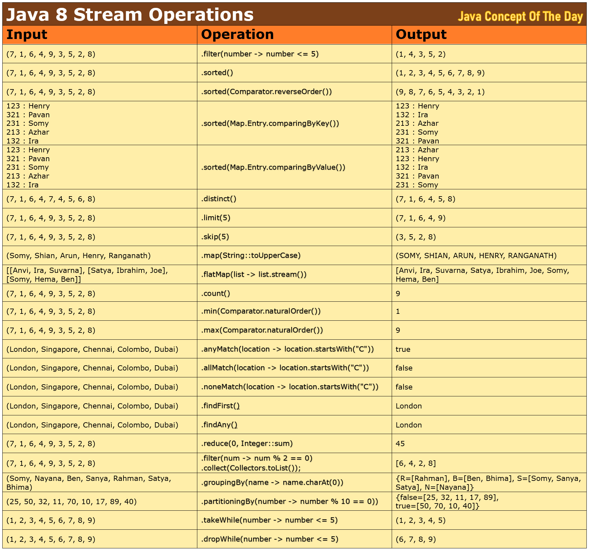

# Java 8 Lambda Streams Coding Examples


## Java 8 Lambda Streams Coding Examples :

### 1) Creation of streams

Streams can be created using stream() method of collection types or Stream.of() or Arrays.stream() or Stream.builder() or Stream.iterate() methods and primitive streams can be created using IntStream.of(), LongStream.of() and DoubleStream.of() methods.

```java
List<String> nameList = Arrays.asList("Henry", "Pavan", "Somy", "Azhar", "Ira");
		
//Creating a sequential stream from a collection
Stream<String> nameStream = nameList.stream();   
		
//Creating a parallel stream from a collection
nameStream = nameList.parallelStream();   
		
//Creating a sequential stream from values
nameStream = Stream.of("Henry", "Pavan", "Somy", "Azhar", "Ira");    
		
//Creating a sequential stream from an array
String[] nameArray = new String[] {"Henry", "Pavan", "Somy", "Azhar", "Ira"};
nameStream = Arrays.stream(nameArray);
		
//Creating a sequential stream from Stream.builder()
nameStream = Stream.<String> builder()
									.add("Henry")
									.add("Pavan")
									.add("Somy")
									.add("Azhar")
									.add("Ira").build();
		
//Creating an infinite stream from Stream.generate()
Stream<Double> infinteStream = Stream.generate(Math::random).limit(10);
		
//Creating an infinite stream from Stream.iterate()
Stream<Integer> oddNumbers = Stream.iterate(1, i -> i+2).limit(10);
		
//Creating Primitive Streams
IntStream intNumbers = IntStream.of(1, 2, 3, 4, 5);
LongStream longNumbers = LongStream.of(10L, 20L, 30L, 40L, 50L);
DoubleStream doubleNumbers = DoubleStream.of(1.1, 2.2, 3.3, 4.4, 5.5);
		
//Creating a stream from Files
Stream<String> lines = Files.lines(Paths.get("Sample.txt"));
Stream<Path> list = Files.list(Path.of("C:\\"));
```

### 2) Iteration

forEach() method provides most convenient, concise and readable way to iterate over the elements of a collection type or a stream. forEach() is a default method introduced in Java 8 to Iterable interface which serves as a base interface for all collection types. It takes Consumer type which is a functional interface as an argument either passed as lambda expression or as method reference. forEach() method performs given action on each element of a source.

```java
String[] locations = new String[] {"London", "Bangalore", "New York", "Mumbai", "Beijing"};
		
//Iterating an array using lambda expression
Arrays.stream(locations).forEach(location -> System.out.println(location));
		
//Iterating an array using method reference
Arrays.stream(locations).forEach(System.out::println);
		
List<String> locationsList = Arrays.asList(locations);
		
//Iterating a list
locationsList.forEach(System.out::println);
		
Map<Integer, String> codeToLocationsMap = new HashMap<Integer, String>();
		
codeToLocationsMap.put(111, "London");
codeToLocationsMap.put(222, "Bangalore");
codeToLocationsMap.put(333, "New York");
codeToLocationsMap.put(444, "Mumbai");
codeToLocationsMap.put(555, "Beijing");
		
//Iterating a map
codeToLocationsMap.forEach((key, value) -> System.out.println(key+" : "+value));
```

### 3) Sorting

sorted() method of Stream can be used to sort the elements of a List, a Set, a Map or an array in natural order or according Comparator if supplied.

```java
List<Integer> numberList = Arrays.asList(6, 2, 9, 1, 7, 2, 5);
				
//Sorting a list in natural order
numberList.stream().sorted().forEach(System.out::println);     
//Output : 1, 2, 2, 5, 6, 7, 9
				
//Sorting a list in reverse order
numberList.stream().sorted(Comparator.reverseOrder()).forEach(System.out::println);
//Output : 9, 7, 6, 5, 2, 2, 1
		
Set<String> nameSet = Set.of("Henry", "Pavan", "Somy", "Azhar", "Ira");
		
//Sorting a set in natural order
nameSet.stream().sorted().forEach(System.out::println);
//Output : Azhar, Henry, Ira, Pavan, Somy
		
//Sorting a set in reverse order
nameSet.stream().sorted(Comparator.reverseOrder()).forEach(System.out::println);
//Output : Somy, Pavan, Ira, Henry, Azhar
				
Map<Integer, String> idToNameMap = new HashMap<Integer, String>();
				
idToNameMap.put(123, "Henry");
idToNameMap.put(321, "Pavan");
idToNameMap.put(231, "Somy");
idToNameMap.put(213, "Azhar");
idToNameMap.put(132, "Ira");
				
//Sorting a map in natural order of keys
idToNameMap.entrySet().stream()
						.sorted(Map.Entry.comparingByKey())
						.forEach((entry) -> System.out.println(entry.getKey()+" : "+entry.getValue()));
//Output :
//123 : Henry
//132 : Ira
//213 : Azhar
//231 : Somy
//321 : Pavan
				
//Sorting a map in reverse order of keys
idToNameMap.entrySet().stream()
						.sorted(Map.Entry.comparingByKey(Comparator.reverseOrder()))
								.forEach((entry) -> System.out.println(entry.getKey()+" : "+entry.getValue()));
//Output :
//321 : Pavan
//231 : Somy
//213 : Azhar
//132 : Ira
//123 : Henry
				
//Sorting a map in natural order of values
idToNameMap.entrySet().stream()
						.sorted(Map.Entry.comparingByValue())
						.forEach((entry) -> System.out.println(entry.getKey()+" : "+entry.getValue()));
//Output :
//213 : Azhar
//123 : Henry
//132 : Ira
//321 : Pavan
//231 : Somy
				
//Sorting a map in reverse order of values
idToNameMap.entrySet().stream()
						.sorted(Map.Entry.comparingByValue(Comparator.reverseOrder()))
						.forEach((entry) -> System.out.println(entry.getKey()+" : "+entry.getValue()));
//Output :
//231 : Somy
//321 : Pavan
//132 : Ira
//123 : Henry
//213 : Azhar
```

### 4) Filtering

filter() method is used to filter the elements according to supplied Predicate.

```java
List<Integer> numbers = Arrays.asList(16, 21, 90, 11, 71, 20, 5, 42, 35);
		
//filtering only odd numbers
numbers.stream().filter(number -> number % 2 != 0).forEach(System.out::println);
//Output : 21, 11, 71, 5, 35
				
//filtering only even numbers
numbers.stream().filter(number -> number % 2 == 0).forEach(System.out::println);
//Output : 16, 90, 20, 42
				
List<String> strings = Arrays.asList("London", "Python", "Burma", "Java", "New Jersey");
				
//Filtering strings with length > 5
strings.stream().filter(string -> string.length() > 5).forEach(System.out::println);
//Output : London, Python, New Jersey
				
//Filtering strings containing a letter 'o'
strings.stream().filter(string -> string.contains("o")).forEach(System.out::println);
//Output : London, Python
```

### 5) Removing duplicates
distinct() method removes duplicates from the input source. It is an intermediate operation which consumes a stream and returns a stream of only distinct elements.

```java
int[] numberArray = new int[] {45, 23, 76, 37, 45, 81, 23, 76, 45};
		
//Removing duplicates from an array
Arrays.stream(numberArray).distinct().forEach(System.out::println);
//Output : 45, 23, 76, 37, 81
		
//Removing duplicates from a list
List<String> names = Arrays.asList("Arun", "Henry", "Suvarna", "Arun", "Mansi", "Henry");
names.stream().distinct().forEach(System.out::println);
//Output : Arun, Henry, Suvarna, Mansi
```

### 6) Limiting

limit() method is used to extract only first ‘n’ elements of a stream.

```java
List<Integer> numberList = Arrays.asList(83, 21, 77, 38, 56, 44, 91, 17, 67);
		
//Extracting first 3 elements of numberList
numberList.stream().limit(3).forEach(System.out::println);
//Output : 83, 21, 77
		
//Extracting first 5 elements of numberList
numberList.stream().limit(5).forEach(System.out::println);
//Output : 83, 21, 77, 38, 56
```

### 7) Skipping

skip() method skips first ‘n’ elements and returns remaining elements of a stream.

```java
List<Integer> numberList = Arrays.asList(83, 21, 77, 38, 56, 44, 91, 17, 67);
		
//Skipping first 3 elements and printing remaining elements
numberList.stream().skip(3).forEach(System.out::println);
//Output : 38, 56, 44, 91, 17, 67
		
//Skipping first 5 elements and printing remaining elements
numberList.stream().skip(5).forEach(System.out::println);
//Output : 44, 91, 17, 67
```

### 8) Transforming
map() method is used to transform the elements of a stream by applying the given function to each element of a stream.

```java
List<String> names = Arrays.asList("Somy", "Shian", "Arun", "Henry", "Ranganath");
		
//Transforming names into UPPERCASE
names.stream().map(String::toUpperCase).forEach(System.out::println);
//Output : SOMY, SHIAN, ARUN, HENRY, RANGANATH
		
List<Integer> numbers = Arrays.asList(11, 32, 23, 47, 75, 63);
		
//Transforming numbers into negative numbers
numbers.stream().map(Math::negateExact).forEach(System.out::println);
//Output : -11, -32, -23, -47, -75, -63
```

### 9) Flattening
flatMap() method is used to transform Stream<stream<T>> to Stream<R>. It removes an extra nested layer around the elements.

```java
List<String> nameList1 = Arrays.asList("Anvi", "Ira", "Suvarna");
List<String> nameList2 = Arrays.asList("Satya", "Ibrahim", "Joe");
List<String> nameList3 = Arrays.asList("Somy", "Hema", "Ben");
		
List<List<String>> nameList = Arrays.asList(nameList1, nameList2, nameList3);
		
//Before Flattening
System.out.println(nameList);
//Output : [[Anvi, Ira, Suvarna], [Satya, Ibrahim, Joe], [Somy, Hema, Ben]]
		
//After Flattening
List<String> names = nameList.stream().flatMap(list -> list.stream()).toList();
System.out.println(names);
//Output : [Anvi, Ira, Suvarna, Satya, Ibrahim, Joe, Somy, Hema, Ben]
```

### 10) Counting

count() returns number of elements in a stream. It is a terminal operation.

```java
int[] intArray = new int[] {1, 2, 3, 4, 5 , 6, 7};
		
Long itemCount = Arrays.stream(intArray).count();
		
System.out.println(itemCount);    //Output : 7
```

### 11) Minimum And Maximum

min() method returns minimum element and max() method returns maximum element in a stream. Both methods return value enclosed in an Optional object.

```java
List<Double> decimals = Arrays.asList(34.21, 56.98, 13.89, 87.23, 21.56);
		
//Minimum
decimals.stream().min(Comparator.naturalOrder()).ifPresent(System.out::println);
//Output : 13.89
		
//Maximum
decimals.stream().max(Comparator.naturalOrder()).ifPresent(System.out::println);
//Output : 87.23
```

### 12) anyMatch, allMatch, noneMatch
anyMatch(), allMatch() and noneMatch() methods take Predicate as an argument and returns boolean (true or false) as a result. anyMatch() returns true if any one element of a stream matches with given predicate, allMatch() returns true if all elements of a stream match with given predicate and noneMatch() returns true if none of the elements of a stream matches with given predicate.

```java
List<String> locations = Arrays.asList("London", "Singapore", "Chennai", "Colombo", "Dubai", "Mambai");
		
//Checking allMatch
boolean result = locations.stream().allMatch(location -> location.startsWith("C"));
System.out.println(result);
//Output : false
		
//Checking anyMatch
result = locations.stream().anyMatch(location -> location.startsWith("C"));
System.out.println(result);
//Output : true
		
//Checking noneMatch
result = locations.stream().noneMatch(location -> location.startsWith("C"));
System.out.println(result);
//Output : false
```

### 13) findFirst, findAny

findFirst() returns first element of a stream and findAny() returns any element of a stream. Both methods return value enclosed in an Optional object.

```java
List<String> locations = Arrays.asList("London", "Singapore", "Chennai", "Colombo", "Dubai", "Mumbai");
		
//Finding first element
Optional<String> firstElement = locations.stream().findFirst();
firstElement.ifPresent(System.out::println);
//Output : London
		
//Finding any element
Optional<String> anyElement = locations.stream().findAny();
anyElement.ifPresent(System.out::println);
//Output : London
```

### 14) Reducing

    reduce() method combines all elements of a stream according to given accumulator function and produces a single result.

```java
List<Integer> numbers = Arrays.asList(1, 2, 4, 8, 16, 32, 64);
		
//Reducing numbers into sum
Integer sumOfNumbers = numbers.stream().reduce(0, Integer::sum);
System.out.println(sumOfNumbers);
//Output : 127
		
//Reducing locations into single string
List<String> locations = Arrays.asList("London", "Singapore", "Chennai", "Colombo", "Dubai", "Mumbai");
String resultString = locations.stream().reduce("", String::concat);
System.out.println(resultString);
//Output : LondonSingaporeChennaiColomboDubaiMumbai
```

### 15) Collecting

collect() method is used to collect the result into a list or a set or a map or any collection type.

```java
List<String> names = Arrays.asList("Somy", "Nayana", "Ben", "Sanya", "Rahman", "Satya", "Bhima");
		
//Collecting names starting with 'S' into a list
List<String> namesStartingWithS = names.stream()
										.filter(name -> name.startsWith("S"))
										.collect(Collectors.toList());
System.out.println(namesStartingWithS);
//Output : [Somy, Sanya, Satya]
		
List<Integer> numbers = Arrays.asList(21, 44, 8, 55, 68, 17, 21, 3, 55);
		
//Collecting distinct odd numbers into a list
List<Integer> distinctOddNumbers = numbers.stream()
											.filter(number -> number % 2 != 0)
											.distinct()
											.collect(Collectors.toList());
System.out.println(distinctOddNumbers);
//Output : [21, 55, 17, 3]
```

### 16) Grouping
Collectors.groupingBy() method groups the elements of a stream according to supplied classifier function. Collectors is an utility class which contain many reduction operations like groupingBy, partitioningBy, joining, summing, averaging, summarizing etc…

```java
List<String> names = Arrays.asList("Somy", "Nayana", "Ben", "Sanya", "Rahman", "Satya", "Bhima");
		
//names grouped by first letter
Map<Character, List<String>> namesGroupedByFirstLetter 
						= names.stream()
								.collect(Collectors.groupingBy(name -> name.charAt(0)));
System.out.println(namesGroupedByFirstLetter);
//Output : {R=[Rahman], B=[Ben, Bhima], S=[Somy, Sanya, Satya], N=[Nayana]}
		
//names grouped by their length
Map<Integer, List<String>> namesGroupedByLength 
						= names.stream()
								.collect(Collectors.groupingBy(String::length));
System.out.println(namesGroupedByLength);
//Output : {3=[Ben], 4=[Somy], 5=[Sanya, Satya, Bhima], 6=[Nayana, Rahman]}
```

### 17) Partitioning

Collectors.partitioningBy() method partitions the stream according to supplied Predicate.

```java
List<Integer> numbers = Arrays.asList(25, 50, 32, 11, 70, 10, 17, 89, 40);
		
//Partitioning the numbers by multiples of 10
Map<Boolean, List<Integer>> numbersPartitionedByMultiplesOf10 
				= numbers.stream()
						.collect(Collectors.partitioningBy(number -> number % 10 == 0));
System.out.println(numbersPartitionedByMultiplesOf10);
//Output : {false=[25, 32, 11, 17, 89], true=[50, 70, 10, 40]}
```

### 18) Summarizing the numbers

Collectors.summarizingInt/Double/Long() methods return summary statistics of stream of numbers like count, max, min, sum, average etc…

```java
List<Integer> numbers = Arrays.asList(25, 50, 32, 11, 70, 10, 17, 89, 40);
		
IntSummaryStatistics numbersSummary= numbers.stream().collect(Collectors.summarizingInt(Integer::intValue));
		
System.out.println("Count : "+numbersSummary.getCount());
System.out.println("Max : "+numbersSummary.getMax());
System.out.println("Min : "+numbersSummary.getMin());
System.out.println("Sum : "+numbersSummary.getSum());
System.out.println("Average : "+numbersSummary.getAverage());
		
//Output :
//Count : 9
//Max : 89
//Min : 10
//Sum : 344
//Average : 38.22
```

### 19) Creating Runnable And Thread

```java
//Creating Runnable
Runnable task = () -> System.out.println("Runnnnn.....");
new Thread(task).start();

//Creating Thread
new Thread(() -> System.out.println("Runnnnnn....")).start();
```

### 20) takeWhile, dropWhile

takeWhile() and dropWhile() works well for ordered streams. takeWhile() returns elements of a stream until given predicate holds true and drops remaining elements. dropWhile() drops elements of a stream until given predicate holds true and returns remaining elements. These methods are introduced from Java 9.

```java
List<Integer> numbers = Arrays.asList(1, 2, 3, 4, 5, 6, 7, 8, 9);
		
//taking numbers <= 5 and dropping remaining numbers
numbers.stream().takeWhile(number -> number <= 5).forEach(System.out::println);
//Output : 1, 2, 3, 4, 5
		
//Dropping numbers <= 5 and taking remaining numbers
numbers.stream().dropWhile(number -> number <= 5).forEach(System.out::println);
//Output : 6, 7, 8, 9
```