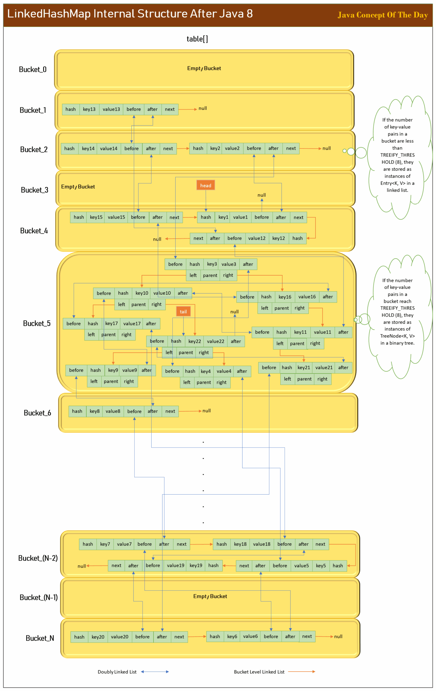

# How LinkedHashMap Works Internally After Java 8?

## Table of Contents

- [How LinkedHashMap Works Internally After Java 8?](#how-linkedhashmap-works-internally-after-java-8)
  - [LinkedHashMap Internal Structure After Java 8 :](#linkedhashmap-internal-structure-after-java-8)
    - [1) Core Internal Data Structure](#1-core-internal-data-structure)
    - [2) Order Of Elements : Insertion Or Access](#2-order-of-elements-insertion-or-access)
  - [How LinkedHashMap Works Internally After Java 8?](#how-linkedhashmap-works-internally-after-java-8-2)
  - [How put(), putIfAbsent() & putAll() methods work?](#how-put-putifabsent-putall-methods-work)
    - [put() calling putVal() :](#put-calling-putval)
    - [putVal() Method :](#putval-method)
    - [newNode() Method :](#newnode-method)
    - [linkNodeAtEnd() Method :](#linknodeatend-method)
    - [afterNodeAccess() Method :](#afternodeaccess-method)
    - [afterNodeInsertion() Method :](#afternodeinsertion-method)
  - [How get() and getOrDefault() methods work?](#how-get-and-getordefault-methods-work)
    - [get() Method :](#get-method)
    - [getOrDefault() Method :](#getordefault-method)
  - [How replace() method works?](#how-replace-method-works)
  - [How remove() method works?](#how-remove-method-works)
    - [remove() calling removeNode() :](#remove-calling-removenode)
    - [removeNode() calling afterNodeRemoval() :](#removenode-calling-afternoderemoval)
    - [afterNodeRemoval() Method :](#afternoderemoval-method)
    - [5) Traversal](#5-traversal)

---


LinkedHashMap is an ordered implementation of Map interface where elements are ordered either in insertion order or in access order. LinkedHashMap extends HashMap, so all the functionalities of HashMap are inherited to LinkedHashMap by default. With addition to these inherited functionalities, LinkedHashMap internally maintains one doubly linked list to inject the order among the elements. You can say that LinkedHashMap is an ordered version of HashMap. In this post, we will see LinkedHashMap internal structure after Java 8, how it maintains order among the elements and how LinkedHashMap methods work internally after Java 8 with some source code explanation.

[⬆ Back to top](#table-of-contents)

## LinkedHashMap Internal Structure After Java 8 :
As LinkedHashMap extends HashMap, the core internal structure of LinkedHashMap remains the same as HashMap. LinkedHashMap also internally maintains an array of buckets where each bucket holds key-value pairs either stored as linked list or as binary tree (Java 8+) if the number of key-value pairs in a bucket reach TREEIFY_THRESHOLD (it is 8, by default).

With addition to this, LinkedHashMap internally maintains one extra doubly linked list which is responsible for maintaining the order of elements.

**Note :**

Don’t confuse doubly linked list with bucket level linked list. Doubly linked list is globally maintained by LinkedHashMap running through all of its elements internally connecting them in an order. Where as bucket level linked list is specific to that bucket which holds key-value pairs of that bucket only.

If you go through the source code of LinkedHashMap, you will notice that it’s developers have not touched the core functionalities inherited from HashMap. Node<K, V> is the static inner class of HashMap which defines the core structure of a node in a bucket. LinkedHashMap extends this inner class of HashMap and adds two more fields – before and after. These two fields make all the elements (key-value pairs) inter-connected via a globally maintained doubly linked list in an order – insertion or access. This is the main structural modification they have done to LinkedHashMap. The remaining internal structures largely remains the same.

[⬆ Back to top](#table-of-contents)

### 1) Core Internal Data Structure
In HashMap, if a bucket is a linked list, key-value pairs are stored as instances of Node<K, V> and if a bucket is a binary tree, key-value pairs are stored as instances of TreeNode<K, V>. Both Node<K, V> and TreeNode<K, V> are static inner classes of HashMap.

In LinkedHashMap, if a bucket is a linked list, key-value pairs are stored as instances of Entry<K, V> which is a static inner class of LinkedHashMap and if a bucket is a binary tree, key-value pairs are stored as instances of TreeNode<K, V> which is a static inner class of HashMap.

```java
Node<K, V> Hierarchy :

HashMap.Node<K, V> defines the basic structure of a node in a bucket. It has four fields – hash, key, value and next.

LinkedHashMap.Entry<K, V> extends HashMap.Node<K, V> and adds two more fields – before and after.

HashMap.TreeNode<K, V> extends LinkedHashMap.Entry<K, V> and adds three more fields – parent, left and right.
```

From above hierarchy, we can come to conclusion that all nodes (key-value pairs) in a LinkedHashMap are instances of LinkedHashMap.Entry<K, V> and will have two pointers – before and after – which are essential to maintain order among the elements.

```java
static class LinkedHashMap.Entry<K,V> extends HashMap.Node<K,V> 
{
        Entry<K,V> before, after;
        
        Entry(int hash, K key, V value, Node<K,V> next) 
        {
            super(hash, key, value, next);
        }
}
```

before points to previously inserted or accessed element and after points to next inserted or accessed element. These two fields form the core of the ordering functionality of LinkedHashMap. These two fields make elements linked together in a doubly linked list. These two pointer are maintained even when a bucket is treeified as TreeNode<K, V> extends Entry<K, V> class.

Along with this Entry<K, V> inner class, LinkedHashMap has two more global fields – head and tail. head points to oldest or first entry of a doubly linked list and tail points to newest or last entry of a doubly linked list.

```java
// The head (eldest) of the doubly linked list.

transient LinkedHashMap.Entry<K,V> head;

//The tail (youngest) of the doubly linked list.

transient LinkedHashMap.Entry<K,V> tail;
```

[⬆ Back to top](#table-of-contents)

### 2) Order Of Elements : Insertion Or Access
LinkedHashMap maintains order of elements as they are inserted (Insertion Order) or as they are accessed (Access Order). By default, it is insertion order. If you want your elements to be ordered as they are accessed, you can configure it while creating the LinkedHashMap itself.

```java
final boolean accessOrder; //true for access order, false for insertion order

public LinkedHashMap(int initialCapacity, float loadFactor, boolean accessOrder) {
        super(initialCapacity, loadFactor);
        this.accessOrder = accessOrder;
}
```

According to LinkedHashMap doc, order of elements changes when a LinkedHashMap is structurally modified.

Structural modification in insertion ordered LinkedHashMap is any operation that adds or deletes one or more elements. Simply changing the value of an existing key is not treated as structural modification in insertion ordered LinkedHashMaps.

Insertion order changes when you invoke put(), putAll(), putIfAbsent(), remove(), removeAll(), retainAll() or any query which successfully add or delete one or more elements from the map.

In access-ordered LinkedHashMap, even a querying the map with get() method is treated as structural modification.

Access order changes when you invoke put(), putAll(), putIfAbsent(), get(), getOrDefault(), compute(), computeIfAbsent(), computeIfPresent(), merge(), replace(), replaceAll() or any query which successfully access one or more elements of the map.

Below image best describes the LinkedHashMap internal structure after Java 8.



[⬆ Back to top](#table-of-contents)

## How LinkedHashMap Works Internally After Java 8?

Let’s see how different methods of LinkedHashMap work internally after Java 8.

LinkedHashMap developers have not modified the main methods inherited from HashMap. Instead, they have overridden and modified some hook methods specially provided by HashMap developers to be overridden in LinkedHashMap. These hook methods eventually called by the main methods.

[⬆ Back to top](#table-of-contents)

## How put(), putIfAbsent() & putAll() methods work?
put(), putIfAbsent() & putAll() – all these methods internally call putVal() method which executes all core operations of inserting a key-value pair into a map like calculating bucket index, inserting a new node if bucket is empty, if bucket is not empty, traversing that bucket (linked list or binary tree) to find out whether given key already exist, if key already exist, updating its value with new value, if key doesn’t exist, inserting a new node at appropriate place in the bucket (linked list or binary tree), treeifying a bucket if number of nodes in a bucket exceed TREEIFY_THRESHOLD, resizing table[] if it has reached THRESHOLD. All these core operations are carried out by putVal() method.

[⬆ Back to top](#table-of-contents)

### put() calling putVal() :

```java
public V put(K key, V value) 
{
        return putVal(hash(key), key, value, false, true);
}
```

[⬆ Back to top](#table-of-contents)

### putVal() Method :

```java
final V putVal(int hash, K key, V value, boolean onlyIfAbsent, boolean evict) 
{
        Node<K,V>[] tab; Node<K,V> p; int n, i;
        if ((tab = table) == null || (n = tab.length) == 0)
            n = (tab = resize()).length;
        if ((p = tab[i = (n - 1) & hash]) == null)
            tab[i] = newNode(hash, key, value, null);
        else 
        {
            Node<K,V> e; K k;
            if (p.hash == hash &&
                ((k = p.key) == key || (key != null && key.equals(k))))
                e = p;
            else if (p instanceof TreeNode)
                e = ((TreeNode<K,V>)p).putTreeVal(this, tab, hash, key, value);
            else 
            {
                for (int binCount = 0; ; ++binCount) 
                {
                    if ((e = p.next) == null) 
                    {
                        p.next = newNode(hash, key, value, null);
                        if (binCount >= TREEIFY_THRESHOLD - 1) // -1 for 1st
                            treeifyBin(tab, hash);
                        break;
                    }
                    if (e.hash == hash &&
                        ((k = e.key) == key || (key != null && key.equals(k))))
                        break;
                    p = e;
                }
            }
            if (e != null) 
            { // existing mapping for key
                V oldValue = e.value;
                if (!onlyIfAbsent || oldValue == null)
                    e.value = value;
                afterNodeAccess(e);
                return oldValue;
            }
        }
        ++modCount;
        if (++size > threshold)
            resize();
        afterNodeInsertion(evict);
        return null;
}
```

If you notice putVal() method, it internally calls newNode(), afterNodeAccess() and afterNodeInsertion() methods (highlighted). These three methods are hook methods specially provided by HashMap to be overridden in LinkedHashMap. LinkedHashMap overrides these hook methods and inject its ordering logic in these methods.

[⬆ Back to top](#table-of-contents)

### newNode() Method :

It just creates a new LinkedHashMap.Entry object, links it at the end of doubly linked list and returns it.

```java
Node<K,V> newNode(int hash, K key, V value, Node<K,V> e) 
{
        LinkedHashMap.Entry<K,V> p = new LinkedHashMap.Entry<>(hash, key, value, e);
        linkNodeAtEnd(p);
        return p;
}
```

linkNodeAtEnd() is internal utility method of LinkedHashMap which links the node at the end of globally maintained doubly linked list by default or at the beginning of doubly linked list if it is PUT_FIRST.

[⬆ Back to top](#table-of-contents)

### linkNodeAtEnd() Method :

```java
private void linkNodeAtEnd(LinkedHashMap.Entry<K,V> p) 
{
        if (putMode == PUT_FIRST) 
        {
            //Linking node at the beginning
            LinkedHashMap.Entry<K,V> first = head;
            head = p;
            if (first == null)
                tail = p;
            else 
            {
                p.after = first;
                first.before = p;
            }
        } 
        else 
        {
            //Linking node at the end
            LinkedHashMap.Entry<K,V> last = tail;
            tail = p;
            if (last == null)
                head = p;
            else 
           {
                p.before = last;
                last.after = p;
            }
        }
}
```

[⬆ Back to top](#table-of-contents)

### afterNodeAccess() Method :

It is called only when accessOrder is true. It moves recently accessed node at the end or beginning of doubly linked list depending upon putMode after removing it from its current position and updating its current neighbours (before and after pointers).

```java
void afterNodeAccess(Node<K,V> e) 
{
        LinkedHashMap.Entry<K,V> last;
        LinkedHashMap.Entry<K,V> first;
        if ((putMode == PUT_LAST || (putMode == PUT_NORM && accessOrder)) && (last = tail) != e) 
        {
            // move node to last
            LinkedHashMap.Entry<K,V> p =
                (LinkedHashMap.Entry<K,V>)e, b = p.before, a = p.after;
            p.after = null;
            if (b == null)
                head = a;
            else
                b.after = a;
            if (a != null)
                a.before = b;
            else
                last = b;
            if (last == null)
                head = p;
            else 
            {
                p.before = last;
                last.after = p;
            }
            tail = p;
            ++modCount;
        } 
        else if (putMode == PUT_FIRST && (first = head) != e) 
        {
            // move node to first
            LinkedHashMap.Entry<K,V> p =
                (LinkedHashMap.Entry<K,V>)e, b = p.before, a = p.after;
            p.before = null;
            if (a == null)
                tail = b;
            else
                a.before = b;
            if (b != null)
                b.after = a;
            else
                first = a;
            if (first == null)
                tail = p;
            else {
                p.after = first;
                first.before = p;
            }
            head = p;
            ++modCount;
        }
}
```

[⬆ Back to top](#table-of-contents)

### afterNodeInsertion() Method :

It is called only when an oldest entry has to be deleted for every new entry inserted into doubly linked list. It is useful when you are developing a LRU cache where fixed number of entries are to be maintained in a cache and old entries has to be deleted as new entries are inserted.

```java
void afterNodeInsertion(boolean evict) 
{ 
        // possibly remove eldest
        LinkedHashMap.Entry<K,V> first;
        if (evict && (first = head) != null && removeEldestEntry(first)) 
        {
            K key = first.key;
            removeNode(hash(key), key, null, false, true);
        }
}
```

[⬆ Back to top](#table-of-contents)

## How get() and getOrDefault() methods work?
get() and getOrDefault() methods internally call getNode() method which performs all core operation of extracting a node from the bucket after calculating bucket index, traversing a linked list or a binary tree of that bucket and extracting a value associated with a given key if it exist.

After a node is retrieved, LinkedHashMap updates doubly linked list if access order is to be maintained by calling afterNodeAccess() method.

[⬆ Back to top](#table-of-contents)

### get() Method :

```java
public V get(Object key) 
{
        Node<K,V> e;
        if ((e = getNode(key)) == null)
            return null;
        if (accessOrder)
            afterNodeAccess(e);
        return e.value;
}
```

[⬆ Back to top](#table-of-contents)

### getOrDefault() Method :

```java
public V getOrDefault(Object key, V defaultValue) 
{
       Node<K,V> e;
       if ((e = getNode(key)) == null)
           return defaultValue;
       if (accessOrder)
           afterNodeAccess(e);
       return e.value;
}
```

[⬆ Back to top](#table-of-contents)

## How replace() method works?

replace() method works same as get() method. It retrieves the node by calling getNode() method. If given key matches with retrieved key, old value is replaced with new value. Access order is updated by calling afterNodeAccess() method.

```java
public V replace(K key, V value) 
{
        Node<K,V> e;
        if ((e = getNode(key)) != null) 
        {
            V oldValue = e.value;
            e.value = value;
            afterNodeAccess(e);
            return oldValue;
        }
        return null;
}
```

[⬆ Back to top](#table-of-contents)

## How remove() method works?
remove() method is not overridden in LinkedHashMap. remove() method internally calls removeNode() method which performs majority of removal operation like calculating bucket index, traversing that bucket (linked list or binary tree) to find out the given key, if key exist, removing the key from the bucket after updating its neighbours.

After a node is successfully removed from a bucket, removeNode() calls afterNodeRemoval() method. afterNodeRemoval() is a hook method which is overridden in LinkedHashMap. It unlinks the removed node from the doubly linked list.

[⬆ Back to top](#table-of-contents)

### remove() calling removeNode() :

```java
public V remove(Object key) 
{
        Node<K,V> e;
        return (e = removeNode(hash(key), key, null, false, true)) == null ?
            null : e.value;
}
```

[⬆ Back to top](#table-of-contents)

### removeNode() calling afterNodeRemoval() :

```java
final Node<K,V> removeNode(int hash, Object key, Object value, boolean matchValue, boolean movable) 
{
        Node<K,V>[] tab; Node<K,V> p; int n, index;
        if ((tab = table) != null && (n = tab.length) > 0 &&
            (p = tab[index = (n - 1) & hash]) != null) 
        {
            Node<K,V> node = null, e; K k; V v;
            if (p.hash == hash &&
                ((k = p.key) == key || (key != null && key.equals(k))))
                node = p;
            else if ((e = p.next) != null) 
            {
                if (p instanceof TreeNode)
                    node = ((TreeNode<K,V>)p).getTreeNode(hash, key);
                else 
                {
                    do 
                    {
                        if (e.hash == hash &&
                            ((k = e.key) == key ||
                             (key != null && key.equals(k)))) 
                        {
                            node = e;
                            break;
                        }
                        p = e;
                    } while ((e = e.next) != null);
                }
            }
            if (node != null && (!matchValue || (v = node.value) == value ||
                                 (value != null && value.equals(v)))) 
            {
                if (node instanceof TreeNode)
                    ((TreeNode<K,V>)node).removeTreeNode(this, tab, movable);
                else if (node == p)
                    tab[index] = node.next;
                else
                    p.next = node.next;
                ++modCount;
                --size;
                afterNodeRemoval(node);
                return node;
            }
        }
        return null;
}
```

[⬆ Back to top](#table-of-contents)

### afterNodeRemoval() Method :

```java
void afterNodeRemoval(Node<K,V> e) 
{ 
        // unlinking the node from doubly linked list
        LinkedHashMap.Entry<K,V> p =
            (LinkedHashMap.Entry<K,V>)e, b = p.before, a = p.after;
        p.before = p.after = null;
        if (b == null)
            head = a;
        else
            b.after = a;
        if (a == null)
            tail = b;
        else
            a.before = b;
}
```

[⬆ Back to top](#table-of-contents)

### 5) Traversal
Traversal of a LinkedHashMap is carried out via globally maintained doubly linked list not through the array of buckets. Hence, elements are traversed as they are inserted or as they are accessed if access order is configured.
[⬆ Back to top](#table-of-contents)
