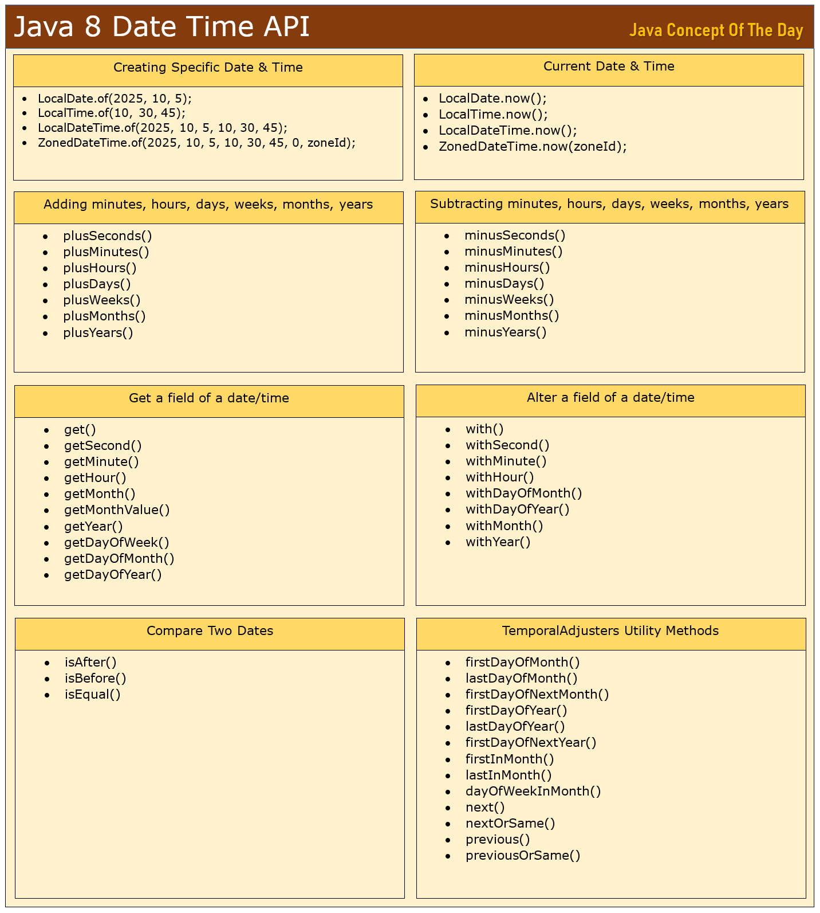

# Java 8 Date Time API : Coding Examples

Java 8 Date Time API is one such Java 8 feature which do wonder while working with date and time queries in real time. Earlier to Java 8, java.util.Date and java.util. Calendar classes are used to work with date and time. They find it difficult to solve some complex real time queries regarding date and time. Using Java 8 Date Time API, you can solve any complex queries with ease. On top of that, Java 8 Date Time API classes are immutable and thread-safe. You can use them in a multithread environment without any worries.

## Java 8 Date Time API :
Important Classes :

* LocalDate : Only Date
* LocalTime : Only Time
* LocalDateTime : Both Date and Time
* ZonedDateTime : Both date and time with time zone
* ZoneId : Time Zone ID like “Asia/Kolkata”, “Europe/London”, “America/New_York” etc…
* Instant : Timestamp
* Period : Date-based amount of time in terms of years, months and days.
* Duration : Time-based amount of time in terms of hours, minutes, seconds, milliseconds and nanoseconds.
* DateTimeFormatter : Contains date time formatter and parser methods.
* TemporalField : Represents field of a date or time like hour, minute, month, year etc…
* TemporalAdjuster : Strategy for altering a date or time.
* TemporalAdjusters : Contains many static utility methods which can be used to compose a strategy for altering a date or time.

### Important Methods :

* of() : Creates specific date time objects.
* now() : Returns current date and time.
* plusDays(), plusWeeks(), plusMonths(), plusYears() : Used to add days, weeks, months and years to a date.
* minusDays(), minusWeeks(), minusMonths(), minusYears() : Used to subtract days, weeks, months and years from a date.
* get(TemporalField field) : used to get specified field of a given date or time.
* getSecond(), getMinute(), getHour(), getMonth(), getMonthValue(), getYear(), getDayOfWeek(), getDayOfMonth(), getDayOfYear() : Used to get respective field of a given date or time.
* isAfter(), isBefore(), isEqual() : Used to compare two dates.
* with() : Used to alter given date or time.
* withSecond(), withMinute(), withHour(), withDayOfMonth(), withDayOfYear(), withMonth(), withYear() : Used to alter respective field of a given date or time.



## Java 8 Date Time API : Coding Examples

### 1) How do you create date and time objects using Java 8 Date Time API?
Using of() method of LocalDate, LocalTime, LocalDateTime and ZonedDateTime.

```java
//Only date
LocalDate date = LocalDate.of(2025, 10, 5);   //5 October 2025  
         
//Only time
LocalTime time = LocalTime.of(10, 30, 45);    //10:30:45 AM
         
//Both date and time
LocalDateTime dateTime = LocalDateTime.of(2025, 10, 5, 10, 30, 45);  //5 October 2025, 10:30:45 AM
         
//Date and time with time zone
ZoneId zoneId = ZoneId.of("Europe/London");
ZonedDateTime zonedDateTime = ZonedDateTime.of(2025, 10, 5, 10, 30, 45, 0, zoneId);  //5 October 2025, 10:30:45:0 AM [Europe/London]

```
### 2) How do you get current date and time?
Using now() method.
```java
//Current date
LocalDate date = LocalDate.now();  
         
//Current time
LocalTime time = LocalTime.now();
         
//Current date and time
LocalDateTime dateTime = LocalDateTime.now();
         
//Current date and time of "Europe/London" zone
ZoneId zoneId = ZoneId.of("Europe/London");
ZonedDateTime zonedDateTime = ZonedDateTime.now(zoneId);
```
### 3) What is the time right now at New Delhi, London, Singapore, New York and Sydney?
To find out the current date and time at different time zones, use now() method of ZonedDateTime which takes ZoneId as parameter.

```java
import java.time.ZoneId;
import java.time.ZonedDateTime;
import java.time.format.DateTimeFormatter;
 
public class Java8DateTimeAPIExample 
{
    public static void main(String[] args) 
    {   
        DateTimeFormatter formatter = DateTimeFormatter.ofPattern("dd MMM yyyy hh:mm:ss a");
         
        ZoneId newDelhiZone = ZoneId.of("Asia/Kolkata");
        ZonedDateTime newDelhiTime = ZonedDateTime.now(newDelhiZone);
        System.out.println("New Delhi Time : "+formatter.format(newDelhiTime));
         
        ZoneId londonZone = ZoneId.of("Europe/London");
        ZonedDateTime londonTime = ZonedDateTime.now(londonZone);
        System.out.println("London Time : "+formatter.format(londonTime));
         
        ZoneId singaporeZone = ZoneId.of("Asia/Singapore");
        ZonedDateTime singaporeTime = ZonedDateTime.now(singaporeZone);
        System.out.println("Singapore Time : "+formatter.format(singaporeTime));
         
        ZoneId newYorkZone = ZoneId.of("America/New_York");
        ZonedDateTime newYorkTime = ZonedDateTime.now(newYorkZone);
        System.out.println("New York Time : "+formatter.format(newYorkTime));
         
        ZoneId sydneyZone = ZoneId.of("Australia/Sydney");
        ZonedDateTime sydneyTime = ZonedDateTime.now(sydneyZone);
        System.out.println("Sydney Time : "+formatter.format(sydneyTime));
    }
}
```

### 4) How do you get all available time zones?

Using getAvailableZoneIds() of ZoneId class.
```java
	
ZoneId.getAvailableZoneIds().forEach(zoneId -> System.out.println(zoneId));
```

### 5) How do you get date after 1 week or before 1 week or after 1 month or before 1 month or after 1 year or before 1 year?

To add days, weeks, months or years to current date or to a specific date, use plusDays(), plusWeeks(), plusMonths(), plusYears() and to subtract days, weeks, months or years from current date or from a specific date, use minusDays(), minusWeeks(), minusMonths() and minusYears() respectively.

```java
import java.time.LocalDate;
import java.time.format.DateTimeFormatter;
 
public class Java8DateTimeAPIExample 
{
    public static void main(String[] args) 
    {   
        DateTimeFormatter formatter = DateTimeFormatter.ofPattern("dd MMM yyy");
         
        //Today's date
        LocalDate today = LocalDate.now();
        System.out.println("Today : "+formatter.format(today));
         
        System.out.println("=====================");
         
        //Date after 1 week
        LocalDate afterOneWeek = today.plusWeeks(1);
        System.out.println("After 1 Week : "+formatter.format(afterOneWeek));
         
        //Date before 1 week
        LocalDate beforeOneWeek = today.minusWeeks(1);
        System.out.println("Before 1 Week : "+formatter.format(beforeOneWeek));
         
        System.out.println("=====================");
         
        //Date after 1 month
        LocalDate afterOneMonth = today.plusMonths(1);
        System.out.println("After 1 Month : "+formatter.format(afterOneMonth));
         
        //Date before 1 month
        LocalDate beforeOneMonth = today.minusMonths(1);
        System.out.println("Before 1 Month : "+formatter.format(beforeOneMonth));
         
        System.out.println("=====================");
         
        //Date after 1 year
        LocalDate afterOneYear = today.plusYears(1);
        System.out.println("After 1 Year : "+formatter.format(afterOneYear));
         
        //Date before 1 year
        LocalDate beforeOneYear = today.minusYears(1);
        System.out.println("Before 1 Year : "+formatter.format(beforeOneYear));
    }
}
```

Output :

```java
Today : 17 Jun 2025
=====================
After 1 Week : 24 Jun 2025
Before 1 Week : 10 Jun 2025
=====================
After 1 Month : 17 Jul 2025
Before 1 Month : 17 May 2025
=====================
After 1 Year : 17 Jun 2026
Before 1 Year : 17 Jun 2024
```

### 6) How do you find the day of the week of the given date?
Using getDayOfWeek() method.
```java
import java.time.LocalDate;
 
public class Java8DateTimeAPIExample 
{
    public static void main(String[] args) 
    {
        LocalDate date = LocalDate.of(2025, 3, 5);  //5 March 2025
         
        System.out.println(date.getDayOfWeek());   //Output : WEDNESDAY
    }
}
```

### 7) What was the day of the week on today’s date last year?

To get the day of the week on today’s date last year, first get today’s date – LocalDate.now(), subtract 1 year – minusYears(1) and call getDayOfWeek().

```java
LocalDate.now().minusYears(1).getDayOfWeek();

```

### 8) When is the first MONDAY of next month?

First get today’s date – LocalDate.now(), add 1 month – plusMonths(1) and call with() method by passing TemporalAdjusters.firstInMonth(DayOfWeek.MONDAY).

**Note :**

TemporalAdjusters is an utility class in Java 8 Date Time API which contains many static methods like firstDayOfMonth(), lastDayOfMonth(), firstDayOfNextMonth(), firstDayOfYear(), lastDayOfYear(), firstDayOfNextYear(), firstInMonth(), lastInMonth(), dayOfWeekInMonth(), next(), nextOrSame(), previous(), previousOrSame() etc.. which will be very helpful in solving many queries like first MONDAY of next month or next year, Last FRIDAY of previous month or previous year, first or last day of a year or a month, next SUNDAY, last MONDAY etc…

```java
import java.time.DayOfWeek;
import java.time.LocalDate;
import java.time.format.DateTimeFormatter;
import java.time.temporal.TemporalAdjusters;
 
public class Java8DateTimeAPIExample 
{
    public static void main(String[] args) 
    {
        DateTimeFormatter formatter = DateTimeFormatter.ofPattern("dd MMM yyyy");
         
        LocalDate today = LocalDate.now();
         
        LocalDate firstMondayOfNextMonth = today.plusMonths(1).with(TemporalAdjusters.firstInMonth(DayOfWeek.MONDAY)); 
         
        System.out.println("Today : "+today.format(formatter));
         
        System.out.println("First Monday Of Next Month : "+firstMondayOfNextMonth.format(formatter));
    }
}
```

Output :

```java
Today : 18 Jun 2025
First Monday Of Next Month : 07 Jul 2025
```

### 9) How do you find the first FRIDAY of next year?

First get today’s date – LocalDate.now(), then get first day of next year – today.with(TemporalAdjusters.firstDayOfNextYear()) and then call firstDayOfNextYear.with(TemporalAdjusters.nextOrSame(DayOfWeek.FRIDAY)) to get first FRIDAY of next year.

```java
import java.time.DayOfWeek;
import java.time.LocalDate;
import java.time.format.DateTimeFormatter;
import java.time.temporal.TemporalAdjusters;
 
public class Java8DateTimeAPIExample 
{
    public static void main(String[] args) 
    {
        DateTimeFormatter formatter = DateTimeFormatter.ofPattern("dd MMM yyyy");
         
        LocalDate today = LocalDate.now();
         
        LocalDate firstDayOfNextYear = today.with(TemporalAdjusters.firstDayOfNextYear());
         
        LocalDate firstFridayOfNextYear = firstDayOfNextYear.with(TemporalAdjusters.nextOrSame(DayOfWeek.FRIDAY));
         
        System.out.println("Today : "+today.format(formatter));
         
        System.out.println("First FRIDAY Of Next Year : "+firstFridayOfNextYear.format(formatter));
    }
}
```

```java
Output :

Today : 18 Jun 2025
First FRIDAY Of Next Year : 02 Jan 2026
```

### 10) When was the last SUNDAY of year 1997?

```java
import java.time.DayOfWeek;
import java.time.LocalDate;
import java.time.temporal.TemporalAdjusters;
 
public class Java8DateTimeAPIExample 
{
    public static void main(String[] args) 
    {
        //Last day of year 1997
        LocalDate lastDayOfYear = LocalDate.of(1997, 12, 31);
         
        //Last sunday of year 1997
        LocalDate lastSundayOfYear = lastDayOfYear.with(TemporalAdjusters.previousOrSame(DayOfWeek.SUNDAY));
         
        System.out.println(lastSundayOfYear);   //Output : 1997-12-28
    }
}
```

### 11) When is the 2nd and 4th saturday of next month?

First get today’s date, from today’s date get first day of next month, from first day of next month get first SATURDAY of next month, from first SATURDAY of next month get second SATURDAY of next month, from second SATURDAY of next month get fourth SATURDAY of next month.

```java
import java.time.DayOfWeek;
import java.time.LocalDate;
import java.time.format.DateTimeFormatter;
import java.time.temporal.TemporalAdjusters;
 
public class Java8DateTimeAPIExample 
{
    public static void main(String[] args) 
    {
        DateTimeFormatter formatter = DateTimeFormatter.ofPattern("dd-MM-yyyy");
         
        LocalDate today = LocalDate.now();
         
        System.out.println("Today : "+today.format(formatter));
         
        LocalDate firstDayOfNextMonth = today.with(TemporalAdjusters.firstDayOfNextMonth());
         
        LocalDate firstSaturdayOfNextMonth = firstDayOfNextMonth.with(TemporalAdjusters.nextOrSame(DayOfWeek.SATURDAY));
         
        LocalDate secondSaturdayOfNextMonth = firstSaturdayOfNextMonth.plusWeeks(1);
         
        System.out.println("Second saturday of next month : "+secondSaturdayOfNextMonth.format(formatter));
         
        LocalDate fourthSaturdayOfNextMonth = secondSaturdayOfNextMonth.plusWeeks(2);
         
        System.out.println("Fourth saturday of next month : "+fourthSaturdayOfNextMonth.format(formatter));
    }
}

Output :
Today : 18-06-2025
Second saturday of next month : 12-07-2025
Fourth saturday of next month : 26-07-2025
```

### 12) Print date of all SUNDAYs of NOVEMBER 2031?

```java
import java.time.DayOfWeek;
import java.time.LocalDate;
import java.time.Month;
import java.time.format.DateTimeFormatter;
import java.time.temporal.TemporalAdjusters;
 
public class Java8DateTimeAPIExample 
{
    public static void main(String[] args) 
    {
        DateTimeFormatter formatter = DateTimeFormatter.ofPattern("dd-MM-yyyy");
         
        LocalDate firstDayOfMonth = LocalDate.of(2031, 11, 1);
         
        LocalDate sundaysOfMonth = firstDayOfMonth.with(TemporalAdjusters.nextOrSame(DayOfWeek.SUNDAY));
         
        System.out.println("All SUNDAYs of NOVEMBER 2031 :");
         
        System.out.println("======================");
         
        while (sundaysOfMonth.getMonth() == Month.NOVEMBER)
        {
            System.out.println(sundaysOfMonth.format(formatter));
            sundaysOfMonth = sundaysOfMonth.plusWeeks(1);
        }
    }
}

Output :
All SUNDAYs of NOVEMBER 2031 :
======================
02-11-2031
09-11-2031
16-11-2031
23-11-2031
30-11-2031
```

### 13) How do you convert time from 24hr format to 12hr format or vice-versa?

By using ofPattern() method of DateTimeFormatter class. Pattern "HH:mm" will return time in 24hr format where as pattern "hh:mm" will give you time in 12hr format.

```java
import java.time.LocalDateTime;
import java.time.format.DateTimeFormatter;
 
public class Java8DateTimeAPIExample 
{
    public static void main(String[] args) 
    {
        DateTimeFormatter formatter_24hr = DateTimeFormatter.ofPattern("dd MMM yyyy, HH:mm a");
         
        DateTimeFormatter formatter_12hr = DateTimeFormatter.ofPattern("dd MMM yyyy, hh:mm a");
         
        System.out.println("Current Date And Time In 24hr Format : "+formatter_24hr.format(LocalDateTime.now()));
         
        System.out.println("Current Date And Time In 12hr Format : "+formatter_12hr.format(LocalDateTime.now()));
    }
}

Output :
Current Date And Time In 24hr Format : 18 Jun 2025, 15:43 pm
Current Date And Time In 12hr Format : 18 Jun 2025, 03:43 pm
```

### 14) Given a date of birth, find the age in years, months and days?

For such scenarios where difference between two dates is to be calculated in years, months and days, Period.between() method is used. It gives a Period object, through which you can call getYears(), getMonths() and getDays() methods to get years, months and days between two dates.

```java
import java.time.LocalDate;
import java.time.Period;
import java.time.format.DateTimeFormatter;
 
public class Java8DateTimeAPIExample 
{
    public static void main(String[] args) 
    {   
        DateTimeFormatter formatter = DateTimeFormatter.ofPattern("dd-MM-yyyy");
         
        LocalDate dateOfBirth = LocalDate.of(1994, 11, 23);
         
        LocalDate today = LocalDate.now();
         
        Period age = Period.between(dateOfBirth, today);
         
        System.out.println("Date Of Birth : "+dateOfBirth.format(formatter));
         
        System.out.println("Today : "+today.format(formatter));
         
        System.out.println("Current Age : "+age.getYears()+" years "+age.getMonths()+" months "+age.getDays()+" days");
    }
}

Output :
Date Of Birth : 23-11-1994
Today : 18-06-2025
Current Age : 30 years 6 months 26 days

```

### 15) Given a date of birth, find which day of the week he/she was born?

```java
import java.time.LocalDate;
 
public class Java8DateTimeAPIExample 
{
    public static void main(String[] args) 
    {   
        LocalDate dateOfBirth = LocalDate.of(2001, 5, 25);    //25 May 2001
         
        System.out.println(dateOfBirth.getDayOfWeek());    //Output : FRIDAY
    }
}
```

### 16) Given a date, check whether it falls on a weekend?

```java
import java.time.DayOfWeek;
import java.time.LocalDate;
 
public class Java8DateTimeAPIExample 
{
    public static void main(String[] args) 
    {   
        LocalDate date = LocalDate.of(2025, 10, 19);    //19 October 2025
         
        if (date.getDayOfWeek() == DayOfWeek.SATURDAY || date.getDayOfWeek() == DayOfWeek.SUNDAY)
        {
            System.out.println("It is a weekend. Choose another day");
        }
        else
        {
            System.out.println("It is not a weekend. Go ahead");
        }
    }
}

Output :

It is a weekend. Choose another day
```

### 17) When is the first working day of next year?

**OR**

### When was the last working day of last year?

**First Working Day Of Next Year :**

First get today’s date – LocalDate.now() and then get first day of next year by calling TemporalAdjusters.firstDayOfNextYear(). If first day of next year is SUNDAY, next day will be first working day of next year. If first day of next year is SATURDAY, the first working day of next year will be two days later. If first day of next year is neither SUNDAY nor SATURDAY, first day itself will be first working day of next year.

```java
import java.time.DayOfWeek;
import java.time.LocalDate;
import java.time.format.DateTimeFormatter;
import java.time.temporal.TemporalAdjusters;
 
public class Java8DateTimeAPIExample 
{
    public static void main(String[] args) 
    {   
        DateTimeFormatter formatter = DateTimeFormatter.ofPattern("dd-MM-yyyy");
         
        LocalDate today = LocalDate.now();
         
        LocalDate firstDayOfNextYear = today.with(TemporalAdjusters.firstDayOfNextYear());
         
        LocalDate firstWorkingDayOfNextYear;
         
        if (firstDayOfNextYear.getDayOfWeek() == DayOfWeek.SUNDAY)
        {
            firstWorkingDayOfNextYear = firstDayOfNextYear.plusDays(1);
        }
        else if (firstDayOfNextYear.getDayOfWeek() == DayOfWeek.SATURDAY)
        {
            firstWorkingDayOfNextYear = firstDayOfNextYear.plusDays(2);
        }
        else
        {
            firstWorkingDayOfNextYear = firstDayOfNextYear;
        }
         
        System.out.println("Today : "+today.format(formatter));
         
        System.out.println("First Working Day Of Next Year : "+firstWorkingDayOfNextYear.format(formatter));
    }
}

Output :
Today : 18-06-2025
First Working Day Of Next Year : 01-01-2026
```

**Last Working Day Of Last Year :**
First get today’s date – LocalDate.now() and then get last day of last year by calling today.minusYears(1).with(TemporalAdjusters.lastDayOfYear()). If last day of last year was SUNDAY, then last working day of last year was two days before. If last day of last year was SATURDAY, then last working day of last year was a day before. Otherwise last day itself was the last working day of last year.

```java
import java.time.DayOfWeek;
import java.time.LocalDate;
import java.time.format.DateTimeFormatter;
import java.time.temporal.TemporalAdjusters;
 
public class Java8DateTimeAPIExample 
{
    public static void main(String[] args) 
    {   
        DateTimeFormatter formatter = DateTimeFormatter.ofPattern("dd-MM-yyyy");
         
        LocalDate today = LocalDate.now();
         
        LocalDate lastDayOfLastYear = today.minusYears(1).with(TemporalAdjusters.lastDayOfYear());
         
        LocalDate lastWorkingDayOfLastYear;
         
        if (lastDayOfLastYear.getDayOfWeek() == DayOfWeek.SUNDAY)
        {
            lastWorkingDayOfLastYear = lastDayOfLastYear.minusDays(2);
        }
        else if (lastDayOfLastYear.getDayOfWeek() == DayOfWeek.SATURDAY)
        {
            lastWorkingDayOfLastYear = lastDayOfLastYear.minusDays(1);
        }
        else
        {
            lastWorkingDayOfLastYear = lastDayOfLastYear;
        }
         
        System.out.println("Today : "+today.format(formatter));
         
        System.out.println("Last Working Day Of Last Year : "+lastWorkingDayOfLastYear.format(formatter));
    }
}

Output :

Today : 18-06-2025
Last Working Day Of Last Year : 31-12-2024
```

**Note :** Public holidays are not considered in the above example.

### 18) In hotel management system, calculate the duration between check-in and check-out time of a guest? If the check-out time exceeds by 4 hours, count it as one full day?

For such scenarios where time period between two events is to be calculated in terms of days, hours and minutes, we use Duration.between().

```java
import java.time.Duration;
import java.time.LocalDateTime;
import java.time.format.DateTimeFormatter;
 
public class Java8DateTimeAPIExample 
{
    public static void main(String[] args) 
    {
        DateTimeFormatter formatter = DateTimeFormatter.ofPattern("dd MMM yyy, hh:mm a");
         
        //Check-In Date And Time
         
        LocalDateTime checkInTime = LocalDateTime.of(2025, 6, 7, 19, 20);  //7 June 2025, 7:20 PM
         
        //Check-Out Date And Time
         
        LocalDateTime checkOutTime = LocalDateTime.of(2025, 6, 11, 8, 30);   //11 June 2025, 8:30 AM
         
        //Finding the number of full days between checkInTime and checkOutTime
         
        long days = Duration.between(checkInTime, checkOutTime).toDays();
         
        //Finding the time elapsed on last day of check-out
         
        long hours = Duration.between(checkOutTime.toLocalTime(), checkInTime.toLocalTime()).toHours();
         
        System.out.println("Check-In Time : "+checkInTime.format(formatter));
         
        System.out.println("Check-Out Time : "+checkOutTime.format(formatter));
         
        System.out.println("Guest has stayed "+days+" days and "+hours+" hours in the hotel.");
         
        //If time elapsed on last day exceed 4, counting it as 1 day
         
        if (hours >= 4)
        {
            days++;
             
            System.out.println("As check-out time exceeded by "+hours+" hours, counting it as one full day.");
        }
         
        System.out.println("So, number of billing days : "+days);                    
    }
}

Output :
Check-In Time : 07 Jun 2025, 07:20 pm
Check-Out Time : 11 Jun 2025, 08:30 am
Guest has stayed 3 days and 10 hours in the hotel.
As check-out time exceeded by 10 hours, counting it as one full day.
So, number of billing days : 4
```

### 19) In a flight ticket booking system, display arrival and departure times in time zones of respective cities?

Here, we use withZoneSameInstant() method of ZonedDateTime which converts same time instant to multiple time zones. First we create source ZonedDateTime object with ZoneId of source city and with departure time. Then we convert this source ZonedDateTime object to destination ZonedDateTime object by calling withZoneSameInstant() with ZoneId of destination city after adding travel time to it.

```java
import java.time.Duration;
import java.time.ZoneId;
import java.time.ZonedDateTime;
import java.time.format.DateTimeFormatter;
 
public class Java8DateTimeAPIExample 
{
    public static void main(String[] args) 
    {   
        DateTimeFormatter formatter = DateTimeFormatter.ofPattern("dd MMM yyyy hh:mm a z");
         
        //Flight From Bangalore To Singapore
         
        ZonedDateTime bangaloreDeparture = ZonedDateTime.of(2025, 6, 17, 18, 30, 0, 0, ZoneId.of("Asia/Kolkata"));
         
        Duration travelTime = Duration.ofHours(4).plusMinutes(45);
         
        ZonedDateTime singaporeArrival = bangaloreDeparture.plus(travelTime).withZoneSameInstant(ZoneId.of("Asia/Singapore"));
         
        System.out.println("Departure From Bangalore : "+formatter.format(bangaloreDeparture));
         
        System.out.println("Arrival In Singapore : "+formatter.format(singaporeArrival));
         
        System.out.println("=========================");
         
        //Flight From London To New York
         
        ZonedDateTime londonDeparture = ZonedDateTime.of(2025, 8, 12, 8, 45, 0, 0, ZoneId.of("Europe/London"));
         
        travelTime = Duration.ofHours(8).plusMinutes(30);
         
        ZonedDateTime newYorkArrival = londonDeparture.plus(travelTime).withZoneSameInstant(ZoneId.of("America/New_York"));
         
        System.out.println("London Departure : "+formatter.format(londonDeparture));
         
        System.out.println("New York Arrival : "+formatter.format(newYorkArrival));
    }
}

Output :

Departure From Bangalore : 17 Jun 2025 06:30 pm IST
Arrival In Singapore : 18 Jun 2025 01:45 am GMT+08:00
=========================
London Departure : 12 Aug 2025 08:45 am BST
New York Arrival : 12 Aug 2025 12:15 pm GMT-04:00
```

### 20) Calculate the travel time between two cities of different time zones?

```java
import java.time.Duration;
import java.time.ZoneId;
import java.time.ZonedDateTime;
import java.time.format.DateTimeFormatter;
 
public class Java8DateTimeAPIExample 
{
    public static void main(String[] args) 
    {   
        DateTimeFormatter formatter = DateTimeFormatter.ofPattern("dd MMM yyyy hh:mm a z");
         
        //Flight From New Delhi To London
         
        ZonedDateTime newDelhiDeparture = ZonedDateTime.of(2025, 7, 12, 14, 45, 0, 0, ZoneId.of("Asia/Kolkata"));
         
        ZonedDateTime londonArrival = ZonedDateTime.of(2025, 7, 12, 20, 35, 0, 0, ZoneId.of("Europe/London"));
         
        Duration travelTime = Duration.between(newDelhiDeparture, londonArrival); 
                 
        System.out.println("Departure From New Delhi : "+formatter.format(newDelhiDeparture));
         
        System.out.println("Arrival In London : "+formatter.format(londonArrival));
         
        System.out.println("Travel Time : "+travelTime.toHours()+" hours "+travelTime.toMinutes() % 60+" minutes");
    }
}

Output :

Departure From New Delhi : 12 Jul 2025 02:45 pm IST
Arrival In London : 12 Jul 2025 08:35 pm BST
Travel Time : 10 hours 20 minutes
```

### 21) Multi-zone meeting scheduler
An MNC company wants to schedule a meeting for it’s employees residing in different cities across the world like Bangalore, New York, London, Dubai etc… Display meeting time for each participants in their time zone.

Here also, we use withZoneSameInstant() method of ZonedDateTime which converts same time instant to multiple time zones.

```java
import java.time.ZoneId;
import java.time.ZonedDateTime;
import java.time.format.DateTimeFormatter;
 
public class Java8DateTimeAPIExample 
{
    public static void main(String[] args) 
    {       
        DateTimeFormatter formatter = DateTimeFormatter.ofPattern("dd MMM yyyy, hh:mm a z");
         
        //Defining meetingDateTime in local zone i.e IST
         
        ZoneId bangaloreZone = ZoneId.of("Asia/Kolkata");
        ZonedDateTime meetingDateTime = ZonedDateTime.of(2025, 8, 21, 16, 30, 0, 0, bangaloreZone);
        System.out.println("Meeting Date And Time In Bangalore : "+meetingDateTime.format(formatter));
         
        //Converting meetingDateTime To London Time Zone
         
        ZoneId londonZone = ZoneId.of("Europe/London");
        ZonedDateTime meetingDateTimeInLondon = meetingDateTime.withZoneSameInstant(londonZone);
        System.out.println("Meeting Date And Time In London : "+meetingDateTimeInLondon.format(formatter));
         
        //Converting meetingDateTime To New York Time Zone
         
        ZoneId newYorkZone = ZoneId.of("America/New_York");
        ZonedDateTime meetingDateTimeInNewYork = meetingDateTime.withZoneSameInstant(newYorkZone);
        System.out.println("Meeting Date And Time In New York : "+meetingDateTimeInNewYork.format(formatter));
         
        //Converting meetingDateTime To Singapore Time Zone
         
        ZoneId singaporeZone = ZoneId.of("Asia/Singapore");
        ZonedDateTime meetingDateTimeInSingapore = meetingDateTime.withZoneSameInstant(singaporeZone);
        System.out.println("Meeting Date And Time In Singapore : "+meetingDateTimeInSingapore.format(formatter));
         
        //Converting meetingDateTime To Dubai Time Zone
         
        ZoneId dubaiZone = ZoneId.of("Asia/Dubai");
        ZonedDateTime meetingDateTimeInDubai = meetingDateTime.withZoneSameInstant(dubaiZone);
        System.out.println("Meeting Date And Time In Dubai : "+meetingDateTimeInDubai.format(formatter));
    }
}

Output :

Meeting Date And Time In Bangalore : 21 Aug 2025, 04:30 pm IST
Meeting Date And Time In London : 21 Aug 2025, 12:00 pm BST
Meeting Date And Time In New York : 21 Aug 2025, 07:00 am GMT-04:00
Meeting Date And Time In Singapore : 21 Aug 2025, 07:00 pm GMT+08:00
Meeting Date And Time In Dubai : 21 Aug 2025, 03:00 pm GST
```

### 22) Subscription Status Check

Given a list of users of a particular product/service, check the status of their subscription – expiring in future, already expired or expiring today? Subscription may be monthly, quarterly, half-yearly and yearly.

```java
import java.time.LocalDate;
import java.time.Period;
import java.time.temporal.ChronoUnit;
import java.util.ArrayList;
import java.util.List;
 
enum SubscriptionPlan
{
    MONTHLY(Period.ofMonths(1)),
    QUARTERLY(Period.ofMonths(3)),
    HALFYEARLY(Period.ofMonths(6)),
    YEARLY(Period.ofMonths(12));
     
    private final Period period;
     
    SubscriptionPlan(Period period)
    {
        this.period = period;
    }
     
    public Period getPeriod() 
    {
        return period;
    }
}
 
class User
{
    String name;
    LocalDate subscriptionStartDate;
    SubscriptionPlan plan;
     
    public User(String name, LocalDate subscriptionStartDate, SubscriptionPlan plan) 
    {
        this.name = name;
        this.subscriptionStartDate = subscriptionStartDate;
        this.plan = plan;
    }   
}
 
public class Java8DateTimeAPIExample 
{
    public static void main(String[] args) 
    {
        List<User> userList = new ArrayList<User>();
         
        userList.add(new User("Arvi Bhandari", LocalDate.of(2025, 2, 21), SubscriptionPlan.QUARTERLY));
        userList.add(new User("Vijay Nag", LocalDate.of(2024, 11, 17), SubscriptionPlan.HALFYEARLY));
        userList.add(new User("Satish Pannaga", LocalDate.of(2025, 3, 13), SubscriptionPlan.YEARLY));
        userList.add(new User("Dhruvi Sharma", LocalDate.of(2025, 5, 17), SubscriptionPlan.MONTHLY));
         
        LocalDate today = LocalDate.now();
         
        for (User user : userList) 
        {
            LocalDate subscriptionExpiryDate = user.subscriptionStartDate.plus(user.plan.getPeriod()); 
             
            if (subscriptionExpiryDate.isAfter(today))
            {
                long daysLeft = ChronoUnit.DAYS.between(today, subscriptionExpiryDate);
                 
                System.out.println("Dear "+user.name+", Your subscription ends in "+daysLeft+" days.");
            }
            else if (subscriptionExpiryDate.isBefore(today))
            {
                long daysPassed = ChronoUnit.DAYS.between(subscriptionExpiryDate, today);
                 
                System.out.println("Dear "+user.name+", Your subscription has expired "+daysPassed+" days ago.");
            }
            else
            {
                System.out.println("Dear "+user.name+", Your subscription is expiring today.");
            }
        }
    }
}

Output : (If today is 19 June 2025)

Dear Arvi Bhandari, Your subscription has expired 29 days ago.
Dear Vijay Nag, Your subscription has expired 33 days ago.
Dear Satish Pannaga, Your subscription ends in 267 days.
Dear Dhruvi Sharma, Your subscription has expired 2 days ago.

```

### 23) A company is launching a new product. Display count down timer of launch date in days, hours and minutes? It should update every minute.

```java
import java.time.Duration;
import java.time.LocalDateTime;
 
public class Java8DateTimeAPIExample 
{
    public static void main(String[] args) 
    {   
        LocalDateTime launchDate = LocalDateTime.of(2025, 7, 7, 10, 30);  //7 July 2025, 10:30 AM
         
        while (true)
        {
            LocalDateTime now = LocalDateTime.now();
             
            Duration launchingIn = Duration.between(now, launchDate);
             
            System.out.println("Launching In : "+launchingIn.toDays()+" days "+launchingIn.toHours() % 24 +" hours "+launchingIn.toMinutes() % 60 +" minutes");
             
            try
            {
                Thread.sleep(60000);   //Sleeping for 1 minute
            }
            catch (InterruptedException e) 
            {
                e.printStackTrace();
            }
        }
    }
}

```

### 24) Execute a task every third MONDAY at 2:30 PM of every MONTH starting from next year?

```java
import java.time.DayOfWeek;
import java.time.Duration;
import java.time.LocalDate;
import java.time.LocalDateTime;
import java.time.format.DateTimeFormatter;
import java.time.temporal.TemporalAdjusters;
 
public class Java8DateTimeAPIExample 
{
    public static void main(String[] args) 
    {   
        //Formatter
        DateTimeFormatter formatter = DateTimeFormatter.ofPattern("dd MMM yyyy hh:mm a");
         
        //Task to be executed
        Runnable task = () -> System.out.println("Task To Be Executed");
         
        LocalDate firstDayOfNextYear = LocalDate.now().with(TemporalAdjusters.firstDayOfNextYear());
         
        LocalDate thirdMonday = firstDayOfNextYear.with(TemporalAdjusters.dayOfWeekInMonth(3, DayOfWeek.MONDAY));
         
        LocalDateTime scheduledTime = thirdMonday.atTime(14, 30);
         
        while (true)
        {
            Duration waitingPeriod = Duration.between(LocalDateTime.now(), scheduledTime);
             
            if (waitingPeriod.isPositive()) 
            {
                System.out.println("Waiting untill : " + scheduledTime.format(formatter));
 
                try
                { 
                    Thread.sleep(waitingPeriod);   //Sleeping until next scheduledTime
                } 
                catch (InterruptedException e) 
                {
                    e.printStackTrace();
                }
            }
             
            task.run();
             
            scheduledTime = scheduledTime.plusMonths(1);
        }
    }
}

```

### 25) Given a list students with their login time to an online competitive exam, invalidate those students who have logged in before 10:00 AM , 7 April 2025 and after 6:00 PM, 12 April 2025?

```java
import java.time.LocalDateTime;
import java.time.format.DateTimeFormatter;
import java.util.ArrayList;
import java.util.List;
 
class Student
{
    String name;
    LocalDateTime loginTime;
     
    public Student(String name, LocalDateTime loginTime)
    {
        this.name = name;
        this.loginTime = loginTime;
    }
     
    public String getName() 
    {
        return name;
    }
     
    public LocalDateTime getLoginTime() 
    {
        return loginTime;
    }
     
    @Override
    public String toString() 
    {
        return name+" ("+loginTime.format(DateTimeFormatter.ofPattern("dd MMM yyyy, hh:mm a"))+")";
    }
}
 
public class Java8DateTimeAPIExample 
{
    public static void main(String[] args) 
    {   
        List<Student> studentList = new ArrayList<Student>();
         
        studentList.add(new Student("Andy Joy" , LocalDateTime.of(2025, 4, 10, 14, 30)));
        studentList.add(new Student("Tanu Shinoy" , LocalDateTime.of(2025, 4, 12, 8, 15)));
        studentList.add(new Student("Kiran Shah" , LocalDateTime.of(2025, 4, 15, 11, 30)));
        studentList.add(new Student("Sachin Desai" , LocalDateTime.of(2025, 4, 7, 18, 45)));
        studentList.add(new Student("Mathew Kir" , LocalDateTime.of(2025, 4, 13, 17, 30)));
        studentList.add(new Student("Kiara Jain" , LocalDateTime.of(2025, 4, 6, 20, 30)));
        studentList.add(new Student("Rahul More" , LocalDateTime.of(2025, 4, 9, 13, 45)));
        studentList.add(new Student("Maru Sangli" , LocalDateTime.of(2025, 4, 12, 15, 30)));
         
        List<Student> validStudentsList = new ArrayList<Student>();
         
        studentList.forEach((student) -> 
        {
                LocalDateTime loginTime = student.getLoginTime();
                 
                if(loginTime.isBefore(LocalDateTime.of(2025, 4, 12, 18, 0)) && 
                        loginTime.isAfter(LocalDateTime.of(2025, 4, 7, 10, 0)))
                {
                    validStudentsList.add(student);
                }
        });
         
        System.out.println(validStudentsList);
    }
}

Output :

[Andy Joy (10 Apr 2025, 02:30 pm), 
Tanu Shinoy (12 Apr 2025, 08:15 am), 
Sachin Desai (07 Apr 2025, 06:45 pm), 
Rahul More (09 Apr 2025, 01:45 pm), 
Maru Sangli (12 Apr 2025, 03:30 pm)]
```

### 26) Customer birthday special offer for 15 days.

A company is offering a special offer for it’s customers on their birthday. This offer lasts for 15 days starting from customer birthday. Alert the customer about this offer and offer end date?

```java
import java.time.LocalDate;
import java.time.format.DateTimeFormatter;
 
public class Java8DateTimeAPIExample 
{
    public static void main(String[] args) 
    {   
        DateTimeFormatter formatter = DateTimeFormatter.ofPattern("dd MMM yyyy");
         
        LocalDate customerBirthDay = LocalDate.of(1992, 6, 20);    //20 June 1992
         
        LocalDate today = LocalDate.now();
         
        if (today.getMonth() == customerBirthDay.getMonth() && today.getDayOfMonth() == customerBirthDay.getDayOfMonth())
        {
            LocalDate offerEndDate = today.plusDays(15);
             
            System.out.println("Happy Birth Day !!!");
            System.out.println("On this special day, we are offering you a special offer.");
            System.out.println("This offer ends on "+offerEndDate.format(formatter));
        }
    }
}

Output : (if today is June 20)

Happy Birth Day !!!
On this special day, we are offering you a special offer.
This offer ends on 05 Jul 2025
```

### 27) Employee Total Experience Calculation

An employee has worked from 21-4-2013 to 13-11-2017 in XYZ company, from 15-12-2017 to 17-3-2023 in ABC company and from 5-4-2023 to till date in current company. calculate his/her total experience in years, month and days?

```java
import java.time.LocalDate;
import java.time.Period;
 
public class Java8DateTimeAPIExample 
{
    public static void main(String[] args) 
    {   
        Period totalExperience = Period.ZERO;
         
        Period experienceInXYZ = Period.between(LocalDate.of(2013, 4, 21), LocalDate.of(2017, 11, 13));
         
        System.out.println("Work experience in XYZ company : "
                +experienceInXYZ.getYears()+" years "
                +experienceInXYZ.getMonths()+" months and "
                +experienceInXYZ.getDays()+" days");
         
        totalExperience = totalExperience.plus(experienceInXYZ);
         
        Period experienceInABC = Period.between(LocalDate.of(2017, 12, 15), LocalDate.of(2023, 3, 17));
         
        System.out.println("Work experience in ABC company : "
                +experienceInABC.getYears()+" years "
                +experienceInABC.getMonths()+" months and "
                +experienceInABC.getDays()+" days");
         
        totalExperience = totalExperience.plus(experienceInABC);
         
        Period experienceInCurrentCompany = Period.between(LocalDate.of(2023, 4, 5), LocalDate.now());
         
        System.out.println("Work experience in current company : "
                +experienceInCurrentCompany.getYears()+" years "
                +experienceInCurrentCompany.getMonths()+" months and "
                +experienceInCurrentCompany.getDays()+" days");
         
        totalExperience = totalExperience.plus(experienceInCurrentCompany);
         
        //Normalizing totalExperience
        LocalDate date = LocalDate.of(2025, 1, 1);
        LocalDate resultDate = date.plus(totalExperience);
        totalExperience = Period.between(date, resultDate).normalized();
         
        System.out.println("Total Work Experience : "
                            +totalExperience.getYears()+" years "
                            +totalExperience.getMonths()+" months and "
                            +totalExperience.getDays()+" days");
    }
}

Output : (if today is 20-06-2025)

Work experience in XYZ company : 4 years 6 months and 23 days
Work experience in ABC company : 5 years 3 months and 2 days
Work experience in current company : 2 years 2 months and 15 days
Total Work Experience : 12 years 0 months and 9 days
```

