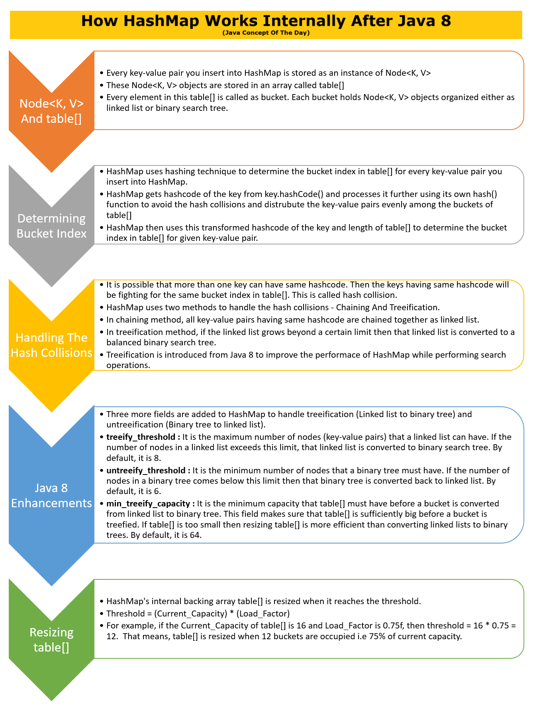
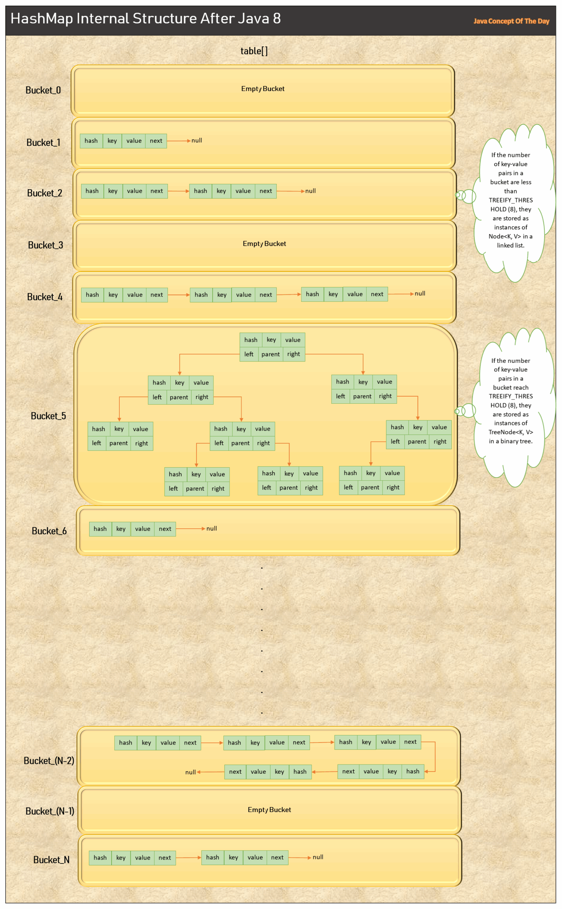

# How HashMap Works Internally After Java 8?

HashMap is the most used data structure in Java because it almost gives average time performance of O(1) for put and get operations irrespective of how big is the data. As you already know, HashMap stores the data in the form of key-value pairs. In this post, we will see HashMap internal structure, how HashMap works internally after Java 8, how it stores its elements to give O(1) performance for put and get operations and what are the enhancements made to HashMap in Java 8.



## How HashMap Works Internally After Java 8 :

### 1) Node<K, V> And table[]
HashMap stores the data in the form of key-value pairs. Every key-value pair you insert into HashMap is stored as an instance of Node<K,V> class. Node<K,V> is a static inner class of HashMap which is defined as below.

```java
static class Node<K,V> implements Map.Entry<K,V> 
{
        final int hash;
        final K key;
        V value;
        Node<K,V> next;

        //Some methods are defined here
}
```
As you see, this inner class has four fields – hash, key, value and next.

**key :** It stores the key of an element and it is final.

**value :** It holds the value of an element.

**hash :** It holds the hashcode of the key and it is also final.

**next :** It holds the pointer to next key-value pair. This attribute makes the key-value pairs stored as a linked list.

Before Java 8, this Node<K,V> class was named as Entry<K,V>. From Java 8, they have changed name to Node to be realistic as key-value pairs are stored as nodes of a linked list or a binary tree.

These Node<K, V> objects are stored in an array called Bucket Array which is named as table[].

```java
transient Node<K,V>[] table;
```

Every element in this table[] is called as Bucket. Each bucket holds Node<K, V> objects organized as linked list.

This array is initially of size 16 (Default Capacity) and can be resized whenever necessary. whenever resized, size of this array is doubled i.e 16 to 32 to 64 to 128 and so on.

### 2) Determining / Calculating Bucket Index

HashMap uses hashing technique to determine the bucket index in table[] array for every key-value pair you insert into HashMap.

The whole HashMap data structure is based on the principle of Hashing. Hashing is nothing but the function or algorithm or method which when applied on any object/variable returns an unique integer value representing that object/variable. This unique integer value is called hashcode. Hash function or simply hash said to be the best if it returns the same hashcode each time it is called on the same object. Two objects can have same hashcode.

HashMap has its own hash() function which internally calls key.hashCode(). hash() function of HashMap processes the hashcode returned by key.hashCode() further as below.

```java
static final int hash(Object key) 
{
        int h;
        return (key == null) ? 0 : (h = key.hashCode()) ^ (h >>> 16);
}
```

(h = key.hashCode()) ^ (h >>> 16) part in the above code is a combination of XOR operation (^) and right bit shift operation (>>>). They mix the upper bits of hashcode with the lower bits thoroughly. This technique is used by the HashMap to prevent the hash collisions and distribute the key-value pairs evenly across the buckets of table[].

HashMap then uses this transformed hashcode of the key and length of table[] to determine the bucket index for the given key-value pair as below.

```java
int index = (n - 1) & hash;

//Where n is the length of table[] and hash is the transformed hashcode of the key
```

### 3) Handling The Hash Collisions
It is possible that more than one key can have same hashcode. Then the keys having same hashcode will be fighting for same bucket index in table[]. In such cases, all key-value pairs fighting for the same bucket index are chained together as linked list (Before Java 8). This is called chaining.

But from Java 8, if this linked list grows beyond certain limit (Default is 8) then that linked list is converted to a balanced binary search tree. This is called treeification.

Before Java 8, chaining was the preferred method to handle the hash collisions. But from Java 8, treeification is also added to improve the performance of look-up operation.

Searching an element in linked list takes O(n) time in worst case scenario i.e going through almost all of elements in a linked list to search for an element. But, searching an element in binary search tree takes O(log n) time in worst case scenario. Thus significantly improving the performance of search operation in HashMap.

### 4) Java 8 Enhancements
Before Java 8, chaining is used to handle the hash collisions. In chaining method, keys having same hashcode are organized as linked list in a bucket. But, searching an element in linked list takes O(n) time. This downgrades the performance of HashMap significantly while performing the search operation.

To overcome this issue, treeification is introduced from Java 8 to handle the hash collisions. According to treeification, if the linked list in a bucket grows beyond a certain limit, then that linked list is converted to a balanced binary search tree.

If this binary tree shrinks to a certain limit (due to removal or resizing of HashMap) then that binary tree is converted back to linked list. This is called untreeification. Untreeification is carried out because tree nodes need more space than linked list nodes.

To implement the treeification and untreeification, three more fields are added to HashMap from Java 8.

**treeify_threshold :**

It is the maximum number of nodes (key-value pairs) that a linked list can have. If the number of nodes in a linked list exceeds this limit, that linked list is converted to binary search tree. By default, it is 8.

**untreeify_threshold :**

It is the minimum number of nodes that a binary tree must have. If the number of nodes in a binary tree comes under this limit then that binary tree is converted back to linked list. By default, it is 6.

**min_treeify_capacity :**

It is the minimum capacity that an array of buckets (table[]) must have before a bucket is converted from linked list to binary tree. This field makes sure that table[] is sufficiently big before a bucket is treefied. If table[] is too small then resizing table[] is more efficient than converting linked lists to binary trees. By default, it is 64.

### 5) Resizing table[]

HashMap‘s internal backing array table[] is resized when the number of entries (key-value pairs) reaches the threshold. Threshold is the product of current capacity and load factor.

```java
Threshold = (Current_Capacity) * (Load_Factor)
```

Where Current_Capacity is the current length of table[] and Load_Factor is supplied while creating HashMap. If it is not supplied, by default, it will be 0.75f.

Let’s assume that Current_Capacity of table[] is 16 and Load_Factor is 0.75f, then threshold will be,

```java
Threshold = (Current_Capacity) * (Load_Factor)

Threshold = 16 * 0.75

Threshold = 12
```

That means, table[] is resized when 12th element is inserted into HashMap i.e 75% of current capacity. And whenever table[] is resized, it is doubled in size.

Resizing table[] is a costly affair in HashMap. It is both time and space consuming as all existing key-value pairs have to be placed in new table[] with larger size after calculating all their bucket index again. So, it is wise to choose the initial capacity of HashMap by keeping number of expected entries in mind so that resizing doesn’t take place more often.

## HashMap Internal Structure After Java 8 :
Below image best describes the HashMap internal structure after Java 8.



## How put() method of HashMap works?

put() method of HashMap is used to insert a key-value pair into HashMap. Below is the step by step explanation of put() method.

Step 1 : Hashcode of the key is calculated by calling hash() which internally calls key.hashCode().

Step 2 : HashMap then uses this transformed hashcode of the key and length of table[] to calculate the bucket index.

Step 3 : If the bucket at the calculated index is empty, a new Node<K,V> is created and inserted in that bucket.

If the bucket is not empty, checks whether a bucket is a linked list or a binary tree.

If it is binary tree, TreeNode<K, V> is created and inserted into that tree if key doesn’t exist. If key already exists in tree, old value is replaced with new value.

If it is linked list, Node<K, V> is created and inserted at the end of the linked list if key doesn’t exist. If key already exists in linked list, old value is replaced with new value.

If the number of nodes in a linked list exceed TREEIFY_THRESHOLD after inserting current element, then that linked list is converted to binary tree.

Step 4 : If the number of entries in table[] exceeds THRESHOLD (Current_Capacity * Load_Factor) after inserting current entry, then table[] is resized to double of it’s current capacity and rehashing takes place.

Below is the simplified source code of put() method.

```java
public V put(K key, V value) 
{
        return putVal(hash(key), key, value, false, true);
}

final V putVal(int hash, K key, V value, boolean onlyIfAbsent, boolean evict) 
{
        Node<K,V>[] tab; Node<K,V> p; int n, i;

        //Resize if table is empty
        if ((tab = table) == null || (n = tab.length) == 0)
            n = (tab = resize()).length;

        //If the bucket index is empty
        if ((p = tab[i = (n - 1) & hash]) == null)
        {
            tab[i] = newNode(hash, key, value, null);
        }
        //If the bucket index is not empty
        else 
        {
            Node<K,V> e; K k;

            //If the key already exist
            if (p.hash == hash &&
                ((k = p.key) == key || (key != null && key.equals(k))))
                e = p;

            //Handling tree nodes
            else if (p instanceof TreeNode)
                e = ((TreeNode<K,V>)p).putTreeVal(this, tab, hash, key, value);
            else 
            {
                //Adding new Node at the end of the linked list
                for (int binCount = 0; ; ++binCount) 
                {
                    if ((e = p.next) == null) 
                    {
                        p.next = newNode(hash, key, value, null);
                        
                        // If the number of nodes in a linked list exceeds Treeify_Threshold, bucket is treefied
                        if (binCount >= TREEIFY_THRESHOLD - 1) 
                            treeifyBin(tab, hash);
                        break;
                    }
                    if (e.hash == hash &&
                        ((k = e.key) == key || (key != null && key.equals(k))))
                        break;
                    p = e;
                }
            }

            //If the key already exist, old value is replaced with new value
            if (e != null) 
            { 
                V oldValue = e.value;
                if (!onlyIfAbsent || oldValue == null)
                    e.value = value;
                afterNodeAccess(e);
                return oldValue;
            }
        }
        ++modCount;

        //Resize table[] if size exceeds threshold
        if (++size > threshold)
            resize();

        afterNodeInsertion(evict);
        return null;
}
```

## How get() method of HashMap works?
get() method of HashMap is used to retrieve an element from HashMap.

Step 1 : HashCode of the key is calculated by calling hash() which internally calls key.hashCode() (Same as in put() method).

Step 2 : Bucket index is extracted by using this transformed hashcode of the key and length of table[] (Same as in put() method)

Step 3 : If the bucket at the calculated index is empty, returns null.

If the bucket is not empty,

Sequential search is performed if the bucket is linked list and value is returned if matching key is found otherwise returns null.

Tree search is performed if the bucket is binary tree and value is returned if matching key is found otherwise returns null.

Below is the simplified source code of get() method.

```java
public V get(Object key) {
        Node<K,V> e;
        return (e = getNode(key)) == null ? null : e.value;
    }

final Node<K,V> getNode(Object key) 
{
    Node<K,V>[] tab; Node<K,V> first, e; int n, hash; K k;

    //If table is not empty
    if ((tab = table) != null && (n = tab.length) > 0 &&
        (first = tab[(n - 1) & (hash = hash(key))]) != null) 
    {
        if (first.hash == hash && // always check first node
            ((k = first.key) == key || (key != null && key.equals(k))))
            return first;
        if ((e = first.next) != null) 
        {
            //Performing tree search if bucket is a tree
            if (first instanceof TreeNode)
                return ((TreeNode<K,V>)first).getTreeNode(hash, key);

            //Performing sequential search in linked list 
            do 
            {
                if (e.hash == hash &&
                    ((k = e.key) == key || (key != null && key.equals(k))))
                    return e;
            } while ((e = e.next) != null);
        }
    }
    return null;
}
```