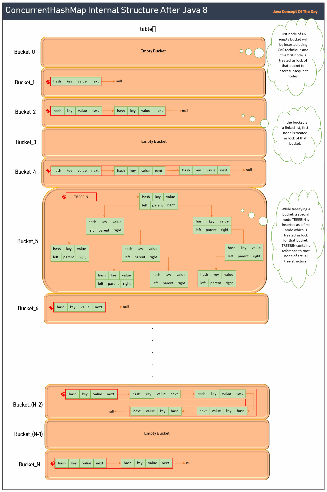

# How ConcurrentHashMap Works Internally After Java 8?
ConcurrentHashMap is a thread-safe implementation of Map interface. You can also say that ConcurrentHashMap is a thread-safe version of HashMap. ConcurrentHashMap is specially designed for use in highly multi threaded environment where frequent read/write operations are to be executed simultaneously. In this post, we will see ConcurrentHashMap internal structure after Java 8, ConcurrentHashMap internal locking system and how ConcurrentHashMap works internally after Java 8?

## ConcurrentHashMap Internal Structure After Java 8 :
ConcurrentHashMap internally structured same as HashMap. ConcurrentHashMap also internally maintains an array of buckets where each bucket contains key-value pairs stored as linked list or as binary tree (Java 8+) if the number of key-value pairs in a bucket exceed TREEIFY_THRESHOLD.

With addition to these things, ConcurrentHashMap maintains bucket level locking system to achieve the thread safeness. In the bucket level locking system, each bucket is locked. Any thread wants to perform write operations on a bucket, has to acquire the lock of that bucket and enter into it. Only one thread can enter into a bucket at any given time. Other threads which want to write on the same bucket have to wait. But, read operations are lock free. Any thread wants to read from a bucket, it can do so without acquiring the lock of that bucket.

### 1) Core Internal Data Structures
ConcurrentHashMap internally maintains an array of Node<K, V> called table[] same as in HashMap. But here, table[] is declared as volatile which makes sure that any changes made to it by one thread are immediately visible to other threads.

```java
transient volatile Node<K,V>[] table;
```

* Elements of this table[] are called as buckets or bins.
* Each bucket holds key-value pairs stored either as linked list or as binary tree if the number of key-value pairs in a bucket reach TREEIFY_THRESHOLD (8, by default).
* If it is linked list, key-value pairs will be stored as instances of Node<K, V>.
* If it is binary tree, key-value pairs will be stored as instances of TreeNode<K, V> which is the subclass of Node<K, V>.

The core internal data structure of ConcurrentHashMap is same as HashMap.

### 2) Locking System
After Java 8, ConcurrentHashMap uses two techniques to achieve the synchronization – CAS (Compare And Swap) technique and Fine Grained Locking System.

**CAS (Compare And Swap) :**

CAS is a technique used by the systems to achieve the synchronization without traditional locks like synchronized blocks or reentrant locks. In CAS, entire write operation is carried out as a single, indivisible atomic operation without interruption by any other threads.

CAS (Compare And Swap) operation first compares the value at a specific memory location with given expected value. If the value at memory location matches with expected value, then only that value is replaced with new value. If value doesn’t match, it returns value at that memory location indicating that value is already updated by another thread. This entire compare and swap are executed as one atomic operation without intervention of other threads. CAS is a lock-free and non-blocking technique.

**Fine Grained Locking System :**

In fine grained locking system, a smallest possible unit is locked. In ConcurrentHashMap case, bucket is the smallest unit that is locked. Any thread wants to perform write operation on a bucket, has to acquire lock of that bucket.

ConcurrentHashMap uses CAS technique to insert a first node into a bucket and this first node is treated as lock of that bucket to insert subsequent nodes. But, there is one problem with this strategy.

If the bucket is a linked list, first node remains constant and there will be no problem to treat it as lock of a bucket. If the bucket is a binary tree, first node (root node) changes sometimes. There will be a problem if we treat root node of a tree as lock of a bucket.

To solve this problem, ConcurrentHashMap inserts a special node called TreeBin as a first node of a bucket while treeifying a bucket. TreeBin node doesn’t contain any key and value. It just holds reference to root node of actual tree structure.

All read operations on a bucket are lock-free and non-blocking. It is achieved using volatile reads. These reads make sure that latest updated value is read.

**Segmentation:**

Before Java 8, ConcurrentHashMap uses segmentation for synchronization. In segmentation, map is divided into number of segments (16, by default). Each segment will have their own lock and each segment behaves as independent Hash table. Any thread wants to write into segment, have to acquire lock of that segment. Read operations are lock free. Disadvantage of segmentation is that level of concurrency is limited and it depends on number of segments.

Below image best describes the ConcurrentHashMap Internal Structure after Java 8.



## How ConcurrentHashMap Works Internally After Java 8 :

**1) Resizing :**
After Java 8, resizing process of ConcurrentHashMap is non-blocking, carried out by multiple threads concurrently and co-operatively. Before Java 8, it uses full blocking strategy to resize where entire map is locked and moved from old table to new table by a single thread.

Below is the step by step process of resizing ConcurrentHashMap after Java 8.

**Step 1 :** Whenever a thread finds out that ConcurrentHashMap has reached threshold, it triggers resizing process. It creates a new table with double the capacity of current table and start transferring the buckets from old table to new table.

**Step 2 :** Other threads which are accessing the old table find out that resizing is happening, they don’t wait. Instead they also start transferring the buckets from old table to new table. This co-operative approach further speeds up the resizing process.

sizeCtl, MIN_TRANSFER_STRIDE and transferIndex are three fields which are used by ConcurrentHashMap to achieve this.

**sizeCtl :** It will be negative if it is resizing. It will be -(1 + number of active resizing threads). It is used by the threads to check whether resizing is happening or not.

**MIN_TRANSFER_STRIDE :** It is the minimum number of buckets each thread will get to transfer from old table to new table.

**transferIndex :** It is initially pointed at the end of the old table and decremented as buckets are transferred from old table to new table.

**Step 3 :** When all the contents of a bucket are moved from old table to new table, a special node ForwardingNode is placed in that bucket. It indicates that all contents of this bucket are moved to new table and those threads which want to read/write this bucket can refer to new table. ForwardingNode holds the reference to new table.

**Step 4 :** After all the buckets are transferred from old table to new table, new table replaces old table and old table is vanished.

### 2) Writing : put, remove, replace…
Below is step by step process of write operations on a bucket.

**Step 1 :** Hashcode of the key is calculated (Same as in HashMap).

Step 2 : Index of the bucket is calculated using transformed hashcode of the key and length of table[] (same as in HashMap).

**Step 3 :** If the target bucket is empty, a new Node<K, V> is inserted using CAS, a lock-free synchronization technique if it is put() method. If it is remove() or replace() methods, a null is returned or does nothing indicating key doesn’t exist.

**Step 4 :** If the target bucket is not empty, a thread will try to acquire the lock on the first node of a bucket (linked list or binary tree). This is usually done using synchronized keyword on first node.

**Step 5 :** Once the lock is acquired, a thread traverses that bucket (linked list or binary tree) to find the matching key.

If the matching key is found, a value is updated (for put and replace methods) and key is deleted if it remove().

If matching key is not found, a new node is inserted into linked list or a binary tree if it is put() method. if it is replace() or remove() method, a null will be returned or nothing is done indicating key doesn’t exist.

**Step 6 :** If the number of key-value pairs exceed threshold after inserting a new node, resize is triggered.

**Step 7 :** Finally, a thread releases the lock of the bucket.

### 3) Reading : get, containsKey, size…
All read operations on ConcurrentHashMap are lock-free and non-blocking. Threads don’t need lock of a bucket to read. Read operations on a ConcurrentHashMap are volatile reads. Volatile reads extract recently written value from the memory. This makes sure that the threads will always get to see the most up-to-date value.