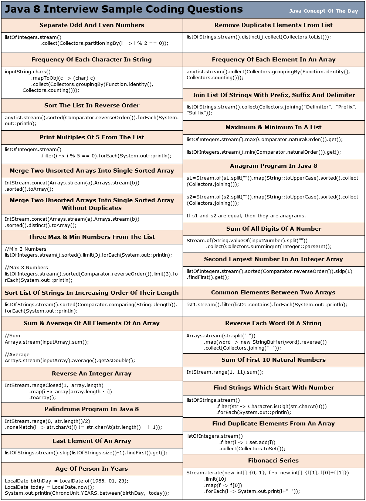

# Java 8 Interview Sample Coding Questions


## 1) Given a list of integers, separate odd and even numbers?

```java
import java.util.Arrays;
import java.util.List;
import java.util.Map;
import java.util.Map.Entry;
import java.util.Set;
import java.util.stream.Collectors;
 
public class Java8Code 
{
    public static void main(String[] args) 
    {
        List<Integer> listOfIntegers = Arrays.asList(71, 18, 42, 21, 67, 32, 95, 14, 56, 87);
         
        Map<Boolean, List<Integer>> oddEvenNumbersMap = 
                listOfIntegers.stream().collect(Collectors.partitioningBy(i -> i % 2 == 0));
         
        Set<Entry<Boolean, List<Integer>>> entrySet = oddEvenNumbersMap.entrySet();
         
        for (Entry<Boolean, List<Integer>> entry : entrySet) 
        {
            System.out.println("--------------");
             
            if (entry.getKey())
            {
                System.out.println("Even Numbers");
            }
            else
            {
                System.out.println("Odd Numbers");
            }
             
            System.out.println("--------------");
             
            List<Integer> list = entry.getValue();
             
            for (int i : list)
            {
                System.out.println(i);
            }
        }
    }
}

Output :

————–
Odd Numbers
————–
71
21
67
95
87
————–
Even Numbers
————–
18
42
32
14
56
```

## 2) How do you remove duplicate elements from a list using Java 8 streams?

```java
import java.util.Arrays;
import java.util.List;
import java.util.stream.Collectors;
 
public class Java8Code 
{
    public static void main(String[] args) 
    {
        List<String> listOfStrings = Arrays.asList("Java", "Python", "C#", "Java", "Kotlin", "Python");
         
        List<String> uniqueStrngs = listOfStrings.stream().distinct().collect(Collectors.toList());
         
        System.out.println(uniqueStrngs);
    }
}

Output :

[Java, Python, C#, Kotlin]
```
## 3) How do you find frequency of each character in a string using Java 8 streams?

```java
import java.util.Map;
import java.util.function.Function;
import java.util.stream.Collectors;
 
public class Java8Code 
{
    public static void main(String[] args) 
    {
        String inputString = "Java Concept Of The Day";
         
        Map<Character, Long> charCountMap = 
                    inputString.chars()
                                .mapToObj(c -> (char) c)
                                .collect(Collectors.groupingBy(Function.identity(), Collectors.counting()));
         
        System.out.println(charCountMap);
    }
}

Output :

{ =4, a=3, c=1, C=1, D=1, e=2, f=1, h=1, J=1, n=1, O=1, o=1, p=1, T=1, t=1, v=1, y=1}
```

## 4) How do you find frequency of each element in an array or a list?

```java
import java.util.Arrays;
import java.util.List;
import java.util.Map;
import java.util.function.Function;
import java.util.stream.Collectors;
 
public class Java8Code 
{
    public static void main(String[] args) 
    {
        List<String> stationeryList = Arrays.asList("Pen", "Eraser", "Note Book", "Pen", "Pencil", "Stapler", "Note Book", "Pencil");
         
        Map<String, Long> stationeryCountMap = 
                stationeryList.stream().collect(Collectors.groupingBy(Function.identity(), Collectors.counting()));
         
        System.out.println(stationeryCountMap);
    }
}

Output :

{Pen=2, Stapler=1, Pencil=2, Note Book=2, Eraser=1}

```

## 5) How do you sort the given list of decimals in reverse order?

```java
import java.util.Arrays;
import java.util.Comparator;
import java.util.List;
 
public class Java8Code 
{
    public static void main(String[] args) 
    {
        List<Double> decimalList = Arrays.asList(12.45, 23.58, 17.13, 42.89, 33.78, 71.85, 56.98, 21.12);
         
        decimalList.stream().sorted(Comparator.reverseOrder()).forEach(System.out::println);
    }
}

Output :

71.85
56.98
42.89
33.78
23.58
21.12
17.13
12.45
```

## 6) Given a list of strings, join the strings with ‘[‘ as prefix, ‘]’ as suffix and ‘,’ as delimiter?

```java

import java.util.Arrays;
import java.util.List;
import java.util.stream.Collectors;
 
public class Java8Code 
{
    public static void main(String[] args) 
    {
        List<String> listOfStrings = Arrays.asList("Facebook", "Twitter", "YouTube", "WhatsApp", "LinkedIn");
         
        String joinedString = listOfStrings.stream().collect(Collectors.joining(", ", "[", "]"));
         
        System.out.println(joinedString);
    }
}

Output :

[Facebook, Twitter, YouTube, WhatsApp, LinkedIn]
```

## 7) From the given list of integers, print the numbers which are multiples of 5?

```java
import java.util.Arrays;
import java.util.List;
 
public class Java8Code 
{
    public static void main(String[] args) 
    {
        List<Integer> listOfIntegers = Arrays.asList(45, 12, 56, 15, 24, 75, 31, 89);
         
        listOfIntegers.stream().filter(i -> i % 5 == 0).forEach(System.out::println);
    }
}

Output :

45
15
75
```

## 8) Given a list of integers, find maximum and minimum of those numbers?

```java
import java.util.Arrays;
import java.util.Comparator;
import java.util.List;
 
public class Java8Code 
{
    public static void main(String[] args) 
    {
        List<Integer> listOfIntegers = Arrays.asList(45, 12, 56, 15, 24, 75, 31, 89);
         
        int max = listOfIntegers.stream().max(Comparator.naturalOrder()).get();
         
        System.out.println("Maximum Element : "+max);
         
        int min = listOfIntegers.stream().min(Comparator.naturalOrder()).get();
         
        System.out.println("Minimum Element : "+min);
    }
}

Output :

Maximum Element : 89
Minimum Element : 12

```

## 9) How do you merge two unsorted arrays into single sorted array using Java 8 streams?

```java
import java.util.Arrays;
import java.util.stream.IntStream;
 
public class Java8Code 
{
    public static void main(String[] args) 
    {
        int[] a = new int[] {4, 2, 7, 1};
         
        int[] b = new int[] {8, 3, 9, 5};
         
        int[] c = IntStream.concat(Arrays.stream(a), Arrays.stream(b)).sorted().toArray();
         
        System.out.println(Arrays.toString(c));
    }
}

Output :

[1, 2, 3, 4, 5, 7, 8, 9]
```

## 10) How do you merge two unsorted arrays into single sorted array without duplicates?

```java
import java.util.Arrays;
import java.util.stream.IntStream;
 
public class Java8Code 
{
    public static void main(String[] args) 
    {
        int[] a = new int[] {4, 2, 5, 1};
         
        int[] b = new int[] {8, 1, 9, 5};
         
        int[] c = IntStream.concat(Arrays.stream(a), Arrays.stream(b)).sorted().distinct().toArray();
         
        System.out.println(Arrays.toString(c));
    }
}

Output :

[1, 2, 4, 5, 8, 9]
```

## 11) How do you get three maximum numbers and three minimum numbers from the given list of integers?

```java
import java.util.Arrays;
import java.util.Comparator;
import java.util.List;
 
public class Java8Code 
{
    public static void main(String[] args) 
    {
        List<Integer> listOfIntegers = Arrays.asList(45, 12, 56, 15, 24, 75, 31, 89);
         
        //3 minimum Numbers
         
        System.out.println("-----------------");
         
        System.out.println("Minimum 3 Numbers");
         
        System.out.println("-----------------");
         
        listOfIntegers.stream().sorted().limit(3).forEach(System.out::println);
         
        //3 Maximum Numbers
         
        System.out.println("-----------------");
         
        System.out.println("Maximum 3 Numbers");
         
        System.out.println("-----------------");
         
listOfIntegers.stream().sorted(Comparator.reverseOrder()).limit(3).forEach(System.out::println);
    }
}

Output :

—————–
Minimum 3 Numbers
—————–
12
15
24
—————–
Maximum 3 Numbers
—————–
89
75
56

```

## 12) Java 8 program to check if two strings are anagrams or not?

```java
import java.util.stream.Collectors;
import java.util.stream.Stream;
 
public class Java8Code 
{
    public static void main(String[] args) 
    {
        String s1 = "RaceCar";
        String s2 = "CarRace";
         
        s1 = Stream.of(s1.split("")).map(String::toUpperCase).sorted().collect(Collectors.joining());
         
        s2 = Stream.of(s2.split("")).map(String::toUpperCase).sorted().collect(Collectors.joining());
         
        if (s1.equals(s2)) 
        {
            System.out.println("Two strings are anagrams");
        }
        else
        {
            System.out.println("Two strings are not anagrams");
        }
    }
}

Output :

Two strings are anagrams
```

## 13) Find sum of all digits of a number in Java 8?

```java
import java.util.stream.Collectors;
import java.util.stream.Stream;
 
public class Java8Code 
{
    public static void main(String[] args) 
    {
        int i = 15623;
         
        Integer sumOfDigits = Stream.of(String.valueOf(i).split("")).collect(Collectors.summingInt(Integer::parseInt));
         
        System.out.println(sumOfDigits);
    }
}

Output :

17
```

## 14) Find second largest number in an integer array?

```java
import java.util.Arrays;
import java.util.Comparator;
import java.util.List;
 
public class Java8Code 
{
    public static void main(String[] args) 
    {
        List<Integer> listOfIntegers = Arrays.asList(45, 12, 56, 15, 24, 75, 31, 89);
         
        Integer secondLargestNumber = listOfIntegers.stream().sorted(Comparator.reverseOrder()).skip(1).findFirst().get();
         
        System.out.println(secondLargestNumber);
    }
}

Output :

75
```

## 15) Given a list of strings, sort them according to increasing order of their length?

```java
import java.util.Arrays;
import java.util.Comparator;
import java.util.List;
 
public class Java8Code 
{
    public static void main(String[] args) 
    {
        List<String> listOfStrings = Arrays.asList("Java", "Python", "C#", "HTML", "Kotlin", "C++", "COBOL", "C");
         
        listOfStrings.stream().sorted(Comparator.comparing(String::length)).forEach(System.out::println);
    }
}

Output :

C
C#
C++
Java
HTML
COBOL
Python
Kotlin
```

## 16) Given an integer array, find sum and average of all elements?

```java
import java.util.Arrays;
 
public class Java8Code 
{
    public static void main(String[] args) 
    {
        int[] a = new int[] {45, 12, 56, 15, 24, 75, 31, 89};
         
        int sum = Arrays.stream(a).sum();
         
        System.out.println("Sum = "+sum);
         
        double average = Arrays.stream(a).average().getAsDouble();
         
        System.out.println("Average = "+average);
    }
}

Output :

Sum = 347
Average = 43.375
```

## 17) How do you find common elements between two arrays?

```java
import java.util.Arrays;
import java.util.List;
 
public class Java8Code 
{
    public static void main(String[] args) 
    {
        List<Integer> list1 = Arrays.asList(71, 21, 34, 89, 56, 28);
         
        List<Integer> list2 = Arrays.asList(12, 56, 17, 21, 94, 34);
         
        list1.stream().filter(list2::contains).forEach(System.out::println);
    }
}

Output :

21
34
56
```

## 18) Reverse each word of a string using Java 8 streams?

```java
import java.util.Arrays;
import java.util.stream.Collectors;
 
public class Java8Code 
{
    public static void main(String[] args) 
    {
        String str = "Java Concept Of The Day";
         
        String reversedStr = Arrays.stream(str.split(" "))
                                    .map(word -> new StringBuffer(word).reverse())
                                    .collect(Collectors.joining(" "));
         
        System.out.println(reversedStr);
    }
}

Output :

avaJ tpecnoC fO ehT yaD
```

## 19) How do you find sum of first 10 natural numbers?

```java
import java.util.stream.IntStream;
 
public class Java8Code 
{
    public static void main(String[] args) 
    {
        int sum = IntStream.range(1, 11).sum();
         
        System.out.println(sum);
    }
}

Output :

55
```

## 20) Reverse an integer array

```java
import java.util.Arrays;
import java.util.stream.IntStream;
 
public class Java8Code 
{
    public static void main(String[] args) 
    {
        int[] array = new int[] {5, 1, 7, 3, 9, 6};
         
        int[] reversedArray = IntStream.rangeClosed(1, array.length).map(i -> array[array.length - i]).toArray();
         
        System.out.println(Arrays.toString(reversedArray));
    }
}

Output :

[6, 9, 3, 7, 1, 5]
```

## 21) Print first 10 even numbers

```java
import java.util.stream.IntStream;
 
public class Java8Code 
{
    public static void main(String[] args) 
    {
        IntStream.rangeClosed(1, 10).map(i -> i * 2).forEach(System.out::println);
    }
}

Output :

2
4
6
8
10
12
14
16
18
20
```

## 22) How do you find the most repeated element in an array?

```java
import java.util.Arrays;
import java.util.List;
import java.util.Map;
import java.util.Map.Entry;
import java.util.function.Function;
import java.util.stream.Collectors;
 
public class Java8Code 
{
    public static void main(String[] args) 
    {
        List<String> listOfStrings = Arrays.asList("Pen", "Eraser", "Note Book", "Pen", "Pencil", "Pen", "Note Book", "Pencil");
         
        Map<String, Long> elementCountMap = listOfStrings.stream()
                                                         .collect(Collectors.groupingBy(Function.identity(), Collectors.counting()));
         
        Entry<String, Long> mostFrequentElement = elementCountMap.entrySet().stream().max(Map.Entry.comparingByValue()).get();
         
        System.out.println("Most Frequent Element : "+mostFrequentElement.getKey());
         
        System.out.println("Count : "+mostFrequentElement.getValue());
    }
}

Output :

Most Frequent Element : Pen
Count : 3
```

## 23) Palindrome program using Java 8 streams

```java
import java.util.stream.IntStream;
 
public class Java8Code 
{
    public static void main(String[] args) 
    {
        String str = "ROTATOR";
         
        boolean isItPalindrome = IntStream.range(0, str.length()/2).
                noneMatch(i -> str.charAt(i) != str.charAt(str.length() - i -1));
          
        if (isItPalindrome)
        {
            System.out.println(str+" is a palindrome");
        }
        else
        {
            System.out.println(str+" is not a palindrome");
        }
    }
}

Output :

ROTATOR is a palindrome
```

## 24) Given a list of strings, find out those strings which start with a number?

```java
import java.util.Arrays;
import java.util.List;
 
public class Java8Code 
{
    public static void main(String[] args) 
    {
        List<String> listOfStrings = Arrays.asList("One", "2wo", "3hree", "Four", "5ive", "Six");
         
        listOfStrings.stream().filter(str -> Character.isDigit(str.charAt(0))).forEach(System.out::println);
    }
}

Output :

2wo
3hree
5ive
```

## 25) How do you extract duplicate elements from an array?

```java
import java.util.Arrays;
import java.util.HashSet;
import java.util.List;
import java.util.Set;
import java.util.stream.Collectors;
 
public class Java8Code 
{
    public static void main(String[] args) 
    {
        List<Integer> listOfIntegers = Arrays.asList(111, 222, 333, 111, 555, 333, 777, 222);
         
        Set<Integer> uniqueElements = new HashSet<>();
         
        Set<Integer> duplicateElements = listOfIntegers.stream().filter(i -> ! uniqueElements.add(i)).collect(Collectors.toSet());
         
        System.out.println(duplicateElements);
    }
}

Output :

[333, 222, 111]
```

## 26) Print duplicate characters in a string?

```java
import java.util.Arrays;
import java.util.HashSet;
import java.util.Set;
import java.util.stream.Collectors;
 
public class Java8Code 
{
    public static void main(String[] args) 
    {
        String inputString = "Java Concept Of The Day".replaceAll("\\s+", "").toLowerCase();
         
        Set<String> uniqueChars = new HashSet<>();
         
        Set<String> duplicateChars = 
                Arrays.stream(inputString.split(""))
                        .filter(ch -> ! uniqueChars.add(ch))
                        .collect(Collectors.toSet());
         
        System.out.println(duplicateChars);
    }
}

Output :

[a, c, t, e, o]
```

## 27) Find first repeated character in a string?

```java
import java.util.Arrays;
import java.util.LinkedHashMap;
import java.util.Map;
import java.util.function.Function;
import java.util.stream.Collectors;
 
public class Java8Code 
{
    public static void main(String[] args) 
    {
        String inputString = "Java Concept Of The Day".replaceAll("\\s+", "").toLowerCase();
         
        Map<String, Long> charCountMap = 
                            Arrays.stream(inputString.split(""))
                                    .collect(Collectors.groupingBy(Function.identity(), LinkedHashMap::new, Collectors.counting()));
         
        String firstRepeatedChar = charCountMap.entrySet()
                                                .stream()
                                                .filter(entry -> entry.getValue() > 1)
                                                .map(entry -> entry.getKey())
                                                .findFirst()
                                                .get();
         
        System.out.println(firstRepeatedChar);
    }
}

Output :

a
```

## 28) Find first non-repeated character in a string?

```java
import java.util.Arrays;
import java.util.LinkedHashMap;
import java.util.Map;
import java.util.function.Function;
import java.util.stream.Collectors;
 
public class Java8Code 
{
    public static void main(String[] args) 
    {
        String inputString = "Java Concept Of The Day".replaceAll("\\s+", "").toLowerCase();
         
        Map<String, Long> charCountMap = 
                            Arrays.stream(inputString.split(""))
                                    .collect(Collectors.groupingBy(Function.identity(), LinkedHashMap::new, Collectors.counting()));
         
        String firstNonRepeatedChar = charCountMap.entrySet()
                                                .stream()
                                                .filter(entry -> entry.getValue() == 1)
                                                .map(entry -> entry.getKey())
                                                .findFirst()
                                                .get();
         
        System.out.println(firstNonRepeatedChar);
    }
}

Output :

j
```

## 29) Fibonacci series

```java
import java.util.stream.Stream;
 
public class Java8Code 
{
    public static void main(String[] args) 
    {
        Stream.iterate(new int[] {0, 1}, f -> new int[] {f[1], f[0]+f[1]})
                .limit(10)
                .map(f -> f[0])
                .forEach(i -> System.out.print(i+" "));
    }
}

Output :

0 1 1 2 3 5 8 13 21 34
```

## 30) First 10 odd numbers

```java
import java.util.stream.Stream;
 
public class Java8Code 
{
    public static void main(String[] args) 
    {
        Stream.iterate(new int[] {1, 3}, f -> new int[] {f[1], f[1]+2})
                .limit(10)
                .map(f -> f[0])
                .forEach(i -> System.out.print(i+" "));
    }
}

Output :

1 3 5 7 9 11 13 15 17 19
```

## 31) How do you get last element of an array?

```java

import java.util.Arrays;
import java.util.List;
 
public class Java8Code 
{
    public static void main(String[] args) 
    {
        List<String> listOfStrings = Arrays.asList("One", "Two", "Three", "Four", "Five", "Six");
         
        String lastElement = listOfStrings.stream().skip(listOfStrings.size() - 1).findFirst().get();
         
        System.out.println(lastElement);
    }
}

Output :

Six
```

## 32) Find the age of a person in years if the birthday has given?

```java
import java.time.LocalDate;
import java.time.temporal.ChronoUnit;
 
public class Java8Code 
{
    public static void main(String[] args) 
    {
        LocalDate birthDay = LocalDate.of(1985, 01, 23);
        LocalDate today = LocalDate.now();
         
        System.out.println(ChronoUnit.YEARS.between(birthDay, today));
    }
}
```