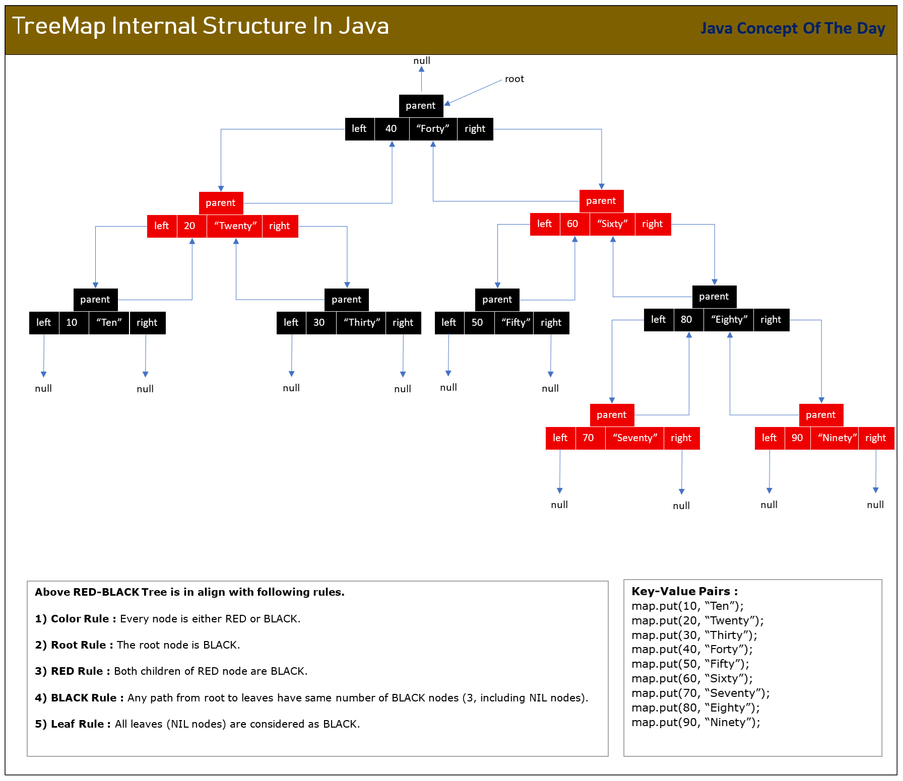

# How TreeMap Works Internally In Java?

TreeMap is a sorted map which sorts the key-value pairs according to supplied comparator. If comparator is not supplied, key-value pairs are sorted according to natural ordering of keys. TreeMap internally uses Red-Black tree – a self balancing binary search tree – to store its elements. TreeMap gives O(log n) performance for all operations – insertion, search and removal – in all possible scenarios – best, average and worst case. In this post, we will see TreeMap internal structure and how it works internally in Java.

## TreeMap Internal Structure In Java :

TreeMap, unlike HashMap, LinkedHashMap, ConcurrentHashMap or any other hash based data structures, doesn’t use hashing and array of buckets to store its elements. TreeMap internally uses Red-Black tree to store it’s elements.

### 1) Red-Black Tree :

Red-Black tree is a self-balancing binary search tree which uses color of a node – either RED or BLACK – to re-balance itself after each insertion and deletion. This self-balancing nature of Red-Black tree is critical in maintaining TreeMap’s O(log n) time complexity for insertion, deletion and search operations in worst-case scenarios also.

Red-Black tree follows following rules to re-structure and re-balance itself after each insertion and removal operation.

1) Color Rule : Every node must be either RED or BLACK.

2) Root Rule : The root must be always BLACK.

3) RED Rule : If a node is RED, then both of its children must be BLACK.

4) BLACK Rule : Any path from root to NIL nodes (Leaves) must have same number of BLACK nodes.

5) Leaf Rule : All leaves (NIL nodes) must be BLACK.

Along with above 5 rules, Red-Black tree follows rule of a binary search tree where all values in left subtree are less than value of a node and all values in right subtree are greater than value of a node. This rule holds true for every single node of a Red-Black tree.

### 2) Core Internal Data Structure
Every key-value pair of a TreeMap are stored as instances of Entry<K, V> class. These Entry<K, V> instances are stored as nodes of a Red-Black tree.

Entry<K, V> is a static inner class of TreeMap which is defined as below.

```java
static final class Entry<K,V> implements Map.Entry<K,V> 
{
        K key;                  //Key
        V value;                //Value
        Entry<K,V> left;        //Pointer to left child
        Entry<K,V> right;       //Pointer to right child
        Entry<K,V> parent;      //Pointer to parent 
        boolean color = BLACK;  //Responsible for maintaining RED-BLACK tree rules
}
```
**Important TreeMap fields :**

```java
//Root of Red-Black tree
private transient Entry<K,V> root;      

//Comparator
private final Comparator<? super K> comparator;    

//Defining color of a node
private static final boolean RED   = false;
private static final boolean BLACK = true;

//Number of key-value pairs in the map
private transient int size = 0;

//Number of structural modifications to the tree.
private transient int modCount = 0;
```

**TreeMap Internal Methods To Maintain RED-BLACK Tree Rules :** 

```java
//Method to re-balance Red-Black tree after each insertion
fixAfterInsertion();   

//Method to re-balance Red-Black tree after each deletion
fixAfterDeletion();
```



## How TreeMap Works Internally In Java?

### 1) Insertion Operations : put(), putIfAbsent(), putAll(), compute()…

**Step 1 :** First checks whether TreeMap is empty. If it is empty, specified key-value pair is inserted as root of the internal Red-Black tree.

```java
Entry<K,V> t = root;
if (t == null) 
{
            addEntryToEmptyMap(key, value);
            return null;
}
```

where addEntryToEmptyMap() is an internal utility method of TreeMap which inserts given key-value pair into an empty map.

 ```java
 private void addEntryToEmptyMap(K key, V value) 
{
        compare(key, key); // type (and possibly null) check
        root = new Entry<>(key, value, null);    //Creates new Entry and makes it root
        size = 1;    //Size incremented
        modCount++;  //Structural modifications count incremented 
}
```

**Step 2 :** If TreeMap is not empty, internal Red-Black tree is traversed to find parent node to insert given key-value pair as a child of that parent node.

Starting from the root of the tree until parent node is found, given key is compared with key of every node using comparator or using natural comparator of keys if comparator is not specified.

if given key is smaller than key of a node, left subtree of that node is traversed.

If given key is greater than key of a node, right subtree of that node is traversed.

If given key is equal to key of a node, that means given key already exist in the tree. Value is updated with new value. Old value is returned.

```java
int cmp;
Entry<K,V> parent;
Comparator<? super K> cpr = comparator;
 
//If cpr != null i.e if comparator is given, use comparator to compare the keys
//or else use natural comparator of keys to compare the keys

if (cpr != null) 
{      
       //Using given comparator to compare the keys
       do
       {
            parent = t;
            cmp = cpr.compare(key, t.key);
            if (cmp < 0)     //if given key is smaller, go left
                t = t.left;
            else if (cmp > 0)  //if given key is greater, go right
                t = t.right;
            else    
            {   
                //if given key is equal to key of a node, update the value
                V oldValue = t.value;
                if (replaceOld || oldValue == null) 
                {
                    t.value = value;
                }
                return oldValue;
            }
      } while (t != null);
} 
else 
{     
      //Using natural comparator to compare the keys
      Objects.requireNonNull(key);
      @SuppressWarnings("unchecked")
      Comparable<? super K> k = (Comparable<? super K>) key;
      do 
      {
            parent = t;
            cmp = k.compareTo(t.key);
            if (cmp < 0)     //if given key is smaller, go left
                t = t.left;
            else if (cmp > 0)   //if given key is greater, go right
                t = t.right;
            else 
            {//if given key is equal to key of a node, update the value
                    V oldValue = t.value;
                    if (replaceOld || oldValue == null) 
                    {
                        t.value = value;
                    }
                    return oldValue;
             }
        } while (t != null);
}
```

**Step 3 :** After finding the parent node in the tree, addEntry() method is called to add given key-value pair as a child of that parent.

```java
addEntry(key, value, parent, cmp < 0);
```

addEntry() is an utility method of TreeMap which adds new node in the existing tree as a child of a given parent.

```java
private void addEntry(K key, V value, Entry<K, V> parent, boolean addToLeft) 
{
        Entry<K,V> e = new Entry<>(key, value, parent);
        if (addToLeft)    //add to left if key is smaller
            parent.left = e;
        else             //add to right if key is greater
            parent.right = e;
        fixAfterInsertion(e);   //Called to balance Red-Black tree after insertion
        size++;      //size incremented 
        modCount++;  //modifications count incremented 
}
```

**Step 4 :** fixAfterInsertion() method is called to re-balance Red-Black tree after insertion.

```java
fixAfterInsertion();
```

**Step 5 :** Update metadata.

```java
size++;   
modCount++; 
```

## 2) Search Operations : get(), containsKey()….

All search operations on TreeMap internally call getEntry() which do core search operation on Red-Black tree. Search operation on Red-Black tree is always binary search.

**Step 1 :** First get the comparator. Use this comparator to compare the given key with key of a node. If comparator is not given, use natural comparator of keys to compare the keys.

```java
Comparator<? super K> cpr = comparator;

int cmp = cpr.compare(k, p.key);   //Using comparator to compare the keys

int cmp = k.compareTo(p.key);    //Using natural comparator to compare the keys
```

**Step 2 :** Starting from the root of a tree till NIL nodes, given key is compared with key of a node.

If given key is smaller, left subtree is traversed.

If given key is greater, right subtree is traversed.

If given key is equal to key of a node, returns node. Otherwise returns null.

```java
Entry<K,V> p = root;

while (p != null) 
{
            int cmp = cpr.compare(k, p.key);    //or k.compareTo(p.key);

            if (cmp < 0)    //If key is smaller, go left
                p = p.left;
            else if (cmp > 0)   //If key is greater, go right
                p = p.right;
            else      //If given key is equal to key of a node
                return p;    //return node
}

return null;     //otherwise return null
```

## 3) Removal Operations : remove(), removeAll(), retainAll()…
All removal operations on TreeMap first locate the entry using getEntry() method. After locating the entry, call deleteEntry() which performs deletion from Red-Black tree.

```java
public V remove(Object key) 
{
        Entry<K,V> p = getEntry(key);
        if (p == null)
            return null;

        V oldValue = p.value;
        deleteEntry(p);
        return oldValue;
}
```

where deleteEntry() is an internal method which deletes node from the tree.

Here is the step by step process of removal operation.

**Step 1 :** First find the node to be removed using getEntry() method. If key is not found, return null.

```java
Entry<K,V> p = getEntry(key);

if (p == null)
      return null;
```

**Step 2 :** If node to be deleted has two children, find valid successor and swap with it.

```java
if (p.left != null && p.right != null) 
{
       Entry<K,V> s = successor(p);
       p.key = s.key;
       p.value = s.value;
       p = s;
}
```

**Step 3 :** If node to be deleted has only one child, replace that child with node to be deleted by updating it’s parent’s pointers.

```java
Entry<K,V> replacement = (p.left != null ? p.left : p.right);

if (replacement != null) 
{
       // Link replacement to parent
       replacement.parent = p.parent;
       if (p.parent == null)
           root = replacement;
       else if (p == p.parent.left)
           p.parent.left  = replacement;
       else
           p.parent.right = replacement;

       // Null out links so they are OK to use by fixAfterDeletion.
       p.left = p.right = p.parent = null;

       // Fix replacement
       if (p.color == BLACK)
           fixAfterDeletion(replacement);
}
```

**Step 4 :** If node to be deleted is the root of the tree, delete node by assigning null to root.

```java
else if (p.parent == null) 
{ 
       // return if we are the only node.
       root = null;
}
```

**Step 5 :** If node to be deleted has no children, delete it by unlinking.

```java
else 
{ 
       //  No children. Use self as phantom replacement and unlink.
       if (p.color == BLACK)
            fixAfterDeletion(p);

       if (p.parent != null) 
       {
           if (p == p.parent.left)
               p.parent.left = null;
           else if (p == p.parent.right)
               p.parent.right = null;
           p.parent = null;
       }
}
```

**Step 6 :** If deleted node is BLACK, fixAfterDeletion() is called to rebalance the Red-Black tree for each cases.

**Step 7 :** Update the metadata.

```java
modCount++;
size--;
```